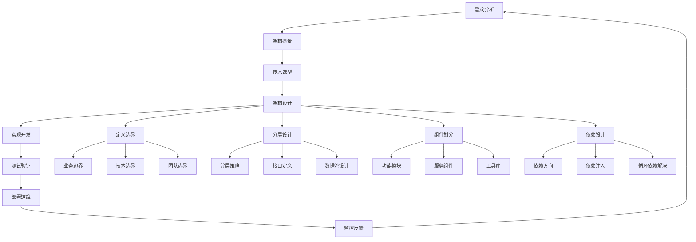
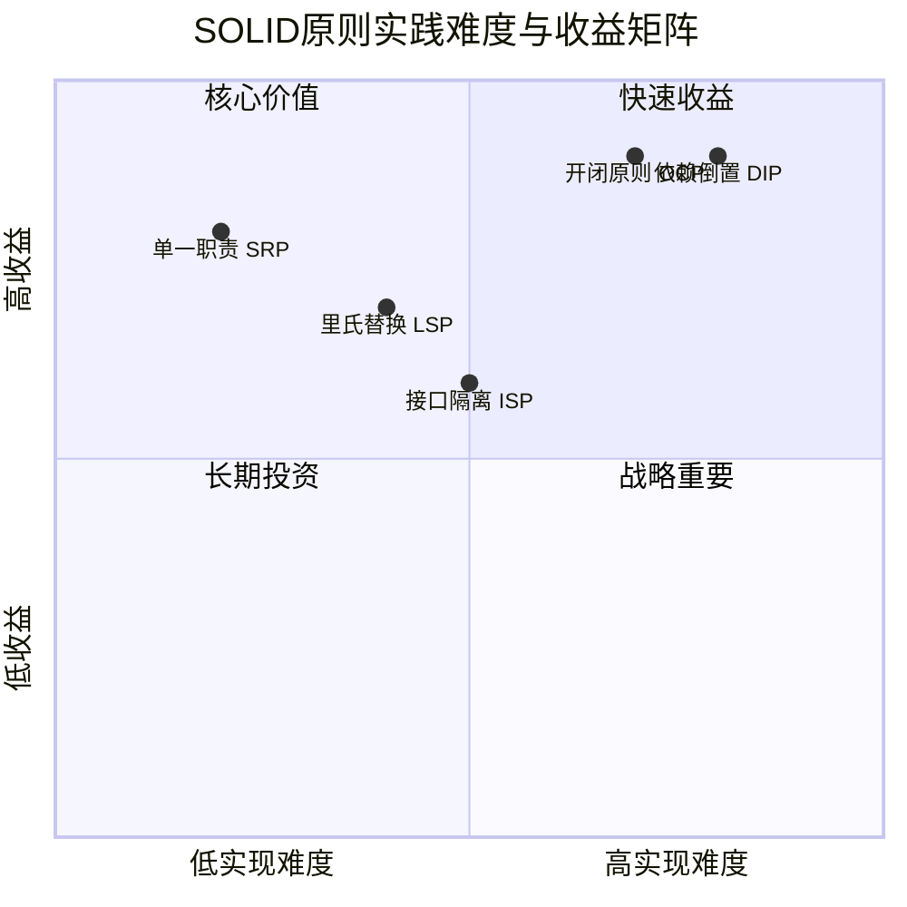
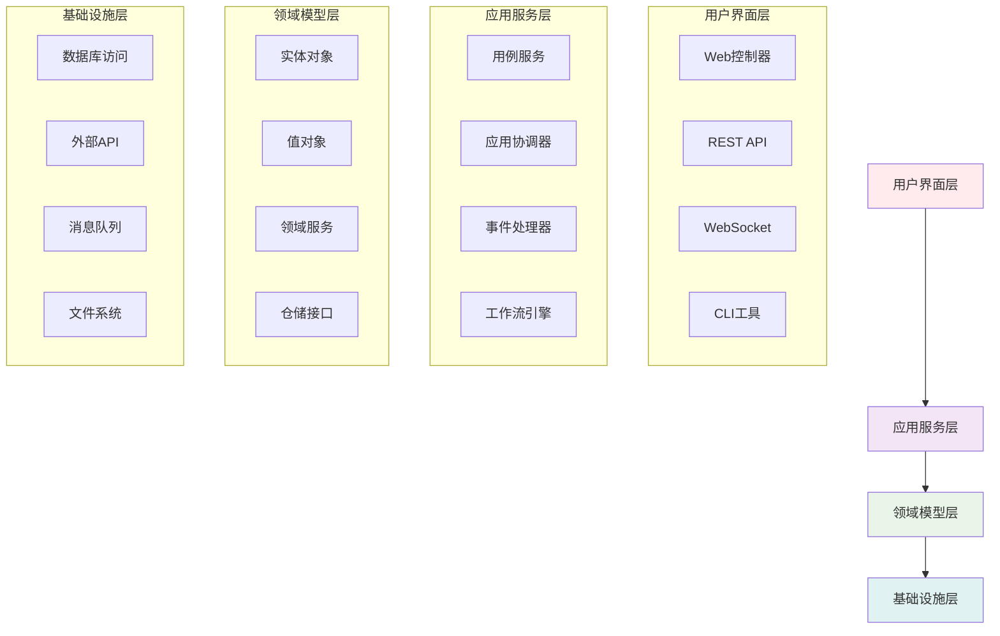
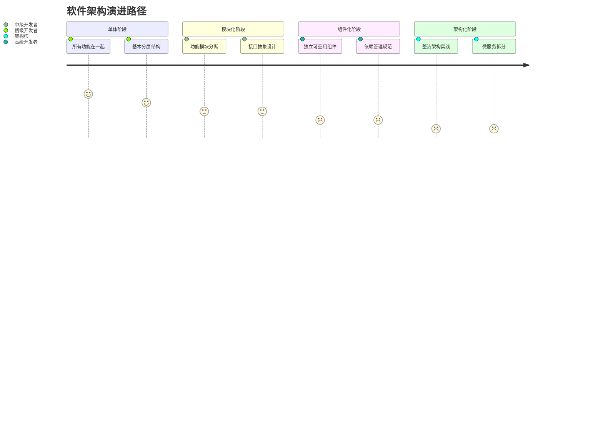
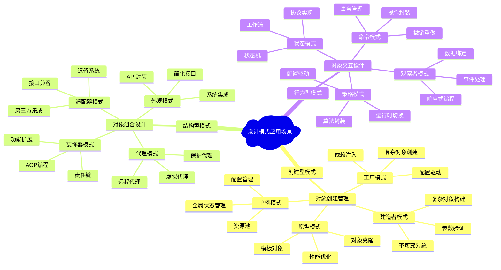
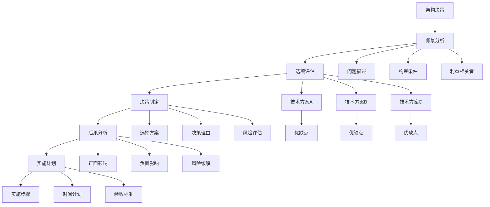
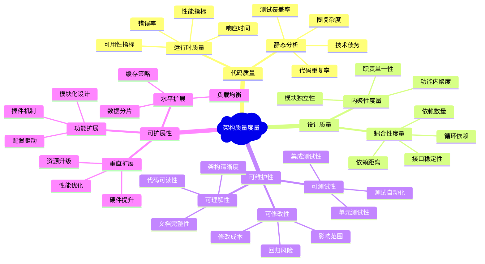
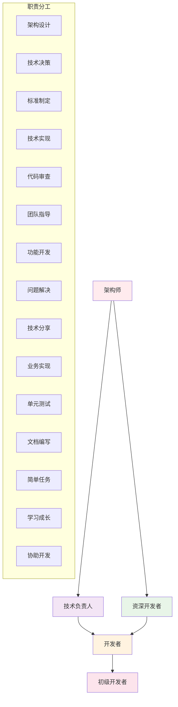
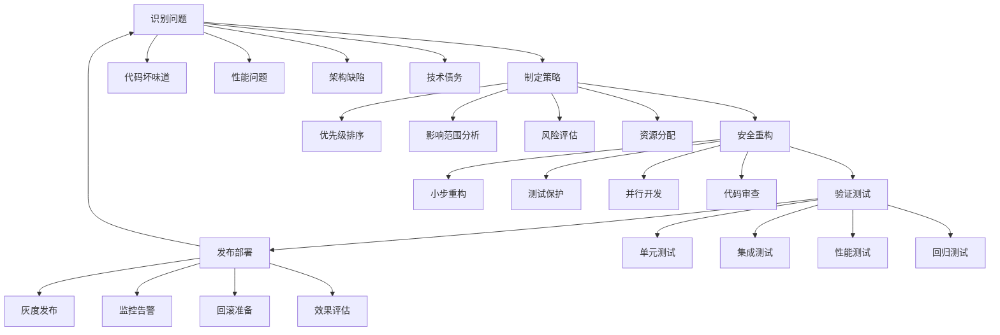

# 🧠 架构知识架构总览

基于《架构整洁之道》读书笔记，以下是软件架构完整知识体系的架构图。

## 📊 完整知识架构图

```mermaid
flowchart TD
    A[软件架构知识体系] --> B[设计原则]
    A --> C[组件设计]
    A --> D[架构模式]
    A --> E[实践方法]
    A --> F[质量保证]

    B --> B1[SOLID原则]
    B --> B2[其他原则]
    B --> B3[设计模式]
    B --> B4[代码质量]

    B1 --> B1a[单一职责 SRP]
    B1 --> B1b[开闭原则 OCP]
    B1 --> B1c[里氏替换 LSP]
    B1 --> B1d[接口隔离 ISP]
    B1 --> B1e[依赖倒置 DIP]

    B2 --> B2a[DRY原则]
    B2 --> B2b[KISS原则]
    B2 --> B2c[YAGNI原则]
    B2 --> B2d[Tell Don't Ask]

    B3 --> B3a[创建型模式]
    B3 --> B3b[结构型模式]
    B3 --> B3c[行为型模式]

    B4 --> B4a[命名规范]
    B4 --> B4b[函数设计]
    B4 --> B4c[注释规范]
    B4 --> B4d[测试覆盖]

    C --> C1[内聚性]
    C --> C2[耦合性]
    C --> C3[组件生命周期]
    C --> C4[依赖管理]

    C1 --> C1a[功能内聚 REP]
    C1 --> C1b[共同闭包 CCP]
    C1 --> C1c[共同重用 CRP]
    C1 --> C1d[时序内聚]

    C2 --> C2a[循环依赖]
    C2 --> C2b[依赖方向]
    C2 --> C2c[接口隔离]
    C2 --> C2d[模块化]

    C3 --> C3a[组件创建]
    C3 --> C3b[生命周期管理]
    C3 --> C3c[状态管理]
    C3 --> C3d[资源释放]

    C4 --> C4a[依赖注入]
    C4 --> C4b[控制反转]
    C4 --> C4c[服务定位]
    C4 --> C4d[模块注册]

    D --> D1[分层架构]
    D --> D2[六边形架构]
    D --> D3[整洁架构]
    D --> D4[微服务架构]

    D1 --> D1a[表现层]
    D1 --> D1b[业务层]
    D1 --> D1c[持久层]
    D1 --> D1d[数据库层]

    D2 --> D2a[应用核心]
    D2 --> D2b[端口]
    D2 --> D2c[适配器]
    D2 --> D2d[基础设施]

    D3 --> D3a[实体层]
    D3 --> D3b[用例层]
    D3 --> D3c[接口适配器]
    D3 --> D3d[框架驱动]

    D4 --> D4a[服务划分]
    D4 --> D4b[API网关]
    D4 --> D4c[服务发现]
    D4 --> D4d[数据一致性]

    E --> E1[架构设计流程]
    E --> E2[实现策略]
    E --> E3[重构技巧]
    E --> E4[团队协作]

    E1 --> E1a[需求分析]
    E1 --> E1b[架构决策]
    E1 --> E1c[技术选型]
    E1 --> E1d[文档记录]

    E2 --> E2a[迭代开发]
    E2 --> E2b[测试驱动]
    E2 --> E2c[持续集成]
    E2 --> E2d[代码审查]

    E3 --> E3a[识别坏味道]
    E3 --> E3b[重构手法]
    E3 --> E3c[安全重构]
    E3 --> E3d[性能优化]

    E4 --> E4a[架构评审]
    E4 --> E4b[知识分享]
    E4 --> E4c[标准制定]
    E4 --> E4d[工具支持]

    F --> F1[代码质量]
    F --> F2[测试策略]
    F --> F3[性能优化]
    F --> F4[安全性]

    F1 --> F1a[静态分析]
    F1 --> F1b[代码度量]
    F1 --> F1c[技术债务]
    F1 --> F1d[重构计划]

    F2 --> F2a[单元测试]
    F2 --> F2b[集成测试]
    F2 --> F2c[端到端测试]
    F2 --> F2d[测试金字塔]

    F3 --> F3a[性能监控]
    F3 --> F3b[瓶颈分析]
    F3 --> F3c[缓存策略]
    F3 --> F3d[数据库优化]

    F4 --> F4a[安全编码]
    F4 --> F4b[依赖扫描]
    F4 --> F4c[安全测试]
    F4 --> F4c[合规性检查]
```

## 🎯 架构设计流程图

## 📈 SOLID原则实践矩阵

## 🏗️ 架构层次关系图

## 🔄 组件演进路径

## 🎨 设计模式应用场景

## 🛠️ 架构决策记录 (ADR) 模板

## 📊 架构质量度量指标

## 🎯 团队协作模式

## 🔄 重构策略

## 📚 学习路径建议

### 🎯 不同角色的学习重点

#### **初级开发者**
1. **基础原则** - 重点学习SOLID原则基础
2. **代码质量** - 掌握代码整洁之道
3. **设计模式** - 学习常用设计模式
4. **测试技能** - 编写高质量的单元测试

#### **中级开发者**
1. **架构思维** - 培养系统性思考能力
2. **组件设计** - 掌握组件化开发方法
3. **重构技巧** - 学会安全重构代码
4. **性能优化** - 理解性能优化的方法

#### **高级开发者**
1. **架构设计** - 设计大型系统架构
2. **技术决策** - 做出合理的技术选择
3. **团队协作** - 指导团队技术实践
4. **持续改进** - 建立技术改进机制

#### **架构师**
1. **战略规划** - 制定技术发展战略
2. **标准制定** - 建立开发标准和规范
3. **风险评估** - 识别和管理技术风险
4. **创新引领** - 引导技术创新和应用

### 🔧 实践项目建议

#### **个人项目**
- **重构现有代码** - 应用SOLID原则重构遗留代码
- **设计小系统** - 从零开始设计一个完整的系统
- **实现设计模式** - 在实际项目中应用设计模式
- **性能优化** - 优化系统的性能瓶颈

#### **团队项目**
- **架构设计评审** - 参与团队架构设计决策
- **代码标准制定** - 制定团队的代码质量标准
- **重构计划执行** - 组织和执行大型重构项目
- **技术分享** - 在团队中分享架构经验

---

**文档创建时间**: 2025-12-17
**基于书籍**: 《架构整洁之道》Clean Architecture
**知识覆盖**: 从基础原则到高级架构实践的完整体系