# 📚 游戏引擎架构 (Game Engine Architecture) 读书笔记

## 📖 基本信息

- **原名**: Game Engine Architecture
- **作者**: Jason Gregory
- **出版社**: CRC Press / Taylor & Francis Group
- **出版年份**: 2018年（第3版）
- **作者背景**: Naughty Dog（顽皮狗）工作室资深程序员，参与《最后生还者》、《神秘海域》系列开发
- **创建时间**: 2026年2月7日
- **难度等级**: 高级
- **阅读状态**: 📖 准备开始
- **个人评分**: ⭐⭐⭐⭐⭐
- **标签**: #游戏开发 #引擎架构 #系统设计 #实时渲染 #性能优化

## 📝 内容概要

### 书籍定位

《游戏引擎架构》是游戏开发领域的**系统架构指南**，而非单纯的编程教程。作者从多年开发AAA游戏的经验出发，深入探讨了一个完整的商业级游戏引擎应该如何设计和实现。

**本书的核心价值**：
- 揭示了商业游戏引擎的内部架构
- 阐述了各个子系统的设计原理和权衡
- 展示了如何构建高性能、可扩展的实时系统
- 提供了大量来自真实项目的实践经验

### 核心设计哲学

```
┌─────────────────────────────────────────────────────────────┐
│                    游戏引擎设计的三大目标                      │
├─────────────────────────────────────────────────────────────┤
│                                                             │
│  ┌─────────────┐    ┌─────────────┐    ┌─────────────┐     │
│  │   高性能     │    │  可扩展性    │    │  可维护性    │     │
│  │  60FPS+     │    │  跨平台支持  │    │  模块化设计  │     │
│  │  低延迟     │    │  易于定制   │    │  清晰架构   │     │
│  └─────────────┘    └─────────────┘    └─────────────┘     │
│                                                             │
│              三者之间的权衡与平衡是设计的核心                    │
└─────────────────────────────────────────────────────────────┘
```

### 全书架构概览

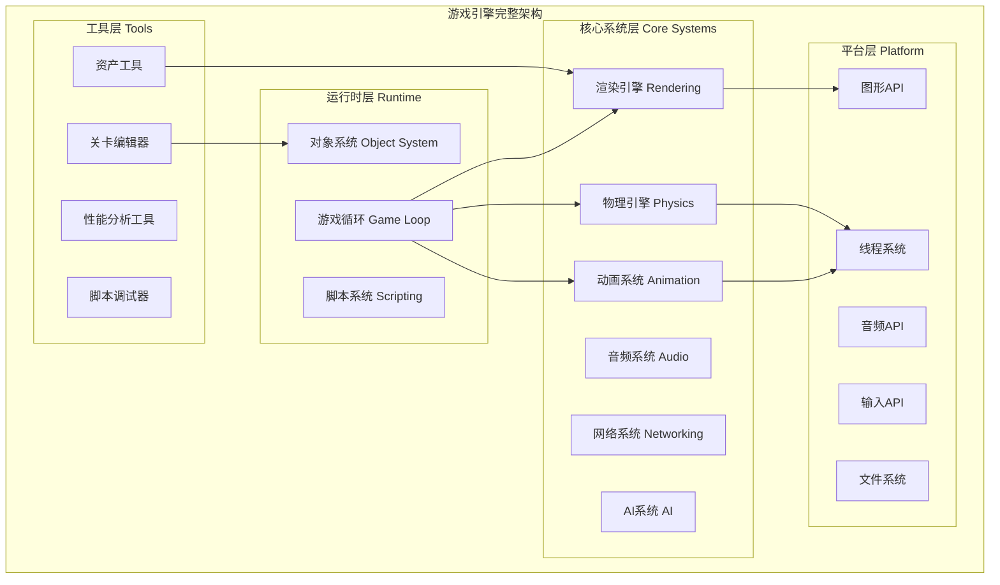

## 🧠 深度知识架构

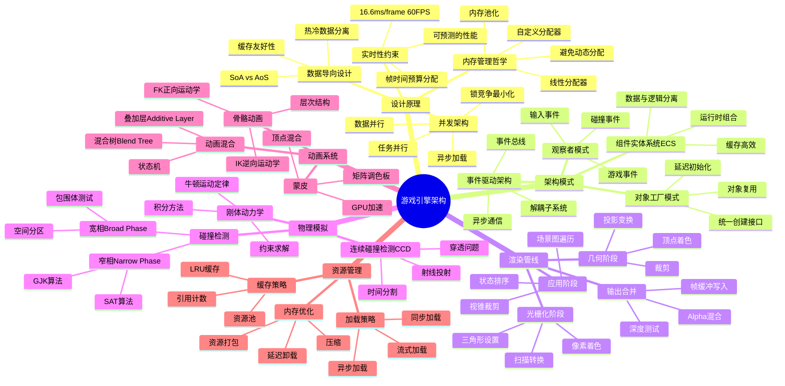

## ✍️ 深度读书笔记

---

## 第一部分：基础篇

### 第1章：导论 - 游戏引擎的本质

#### 1.1 什么是游戏引擎

> **核心观点**：游戏引擎是一个**实时交互式仿真系统**，它必须在严格的时间预算（16.6ms @ 60Hz）内完成所有计算。

游戏引擎与传统软件的区别：

| 维度 | 传统软件 | 游戏引擎 |
|------|----------|----------|
| **时间约束** | 无严格限制 | 必须达到帧率目标 |
| **性能要求** | 响应即可 | 持续高性能 |
| **用户体验** | 功能正确 | 流畅、实时反馈 |
| **资源使用** | 可接受峰值 | 必须稳定可控 |
| **错误容忍** | 可出错 | 尽量避免运行时错误 |

#### 1.2 引擎架构的演进

```
第一代：单一可执行文件 (80年代)
├─ 所有代码都在main()中
├─ 无复用性
└─ 示例：Pong, Space Invaders

    ↓

第二代：函数库 (90年代初)
├─ 抽象出图形、输入等函数
├─ 每个游戏从零开始
└─ 示例：Doom, Quake

    ↓

第三代：引擎化 (90年代末-2000s)
├─ 完整的运行时系统
├─ 工具链集成
├─ 数据驱动
└─ 示例：Unreal Engine, Source Engine

    ↓

第四代：现代化引擎 (2010s-至今)
├─ 模块化架构
├─ 多平台支持
├─ 实时全局光照
├─ 大世界流式加载
└─ 示例：Unreal Engine 5, Unity HDRP
```

#### 1.3 商业引擎的核心组件关系

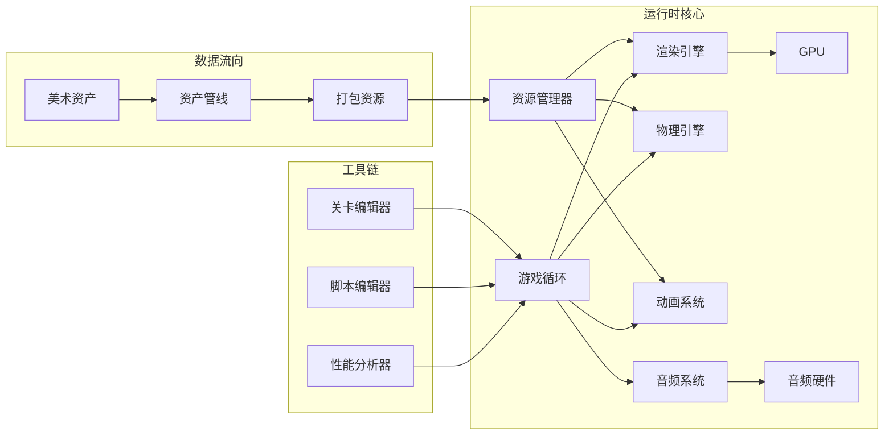

**设计原则**：
1. **数据驱动** - 游戏逻辑与引擎代码分离
2. **模块解耦** - 各子系统通过接口通信
3. **资源抽象** - 统一的资源加载和管理
4. **平台抽象** - 隔离平台相关代码

---

### 第2章：工具链与开发环境

#### 2.1 资产调理管线 (Asset Conditioning Pipeline)

**核心概念**：美术资产（Maya/Max/Photoshop）不能直接用于游戏，需要经过调理管线转换为引擎友好的格式。

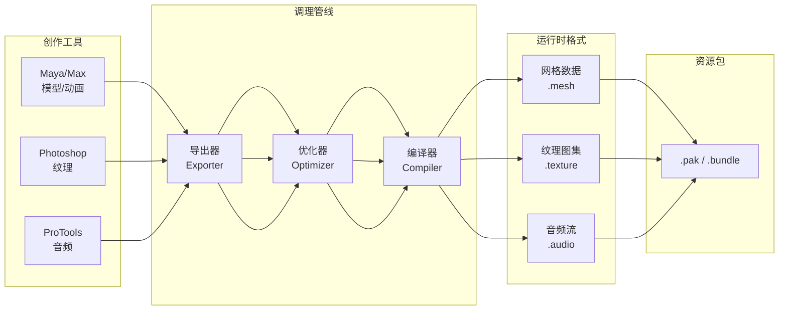

**调理管线的核心功能**：

1. **格式转换**
   - 3D模型 → 内部网格格式
   - PSD/TGA → 压缩纹理格式
   - WAV → 压缩音频格式

2. **数据优化**
   - 网格简化（LOD）
   - 纹理压缩（DXT/ASTC）
   - 音频降采样

3. **平台适配**
   - 针对不同平台的优化
   - 资源变体生成
   - 内存布局调整

4. **元数据生成**
   - 包围盒计算
   - 物理属性生成
   - 预计算数据（光照贴图）

#### 2.2 版本控制策略

| 策略 | 适用场景 | 优缺点 |
|------|----------|--------|
| **Perforce** | 大型AAA团队 | ✅ 支持大文件 ✅ 原子提交 ❌ 集中式 |
| **Git LFS** | 中小团队 | ✅ 分布式 ✅ 灵活分支 ❌ 大文件性能 |
| **混合模式** | 大型项目 | Git代码 + P4资产 |

最佳实践：
- 二进制资产用专门的版本控制系统
- 代码用Git，便于分支和合并
- 建立资产审查流程

---

### 第3章：C++在游戏开发中的最佳实践

#### 3.1 内存对齐的原理

**为什么需要内存对齐**？

```
未对齐访问的性能影响：
┌────────────────────────────────────────────────┐
│ CPU缓存行 (通常64字节)                          │
├────────────────────────────────────────────────┤
│                                                │
│  [数据A] [数据B] [数据C] [数据D]               │
│   ↓        ↓                                  │
│  Cache Miss → 需要两次内存访问                  │
│                                                │
└────────────────────────────────────────────────┘

对齐访问：
┌────────────────────────────────────────────────┐
│  [数据A]  [数据B]  [数据C]  [数据D]            │
│    ↓        ↓                                  │
│  一次访问一个缓存行                             │
└────────────────────────────────────────────────┘
```

**内存对齐规则**：

| 类型 | 对齐要求 | 原因 |
|------|----------|------|
| char | 1字节 | 自然边界 |
| short | 2字节 | 2的幂次 |
| int | 4字节 | 32位CPU总线宽度 |
| float | 4字节 | 同int |
| double | 8字节 | 64位CPU总线宽度 |
| SIMD类型 | 16/32字节 | SSE/AVX指令要求 |

**结构体对齐示例**：

```cpp
// ❌ 未优化：有填充浪费
struct Bad {
    char a;    // 1 byte + 3 padding
    int b;     // 4 bytes
    char c;    // 1 byte + 3 padding
    double d;  // 8 bytes
}; // 总计: 20 bytes

// ✅ 优化后：按大小排序
struct Good {
    double d;  // 8 bytes
    int b;     // 4 bytes
    char a;    // 1 byte
    char c;    // 1 byte
    char _pad[2]; // 显式填充到8的倍数
}; // 总计: 16 bytes
```

#### 3.2 数据局部性原则

**时间局部性 (Temporal Locality)**
- 最近访问的数据很可能再次被访问
- 策略：保持热数据在CPU缓存中

**空间局部性 (Spatial Locality)**
- 相邻内存很可能被连续访问
- 策略：数据在内存中连续存储

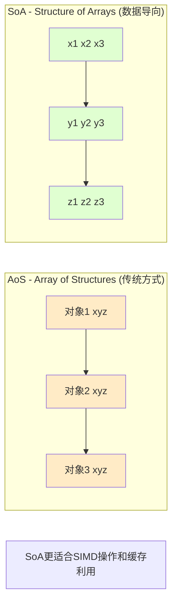

**实际应用**：

```cpp
// AoS - 缓存利用率低
struct ParticleAoS {
    Vec3 position;
    Vec3 velocity;
    float life;
};
ParticleAoS particles[1000];

// 只更新位置时，velocity和life也会被加载到缓存
for (int i = 0; i < 1000; i++) {
    particles[i].position += particles[i].velocity * dt;
}

// SoA - 缓存利用率高
struct ParticleSoA {
    Vec3 positions[1000];
    Vec3 velocities[1000];
    float lives[1000];
};
ParticleSoA particles;

// 只加载需要的数据
for (int i = 0; i < 1000; i++) {
    particles.positions[i] += particles.velocities[i] * dt;
}

// 还可以用SIMD一次处理4个粒子
for (int i = 0; i < 1000; i += 4) {
    __m128 px = _mm_load_ps(&particles.positions[i].x);
    __m128 vx = _mm_load_ps(&particles.velocities[i].x);
    __m128 result = _mm_add_ps(px, _mm_mul_ps(vx, _mm_set1_ps(dt)));
    _mm_store_ps(&particles.positions[i].x, result);
}
```

#### 3.3 RAII 在游戏引擎中的应用

**RAII (Resource Acquisition Is Initialization)** 的核心思想：
- 资源获取即初始化
- 资源释放与对象生命周期绑定
- 异常安全


**游戏引擎中的RAII模式**：

```cpp
// GPU资源管理
class GPUBuffer {
public:
    GPUBuffer(size_t size, BufferUsage usage) {
        id_ = GraphicsDevice::CreateBuffer(size, usage);
    }

    ~GPUBuffer() {
        if (id_ != INVALID_ID) {
            GraphicsDevice::DestroyBuffer(id_);
        }
    }

    // 禁止拷贝（资源独占）
    GPUBuffer(const GPUBuffer&) = delete;
    GPUBuffer& operator=(const GPUBuffer&) = delete;

    // 允许移动（转移所有权）
    GPUBuffer(GPUBuffer&& other) noexcept
        : id_(other.id_), size_(other.size_) {
        other.id_ = INVALID_ID;
    }

private:
    uint32_t id_;
    size_t size_;
};

// 作用域锁定
class ScopedMutexLock {
public:
    explicit ScopedMutexLock(Mutex& mutex) : mutex_(mutex) {
        mutex_.Lock();
    }

    ~ScopedMutexLock() {
        mutex_.Unlock();
    }

private:
    Mutex& mutex_;
};

// 使用示例
void UpdateGameObjects() {
    ScopedMutexLock lock(mutex_); // 自动加锁

    // 临界区代码...

} // 自动解锁（即使异常也会解锁）
```

---

### 第4章：并行与并发编程架构

#### 4.1 并发与并行的区别

```mermaid
graph LR
    subgraph "Concurrency 并发 - 逻辑上的同时"
        A1[任务A] -.交错执行.-> A2[任务B]
        A1 -.继续.-> A3[任务A]
        A2 -.继续.-> A4[任务B]
        style A1 fill:#9cf
        style A2 fill:#fc9
        style A3 fill:#9cf
        style A4 fill:#fc9
    end

    subgraph "Parallelism 并行 - 物理上的同时"
        B1[任务A] <br/>核心1
        B2[任务B] <br/>核心2
        style B1 fill:#9cf
        style B2 fill:#fc9
    end
```

**关键区别**：
- **并发**：同时处理多件事（单核也可以）
- **并行**：同时做多件事（需要多核）

#### 4.2 游戏引擎的并发架构模式

**模式1：功能并行 (Functional Parallelism)**

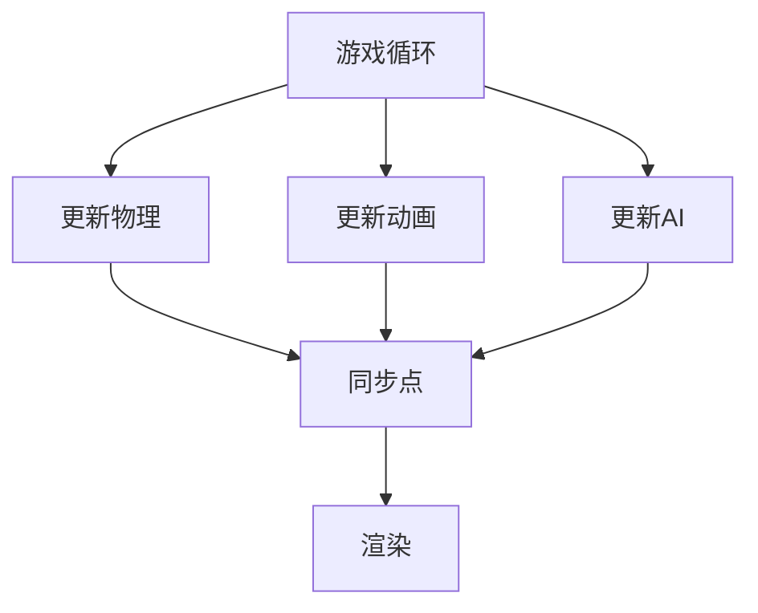

适用于：相对独立的系统
- 物理引擎
- AI系统
- 动画系统

**模式2：数据并行 (Data Parallelism)**

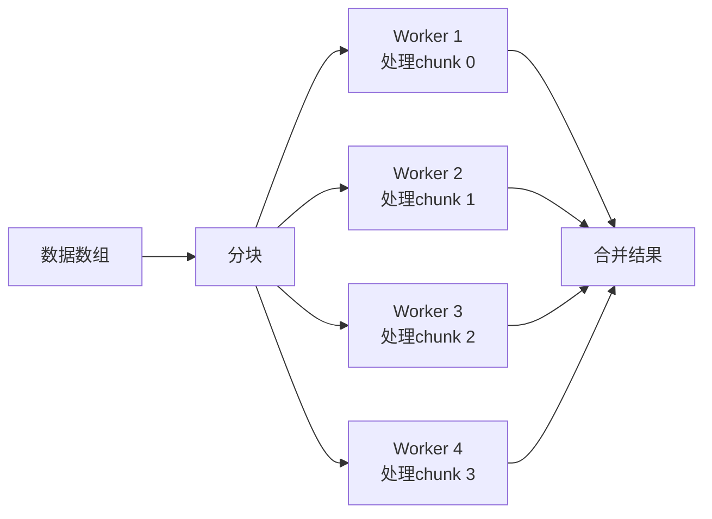

适用于：
- 粒子系统更新
- 碰撞检测
- 动画混合
- 渲染列表构建

**模式3：流水线并行 (Pipelining)**

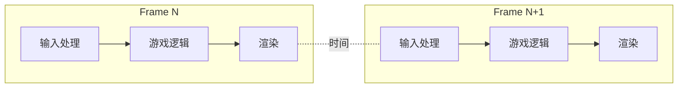

多帧并行，提高吞吐量

#### 4.3 同步原语的选择

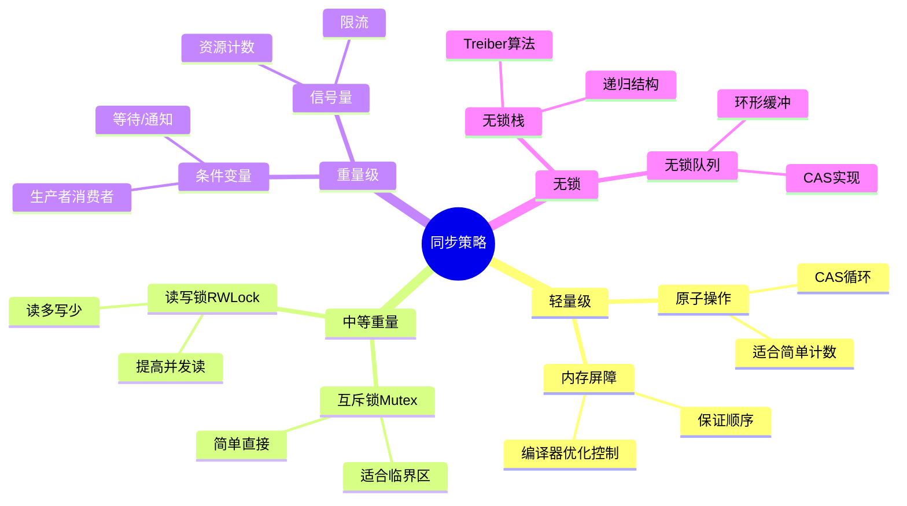

**选择原则**：

| 场景 | 推荐方案 | 原因 |
|------|----------|------|
| 简单计数器 | 原子操作 | 无锁，最快 |
| 保护临界区 | 互斥锁 | 简单可靠 |
| 读多写少 | 读写锁 | 允许并发读 |
| 等待条件 | 条件变量 | 避免忙等待 |
| 高频队列 | 无锁队列 | 避免锁竞争 |

#### 4.4 任务系统架构

现代游戏引擎的核心是**任务调度系统**而非简单的线程池。

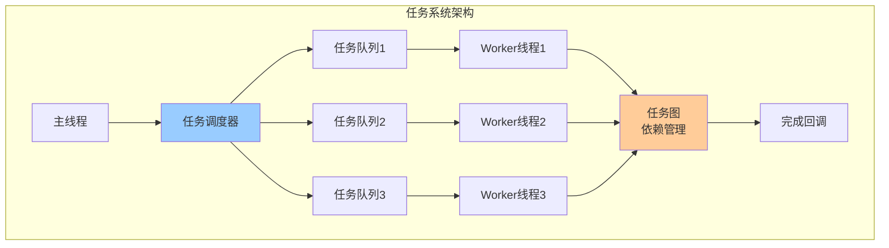

**任务依赖图示例**：

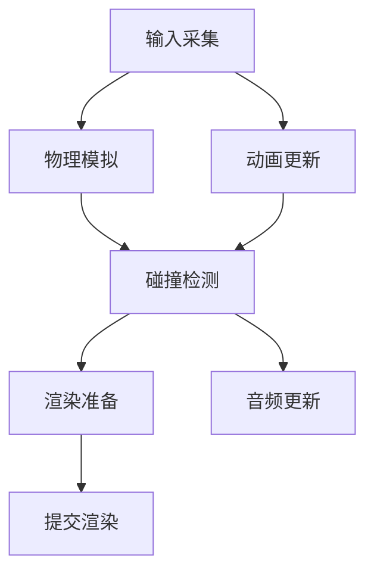

实现关键：
1. **任务声明**：包含依赖关系
2. **拓扑排序**：确定执行顺序
3. **任务窃取**：负载均衡
4. **原子计数器**：跟踪依赖完成

---

### 第5章：游戏3D数学原理

#### 5.1 坐标系变换链

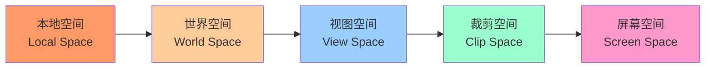

**变换详解**：

1. **模型变换 (Model Transform)**
   ```
   P_world = M_model × P_local
   ```
   - 平移、旋转、缩放
   - 从模型空间到世界空间

2. **视图变换 (View Transform)**
   ```
   P_view = M_view × P_world
   ```
   - 相机位置和朝向
   - 从世界空间到相机空间

3. **投影变换 (Projection Transform)**
   ```
   P_clip = M_proj × P_view
   ```
   - 透视或正交投影
   - 从相机空间到裁剪空间

4. **视口变换 (Viewport Transform)**
   ```
   P_screen = M_viewport × P_ndc
   ```
   - 从NDC到屏幕坐标

#### 5.2 旋转表示的比较

| 表示方法 | 优点 | 缺点 | 适用场景 |
|---------|------|------|----------|
| **欧拉角** | 直观易理解 | 万向锁、插值不平滑 | 角色朝向UI |
| **旋转矩阵** | 变换高效、无奇点 | 9个数字、不可插值 | 变换计算 |
| **四元数** | 插值平滑、无奇点 | 不直观、学习曲线 | 动画、相机 |
| **轴角对** | 直观、紧凑 | 插值复杂 | 约束求解 |

**四元数为何优于欧拉角**：

```
欧拉角插值问题：
┌────────────────────────────────────┐
│  旋转(180°, 0°, 0°)                │
│  插值到 (0°, 180°, 0°)            │
│  → 路径不唯一                     │
│  → 可能出现意外的旋转              │
└────────────────────────────────────┘

四元数插值 (SLERP)：
┌────────────────────────────────────┐
│  q1 ──SLERP──→ q2                 │
│   ✓ 最短路径                      │
│   ✓ 恒定角速度                    │
│   ✓ 平滑过渡                      │
└────────────────────────────────────┘
```

---

## 第二部分：底层引擎系统

### 第6章：内存管理架构

#### 6.1 游戏引擎的内存分配策略

**核心原则**：避免在游戏循环中进行动态内存分配

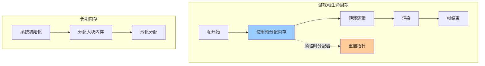

**分配器层次结构**：

```
┌─────────────────────────────────────────────────┐
│                   堆内存                         │
│  ┌───────────────────────────────────────────┐  │
│  │         线性分配器 (帧临时)                │  │
│  │   - 每帧重置                               │  │
│  │   - O(1) 分配                              │  │
│  │   - 不支持单独释放                         │  │
│  └───────────────────────────────────────────┘  │
│  ┌───────────────────────────────────────────┐  │
│  │         池分配器 (固定大小)                │  │
│  │   - 对象池                                 │  │
│  │   - 无碎片                                 │  │
│  │   - O(1) 分配/释放                         │  │
│  └───────────────────────────────────────────┘  │
│  ┌───────────────────────────────────────────┐  │
│  │         堆分配器 (可变大小)                │  │
│  │   - 自定义malloc实现                       │  │
│  │   - 调试功能                               │  │
│  │   - 碎片整理                               │  │
│  └───────────────────────────────────────────┘  │
└─────────────────────────────────────────────────┘
```

#### 6.2 内存池化原理

**为什么池化有效**：

```
不使用池：
┌────────────────────────────────────────────────┐
│  分配对象A                                     │
│  │
│  ├─ malloc() 系统调用 (慢)
│  ├─ 可能触发缺页中断
│  └─ 内存碎片化
│                                                │
│  释放对象A                                     │
│  │
│  └─ free() 留下空洞
└────────────────────────────────────────────────┘

使用池：
┌────────────────────────────────────────────────┐
│  初始化时预分配                                 │
│  │
│  └─ [A][A][A][A][A][A][A][A]... (连续内存)    │
│                                                │
│  运行时分配                                    │
│  │
│  ├─ 从空闲列表取下 (快)
│  ├─ 无系统调用
│  └─ 缓存友好
│                                                │
│  释放                                          │
│  │
│  └─ 放回空闲列表 (可复用)
└────────────────────────────────────────────────┘
```

**对象池实现要点**：

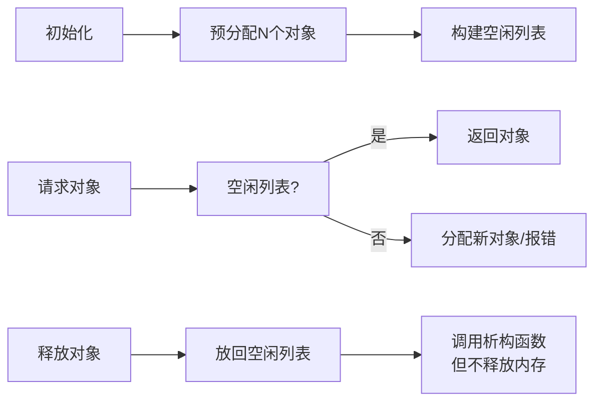

#### 6.3 内存布局优化

**缓存行感知的数据布局**：

```
❌ 错误：跨越缓存行
┌────────────────────────────────────┐
│  Cache Line 0    Cache Line 1      │
│  ┌──────┐        ┌────┐            │
│  │ 对象A │        │ A  │            │
│  │      │        └────┘            │
│  └──────┘         ↓               │
│         ┌──────┐                  │
│         │ 对象B │  (两次缓存加载)   │
│         └──────┘                  │
└────────────────────────────────────┘

✅ 正确：对齐到缓存行
┌────────────────────────────────────┐
│  Cache Line 0    Cache Line 1      │
│  ┌──────┐        ┌──────┐          │
│  │ 对象A │        │ 对象B │         │
│  │      │        │      │          │
│  └──────┘        └──────┘          │
│   (一次加载)       (一次加载)        │
└────────────────────────────────────┘
```

---

### 第7章：资源管理架构

#### 7.1 资源生命周期管理

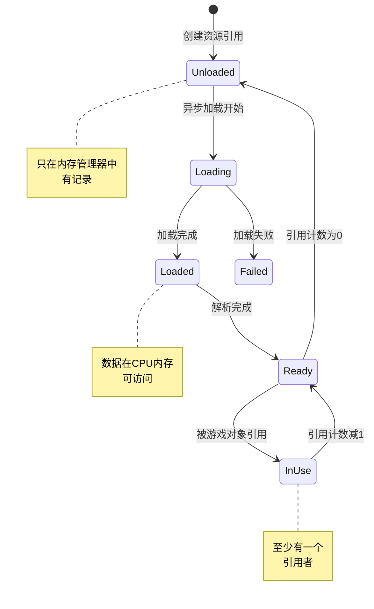

**引用计数策略**：

```
资源引用计数变化：
┌────────────────────────────────────────────────┐
│  Texture* tex = ResourceManager::Load(...)    │
│  // 引用计数: 0 → 1                          │
│                                                │
│  mesh->SetTexture(tex);                       │
│  // 引用计数: 1 → 2                          │
│                                                │
│  mesh2->SetTexture(tex);                      │
│  // 引用计数: 2 → 3                          │
│                                                │
│  mesh->SetTexture(nullptr);                   │
│  // 引用计数: 3 → 2                          │
│                                                │
│  mesh->~Mesh();                               │
│  // 引用计数: 2 → 1                          │
│                                                │
│  mesh2->~Mesh2();                             │
│  // 引用计数: 1 → 0 → 卸载资源               │
└────────────────────────────────────────────────┘
```

#### 7.2 资源热重载机制

**开发时的关键功能**：美术修改资产后无需重启游戏

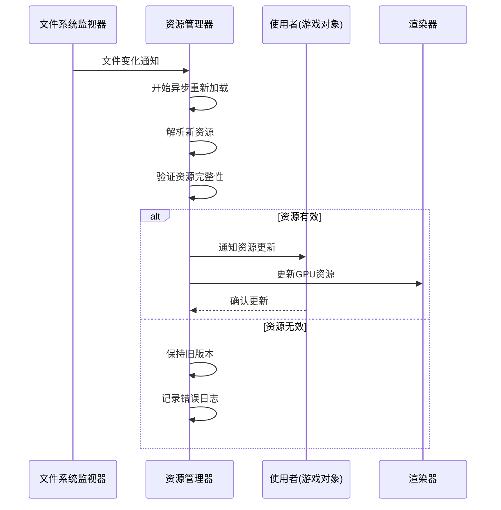

**热重载的实现挑战**：

| 挑战 | 解决方案 |
|------|----------|
| 资源大小变化 | 重新分配GPU内存 |
| 资源格式变化 | 版本化资源格式 |
| 运行时依赖 | 延迟更新到安全点 |
| 内存碎片 | 资源池化+内存整理 |

#### 7.3 流式加载架构

**开放世界的关键技术**

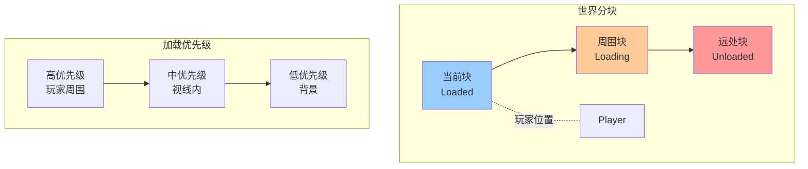

**流式加载的关键数据**：

1. **地形/几何**
   - 基于距离的LOD
   - 异步流式传输

2. **纹理**
   - 渐进式加载
   - Mipmap流式传输

3. **音频**
   - 流式音频播放
   - 预加载即将播放的音频

4. **脚本数据**
   - 延迟加载非关键AI
   - 按需加载动画

---

### 第8章：游戏循环架构

#### 8.1 游戏循环的理论基础

**实时模拟的核心挑战**：在有限时间内完成所有计算

```
时间预算分析 (60 FPS)：
┌────────────────────────────────────────────────┐
│  16.6ms 总时间                                  │
│  ├─ 物理模拟: ~5ms (30%)                      │
│  ├─ AI更新: ~2ms (12%)                        │
│  ├─ 动画更新: ~3ms (18%)                      │
│  ├─ 渲染提交: ~6ms (36%)                      │
│  └─ 其他: ~0.6ms (4%)                         │
│                                                │
│  超时 = 掉帧 → 用户体验下降                     │
└────────────────────────────────────────────────┘
```

#### 8.2 游戏循环模式演进

**模式1：简单循环**

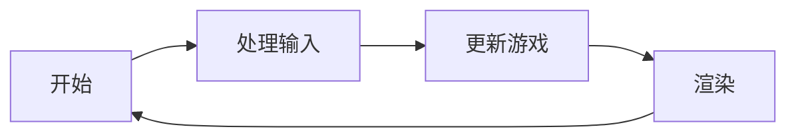

问题：帧率不可控，不同机器速度不同

**模式2：固定帧率**

```mermaid
graph LR
    A[开始] --> B[测量时间]
    B --> C[累积时间]
    C --> D{时间>=步长?}
    D -->|是| E[更新游戏固定步长]
    E --> C
    D -->|否| F[渲染]
    F --> B
```

优点：模拟稳定，可重现
缺点：性能浪费或不足

**模式3：半固定循环（推荐）**

```mermaid
graph TB
    A[开始] --> B[测量deltaTime]
    B --> C[累积时间]
    C --> D{accumulator>=dt?}
    D -->|是| E[物理模拟固定步长]
    E --> F[accumulator -= dt]
    F --> D
    D -->|否| G[计算插值alpha]
    G --> H[渲染 alpha插值]
    H --> A
```

**alpha插值的原理**：

```
状态插值：
┌────────────────────────────────────────────────┐
│  物理状态t0           物理状态t1              │
│  ┌──────────┐       ┌──────────┐              │
│  │ Position │  ...  │ Position │              │
│  │ (x,y,z)  │       │ (x',y',z')│             │
│  └──────────┘       └──────────┘              │
│       ↑                   ↑                   │
│       └─────── alpha ──────┘                  │
│              (0~1)                           │
│                                                │
│  渲染位置 = lerp(pos_t0, pos_t1, alpha)        │
│  alpha = 累积时间 / 固定时间步长                │
└────────────────────────────────────────────────┘
```

#### 8.3 多线程游戏循环

```mermaid
graph TB
    subgraph "主线程"
        A[输入处理] --> B[游戏逻辑]
        B --> C[渲染命令生成]
    end

    subgraph "渲染线程"
        D[命令缓冲区] --> E[渲染执行]
    end

    subgraph "工作线程池"
        F[物理计算]
        G[动画混合]
        H[AI思考]
        I[音频解码]
    end

    C --> D
    B -.任务分发.-> F
    B -.任务分发.-> G
    B -.任务分发.-> H
    B -.任务分发.-> I

    F --> B
    G --> B
```

**多线程架构的同步挑战**：

| 问题 | 解决方案 |
|------|----------|
| 数据竞争 | 消息传递/共享只读数据 |
| 死锁 | 分层锁、避免嵌套 |
| 帧一致性 | 双缓冲状态 |
| 负载均衡 | 任务窃取调度 |

---

### 第9章：输入系统架构

#### 9.1 输入抽象层

```mermaid
graph TB
    subgraph "物理输入设备"
        A1[键盘]
        A2[鼠标]
        A3[手柄]
        A4[触摸屏]
    end

    subgraph "平台抽象层"
        B1[Windows Input]
        B2[DirectInput]
        B3[XInput]
        B4[Raw Input]
    end

    subgraph "引擎输入系统"
        C1[输入管理器]
        C2[动作映射]
        C3[上下文切换]
    end

    subgraph "游戏代码"
        D1[玩家控制器]
        D2[UI系统]
    end

    A1 --> B1
    A2 --> B1
    A3 --> B3

    B1 --> C1
    B3 --> C1

    C1 --> C2 --> D1
    C1 --> C3 --> D2
```

**为什么需要输入抽象**：

1. **跨平台兼容**
   - Windows/Linux/Mac不同的输入API
   - 手柄、键盘、触摸屏统一处理

2. **可重映射**
   - 玩家自定义按键
   - 不同控制方案

3. **上下文感知**
   - 菜单和游戏不同的输入语义
   - 多玩家本地多人

#### 9.2 输入处理流程

```mermaid
sequenceDiagram
    participant HW as 硬件
    participant OS as 操作系统
    participant IS as 输入系统
    participant GS as 游戏状态
    player as 玩家

    HW->>OS: 原始输入事件
    OS->>IS: 平台事件
    IS->>IS: 去抖动
    IS->>IS: 状态更新
    IS->>IS: 动作触发检测

    alt 动作映射
        IS->>GS: Jump=true
    end

    GS->>GS: 角色跳跃

    alt 重复按键抑制
        IS->>IS: 检查previousState
        IS->>GS: 只触发一次
    end
```

**输入状态表示**：

```
原始状态层：
┌────────────────────────────────────────────────┐
│  KeyState[256]  - 键盘状态                    │
│  MouseButton[5] - 鼠标按钮                    │
│  MousePosition(x,y) - 鼠标位置                │
│  MouseDelta(dx,dy) - 鼠标移动                 │
│  GamepadState[4] - 手柄状态                   │
└────────────────────────────────────────────────┘
        ↓
动作映射层：
┌────────────────────────────────────────────────┐
│  "Jump" = Space || ButtonA                    │
│  "Fire" = LeftCtrl || RightTrigger            │
│  "Move" = WASD || LeftStick                   │
└────────────────────────────────────────────────┘
        ↓
上下文层：
┌────────────────────────────────────────────────┐
│  onFoot = {WASD=Move, Space=Jump}             │
│  inVehicle = {WASD=Accelerate, Space=Brake}    │
│  inMenu = {WASD=Navigate, Enter=Confirm}      │
└────────────────────────────────────────────────┘
```

#### 9.3 原始输入 vs 语义输入

| 层次 | 描述 | 示例 |
|------|------|------|
| **原始输入** | 直接硬件状态 | KeyState[KEY_SPACE]=true |
| **语义输入** | 游戏含义 | JumpAction=true |
| **上下文输入** | 场景相关 | MenuState中Space=Confirm |

**分层设计的好处**：
- 原始层：平台无关，统一接口
- 语义层：可重映射，易于配置
- 上下文层：场景感知，灵活切换

---

## 第三部分：渲染引擎

### 第10章：渲染管线架构

#### 10.1 渲染管线的完整流程

```mermaid
graph TB
    subgraph "应用阶段 Application"
        A1[场景图遍历]
        A2[视锥裁剪]
        A3[状态排序]
        A4[Draw Call提交]
    end

    subgraph "几何阶段 Geometry"
        B1[顶点着色器]
        B2[投影变换]
        B3[裁剪]
        B4[透视除法]
        B5[视口变换]
    end

    subgraph "光栅化阶段 Rasterization"
        C1[三角形设置]
        C2[三角形遍历]
        C3[插值]
    end

    subgraph "像素阶段 Pixel"
        D1[像素着色器]
        D2[深度测试]
        D3[模板测试]
        D4[Alpha混合]
        D5[帧缓冲写入]
    end

    A4 --> B1
    B1 --> B2 --> B3 --> B4 --> B5
    B5 --> C1 --> C2 --> C3
    C3 --> D1 --> D2 --> D3 --> D4 --> D5

    style A1 fill:#f96
    style B1 fill:#fc9
    style C1 fill:#9cf
    style D1 fill:#9fc
```

#### 10.2 场景图与渲染队列

**场景图 (Scene Graph)**：逻辑层次结构

```
场景图结构：
┌────────────────────────────────────────────────┐
│  Root                                          │
│  ├─ Light (Directional)                        │
│  ├─ Camera                                     │
│  └─ World                                      │
│      ├─ Terrain                                │
│      ├─ Building01                             │
│      │   └─ Mesh (LOD 0/1/2)                  │
│      ├─ Character                              │
│      │   └─ Skeleton                           │
│      │       ├─ Mesh (Body)                    │
│      │       ├─ Mesh (Head)                    │
│      │       └─ Mesh (Weapon)                  │
│      └─ ParticleSystem                         │
└────────────────────────────────────────────────┘
```

**渲染队列 (Render Queue)**：优化后的绘制顺序

```mermaid
graph LR
    A[场景图] --> B[可见性剔除]
    B --> C[排序策略]

    C --> D[不透明队列<br/>前→后排序]
    C --> E[透明队列<br/>后→前排序]
    C --> F[阴影队列<br/>深度排序]

    D --> G[批量合并]
    E --> H[单独绘制]
    F --> H

    G --> I[GPU绘制]
    H --> I
```

**排序的重要性**：

| 队列类型 | 排序策略 | 原因 |
|---------|----------|------|
| **不透明物体** | 前→后 | 利用Early-Z优化 |
| **透明物体** | 后→前 | 正确的混合顺序 |
| **阴影投射** | 深度排序 | 避免自阴影伪影 |

#### 10.3 Draw Call优化

**为什么Draw Call昂贵**：

```
CPU → GPU 通信开销：
┌────────────────────────────────────────────────┐
│  每个Draw Call需要：                            │
│  1. 验证状态                                   │
│  2. 更新常量缓冲                               │
│  3. 绑定资源                                   │
│  4. 驱动验证                                   │
│  5. GPU命令提交                               │
│                                                │
│  开销 ≈ 几十微秒                               │
│  目标: < 1000 Draw Calls/frame                 │
└────────────────────────────────────────────────┘
```

**批量绘制技术**：

```mermaid
graph TB
    A[多个小对象] --> B{可以合并?}

    B -->|相同材质| C[实例化渲染<br/>Instancing]
    B -->|相同网格| D[动态批处理<br/>Dynamic Batching]
    B -->|都不相同| E[单独Draw Call]

    C --> F[减少Draw Call数]
    D --> F
    E --> F
```

**技术对比**：

| 技术 | 适用场景 | 限制 |
|------|----------|------|
| **静态批处理** | 静态几何 | 运行时不可变 |
| **动态批处理** | 小动态物体 | 顶点数限制(~200) |
| **GPU Instancing** | 重复对象 | 需要硬件支持 |
| **间接绘制** | 大量对象 | 需要Compute Shader |

---

### 第11章：高级渲染技术

#### 11.1 前向渲染 vs 延迟渲染

**前向渲染 (Forward Rendering)**：

```mermaid
graph LR
    A[几何] --> B[着色<br/>计算光照]
    B --> C[深度测试]
    C --> D[帧缓冲]

    style B fill:#9cf
```

**延迟渲染 (Deferred Rendering)**：

```mermaid
graph TB
    A[几何] --> B[G-Buffer<br/>多渲染目标]

    B --> C1[Albedo]
    B --> C2[Normal]
    B --> C3[Position]
    B --> C4[Depth]

    C1 --> D[光照Pass<br/>全屏四边形]
    C2 --> D
    C3 --> D

    D --> E[帧缓冲]

    style B fill:#fc9
    style D fill:#9cf
```

**对比分析**：

| 维度 | 前向渲染 | 延迟渲染 |
|------|----------|----------|
| **复杂度** | 简单 | 复杂 |
| **内存带宽** | 低 | 高(G-Buffer读写) |
| **光源数量** | 少光源优化 | 多光源高效 |
| **透明物体** | 天然支持 | 需要特殊处理 |
| **MSAA** | 天然支持 | 成本高 |
| **带宽限制** | 适用 | 需要高带宽 |
| **光晕/Bloom** | 后处理 | 可与光照结合 |

#### 11.2 物理基础渲染 (PBR)

**传统渲染 vs PBR**：

```
Phong光照模型：
┌────────────────────────────────────────────────┐
│  Color = Ambient + Diffuse + Specular          │
│                                                │
│  问题：                                        │
│  - 能量不守恒                                  │
│  - 参数无物理意义                              │
│  - 不同光照下不一致                            │
└────────────────────────────────────────────────┘

PBR光照模型：
┌────────────────────────────────────────────────┐
│  基于物理：                                     │
│  - 能量守恒                                    │
│  - 微表面理论                                  │
│  - 双向反射分布函数(BRDF)                      │
│                                                │
│  参数：                                        │
│  - Albedo (反照率)                             │
│  - Metallic (金属度)                          │
│  - Roughness (粗糙度)                         │
│  - AO (环境光遮蔽)                            │
└────────────────────────────────────────────────┘
```

**PBR渲染流程**：

```mermaid
graph TB
    A[材质参数] --> B[镜面反射BRDF]
    A --> C[漫反射BRDF]

    D[光照输入] --> E[直接光]
    D --> F[间接光<br/>环境贴图]

    B --> G[能量守恒<br/>F0计算]
    C --> G

    E --> H[最终着色]
    F --> H
    G --> H
```

#### 11.3 阴影技术

**阴影映射 (Shadow Mapping)**：

```
原理：
┌────────────────────────────────────────────────┐
│  1. 从光源视角渲染深度                         │
│  2. 比较当前像素深度与阴影贴图深度             │
│                                                │
│  Shadow = depth > shadowMapDepth              │
└────────────────────────────────────────────────┘

问题：
┌────────────────────────────────────────────────┐
│  阴影锯齿 (Shadow Acne)                        │
│  → 解决: Bias偏移                              │
│                                                │
│  彼得潘效应 (Peter Panning)                    │
│  → 解决: 自适应Bias                            │
│                                                │
│  分辨率不足                                    │
│  → 解决: CSM级联阴影贴图                       │
└────────────────────────────────────────────────┘
```

**CSM (Cascaded Shadow Maps)**：

```
视锥分割：
┌────────────────────────────────────────────────┐
│  近视角级 (高分辨率)                            │
│  ├─ Camera近处                                 │
│  └─ 精细节                                     │
│                                                │
│  中视角级 (中分辨率)                            │
│  ├─ Camera中距离                               │
│  └─ 中等细节                                   │
│                                                │
│  远视角级 (低分辨率)                            │
│  ├─ Camera远处                                 │
│  └─ 低细节                                     │
└────────────────────────────────────────────────┘
```

---

### 第12章：动画系统架构

#### 12.1 角色动画的完整流程

```mermaid
graph TB
    A[动画资产] --> B[骨骼定义]
    A --> C[动画剪辑]

    B --> D[蒙皮网格]
    C --> E[动画采样]

    E --> F[动画混合]
    F --> G[IK求解]
    G --> H[最终姿势]

    H --> I[蒙皮计算]
    I --> J[顶点变换]
    J --> K[GPU渲染]

    style F fill:#9cf
    style G fill:#fc9
```

#### 12.2 动画混合树 (Blend Tree)

**混合树的结构**：

```
简单混合树：
┌────────────────────────────────────────────────┐
│                  Blend Node                    │
│                  (混合权重)                     │
│                    ↑                           │
│          ┌─────────┴─────────┐                │
│          ↓                   ↓                │
│    Walk Animation      Run Animation           │
│    (weight: 0.3)       (weight: 0.7)          │
│                                                 │
│  结果: 30% walk + 70% run = 快走/慢跑         │
└────────────────────────────────────────────────┘

复杂混合树：
┌────────────────────────────────────────────────┐
│               Locomotion Blend                │
│                    ↑                           │
│      ┌─────────────┼─────────────┐            │
│      ↓             ↓             ↓            │
│   Idle          Move        Action              │
│   (1.0)      (speed)      (trigger)           │
│              ↓                                │
│      Walk ──Run──Sprint                       │
│      (0~5) (5~10)(10+)                        │
└────────────────────────────────────────────────┘
```

**1D混合 vs 2D混合**：

```mermaid
graph LR
    subgraph "1D混合 (参数: 速度)"
        A1[Idle] --> B1[Walk]
        B1 --> C1[Run]
        C1 --> D1[Sprint]
    end

    subgraph "2D混合 (参数: 速度, 方向)"
        A2[Idle] --> B2[WalkForward]
        A2 --> C2[WalkRight]
        A2 --> D2[WalkBack]
        A2 --> E2[WalkLeft]

        B2 --> F2[RunForward]
        C2 --> G2[RunRight]
        D2 --> H2[RunBack]
        E2 --> I2[RunLeft]
    end
```

#### 12.3 IK (反向运动学) 原理

**FK vs IK**：

```
FK (Forward Kinematics - 正向运动学)：
┌────────────────────────────────────────────────┐
│  已知：关节角度                                 │
│  求：末端位置                                   │
│                                                │
│  θ1, θ2, θ3 → (x, y, z)                      │
│                                                │
│  计算简单：直接应用变换矩阵                     │
└────────────────────────────────────────────────┘

IK (Inverse Kinematics - 反向运动学)：
┌────────────────────────────────────────────────┐
│  已知：目标位置                                 │
│  求：关节角度                                   │
│                                                │
│  (x, y, z) → θ1, θ2, θ3                      │
│                                                │
│  计算复杂：需要迭代求解                         │
│                                                │
│  常用算法：                                     │
│  - CCD (Cyclic Coordinate Descent)             │
│  - Jacobian Transpose                          │
│  - Jacobian Pseudo-Inverse                     │
│  - Analytical IK (解析解)                      │
└────────────────────────────────────────────────┘
```

**IK应用场景**：

```mermaid
mindmap
  root((IK应用))
    角色动画
      脚部接地
        不平坦地形
        楼梯上下
      手部抓取
        武器瞄准
        物品交互
      头部注视
        看向目标
        追踪摄像机

    程序化动画
      全身IK
        攀爬系统
        覆盖动画
      物理驱动
        布娃娃效果
        物理反馈
```

#### 12.4 动画压缩技术

**为什么需要压缩**：

```
原始动画数据：
┌────────────────────────────────────────────────┐
│  60 FPS                                        │
│  每帧每个骨骼: position(3) + rotation(4)      │
│  = 7 floats = 28 bytes                        │
│                                                │
│  100个骨骼, 30秒动画:                          │
│  60 × 30 × 100 × 28 = 504 MB                   │
└────────────────────────────────────────────────┘

压缩后：
┌────────────────────────────────────────────────┐
│  1. 降低采样率 (60 → 30 FPS)                   │
│  2. 通道量化 (float → half/int16)              │
│  3. 关键帧减少 (曲线拟合)                      │
│  4. Delta压缩 (存储差值)                       │
│                                                │
│  压缩比: ~8:1                                  │
│  504 MB → 63 MB                               │
└────────────────────────────────────────────────┘
```

---

### 第13章：物理引擎架构

#### 13.1 物理模拟管线

```mermaid
graph TB
    A[物理帧开始] --> B[碰撞检测]
    B --> C[宽相 Broad Phase]
    C --> D[潜在对列表<br/>Potential Pairs]
    D --> E[窄相 Narrow Phase]
    E --> F[接触点<br/>Contact Points]

    F --> G[约束求解]
    G --> H[速度迭代<br/>Velocity Iterations]
    H --> I[位置迭代<br/>Position Iterations]

    I --> J[积分 Integration]
    J --> K[更新位置/速度]

    K --> L[同步到渲染]
```

#### 13.2 碰撞检测优化

**空间分区策略**：

```mermaid
graph TB
    subgraph "无优化 O(N²)"
        A1[对象1] -.测试.- A2[对象2]
        A1 -.测试.- A3[对象3]
        A1 -.测试.- A4[对象N]
        A2 -.测试.- A3
        A2 -.测试.- A4
    end

    subgraph "均匀网格 O(N)"
        B1[网格单元] --> B2[只测试相邻单元]
    end

    subgraph "八叉树 O(logN)"
        C1[空间划分] --> C2[层次结构]
    end

    subgraph "BVH O(logN)"
        D1[包围体层次] --> D2[快速剔除]
    end
```

**技术对比**：

| 技术 | 适用场景 | 复杂度 | 动态场景 |
|------|----------|--------|----------|
| **暴力检测** | <100对象 | O(N²) | 无影响 |
| **均匀网格** | 均匀分布 | O(N) | 需重构 |
| **八叉树** | 3D世界 | O(logN) | 需重构 |
| **BVH** | 复杂形状 | O(logN) | 需重构 |
| **SAP** | 1D/2D | O(N logN) | 无需重构 |

#### 13.3 约束求解器

**迭代求解原理**：

```
约束满足：
┌────────────────────────────────────────────────┐
│  目标：满足所有约束条件                         │
│                                                │
│  约束类型：                                     │
│  1. 距离约束 (关节)                             │
│  2. 接触约束 (碰撞)                             │
│  3. 角度约束 (铰链)                             │
│  4. 摩擦约束                                    │
│                                                │
│  求解器：                                       │
│  1. Sequential Impulse (逐脉冲)                │
│  2. Projected Gauss-Seidel (投影GS)            │
│  3. 基于速度的求解                             │
│  4. 基于位置的求解                             │
└────────────────────────────────────────────────┘
```

**迭代求解流程**：

```mermaid
graph LR
    A[初始状态] --> B[计算约束误差]
    B --> C[应用冲量/修正]
    C --> D{达到精度?}
    D -->|否| E{超过最大迭代?}
    E -->|否| B
    E -->|是| F[停止]
    D -->|是| F
```

---

## 第四部分：游戏性系统

### 第14章：实体组件系统 (ECS)

#### 14.1 ECS的设计理念

**传统OOP的问题**：

```
传统继承层次：
┌────────────────────────────────────────────────┐
│  GameObject                                    │
│  ├─ Position, Rotation                        │
│  └─ Render()                                  │
│           ↓                                   │
│  Enemy extends GameObject                      │
│  ├─ Health, Damage                           │
│  └─ AI()                                      │
│           ↓                                   │
│  FlyingEnemy extends Enemy                    │
│  ├─ FlightSpeed                              │
│  └─ Fly()                                     │
│                                                │
│  问题：                                        │
│  1. 菱形继承问题                               │
│  2. 功能分散在层次中                           │
│  3. 运行时组合困难                             │
│  4. 缓存不友好                                 │
└────────────────────────────────────────────────┘
```

**ECS的解决方案**：

```mermaid
graph TB
    subgraph "Entity 实体"
        A1[仅ID<br/>无数据]
        A2[仅ID<br/>无数据]
        A3[仅ID<br/>无数据]
    end

    subgraph "Component 组件"
        B1[Position<br/>x,y,z]
        B2[Velocity<br/>vx,vy,vz]
        B3[Renderable<br/>meshId]
        B4[Health<br/>current,max]
    end

    subgraph "System 系统"
        C1[Movement<br/>处理Position+Velocity]
        C2[Render<br/>处理Renderable]
        C3[Combat<br/>处理Health]
    end

    A1 -.关联.- B1
    A1 -.关联.- B2
    A1 -.关联.- B3

    A2 -.关联.- B1
    A2 -.关联.- B4

    B1 -.处理.- C1
    B2 -.处理.- C1
    B3 -.处理.- C2
    B4 -.处理.- C3
```

#### 14.2 ECS的内存布局

**Archetype (原型) 存储**：

```
按Archetype分组存储：
┌────────────────────────────────────────────────┐
│  Archetype A: Position + Velocity             │
│  ┌────────────┬────────────┬────────────┐    │
│  │ Position   │ Velocity   │ Position   │    │
│  │ (x,y,z)    │ (vx,vy,vz) │ (x,y,z)    │    │
│  └────────────┴────────────┴────────────┘    │
│                                                 │
│  Archetype B: Position + Renderable          │
│  ┌────────────┬────────────┬────────────┐    │
│  │ Position   │ Renderable │ Position   │    │
│  │ (x,y,z)    │ (meshId)   │ (x,y,z)    │    │
│  └────────────┴────────────┴────────────┘    │
│                                                 │
│  优点：                                         │
│  1. 同类型数据连续存储                          │
│  2. 缓存友好                                   │
│  3. SIMD优化                                   │
│  4. 串行处理高效                               │
└────────────────────────────────────────────────┘
```

#### 14.3 System的并行执行

**系统依赖图**：

```mermaid
graph TB
    A[Input System] --> B[Player Controller]
    A --> C[AI System]

    B --> D[Movement System]
    C --> D

    D --> E[Collision System]
    D --> F[Animation System]

    E --> G[Render System]
    F --> G
```

**并行调度策略**：

| 策略 | 描述 | 适用场景 |
|------|------|----------|
| **串行执行** | 按顺序逐个执行 | 简单游戏 |
| **独立并行** | 无依赖系统并行 | 多个独立AI |
| **分阶段并行** | 阶段内并行，阶段间串行 | 复杂游戏 |

---

## 第五部分：工具与优化

### 第16章：性能优化策略

#### 16.1 性能分析流程

```mermaid
graph TB
    A[性能问题] --> B[建立基准测试]
    B --> C[性能分析器采样]

    C --> D[识别热点]

    D --> E[CPU瓶颈?]
    D --> F[GPU瓶颈?]
    D --> G[内存瓶颈?]

    E --> H[优化算法/数据结构]
    F --> I[优化渲染/着色器]
    G --> J[优化内存布局]

    H --> K[验证优化效果]
    I --> K
    J --> K

    K --> L[更新性能预算]
```

#### 16.2 优化原则

**优化优先级**：

```
1. 算法优化：           O(n²) → O(n log n)
   └─ 最大收益

2. 数据布局优化：        缓存利用率提升
   └─ 次大收益

3. 并行化：             多核利用
   └─ 中等收益

4. 汇编优化/SIMD：      10-30%提升
   └─ 需要大量工作

5. 微优化：            <5%提升
   └─ 收益最小
```

#### 16.3 常见性能陷阱

| 陷阱 | 影响 | 解决方案 |
|------|------|----------|
| **频繁内存分配** | 帧率不稳定 | 使用对象池 |
| **缓存未命中** | 性能下降 | 优化数据布局 |
| **过度绘制** | GPU负载高 | 视锥裁剪 |
| **状态切换** | CPU开销 | 批量渲染 |
| **同步等待** | GPU空闲 | 异步操作 |

---

## 💡 深度思考

### 1. 关于引擎架构的权衡

**性能 vs 抽象**：

```
过度抽象的性能代价：
┌────────────────────────────────────────────────┐
│  虚函数调用 = 间接跳转                         │
│  └─ 可能阻止内联                               │
│  └─ CPU分支预测失败                           │
│                                                │
│  解决方案：                                     │
│  1. 热路径避免虚函数                           │
│  2. 使用CRTP(奇异递归模板模式)                 │
│  3. 数据导向设计                               │
└────────────────────────────────────────────────┘
```

### 2. 关于数据导向设计

**从"思考对象"到"思考数据"**：

```mermaid
mindmap
  root((设计思维转变))
    传统面向对象
      行为封装
        每个类管理自己的数据
        通过接口通信
        继承实现复用

      问题
        虚函数开销
        缓存不友好
        难以并行化

    数据导向设计
      数据组织
        SoA布局
        连续内存
        批量处理

      优势
        缓存高效
        SIMD友好
        易于并行
```

### 3. 关于引擎的"游戏循环"哲学

游戏循环是引擎的心脏，一切围绕它展开：

```
时间预算管理：
┌────────────────────────────────────────────────┐
│  每个系统分配固定时间                           │
│  - 物理: 5ms                                   │
│  - AI: 2ms                                     │
│  - 渲染准备: 3ms                               │
│                                                │
│  超时 = 降低质量而非掉帧                       │
│  - 物理迭代次数减少                             │
│  - AI思考深度降低                               │
│  - LOD切换更积极                               │
└────────────────────────────────────────────────┘
```

### 4. 关于跨平台抽象

**平台抽象层的设计原则**：

```
抽象层次：
┌────────────────────────────────────────────────┐
│  游戏代码                                       │
│  ↓ 调用平台无关API                              │
│  ┌────────────────────────────────────┐       │
│  │  平台抽象层 (PAL)                   │       │
│  │  - 统一接口                         │       │
│  │  - 编译时多态                       │       │
│  └────────────────────────────────────┘       │
│  ↓ 调用特定平台实现                              │
│  ┌──────┬──────┬──────┬──────┐                │
│  │Windows│Linux │ PS5  │ XSS  │                │
│  └──────┴──────┴──────┴──────┘                │
└────────────────────────────────────────────────┘

关键原则：
1. 最小化平台特定代码
2. 编译时选择实现
3. 运行时零开销
4. 清晰的功能边界
```

---

## 🎯 学习路径建议

### 初学者路径
```
1. 掌握C++基础和内存管理
   ↓
2. 学习基础3D数学
   ↓
3. 实现简单的软件渲染器
   ↓
4. 学习OpenGL/DirectX
   ↓
5. 实现简单游戏引擎组件
```

### 进阶路径
```
1. 深入研究渲染技术
   - PBR、延迟渲染、全局光照
   ↓
2. 学习物理引擎实现
   - 碰撞检测、刚体动力学
   ↓
3. 研究开源引擎架构
   - Godot、O3DE、Unreal Engine
   ↓
4. 实现完整的引擎子系统
```

### 实践项目建议

1. **从零实现渲染器**
   - 软件渲染 → OpenGL → Vulkan
   - 前向渲染 → 延迟渲染

2. **实现物理引擎**
   - 碰撞检测 → 刚体模拟 → 软体物理

3. **完整小游戏**
   - 整合各个系统
   - 实践数据驱动设计

---

## 🔗 相关资源

### 推荐阅读顺序

| 阶段 | 书籍 | 重点 |
|------|------|------|
| **基础** | 本书+《3D游戏编程大师技巧》 | 游戏循环、基础渲染 |
| **进阶** | 《Real-Time Rendering》 | 渲染管线深度 |
| **物理** | 《Game Physics Engine Development》 | 物理模拟 |
| **架构** | 《Game Coding Complete》 | 引擎架构实践 |

### 在线资源

- **[Jason Gregory的博客](https://www.gameenginebook.com/)** - 作者官方资源
- **[NVIDIA Game Works](https://developer.nvidia.com/gameworks)** - 图形技术示例
- **[GPU Open](https://gpuopen.com/)** - AMD图形技术
- **[实时渲染通讯](http://www.realtimerendering.com/)** - 行业最新动态

### 开源引擎学习

1. **Godot Engine** - 轻量级，易于理解
2. **O3DE (Open 3D Engine)** - AWS支持的现代引擎
3. **Unreal Engine** - AAA级，源码公开

---

## 📊 总结

### 核心收获

1. **系统思维** - 游戏引擎是复杂的系统工程，需要全面理解
2. **性能意识** - 时间预算和缓存友好是设计核心
3. **架构权衡** - 在性能、抽象、可维护性之间找平衡
4. **数据驱动** - 分离数据和逻辑，提高灵活性

### 未来方向

- 光线追踪渲染
- 机器学习在游戏中的应用
- 云游戏架构
- VR/AR引擎优化

## 💭 深度衍生思考

### 🎯 核心观点延伸

**游戏引擎是软件工程的集大成者**

游戏引擎融合了计算机科学多个领域的顶尖技术：图形学、物理模拟、音频处理、网络通信、人工智能等。

*延伸逻辑*：
- 游戏引擎需要实时性能（60fps+）
- 需要处理海量数据和复杂逻辑
- 需要支持多种平台和设备
- 需要提供友好的创作工具

*支撑证据*：
- Unreal Engine、Unity等引擎的复杂度
- AAA游戏开发需要数百人团队
- 游戏引擎开发周期长达数年
- 引擎架构影响整个游戏行业

*实践意义*：
- 游戏引擎是学习系统架构的优秀案例
- 性能优化技术在游戏引擎中达到极致
- 数据驱动设计对其他领域也有启发

### 🔍 多角度分析

**历史视角**：游戏引擎的演进
```
1980s: 专用游戏硬件，硬编码游戏逻辑
1990s: 3D加速卡出现，第一代3D引擎
2000s: 可编程着色器，shader时代
2010s: 物理引擎成熟，次世代引擎
2020s: 实时光追，AI加速，云游戏
```

**现代视角**：游戏引擎技术的外溢
- **Unreal Engine**用于影视制作（曼达洛人）
- **Unity**用于汽车、建筑设计可视化
- **游戏引擎技术**用于数字孪生、元宇宙
- **实时渲染**改变传统设计行业

### 🚀 创新思考

**潜在改进**：游戏引擎的未来方向
1. **AI辅助内容创作**
   - Procedural Generation
   - AI辅助美术
   - 自动化测试

2. **云端渲染**
   - 云游戏架构
   - 边缘计算优化
   - 网络协议创新

## 🔗 知识关联网络

### 与已读书籍的关联

- **游戏编程算法与技巧** - 关联强度: ⭐⭐⭐⭐⭐
  - 算法是引擎的基础
  - 引擎提供算法的高层抽象

- **设计模式** - 关联强度: ⭐⭐⭐⭐
  - 引擎架构大量使用设计模式
  - 组件系统、对象池等模式

- **深入理解计算机系统** - 关联强度: ⭐⭐⭐⭐⭐
  - 引擎需要深入理解硬件
  - 缓存、内存管理等系统知识

### 概念映射

```mermaid
graph LR
    A[游戏引擎] --> B[渲染系统]
    A --> C[物理系统]
    A --> D[音频系统]
    
    B --> E[图形学]
    C --> F[物理模拟]
    D --> G[音频处理]
    
    E --> H[GPU编程]
    F --> I[数学基础]
```

### 知识依赖关系

**前置知识**：
- C++高级编程
- 线性代数、物理基础
- 计算机图形学基础

**后续延伸**：
- **Real-Time Rendering** - 渲染管线深度
- **GPU Pro** - 图形编程技巧
- **Gems系列** - 游戏编程技巧

## 📚 后续阅读路径规划

### 直接延伸

1. **《Real-Time Rendering》** - Tomas Akenine-Möller
   - 关联度: ⭐⭐⭐⭐⭐
   - 预期收获: 渲染管线的深入理解

2. **《Game Physics Engine Development》**
   - 关联度: ⭐⭐⭐⭐
   - 预期收获: 物理引擎的实现

### 实践补充

1. **开源引擎源码分析**
   - Godot Engine
   - O3DE

## 🎓 专家视角深度分析

### 陈晓峰（游戏客户端架构师）

**核心洞察**：
1. 游戏引擎是性能优化的极致体现
2. 数据驱动是现代引擎的核心
3. 工具链质量决定引擎成败

**深度分析**：
- **性能至上**：60fps要求驱动所有设计决策
- **内存管理**：自定义分配器、对象池
- **多线程**：任务系统、Job系统

### 综合结论

游戏引擎开发是软件工程的巅峰挑战之一，需要系统思维、性能意识、架构权衡的综合能力。

---

**创建日期**: 2026年2月7日
**最后更新**: 2026年4月17日
**阅读状态**: 📖 持续学习，深入实践中...
**笔记版本**: v2.0
**升级说明**: 添加深度衍生思考、知识关联网络、专家视角分析

---

**Sources**:
- [Game Engine Architecture - Official Website](https://www.gameenginebook.com/)
- [Game Engine Architecture 3rd Edition - Routledge](https://www.routledge.com/Game-Engine-Architecture/Gregory/p/book/9781138035454)
- [Table of Contents](https://www.gameenginebook.com/toc.html)
- [Taylor & Francis - Game Engine Architecture](https://www.taylorfrancis.com/books/mono/10.1201/9781315106946/game-engine-architecture-jason-gregory)
- [O'Reilly - Game Engine Architecture](https://www.oreilly.com/library/view/game-engine-architecture/9781351974271/)
