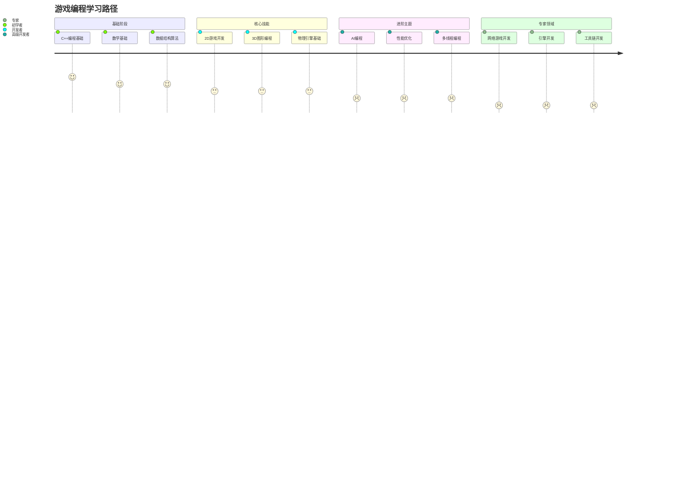
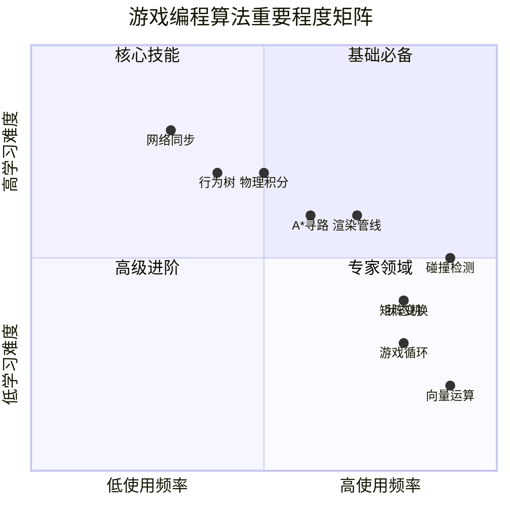
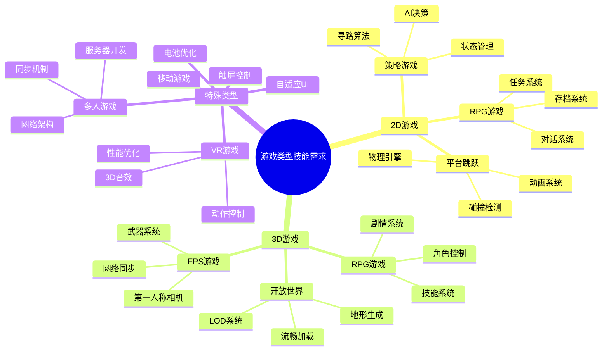
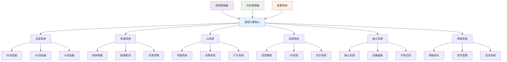
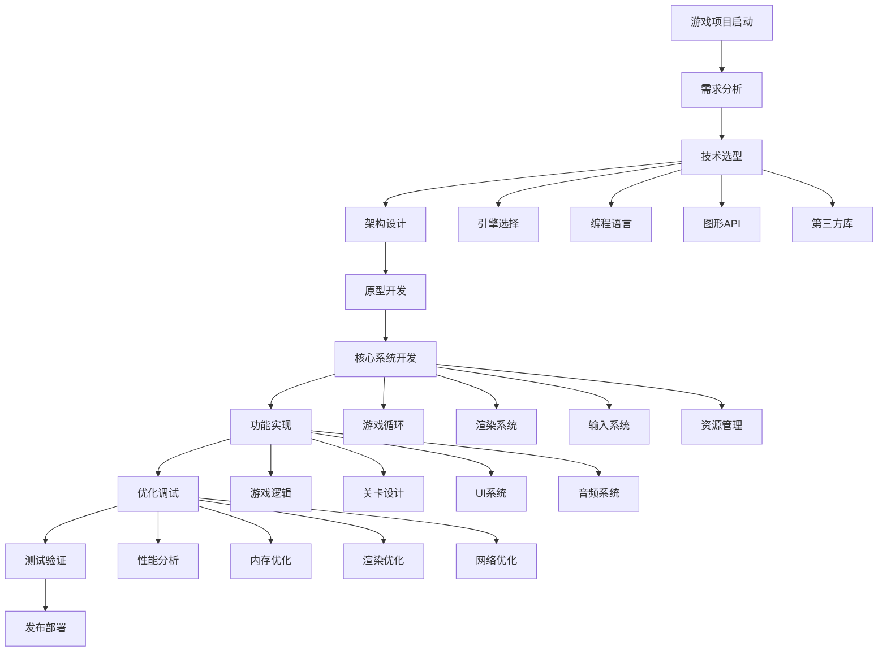
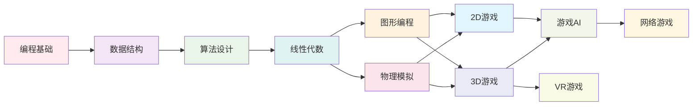
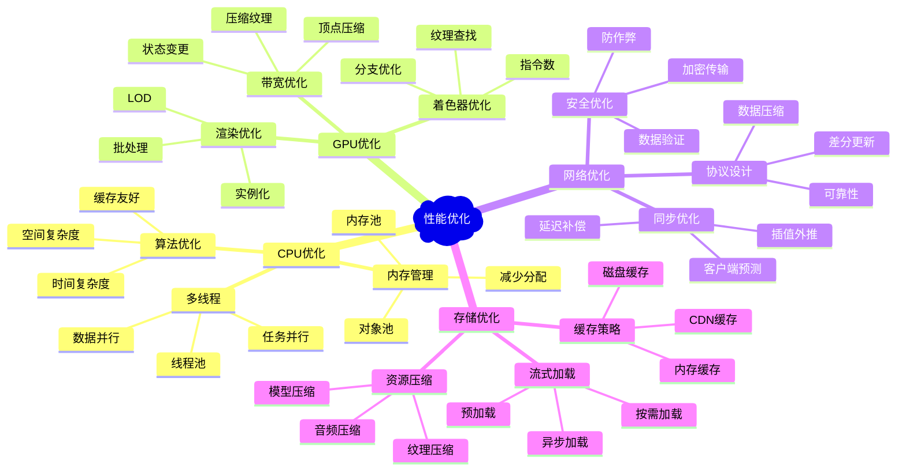
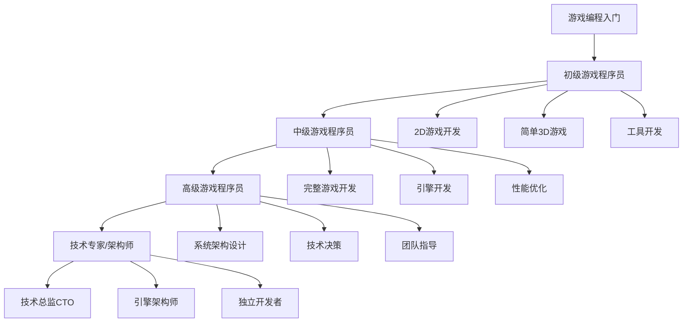

# 🧠 游戏编程知识架构总览

基于《游戏编程算法与技巧》读书笔记，以下是游戏编程完整知识体系的架构图。

## 📊 完整知识架构图

```mermaid
flowchart TD
    A[游戏编程知识体系] --> B[数学基础]
    A --> C[图形编程]
    A --> D[物理引擎]
    A --> E[人工智能]
    A --> F[系统架构]
    A --> G[高级主题]

    B --> B1[线性代数]
    B --> B2[几何学]
    B --> B3[微积分]
    B --> B4[数值方法]

    B1 --> B1a[向量运算]
    B1 --> B1b[矩阵变换]
    B1 --> B1c[四元数]
    B1 --> B1d[特征值分解]

    B2 --> B2a[2D几何]
    B2 --> B2b[3D几何]
    B2 --> B2c[碰撞几何]
    B2 --> B2d[包围体]

    B3 --> B3a[导数与积分]
    B3 --> B3b[数值积分]
    B3 --> B3c[微分方程]
    B3 --> B3d[优化方法]

    C --> C1[2D图形]
    C --> C2[3D图形]
    C --> C3[渲染管线]
    C --> C4[着色器]

    C1 --> C1a[精灵系统]
    C1 --> C1b[2D变换]
    C1 --> C1c[图块地图]
    C1 --> C1d[粒子系统]

    C2 --> C2a[3D变换]
    C2 --> C2b[相机系统]
    C2 --> C2c[光照模型]
    C2 --> C2d[材质系统]

    C3 --> C3a[顶点处理]
    C3 --> C3b[光栅化]
    C3 --> C3c[深度测试]
    C3 --> C3d[模板测试]

    C4 --> C4a[顶点着色器]
    C4 --> C4b[片元着色器]
    C4 --> C4c[几何着色器]
    C4 --> C4d[计算着色器]

    D --> D1[基础物理]
    D --> D2[碰撞检测]
    D --> D3[碰撞响应]
    D --> D4[约束求解]

    D1 --> D1a[运动学]
    D1 --> D1b[动力学]
    D1 --> D1c[力场]
    D1 --> D1d[流体模拟]

    D2 --> D2a[碰撞检测算法]
    D2 --> D2b[空间分割]
    D2 --> D2c[连续碰撞]
    D2 --> D2d[复杂形状]

    D3 --> D3a[冲量求解]
    D3 --> D3b[摩擦模型]
    D3 --> D3c[弹性碰撞]
    D3 --> D3d[能量守恒]

    D4 --> D4a[关节约束]
    D4 --> D4b[接触约束]
    D4 --> D4c[积分器]
    D4 --> D4d[稳定性优化]

    E --> E1[寻路算法]
    E --> E2[决策系统]
    E --> E3[学习算法]
    E --> E4[群体行为]

    E1 --> E1a[A*算法]
    E1 --> E1b[导航网格]
    E1 --> E1c[动态障碍]
    E1 --> E1d[分层寻路]

    E2 --> E2a[状态机]
    E2 --> E2b[行为树]
    E2 --> E2c[效用AI]
    E2 --> E2d[规划系统]

    E3 --> E3a[神经网络]
    E3 --> E3b[遗传算法]
    E3 --> E3c[强化学习]
    E3 --> E3d[模糊逻辑]

    E4 --> E4a[Boids算法]
    E4 --> E4b[群体智能]
    E4 --> E4c[涌现行为]
    E4 --> E4b[自组织系统]

    F --> F1[游戏循环]
    F --> F2[组件系统]
    F --> F3[事件系统]
    F --> F4[资源管理]

    F1 --> F1a[固定时间步长]
    F1 --> F1b[可变时间步长]
    F1 --> F1c[多线程循环]
    F1 --> F1d[帧率控制]

    F2 --> F2a[ECS架构]
    F2 --> F2b[组件通信]
    F2 --> F2c[序列化]
    F2 --> F2d[热重载]

    F3 --> F3a[消息队列]
    F3 --> F3b[事件分发]
    F3 --> F3c[响应式编程]
    F3 --> F3d[信号槽]

    F4 --> F4a[内存管理]
    F4 --> F4b[异步加载]
    F4 --> F4c[资源池]
    F4 --> F4d[生命周期]

    G --> G1[网络编程]
    G --> G2[性能优化]
    G --> G3[跨平台开发]
    G --> G4[工具开发]

    G1 --> G1a[TCP/UDP]
    G1 --> G1b[网络同步]
    G1 --> G1c[延迟补偿]
    G1 --> G1d[安全机制]

    G2 --> G2a[内存优化]
    G2 --> G2b[GPU优化]
    G2 --> G2c[多线程优化]
    G2 --> G2d[算法优化]

    G3 --> G3a[平台抽象]
    G3 --> G3b[构建系统]
    G3 --> G3c[部署策略]
    G3 --> G3d[适配层]

    G4 --> G4a[关卡编辑器]
    G4 --> G4b[资源工具]
    G4 --> G4c[调试工具]
    G4 --> G4d[分析工具]
```

## 🎯 学习路径图

## 📈 核心算法重要程度分析

## 🎮 游戏类型与所需技能映射

## 🔗 核心系统关系图

## 🛠️ 开发流程图

## 📚 知识点依赖关系

## 🎯 性能优化重点

## 🚀 职业发展路径

## 📝 学习建议

### 🎯 不同背景学习者的路径

#### **计算机科学专业学生**
1. **加强图形学基础** - 深入学习OpenGL/Vulkan
2. **实践游戏项目** - 从简单2D游戏开始
3. **关注性能优化** - 学习profiling和优化技术
4. **参与开源项目** - 贡献游戏引擎相关代码

#### **编程爱好者转游戏开发**
1. **补充数学基础** - 重点学习线性代数和几何学
2. **学习游戏引擎** - 从Unity/Unreal开始
3. **理解游戏循环** - 掌握实时编程概念
4. **多做小型项目** - 积累实战经验

#### **美工/设计转技术**
1. **编程基础训练** - C++和脚本语言
2. **工具使用优先** - 可视化开发工具
3. **技术美术方向** - 着重学习shader和特效
4. **原型快速开发** - 专注于实现创意

### 🔧 实践项目建议

#### **初级项目** (1-3个月)
- **贪吃蛇/俄罗斯方块** - 2D游戏基础
- **平台跳跃游戏** - 物理和碰撞检测
- **简单RPG** - 游戏系统和状态管理

#### **中级项目** (3-6个月)
- **3D迷宫游戏** - 3D渲染和相机控制
- **RTS原型** - AI和单位管理
- **多人对战游戏** - 网络同步基础

#### **高级项目** (6-12个月)
- **完整3D引擎** - 从零开始的游戏引擎
- **MMORPG原型** - 大规模网络系统
- **VR游戏体验** - 新兴平台开发

---

**文档创建时间**: 2025-12-17
**基于书籍**: 《游戏编程算法与技巧》
**知识覆盖**: 从基础到专家级的完整游戏编程体系