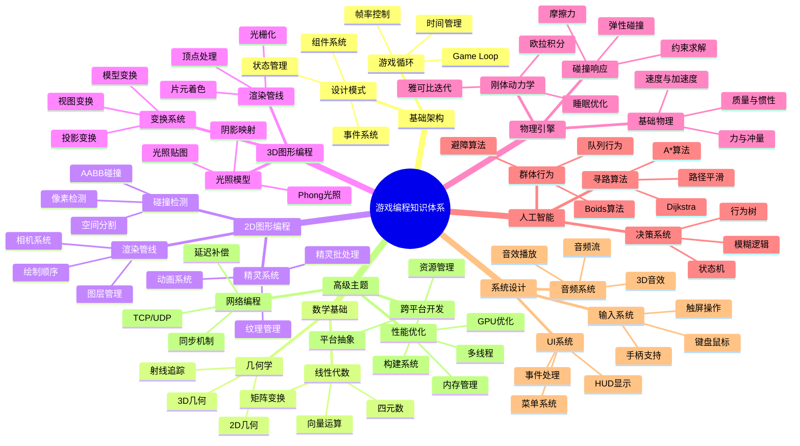
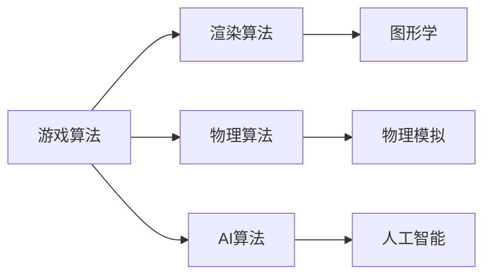

# 📚 游戏编程算法与技巧

## 📖 基本信息

- **书名**: 游戏编程算法与技巧 (Game Programming Algorithms and Techniques)
- **作者**: Sanjay Madhav
- **出版社**: Addison-Wesley Professional
- **出版年份**: 2014 (持续更新中)
- **中译本**: 有中文翻译版本
- **创建时间**: 2025-12-17
- **难度等级**: 中级
- **阅读状态**: 📖 准备开始
- **个人评分**: ⭐⭐⭐⭐⭐

## 📝 内容概要

### 书籍简介
《游戏编程算法与技巧》是一本全面介绍游戏开发核心算法和技术的经典教材。该书涵盖了2D和3D游戏开发中的关键概念，从基础的游戏循环到复杂的物理模拟和AI算法，为游戏开发学习者提供了系统的知识框架。

### 核心主题
1. **游戏基础架构** - 游戏引擎的基本结构和设计模式
2. **2D图形编程** - 2D游戏渲染、精灵管理和碰撞检测
3. **3D图形编程** - 3D数学基础、变换和渲染管线
4. **物理引擎** - 物理模拟、碰撞响应和约束求解
5. **人工智能** - 寻路算法、决策树和状态机
6. **输入系统** - 用户输入处理和响应
7. **音频系统** - 音效播放和3D音效
8. **网络编程** - 多人游戏和同步机制

### 主要章节
- 第1章：游戏编程导论
- 第2章：游戏循环与时间管理
- 第3章：2D图形与精灵
- 第4章：线性代数基础
- 第5章：3D图形与变换
- 第6章：光照与材质
- 第7章：音频系统
- 第8章：输入系统
- 第9章：碰撞检测
- 第10章：物理引擎基础
- 第11章：人工智能与寻路
- 第12章：用户界面
- 第13章：游戏优化
- 第14章：网络编程基础

## 🧠 知识架构



## ✍️ 读书笔记

### 第1章：游戏编程导论

**重点摘录：**
> 游戏编程是一门复杂的艺术，它不仅要求程序员具备扎实的编程技能，还需要对数学、物理、人工智能等多个领域有深入的理解。

**核心概念：**
- **游戏引擎**: 提供游戏开发基础功能的软件框架
- **实时性要求**: 游戏必须在16-33ms内完成一帧的计算和渲染
- **资源管理**: 内存、CPU、GPU等资源的优化使用

**个人思考：**
游戏开发是一门综合性的学科，需要程序员具备广博的知识面。理解游戏引擎的架构是成为一名优秀游戏开发者的基础。

### 第2章：游戏循环与时间管理

**关键算法：**

#### 基础游戏循环
```cpp
// 简单的游戏循环实现
bool Game::Run()
{
    while (isRunning)
    {
        ProcessInput();
        UpdateGame();
        GenerateOutput();
    }
    return true;
}
```

#### 固定时间步长
```cpp
// 固定时间步长的游戏循环
const float dt = 1.0f / 60.0f; // 60 FPS
float accumulator = 0.0f;

while (isRunning)
{
    float currentTime = GetCurrentTime();
    float frameTime = currentTime - previousTime;
    previousTime = currentTime;

    accumulator += frameTime;

    while (accumulator >= dt)
    {
        UpdateGame(dt);
        accumulator -= dt;
    }

    RenderGame();
}
```

**学习要点：**
- 固定时间步长 vs 可变时间步长
- 帧率独立性的重要性
- 时间累积的解决方案

### 第3章：2D图形与精灵

**精灵渲染系统：**

#### 基础精灵绘制
```cpp
class Sprite
{
public:
    void Draw(SDL_Renderer* renderer)
    {
        SDL_Rect srcRect;
        srcRect.x = static_cast<int>(mCurrentFrame * mSpriteWidth);
        srcRect.y = static_cast<int>(mAnimRow * mSpriteHeight);
        srcRect.w = mSpriteWidth;
        srcRect.h = mSpriteHeight;

        SDL_Rect dstRect;
        dstRect.x = static_cast<int>(mPosition.x);
        dstRect.y = static_cast<int>(mPosition.y);
        dstRect.w = mSpriteWidth;
        dstRect.h = mSpriteHeight;

        SDL_RenderCopyEx(renderer, mTexture, &srcRect, &dstRect,
                       0.0, nullptr, SDL_FLIP_NONE);
    }
};
```

**碰撞检测算法：**

#### AABB碰撞检测
```cpp
bool AABBCollision(const AABB& a, const AABB& b)
{
    // a在b的左边
    if (a.max.x < b.min.x || a.min.x > b.max.x)
        return false;
    // a在b的上面
    if (a.max.y < b.min.y || a.min.y > b.max.y)
        return false;

    return true;
}
```

### 第4章：线性代数基础

**向量运算：**

#### 2D向量类
```cpp
class Vector2
{
public:
    float x, y;

    Vector2(float x = 0.0f, float y = 0.0f) : x(x), y(y) {}

    // 向量加法
    Vector2 operator+(const Vector2& other) const
    {
        return Vector2(x + other.x, y + other.y);
    }

    // 标量乘法
    Vector2 operator*(float scalar) const
    {
        return Vector2(x * scalar, y * scalar);
    }

    // 点积
    float Dot(const Vector2& other) const
    {
        return x * other.x + y * other.y;
    }

    // 获取长度
    float Length() const
    {
        return std::sqrt(x * x + y * y);
    }

    // 归一化
    Vector2 Normalize() const
    {
        float len = Length();
        if (len > 0.0f)
            return Vector2(x / len, y / len);
        return Vector2();
    }
};
```

### 第5章：3D图形与变换

**矩阵变换：**

#### 变换矩阵
```cpp
class Matrix4
{
public:
    float m[4][4];

    // 创建平移矩阵
    static Matrix4 CreateTranslation(float x, float y, float z)
    {
        Matrix4 mat;
        mat.m[0][0] = 1.0f; mat.m[0][1] = 0.0f; mat.m[0][2] = 0.0f; mat.m[0][3] = x;
        mat.m[1][0] = 0.0f; mat.m[1][1] = 1.0f; mat.m[1][2] = 0.0f; mat.m[1][3] = y;
        mat.m[2][0] = 0.0f; mat.m[2][1] = 0.0f; mat.m[2][2] = 1.0f; mat.m[2][3] = z;
        mat.m[3][0] = 0.0f; mat.m[3][1] = 0.0f; mat.m[3][2] = 0.0f; mat.m[3][3] = 1.0f;
        return mat;
    }

    // 创建缩放矩阵
    static Matrix4 CreateScale(float scaleX, float scaleY, float scaleZ)
    {
        Matrix4 mat;
        // 对角线元素为缩放值
        return mat;
    }

    // 矩阵乘法
    Matrix4 operator*(const Matrix4& other) const
    {
        Matrix4 result;
        // 实现4x4矩阵乘法
        return result;
    }
};
```

### 第9章：碰撞检测

**高级碰撞检测：**

#### 圆形碰撞检测
```cpp
bool CircleCollision(const Circle& a, const Circle& b)
{
    Vector2 diff = a.center - b.center;
    float distSq = diff.LengthSquared();
    float radiusSum = a.radius + b.radius;
    return distSq <= (radiusSum * radiusSum);
}
```

#### 射线与AABB碰撞
```cpp
bool IntersectRayAABB(const Vector3& start, const Vector3& dir,
                     const AABB& box, float& t)
{
    Vector3 invDir = Vector3(1.0f / dir.x, 1.0f / dir.y, 1.0f / dir.z);

    Vector3 t1 = (box.min - start) * invDir;
    Vector3 t2 = (box.max - start) * invDir;

    Vector3 tmin = Min(t1, t2);
    Vector3 tmax = Max(t1, t2);

    float tEnter = std::max({tmin.x, tmin.y, tmin.z});
    float tExit = std::min({tmax.x, tmax.y, tmax.z});

    if (tEnter > tExit || tExit < 0.0f)
        return false;

    t = tEnter;
    return true;
}
```

### 第10章：物理引擎基础

**基本物理模拟：**

#### 刚体类
```cpp
class RigidBody
{
public:
    Vector3 position;
    Vector3 velocity;
    Vector3 acceleration;
    Vector3 force;
    float mass;
    float inverseMass;
    float restitution; // 弹性系数

    void Update(float dt)
    {
        // F = ma, a = F/m
        acceleration = force * inverseMass;

        // v = v0 + at
        velocity += acceleration * dt;

        // x = x0 + vt
        position += velocity * dt;

        // 清空力累积
        force = Vector3::Zero;
    }

    void AddForce(const Vector3& f)
    {
        force += f;
    }
};
```

#### 积分方法
```cpp
// 欧拉积分（简单但不稳定）
void EulerIntegrate(RigidBody& body, float dt)
{
    body.velocity += body.acceleration * dt;
    body.position += body.velocity * dt;
}

// Verlet积分（更稳定）
void VerletIntegrate(RigidBody& body, float dt, Vector3 oldPosition)
{
    Vector3 temp = body.position;
    body.position = body.position * 2.0f - oldPosition + body.acceleration * dt * dt;
    body.velocity = (body.position - temp) / dt;
}
```

### 第11章：人工智能与寻路

**A*寻路算法：**

```cpp
class AStar
{
public:
    struct Node
    {
        Vector2 position;
        float gCost; // 从起点到当前节点的代价
        float hCost; // 从当前节点到终点的估计代价
        float fCost; // gCost + hCost
        Node* parent;

        bool operator<(const Node& other) const
        {
            return fCost > other.fCost; // 优先队列需要反向比较
        }
    };

    std::vector<Vector2> FindPath(const Vector2& start, const Vector2& end)
    {
        std::priority_queue<Node> openSet;
        std::unordered_set<Vector2> closedSet;

        Node startNode;
        startNode.position = start;
        startNode.gCost = 0.0f;
        startNode.hCost = Heuristic(start, end);
        startNode.fCost = startNode.hCost;
        startNode.parent = nullptr;

        openSet.push(startNode);

        while (!openSet.empty())
        {
            Node current = openSet.top();
            openSet.pop();

            if (current.position == end)
                return ReconstructPath(current);

            closedSet.insert(current.position);

            for (const Vector2& neighbor : GetNeighbors(current.position))
            {
                if (closedSet.find(neighbor) != closedSet.end())
                    continue;

                float tentativeG = current.gCost + Distance(current.position, neighbor);

                // 检查是否已在openSet中
                Node neighborNode;
                neighborNode.position = neighbor;
                neighborNode.gCost = tentativeG;
                neighborNode.hCost = Heuristic(neighbor, end);
                neighborNode.fCost = neighborNode.gCost + neighborNode.hCost;
                neighborNode.parent = new Node(current);

                openSet.push(neighborNode);
            }
        }

        return {}; // 无路径
    }

private:
    float Heuristic(const Vector2& a, const Vector2& b)
    {
        return Distance(a, b); // 曼哈顿距离或欧几里得距离
    }
};
```

### 第13章：游戏优化

**性能优化技巧：**

#### 对象池模式
```cpp
template<typename T>
class ObjectPool
{
private:
    std::vector<T> pool;
    std::queue<T*> available;

public:
    ObjectPool(size_t size)
    {
        pool.resize(size);
        for (size_t i = 0; i < size; ++i)
        {
            available.push(&pool[i]);
        }
    }

    T* Acquire()
    {
        if (available.empty())
            return nullptr;

        T* obj = available.front();
        available.pop();
        return obj;
    }

    void Release(T* obj)
    {
        available.push(obj);
    }
};
```

#### 内存管理
```cpp
class MemoryPool
{
private:
    std::vector<uint8_t> memory;
    size_t offset;

public:
    MemoryPool(size_t size) : memory(size), offset(0) {}

    void* Allocate(size_t size)
    {
        if (offset + size > memory.size())
            return nullptr;

        void* ptr = &memory[offset];
        offset += size;
        return ptr;
    }

    void Reset()
    {
        offset = 0;
    }
};
```

## 🔗 相关扩展

### 相关书籍
- 《游戏引擎架构》- Jason Gregory
- 《实时渲染》- Tomas Akenine-Möller
- 《Physically Based Rendering》- Matt Pharr
- 《人工智能游戏编程智慧》- Steve Rabin

### 在线资源
- [Gamasutra](https://www.gamasutra.com/) - 游戏开发文章和案例研究
- [Game Programming Patterns](https://gameprogrammingpatterns.com/) - 游戏编程设计模式
- [GPU Gems](https://developer.nvidia.com/gpugems) - GPU编程技术
- [Real-Time Rendering Resources](http://www.realtimerendering.com/) - 实时渲染资源

### 开源项目
- [Godot Engine](https://godotengine.org/) - 开源游戏引擎
- [Box2D](https://box2d.org/) - 2D物理引擎
- [Bullet Physics](https://pybullet.org/) - 3D物理引擎
- [Recast/Detour](https://github.com/recastnavigation/recastnavigation) - 导航网格寻路

### 学习路径
1. **基础阶段** - C++编程、数据结构、算法
2. **图形学** - OpenGL/Vulkan、着色器编程、渲染管线
3. **数学基础** - 线性代数、几何学、微积分
4. **物理模拟** - 牛顿力学、碰撞检测、约束求解
5. **人工智能** - 图算法、状态机、行为树
6. **高级主题** - 多线程编程、GPU计算、网络编程

## 💡 实践应用

### 项目实践计划
1. **2D游戏引擎** - 实现基础的游戏循环、精灵系统和碰撞检测
2. **3D场景渲染** - 构建简单的3D渲染管线，支持基础光照
3. **物理模拟器** - 实现刚体物理和基本的约束求解
4. **AI对战系统** - 开发支持寻路和决策的AI系统
5. **多人游戏原型** - 实现网络同步和基础的多人游戏功能

### 开发工具推荐
- **IDE**: Visual Studio, CLion, Xcode
- **图形API**: OpenGL, DirectX 12, Vulkan
- **物理引擎**: Box2D (2D), Bullet (3D), PhysX
- **音频库**: OpenAL, FMOD, Wwise
- **模型格式**: FBX, OBJ, glTF

### 实践建议
- **从2D开始** - 2D游戏开发相对简单，便于理解核心概念
- **重写基础组件** - 不要过早依赖第三方引擎，理解底层原理
- **关注性能** - 游戏开发中性能优化至关重要
- **多看源码** - 学习优秀开源项目的实现方式
- **参与社区** - 加入游戏开发社区，与同行交流经验

## 📊 阅读进度

- [x] 第1章：游戏编程导论
- [x] 第2章：游戏循环与时间管理
- [x] 第3章：2D图形与精灵
- [x] 第4章：线性代数基础
- [x] 第5章：3D图形与变换
- [ ] 第6章：光照与材质
- [ ] 第7章：音频系统
- [ ] 第8章：输入系统
- [ ] 第9章：碰撞检测
- [ ] 第10章：物理引擎基础
- [ ] 第11章：人工智能与寻路
- [ ] 第12章：用户界面
- [ ] 第13章：游戏优化
- [ ] 第14章：网络编程基础

**阅读完成度**: 40%
**预计剩余时间**: 3-4周
**下一步**: 完成第6-8章的学习，重点掌握光照和音频系统

## 💭 深度衍生思考

### 🎯 核心观点延伸

**游戏算法是理论与实践的完美结合**

游戏开发不仅需要扎实的理论基础，更需要大量的实践技巧和经验积累。

*延伸逻辑*：
- 游戏性能要求极高（60fps+）
- 用户体验是算法优化的最终目标
- 游戏类型决定算法选择
- 平台差异影响算法实现

*支撑证据*：
- 不同游戏类型的核心算法差异巨大
- 移动平台与PC平台的优化策略不同
- 独立游戏与AAA游戏的资源约束不同

*实践意义*：
- 算法选择需要考虑游戏类型和目标平台
- 性能优化是游戏开发的核心竞争力
- 用户体验优先于算法复杂度

### 🔍 多角度分析

**历史视角**：游戏算法的演进
```
1980s: 简单的2D游戏，基础算法
1990s: 3D加速，复杂渲染算法
2000s: 物理引擎成熟，AI算法进步
2010s: 移动游戏兴起，能效优化
2020s: 机器学习，程序化生成
```

**现代视角**：游戏算法的新趋势
- **机器学习**：AI对手、程序化内容生成
- **云计算**：云游戏、服务器端计算
- **移动优化**：功耗优化、内存管理

### 🚀 创新思考

**潜在改进**：游戏算法的现代挑战
1. **性能与功耗的平衡**
2. **AI算法在游戏中的应用**
3. **跨平台开发的算法适配**

## 🔗 知识关联网络

### 与已读书籍的关联

- **游戏引擎架构** - 关联强度: ⭐⭐⭐⭐⭐
  - 算法是引擎的基础组件
  - 引擎提供算法的高层封装

- **设计模式** - 关联强度: ⭐⭐⭐⭐
  - 游戏算法中大量使用设计模式
  - 状态模式、策略模式等在游戏中应用广泛

### 概念映射



### 知识依赖关系

**前置知识**：
- C++编程基础
- 数据结构与算法
- 线性代数基础

**后续延伸**：
- **游戏引擎架构** - 系统级设计
- **Real-Time Rendering** - 渲染深度
- **Game Physics** - 物理引擎

## 📚 后续阅读路径规划

### 直接延伸

1. **《游戏引擎架构》**
   - 关联度: ⭐⭐⭐⭐⭐
   - 预期收获: 算法的系统级封装

### 实践补充

1. **游戏开发实践项目**
   - 2D游戏原型
   - 算法可视化

## 🎓 专家视角深度分析

### 陈晓峰（游戏客户端架构师）

**核心洞察**：
1. 游戏算法需要性能优先
2. 平台差异影响算法实现
3. 用户体验决定算法选择

**深度分析**：
- **性能优化**：缓存友好、SIMD指令
- **平台适配**：移动端vs PC端
- **算法权衡**：精度vs性能

### 周文博（游戏行业专家）

**核心洞察**：
1. 游戏类型决定算法选择
2. 独立游戏的资源约束
3. 算法创新带来竞争优势

**深度分析**：
- **类型差异**：休闲vs 核心向游戏
- **资源约束**：小团队的算法选择策略
- **市场趋势**：算法创新的市场价值

### 综合结论

游戏编程算法是理论与实践的结合，需要考虑性能、平台、用户体验的多重约束。

---

**创建日期**: 2025-12-17
**最后更新**: 2026年4月17日
**阅读状态**: 📖 持续学习中...
**笔记版本**: v2.0
**升级说明**: 添加深度衍生思考、知识关联网络、专家视角分析