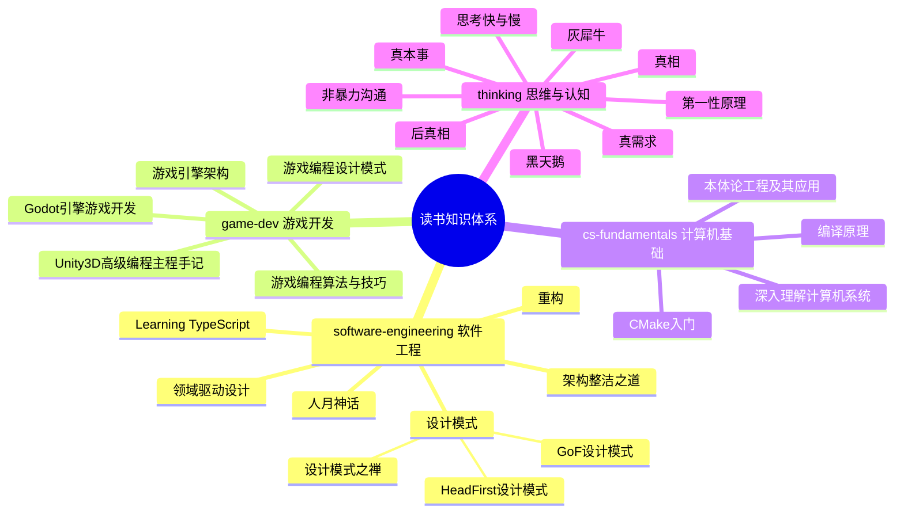
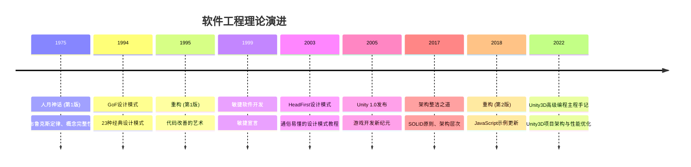

# ReadBooks 知识关联图谱

> 本文件记录了所有读书笔记之间的知识关联关系，帮助构建系统化的个人知识体系。

---

## 🧠 知识领域分布

---

## 📊 书籍关联矩阵

| 书籍A | 书籍B | 关联类型 | 关联强度 | 关联描述 |
|-------|-------|---------|---------|---------|
| 设计模式 | 重构 | 理论-实践 | ⭐⭐⭐⭐⭐ | 重构中使用设计模式来改善代码结构 |
| 人月神话 | 架构整洁之道 | 管理-技术 | ⭐⭐⭐⭐ | 项目管理中的架构原则和团队组织 |
| 编译原理 | 深入理解计算机系统 | 基础-系统 | ⭐⭐⭐⭐⭐ | 计算机系统的基础理论与实践 |
| 游戏引擎架构 | 游戏编程算法与技巧 | 理论-实践 | ⭐⭐⭐⭐⭐ | 游戏开发的架构设计与算法实现 |
| 设计模式 | 架构整洁之道 | 原则-模式 | ⭐⭐⭐⭐⭐ | SOLID原则与设计模式的关系 |
| 重构 | 架构整洁之道 | 实践-原则 | ⭐⭐⭐⭐ | 重构实践遵循架构整洁原则 |
| CMake | 深入理解计算机系统 | 工具-系统 | ⭐⭐⭐ | 构建系统与计算机系统的关系 |
| Learning TypeScript | 设计模式 | 语言-模式 | ⭐⭐⭐⭐ | TypeScript类型系统与设计模式的关系 |
| 游戏引擎架构 | 设计模式 | 架构-模式 | ⭐⭐⭐⭐ | 游戏引擎架构中的设计模式应用 |
| 游戏编程算法与技巧 | 游戏引擎架构 | 算法-架构 | ⭐⭐⭐⭐⭐ | 游戏算法在引擎中的实现 |
| 设计模式之禅 | 设计模式GoF | 本土-原版 | ⭐⭐⭐⭐⭐ | 中文视角与原版理论的互补 |
| CMake入门 | 深入理解计算机系统 | 工具-系统 | ⭐⭐⭐ | 构建系统与计算机系统的关系 |
| Unity3D高级编程主程手记 | 设计模式 | 实践-理论 | ⭐⭐⭐⭐⭐ | Unity3D项目中的设计模式应用 |
| Unity3D高级编程主程手记 | 架构整洁之道 | 实践-原则 | ⭐⭐⭐⭐⭐ | Unity3D架构设计遵循整洁架构原则 |
| Unity3D高级编程主程手记 | 重构 | 实践-方法 | ⭐⭐⭐⭐⭐ | Unity3D项目中的重构实践 |
| Unity3D高级编程主程手记 | 游戏引擎架构 | 实践-理论 | ⭐⭐⭐⭐⭐ | Unity3D引擎架构的实践应用 |
| Unity3D高级编程主程手记 | 深入理解计算机系统 | 实践-基础 | ⭐⭐⭐⭐ | C#内存管理与计算机系统原理 |
| Unity3D高级编程主程手记 | 游戏编程算法与技巧 | 实践-算法 | ⭐⭐⭐⭐ | Unity3D游戏中的算法实现 |
| Godot4游戏开发实战 | 游戏引擎架构 | 实践-理论 | ⭐⭐⭐⭐⭐ | Godot实现了引擎架构中描述的所有子系统，读后能更深理解底层原理 |
| Godot4游戏开发实战 | 游戏编程设计模式 | 实践-模式 | ⭐⭐⭐⭐⭐ | 信号=观察者模式，场景实例化=工厂模式，AnimationTree=状态模式 |
| Godot4游戏开发实战 | 游戏编程算法与技巧 | 引擎-算法 | ⭐⭐⭐⭐ | 路径查找、AI行为树、物理模拟算法在Godot中均有对应API实现 |
| Godot4游戏开发实战 | 设计模式 | 实践-理论 | ⭐⭐⭐⭐ | GDScript中的单例(Autoload)、观察者(Signals)、状态机等经典模式 |
| Godot4游戏开发实战 | Unity3D高级编程主程手记 | 横向对比 | ⭐⭐⭐⭐ | 不同引擎的相同问题域：场景管理、物理系统、性能优化的不同实现思路 |
| 第一性原理 | 架构整洁之道 | 思维-技术 | ⭐⭐⭐⭐⭐ | 依赖倒置原则是软件架构层面的第一性原理，SOLID是软件设计的基本定律 |
| 第一性原理 | 领域驱动设计 | 思维-方法 | ⭐⭐⭐⭐⭐ | 限界上下文和通用语言是对业务领域的第一性原理建模 |
| 第一性原理 | 重构 | 思维-实践 | ⭐⭐⭐⭐ | 代码"坏味道"是假设已过时的信号，重构是重新应用第一性原理 |
| 第一性原理 | 人月神话 | 思维-管理 | ⭐⭐⭐⭐ | Brook's Law是软件项目管理的第一性原理：沟通成本随人数平方增长 |
| 第一性原理 | 本体论工程及其应用 | 思维-知识 | ⭐⭐⭐⭐ | 本体论是知识领域的第一性原理，建立不可争议的基础概念体系 |
| 思考快与慢 | 第一性原理 | 认知-思维 | ⭐⭐⭐⭐⭐ | 第一性原理=强制激活系统2的方法论；克服系统1认知惰性的工具 |
| 思考快与慢 | 人月神话 | 认知-管理 | ⭐⭐⭐⭐⭐ | 计划谬误是Brook's Law的认知根源；管理者系统1低估沟通成本 |
| 思考快与慢 | 架构整洁之道 | 认知-技术 | ⭐⭐⭐⭐ | SOLID原则是系统2理性设计产物；技术债来自系统1惯性积累 |
| 思考快与慢 | 重构 | 认知-实践 | ⭐⭐⭐⭐ | 重构克服系统1"保持现状"惰性；坏味道识别需系统2刻意练习 |
| 思考快与慢 | 领域驱动设计 | 认知-建模 | ⭐⭐⭐⭐ | 领域专家的直觉=规律环境+充分反馈训练出的可靠系统1 |
| 非暴力沟通 | 思考快与慢 | 沟通-认知 | ⭐⭐⭐⭐⭐ | 道德评判是系统1自动输出；NVC是训练系统2介入评判流程的实践方法 |
| 非暴力沟通 | 第一性原理 | 沟通-思维 | ⭐⭐⭐⭐⭐ | "需要"是人际冲突的第一性原理层；策略可争，需要往往可共存 |
| 非暴力沟通 | 真本事 从会工作到会赚钱 | 沟通-职场 | ⭐⭐⭐⭐ | 真本事讲职场策略，NVC提供沟通的心理基础和深层方法论 |
| 非暴力沟通 | 人月神话 | 沟通-管理 | ⭐⭐⭐ | 团队沟通充满评判与防御是沟通成本居高的根源，NVC可降低沟通摩擦 |
| 非暴力沟通 | 领域驱动设计 | 沟通-建模 | ⭐⭐⭐ | 通用语言=团队版NVC观察语言：精确定义词汇，消除歧义和隐性评判 |
| 真需求 | 思考快与慢 | 应用-理论 | ⭐⭐⭐⭐⭐ | 认知战本质是利用系统1建立联想；梁宁教"如何利用"，卡尼曼教"如何防护"——同一认知规律的两种用途 |
| 真需求 | 第一性原理 | 方法论-应用 | ⭐⭐⭐⭐⭐ | 两书共享"从基础事实重新推导"的方法论；"求真"章节与第一性原理几乎是同一件事在商业领域的表达 |
| 真需求 | 真本事 从会工作到会赚钱 | 个人-产品 | ⭐⭐⭐⭐ | 同一逻辑在不同层级的应用：个人的"真本事"=产品的"真需求"，核心都是找到真实价值而非表面价值 |
| 真需求 | 人月神话 | 商业-工程 | ⭐⭐⭐ | 人月神话的"应然vs实然"（增加人手应该加速项目，实际不能）是梁宁框架在软件工程的经典案例 |
| 黑天鹅 | 思考快与慢 | 互补-对话 | ⭐⭐⭐⭐⭐ | 卡尼曼提供认知偏差的心理机制（系统1/系统2），塔勒布提供这些偏差在极端事件中的毁灭性后果；合在一起是对人类不确定性认知的完整批判；但两者有张力：卡尼曼的"规律环境下系统1可靠"在塔勒布的 Extremistan 里不成立 |
| 黑天鹅 | 第一性原理 | 互补-认知 | ⭐⭐⭐⭐ | 第一性原理是主动对抗"认知傲慢"的方法——不断拷问假设是否成立；黑天鹅告诉你即使用第一性原理也存在根本无法认知的边界（unknown unknowns）；两者是认知工具的"攻"与"防" |
| 黑天鹅 | 架构整洁之道 | 哲学-工程 | ⭐⭐⭐ | 依赖倒置是"抗黑天鹅"设计：通过抽象隔离变化；技术债务是"慢速负面黑天鹅"积累；整洁架构的"可维护性"与塔勒布的"鲁棒性"都是在为不确定的未来做准备 |
| 黑天鹅 | 真需求 | 认知-产品 | ⭐⭐⭐⭐ | 叙事谬误的产品层应用：产品经理构建关于用户行为的叙事，然后把叙事当成现实；静默证据在用户研究中：我们只看到了使用产品的用户，看不到因障碍从未注册的用户 |
| 灰犀牛 | 黑天鹅 | 互补-对立 | ⭐⭐⭐⭐⭐ | 两者描述不同类型的风险：黑天鹅=不可预测极端事件（建立鲁棒系统）；灰犀牛=有预警的高概率危机（激励结构和意志力失败）；渥克隐性批评了黑天鹅概念被滥用为免责话语——把灰犀牛说成黑天鹅 |
| 灰犀牛 | 思考快与慢 | 机制-应用 | ⭐⭐⭐⭐⭐ | 五阶段模型的认知科学解释：否认=系统1正常化偏见；拖延=系统1现状偏见+损失厌恶；行动=系统2需要被主动激活；渥克的"重新框架"策略本质是修改系统1启发式路径 |
| 灰犀牛 | 第一性原理 | 认知-行动 | ⭐⭐⭐⭐ | 第一性原理解决"没想清楚"的认知障碍；灰犀牛解决"想清楚了却还是不行动"的意志力和激励障碍——后者才是更普遍的失败模式 |
| 灰犀牛 | 架构整洁之道 | 理论-工程 | ⭐⭐⭐⭐ | 技术债务是软件工程最典型的灰犀牛：高概率、高影响、信号明显但被系统性忽视；整洁架构是提前行动策略；短期交付压力=激励结构失败，导致技术债务犀牛持续成长 |
| 灰犀牛 | 人月神话 | 风险-管理 | ⭐⭐⭐⭐ | 布鲁克斯定律预警了"增加人手会让项目更晚"的灰犀牛，管理者却反复忽视——代理人问题的典型：添人产生的短期"我在做事"感覆盖了长期危害的真相 |
| 真相 | 思考快与慢 | 机制-应用 | ⭐⭐⭐⭐⭐ | 框架效应（Framing Effect）是卡尼曼核心发现之一；麦克唐纳的书是框架效应在现实信息操纵中的系统性应用手册；可得性启发解释了个人故事叙事比系统分析更有说服力的原因 |
| 真相 | 黑天鹅 | 认识论-叙事 | ⭐⭐⭐⭐ | 叙事谬误（把随机性压缩成因果故事）与竞争性真相（从多个竞争叙事中选一个）是同一认知问题的两个维度；都揭示了"我们以为自己理解的远多于实际理解的"这一困境 |
| 真相 | 第一性原理 | 挑战-补充 | ⭐⭐⭐⭐ | 第一性原理要求"回归基本事实"；竞争性真相揭示"基本事实本身就是框架选择的产物"——对第一性原理的元级别批判；两者互补：向下挖掘假设 + 在同一层检查框架选择 |
| 真相 | 领域驱动设计 | 认识论-工程 | ⭐⭐⭐⭐ | 通用语言（Ubiquitous Language）是对"定义不一致"问题的工程解决方案；麦克唐纳定义章节解释了定义为何是责任和义务的边界划定；限界上下文是在架构层面制度化承认"竞争性定义" |
| 真相 | 真需求 | 认识论-商业 | ⭐⭐⭐⭐ | 梁宁的"应然vs实然"与竞争性真相高度同构；认知战的核心机制正是竞争性真相的战略性使用——两者共享"真实数据可以服务于不同叙事"这一洞察 |
| 真相 | 灰犀牛 | 认识论-风险 | ⭐⭐⭐ | 灰犀牛的"集体沉默"（危机被叙事为"正常噪声"）可用竞争性真相解释——在有利于不行动方的框架下，危机预警信号被选择性地定义为"未经证实的预测" |
| 后真相 | 真相 | 认识论谱系 | ⭐⭐⭐⭐⭐ | 两书构成从浅到深的认识论攻击谱系：《真相》讲"真相被选择性呈现"（竞争性真相），《后真相》讲"真相的存在本身被攻击"（认识论相对主义）；麦金太尔书中多次推荐麦克唐纳著作 |
| 后真相 | 思考快与慢 | 机制-挑战 | ⭐⭐⭐⭐⭐ | 卡尼曼的确认偏误、动机性推理是麦金太尔分析的心理学基础；但《后真相》揭示了系统2的局限：动机性推理使理性能力服务于错误立场，"更好地推理"不足以应对后真相 |
| 后真相 | 黑天鹅 | 认识论-叙事 | ⭐⭐⭐⭐ | 叙事谬误（把随机性压缩成强叙事）是后真相的认知基础——对简单强叙事的偏好是后真相操纵的可利用的心理切入点 |
| 后真相 | 第一性原理 | 认识论前提 | ⭐⭐⭐⭐ | 《后真相》揭示了第一性原理的前提条件：各方必须共享"什么是好的证据"的认识论承诺；后真相正是攻击这个前提——在认识论共识崩溃后，第一性原理工具失效 |
| 后真相 | 灰犀牛 | 否认主义-风险 | ⭐⭐⭐ | 科学否认主义（后真相的工具）是气候变化等灰犀牛被持续忽视的关键机制；不只是"激励失败"（渥克），还有"认识论被主动破坏"（麦金太尔）的双重根源 |

---

## 🔍 核心概念追踪

### 单一职责原则 (Single Responsibility Principle)
- **出处**: 架构整洁之道
- **应用**: 
  - 重构：识别和分离职责
  - 设计模式：许多模式的基础原则
- **延伸**: 领域驱动设计、微服务架构

### 开闭原则 (Open-Closed Principle)
- **出处**: 架构整洁之道
- **应用**:
  - 设计模式：策略模式、装饰器模式等
  - 重构：通过抽象开放扩展
- **延伸**: 插件架构、API设计

### 依赖倒置原则 (Dependency Inversion Principle)
- **出处**: 架构整洁之道
- **应用**:
  - 设计模式：依赖注入、工厂模式
  - 架构设计：分层架构、六边形架构
- **延伸**: IoC容器、依赖注入框架

### 布鲁克斯定律
- **出处**: 人月神话
- **核心观点**: 向进度落后的软件项目增加人手，只会让进度更加落后
- **现代应用**: 敏捷开发、DevOps、持续集成
- **延伸**: 团队规模管理、项目规划
- **第一性原理关联**: 本质是沟通成本O(n²)的第一性原理，第一性原理思维可帮助识别这类基础规律

### 第一性原理思维（First Principles Thinking）
- **出处**: 第一性原理
- **核心观点**: 回归事物的基本事实，打破未经检验的假设，从本质重新构建解决方案
- **现代应用**: 颠覆性创新、商业决策、技术架构
- **延伸**: 系统思考、贝叶斯决策、设计思维
- **认知科学关联**: 本质是强制激活系统2（思考快与慢）的方法，克服系统1的认知惰性

### 双系统理论（Dual Process Theory）
- **出处**: 思考，快与慢
- **核心观点**: 人类大脑有系统1（快速、直觉、自动）和系统2（缓慢、分析、理性）两套并行机制
- **现代应用**: 产品设计、决策优化、认知偏见管理、AI对齐研究
- **延伸**: 行为经济学、认知神经科学、助推理论
- **软件工程关联**: 解释为什么良好的代码规范需要强制执行，以及Code Review的认知科学基础

### 损失厌恶（Loss Aversion）
- **出处**: 思考，快与慢（前景理论）
- **核心观点**: 损失的心理痛苦约是同等收益快乐的2倍；人们在面临损失时更倾向于冒险
- **现代应用**: 产品定价、用户留存设计、谈判策略、财务决策
- **延伸**: 禀赋效应、框架效应、前景理论
- **软件工程关联**: 解释技术债务积累（偿还技术债需接受短期"功能损失"）和遗留系统难以替换的原因

### 概念完整性
- **出处**: 人月神话
- **核心观点**: 系统设计中最重要的考虑因素
- **现代应用**: 用户体验设计、API设计
- **延伸**: 设计系统、产品一致性

### 渲染管线 (Rendering Pipeline)
- **出处**: Unity3D高级编程主程手记
- **核心观点**: 理解GPU渲染流程是性能优化的基础
- **现代应用**: 游戏性能优化、图形渲染
- **延伸**: Shader编程、GPU优化技术

### 对象池模式 (Object Pool)
- **出处**: Unity3D高级编程主程手记、设计模式
- **核心观点**: 重用对象减少GC压力，提升性能
- **现代应用**: 游戏对象管理、内存优化
- **延伸**: 内存管理、性能优化模式

### 数据驱动设计 (Data-Driven Design)
- **出处**: Unity3D高级编程主程手记
- **核心观点**: 配置与代码分离，支持热更新
- **现代应用**: 游戏配置系统、内容管理
- **延伸**: 数据表管理、热更新架构

### 非暴力沟通四要素（Observation / Feelings / Needs / Requests）
- **出处**: 非暴力沟通
- **核心观点**: 通过观察（不评判的事实）、感受（真实情绪）、需要（普世需要）、请求（具体可行）四步建立真实连接
- **现代应用**: 亲密关系、职场沟通、冲突调解、代码审查反馈
- **延伸**: 哈佛谈判术（利益式谈判）、同理心设计、积极心理学
- **认知科学关联**: 评判语言是系统1（思考快与慢）的自动输出，NVC是训练系统2介入的实践工具

### 同理心倾听（Empathic Listening）
- **出处**: 非暴力沟通
- **核心观点**: 真正的倾听是放下建议、评判和解释，猜测对方的感受和需要，让对方感到被真正理解
- **现代应用**: 心理咨询、用户访谈、团队1:1、危机干预
- **延伸**: 积极倾听、无条件积极关注（罗杰斯）

### 黑天鹅（Black Swan Event）
- **出处**: 黑天鹅（塔勒布）
- **核心观点**: 极端罕见且影响巨大的事件（黑天鹅），满足三要素：超出正常预期范围、影响极端巨大、事后被赋予"本可预见"的叙事；人类认知系统系统性地低估它们
- **现代应用**: 风险管理、金融投资、战略规划、系统韧性设计
- **延伸**: 反脆弱理论、幂律分布、复杂系统

### Extremistan vs Mediocristan
- **出处**: 黑天鹅（塔勒布）
- **核心观点**: 世界可分为两类域：Mediocristan（高斯分布适用，单次极端观察不影响总体，如身高体重）和 Extremistan（高斯分布危险失效，单次极端观察可主导总体，如财富/城市规模/艺术声誉）
- **现代应用**: 判断统计工具的适用范围；识别哪些领域的历史数据预测是危险的
- **认知科学关联**: 我们生活在 Extremistan，但大脑的启发式系统是在 Mediocristan 里演化的——这是所有认知偏差在极端事件上失效的根本原因

### 哑铃策略（Barbell Strategy）
- **出处**: 黑天鹅（塔勒布）
- **核心观点**: 在不确定性高的领域，采取双极端配置（极度保守 + 极度激进），而非中等风险的"稳健"假象；中等风险是陷阱，它既无法保护你，又限制你的上行空间
- **现代应用**: 投资组合（国债+期权）；职业规划（稳定工作+副业冒险）；项目决策（核心稳定+小实验激进）
- **延伸**: 反脆弱策略、杠铃投资法

### 灰犀牛（Gray Rhino）
- **出处**: 灰犀牛（米歇尔·渥克）
- **核心观点**: 高概率、高影响力、有充分预警信号的明显危机，被系统性忽视和拖延处理；与黑天鹅的本质区别在于：不是"无法预见"，而是"选择不看"；失败根源是意志力和激励结构，而非认知能力
- **现代应用**: 金融风险管理、技术债务治理、气候政策、组织预警文化建设
- **延伸**: 正常化偏见、代理人问题、五阶段危机模型

### 五阶段危机应对模型（Five-Stage Crisis Response）
- **出处**: 灰犀牛（米歇尔·渥克）
- **核心观点**: 面对已知灰犀牛，人和组织的典型反应轨迹：否认→拖延转移→诊断犹豫→恐慌→行动或崩溃；越晚行动代价越高；在恐慌阶段才行动是最糟糕的时机
- **现代应用**: 危机管理、项目预警机制、技术债务决策时机
- **认知科学关联**: 系统1主导了否认/拖延/恐慌三阶段；系统2（思考快与慢）需要被主动激活才能产生理性的早期行动

### 正常化偏见（Normalcy Bias）
- **出处**: 灰犀牛（米歇尔·渥克）
- **核心观点**: 大脑默认"世界会继续按历史模式运行"，把威胁信号过滤为暂时噪声；是灰犀牛"否认阶段"最主要的认知机制
- **现代应用**: 灾难预警心理学、组织危机管理、投资风险认知
- **认知科学关联**: 是系统1（思考快与慢）的"稳定性假设"启发式在极端变化场景下的失效表现

### 竞争性真相（Competing Truths）
- **出处**: 真相（赫克托·麦克唐纳）
- **核心观点**: 关于同一现实，可以同时存在多个相互矛盾但各自成立的真实陈述；信息操纵最精致的形式不是谎言，而是通过选择性呈现竞争性真相来制造偏向的认知；13种主要操纵维度：复杂性、历史、情境、数字、故事、道德、可欲性、金融价值、定义、社会建构、名称、预测、信念
- **现代应用**: 媒体素养、信息核查、产品传播、政策分析、技术文档定义
- **认知科学关联**: 框架效应（思考快与慢）是核心机制；叙事谬误（黑天鹅）是选择性竞争真相最终固化为单一叙事的过程

### 定义即责任边界（Definitions as Liability Boundaries）
- **出处**: 真相（赫克托·麦克唐纳）
- **核心观点**: 术语的定义不只是语义问题，而是直接决定了责任范围、道德义务和法律义务的边界；卢旺达案例——刻意回避"genocide"一词以规避《灭绝种族罪公约》义务；克林顿案例——实时定义操纵以规避道德责任
- **工程应用**: API设计中的概念定义、微服务边界、业务术语的通用语言建立
- **延伸**: 领域驱动设计的通用语言（Ubiquitous Language）是对这一原理的工程制度化

### 后真相（Post-Truth）
- **出处**: 后真相（李·麦金太尔）
- **核心观点**: 将情感置于事实之上并拒绝被事实纠正的文化态度；不只是撒谎，而是攻击"什么算作真相"的认识论基础本身；后真相不是个人的无知，而是对认识论的系统性攻击
- **现代应用**: 信息素养教育、科学传播、政治分析、媒体批评
- **认知科学关联**: 建立在确认偏误、动机性推理、部落认识论（思考快与慢）之上，并通过社交媒体算法被工业化放大

### 科学否认主义 FLICC 框架
- **出处**: 后真相（李·麦金太尔），原始研究来自 John Cook 等科学传播学者
- **核心观点**: 科学否认主义有五种标准手段（FLICC）：Fake Experts（伪专家）、Logical Fallacies（逻辑谬误）、Impossible Expectations（不可能标准）、Cherry-Picking（樱桃摘取）、Conspiracy Theories（阴谋论）；这五种手段不只用于反科学，而是一套通用的认识论操纵工具
- **现代应用**: 识别科学否认主义、技术决策中的认识论操纵、产品争论中的非理性论证
- **历史起源**: 1953年烟草公司"制造疑惑"策略；此后被气候否认主义、疫苗否认主义复制使用

### 接种免疫理论（Inoculation Theory）
- **出处**: 后真相（李·麦金太尔）；原始心理学研究来自 William McGuire
- **核心观点**: 在错误信息传播之前，告知人们某个领域存在特定操纵手段并解释其机制，比事后纠正有效得多；类似疫苗接种的逻辑——用"弱化版病原体"激活认识论免疫系统
- **现代应用**: 媒体素养教育、科学传播策略、组织内部信息安全培训
- **延伸**: Go Viral 游戏（基于接种免疫理论设计）、FLICC 识别训练

---

## 📅 理论演进时间线

---

## 🎯 学习路径推荐

### 软件工程基础路径
1. **人月神话** → 理解软件项目管理的基本原理
2. **设计模式 (GoF + HeadFirst + 设计模式之禅)** → 掌握面向对象设计模式
3. **重构** → 学习如何改善现有代码
4. **架构整洁之道** → 理解软件架构的核心原则

### 计算机科学基础路径
1. **深入理解计算机系统** → 理解计算机系统底层原理
2. **编译原理** → 理解程序如何被翻译和执行
3. **(可选) 计算机网络** → 理解网络通信原理
4. **(可选) 数据结构与算法** → 掌握基础数据结构

### 游戏开发路径
1. **游戏编程算法与技巧** → 学习游戏开发常用算法
2. **游戏引擎架构** → 理解游戏引擎的架构设计
3. **Unity3D高级编程主程手记** → Unity3D项目实战与架构实践
4. **(可选) 图形学基础** → 理解图形渲染原理
5. **(可选) 游戏设计模式** → 应用设计模式到游戏开发

### Unity3D专业路径
1. **设计模式** → 掌握面向对象设计模式
2. **架构整洁之道** → 理解软件架构的核心原则
3. **Unity3D高级编程主程手记** → Unity3D项目架构与性能优化
4. **(可选) Unity Shader入门精要** → 深入学习渲染和Shader编程
5. **(可选) 游戏编程模式** → 游戏开发中的设计模式实践

### 工具与实践路径
1. **CMake入门** → 掌握现代构建系统
2. **Git版本控制** → (建议添加)
3. **测试驱动开发** → (建议添加)
4. **持续集成/持续部署** → (建议添加)

---

## 📈 知识体系成熟度

### 已建立的知识领域
- ✅ **软件工程基础** (理论+实践完备)
- ✅ **设计模式** (多角度深入理解)
- ✅ **项目管理** (经典理论+现代实践)
- 🔄 **游戏开发** (理论完备，Unity3D实践中)
- 🔄 **计算机基础** (开始建立，需持续补充)
- ✅ **Unity3D开发** (架构设计+性能优化)

### 待加强的知识领域
- ❌ **算法与数据结构** (尚未系统学习)
- ❌ **计算机网络** (尚未涉及)
- ❌ **数据库系统** (尚未涉及)
- ❌ **人工智能/机器学习** (虽有专家，但无相关书籍)
- ❌ **前端开发** (尚未涉及)

---

## 🔗 跨领域知识关联

### 数学 → 计算机科学
- **线性代数** → 图形学、机器学习
- **概率统计** → 算法分析、机器学习
- **离散数学** → 数据结构、算法设计

### 心理学 → 软件工程
- **认知心理学** → 用户体验设计
- **社会心理学** → 团队管理、人月神话

### 哲学 → 架构设计
- **系统思维** → 架构设计原则
- **简化原则** → 架构整洁之道

---

## 💡 知识创新点

### 从现有知识中产生的新思考
1. **设计模式 + 重构 + 架构整洁之道** → 如何建立自动化的重构建议系统？
2. **人月神话 + 现代敏捷实践** → 布鲁克斯定律在DevOps环境下的新解读
3. **游戏引擎架构 + 编译原理** → 游戏脚本语言的编译器设计
4. **CMake + 深入理解计算机系统** → 构建系统如何影响程序性能
5. **Unity3D高级编程主程手记 + 架构整洁之道** → Unity3D项目中的整洁架构实践
6. **Unity3D高级编程主程手记 + 设计模式** → Unity3D组件化架构的设计模式应用
7. **Unity3D高级编程主程手记 + 深入理解计算机系统** → C#内存管理与系统底层原理的结合

---

## 📝 更新日志

- **2026-04-17**: 创建知识关联图谱，建立基础的知识体系框架
- **2026-05-05**: 添加《Unity3D高级编程：主程手记》及其关联关系，扩展游戏开发知识领域

---

## 🎯 使用指南

1. **阅读新书前**: 查看本书与已读书籍的关联，建立知识预期
2. **阅读过程中**: 在笔记中添加"知识关联网络"章节
3. **阅读完成后**: 更新本文件，添加新的关联关系
4. **定期回顾**: 使用本文件回顾整个知识体系，发现知识盲区

---

*本文件会随着阅读新书籍而持续更新，目标是建立完整的个人知识体系图谱。*
