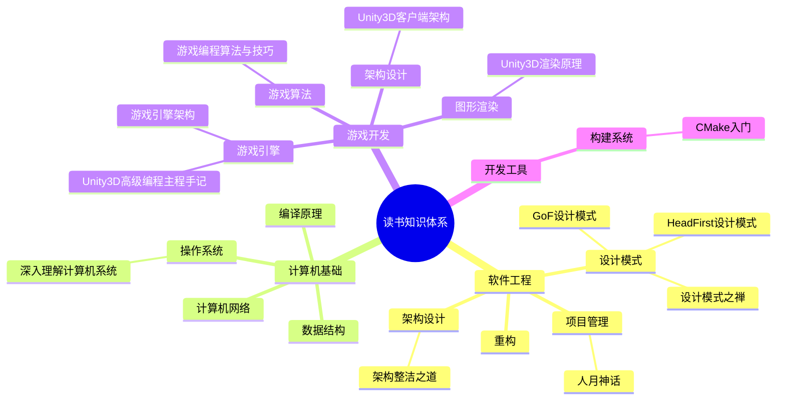
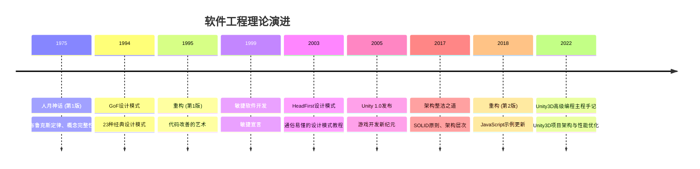

# ReadBooks 知识关联图谱

> 本文件记录了所有读书笔记之间的知识关联关系，帮助构建系统化的个人知识体系。

---

## 🧠 知识领域分布

---

## 📊 书籍关联矩阵

| 书籍A | 书籍B | 关联类型 | 关联强度 | 关联描述 |
|-------|-------|---------|---------|---------|
| 设计模式 | 重构 | 理论-实践 | ⭐⭐⭐⭐⭐ | 重构中使用设计模式来改善代码结构 |
| 人月神话 | 架构整洁之道 | 管理-技术 | ⭐⭐⭐⭐ | 项目管理中的架构原则和团队组织 |
| 编译原理 | 深入理解计算机系统 | 基础-系统 | ⭐⭐⭐⭐⭐ | 计算机系统的基础理论与实践 |
| 游戏引擎架构 | 游戏编程算法与技巧 | 理论-实践 | ⭐⭐⭐⭐⭐ | 游戏开发的架构设计与算法实现 |
| 设计模式 | 架构整洁之道 | 原则-模式 | ⭐⭐⭐⭐⭐ | SOLID原则与设计模式的关系 |
| 重构 | 架构整洁之道 | 实践-原则 | ⭐⭐⭐⭐ | 重构实践遵循架构整洁原则 |
| CMake | 深入理解计算机系统 | 工具-系统 | ⭐⭐⭐ | 构建系统与计算机系统的关系 |
| Learning TypeScript | 设计模式 | 语言-模式 | ⭐⭐⭐⭐ | TypeScript类型系统与设计模式的关系 |
| 游戏引擎架构 | 设计模式 | 架构-模式 | ⭐⭐⭐⭐ | 游戏引擎架构中的设计模式应用 |
| 游戏编程算法与技巧 | 游戏引擎架构 | 算法-架构 | ⭐⭐⭐⭐⭐ | 游戏算法在引擎中的实现 |
| 设计模式之禅 | 设计模式GoF | 本土-原版 | ⭐⭐⭐⭐⭐ | 中文视角与原版理论的互补 |
| CMake入门 | 深入理解计算机系统 | 工具-系统 | ⭐⭐⭐ | 构建系统与计算机系统的关系 |
| Unity3D高级编程主程手记 | 设计模式 | 实践-理论 | ⭐⭐⭐⭐⭐ | Unity3D项目中的设计模式应用 |
| Unity3D高级编程主程手记 | 架构整洁之道 | 实践-原则 | ⭐⭐⭐⭐⭐ | Unity3D架构设计遵循整洁架构原则 |
| Unity3D高级编程主程手记 | 重构 | 实践-方法 | ⭐⭐⭐⭐⭐ | Unity3D项目中的重构实践 |
| Unity3D高级编程主程手记 | 游戏引擎架构 | 实践-理论 | ⭐⭐⭐⭐⭐ | Unity3D引擎架构的实践应用 |
| Unity3D高级编程主程手记 | 深入理解计算机系统 | 实践-基础 | ⭐⭐⭐⭐ | C#内存管理与计算机系统原理 |
| Unity3D高级编程主程手记 | 游戏编程算法与技巧 | 实践-算法 | ⭐⭐⭐⭐ | Unity3D游戏中的算法实现 |

---

## 🔍 核心概念追踪

### 单一职责原则 (Single Responsibility Principle)
- **出处**: 架构整洁之道
- **应用**: 
  - 重构：识别和分离职责
  - 设计模式：许多模式的基础原则
- **延伸**: 领域驱动设计、微服务架构

### 开闭原则 (Open-Closed Principle)
- **出处**: 架构整洁之道
- **应用**:
  - 设计模式：策略模式、装饰器模式等
  - 重构：通过抽象开放扩展
- **延伸**: 插件架构、API设计

### 依赖倒置原则 (Dependency Inversion Principle)
- **出处**: 架构整洁之道
- **应用**:
  - 设计模式：依赖注入、工厂模式
  - 架构设计：分层架构、六边形架构
- **延伸**: IoC容器、依赖注入框架

### 布鲁克斯定律
- **出处**: 人月神话
- **核心观点**: 向进度落后的软件项目增加人手，只会让进度更加落后
- **现代应用**: 敏捷开发、DevOps、持续集成
- **延伸**: 团队规模管理、项目规划

### 概念完整性
- **出处**: 人月神话
- **核心观点**: 系统设计中最重要的考虑因素
- **现代应用**: 用户体验设计、API设计
- **延伸**: 设计系统、产品一致性

### 渲染管线 (Rendering Pipeline)
- **出处**: Unity3D高级编程主程手记
- **核心观点**: 理解GPU渲染流程是性能优化的基础
- **现代应用**: 游戏性能优化、图形渲染
- **延伸**: Shader编程、GPU优化技术

### 对象池模式 (Object Pool)
- **出处**: Unity3D高级编程主程手记、设计模式
- **核心观点**: 重用对象减少GC压力，提升性能
- **现代应用**: 游戏对象管理、内存优化
- **延伸**: 内存管理、性能优化模式

### 数据驱动设计 (Data-Driven Design)
- **出处**: Unity3D高级编程主程手记
- **核心观点**: 配置与代码分离，支持热更新
- **现代应用**: 游戏配置系统、内容管理
- **延伸**: 数据表管理、热更新架构

---

## 📅 理论演进时间线

---

## 🎯 学习路径推荐

### 软件工程基础路径
1. **人月神话** → 理解软件项目管理的基本原理
2. **设计模式 (GoF + HeadFirst + 设计模式之禅)** → 掌握面向对象设计模式
3. **重构** → 学习如何改善现有代码
4. **架构整洁之道** → 理解软件架构的核心原则

### 计算机科学基础路径
1. **深入理解计算机系统** → 理解计算机系统底层原理
2. **编译原理** → 理解程序如何被翻译和执行
3. **(可选) 计算机网络** → 理解网络通信原理
4. **(可选) 数据结构与算法** → 掌握基础数据结构

### 游戏开发路径
1. **游戏编程算法与技巧** → 学习游戏开发常用算法
2. **游戏引擎架构** → 理解游戏引擎的架构设计
3. **Unity3D高级编程主程手记** → Unity3D项目实战与架构实践
4. **(可选) 图形学基础** → 理解图形渲染原理
5. **(可选) 游戏设计模式** → 应用设计模式到游戏开发

### Unity3D专业路径
1. **设计模式** → 掌握面向对象设计模式
2. **架构整洁之道** → 理解软件架构的核心原则
3. **Unity3D高级编程主程手记** → Unity3D项目架构与性能优化
4. **(可选) Unity Shader入门精要** → 深入学习渲染和Shader编程
5. **(可选) 游戏编程模式** → 游戏开发中的设计模式实践

### 工具与实践路径
1. **CMake入门** → 掌握现代构建系统
2. **Git版本控制** → (建议添加)
3. **测试驱动开发** → (建议添加)
4. **持续集成/持续部署** → (建议添加)

---

## 📈 知识体系成熟度

### 已建立的知识领域
- ✅ **软件工程基础** (理论+实践完备)
- ✅ **设计模式** (多角度深入理解)
- ✅ **项目管理** (经典理论+现代实践)
- 🔄 **游戏开发** (理论完备，Unity3D实践中)
- 🔄 **计算机基础** (开始建立，需持续补充)
- ✅ **Unity3D开发** (架构设计+性能优化)

### 待加强的知识领域
- ❌ **算法与数据结构** (尚未系统学习)
- ❌ **计算机网络** (尚未涉及)
- ❌ **数据库系统** (尚未涉及)
- ❌ **人工智能/机器学习** (虽有专家，但无相关书籍)
- ❌ **前端开发** (尚未涉及)

---

## 🔗 跨领域知识关联

### 数学 → 计算机科学
- **线性代数** → 图形学、机器学习
- **概率统计** → 算法分析、机器学习
- **离散数学** → 数据结构、算法设计

### 心理学 → 软件工程
- **认知心理学** → 用户体验设计
- **社会心理学** → 团队管理、人月神话

### 哲学 → 架构设计
- **系统思维** → 架构设计原则
- **简化原则** → 架构整洁之道

---

## 💡 知识创新点

### 从现有知识中产生的新思考
1. **设计模式 + 重构 + 架构整洁之道** → 如何建立自动化的重构建议系统？
2. **人月神话 + 现代敏捷实践** → 布鲁克斯定律在DevOps环境下的新解读
3. **游戏引擎架构 + 编译原理** → 游戏脚本语言的编译器设计
4. **CMake + 深入理解计算机系统** → 构建系统如何影响程序性能
5. **Unity3D高级编程主程手记 + 架构整洁之道** → Unity3D项目中的整洁架构实践
6. **Unity3D高级编程主程手记 + 设计模式** → Unity3D组件化架构的设计模式应用
7. **Unity3D高级编程主程手记 + 深入理解计算机系统** → C#内存管理与系统底层原理的结合

---

## 📝 更新日志

- **2026-04-17**: 创建知识关联图谱，建立基础的知识体系框架
- **2026-05-05**: 添加《Unity3D高级编程：主程手记》及其关联关系，扩展游戏开发知识领域

---

## 🎯 使用指南

1. **阅读新书前**: 查看本书与已读书籍的关联，建立知识预期
2. **阅读过程中**: 在笔记中添加"知识关联网络"章节
3. **阅读完成后**: 更新本文件，添加新的关联关系
4. **定期回顾**: 使用本文件回顾整个知识体系，发现知识盲区

---

*本文件会随着阅读新书籍而持续更新，目标是建立完整的个人知识体系图谱。*
