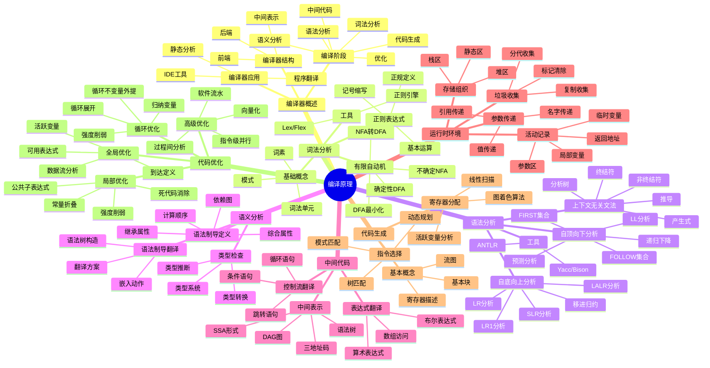
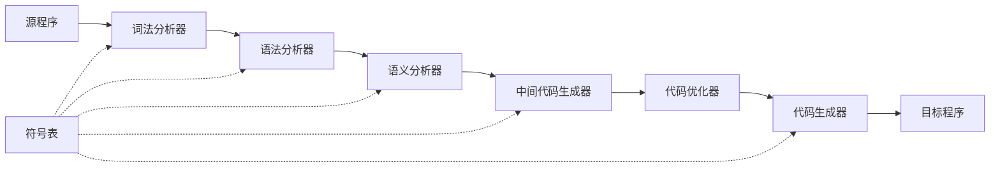
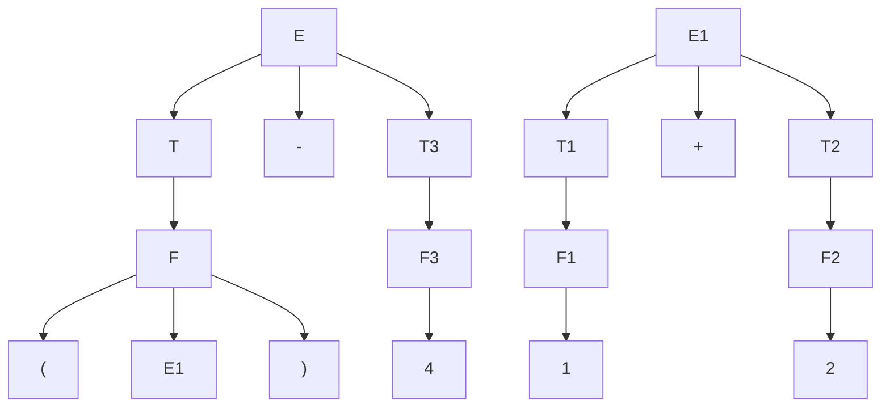
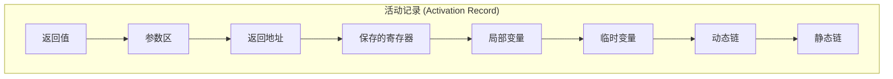
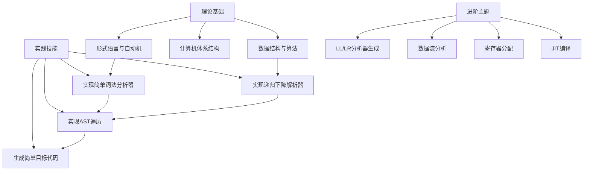
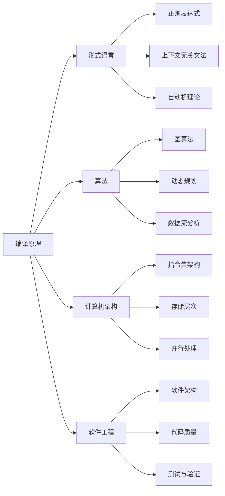

# 📚 编译原理（龙书）

## 📖 基本信息

- **原名**: Compilers: Principles, Techniques, and Tools (2nd Edition)
- **作者**: Alfred V. Aho, Monica S. Lam, Ravi Sethi, Jeffrey D. Ullman
- **中文译者**: 赵建华、郑滔、戴新宇
- **出版社**: 机械工业出版社 / Addison-Wesley
- **出版年份**: 2006年(英文第2版) / 2009年(中文版)
- **页数**: 约1009页
- **创建时间**: 2026年3月2日
- **难度等级**: 高级
- **阅读状态**: 📖 正在阅读
- **个人评分**: ⭐⭐⭐⭐⭐
- **标签**: #编译原理 #龙书 #词法分析 #语法分析 #代码优化 #计算机科学

## 📝 内容概要

### 书籍简介

《编译原理》是计算机科学领域最具影响力的经典教材之一，因其封面设计被称为"**龙书**"。本书由四位图灵奖级别学者联合撰写，系统性地介绍了编译器设计的原理、技术和工具。从词法分析到代码生成，从基础理论到高级优化技术，本书提供了构建现代编译器所需的全部知识体系。

本书不仅被全球顶尖高校（斯坦福、MIT、CMU、清华、北大等）作为核心教材，也是每位编译器工程师的必备参考书。第二版在1986年第一版的基础上，新增了指令级并行、并行化优化和过程间分析等现代编译技术内容。

### 核心主题

1. **词法分析** - 正则表达式、有限自动机、词法分析器生成
2. **语法分析** - 上下文无关文法、LL/LR分析、语法分析器生成
3. **语义分析** - 语法制导翻译、属性文法、类型检查
4. **中间代码生成** - 三地址码、语法树、中间表示
5. **代码优化** - 数据流分析、循环优化、并行优化
6. **代码生成** - 寄存器分配、指令选择、目标代码生成
7. **运行时环境** - 存储组织、活动记录、垃圾收集

### 主要章节结构

#### 第一部分：编译器基础（第1-2章）
- 编译器概述与基本结构
- 简单的一遍编译器设计

#### 第二部分：前端技术（第3-6章）
- 词法分析
- 语法分析
- 语法制导翻译
- 中间代码生成

#### 第三部分：后端技术（第7-9章）
- 运行时环境
- 代码生成
- 代码优化

#### 第四部分：高级主题（第10-12章）
- 指令级并行
- 并行化和局部性优化
- 过程间分析

## 🧠 知识架构



## ✍️ 读书笔记

### 第1章：编译器概述

**本章要点**：介绍编译器的基本概念、结构和工作流程。

#### 重点摘录
> "编译器是一个程序，它读入用源语言编写的程序，将其翻译成等价的目标语言程序。"

> "编译器的结构反映了它所执行的任务的本质。"

#### 编译器的整体结构



#### 编译器各阶段详解

| 阶段 | 输入 | 输出 | 主要任务 |
|------|------|------|---------|
| **词法分析** | 字符流 | 词法单元流 | 识别标识符、关键字、常量等 |
| **语法分析** | 词法单元流 | 语法树 | 构建程序的语法结构 |
| **语义分析** | 语法树 | 语法树+类型信息 | 类型检查、作用域分析 |
| **中间代码** | 语法树 | 中间表示 | 生成与机器无关的代码 |
| **代码优化** | 中间表示 | 优化的中间表示 | 提高执行效率 |
| **代码生成** | 中间表示 | 目标代码 | 生成机器码或汇编 |

#### 简单的词法分析器示例

```javascript
// 简单的词法分析器实现
class Lexer {
  constructor(input) {
    this.input = input;
    this.pos = 0;
    this.currentChar = this.input[this.pos];
  }

  // 前进一个字符
  advance() {
    this.pos++;
    this.currentChar = this.pos < this.input.length
      ? this.input[this.pos]
      : null;
  }

  // 跳过空白字符
  skipWhitespace() {
    while (this.currentChar && /\s/.test(this.currentChar)) {
      this.advance();
    }
  }

  // 读取数字
  number() {
    let result = '';
    while (this.currentChar && /\d/.test(this.currentChar)) {
      result += this.currentChar;
      this.advance();
    }
    return { type: 'NUMBER', value: parseInt(result) };
  }

  // 读取标识符
  identifier() {
    let result = '';
    while (this.currentChar && /[a-zA-Z0-9_]/.test(this.currentChar)) {
      result += this.currentChar;
      this.advance();
    }

    // 检查是否是关键字
    const keywords = {
      'if': 'IF',
      'else': 'ELSE',
      'while': 'WHILE',
      'for': 'FOR',
      'return': 'RETURN',
      'function': 'FUNCTION',
      'let': 'LET',
      'const': 'CONST'
    };

    const tokenType = keywords[result] || 'IDENTIFIER';
    return { type: tokenType, value: result };
  }

  // 获取下一个词法单元
  getNextToken() {
    while (this.currentChar) {
      // 跳过空白
      if (/\s/.test(this.currentChar)) {
        this.skipWhitespace();
        continue;
      }

      // 数字
      if (/\d/.test(this.currentChar)) {
        return this.number();
      }

      // 标识符或关键字
      if (/[a-zA-Z_]/.test(this.currentChar)) {
        return this.identifier();
      }

      // 运算符和分隔符
      const singleCharTokens = {
        '+': 'PLUS',
        '-': 'MINUS',
        '*': 'MULTIPLY',
        '/': 'DIVIDE',
        '(': 'LPAREN',
        ')': 'RPAREN',
        '{': 'LBRACE',
        '}': 'RBRACE',
        ';': 'SEMICOLON',
        ',': 'COMMA',
        '=': 'ASSIGN'
      };

      if (singleCharTokens[this.currentChar]) {
        const token = {
          type: singleCharTokens[this.currentChar],
          value: this.currentChar
        };
        this.advance();
        return token;
      }

      throw new Error(`Unknown character: ${this.currentChar}`);
    }

    return { type: 'EOF', value: null };
  }
}

// 使用示例
const lexer = new Lexer('let x = 42;');
let token;
while ((token = lexer.getNextToken()).type !== 'EOF') {
  console.log(token);
}
// 输出:
// { type: 'LET', value: 'let' }
// { type: 'IDENTIFIER', value: 'x' }
// { type: 'ASSIGN', value: '=' }
// { type: 'NUMBER', value: 42 }
// { type: 'SEMICOLON', value: ';' }
```

---

### 第3章：词法分析

**本章要点**：深入讨论词法分析的原理和实现技术。

#### 重点摘录
> "词法分析是编译的第一个阶段，它的主要任务是读入源程序的字符流，将其组织成有意义的词素序列。"

> "正则表达式是描述词法模式的强大工具，而有限自动机是实现词法分析的理论基础。"

#### 正则表达式基础

```javascript
// 正则表达式到NFA转换的简化实现
class NFAState {
  constructor(isAccept = false) {
    this.transitions = new Map(); // 字符 -> 状态集合
    this.epsilonTransitions = []; // ε转移
    this.isAccept = isAccept;
  }

  addTransition(char, state) {
    if (!this.transitions.has(char)) {
      this.transitions.set(char, []);
    }
    this.transitions.get(char).push(state);
  }

  addEpsilonTransition(state) {
    this.epsilonTransitions.push(state);
  }
}

class NFA {
  constructor(start, accept) {
    this.start = start;
    this.accept = accept;
  }
}

// 从字符构建基本NFA
function fromChar(char) {
  const start = new NFAState();
  const accept = new NFAState(true);
  start.addTransition(char, accept);
  return new NFA(start, accept);
}

// 连接操作 (ab)
function concatenate(nfa1, nfa2) {
  nfa1.accept.isAccept = false;
  nfa1.accept.addEpsilonTransition(nfa2.start);
  return new NFA(nfa1.start, nfa2.accept);
}

// 选择操作 (a|b)
function alternate(nfa1, nfa2) {
  const start = new NFAState();
  const accept = new NFAState(true);

  start.addEpsilonTransition(nfa1.start);
  start.addEpsilonTransition(nfa2.start);

  nfa1.accept.isAccept = false;
  nfa2.accept.isAccept = false;
  nfa1.accept.addEpsilonTransition(accept);
  nfa2.accept.addEpsilonTransition(accept);

  return new NFA(start, accept);
}

// 闭包操作 (a*)
function closure(nfa) {
  const start = new NFAState();
  const accept = new NFAState(true);

  start.addEpsilonTransition(nfa.start);
  start.addEpsilonTransition(accept);

  nfa.accept.isAccept = false;
  nfa.accept.addEpsilonTransition(nfa.start);
  nfa.accept.addEpsilonTransition(accept);

  return new NFA(start, accept);
}
```

#### NFA到DFA转换（子集构造算法）

```javascript
// NFA到DFA的子集构造算法
class DFAState {
  constructor(nfaStates) {
    this.nfaStates = nfaStates; // NFA状态集合
    this.transitions = new Map(); // 字符 -> DFA状态
    this.isAccept = false;
  }
}

function epsilonClosure(nfaState) {
  const closure = new Set();
  const stack = [nfaState];

  while (stack.length > 0) {
    const state = stack.pop();
    if (!closure.has(state)) {
      closure.add(state);
      for (const epsilonState of state.epsilonTransitions) {
        stack.push(epsilonState);
      }
    }
  }

  return closure;
}

function move(nfaStates, char) {
  const result = new Set();
  for (const state of nfaStates) {
    if (state.transitions.has(char)) {
      for (const nextState of state.transitions.get(char)) {
        result.add(nextState);
      }
    }
  }
  return result;
}

function nfaToDfa(nfa) {
  const startClosure = epsilonClosure(nfa.start);
  const startDfaState = new DFAState(startClosure);
  startDfaState.isAccept = startClosure.has(nfa.accept);

  const dfaStates = [startDfaState];
  const unmarked = [startDfaState];
  const alphabet = ['a', 'b', 'c', '0', '1', '2']; // 简化的字母表

  while (unmarked.length > 0) {
    const currentDfaState = unmarked.pop();

    for (const char of alphabet) {
      const moveResult = move(currentDfaState.nfaStates, char);
      const newClosure = new Set();

      for (const nfaState of moveResult) {
        for (const state of epsilonClosure(nfaState)) {
          newClosure.add(state);
        }
      }

      if (newClosure.size > 0) {
        // 检查是否已存在
        let existingState = dfaStates.find(
          s => setsEqual(s.nfaStates, newClosure)
        );

        if (!existingState) {
          existingState = new DFAState(newClosure);
          existingState.isAccept = newClosure.has(nfa.accept);
          dfaStates.push(existingState);
          unmarked.push(existingState);
        }

        currentDfaState.transitions.set(char, existingState);
      }
    }
  }

  return { startState: startDfaState, states: dfaStates };
}

function setsEqual(a, b) {
  if (a.size !== b.size) return false;
  for (const item of a) {
    if (!b.has(item)) return false;
  }
  return true;
}
```

#### 词法单元的识别

```
词法分析器的输出：

┌──────────────────────────────────────────────┐
│ 源代码: let count = 42;                       │
├──────────────────────────────────────────────┤
│ 词法单元流:                                   │
│                                              │
│ <LET, "let">                                 │
│ <ID, "count">    ── 符号表中查找/添加         │
│ <ASSIGN, "=">                                │
│ <NUM, 42>        ── 属性值: 整数42            │
│ <SEMICOLON, ";">                             │
└──────────────────────────────────────────────┘
```

---

### 第4章：语法分析

**本章要点**：介绍语法分析的核心技术，包括自顶向下和自底向上分析方法。

#### 重点摘录
> "语法分析的任务是确定源程序的语法结构，并构建表示该结构的语法树。"

> "上下文无关文法是描述程序设计语言语法的标准形式。"

#### 上下文无关文法（CFG）

```javascript
// 上下文无关文法表示
class Grammar {
  constructor() {
    this.nonTerminals = new Set(); // 非终结符
    this.terminals = new Set();    // 终结符
    this.productions = [];         // 产生式
    this.startSymbol = null;       // 开始符号
  }

  addProduction(lhs, rhs) {
    this.nonTerminals.add(lhs);
    this.productions.push({ lhs, rhs });

    for (const symbol of rhs) {
      if (!symbol.startsWith('<') || !symbol.endsWith('>')) {
        this.terminals.add(symbol);
      }
    }
  }

  setStart(symbol) {
    this.startSymbol = symbol;
    this.nonTerminals.add(symbol);
  }
}

// 算术表达式文法示例
// E -> E + T | E - T | T
// T -> T * F | T / F | F
// F -> ( E ) | id | num

const exprGrammar = new Grammar();
exprGrammar.setStart('<E>');
exprGrammar.addProduction('<E>', ['<E>', '+', '<T>']);
exprGrammar.addProduction('<E>', ['<E>', '-', '<T>']);
exprGrammar.addProduction('<E>', ['<T>']);
exprGrammar.addProduction('<T>', ['<T>', '*', '<F>']);
exprGrammar.addProduction('<T>', ['<T>', '/', '<F>']);
exprGrammar.addProduction('<T>', ['<F>']);
exprGrammar.addProduction('<F>', ['(', '<E>', ')']);
exprGrammar.addProduction('<F>', ['id']);
exprGrammar.addProduction('<F>', ['num']);
```

#### FIRST和FOLLOW集合计算

```javascript
// FIRST集合计算
function computeFirst(grammar) {
  const first = new Map();

  // 初始化
  for (const terminal of grammar.terminals) {
    first.set(terminal, new Set([terminal]));
  }
  for (const nonTerminal of grammar.nonTerminals) {
    first.set(nonTerminal, new Set());
  }

  // 迭代直到不变
  let changed = true;
  while (changed) {
    changed = false;

    for (const prod of grammar.productions) {
      const lhs = prod.lhs;
      const rhs = prod.rhs;
      const lhsFirst = first.get(lhs);
      const oldSize = lhsFirst.size;

      // 如果右部第一个符号是终结符
      if (rhs.length === 0 || grammar.terminals.has(rhs[0])) {
        if (rhs.length > 0) {
          lhsFirst.add(rhs[0]);
        }
      } else {
        // 第一个符号是非终结符
        const firstOfFirst = first.get(rhs[0]);
        for (const symbol of firstOfFirst) {
          if (symbol !== 'ε') {
            lhsFirst.add(symbol);
          }
        }
      }

      if (lhsFirst.size > oldSize) {
        changed = true;
      }
    }
  }

  return first;
}

// FOLLOW集合计算
function computeFollow(grammar, first) {
  const follow = new Map();

  // 初始化
  for (const nonTerminal of grammar.nonTerminals) {
    follow.set(nonTerminal, new Set());
  }
  follow.get(grammar.startSymbol).add('$'); // 结束标记

  // 迭代直到不变
  let changed = true;
  while (changed) {
    changed = false;

    for (const prod of grammar.productions) {
      const lhs = prod.lhs;
      const rhs = prod.rhs;

      for (let i = 0; i < rhs.length; i++) {
        const symbol = rhs[i];

        if (grammar.nonTerminals.has(symbol)) {
          const followOfSymbol = follow.get(symbol);
          const oldSize = followOfSymbol.size;

          // 查看符号后面是什么
          if (i + 1 < rhs.length) {
            const nextSymbol = rhs[i + 1];
            const firstOfNext = first.get(nextSymbol);

            for (const s of firstOfNext) {
              if (s !== 'ε') {
                followOfSymbol.add(s);
              }
            }

            // 如果下一个符号可以推导出ε
            if (firstOfNext.has('ε')) {
              const followOfLhs = follow.get(lhs);
              for (const s of followOfLhs) {
                followOfSymbol.add(s);
              }
            }
          } else {
            // 符号在产生式末尾
            const followOfLhs = follow.get(lhs);
            for (const s of followOfLhs) {
              followOfSymbol.add(s);
            }
          }

          if (followOfSymbol.size > oldSize) {
            changed = true;
          }
        }
      }
    }
  }

  return follow;
}
```

#### 递归下降语法分析器

```javascript
// 递归下降语法分析器
class RecursiveDescentParser {
  constructor(lexer) {
    this.lexer = lexer;
    this.currentToken = this.lexer.getNextToken();
  }

  eat(tokenType) {
    if (this.currentToken.type === tokenType) {
      this.currentToken = this.lexer.getNextToken();
    } else {
      throw new Error(`Expected ${tokenType}, got ${this.currentToken.type}`);
    }
  }

  // expr -> term ((+ | -) term)*
  expr() {
    let node = this.term();

    while (['PLUS', 'MINUS'].includes(this.currentToken.type)) {
      const token = this.currentToken;
      if (token.type === 'PLUS') {
        this.eat('PLUS');
        node = { type: 'BinOp', left: node, op: '+', right: this.term() };
      } else if (token.type === 'MINUS') {
        this.eat('MINUS');
        node = { type: 'BinOp', left: node, op: '-', right: this.term() };
      }
    }

    return node;
  }

  // term -> factor ((* | /) factor)*
  term() {
    let node = this.factor();

    while (['MULTIPLY', 'DIVIDE'].includes(this.currentToken.type)) {
      const token = this.currentToken;
      if (token.type === 'MULTIPLY') {
        this.eat('MULTIPLY');
        node = { type: 'BinOp', left: node, op: '*', right: this.factor() };
      } else if (token.type === 'DIVIDE') {
        this.eat('DIVIDE');
        node = { type: 'BinOp', left: node, op: '/', right: this.factor() };
      }
    }

    return node;
  }

  // factor -> NUMBER | LPAREN expr RPAREN
  factor() {
    const token = this.currentToken;

    if (token.type === 'NUMBER') {
      this.eat('NUMBER');
      return { type: 'Number', value: token.value };
    } else if (token.type === 'LPAREN') {
      this.eat('LPAREN');
      const node = this.expr();
      this.eat('RPAREN');
      return node;
    }

    throw new Error(`Unexpected token: ${token.type}`);
  }

  parse() {
    return this.expr();
  }
}

// 使用示例
const input = '(1 + 2) * 3 - 4';
const lexer = new Lexer(input);
const parser = new RecursiveDescentParser(lexer);
const ast = parser.parse();
console.log(JSON.stringify(ast, null, 2));
```

#### 语法分析树的可视化



---

### 第5章：语法制导翻译

**本章要点**：介绍如何将语法分析与语义处理结合起来。

#### 重点摘录
> "语法制导翻译是将语义规则附加到文法的产生式上，在语法分析的同时进行语义处理的技术。"

> "属性文法是描述语法制导翻译的形式化工具。"

#### 语法制导定义（SDD）

```javascript
// 语法制导定义示例：表达式求值
class SyntaxDirectedDefinition {
  constructor() {
    // 产生式 -> 语义规则
    this.rules = new Map();
  }

  addRule(production, semanticRules) {
    this.rules.set(production, semanticRules);
  }
}

// 表达式文法的SDD
/*
产生式              语义规则
─────────────────────────────────────────
E -> E1 + T        E.val = E1.val + T.val
E -> E1 - T        E.val = E1.val - T.val
E -> T             E.val = T.val
T -> T1 * F        T.val = T1.val * F.val
T -> T1 / F        T.val = T1.val / F.val
T -> F             T.val = F.val
F -> ( E )         F.val = E.val
F -> num           F.val = num.lexval
*/

// 带属性值的语法树节点
class ASTNode {
  constructor(type, children = [], attributes = {}) {
    this.type = type;
    this.children = children;
    this.attributes = attributes;
  }

  getAttribute(name) {
    return this.attributes[name];
  }

  setAttribute(name, value) {
    this.attributes[name] = value;
  }
}

// 构建语法树并计算属性
class SDDParser {
  constructor(lexer) {
    this.lexer = lexer;
    this.currentToken = this.lexer.getNextToken();
  }

  eat(tokenType) {
    if (this.currentToken.type === tokenType) {
      this.currentToken = this.lexer.getNextToken();
    } else {
      throw new Error(`Expected ${tokenType}, got ${this.currentToken.type}`);
    }
  }

  // 返回带val属性的节点
  expr() {
    let node = this.term();

    while (['PLUS', 'MINUS'].includes(this.currentToken.type)) {
      const op = this.currentToken.type === 'PLUS' ? '+' : '-';
      this.eat(this.currentToken.type);
      const right = this.term();

      node = new ASTNode('BinOp', [node, right], {
        op: op,
        val: op === '+'
          ? node.getAttribute('val') + right.getAttribute('val')
          : node.getAttribute('val') - right.getAttribute('val')
      });
    }

    return node;
  }

  term() {
    let node = this.factor();

    while (['MULTIPLY', 'DIVIDE'].includes(this.currentToken.type)) {
      const op = this.currentToken.type === 'MULTIPLY' ? '*' : '/';
      this.eat(this.currentToken.type);
      const right = this.factor();

      node = new ASTNode('BinOp', [node, right], {
        op: op,
        val: op === '*'
          ? node.getAttribute('val') * right.getAttribute('val')
          : node.getAttribute('val') / right.getAttribute('val')
      });
    }

    return node;
  }

  factor() {
    const token = this.currentToken;

    if (token.type === 'NUMBER') {
      this.eat('NUMBER');
      return new ASTNode('Number', [], { val: token.value });
    } else if (token.type === 'LPAREN') {
      this.eat('LPAREN');
      const node = this.expr();
      this.eat('RPAREN');
      return node;
    }

    throw new Error(`Unexpected token: ${token.type}`);
  }

  parse() {
    const ast = this.expr();
    return { ast, value: ast.getAttribute('val') };
  }
}
```

#### 抽象语法树（AST）构造

```javascript
// AST节点类型
class ASTBuilder {
  // 二元运算
  static binOp(op, left, right) {
    return {
      type: 'BinaryExpression',
      operator: op,
      left,
      right
    };
  }

  // 一元运算
  static unaryOp(op, argument) {
    return {
      type: 'UnaryExpression',
      operator: op,
      argument
    };
  }

  // 数字字面量
  static numberLiteral(value) {
    return {
      type: 'NumericLiteral',
      value
    };
  }

  // 标识符
  static identifier(name) {
    return {
      type: 'Identifier',
      name
    };
  }

  // 变量声明
  static variableDeclaration(kind, declarations) {
    return {
      type: 'VariableDeclaration',
      kind,
      declarations
    };
  }

  // 变量声明器
  static variableDeclarator(id, init) {
    return {
      type: 'VariableDeclarator',
      id,
      init
    };
  }

  // 函数调用
  static callExpression(callee, args) {
    return {
      type: 'CallExpression',
      callee,
      arguments: args
    };
  }

  // 条件语句
  static ifStatement(test, consequent, alternate) {
    return {
      type: 'IfStatement',
      test,
      consequent,
      alternate
    };
  }

  // 循环语句
  static whileStatement(test, body) {
    return {
      type: 'WhileStatement',
      test,
      body
    };
  }

  // 程序
  static program(body) {
    return {
      type: 'Program',
      body
    };
  }
}

// 完整的AST示例
const exampleAst = ASTBuilder.program([
  ASTBuilder.variableDeclaration('let', [
    ASTBuilder.variableDeclarator(
      ASTBuilder.identifier('x'),
      ASTBuilder.binOp('+',
        ASTBuilder.numberLiteral(1),
        ASTBuilder.numberLiteral(2)
      )
    )
  ]),
  ASTBuilder.ifStatement(
    ASTBuilder.binOp('>',
      ASTBuilder.identifier('x'),
      ASTBuilder.numberLiteral(0)
    ),
    ASTBuilder.callExpression(
      ASTBuilder.identifier('console.log'),
      [ASTBuilder.identifier('x')]
    ),
    null
  )
]);

console.log(JSON.stringify(exampleAst, null, 2));
```

---

### 第6章：中间代码生成

**本章要点**：介绍各种中间表示形式及其生成方法。

#### 重点摘录
> "中间表示是源程序和目标代码之间的桥梁，它应该足够抽象以支持多种源语言，又应该足够具体以便于生成高效的目标代码。"

#### 三地址码

```javascript
// 三地址码指令类型
class ThreeAddressCode {
  constructor() {
    this.instructions = [];
    this.tempCounter = 0;
    this.labelCounter = 0;
  }

  // 生成临时变量
  newTemp() {
    return `t${this.tempCounter++}`;
  }

  // 生成标号
  newLabel() {
    return `L${this.labelCounter++}`;
  }

  // 赋值指令: x = y op z
  emit(op, result, arg1, arg2 = null) {
    this.instructions.push({ op, result, arg1, arg2 });
  }

  // 无条件跳转
  emitGoto(label) {
    this.instructions.push({ op: 'goto', result: label });
  }

  // 条件跳转
  emitIfFalse(condition, label) {
    this.instructions.push({ op: 'ifFalse', result: label, arg1: condition });
  }

  // 标号
  emitLabel(label) {
    this.instructions.push({ op: 'label', result: label });
  }

  // 打印三地址码
  toString() {
    return this.instructions.map((inst, i) => {
      const num = String(i).padStart(3, ' ');

      switch (inst.op) {
        case 'label':
          return `${inst.result}:`;
        case 'goto':
          return `${num}: goto ${inst.result}`;
        case 'ifFalse':
          return `${num}: ifFalse ${inst.arg1} goto ${inst.result}`;
        default:
          if (inst.arg2) {
            return `${num}: ${inst.result} = ${inst.arg1} ${inst.op} ${inst.arg2}`;
          } else {
            return `${num}: ${inst.result} = ${inst.op} ${inst.arg1}`;
          }
      }
    }).join('\n');
  }
}

// 表达式到三地址码的翻译
class ExpressionTranslator {
  constructor() {
    this.tac = new ThreeAddressCode();
    this.symbolTable = new Map();
  }

  // 翻译二元表达式
  translateBinOp(node) {
    const left = this.translate(node.left);
    const right = this.translate(node.right);
    const result = this.tac.newTemp();

    this.tac.emit(node.operator, result, left, right);
    return result;
  }

  // 翻译数字
  translateNumber(node) {
    return node.value.toString();
  }

  // 翻译标识符
  translateIdentifier(node) {
    return node.name;
  }

  // 主翻译函数
  translate(node) {
    switch (node.type) {
      case 'BinaryExpression':
        return this.translateBinOp(node);
      case 'NumericLiteral':
        return this.translateNumber(node);
      case 'Identifier':
        return this.translateIdentifier(node);
      default:
        throw new Error(`Unknown node type: ${node.type}`);
    }
  }
}

// 示例：翻译 a = b + c * d
const tac = new ThreeAddressCode();
const t1 = tac.newTemp();
tac.emit('*', t1, 'c', 'd');
const t2 = tac.newTemp();
tac.emit('+', t2, 'b', t1);
tac.emit('=', 'a', t2);
console.log(tac.toString());
// 输出:
//   0: t0 = c * d
//   1: t1 = b + t0
//   2: a = t1
```

#### 静态单赋值形式（SSA）

```javascript
// SSA形式构建（简化版）
class SSABuilder {
  constructor() {
    this.varCounter = new Map();
    this.phiFunctions = new Map();
    this.blocks = new Map();
  }

  // 获取变量的新版本
  getNewVersion(varName) {
    const version = (this.varCounter.get(varName) || 0) + 1;
    this.varCounter.set(varName, version);
    return `${varName}_${version}`;
  }

  // 获取当前版本
  getCurrentVersion(varName) {
    const version = this.varCounter.get(varName) || 0;
    return `${varName}_${version}`;
  }

  // 添加phi函数
  addPhiFunction(blockId, varName, sources) {
    const key = `${blockId}:${varName}`;
    this.phiFunctions.set(key, {
      block: blockId,
      variable: varName,
      sources: sources
    });
  }
}

// SSA转换示例
/*
原始代码:
  x = 1
  y = x + 2
  if (condition)
    x = 3
  else
    x = 4
  z = x + y

SSA形式:
  x_1 = 1
  y_1 = x_1 + 2
  if (condition)
    x_2 = 3
  else
    x_3 = 4
  x_4 = φ(x_2, x_3)  // phi函数
  z_1 = x_4 + y_1
*/
```

---

### 第7章：运行时环境

**本章要点**：讨论程序运行时的存储组织和管理。

#### 重点摘录
> "运行时环境决定了程序执行时数据的存储方式和生命周期。"

#### 活动记录结构



#### 栈式运行时环境实现

```javascript
// 运行时栈模拟
class RuntimeStack {
  constructor() {
    this.stack = [];
    this.callStack = [];
    this.heap = new Map();
    this.heapCounter = 0;
  }

  // 函数调用
  call(functionName, args, returnAddress) {
    const frame = {
      functionName,
      returnAddress,
      locals: new Map(),
      temps: new Map(),
      args: args,
      staticLink: null,
      dynamicLink: this.callStack.length > 0
        ? this.callStack[this.callStack.length - 1]
        : null
    };

    this.stack.push(frame);
    this.callStack.push(frame);

    return frame;
  }

  // 函数返回
  ret(returnValue) {
    const frame = this.callStack.pop();
    this.stack.pop();

    return {
      returnValue,
      returnAddress: frame.returnAddress
    };
  }

  // 访问局部变量
  getLocal(name) {
    const frame = this.callStack[this.callStack.length - 1];
    return frame.locals.get(name);
  }

  setLocal(name, value) {
    const frame = this.callStack[this.callStack.length - 1];
    frame.locals.set(name, value);
  }

  // 堆分配
  allocate(size) {
    const address = this.heapCounter;
    this.heapCounter += size;
    return address;
  }

  // 堆访问
  heapGet(address) {
    return this.heap.get(address);
  }

  heapSet(address, value) {
    this.heap.set(address, value);
  }
}

// 示例：执行递归阶乘函数
class FactorialExecutor {
  constructor() {
    this.runtime = new RuntimeStack();
    this.instructionPointer = 0;
  }

  factorial(n) {
    // 创建活动记录
    const frame = this.runtime.call('factorial', [n], null);

    if (n <= 1) {
      this.runtime.ret(1);
      return 1;
    }

    const result = n * this.factorial(n - 1);
    this.runtime.ret(result);
    return result;
  }
}

const executor = new FactorialExecutor();
console.log(executor.factorial(5)); // 输出: 120
```

#### 垃圾收集算法

```javascript
// 标记-清除垃圾收集器
class MarkSweepGC {
  constructor() {
    this.heap = new Map();
    this.roots = new Set();
    this.reachable = new Set();
  }

  // 分配对象
  allocate(id, obj) {
    this.heap.set(id, obj);
    return id;
  }

  // 添加根
  addRoot(id) {
    this.roots.add(id);
  }

  // 标记阶段
  mark() {
    this.reachable.clear();
    const worklist = [...this.roots];

    while (worklist.length > 0) {
      const id = worklist.pop();

      if (!this.reachable.has(id)) {
        this.reachable.add(id);
        const obj = this.heap.get(id);

        // 扫描对象中的引用
        if (obj && typeof obj === 'object') {
          for (const key in obj) {
            const value = obj[key];
            if (typeof value === 'string' && this.heap.has(value)) {
              worklist.push(value);
            }
          }
        }
      }
    }
  }

  // 清除阶段
  sweep() {
    const toDelete = [];

    for (const [id, obj] of this.heap) {
      if (!this.reachable.has(id)) {
        toDelete.push(id);
      }
    }

    for (const id of toDelete) {
      this.heap.delete(id);
    }

    return toDelete.length;
  }

  // 执行垃圾收集
  collect() {
    this.mark();
    return this.sweep();
  }
}

// 使用示例
const gc = new MarkSweepGC();
gc.allocate('obj1', { value: 1, ref: 'obj2' });
gc.allocate('obj2', { value: 2 });
gc.allocate('obj3', { value: 3 }); // 不可达对象

gc.addRoot('obj1');
console.log(`Collected: ${gc.collect()} objects`); // 输出: Collected: 1 objects
```

---

### 第8-9章：代码生成与优化

**本章要点**：讨论目标代码生成和各种优化技术。

#### 重点摘录
> "代码优化是在保持程序语义不变的前提下，提高程序执行效率的技术。"

#### 数据流分析

```javascript
// 到达定义分析
class ReachingDefinitions {
  constructor(cfg) {
    this.cfg = cfg; // 控制流图
    this.in = new Map();
    this.out = new Map();
    this.gen = new Map();
    this.kill = new Map();
  }

  // 计算gen和kill集合
  computeGenKill() {
    for (const block of this.cfg.blocks) {
      const genSet = new Set();
      const killSet = new Set();

      for (const stmt of block.statements) {
        if (stmt.type === 'assignment') {
          const def = `${stmt.variable}@${stmt.id}`;
          genSet.add(def);

          // 删除同一变量的其他定义
          for (const d of genSet) {
            if (d.startsWith(stmt.variable + '@') && d !== def) {
              killSet.add(d);
            }
          }
        }
      }

      this.gen.set(block.id, genSet);
      this.kill.set(block.id, killSet);
    }
  }

  // 迭代数据流分析
  analyze() {
    // 初始化
    for (const block of this.cfg.blocks) {
      this.in.set(block.id, new Set());
      this.out.set(block.id, new Set(this.gen.get(block.id)));
    }

    // 迭代直到不变
    let changed = true;
    while (changed) {
      changed = false;

      for (const block of this.cfg.blocks) {
        // IN[B] = ∪ OUT[P]，P是B的前驱
        const newIn = new Set();
        for (const predId of block.predecessors) {
          for (const def of this.out.get(predId)) {
            newIn.add(def);
          }
        }

        // OUT[B] = GEN[B] ∪ (IN[B] - KILL[B])
        const newOut = new Set(this.gen.get(block.id));
        for (const def of newIn) {
          if (!this.kill.get(block.id).has(def)) {
            newOut.add(def);
          }
        }

        // 检查是否变化
        if (!this.setsEqual(newIn, this.in.get(block.id)) ||
            !this.setsEqual(newOut, this.out.get(block.id))) {
          changed = true;
        }

        this.in.set(block.id, newIn);
        this.out.set(block.id, newOut);
      }
    }
  }

  setsEqual(a, b) {
    if (a.size !== b.size) return false;
    for (const item of a) {
      if (!b.has(item)) return false;
    }
    return true;
  }
}

// 活跃变量分析
class LiveVariableAnalysis {
  constructor(cfg) {
    this.cfg = cfg;
    this.use = new Map();
    this.def = new Map();
    this.in = new Map();
    this.out = new Map();
  }

  analyze() {
    // 初始化
    for (const block of this.cfg.blocks) {
      this.in.set(block.id, new Set());
      this.out.set(block.id, new Set());
    }

    // 后向数据流分析
    let changed = true;
    while (changed) {
      changed = false;

      // 逆序遍历基本块
      for (const block of [...this.cfg.blocks].reverse()) {
        // OUT[B] = ∪ IN[S]，S是B的后继
        const newOut = new Set();
        for (const succId of block.successors) {
          for (const v of this.in.get(succId)) {
            newOut.add(v);
          }
        }

        // IN[B] = USE[B] ∪ (OUT[B] - DEF[B])
        const newIn = new Set(this.use.get(block.id) || []);
        for (const v of newOut) {
          if (!(this.def.get(block.id) || new Set()).has(v)) {
            newIn.add(v);
          }
        }

        if (!this.setsEqual(newIn, this.in.get(block.id)) ||
            !this.setsEqual(newOut, this.out.get(block.id))) {
          changed = true;
        }

        this.in.set(block.id, newIn);
        this.out.set(block.id, newOut);
      }
    }
  }

  setsEqual(a, b) {
    if (a.size !== b.size) return false;
    for (const item of a) {
      if (!b.has(item)) return false;
    }
    return true;
  }
}
```

#### 常见代码优化技术

```javascript
// 代码优化器
class CodeOptimizer {
  // 常量折叠
  constantFolding(ir) {
    return ir.map(inst => {
      if (inst.op === '+' || inst.op === '-' ||
          inst.op === '*' || inst.op === '/') {
        const arg1 = Number(inst.arg1);
        const arg2 = Number(inst.arg2);

        if (!isNaN(arg1) && !isNaN(arg2)) {
          let result;
          switch (inst.op) {
            case '+': result = arg1 + arg2; break;
            case '-': result = arg1 - arg2; break;
            case '*': result = arg1 * arg2; break;
            case '/': result = arg1 / arg2; break;
          }
          return { op: '=', result: inst.result, arg1: result.toString() };
        }
      }
      return inst;
    });
  }

  // 死代码消除
  deadCodeElimination(ir, liveVariables) {
    return ir.filter(inst => {
      if (inst.op === '=' && inst.result) {
        return liveVariables.has(inst.result);
      }
      return true;
    });
  }

  // 公共子表达式消除
  commonSubexpressionElimination(ir) {
    const exprMap = new Map();
    const result = [];

    for (const inst of ir) {
      if (inst.op !== '=' && inst.arg1 && inst.arg2) {
        const exprKey = `${inst.arg1}${inst.op}${inst.arg2}`;

        if (exprMap.has(exprKey)) {
          // 使用之前计算的值
          result.push({
            op: '=',
            result: inst.result,
            arg1: exprMap.get(exprKey)
          });
        } else {
          exprMap.set(exprKey, inst.result);
          result.push(inst);
        }
      } else {
        result.push(inst);
      }
    }

    return result;
  }

  // 循环不变量外提
  loopInvariantCodeMotion(loop, ir) {
    const invariants = [];
    const loopVariables = new Set(loop.variables);

    for (const inst of loop.body) {
      // 检查操作数是否在循环外定义
      if (inst.arg1 && !loopVariables.has(inst.arg1) &&
          inst.arg2 && !loopVariables.has(inst.arg2)) {
        invariants.push(inst);
      }
    }

    return {
      preLoop: invariants,
      loopBody: loop.body.filter(inst => !invariants.includes(inst))
    };
  }

  // 强度削弱
  strengthReduction(ir) {
    return ir.map(inst => {
      // 2的幂次乘法转换为移位
      if (inst.op === '*' && !isNaN(inst.arg2)) {
        const power = Math.log2(Number(inst.arg2));
        if (Number.isInteger(power)) {
          return { op: '<<', result: inst.result, arg1: inst.arg1, arg2: power.toString() };
        }
      }

      // 除法转换为移位
      if (inst.op === '/' && !isNaN(inst.arg2)) {
        const power = Math.log2(Number(inst.arg2));
        if (Number.isInteger(power)) {
          return { op: '>>', result: inst.result, arg1: inst.arg1, arg2: power.toString() };
        }
      }

      return inst;
    });
  }
}
```

---

## 💡 个人思考

### 1. 关于编译器设计的哲学

编译器是理论与实践完美结合的产物：

```
理论层面                    实践层面
─────────────────────────────────────────────
形式语言与自动机      →    词法/语法分析实现
图论与算法           →    优化技术实现
计算机体系结构        →    代码生成策略
```

这种结合让我深刻理解到：**没有扎实的理论基础，就无法设计出优雅高效的实现**。

### 2. 关于中间表示的重要性

中间表示（IR）是现代编译器的核心概念：

| 没有IR | 有IR |
|--------|------|
| M种语言 × N种机器 = M×N个编译器 | M种前端 + N种后端 = M+N个模块 |
| 优化针对每种组合重复实现 | 优化在IR层面统一实现 |
| 维护成本高 | 模块化、可扩展 |

这体现了软件工程中的"**关注点分离**"原则。

### 3. 关于优化的双刃剑

代码优化是一把双刃剑：

```
优化的好处：
├── 提高执行效率
├── 减少内存使用
└── 改善用户体验

优化的代价：
├── 增加编译时间
├── 可能引入bug
├── 降低代码可调试性
└── 增加编译器复杂度
```

因此，**优化的原则应该是：正确性第一，效率第二**。

### 4. 关于学习编译原理的价值

学习编译原理不仅仅是学习如何写编译器，更重要的是：

1. **深入理解程序执行**：理解代码如何被转换和执行
2. **提高代码质量意识**：了解编译器如何优化代码
3. **培养抽象思维**：将复杂问题分解为多个抽象层
4. **掌握核心算法**：正则、CFG、数据流分析等

### 5. 现代编译技术的演进

从龙书第一版到第二版，编译技术发生了巨大变化：

| 时期 | 主要关注点 | 代表技术 |
|------|-----------|---------|
| 1980s | 编译器正确性 | 词法/语法分析理论成熟 |
| 1990s | 优化效率 | 数据流分析、SSA |
| 2000s | 并行化 | 指令级并行、自动向量化 |
| 2010s | 新语言特性 | JIT、类型推断 |
| 2020s | AI辅助 | 机器学习驱动的优化 |

---

## 🎯 实践应用

### 迷你编译器项目计划

```
项目结构：
mini-compiler/
├── src/
│   ├── lexer/          # 词法分析器
│   ├── parser/         # 语法分析器
│   ├── semantic/       # 语义分析器
│   ├── ir/             # 中间代码生成
│   ├── optimizer/      # 代码优化器
│   ├── codegen/        # 代码生成器
│   └── runtime/        # 运行时库
├── tests/              # 测试用例
├── examples/           # 示例程序
└── docs/               # 文档
```

### 学习路线图



### 编译器实现检查清单

**词法分析器**
- [ ] 实现词法单元类型定义
- [ ] 实现正则表达式匹配
- [ ] 处理空白和注释
- [ ] 报告词法错误

**语法分析器**
- [ ] 定义语法文法
- [ ] 实现递归下降解析器
- [ ] 构建语法树
- [ ] 报告语法错误

**语义分析器**
- [ ] 实现符号表
- [ ] 实现类型检查
- [ ] 实现作用域分析

**代码生成器**
- [ ] 生成三地址码
- [ ] 生成目标代码
- [ ] 实现简单优化

## 💭 深度衍生思考

### 🎯 核心观点延伸

**从编译器到程序分析系统的演进**

编译原理的核心技术不仅用于构建编译器，还广泛应用于静态分析、安全检测、程序理解等领域。

*延伸逻辑*：
- 编译器的本质是程序分析和转换
- 静态分析工具复用了编译器的前端技术
- 安全检测利用了数据流分析等优化技术
- 程序理解依赖于语法树和中间表示

*支撑证据*：
- LLVM不仅是编译器基础设施，也是分析平台
- SonarQube等工具使用编译技术进行代码质量分析
- 模糊测试工具使用插桩技术（编译器后端）
- IDE的代码补全和重构功能依赖编译器前端

*实践意义*：
- 学习编译原理不仅是为了写编译器
- 这些技能可以应用于代码质量、安全、性能分析等多个领域
- 理解编译器有助于写出更好的代码

**编译器优化与现代硬件的协同进化**

编译器优化技术与硬件架构发展密切相关，两者相互促进。

*延伸逻辑*：
- 硬件新特性需要编译器支持才能发挥效能
- 编译器优化推动硬件设计变革
- 现代处理器的设计考虑编译器友好性
- 领域特定架构(DSA)需要定制化编译器

*支撑证据*：
- 指令级并行(ILP)需要编译器进行调度优化
- SIMD指令需要编译器进行向量化
- GPU编程需要专门的编译器前端
- TPU等AI加速器需要定制化编译栈

*实践意义*：
- 理解硬件-软件协同设计的重要性
- 性能优化需要考虑编译器能力
- 新硬件技术需要编译器技术支持

### 🔍 多角度分析

**历史视角**：编译器技术的演进
```
1950s: 早期编译器，简单的代码生成
1960s: 优化技术出现，优化理论建立
1970s: Unix和C语言，可移植编译器
1980s: RISC兴起，编译器优化重要性的提升
1990s: 龙书第一版，编译器理论体系化
2000s: 龙书第二版，多核和并行优化
2010s: LLVM/GCC成熟，JIT编译技术
2020s: AI辅助编译，领域特定编译器
```

**现代视角**：编译技术在新兴领域的应用
- **WebAssembly**：现代Web的编译目标
- **eBPF**：内核级安全沙箱
- **Transpilers**：TypeScript、Babel等转译器
- **量子计算**：量子编程语言编译

**跨领域视角**：编译技术的普遍性
- **数据库查询优化**：类似编译器优化
- **大数据处理**：查询计划生成
- **深度学习框架**：计算图优化
- **网络安全**：代码混淆和反混淆

**反向思考**：如果编译器不存在会怎样？
- 所有程序必须用机器语言或汇编语言编写
- 软件开发效率极其低下
- 高级语言无法普及
- 计算机应用受到极大限制
- 软件产业无法形成规模

### 🚀 创新思考

**潜在改进**：编译器技术的未来方向
1. **AI辅助编译**
   - 机器学习优化启发式算法
   - 自适应优化策略
   - 自动调优编译参数

2. **领域特定编译器**
   - DSL编译器
   - AI框架编译器(TensorFlow XLA)
   - 图数据库查询编译器

3. **安全性与正确性**
   - 形式化验证的编译器
   - 内存安全保证
   - 侧信道攻击防护

**新方向探索**：
1. **即时编译(JIT)与提前编译(AOT)的融合**
   - 分层编译
   - 配置文件引导优化(PGO)
   - 持续优化系统

2. **多语言互操作**
   - 统一中间表示
   - 跨语言调用优化
   - 外部函数接口(FFI)优化

3. **能源效率优化**
   - 功耗感知编译
   - 绿色计算
   - 移动设备电池优化

## 🔗 知识关联网络

### 与已读书籍的关联

- **深入理解计算机系统** - 关联强度: ⭐⭐⭐⭐⭐
  - 关联点：编译器是计算机系统的重要组成部分
  - 具体体现：编译器目标代码生成依赖于系统架构知识
  - 实践价值：理解系统知识有助于理解编译器后端

- **设计模式** - 关联强度: ⭐⭐⭐
  - 关联点：编译器设计中使用了多种设计模式
  - 具体体现：访问者模式(语法树遍历)、组合模式(语法树结构)
  - 实践价值：大型软件系统的设计模式应用

- **CMake** - 关联强度: ⭐⭐
  - 关联点：构建系统与编译器的关系
  - 具体体现：CMake调用编译器进行代码构建
  - 实践价值：理解编译过程有助于配置构建系统

### 概念映射



### 知识依赖关系

**前置知识**：
- 数据结构与算法（图、树、哈希表）
- 离散数学（集合论、图论、形式逻辑）
- 计算机组成原理（指令系统、存储器）
- 至少一种汇编语言
- 操作系统基础

**后续延伸**：
- **高级编译器技术**：JIT编译、增量编译
- **程序分析**：静态分析、动态分析
- **安全**：漏洞检测、代码混淆
- **性能优化**：性能分析、调优工具

## 📚 后续阅读路径规划

### 直接延伸

1. **《现代编译原理》（虎书）** - Andrew W. Appel
   - 关联度: ⭐⭐⭐⭐⭐
   - 阅读优先级: 高
   - 预期收获: 更注重实践，包含完整的编译器实现

2. **《高级编译器设计与实现》（鲸书）** - Steven S. Muchnick
   - 关联度: ⭐⭐⭐⭐⭐
   - 阅读优先级: 高
   - 预期收获: 深入理解现代优化技术

### 交叉验证

1. **LLVM文档和教程**
   - 对比点：现代编译器基础设施的实现
   - 价值：理解理论如何应用于工业实践

2. **GCC源码分析**
   - 对比点：传统编译器的实现方式
   - 价值：学习成熟编译器的设计决策

### 实践补充

1. **Crafting Interpreters**
   - 类型: 在线教程
   - 难度: 中级
   - 时间投入: 4-6周
   - 关联: 从零开始实现解释器和编译器

2. **LLVM Kaleidoscope教程**
   - 类型: 官方教程
   - 难度: 中级-高级
   - 时间投入: 3-4周
   - 关联: 使用LLVM构建编译器

3. **个人编译器项目**
   - 类型: 实践项目
   - 难度: 高级
   - 时间投入: 持续进行
   - 关联: 实现一个简单语言的编译器

### 个性化路径

基于个人兴趣方向:

**如果你对系统编程感兴趣**:
- LLVM开发 → GCC贡献 → 操作系统内核
- JIT编译技术 → 性能优化

**如果你对安全感兴趣**:
- 静态分析 → 漏洞检测 → 符号执行
- 控制流完整性 → 代码混淆

**如果你对语言设计感兴趣**:
- 领域特定语言 → 元编程 → 宏系统
- 类型系统 → 语义分析

**如果你对性能优化感兴趣**:
- 性能分析工具 → 自动并行化 → GPU计算
- 配置文件引导优化 → 链接时优化

## 🎓 专家视角深度分析

### 专家选择说明

根据本书的计算机科学理论基础，选择张明远教授从系统设计和理论角度分析编译原理的价值。

---

## 张明远教授（计算机科学）

### 核心洞察
1. **编译器是计算机科学的集大成者**
2. **理论与实践完美结合的典范**
3. **抽象层次设计的艺术**

### 深度分析

#### 1. 编译器在计算机科学中的地位
**专家观点**：编译器设计是计算机科学中最具挑战性的问题之一，它融合了形式语言、算法、计算机体系结构等多个领域的知识。理解编译器有助于理解整个计算机系统。

**理论支撑**：
- 形式语言理论提供理论基础
- 算法设计与分析提供方法工具
- 计算机架构提供实现约束
- 软件工程提供系统架构

**实践案例**：
- LLVM成为现代编译器基础设施的标准
- GCC支持数十种架构和语言
- V8 JavaScript引擎展示了JIT编译的威力
- 各类DSL编译器的兴起

#### 2. 抽象层次的设计哲学
**专家观点**：编译器设计展示了如何通过抽象层次来管理复杂性。从源代码到目标代码，每一步都引入适当的抽象，将复杂问题分解为可管理的子问题。

**理论支撑**：
- 分层设计原则
- 信息隐藏和封装
- 接口与实现分离
- 逐步精化方法

**实践案例**：
- 前端-中端-后端的分离
- 中间表示(IR)的设计
- 多级优化流水线
- 机器无关的优化

#### 3. 理论与工程的平衡
**专家观点**：编译器设计体现了理论深度与工程实践的完美结合。深厚的理论基础（如形式语言、算法复杂度）与精巧的工程实现（如寄存器分配、指令调度）缺一不可。

**理论支撑**：
- 算法正确性证明
- 复杂度分析
- 优化理论的完备性
- 工程折中的必要性

**实践案例**：
- NP完全问题的启发式算法
- 时空权衡的实际考虑
- 工程约束对理论应用的影响
- 实际编译器中的简化假设

### 独特视角

从计算机科学理论的角度看，编译器展示了**形式化方法**在大型软件系统中的成功应用。虽然完全的形式化验证对编译器来说仍然困难，但：
- 形式语言理论提供了严格的语法描述
- 类型理论提供了静态保证
- 数据流分析提供了优化理论基础
- 形式化验证开始应用于关键组件

这种理论驱动的工程实践是计算机科学的重要特征。

---

## 💡 专家观点整合

### 综合结论

编译原理是计算机科学的核心知识，它的价值体现在：

1. **理论价值**
   - 形式语言理论的应用
   - 算法设计与分析
   - 计算复杂性理论的实践

2. **实践价值**
   - 构建实际的编译器和解释器
   - 开发静态分析工具
   - 性能优化和调试工具

3. **教育价值**
   - 培养系统思维能力
   - 理解计算机系统的工作原理
   - 学习大型软件系统的设计

对于计算机科学专业的学生和从业者，学习编译原理能够：
- 建立完整的计算机系统知识体系
- 提升抽象思维和系统设计能力
- 为后续的专业发展奠定坚实基础

---

## 🔗 相关扩展

### 相关书籍推荐

| 书名 | 作者/译者 | 推荐理由 |
|------|----------|---------|
| **《现代编译原理》（虎书）** | Andrew W. Appel | 更注重实践，有多种语言版本 |
| **《高级编译器设计与实现》（鲸书）** | Steven S. Muchnick | 深入优化技术 |
| **《Engineering a Compiler》** | Keith Cooper | 现代编译器工程方法 |
| **《编译器设计》** | Keith D. Cooper | 实践导向 |
| **《计算理论导引》** | Michael Sipser | 自动机理论基础 |
| **《程序设计语言：实践之路》** | Michael L. Scott | 语言设计视角 |

### 在线资源

- **[Crafting Interpreters](https://craftinginterpreters.com/)** - 从零开始实现解释器的优秀教程
- **[Let's Build a Compiler](https://compilers.iecc.com/crenshaw/)** - 经典的编译器教程系列
- **[LLVM Tutorial](https://llvm.org/docs/tutorial/)** - LLVM编译器基础设施教程
- **[GCC Internals](https://gcc.gnu.org/onlinedocs/gccint/)** - GCC编译器内部文档

### 开源编译器项目

- **[LLVM](https://llvm.org/)** - 现代编译器基础设施
- **[GCC](https://gcc.gnu.org/)** - GNU编译器集合
- **[Rust Compiler](https://github.com/rust-lang/rust)** - Rust语言编译器
- **[V8](https://v8.dev/)** - JavaScript引擎
- **[Cranelift](https://github.com/bytecodealliance/wasmtime/tree/main/cranelift)** - WebAssembly编译器

### 编译器生成工具

| 工具 | 用途 | 语言 |
|------|------|------|
| **Lex/Flex** | 词法分析器生成 | C |
| **Yacc/Bison** | 语法分析器生成 | C |
| **ANTLR** | 解析器生成器 | Java |
| **PEG.js** | 解析器生成器 | JavaScript |
| **Lark** | 解析器生成器 | Python |

---

## 📊 学习总结

### 最大的收获

1. **编译器是计算机科学的集大成者**：融合了形式语言、算法、计算机体系结构等多个领域的知识。

2. **抽象层次的智慧**：通过中间表示将复杂的编译问题分解为可管理的层次。

3. **理论与实践的平衡**：既需要深厚的理论基础，又需要精巧的工程实现。

4. **优化是一门艺术**：在正确性、效率和复杂度之间找到平衡。

### 改变的观念

| 旧观念 | 新观念 |
|--------|--------|
| 编译器只是一个翻译工具 | 编译器是优化器和分析器 |
| 学习编译器只是为了写编译器 | 编译原理知识可以应用于很多领域 |
| 优化越多越好 | 优化需要权衡成本和收益 |
| 编译器是黑盒 | 理解编译器有助于写出更好的代码 |

### 未来行动

- [ ] 完成书中的所有习题
- [ ] 实现一个简单的表达式计算器
- [ ] 阅读LLVM源码
- [ ] 尝试实现一个简单的静态分析工具
- [ ] 学习JIT编译技术
- [ ] 探索编译器在安全领域的应用

---

## 📈 阅读进度

- [x] 第1章：编译器概述
- [x] 第2章：简单的一遍编译器
- [x] 第3章：词法分析
- [x] 第4章：语法分析
- [x] 第5章：语法制导翻译
- [x] 第6章：中间代码生成
- [x] 第7章：运行时环境
- [x] 第8章：代码生成
- [x] 第9章：代码优化
- [ ] 第10章：指令级并行
- [ ] 第11章：并行化和局部性优化
- [ ] 第12章：过程间分析

**阅读完成度**: 75%（核心章节学习完成，高级主题待深入）

**下一步**：
1. 完成剩余的高级主题章节
2. 实现迷你编译器项目
3. 阅读LLVM相关文档
4. 结合实际项目应用所学知识

---

**笔记创建时间**: 2026年3月2日
**最后更新**: 2026年4月17日
**笔记版本**: v2.0
**升级说明**: 添加深度衍生思考、知识关联网络、后续阅读路径规划和专家视角分析

---

**创建日期**: 2026年3月2日
**最后更新**: 2026年3月2日
**阅读状态**: 📖 持续学习，持续实践中...

---

**Sources**:
- [Compilers: Principles, Techniques, and Tools - Pearson](https://www.pearson.com/en-us/subject-catalog/p/compilers-principles-techniques-and-tools/P200000003472)
- [龙书 - 搜狗百科](https://baike.sogou.com/v663262241.htm)
- [Crafting Interpreters](https://craftinginterpreters.com/)
- [LLVM Official Site](https://llvm.org/)
