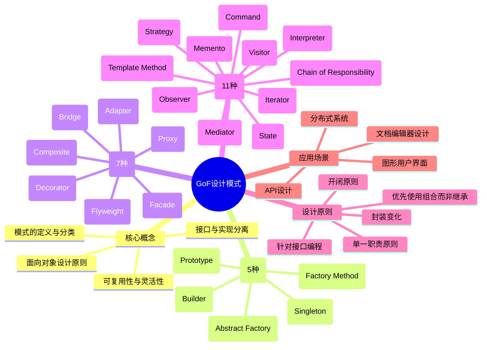

# 《设计模式：可复用面向对象软件的基础》读书笔记

## 📚 基础信息
- **书名**: 设计模式：可复用面向对象软件的基础 (Design Patterns: Elements of Reusable Object-Oriented Software)
- **作者**: Erich Gamma, Richard Helm, Ralph Johnson, John Vlissides (四人帮, Gang of Four)
- **出版社**: Addison-Wesley Professional
- **出版年份**: 1994年
- **页数**: 395页
- **开始阅读**: 2025-12-29
- **完成阅读**: 进行中
- **阅读状态**: ☑ 正在阅读 ☐ 已完成 ☐ 暂停
- **个人评分**: ⭐⭐⭐⭐⭐ (设计模式领域的圣经)
- **标签**: 设计模式, 面向对象, 软件架构, 经典必读, GoF

## 📖 内容概要

### 书籍简介
本书是软件设计模式领域的开山之作，被誉为"设计模式领域的圣经"。四位作者（Erich Gamma、Richard Helm、Ralph Johnson、John Vlissides，合称"Gang of Four"或"GoF"）系统性地总结了面向对象设计中常见的23种设计模式。这些模式是经过实践验证的、可复用的面向对象软件设计解决方案，帮助开发者设计出更加灵活、可维护、可复用的软件系统。

本书首次将设计模式的概念引入软件工程领域，确立了设计模式的分类体系和描述方法，对整个软件行业产生了深远影响。

### 核心主题
1. **设计模式的基础理论** - 面向对象设计原则、模式的定义和分类
2. **23种经典设计模式** - 创建型、结构型、行为型三大类模式
3. **模式的应用实践** - 如何在实际项目中选择和应用合适的模式
4. **可复用的设计** - 通过组合模式来构建复杂的软件架构

### 主要章节
- **第1章 引言**: 设计模式的概念、历史和基本理论
- **第2章 实例研究**: 设计一个文档编辑器的案例
- **第3章 创建型模式** (5种): 单例、工厂方法、抽象工厂、建造者、原型
- **第4章 结构型模式** (7种): 适配器、桥接、组合、装饰、外观、享元、代理
- **第5章 行为型模式** (11种): 职责链、命令、解释器、迭代器、中介者、备忘录、观察者、状态、策略、模板方法、访问者

## 🧠 知识架构

## ✍️ 读书笔记

### 🔖 重点摘录

> "设计模式是在特定环境下解决软件设计问题的、可复用的解决方案。"
> - 第1章，模式的核心定义

> "针对接口编程，而不是针对实现编程。"
> - 面向对象设计基本原则

> "优先使用对象组合，而不是类继承。"
> - 复用机制的选择原则

> "将变化与不变的部分分离，封装变化。"
> - 设计模式的核心思想

### 💭 个人思考

1. **关于设计模式本质的思考**
   设计模式并非技术创新，而是对设计经验的总结和提炼。GoF的23种模式本质上都是在解决两个核心问题：(1)如何降低系统中对象间的耦合度；(2)如何提高代码的复用性和可维护性。这些模式体现了"封装变化"这一核心思想 - 找出系统中可能变化的部分，将其封装起来。

2. **关于模式选择与应用的思考**
   设计模式不是"银弹"，不能为了使用模式而使用模式。每种模式都有其适用场景和代价。例如，单例模式虽然简单，但可能带来测试困难和全局状态问题；抽象工厂模式提供了灵活性，但也增加了系统复杂度。关键在于理解模式要解决的问题，在合适场景下使用合适的模式。

3. **关于过度设计的思考**
   GoF在书中强调："最复杂和最灵活的设计并不总是最好的设计。"很多开发者容易陷入"模式迷恋"，在简单的系统中过度使用设计模式，导致代码晦涩难懂。设计模式应该服务于实际需求，而不是炫技。YAGNI（You Aren't Gonna Need It）原则同样适用于设计模式的使用。

### 🎯 实践应用

1. **重构现有代码**
   - 具体步骤:
     - 识别代码中的"坏味道"（重复代码、条件语句过多等）
     - 分析问题的本质，选择合适的模式
     - 逐步重构，每次应用一个模式
     - 编写单元测试确保重构不破坏功能
   - 预期效果: 提高代码可读性和可维护性
   - 时间安排: 持续进行，每周选择1-2个模块优化

2. **设计新系统时应用模式**
   - 具体步骤:
     - 在设计阶段绘制类图和时序图
     - 识别系统中的变化点和可复用组件
     - 选择合适的设计模式处理这些变化点
     - 记录设计决策，说明为什么使用这个模式
   - 预期效果: 建立灵活、可扩展的系统架构
   - 时间安排: 每个项目设计阶段

3. **学习模式的语言特性实现**
   - 具体步骤:
     - 对比不同编程语言中模式的实现方式
     - 学习现代语言特性（如Java 8+、Python装饰器）如何简化模式实现
     - 总结模式在不同场景下的最佳实践
   - 预期效果: 提升编程语言掌握能力和模式应用水平
   - 时间安排: 每月学习1-2种模式的多种实现

## 🔗 相关扩展

### 相关书籍推荐
1. 《Head First 设计模式》- 更通俗易懂，适合初学者入门
2. 《设计模式之禅》- 中文经典，案例生动有趣
3. 《重构：改善既有代码的设计》- 学习如何将模式应用到重构中

### 延伸阅读
- [Refactoring.Guru - 设计模式](https://refactoringguru.cn/design-patterns): 优秀的在线设计模式学习资源，包含图文并茂的讲解
- [面向对象设计的SOLID原则](https://en.wikipedia.org/wiki/SOLID): 深入理解面向对象设计原则
- [设计模式：GoF 23种模式的Java实现](https://github.com/iluwatar/java-design-patterns): 开源的设计模式实战项目

### 实践项目
- **文档编辑器系统**: 跟随书中第2章的案例，实现一个支持多种图形和格式的文档编辑器
- **支付系统重构**: 使用策略模式、工厂模式重构一个支持多种支付方式的系统
- **事件驱动框架**: 使用观察者模式、命令模式实现事件处理框架

## 📊 学习总结

### 最大的收获
阅读本书最大的收获是建立了"设计思维" - 学会从可复用性、可扩展性和可维护性的角度思考软件设计。设计模式不仅仅是代码模板，更是一种设计哲学和思维方式。理解了"封装变化"这一核心思想后，看问题的角度发生了转变：不再只是关注功能实现，而是关注如何设计才能应对未来的变化。

### 改变的观念
- **从"实现优先"到"接口优先"**: 以前写代码时直接考虑实现细节，现在先思考接口设计，针对接口编程
- **从"继承优先"到"组合优先"**: 以前倾向于用继承实现复用，现在更倾向于使用组合
- **从"一次性设计"到"可演进设计"**: 认识到设计是一个迭代过程，好的设计应该能够从容应对变化

### 未来行动
1. 系统性实践23种模式，每种模式至少完成一个实际项目案例
2. 阅读《Head First 设计模式》和《设计模式之禅》，对比不同书籍对同一模式的讲解
3. 参与开源项目，学习优秀项目中设计模式的实际应用
4. 定期重构个人项目，应用所学的模式提升代码质量
5. 建立个人设计模式知识库，记录各种模式的实践心得

---

**笔记创建时间**: 2025-12-29
**最后更新**: 2025-12-29
**笔记版本**: v1.0
