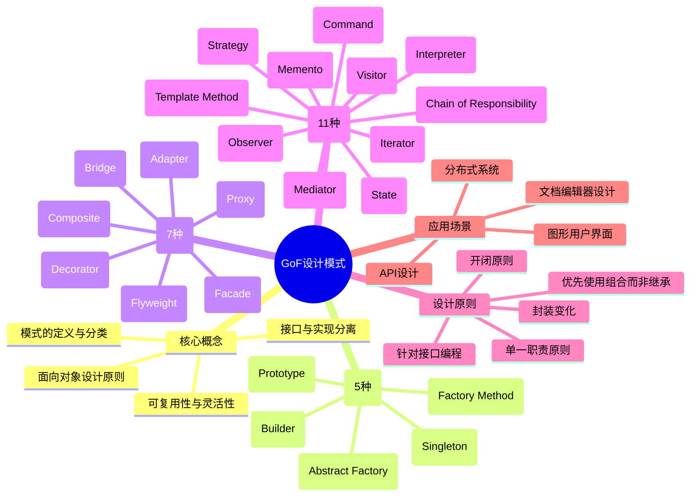
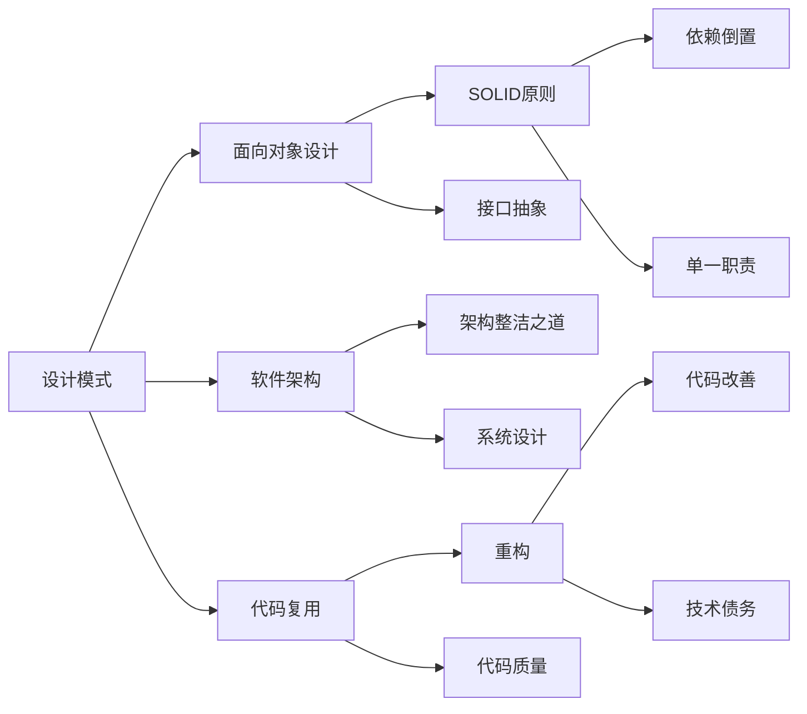

# 《设计模式：可复用面向对象软件的基础》读书笔记

## 📚 基础信息
- **书名**: 设计模式：可复用面向对象软件的基础 (Design Patterns: Elements of Reusable Object-Oriented Software)
- **作者**: Erich Gamma, Richard Helm, Ralph Johnson, John Vlissides (四人帮, Gang of Four)
- **出版社**: Addison-Wesley Professional
- **出版年份**: 1994年
- **页数**: 395页
- **开始阅读**: 2025-12-29
- **完成阅读**: 进行中
- **阅读状态**: ☑ 正在阅读 ☐ 已完成 ☐ 暂停
- **个人评分**: ⭐⭐⭐⭐⭐ (设计模式领域的圣经)
- **标签**: 设计模式, 面向对象, 软件架构, 经典必读, GoF

## 📖 内容概要

### 书籍简介
本书是软件设计模式领域的开山之作，被誉为"设计模式领域的圣经"。四位作者（Erich Gamma、Richard Helm、Ralph Johnson、John Vlissides，合称"Gang of Four"或"GoF"）系统性地总结了面向对象设计中常见的23种设计模式。这些模式是经过实践验证的、可复用的面向对象软件设计解决方案，帮助开发者设计出更加灵活、可维护、可复用的软件系统。

本书首次将设计模式的概念引入软件工程领域，确立了设计模式的分类体系和描述方法，对整个软件行业产生了深远影响。

### 核心主题
1. **设计模式的基础理论** - 面向对象设计原则、模式的定义和分类
2. **23种经典设计模式** - 创建型、结构型、行为型三大类模式
3. **模式的应用实践** - 如何在实际项目中选择和应用合适的模式
4. **可复用的设计** - 通过组合模式来构建复杂的软件架构

### 主要章节
- **第1章 引言**: 设计模式的概念、历史和基本理论
- **第2章 实例研究**: 设计一个文档编辑器的案例
- **第3章 创建型模式** (5种): 单例、工厂方法、抽象工厂、建造者、原型
- **第4章 结构型模式** (7种): 适配器、桥接、组合、装饰、外观、享元、代理
- **第5章 行为型模式** (11种): 职责链、命令、解释器、迭代器、中介者、备忘录、观察者、状态、策略、模板方法、访问者

## 🧠 知识架构



## ✍️ 读书笔记

### 🔖 重点摘录

> "设计模式是在特定环境下解决软件设计问题的、可复用的解决方案。"
> - 第1章，模式的核心定义

> "针对接口编程，而不是针对实现编程。"
> - 面向对象设计基本原则

> "优先使用对象组合，而不是类继承。"
> - 复用机制的选择原则

> "将变化与不变的部分分离，封装变化。"
> - 设计模式的核心思想

### 💭 个人思考

1. **关于设计模式本质的思考**
   设计模式并非技术创新，而是对设计经验的总结和提炼。GoF的23种模式本质上都是在解决两个核心问题：(1)如何降低系统中对象间的耦合度；(2)如何提高代码的复用性和可维护性。这些模式体现了"封装变化"这一核心思想 - 找出系统中可能变化的部分，将其封装起来。

2. **关于模式选择与应用的思考**
   设计模式不是"银弹"，不能为了使用模式而使用模式。每种模式都有其适用场景和代价。例如，单例模式虽然简单，但可能带来测试困难和全局状态问题；抽象工厂模式提供了灵活性，但也增加了系统复杂度。关键在于理解模式要解决的问题，在合适场景下使用合适的模式。

3. **关于过度设计的思考**
   GoF在书中强调："最复杂和最灵活的设计并不总是最好的设计。"很多开发者容易陷入"模式迷恋"，在简单的系统中过度使用设计模式，导致代码晦涩难懂。设计模式应该服务于实际需求，而不是炫技。YAGNI（You Aren't Gonna Need It）原则同样适用于设计模式的使用。

### 🎯 实践应用

1. **重构现有代码**
   - 具体步骤:
     - 识别代码中的"坏味道"（重复代码、条件语句过多等）
     - 分析问题的本质，选择合适的模式
     - 逐步重构，每次应用一个模式
     - 编写单元测试确保重构不破坏功能
   - 预期效果: 提高代码可读性和可维护性
   - 时间安排: 持续进行，每周选择1-2个模块优化

2. **设计新系统时应用模式**
   - 具体步骤:
     - 在设计阶段绘制类图和时序图
     - 识别系统中的变化点和可复用组件
     - 选择合适的设计模式处理这些变化点
     - 记录设计决策，说明为什么使用这个模式
   - 预期效果: 建立灵活、可扩展的系统架构
   - 时间安排: 每个项目设计阶段

3. **学习模式的语言特性实现**
   - 具体步骤:
     - 对比不同编程语言中模式的实现方式
     - 学习现代语言特性（如Java 8+、Python装饰器）如何简化模式实现
     - 总结模式在不同场景下的最佳实践
   - 预期效果: 提升编程语言掌握能力和模式应用水平
   - 时间安排: 每月学习1-2种模式的多种实现

## 💭 深度衍生思考

### 🎯 核心观点延伸

**从"模式"到"反模式"的思考**

设计模式告诉我们要"如何做"，但反模式告诉我们"不要做什么"。在软件工程中，识别和避免反模式同样重要。

*延伸逻辑*：
- 设计模式总结的是最佳实践
- 反模式总结的是常见错误和陷阱
- 两者的结合才能形成完整的设计思维
- 预防错误比事后修复更重要

*支撑证据*：
- 大多数软件项目的问题来自于重复的错误设计
- Big Ball of Mud（大泥球）是最常见的反模式
- 过度使用设计模式本身也会变成反模式

*实践意义*：
- 在学习设计模式的同时，也要学习常见的设计陷阱
- 建立设计审查清单，避免反模式
- 理解模式和反模式的界限，避免过度设计

**设计模式与现代编程语言的演进**

GoF设计模式基于1990年代的编程语言（主要是C++和Smalltalk）。现代编程语言的发展使某些模式变得不再必要或可以更简单地实现。

*延伸逻辑*：
- 语言特性可以简化或替代某些设计模式
- 函数式编程提供了不同的设计思维
- 设计模式的思想比实现更重要

*支撑证据*：
- 策略模式在Java 8+中可以用lambda表达式简化
- 装饰器模式在Python中就是语法级的装饰器
- 函数式语言中，高阶函数可以替代很多模式

*实践意义*：
- 不要盲目照搬经典模式的实现
- 理解模式的本质，结合语言特性实现
- 学习函数式编程，拓展设计思维

### 🔍 多角度分析

**历史视角**：设计模式的起源与演进
```
1970s-80s: 建筑学家Christopher Alexander提出模式概念
1994: GoF《设计模式》出版，确立软件设计模式体系
2000s: 模式在各种语言和框架中广泛应用
2010s: 敏捷开发强调"简单设计"，对模式使用更加谨慎
2020s: 函数式编程兴起，重新思考模式的必要性
```

**现代视角**：设计模式在微服务架构中的应用
- 服务发现模式 → 代理模式的分布式版本
- 断路器模式 → 从错误处理模式演变而来
- 事件驱动架构 → 观察者模式的大规模应用
- API网关模式 → 外观模式的微服务版本

**跨领域视角**：设计模式的普遍性
- 建筑学：建筑模式 → 软件设计模式的源头
- 用户界面设计：交互设计模式
- 组织管理：管理模式的相似性
- 认知科学：思维模式与设计模式的关系

**反向思考**：如果设计模式不存在会怎样？
- 每个开发者都要重新发明轮子
- 软件设计缺乏共同语言
- 代码审查和团队协作困难
- 知识传承和积累效率低下

### 🚀 创新思考

**潜在改进**：设计模式的局限性
1. **模式分类的局限**
   - 23种模式是否足够？
   - 是否有更好的分类方式？
   - 模式之间有交叉和重叠

2. **模式应用的挑战**
   - 何时使用模式的判断标准不明确
   - 模式组合的指导不足
   - 模式与业务需求的匹配问题

3. **学习曲线问题**
   - 新手难以理解模式的本质
   - 容易陷入"模式迷恋"
   - 缺乏循序渐进的学习路径

**新方向探索**：
1. **AI辅助设计**
   - 使用机器学习识别代码中可以应用模式的场景
   - 自动建议合适的设计模式
   - 模式应用的静态分析工具

2. **模式库和模式语言**
   - 特定领域的模式集合（如Web开发、移动开发）
   - 模式组合的最佳实践
   - 模式演化的追踪

3. **设计模式的量化研究**
   - 模式使用频率的统计分析
   - 模式对代码质量的量化影响
   - 模式性能优化的实证研究

## 🔗 知识关联网络

### 与已读书籍的关联

- **重构** - 关联强度: ⭐⭐⭐⭐⭐
  - 关联点：重构是实现设计模式的手段，设计模式是重构的目标
  - 具体体现：许多重构手法最终会导向某种设计模式
  - 实践价值：通过重构逐步引入设计模式，避免过度设计

- **架构整洁之道** - 关联强度: ⭐⭐⭐⭐⭐
  - 关联点：SOLID原则是设计模式的理论基础
  - 具体体现：许多设计模式都是SOLID原则的具体实现
  - 实践价值：理解原则有助于更好地理解和应用模式

- **人月神话** - 关联强度: ⭐⭐⭐
  - 关联点：设计模式是应对软件复杂性的工具
  - 具体体现：通过模式降低沟通成本和系统复杂度
  - 实践价值：好的设计模式应用可以提高团队协作效率

### 概念映射



### 知识依赖关系

**前置知识**：
- 面向对象编程基础（类、对象、继承、多态）
- 基本的软件设计概念（耦合、内聚）
- 至少一种面向对象编程语言的实际经验

**后续延伸**：
- **架构设计**：从单个模式到系统架构的设计
- **领域驱动设计**：将模式应用到业务建模中
- **函数式编程**：对比函数式范式中的设计模式
- **微服务架构**：分布式系统中的设计模式

## 📚 后续阅读路径规划

### 直接延伸

1. **《重构：改善既有代码的设计》** - Martin Fowler
   - 关联度: ⭐⭐⭐⭐⭐
   - 阅读优先级: 高
   - 预期收获: 学习如何通过重构逐步引入设计模式，理解模式与代码质量的关系

2. **《架构整洁之道》** - Robert C. Martin
   - 关联度: ⭐⭐⭐⭐⭐
   - 阅读优先级: 高
   - 预期收获: 深入理解SOLID原则，掌握设计模式背后的理论支撑

3. **《Head First 设计模式》** - Eric Freeman等
   - 关联度: ⭐⭐⭐⭐⭐
   - 阅读优先级: 中
   - 预期收获: 通过更直观的方式巩固设计模式理解，学习不同的讲解角度

### 交叉验证

1. **《设计模式之禅》** - 秦小波
   - 对比点: 中文作者对设计模式的解读和实践案例
   - 价值: 从中文开发者的视角理解模式，学习本土化的实践应用

2. **《Patterns of Enterprise Application Architecture》** - Martin Fowler
   - 对比点: 企业级应用中的模式，与GoF模式的关系
   - 价值: 将设计模式应用到大型企业系统的实践中

### 实践补充

1. **Refactoring.Guru网站**
   - 类型: 在线学习资源
   - 难度: 初级-中级
   - 时间投入: 持续参考
   - 关联: 提供图文并茂的模式讲解和代码示例

2. **Java设计模式实战项目**
   - 类型: 开源项目
   - 难度: 中级-高级
   - 时间投入: 2-4周
   - 关联: https://github.com/iluwatar/java-design-patterns

## 🎓 专家视角深度分析

### 专家选择说明

根据本书的软件工程和设计主题，选择张明远教授从软件架构和系统设计的角度分析设计模式的价值和应用。

---

## 张明远教授（计算机科学）

### 核心洞察
1. **设计模式是软件工程知识体系化的重要里程碑**
2. **模式体现了软件设计的核心原则：封装变化**
3. **设计模式与编程语言演进相互影响**

### 深度分析

#### 1. 设计模式在软件工程中的地位
**专家观点**：GoF设计模式不仅仅是一本技术书籍，更是软件工程走向成熟的标志。它将零散的设计经验系统化、理论化，为软件设计提供了共同语言和思考框架。

**理论支撑**：
- 软件工程的核心问题是控制复杂性
- 设计模式通过提供经过验证的解决方案降低设计复杂度
- 模式语言（Pattern Language）理论在软件领域的成功应用

**实践案例**：
- 大型软件项目使用设计模式进行架构设计
- 设计模式成为技术面试和代码审查的标准
- 开源框架（Spring、Hibernate等）大量使用设计模式

#### 2. 设计模式与编程语言的关系
**专家观点**：设计模式不是脱离语言存在的，它们与编程语言特性密切相关。现代编程语言的发展使某些模式变得不再必要或可以更简单地实现。

**理论支撑**：
- 语言特性影响设计模式的实现方式
- 函数式编程语言提供了不同的设计思维
- 元编程技术可以简化某些模式的实现

**实践案例**：
- 策略模式在Java 8+中可以用lambda表达式简化
- 装饰器模式在Python中就是语法级的装饰器语法
- C++模板元编程可以实现编译时的模式

#### 3. 设计模式的局限性
**专家观点**：设计模式不是银弹，过度使用模式会导致代码复杂度增加。关键在于理解模式要解决的问题，在合适场景下使用合适的模式。

**理论支撑**：
- YAGNI原则（You Aren't Gonna Need It）
- KISS原则（Keep It Simple, Stupid）
- 过早优化是万恶之源

**实践案例**：
- 简单的CRUD应用不需要复杂的设计模式
- 过度使用抽象导致代码难以理解
- 模式组合带来的复杂度指数增长

### 独特视角

从计算机科学理论的角度看，设计模式体现了**抽象层次**的重要性。每种模式都在特定的抽象层次上解决问题：
- 有些模式解决对象创建的抽象（创建型模式）
- 有些模式解决类和对象组合的抽象（结构型模式）
- 有些模式解决对象间交互的抽象（行为型模式）

理解这种抽象层次有助于在设计时选择合适的粒度。

---

## 💡 专家观点整合

### 综合结论

设计模式是软件工程的重要工具，它提供了：
1. **共同语言**：让开发者能够高效地交流设计思想
2. **经验总结**：避免重复造轮子，利用前人的智慧
3. **设计思维**：培养面向对象设计的思维方式

但同时需要注意：
1. **避免过度设计**：不要为了使用模式而使用模式
2. **考虑具体场景**：根据语言、领域、性能要求灵活应用
3. **平衡理论与实际**：理解模式本质，不拘泥于经典实现

对于不同的应用领域，还需要考虑特殊的约束条件，可能需要对经典模式进行调整或变体。

---

## 🔗 相关扩展

### 相关书籍推荐
1. 《Head First 设计模式》- 更通俗易懂，适合初学者入门
2. 《设计模式之禅》- 中文经典，案例生动有趣
3. 《重构：改善既有代码的设计》- 学习如何将模式应用到重构中

### 延伸阅读
- [Refactoring.Guru - 设计模式](https://refactoringguru.cn/design-patterns): 优秀的在线设计模式学习资源，包含图文并茂的讲解
- [面向对象设计的SOLID原则](https://en.wikipedia.org/wiki/SOLID): 深入理解面向对象设计原则
- [设计模式：GoF 23种模式的Java实现](https://github.com/iluwatar/java-design-patterns): 开源的设计模式实战项目

### 实践项目
- **文档编辑器系统**: 跟随书中第2章的案例，实现一个支持多种图形和格式的文档编辑器
- **支付系统重构**: 使用策略模式、工厂模式重构一个支持多种支付方式的系统
- **事件驱动框架**: 使用观察者模式、命令模式实现事件处理框架

## 📊 学习总结

### 最大的收获
阅读本书最大的收获是建立了"设计思维" - 学会从可复用性、可扩展性和可维护性的角度思考软件设计。设计模式不仅仅是代码模板，更是一种设计哲学和思维方式。理解了"封装变化"这一核心思想后，看问题的角度发生了转变：不再只是关注功能实现，而是关注如何设计才能应对未来的变化。

### 改变的观念
- **从"实现优先"到"接口优先"**: 以前写代码时直接考虑实现细节，现在先思考接口设计，针对接口编程
- **从"继承优先"到"组合优先"**: 以前倾向于用继承实现复用，现在更倾向于使用组合
- **从"一次性设计"到"可演进设计"**: 认识到设计是一个迭代过程，好的设计应该能够从容应对变化

### 未来行动
1. 系统性实践23种模式，每种模式至少完成一个实际项目案例
2. 阅读《Head First 设计模式》和《设计模式之禅》，对比不同书籍对同一模式的讲解
3. 参与开源项目，学习优秀项目中设计模式的实际应用
4. 定期重构个人项目，应用所学的模式提升代码质量
5. 建立个人设计模式知识库，记录各种模式的实践心得

---

**笔记创建时间**: 2025-12-29
**最后更新**: 2026-04-17
**笔记版本**: v2.0
**升级说明**: 添加深度衍生思考、知识关联网络、后续阅读路径规划和专家视角分析
