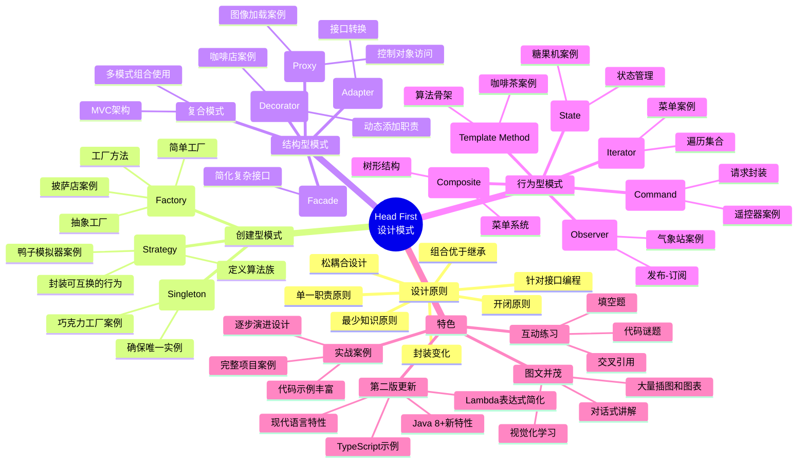

# 《Head First 设计模式》读书笔记

## 📚 基础信息
- **书名**: Head First 设计模式 (Head First Design Patterns)
- **作者**: Eric Freeman, Elisabeth Robson, Bert Bates, Kathy Sierra
- **出版社**: O'Reilly Media
- **出版年份**: 2004年（第一版），2024年（第二版）
- **页数**: 694页
- **获奖情况**: 2005年Jolt大奖获奖图书
- **开始阅读**: 2025-12-29
- **完成阅读**: 进行中
- **阅读状态**: ☑ 正在阅读 ☐ 已完成 ☐ 暂停
- **个人评分**: ⭐⭐⭐⭐⭐ (最适合入门的设计模式书籍)
- **标签**: 设计模式, 面向对象, 入门必读, 图文并茂, 实战导向

## 📖 内容概要

### 书籍简介
本书是O'Reilly出版社"Head First"系列的经典之作，采用独特的"大脑友好"（Brain-Friendly）学习方式，通过大量图表、对话、练习和案例，将复杂的设计模式概念变得简单易懂。本书涵盖GoF 23种经典设计模式，但比GoF原版更容易理解和实践。

该书获得2005年Jolt生产力大奖，被公认为设计模式入门的最佳读物。书中通过一个完整的鸭子模拟器、咖啡订购系统、智能家居控制系统等生动案例，深入浅出地讲解每种模式的应用场景和实现方法。

### 核心主题
1. **策略模式** - 学习如何定义算法族并封装起来
2. **观察者模式** - 理解发布-订阅机制和事件驱动架构
3. **装饰器模式** - 掌握动态给对象添加职责的技巧
4. **工厂模式** - 学习对象创建的最佳实践
5. **单例模式** - 确保一个类只有一个实例
6. **命令模式** - 将请求封装成对象
7. **适配器模式与外观模式** - 接口转换与简化接口
8. **模板方法模式** - 定义算法骨架
9. **迭代器与组合模式** - 遍历集合对象
10. **状态模式** - 对象内部状态改变时的行为变化
11. **代理模式** - 控制对象访问
12. **复合模式** - 多个模式组合使用
13. **MVC模式** - 模型-视图-控制器架构

### 主要章节
- **第1章 策略模式**: 鸭子模拟器案例，学习让类族中的部分行为可变
- **第2章 观察者模式**: 气象站案例，学习对象间的一对多依赖关系
- **第3章 装饰器模式**: 咖啡店案例，学习动态地给对象添加功能
- **第4章 工厂模式**: 披萨店案例，学习对象创建的解耦
- **第5章 单例模式**: 巧克力工厂案例，学习唯一的实例管理
- **第6章 命令模式**: 智能家居遥控器案例，学习请求封装与队列化
- **第7章 适配器与外观模式**: 家庭影院案例，学习接口转换与简化
- **第8章 模板方法模式**: 咖啡与茶案例，学习算法骨架定义
- **第9章 迭代器与组合模式**: 早餐菜单案例，学习统一集合遍历
- **第10章 状态模式**: 糖果机案例，学习对象状态管理
- **第11章 代理模式**: 图像代理案例，学习对象访问控制
- **第12章 复合模式**: 鸭子模拟器重构，学习模式的组合使用
- **第13章 MVC模式**: 学习模型-视图-控制器架构模式
- **第14章 模式总结与回顾**: 设计模式的对比、选择原则

## 🧠 知识架构

## ✍️ 读书笔记

### 🔖 重点摘录

> "找出应用中可能需要变化之处，把它们独立出来，不要和那些不需要变化的代码混在一起。"
> - 第1章，设计原则之首

> "针对接口编程，而不是针对实现编程。"
> - 核心设计原则

> "多用组合，少用继承。"
> - 复用机制的选择

> "为了交互对象之间的松耦合设计而努力。"
> - 观察者模式的核心

> "类应该对扩展开放，对修改关闭。"
> - 开闭原则

> "单一职责原则：一个类应该只有一个引起变化的原因。"
> - SRP原则

### 💭 个人思考

1. **关于学习方法的思考**
   Head First系列的最大特色是其"大脑友好"的学习方式。与传统教科书式的严肃讲解不同，本书采用图文并茂、对话式、案例驱动的教学方式，让学习过程变得轻松有趣。这种学习方式特别适合初学者，能够有效降低认知负荷。对于技术类书籍的写作，这是一个很好的启发：复杂的知识可以用简单有趣的方式传递。

2. **关于实战案例设计的思考**
   书中的案例设计非常巧妙，每个模式都配有一个生动完整的案例：
   - 鸭子模拟器（策略模式）：展示了如何让行为可变
   - 气象站（观察者模式）：展示了发布-订阅机制
   - 咖啡店（装饰器模式）：展示了动态添加功能
   - 披萨店（工厂模式）：展示了对象创建解耦

   这些案例的共同特点是：**贴近生活、逐步演进、问题驱动**。不是直接给出最终设计，而是从一个简单的问题开始，逐步发现设计缺陷，然后引入模式解决，这种渐进式学习方式非常有效。

3. **关于模式过度简化的思考**
   虽然Head First让设计模式变得容易理解，但也可能带来风险：读者可能觉得模式很简单，过度简化了复杂系统的设计挑战。书中为了教学方便，有时会对问题进行过度简化，实际项目中往往面临更复杂的约束和权衡。因此，在掌握基础后，还需要阅读GoF原版等更深入的书籍，理解模式的真正复杂度和适用边界。

### 🎯 实践应用

1. **跟随书中的案例实现**
   - 具体步骤:
     - 使用Java或熟悉语言实现所有章节的案例代码
     - 不仅实现最终版本，还要实现演进过程中的每个版本
     - 对比不同版本的优缺点
     - 思考如果用其他语言（如Python、JavaScript）如何实现
   - 预期效果: 通过实践加深对模式的理解和掌握
   - 时间安排: 每周完成1-2章的案例实现

2. **项目重构实战**
   - 具体步骤:
     - 选择自己参与的实际项目
     - 识别代码中可以使用设计模式改进的地方
     - 应用书中学到的模式进行重构
     - 编写单元测试确保重构不破坏功能
     - 记录重构前后的对比
   - 预期效果: 提升实际项目的代码质量和可维护性
   - 时间安排: 每月选择1个模块进行重构

3. **建立模式对比分析**
   - 具体步骤:
     - 对比相似模式（如工厂方法vs抽象工厂）
     - 分析各自的优缺点和适用场景
     - 制作决策树帮助模式选择
     - 总结模式组合使用的最佳实践
   - 预期效果: 建立系统的设计模式知识体系
   - 时间安排: 读完每章后立即总结

## 🔗 相关扩展

### 相关书籍推荐
1. 《设计模式：可复用面向对象软件的基础》(GoF) - 设计模式的权威之作，更深入理论
2. 《设计模式之禅》- 中文经典，案例丰富有趣
3. 《Head First 面向对象分析与设计》- 同系列书籍，深入学习OO设计

### 延伸阅读
- [Head First Labs官方资源](http://www.headfirstlabs.com/books/hfdp/): 书籍配套资源和代码
- [O'Reilly设计模式图](https://www.oreilly.com/library/view/head-first-design/0596007124/): 在线版书籍资源
- [Java设计模式实战项目](https://github.com/iluwatar/java-design-patterns): 开源的设计模式实现参考
- [设计模式对比分析](https://refactoringguru.cn/design-patterns): 包含模式对比和选择指南

### 实践项目
- **Duck Simulator完整实现**: 从第1章到第12章，逐步实现鸭子模拟器的所有版本
- **智能家居控制系统**: 综合应用命令模式、观察者模式、状态模式
- **咖啡店点单系统**: 应用装饰器模式、工厂模式、策略模式
- **MVC框架实现**: 从零实现一个简易的MVC Web框架

## 📊 学习总结

### 最大的收获
本书最大的价值在于**降低了设计模式的学习门槛**。通过生动的案例、图文并茂的讲解和循序渐进的教学方式，让原本枯燥抽象的设计模式变得具体可感。最大的收获不是记住了23种模式的代码结构，而是学会了"设计思维" - 如何识别问题、分析需求、选择合适的模式、进行渐进式设计。

另一个重要收获是理解了**设计原则比设计模式更重要**。书中反复强调的"封装变化"、"针对接口编程"、"组合优于继承"等原则，才是设计模式背后的指导思想。模式只是这些原则的具体体现形式。

### 改变的观念
- **从"恐惧设计模式"到"乐于应用模式"**: 以前觉得设计模式高深莫测，现在认识到它们就是解决常见问题的经验总结
- **从"重实现轻设计"到"设计先行"**: 以前直接写代码，现在会先思考设计方案和模式选择
- **从"孤立学习"到"系统掌握"**: 以前零散地了解一些模式，现在建立了完整的知识体系

### 未来行动
1. 完成所有章节案例代码的实现和实验
2. 阅读《设计模式之禅》和GoF原版，对比不同书籍的讲解方式
3. 在实际项目中主动应用所学模式，记录应用心得
4. 参与开源项目，学习优秀项目中模式的实际应用
5. 分享学习笔记，制作个人设计模式速查表和决策树
6. 每年重读一次本书，常读常新

---

**笔记创建时间**: 2025-12-29
**最后更新**: 2025-12-29
**笔记版本**: v1.0
