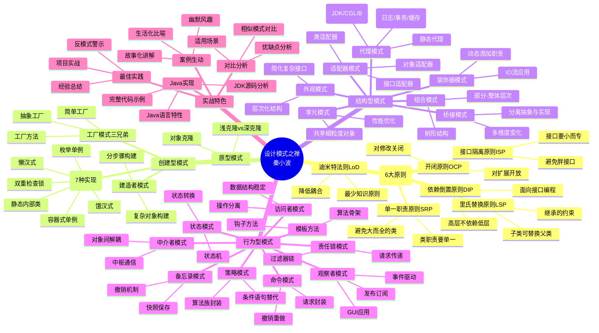

# 《设计模式之禅》读书笔记

## 📚 基础信息
- **书名**: 设计模式之禅（第2版）
- **作者**: 秦小波
- **出版社**: 机械工业出版社（华章图书）
- **出版年份**: 2014年（第2版）
- **页数**: 600+页
- **开始阅读**: 2025-12-29
- **完成阅读**: 进行中
- **阅读状态**: ☑ 正在阅读 ☐ 已完成 ☐ 暂停
- **个人评分**: ⭐⭐⭐⭐⭐ (最有趣的设计模式中文经典)
- **标签**: 设计模式, Java, 实战案例, 通俗易懂, 中文经典, 趣味性强

## 📖 内容概要

### 书籍简介
本书是设计模式领域的中文经典著作，被公认为设计模式领域的三大经典之一（与GoF《设计模式》和《Head First 设计模式》并列）。作者秦小波拥有十余年Java开发经验，以幽默风趣、通俗易懂的方式讲解设计模式，被誉为"最具趣味性的设计模式书籍"。

第2版在原书基础上进行了全面升级，不仅涵盖GoF 23种经典设计模式，还扩展了28种常见模式。全书采用大量的Java实战案例，通过生动有趣的故事和场景，将复杂的设计模式概念讲解得深入浅出。书中不仅讲解模式的实现，更深入分析模式的适用场景、优缺点和最佳实践。

### 核心主题
1. **面向对象设计六大原则** - 单一职责、里氏替换、依赖倒置、接口隔离、迪米特法则、开闭原则
2. **23种GoF经典设计模式** - 创建型、结构型、行为型三大类
3. **5种扩展设计模式** - 第2版新增内容
4. **模式对比与最佳实践** - 同类模式的全方位比较
5. **实战项目应用** - 基于真实项目的模式应用案例

### 主要章节
- **第1-6章 面向对象设计原则**:
  - 单一职责原则（SRP）
  - 里氏替换原则（LSP）
  - 依赖倒置原则（DIP）
  - 接口隔离原则（ISP）
  - 迪米特法则（LoD）
  - 开闭原则（OCP）

- **第7-33章 创建型模式**:
  - 单例模式（7种实现方式）
  - 工厂方法模式
  - 抽象工厂模式
  - 建造者模式
  - 原型模式

- **第34-56章 结构型模式**:
  - 适配器模式
  - 装饰器模式
  - 代理模式
  - 外观模式
  - 桥接模式
  - 组合模式
  - 享元模式

- **第57-90章 行为型模式**:
  - 策略模式
  - 模板方法模式
  - 观察者模式
  - 迭代器模式
  - 责任链模式
  - 命令模式
  - 备忘录模式
  - 状态模式
  - 访问者模式
  - 中介者模式
  - 解释器模式

- **第91-92章 扩展模式**:
  - 简单工厂模式（非GoF模式）
  - 其他常见模式

## 🧠 知识架构

## ✍️ 读书笔记

### 🔖 重点摘录

> "单一职责原则（SRP）：就一个类而言，应该仅有一个引起它变化的原因。"
> - 第1章，设计原则基础

> "里氏替换原则（LSP）：所有引用基类的地方必须能透明地使用其子类的对象。"
> - 第2章，继承与多态的约束

> "依赖倒置原则（DIP）：模块间的依赖通过抽象发生，实现类之间不发生直接的依赖关系，其依赖关系是通过接口或抽象类产生的。"
> - 第3章，面向接口编程

> "接口隔离原则（ISP）：客户端不应该依赖它不需要的接口，类间的依赖关系应该建立在最小的接口上。"
> - 第4章，接口设计的艺术

> "迪米特法则（LoD）：一个对象应该对其他对象有最少的了解，也称为最少知识原则（Least Knowledge Principle）。"
> - 第5章，降低耦合度

> "开闭原则（OCP）：一个软件实体如类、模块和函数应该对扩展开放，对修改关闭。"
> - 第6章,设计的终极目标

> "设计模式的本质是『封装变化』，找出应用中可能需要变化之处，把它们独立出来，不要和那些不需要变化的代码混在一起。"
> - 全书核心思想

### 💭 个人思考

1. **关于中文原创技术书籍的思考**
   《设计模式之禅》是中文原创技术书籍的优秀代表。与翻译书籍相比，原创书籍在语言表达、案例选择、文化背景方面都有天然优势。秦小波用幽默风趣的中文、贴近中国开发者生活的案例，将原本枯燥的设计模式讲得生动有趣。这启发我们，技术书籍的价值不仅在于知识的准确性，更在于知识的可理解性和可传播性。好的技术作者应该是知识的"翻译官"，能够把复杂概念讲得通俗易懂。

2. **关于单例模式7种实现方式的思考**
   书中详细讲解了单例模式的7种实现方式：饿汉式、懒汉式（线程不安全）、懒汉式（同步锁）、双重检查锁、静态内部类、枚举单例、容器式单例。这种全面对比非常实用，不仅给出代码实现，还分析各自的优缺点和适用场景。特别是枚举单例（由Effective Java作者Joshua Bloch提倡）和容器式单例（Spring框架采用），这些现代实现方式体现了设计模式随时间演进的特性。

3. **关于设计模式与Java语言特性的思考**
   书中大量使用Java语言特性来简化模式实现，如：
   - 接口和抽象类的使用
   - 反射机制在工厂模式中的应用
   - 动态代理（JDK Proxy和CGLIB）
   - 枚举类型在单例模式中的应用
   - Lambda表达式对策略模式的简化

   这说明设计模式的实现与编程语言密切相关。现代语言的新特性（如Java 8+的Lambda、Stream API）可以让传统模式的实现变得更简洁。学习设计模式不仅要学习模式本身，还要学习如何结合语言特性优雅地实现模式。

4. **关于过度设计的警示**
   作者在多个章节提醒读者"不要为了使用模式而使用模式"。书中举了很多"反模式"的例子，如：
   - 简单工厂模式过度使用导致类爆炸
   - 滥用抽象工厂增加系统复杂度
   - 不恰当地使用单例导致全局状态污染

   这些警示非常宝贵，说明作者不仅讲解模式的优点，也勇于指出模式的局限性和误用风险。这种批判性思维是高级开发者应该具备的。

### 🎯 实践应用

1. **系统学习设计原则**
   - 具体步骤:
     - 深入理解6大设计原则的内涵
     - 学习如何用这些原则评判代码质量
     - 实践重构：将违反原则的代码改造成符合原则的代码
     - 总结每个原则的适用场景和权衡
   - 预期效果: 建立面向对象设计的判断标准，写出更高质量的代码
   - 时间安排: 2个月系统学习和实践

2. **Java项目模式应用**
   - 具体步骤:
     - 选择Java Web项目（如Spring Boot应用）
     - 识别框架中应用的设计模式（如Spring的工厂模式、代理模式）
     - 在业务代码中应用合适的设计模式
     - 阅读JDK源码，学习标准库中的模式应用
   - 预期效果: 提升Java开发能力和模式应用水平
   - 时间安排: 持续进行，每季度总结

3. **对比三种单例实现**
   - 具体步骤:
     - 用7种方式实现单例模式
     - 编写单元测试验证线程安全性
     - 测试序列化/反序列化、反射攻击、克隆等场景
     - 总结各种实现的最佳适用场景
   - 预期效果: 深入理解单例模式的实现细节和陷阱
   - 时间安排: 1周完成实验和总结

4. **责任链模式实战：实现过滤器链**
   - 具体步骤:
     - 设计通用过滤器接口
     - 实现责任链模式管理过滤器
     - 实现日志过滤器、权限过滤器、参数校验过滤器
     - 对比Servlet过滤器、Spring Interceptor的实现
   - 预期效果: 掌握责任链模式在实际框架中的应用
   - 时间安排: 2周

## 🔗 相关扩展

### 相关书籍推荐
1. 《设计模式：可复用面向对象软件的基础》(GoF) - 设计模式的权威之作，更理论化
2. 《Head First 设计模式》- 更通俗易懂，适合初学者
3. 《Effective Java》(Joshua Bloch) - Java最佳实践，包含大量模式应用
4. 《重构：改善既有代码的设计》- 学习如何渐进式应用设计模式

### 延伸阅读
- [《设计模式之禅》PDF资源](https://awesome-programming-books.github.io/design-pattern/%E8%AE%BE%E8%AE%A1%E6%A8%A1%E5%BC%8F%E4%B9%8B%E7%A6%85.pdf): 完整版电子书
- [Java设计模式GitHub项目](https://github.com/iluwatar/java-design-patterns): 23种模式的Java实现参考
- [Spring框架中的设计模式](https://www.baeldung.com/design-patterns-in-spring): Spring中模式的实际应用
- [设计模式对比分析](https://refactoringguru.cn/design-patterns): 图文并茂的模式讲解和对比

### 实践项目
- **Java工具类库**: 实现一个工具类库，综合应用单例、工厂、建造者等模式
- **Web框架过滤器链**: 使用责任链模式实现请求过滤器链
- **支付系统**: 使用策略模式+工厂模式实现多种支付方式
- **缓存系统**: 使用装饰器模式实现缓存功能（内存缓存、Redis缓存多级装饰）
- **事件驱动框架**: 使用观察者模式实现事件总线

## 📊 学习总结

### 最大的收获
《设计模式之禅》最大的收获是**将抽象的设计模式具体化、趣味化**。秦小波用生动的比喻、完整的故事情节、幽默的语言，让学习过程变得轻松愉快。书中不仅讲解"怎么做"，更深入分析"为什么"、"什么时候用"、"什么时候不用"，这种全方位的视角是很多翻译书籍无法比拟的。

另一个重要收获是**对Java语言的深入理解**。通过分析JDK源码、Spring框架中的模式应用，不仅学习了设计模式，也提升了对Java语言特性和框架设计的理解。例如，通过学习动态代理模式，深入理解了Spring AOP的实现原理。

### 改变的观念
- **从"背诵模式"到"理解原则"**: 以前认为设计模式就是背诵23种模式的代码结构，现在认识到设计原则（SRP、OCP等）才是根本，模式只是原则的体现
- **从"理论为主"到"实战优先"**: 以前追求理论的完美性，现在更关注在实际项目中如何权衡和选择，认识到"实用主义"的重要性
- **从"孤立学习"到"系统掌握"**: 以前零散地学习模式，现在建立了"原则→模式→实践"的完整知识体系

### 未来行动
1. 系统实践书中的Java代码示例，每种模式至少实现一个完整案例
2. 阅读JDK和Spring源码，学习优秀开源项目中模式的实际应用
3. 在实际项目中主动应用所学模式，记录应用效果和经验教训
4. 对比GoF和Head First两本书的讲解方式，总结三本书的各自优势
5. 建立个人设计模式知识库，包括：模式速查表、决策树、代码模板、实战案例
6. 分享学习心得，尝试向团队讲解设计模式，加深理解

---

**笔记创建时间**: 2025-12-29
**最后更新**: 2025-12-29
**笔记版本**: v1.0
