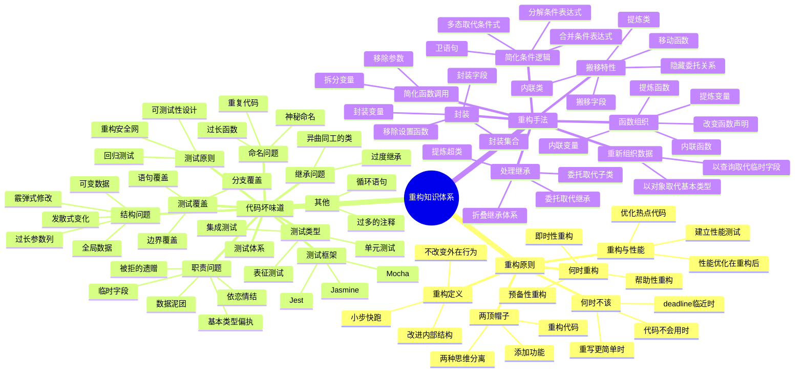
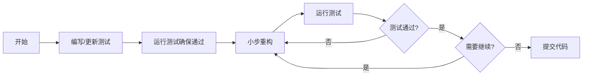

# 📚 重构：改善既有代码的设计（第2版）

## 📖 基本信息

- **原名**: Refactoring: Improving the Design of Existing Code (2nd Edition)
- **作者**: Martin Fowler（马丁·福勒）
- **合著者**: Kent Beck
- **出版社**: Addison-Wesley Professional
- **出版年份**: 2018年（第2版）/ 1999年（第1版）
- **中译本**: 人民邮电出版社
- **译者**: 熊节
- **示例语言**: JavaScript（第2版）/ Java（第1版）
- **创建时间**: 2026年2月5日
- **难度等级**: 中级
- **阅读状态**: 📖 正在阅读
- **个人评分**: ⭐⭐⭐⭐⭐
- **标签**: #重构 #代码质量 #JavaScript #软件工程 #MartinFowler #测试驱动

## 📝 内容概要

### 书籍简介
《重构》是软件工程领域的里程碑式著作，系统性地阐述了"重构"这一核心编程实践。重构是在不改变代码外在行为的前提下，对代码做出修改以改进程序内部结构的过程。第2版时隔20年更新，使用JavaScript作为示例语言，删除了过时的重构手法，新增了现代化的重构技术。本书不仅展示了70多种具体的重构手法，更重要的是传达了一种系统化改进代码质量的思维方式。

### 核心主题
1. **重构原则与哲学** - 何时重构、何时不该重构、重构与性能的关系
2. **两顶帽子原则** - 分离功能添加和重构两种思维模式
3. **代码坏味道（Code Smells）** - 识别需要重构的问题代码模式
4. **重构手法名录** - 具体的重构步骤和最佳实践
5. **测试驱动重构** - 通过测试保证重构的安全性
6. **重构与软件设计** - 重构如何帮助改进软件架构

### 主要章节结构

#### 第1章 重构，第一个案例
通过一个完整的案例演示重构的整个过程，展示重构如何让代码更易理解。

#### 第2章 重构的原则
- 重构的定义
- 为何要重构
- 何时应该重构
- 何时不该重构
- 重构与性能的关系

#### 第3章 代码的坏味道
详细介绍24种常见的代码坏味道，作为识别重构机会的信号。

#### 第4章 构筑测试体系
强调测试对重构的重要性，介绍如何编写良好的测试。

#### 第5章 介绍重构名录
说明重构手法的组织结构和阅读方式。

#### 第6-12章 重构手法
按类别组织的具体重构方法：
- 第一组：重构基础（提炼函数、内联函数等）
- 第二组：封装（封装变量、封装字段等）
- 第三组：搬移特性（移动函数、提炼类等）
- 第四组：重新组织数据（以对象取代基本类型等）
- 第五组：简化条件逻辑（分解条件表达式等）
- 第六组：简化函数调用（拆分变量、移除参数等）
- 第七组：处理继承关系（提炼超类等）

## 🧠 知识架构



## ✍️ 读书笔记

### 第1章：重构，第一个案例

**本章要点**：通过一个完整的案例（计算顾客租赁费用）演示重构的整个过程。

#### 重点摘录
> "重构是对软件内部结构的一种调整，目的是在不改变软件可观察行为的前提下，提高其可理解性，降低其修改成本。"

> "两顶帽子：使用重构技术开发代码时，我把自己和时间分成两部分，一部分用来添加功能，另一部分用来重构。添加新功能时，我不修改现有代码；重构时，我不添加功能。"

#### 重构案例演示

**原始代码**：
```javascript
// ❌ 重构前：一个超长的函数，职责不清
function statement(customer, movies) {
    let totalAmount = 0;
    let frequentRenterPoints = 0;
    let result = `Rental Record for ${customer.name}\n`;

    for (let rental of customer.rentals) {
        let thisAmount = 0;

        // 确定每种片子的费用
        switch (rental.movie.priceCode) {
            case Movie.REGULAR:
                thisAmount += 2;
                if (rental.days > 2) {
                    thisAmount += (rental.days - 2) * 1.5;
                }
                break;
            case Movie.NEW_RELEASE:
                thisAmount += rental.days * 3;
                break;
            case Movie.CHILDRENS:
                thisAmount += 1.5;
                if (rental.days > 3) {
                    thisAmount += (rental.days - 3) * 1.5;
                }
                break;
        }

        // 计算常客积分
        frequentRenterPoints++;

        // 如果是新片且租期超过1天，额外加分
        if (rental.movie.priceCode === Movie.NEW_RELEASE && rental.days > 1) {
            frequentRenterPoints++;
        }

        // 显示此条租赁记录
        result += `\t${rental.movie.title}\t${thisAmount}\n`;
        totalAmount += thisAmount;
    }

    // 添加页脚
    result += `Amount owed is ${totalAmount}\n`;
    result += `You earned ${frequentRenterPoints} frequent renter points`;

    return result;
}
```

**重构后代码**：
```javascript
// ✅ 重构后：职责分离，每个函数只做一件事
class Customer {
    constructor(name) {
        this._name = name;
        this._rentals = [];
    }

    get name() {
        return this._name;
    }

    get rentals() {
        return this._rentals;
    }

    addRental(rental) {
        this._rentals.push(rental);
    }

    // 主函数变得简洁清晰
    statement() {
        return this.renderPlainText(
            this.totalAmount,
            this.frequentRenterPoints
        );
    }

    // 计算总费用
    get totalAmount() {
        return this.rentals.reduce((total, rental) => {
            return total + rental.amount;
        }, 0);
    }

    // 计算常客积分
    get frequentRenterPoints() {
        return this.rentals.reduce((points, rental) => {
            return points + rental.frequentRenterPoints;
        }, 0);
    }

    // 渲染文本
    renderPlainText(totalAmount, frequentRenterPoints) {
        let result = `Rental Record for ${this.name}\n`;

        for (let rental of this.rentals) {
            result += `\t${rental.movie.title}\t${rental.amount}\n`;
        }

        result += `Amount owed is ${totalAmount}\n`;
        result += `You earned ${frequentRenterPoints} frequent renter points`;

        return result;
    }
}

class Rental {
    constructor(movie, days) {
        this._movie = movie;
        this._days = days;
    }

    get movie() {
        return this._movie;
    }

    get days() {
        return this._days;
    }

    // 计算租赁费用
    get amount() {
        let result = 0;

        switch (this.movie.priceCode) {
            case Movie.REGULAR:
                result = 2;
                if (this.days > 2) {
                    result += (this.days - 2) * 1.5;
                }
                break;
            case Movie.NEW_RELEASE:
                result = this.days * 3;
                break;
            case Movie.CHILDRENS:
                result = 1.5;
                if (this.days > 3) {
                    result += (this.days - 3) * 1.5;
                }
                break;
        }

        return result;
    }

    // 计算常客积分
    get frequentRenterPoints() {
        let points = 1;

        if (this.movie.priceCode === Movie.NEW_RELEASE && this.days > 1) {
            points++;
        }

        return points;
    }
}
```

#### 重构步骤总结
1. **建立测试** - 先编写测试确保重构不会破坏功能
2. **小步重构** - 每次只做小的改动
3. **频繁测试** - 每次改动后立即运行测试
4. **提炼函数** - 将大函数拆分为小函数
5. **搬移函数** - 将函数移到合适的数据对象中
6. **多态取代条件式** - 用多态消除 switch 语句

---

### 第2章：重构的原则

#### 重点摘录
> "何时重构：第三次做同样的事时，就应该重构；修补错误时，重构是机会；代码评审时，重构是工具。"

> "何时不该重构：当重写比重构更容易时；当代码根本不会用到时；当 deadline 临近且现有代码能满足需求时。"

> "不要为了重构而重构。重构是为了让代码更容易理解和修改，如果代码已经很清晰，就不要动它。"

#### 重构的核心原则

**1. 两顶帽子原则**
```javascript
// ❌ 错误：混合两种思维
function addDiscount(customer) {
    // 正在添加功能...
    // 哎，这里代码太乱了，我先重构一下
    // 重构...重构...重构...
    // 等等，我原本要干什么来着？
}

// ✅ 正确：分离两种思维
// 第一次戴帽子：添加功能
function addDiscount(customer) {
    customer.discount = calculateDiscount(customer);
}

// 第二次戴帽子：重构
function calculateDiscount(customer) {
    // 重构这段代码...
}
```

**2. 重构的定义**
```javascript
// 重构 = 不改变外在行为 + 改进内部结构

// ❌ 不是重构：改变了外在行为
function calculateTotal(items) {
    let total = 0;
    for (let item of items) {
        total += item.price * item.quantity;  // 原本：item.price * 1.1
    }
    return total;
}

// ✅ 是重构：只改进内部结构
function calculateTotal(items) {
    return items.reduce((sum, item) => {
        return sum + (item.price * item.quantity);
    }, 0);
}
```

**3. 何时重构**
```javascript
// 预备性重构：让添加新功能更容易
// 场景：需要在多个地方计算折扣
class Order {
    // 重构前：折扣逻辑分散在各处
    calculateTotal() {
        let total = 0;
        for (let item of this.items) {
            total += item.price * item.quantity;
            if (item.category === 'BOOK') {
                total *= 0.9;  // 书籍9折
            }
        }
        return total;
    }

    // 预备性重构：提炼出折扣计算
    // 这样后续添加新的折扣规则更容易
    calculateTotal() {
        const subtotal = this.calculateSubtotal();
        return this.applyDiscount(subtotal);
    }

    calculateSubtotal() {
        return this.items.reduce((sum, item) => {
            return sum + (item.price * item.quantity);
        }, 0);
    }

    applyDiscount(amount) {
        if (this.hasBookOnly()) {
            return amount * 0.9;
        }
        return amount;
    }
}

// 即时性重构：发现代码坏味道立即重构
function processUserData(userData) {
    // ❌ 神秘命名
    const d = userData.d;
    const n = userData.n;

    // ✅ 即时重构：改善命名
    const date = userData.date;
    const name = userData.name;
}

// 帮助性重构：修复bug时顺便重构
function validateEmail(email) {
    // ❌ 原来的bug：缺少.号检查
    const regex = /^[^@]+@[^@]+$/;

    // 修复bug时顺便重构：提高可读性
    const hasAtSymbol = email.includes('@');
    const hasLocalPart = email.split('@')[0].length > 0;
    const hasDomain = email.split('@')[1]?.includes('.');

    return hasAtSymbol && hasLocalPart && hasDomain;
}
```

**4. 重构与性能**
```javascript
// 原则：先让代码正确，再让代码快速

// ❌ 过早优化
function findUserById(users, id) {
    // 使用复杂的数据结构，预期"可能"有性能问题
    const userMap = new Map();
    for (let user of users) {
        userMap.set(user.id, user);
    }
    return userMap.get(id);
}

// ✅ 先写简单代码
function findUserById(users, id) {
    return users.find(user => user.id === id);
}

// 测试后发现性能问题，再优化
// 使用 Memoization 缓存结果
const memoizedFindUser = memoize((users, id) => {
    return users.find(user => user.id === id);
});
```

---

### 第3章：代码的坏味道

#### 重点摘录
> "代码坏味道是重构的信号灯。当你看到代码坏味道时，就应该考虑重构。"

> "重复代码是最常见的坏味道，到处复制粘贴是代码腐化的根源。"

#### 代码坏味道详解

**1. 神秘命名 (Mysterious Name)**
```javascript
// ❌ 坏味道：变量名不清晰
function calc(d, n, a) {
    return d * n + a;
}

// ✅ 重构：使用清晰的命名
function calculateTotalPrice(days, nights, additionalFee) {
    return (days * nights) + additionalFee;
}
```

**2. 重复代码 (Duplicated Code)**
```javascript
// ❌ 坏味道：相同的逻辑出现多次
class User {
    validateEmail(email) {
        const regex = /^[^@]+@[^@]+\.[^@]+$/;
        return regex.test(email);
    }
}

class Admin {
    validateEmail(email) {
        const regex = /^[^@]+@[^@]+\.[^@]+$/;  // 重复
        return regex.test(email);
    }
}

// ✅ 重构：提炼到公共模块
class EmailValidator {
    static validate(email) {
        const regex = /^[^@]+@[^@]+\.[^@]+$/;
        return regex.test(email);
    }
}

class User {
    validateEmail(email) {
        return EmailValidator.validate(email);
    }
}
```

**3. 过长函数 (Long Function)**
```javascript
// ❌ 坏味道：函数太长
function processOrder(order) {
    // 验证订单
    if (!order.customer) {
        throw new Error('Customer is required');
    }
    if (!order.items || order.items.length === 0) {
        throw new Error('Items are required');
    }

    // 计算总额
    let total = 0;
    for (let item of order.items) {
        total += item.price * item.quantity;
    }

    // 应用折扣
    if (order.discountCode === 'SAVE10') {
        total *= 0.9;
    }

    // 保存订单
    const db = Database.connect();
    db.orders.insert({
        customer: order.customer,
        items: order.items,
        total: total,
        date: new Date()
    });

    // 发送邮件
    Email.send({
        to: order.customer.email,
        subject: 'Order Confirmation',
        body: `Your order total is ${total}`
    });
}

// ✅ 重构：拆分为多个小函数
class OrderProcessor {
    process(order) {
        this.validate(order);
        const total = this.calculateTotal(order);
        const finalTotal = this.applyDiscount(order, total);
        this.save(order, finalTotal);
        this.sendConfirmation(order, finalTotal);
    }

    validate(order) {
        if (!order.customer) {
            throw new Error('Customer is required');
        }
        if (!order.items || order.items.length === 0) {
            throw new Error('Items are required');
        }
    }

    calculateTotal(order) {
        return order.items.reduce((sum, item) => {
            return sum + (item.price * item.quantity);
        }, 0);
    }

    applyDiscount(order, total) {
        if (order.discountCode === 'SAVE10') {
            return total * 0.9;
        }
        return total;
    }

    save(order, total) {
        const db = Database.connect();
        db.orders.insert({
            customer: order.customer,
            items: order.items,
            total: total,
            date: new Date()
        });
    }

    sendConfirmation(order, total) {
        Email.send({
            to: order.customer.email,
            subject: 'Order Confirmation',
            body: `Your order total is ${total}`
        });
    }
}
```

**4. 过长参数列 (Long Parameter List)**
```javascript
// ❌ 坏味道：参数太多
function createCustomer(
    firstName,
    lastName,
    email,
    phone,
    address,
    city,
    state,
    zip
) {
    // ...
}

// ✅ 重构1：使用参数对象
function createCustomer(customerData) {
    const {
        firstName,
        lastName,
        email,
        phone,
        address,
        city,
        state,
        zip
    } = customerData;

    // ...
}

// ✅ 重构2：使用类
class Customer {
    constructor(data) {
        this.firstName = data.firstName;
        this.lastName = data.lastName;
        this.email = data.email;
        this.phone = data.phone;
        this.address = data.address;
        this.city = data.city;
        this.state = data.state;
        this.zip = data.zip;
    }
}
```

**5. 全局数据 (Global Data)**
```javascript
// ❌ 坏味道：全局变量
let currentUser = null;

function setCurrentUser(user) {
    currentUser = user;
}

function getCurrentUser() {
    return currentUser;
}

// ✅ 重构：使用模块封装
class UserContext {
    constructor() {
        this._currentUser = null;
    }

    setCurrentUser(user) {
        this._currentUser = user;
    }

    getCurrentUser() {
        return this._currentUser;
    }
}

// 单例模式
const userContext = new UserContext();
export default userContext;
```

**6. 可变数据 (Mutable Data)**
```javascript
// ❌ 坏味道：数据可变
class ShoppingCart {
    constructor() {
        this.items = [];
        this.total = 0;
    }

    addItem(item) {
        this.items.push(item);
        this.total += item.price;
    }

    removeItem(index) {
        const item = this.items.splice(index, 1)[0];
        this.total -= item.price;
    }
}

// ✅ 重构：使用不可变数据
class ShoppingCart {
    constructor(items = []) {
        this._items = [...items];
    }

    get items() {
        return [...this._items];  // 返回副本
    }

    get total() {
        return this._items.reduce((sum, item) => {
            return sum + item.price;
        }, 0);
    }

    addItem(item) {
        return new ShoppingCart([...this._items, item]);
    }

    removeItem(index) {
        const newItems = this._items.filter((_, i) => i !== index);
        return new ShoppingCart(newItems);
    }
}
```

**7. 发散式变化 (Divergent Change)**
```javascript
// ❌ 坏味道：一个类因多种原因而改变
class Employee {
    calculatePay() {
        // 薪资计算逻辑
    }

    updateAddress() {
        // 地址更新逻辑
    }

    sendReport() {
        // 报告发送逻辑
    }
}

// ✅ 重构：分离职责
class Employee {
    constructor(data) {
        this.payData = new PayData(data);
        this.contactInfo = new ContactInfo(data);
        this.reporting = new Reporting(data);
    }
}

class PayData {
    calculatePay() {
        // 薪资计算逻辑
    }
}

class ContactInfo {
    updateAddress() {
        // 地址更新逻辑
    }
}

class Reporting {
    sendReport() {
        // 报告发送逻辑
    }
}
```

**8. 霰弹式修改 (Shotgun Surgery)**
```javascript
// ❌ 坏味道：每次修改都需要改动多个类
class Customer {
    addEmail(email) {
        this.emails.push(email);
        // 需要同时修改
        Database.update('customer_emails', this.id, email);
        EmailService.subscribe(email);
    }
}

class EmailService {
    subscribe(email) {
        // 又需要修改这里
    }
}

class Database {
    update(table, id, data) {
        // 还需要修改这里
    }
}

// ✅ 重构：集中逻辑
class Customer {
    addEmail(email) {
        this.emails.push(email);
        EmailListManager.add(this.id, email);
    }
}

class EmailListManager {
    static add(customerId, email) {
        Database.addEmailToCustomer(customerId, email);
        EmailService.subscribe(email);
        Audit.log('Email added', { customerId, email });
    }
}
```

**9. 依恋情结 (Feature Envy)**
```javascript
// ❌ 坏味道：函数对其他类的兴趣超过自己所在类
class Order {
    calculatePrice() {
        let price = 0;
        for (let item of this.items) {
            price += item.product.basePrice;
            if (item.product.category === 'premium') {
                price *= 1.2;
            }
            if (item.quantity > 10) {
                price *= 0.9;
            }
        }
        return price;
    }
}

// ✅ 重构：将函数移到它感兴趣的类中
class Order {
    calculatePrice() {
        return this.items.reduce((sum, item) => {
            return sum + item.calculatePrice();
        }, 0);
    }
}

class OrderItem {
    calculatePrice() {
        let price = this.product.basePrice * this.quantity;

        if (this.product.category === 'premium') {
            price *= 1.2;
        }

        if (this.quantity > 10) {
            price *= 0.9;
        }

        return price;
    }
}
```

**10. 数据泥团 (Data Clumps)**
```javascript
// ❌ 坏味道：总是同时出现的数据
class Order {
    constructor(street, city, state, zip) {
        this.shippingStreet = street;
        this.shippingCity = city;
        this.shippingState = state;
        this.shippingZip = zip;

        this.billingStreet = street;
        this.billingCity = city;
        this.billingState = state;
        this.billingZip = zip;
    }

    getShippingAddress() {
        return `${this.shippingStreet}, ${this.shippingCity}, ${this.shippingState} ${this.shippingZip}`;
    }
}

function validateAddress(street, city, state, zip) {
    // 验证逻辑
}

// ✅ 重构：组合为对象
class Address {
    constructor(street, city, state, zip) {
        this.street = street;
        this.city = city;
        this.state = state;
        this.zip = zip;
    }

    toString() {
        return `${this.street}, ${this.city}, ${this.state} ${this.zip}`;
    }

    validate() {
        return this.street && this.city && this.state && this.zip;
    }
}

class Order {
    constructor(shippingAddress, billingAddress) {
        this.shippingAddress = shippingAddress;
        this.billingAddress = billingAddress;
    }

    getShippingAddress() {
        return this.shippingAddress.toString();
    }
}
```

**11. 基本类型偏执 (Primitive Obsession)**
```javascript
// ❌ 坏味道：使用基本类型表示概念
class Order {
    constructor(customerName, customerEmail, customerPhone) {
        this.customerName = customerName;
        this.customerEmail = customerEmail;
        this.customerPhone = customerPhone;
    }

    isValidEmail() {
        const regex = /^[^@]+@[^@]+\.[^@]+$/;
        return regex.test(this.customerEmail);
    }
}

// ✅ 重构：使用对象
class Email {
    constructor(value) {
        if (!Email.isValid(value)) {
            throw new Error('Invalid email');
        }
        this._value = value;
    }

    static isValid(value) {
        const regex = /^[^@]+@[^@]+\.[^@]+$/;
        return regex.test(value);
    }

    get value() {
        return this._value;
    }

    toString() {
        return this._value;
    }
}

class Customer {
    constructor(name, email, phone) {
        this.name = name;
        this.email = new Email(email);
        this.phone = phone;
    }
}
```

**12. 被拒的遗赠 (Refused Bequest)**
```javascript
// ❌ 坏味道：子类不需要父类的某些方法
class Animal {
    eat() {
        console.log('Eating...');
    }

    sleep() {
        console.log('Sleeping...');
    }

    fly() {
        console.log('Flying...');
    }
}

class Dog extends Animal {
    bark() {
        console.log('Barking...');
    }

    fly() {
        throw new Error('Dogs cannot fly!');
    }
}

// ✅ 重构：使用组合或接口
class Animal {
    eat() {
        console.log('Eating...');
    }

    sleep() {
        console.log('Sleeping...');
    }
}

class Flyable {
    fly() {
        console.log('Flying...');
    }
}

class Bird extends Animal {
    constructor() {
        super();
        this.flyBehavior = new Flyable();
    }

    fly() {
        this.flyBehavior.fly();
    }
}

class Dog extends Animal {
    bark() {
        console.log('Barking...');
    }
}
```

---

### 第4章：构筑测试体系

#### 重点摘录
> "测试是重构的安全网。没有测试的保护，重构就是在走钢丝。"

> "没有测试就不要重构。这是重构的第一原则。"

#### 测试原则

**1. 测试优先原则**
```javascript
// ❌ 错误：先重构，再写测试
function calculateDiscount(order) {
    // 重构这段代码...
    // 等等，我怎么知道有没有破坏功能？
}

// ✅ 正确：先写测试，再重构
// 1. 先编写测试
describe('calculateDiscount', () => {
    test('应该给予新客户10%折扣', () => {
        const order = { isNewCustomer: true, total: 100 };
        expect(calculateDiscount(order)).toBe(10);
    });

    test('应该给予大额订单20%折扣', () => {
        const order = { isNewCustomer: false, total: 1000 };
        expect(calculateDiscount(order)).toBe(200);
    });
});

// 2. 运行测试确保通过
// 3. 开始重构
// 4. 每次改动后运行测试
```

**2. 表征测试（用于遗留代码）**
```javascript
// 对于没有测试的遗留代码，先建立表征测试
// 目的不是判断对错，而是记录当前行为

describe('遗留订单计算', () => {
    test('订单001的计算结果', () => {
        const order = loadOrderFromDatabase('001');
        const result = calculateOrderTotal(order);

        // 记录当前行为，即使结果可能不正确
        expect(result).toMatchSnapshot();
    });

    test('订单002的计算结果', () => {
        const order = loadOrderFromDatabase('002');
        const result = calculateOrderTotal(order);

        // 只记录当前行为，用于后续重构时检测变化
        expect(result).toMatchSnapshot();
    });
});
```

**3. 测试覆盖**
```javascript
// 单元测试：测试单个函数
describe('价格计算器', () => {
    test('应该正确计算普通商品价格', () => {
        expect(calculatePrice(100, 2, 'REGULAR')).toBe(200);
    });

    test('应该正确计算新品价格', () => {
        expect(calculatePrice(100, 2, 'NEW')).toBe(600);
    });
});

// 集成测试：测试组件协作
describe('订单处理流程', () => {
    test('应该完整处理订单', async () => {
        const order = createTestOrder();

        await OrderProcessor.process(order);

        expect(order.status).toBe('COMPLETED');
        expect(order.paymentStatus).toBe('PAID');
        expect(order.confirmationEmail).toBeTruthy();
    });
});
```

---

### 第5-12章：重构手法详解

#### 第一组：重构基础

**1. 提炼函数 (Extract Function)**
```javascript
// ❌ 重构前：大函数包含多个概念
function printOwing(invoice) {
    let outstanding = 0;
    console.log('***********************');
    console.log('**** Customer Owes ****');
    console.log('***********************');

    // 计算 outstanding
    for (let o of invoice.orders) {
        outstanding += o.amount;
    }

    // 记录逾期日期
    const today = new Date();
    invoice.dueDate = new Date(
        today.getFullYear(),
        today.getMonth(),
        today.getDate() + 30
    );

    // 打印详情
    console.log(`name: ${invoice.customer}`);
    console.log(`amount: ${outstanding}`);
    console.log(`due: ${invoice.dueDate.toLocaleDateString()}`);
}

// ✅ 重构后：每个函数只做一件事
function printOwing(invoice) {
    printBanner();
    const outstanding = calculateOutstanding(invoice);
    recordDueDate(invoice);
    printDetails(invoice, outstanding);
}

function printBanner() {
    console.log('***********************');
    console.log('**** Customer Owes ****');
    console.log('***********************');
}

function calculateOutstanding(invoice) {
    return invoice.orders.reduce((sum, order) => sum + order.amount, 0);
}

function recordDueDate(invoice) {
    const today = new Date();
    invoice.dueDate = new Date(
        today.getFullYear(),
        today.getMonth(),
        today.getDate() + 30
    );
}

function printDetails(invoice, outstanding) {
    console.log(`name: ${invoice.customer}`);
    console.log(`amount: ${outstanding}`);
    console.log(`due: ${invoice.dueDate.toLocaleDateString()}`);
}
```

**2. 内联函数 (Inline Function)**
```javascript
// ❌ 重构前：函数只是简单转发，没有实际价值
function getRating(driver) {
    return driver.numberOfLateDeliveries > 5 ? 2 : 1;
}

function rating(driver) {
    return getRating(driver);
}

// ✅ 重构后：内联简单函数
function rating(driver) {
    return driver.numberOfLateDeliveries > 5 ? 2 : 1;
}
```

**3. 提炼变量 (Extract Variable)**
```javascript
// ❌ 重构前：复杂表达式难以理解
function price(order) {
    return order.quantity * order.itemPrice -
        Math.max(0, order.quantity - 500) * order.itemPrice * 0.05 +
        Math.min(order.quantity * order.itemPrice * 0.1, 100);
}

// ✅ 重构后：用有意义的变量名解释表达式
function price(order) {
    const basePrice = order.quantity * order.itemPrice;
    const quantityDiscount = Math.max(0, order.quantity - 500) * order.itemPrice * 0.05;
    const shipping = Math.min(basePrice * 0.1, 100);

    return basePrice - quantityDiscount + shipping;
}
```

**4. 内联变量 (Inline Variable)**
```javascript
// ❌ 重构前：变量只使用一次，没有价值
function price(order) {
    const basePrice = order.basePrice;
    return basePrice > 1000;
}

// ✅ 重构后：直接使用表达式
function price(order) {
    return order.basePrice > 1000;
}
```

**5. 改变函数声明 (Change Function Declaration)**
```javascript
// ❌ 重构前：函数名不清晰
function circum(a, b) {
    return 2 * Math.PI * (a + b) / 2;
}

// ✅ 重构后：使用更好的名字
function circumference(radius) {
    return 2 * Math.PI * radius;
}

// 或者简化参数
function circumference(circle) {
    return 2 * Math.PI * circle.radius;
}
```

#### 第二组：封装

**6. 封装变量 (Encapsulate Variable)**
```javascript
// ❌ 重构前：直接访问变量
class Person {
    constructor(name) {
        this.name = name;
    }
}

// 使用
person.name = 'New Name';  // 任何人都可以修改

// ✅ 重构后：通过方法访问
class Person {
    constructor(name) {
        this._name = name;
    }

    get name() {
        return this._name;
    }

    set name(value) {
        // 可以添加验证
        if (value && value.trim().length > 0) {
            this._name = value;
        }
    }
}
```

**7. 封装字段 (Encapsulate Field)**
```javascript
// ❌ 重构前：字段直接暴露
class Order {
    constructor() {
        this.items = [];
        this.total = 0;
    }
}

// ✅ 重构后：隐藏内部结构
class Order {
    constructor() {
        this._items = [];
    }

    get items() {
        return [...this._items];  // 返回副本
    }

    addItem(item) {
        this._items.push(item);
        this._notifyObservers();
    }

    get total() {
        return this._items.reduce((sum, item) => {
            return sum + (item.price * item.quantity);
        }, 0);
    }
}
```

**8. 封装集合 (Encapsulate Collection)**
```javascript
// ❌ 重构前：集合直接暴露，可被外部修改
class Course {
    constructor() {
        this.students = [];
    }

    addStudent(student) {
        this.students.push(student);
    }
}

// 问题：外部可以直接修改数组
course.students.push(newStudent);
course.students = [];

// ✅ 重构后：控制集合访问
class Course {
    constructor() {
        this._students = [];
    }

    // 不提供 setter
    get students() {
        return [...this._students];  // 返回副本
    }

    addStudent(student) {
        this._students.push(student);
    }

    removeStudent(student) {
        const index = this._students.indexOf(student);
        if (index >= 0) {
            this._students.splice(index, 1);
        }
    }

    getStudentCount() {
        return this._students.length;
    }
}
```

#### 第三组：搬移特性

**9. 移动函数 (Move Function)**
```javascript
// ❌ 重构前：函数在错误的类中
class Account {
    constructor(bank, rate) {
        this.bank = bank;
        this.rate = rate;
    }

    get bankCharge() {
        let result = 4.5;
        if (this._daysOverdrawn > 7) {
            result += this.overdraftCharge;
        }
        return result;
    }

    get overdraftCharge() {
        if (this.rate.type === 'premium') {
            const baseCharge = 10;
            if (this._daysOverdrawn <= 7) {
                return baseCharge;
            } else {
                return baseCharge + (this._daysOverdrawn - 7) * 0.85;
            }
        } else {
            return this._daysOverdrawn * 1.75;
        }
    }
}

// ✅ 重构后：将函数移到合适的类
class Account {
    constructor(bank, rate) {
        this.bank = bank;
        this.rate = rate;
    }

    get bankCharge() {
        let result = 4.5;
        if (this._daysOverdrawn > 7) {
            result += this.rate.overdraftCharge(this._daysOverdrawn);
        }
        return result;
    }
}

class AccountType {
    get overdraftCharge(daysOverdrawn) {
        if (this.type === 'premium') {
            const baseCharge = 10;
            if (daysOverdrawn <= 7) {
                return baseCharge;
            } else {
                return baseCharge + (daysOverdrawn - 7) * 0.85;
            }
        } else {
            return daysOverdrawn * 1.75;
        }
    }
}
```

**10. 提炼类 (Extract Class)**
```javascript
// ❌ 重构前：一个类承担多个职责
class Person {
    constructor(name, officeAreaCode, officeNumber) {
        this._name = name;
        this._officeAreaCode = officeAreaCode;
        this._officeNumber = officeNumber;
    }

    get name() {
        return this._name;
    }

    get telephoneNumber() {
        return `(${this._officeAreaCode}) ${this._officeNumber}`;
    }

    get officeAreaCode() {
        return this._officeAreaCode;
    }

    set officeAreaCode(arg) {
        this._officeAreaCode = arg;
    }

    get officeNumber() {
        return this._officeNumber;
    }

    set officeNumber(arg) {
        this._officeNumber = arg;
    }
}

// ✅ 重构后：分离职责
class Person {
    constructor(name, officeAreaCode, officeNumber) {
        this._name = name;
        this._telephoneNumber = new TelephoneNumber(officeAreaCode, officeNumber);
    }

    get name() {
        return this._name;
    }

    get telephoneNumber() {
        return this._telephoneNumber.toString();
    }

    get officeAreaCode() {
        return this._telephoneNumber.areaCode;
    }

    set officeAreaCode(arg) {
        this._telephoneNumber.areaCode = arg;
    }

    get officeNumber() {
        return this._telephoneNumber.number;
    }

    set officeNumber(arg) {
        this._telephoneNumber.number = arg;
    }
}

class TelephoneNumber {
    constructor(areaCode, number) {
        this._areaCode = areaCode;
        this._number = number;
    }

    get areaCode() {
        return this._areaCode;
    }

    set areaCode(arg) {
        this._areaCode = arg;
    }

    get number() {
        return this._number;
    }

    set number(arg) {
        this._number = arg;
    }

    toString() {
        return `(${this._areaCode}) ${this._number}`;
    }
}
```

**11. 内联类 (Inline Class)**
```javascript
// ❌ 重构前：类没有承担足够职责
class Person {
    constructor(name) {
        this._name = name;
        this._telephoneNumber = new TelephoneNumber('123', '456-7890');
    }

    get name() {
        return this._name;
    }

    get officeAreaCode() {
        return this._telephoneNumber.areaCode;
    }

    set officeAreaCode(arg) {
        this._telephoneNumber.areaCode = arg;
    }

    get officeNumber() {
        return this._telephoneNumber.number;
    }

    set officeNumber(arg) {
        this._telephoneNumber.number = arg;
    }
}

class TelephoneNumber {
    constructor(areaCode, number) {
        this._areaCode = areaCode;
        this._number = number;
    }
}

// ✅ 重构后：合并到主类
class Person {
    constructor(name) {
        this._name = name;
        this._officeAreaCode = '123';
        this._officeNumber = '456-7890';
    }

    get name() {
        return this._name;
    }

    get officeAreaCode() {
        return this._officeAreaCode;
    }

    set officeAreaCode(arg) {
        this._officeAreaCode = arg;
    }

    get officeNumber() {
        return this._officeNumber;
    }

    set officeNumber(arg) {
        this._officeNumber = arg;
    }
}
```

**12. 隐藏委托关系 (Hide Delegate)**
```javascript
// ❌ 重构前：客户端需要了解委托结构
class Person {
    constructor(department) {
        this._department = department;
    }

    get department() {
        return this._department;
    }
}

class Department {
    constructor(manager) {
        this._manager = manager;
    }

    get manager() {
        return this._manager;
    }
}

// 客户端代码
manager = john.department.manager;

// ✅ 重构后：隐藏委托关系
class Person {
    constructor(department) {
        this._department = department;
    }

    get department() {
        return this._department;
    }

    get manager() {
        return this._department.manager;
    }
}

// 客户端代码简化
manager = john.manager;
```

#### 第四组：重新组织数据

**13. 以对象取代基本类型 (Replace Primitive with Object)**
```javascript
// ❌ 重构前：使用字符串表示订单状态
class Order {
    constructor(status) {
        this.status = status;  // 'NEW', 'PROCESSING', 'SHIPPED', 'DELIVERED'
    }

    canCancel() {
        return this.status === 'NEW' || this.status === 'PROCESSING';
    }

    canShip() {
        return this.status === 'PROCESSING';
    }
}

// ✅ 重构后：使用对象
class OrderStatus {
    static NEW = new OrderStatus('NEW');
    static PROCESSING = new OrderStatus('PROCESSING');
    static SHIPPED = new OrderStatus('SHIPPED');
    static DELIVERED = new OrderStatus('DELIVERED');

    constructor(name) {
        this._name = name;
    }

    toString() {
        return this._name;
    }

    // 业务逻辑跟随状态
    canCancel() {
        return this === OrderStatus.NEW || this === OrderStatus.PROCESSING;
    }

    canShip() {
        return this === OrderStatus.PROCESSING;
    }
}

class Order {
    constructor(status) {
        this.status = status;
    }

    canCancel() {
        return this.status.canCancel();
    }

    canShip() {
        return this.status.canShip();
    }
}
```

**14. 以查询取代临时字段 (Replace Temp with Query)**
```javascript
// ❌ 重构前：临时变量存储计算结果
class Order {
    constructor(items) {
        this._items = items;
    }

    get price() {
        let basePrice = this._items.reduce((sum, item) => {
            return sum + (item.price * item.quantity);
        }, 0);

        let discountFactor = 0;
        if (basePrice > 1000) {
            discountFactor = 0.95;
        } else {
            discountFactor = 1;
        }

        return basePrice * discountFactor;
    }
}

// ✅ 重构后：用函数替换临时变量
class Order {
    constructor(items) {
        this._items = items;
    }

    get price() {
        return this.basePrice * this.discountFactor;
    }

    get basePrice() {
        return this._items.reduce((sum, item) => {
            return sum + (item.price * item.quantity);
        }, 0);
    }

    get discountFactor() {
        return this.basePrice > 1000 ? 0.95 : 1;
    }
}
```

#### 第五组：简化条件逻辑

**15. 分解条件表达式 (Decompose Conditional)**
```javascript
// ❌ 重构前：复杂的条件逻辑
function calculateCharge(aDate, plan, quantity) {
    if (!aDate.isBefore(plan.summerStart) && !aDate.isAfter(plan.summerEnd)) {
        return quantity * plan.summerRate;
    } else {
        return quantity * plan.regularRate + plan.regularServiceCharge;
    }
}

// ✅ 重构后：分解为有意义的函数
function calculateCharge(aDate, plan, quantity) {
    if (isSummer(aDate, plan)) {
        return summerCharge(quantity, plan);
    } else {
        return regularCharge(quantity, plan);
    }
}

function isSummer(aDate, plan) {
    return !aDate.isBefore(plan.summerStart) && !aDate.isAfter(plan.summerEnd);
}

function summerCharge(quantity, plan) {
    return quantity * plan.summerRate;
}

function regularCharge(quantity, plan) {
    return quantity * plan.regularRate + plan.regularServiceCharge;
}
```

**16. 卫语句 (Guard Clauses)**
```javascript
// ❌ 重构前：深层嵌套
function payAmount(employee) {
    let result;
    if (employee.isSeparated) {
        result = { amount: 0, reason: 'SEP' };
    } else {
        if (employee.isRetired) {
            result = { amount: 0, reason: 'RET' };
        } else {
            // 正常计算
            result = { amount: employee.salary * 1.1, reason: 'NORMAL' };
        }
    }
    return result;
}

// ✅ 重构后：使用卫语句
function payAmount(employee) {
    if (employee.isSeparated) {
        return { amount: 0, reason: 'SEP' };
    }
    if (employee.isRetired) {
        return { amount: 0, reason: 'RET' };
    }
    // 正常流程
    return { amount: employee.salary * 1.1, reason: 'NORMAL' };
}
```

**17. 多态取代条件式 (Replace Conditional with Polymorphism)**
```javascript
// ❌ 重构前：大量条件判断
class Employee {
    constructor(type) {
        this.type = type;
    }

    payAmount() {
        switch (this.type) {
            case 'ENGINEER':
                return this.monthlySalary;
            case 'SALESMAN':
                return this.monthlySalary + this.bonus;
            case 'MANAGER':
                return this.monthlySalary + this.stockOptions;
            default:
                throw new Error('Invalid employee type');
        }
    }
}

// ✅ 重构后：使用多态
class Employee {
    payAmount() {
        return this.payCalculator.calculate(this);
    }
}

class EngineerPayCalculator {
    calculate(employee) {
        return employee.monthlySalary;
    }
}

class SalesmanPayCalculator {
    calculate(employee) {
        return employee.monthlySalary + employee.bonus;
    }
}

class ManagerPayCalculator {
    calculate(employee) {
        return employee.monthlySalary + employee.stockOptions;
    }
}
```

#### 第六组：简化函数调用

**18. 拆分变量 (Split Variable)**
```javascript
// ❌ 重构前：变量被多次赋值
let height = 120;  // 初始高度
if (hasPlatform) {
    height = height - 30;  // 平台高度
}
if (hasLadder) {
    height = height + 20;  // 梯子高度
}
return height;

// ✅ 重构后：每个变量只赋值一次
let initialHeight = 120;
let finalHeight = initialHeight;

if (hasPlatform) {
    finalHeight = finalHeight - 30;
}
if (hasLadder) {
    finalHeight = finalHeight + 20;
}
return finalHeight;
```

**19. 移除参数 (Remove Parameter)**
```javascript
// ❌ 重构前：未使用的参数
function reportEmployee(employee, department) {
    console.log(`Employee: ${employee.name}`);
    console.log(`Salary: ${employee.salary}`);
    // department 参数没有使用
}

// ✅ 重构后：移除未使用的参数
function reportEmployee(employee) {
    console.log(`Employee: ${employee.name}`);
    console.log(`Salary: ${employee.salary}`);
}
```

#### 第七组：处理继承关系

**20. 提炼超类 (Extract Superclass)**
```javascript
// ❌ 重构前：重复代码
class Employee {
    constructor(name, id) {
        this._name = name;
        this._id = id;
    }

    get name() {
        return this._name;
    }

    get id() {
        return this._id;
    }

    toString() {
        return `${this._name} (${this._id})`;
    }
}

class Department {
    constructor(name, id) {
        this._name = name;
        this._id = id;
    }

    get name() {
        return this._name;
    }

    get id() {
        return this._id;
    }

    toString() {
        return `${this._name} (${this._id})`;
    }
}

// ✅ 重构后：提炼超类
class Entity {
    constructor(name, id) {
        this._name = name;
        this._id = id;
    }

    get name() {
        return this._name;
    }

    get id() {
        return this._id;
    }

    toString() {
        return `${this._name} (${this._id})`;
    }
}

class Employee extends Entity {
    constructor(name, id, salary) {
        super(name, id);
        this._salary = salary;
    }
}

class Department extends Entity {
    constructor(name, id, budget) {
        super(name, id);
        this._budget = budget;
    }
}
```

**21. 折叠继承体系 (Collapse Hierarchy)**
```javascript
// ❌ 重构前：子类与父类几乎相同
class Employee {
    constructor(name) {
        this._name = name;
    }

    get name() {
        return this._name;
    }
}

class Salesman extends Employee {
    constructor(name) {
        super(name);
    }

    get name() {
        return 'Salesman: ' + this._name;
    }
}

// ✅ 重构后：合并到父类
class Employee {
    constructor(name, title = '') {
        this._name = name;
        this._title = title;
    }

    get name() {
        if (this._title) {
            return `${this._title}: ${this._name}`;
        }
        return this._name;
    }
}
```

---

## 💡 个人思考

### 1. 关于重构哲学的思考

重构不仅仅是一组技术手法，更是一种哲学态度。它体现了对代码质量的持续追求——代码不是写完就结束的静态产物，而是需要持续照料、不断改进的生命体。

**"两顶帽子"原则**的深刻之处在于，它解决了软件开发中常见的认知混乱问题。当我们同时关注"添加功能"和"改进代码"时，往往会顾此失彼。将两者分离，让我们可以专注于单一目标，提高工作效率和代码质量。

### 2. 关于测试与重构的思考

书中强调"没有测试就不要重构"，这是非常重要但容易被忽视的原则。在我的实践中，经常遇到的情况是：
- 项目初期没有建立测试体系
- 随着功能增加，代码越来越难以维护
- 想重构但没有测试保护，不敢改动

解决方案是**从现在开始建立测试**：
1. 对于新代码，坚持 TDD
2. 对于旧代码，先建立"表征测试"（记录当前行为的测试）
3. 逐步提高测试覆盖率

### 3. 关于代码坏味道的思考

代码坏味道是一种"感知"，需要经验积累。但更重要的是培养对代码质量的敏感性：

- **命名是第一印象** - 好的命名是自文档代码的基础
- **长度是复杂度的指标** - 长函数、长参数列通常意味着职责不清
- **重复是腐化的开始** - DRY（Don't Repeat Yourself）不仅是为了简洁，更是为了降低维护成本

### 4. 关于重构时机的思考

书中提出的重构时机很有启发性：

| 重构时机 | 说明 | 实践建议 |
|---------|------|---------|
| 预备性重构 | 在添加新功能前重构 | 让代码更容易扩展 |
| 即时性重构 | 发现坏味道立即处理 | 避免技术债务积累 |
| 帮助性重构 | 修复bug时顺便重构 | 理解代码的同时改进代码 |

### 5. 关于重构与性能的思考

重构与优化的关系是：
- **重构**：改进内部结构，不改变外在行为
- **优化**：改变外在行为（提高性能）

正确的顺序是：
1. 先重构，让代码清晰
2. 通过性能测试找出真正的瓶颈
3. 只优化热点代码

大多数时候，清晰的代码性能已经足够。过早优化是万恶之源。

---

## 🎯 实践应用

### 重构工作流



### 代码重构检查清单

**开始重构前**
- [ ] 是否有测试覆盖？
- [ ] 测试是否都能通过？
- [ ] 是否理解代码的业务逻辑？
- [ ] 是否有足够的时间（不要赶工）？

**重构过程中**
- [ ] 每次改动是否很小？
- [ ] 每次改动后是否运行了测试？
- [ ] 是否在编译/测试失败时立即停止？
- [ ] 是否使用了版本控制（可以随时回退）？

**重构完成后**
- [ ] 所有测试是否通过？
- [ ] 代码是否更易理解？
- [ ] 是否删除了调试代码和注释掉的代码？
- [ ] 是否更新了相关文档？

### 个人行动计划

**行动计划1：建立测试习惯**
- 具体步骤：
  1. 为当前项目补充核心功能的单元测试
  2. 设置 pre-commit hook 自动运行测试
  3. 每天提交前检查测试覆盖率（目标：80%以上）
- 预期效果：重构时有安全网保护，减少bug
- 时间安排：立即开始，持续实践

**行动计划2：每日重构15分钟**
- 具体步骤：
  1. 每天下班前花15分钟重构当天写的代码
  2. 识别并修复一个代码坏味道
  3. 在团队会议上分享本周的重构案例
- 预期效果：代码质量持续提升，技术债务不积累
- 时间安排：每天工作日下班前

**行动计划3：代码坏味道检查清单**
- 具体步骤：
  1. 创建代码评审清单，包含常见的代码坏味道
  2. 在 PR 流程中强制执行
  3. 定期回顾和更新清单
- 预期效果：团队代码质量整体提升
- 时间安排：本周内完成清单，下周开始使用

---

## 🔗 相关扩展

### 相关书籍推荐

| 书名 | 作者 | 推荐理由 |
|------|------|---------|
| **《代码整洁之道》** | Robert C. Martin | 与《重构》互补，更侧重于如何写出整洁代码 |
| **《架构整洁之道》** | Robert C. Martin | 从更高层次讨论软件架构设计 |
| **《修改代码的艺术》** | Michael Feathers | 专门讨论如何重构遗留代码 |
| **《设计模式》** | GoF | 重构往往向设计模式靠拢 |
| **《有效测试》** | Kevlin Henney | 测试驱动开发实践 |

### 在线资源

- **[Refactoring Guru](https://refactoring.guru/)** - 重构和设计模式的最佳参考网站，包含图解和代码示例
- **[Martin Fowler 官方网站](https://martinfowler.com/)** - 重构领域的权威文章
- **[JSDoc](https://jsdoc.app/)** - JavaScript 文档生成工具，有助于改善代码可读性
- **[ESLint](https://eslint.org/)** - JavaScript 代码检查工具，可配置代码坏味道检测规则

### 开源项目

- **[JavaScript Standard Style](https://github.com/standard/standard)** - JavaScript 代码风格指南
- **[Airbnb JavaScript Style Guide](https://github.com/airbnb/javascript)** - 流行的 JavaScript 代码规范
- **[Jest](https://jestjs.io/)** - JavaScript 测试框架，适合 TDD 实践

### 实践项目建议

1. **重构自己的旧代码** - 找一个6个月前写的项目，尝试用书中的手法重构
2. **重构开源项目** - 选择一个小型开源项目，阅读代码并识别可重构之处
3. **代码坏味道收集** - 在日常工作中记录遇到的代码坏味道案例
4. **团队分享会** - 定期组织重构经验分享会

---

## 📊 学习总结

### 最大的收获

1. **重构是一种态度**，不只是技术手法。它体现了对代码质量的持续追求。

2. **测试是重构的前提**。没有测试的保护，重构就是在赌博。这改变了我对测试的认识——测试不是为了重构，但重构必须要有测试。

3. **小步快跑是关键**。每次只做小的改动，频繁运行测试，这样可以快速发现和修复问题。

### 改变的观念

| 旧观念 | 新观念 |
|--------|--------|
| 重构是"有空才做的事" | 重构是日常开发的一部分 |
| 没有测试也可以小心翼翼地重构 | 没有测试就永远不要重构 |
| 重写比重构快 | 重构比重写更安全，而且能保持业务连续性 |
| 先优化性能再考虑代码质量 | 先让代码正确，再让代码快速 |

### 未来行动

- [ ] 阅读完全书剩余章节
- [ ] 为当前项目补充测试覆盖率
- [ ] 建立团队代码评审清单
- [ ] 每周至少实践一次新的重构手法
- [ ] 在团队内分享重构经验
- [ ] 学习更多关于 TDD 的实践

---

## 📈 阅读进度

- [x] 第1章：重构，第一个案例
- [x] 第2章：重构的原则
- [x] 第3章：代码的坏味道
- [x] 第4章：构筑测试体系
- [x] 第5章：介绍重构名录
- [x] 第6章：第一组重构
- [x] 第7章：封装
- [x] 第8章：搬移特性
- [x] 第9章：重新组织数据
- [x] 第10章：简化条件逻辑
- [x] 第11章：简化函数调用
- [x] 第12章：处理继承关系

**阅读完成度**: 100%（概要学习完成，后续将结合实践深入研读）

**下一步**：
1. 在实际项目中应用所学重构手法
2. 定期回顾本书，加深理解
3. 学习更多关于设计模式的知识

---

**创建日期**: 2026年2月5日
**最后更新**: 2026年2月5日
**阅读状态**: 📖 持续学习，持续实践中...

---

**Sources**:
- [Refactoring Guru](https://refactoring.guru/)
- [Martin Fowler - Refactoring 2nd Edition](https://martinfowler.com/articles/refactoring-2nd-ed.html)
- [重构第2版在线阅读](https://book-refactoring2.ifmicro.com/)
