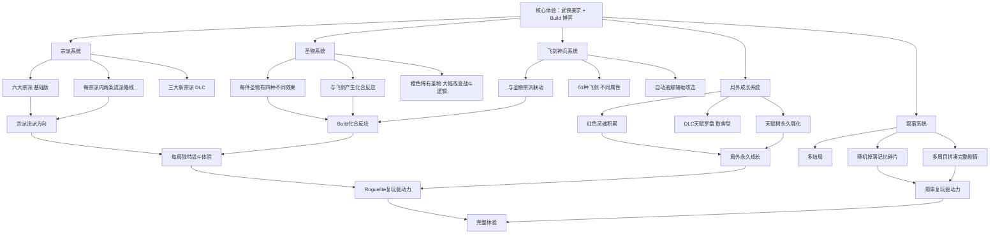

# 《暖雪》游戏分析

## 🎮 基础信息
- **游戏名**: 暖雪（Warm Snow）
- **开发商**: BadMudStudio（独立工作室）
- **发行商**: bilibili 游戏（哔哩哔哩游戏）
- **发行年份**: 2022年1月18日（PC）；2023年10月（Switch）；已登陆PS4/PS5/Xbox
- **平台**: PC（Steam）、Nintendo Switch、PS4/PS5、Xbox Series X
- **类型**: 动作 Roguelite / 武侠暗黑
- **游玩时长**: 单局 30-60 分钟，高重玩性
- **游玩状态**: ☐ 游玩中 ☐ 通关 ☐ 白金/全成就 ☐ 放弃
- **个人评分**: ⭐⭐⭐⭐⭐ (待填写)
- **Steam 评价**: 极度好评（35,000+ 条，英文 94% 好评）
- **DLC**: The End Of Karma（付费，2023年12月）

---

## 🎯 核心体验

### 一句话定位
武侠暗黑美学包裹的国产动作 Roguelite——以六大宗派提供十二种核心玩法方向，用"圣物四效果"替代"固定遗物效果"，让每局的 Build 构建不是在查表选最优解，而是在随机条件下即兴创作一套能跑起来的战斗逻辑。

### 核心循环

```
[单局循环]
选择宗派（决定基础战斗风格和技能池）
  → 随机关卡探索（击败敌人 + 收集资源）
  → 随机获取圣物（四选一效果，非固定）+ 飞剑（神兵）
  → Build 方向成型（圣物×飞剑×宗派的三维协同）
  → 击败关卡 Boss → 获得红色灵魂 + 叙事碎片
  → 死亡 or 通关

[局外循环]
红色灵魂 → 天赋树（永久强化基础属性/解锁遗物池）
  → 更强的下一局初始条件
  → 多周目收集记忆碎片拼凑剧情
  → 解锁不同结局
```

### 记忆点

1. **第一次圣物协同"爆炸"** — 某两件圣物搭配飞剑，突然触发超出预期的连锁反应，理解了"化合反应"的含义
2. **罗汉宗"剑雨"的压制感** — 连击落下如瀑布，视觉和打击感同步到顶
3. **DLC 日月宗的形态切换** — 不是等冷却，而是主动在日炎/月霜之间切换，操作节奏感完全不同
4. **阎罗佛宗第6击" 葬礼"** — 计数器积累，第6次飞剑命中瞬杀普通敌，第一次触发时的惊喜感极强
5. **随机记忆碎片拼出故事** — 某次捡到一块碎片，突然把之前几块碎片串联起来，理解了"暖雪"事件的真相片段

---

## 🧠 系统架构



### 主要系统拆解

#### 圣物系统（最核心的设计创新）
- **设计目标**: 消除"查表选最优遗物"的记忆化解法，让每次 Build 构建都是在随机约束下的即兴创作，而非执行已知最优路径
- **核心机制**: 每件圣物有四种完全不同的效果（不是同一效果的强弱变体），获得时随机生效其中一种；稀有橙色圣物可以大幅改变战斗逻辑；圣物与飞剑的特定组合产生意外的化合反应
- **深度来源**: 同一件圣物在不同一局里可能效果完全不同，玩家无法预先规划"我要拿A圣物+B圣物"，而是必须根据当前获得的具体效果实时调整 Build 方向；化合反应的发现本身就是乐趣来源
- **反直觉之处（关键洞察）**: 大多数 Roguelite 的遗物是固定效果——玩家熟练后知道"这个遗物配那个遗物很强"，Build 构建变成执行已知策略。暖雪的四效果设计**让记忆化失效**，每局都必须重新评估手头的圣物在当前效果下能做什么。这不是随机性增加，而是**把"知道最优解"的优势从老玩家手里部分拿走**，让每局都需要真正的当局判断。

#### 宗派系统（"十二种玩法"的实现方式）
- **设计目标**: 用六个宗派提供比六种更多的差异化体验，防止每次选择宗派都是"大同小异的换皮"
- **核心机制**: 六大宗派（基础版），每个宗派内有两条截然不同的流派路线（非线性强化，而是方向分叉）；DLC 新增三个宗派，每个有更极端的机制（日月的形态切换、阎罗佛的计数器、魂刃修罗的其他核心机制）
- **深度来源**: 同一宗派内的两条路线可能对圣物的需求完全不同，导致即使选了熟悉的宗派，也可能走进不熟悉的路线
- **宗派作为"战斗语法"**: 宗派不只是提供技能，而是定义了战斗的基本节奏和语法——罗汉宗的"连击堆量"、日月宗的"形态主动切换"、阎罗佛的"计数积累触发"，这些是完全不同的动作游戏体验，而不只是数值差异

#### 飞剑（神兵）系统
- **设计目标**: 提供远程辅助维度，但不允许飞剑成为独立的输出主体，而是让它成为强化圣物和宗派协同的催化剂
- **核心机制**: 51种飞剑，自动追踪攻击；飞剑与特定圣物组合时产生化合反应（如特定飞剑+圣物组合触发特殊连锁）；DLC 的阎罗佛宗通过飞剑命中次数积累"葬礼"计数器
- **深度来源**: 飞剑的选择不只是"哪个伤害高"，而是"哪个飞剑和我当前圣物能产生化合反应"；这让 51 种飞剑的组合空间实际上是飞剑 × 圣物效果的交叉组合
- **阎罗佛宗的反直觉设计**: 每6次飞剑击中积累一次"葬礼"效果（普通敌人瞬杀/Boss巨额真实伤害）。这是**非即时反馈机制**——攻击的收益不是即时显现的，而是在第6次命中时突然爆发。这和大多数动作游戏"出手即伤害"的直觉完全相反，强迫玩家改变对战斗节奏的感知。

#### 局外成长系统
- **设计目标**: 降低新玩家的挫败感，提供长期的持续成长感，让死亡有意义
- **核心机制**: 红色灵魂积累用于解锁天赋树（永久强化基础属性、扩展遗物池）；DLC 引入天赋罗盘，天赋点有限必须取舍
- **基础版 vs DLC 的设计哲学差异**: 基础版天赋树是"充分收集型"——慢慢解锁所有能力；DLC 天赋罗盘是"取舍型"——有限资源迫使选择方向。**这是两种完全不同的局外成长哲学**：前者让玩家感到"一直在变强"，后者让局外成长本身也有策略深度。DLC 的 70% 好评率（低于基础版 94%）部分来自这个改变——有玩家认为原有的"一直变强"感被破坏了。

#### 叙事系统
- **设计目标**: 用叙事驱动多周目重玩，不只靠难度挑战和构建多样性
- **核心机制**: 记忆碎片随机掉落（不是固定获取），需多周目才能拼凑完整世界观；多结局取决于玩家行为
- **随机掉落叙事的设计逻辑**: 随机性让每局的叙事发现不可预测——这局可能获得关键碎片，也可能只是边角信息。这复制了 STS2 的"每局都有新发现"的驱动力，但实现在叙事层面而非机制层面

---

## 🎨 体验层分析

### 手感与操控
高速近战连击是核心手感来源。攻击动作有明确的打击帧反馈，命中感清晰。闪避是生存的基础操作，Boss 战高度依赖精确闪避。视觉特效华丽但不影响可读性（敌人攻击判断范围清晰）。Metacritic 评测者描述为"you'll have a blast running around and slicing things up"。

### 关卡/内容设计
关卡设计强调 Build 成型过程中的强度节奏——早期资源稀缺时玩家在边缘生存，圣物协同成型后战斗体验质变。主要批评是"开局重复性"（早期关卡节奏单调），这是 Roguelite 品类的共性问题，但暖雪的这个问题相对明显。

### 叙事与世界观
武侠暗黑的世界观在 Roguelite 品类中有显著的差异化。"暖雪"异象的悬念设置足以驱动多周目。碎片化叙事的深度取决于玩家对主动拼凑的兴趣——主动型玩家会被叙事深深吸引，被动型玩家可能忽略大部分叙事内容。

### 美术与音乐
水墨画风与暗黑武侠的视觉融合是最强的差异化资产。战斗特效在水墨基础上保持了辨识度（攻击轨迹、状态效果清晰可读）。原声音乐有专门的免费 DLC，说明音乐质量被玩家高度认可。

---

## ⚖️ 设计取舍分析

| 设计决策 | 被什么约束逼出来的 | 得到了什么 | 真实代价 |
|---------|-----------------|-----------|---------|
| 圣物四效果（非固定） | 固定效果遗物系统在玩家熟练后退化为"执行已知最优路径"，缺乏真实博弈感 | 每局 Build 构建需要真实的当局判断；老玩家和新玩家的信息优势差距缩小 | 新手认知负担极重（不知道每件圣物的全部四种效果）；社区指南复杂度极高 |
| 宗派内两条路线而非一条 | 需要在有限宗派数量内提供更多差异化体验，控制内容制作成本 | 同一宗派有两种完全不同的游玩体验；重玩价值翻倍 | 每个宗派的设计复杂度翻倍；平衡性维护更难 |
| 随机掉落记忆碎片（非线性叙事） | 线性叙事在 Roguelite 结构下要求每周目重复观看，体验差；随机掉落激励多周目 | 叙事发现感保留到多周目；每局有惊喜叙事可能性 | 主线叙事连贯性弱；偶然性导致有玩家错过关键碎片，叙事理解不完整 |
| DLC 天赋罗盘（取舍型） | 基础版"充分收集型"天赋树在后期变为无意义的扫荡积累，缺乏决策深度 | 局外成长本身有策略深度；DLC 玩家需要思考局外投入方向 | 原有的"一直变强"爽感被打破；部分玩家反感被迫取舍；DLC 好评率（70%）明显低于基础版（94%） |
| 与 B站游戏合作发行 | 独立工作室缺乏国内发行和运营资源；B站有国内二次元/游戏用户基础 | 中国市场的发行、宣传、本地化支持；跨平台发行能力（Switch/PS/Xbox） | 可能影响创作独立性；国内外发行商策略可能产生分歧 |

---

## 💡 值得借鉴的设计

1. **"圣物四效果"的随机效果系统——让同一物品有多种可能性**: 不是给每件道具一个固定效果，而是定义效果池（4种互相差异较大的效果），获得时随机生效一种。在 `slayDemo/data/items/` 下，`ItemResource` 可以持有 `effect_variants: Array[EffectResource]` 数组，游戏生成时随机选取一个效果实例化。这让每次获得道具都有新鲜感，且不允许玩家完全用记忆替代判断。**关键设计要求**：四种效果之间必须差异足够大（不只是强弱之分），否则退化为数值随机而非策略随机。

2. **"宗派内两条路线"的分叉设计而非线性成长**: 同一宗派（职业/角色）内，不是单纯的技能数值升级，而是在某个关键节点产生方向分叉（A路线 vs B路线，两者都有价值但对应不同的 Build 方向）。在 `slayDemo` 的角色成长中，可以在某个等级点提供"技能演化方向选择"——不是"变强"而是"变不同"，这让技能系统的重玩价值翻倍而不需要成倍增加内容量。

3. **阎罗佛的"计数积累爆发"机制——非即时反馈的战斗节奏设计**: 在 `slayDemo` 中，某些技能/道具可以设计为"积累N次触发一次超级效果"而非"每次攻击即时生效"。**在 Godot 实现**: `StackableTrigger` 组件维护 `stack_count: int` 和 `trigger_threshold: int`，每次满足条件时 `stack_count++`，达到阈值时 emit `on_threshold_reached()` 信号并重置计数。这给战斗节奏增加了"蓄力→爆发"的韵律感。

4. **DLC 天赋罗盘的"取舍型局外成长"设计**: 对比基础版的"充分收集型"，取舍型让局外成长本身有策略价值。在 `slayDemo` 中，如果有局外成长系统，可以在早期用"充分收集型"降低新手门槛，然后在某个内容里程碑后引入"取舍型"系统给核心玩家提供更深的决策层。**但需注意**：暖雪 DLC 的 70% vs 94% 好评差距警示，改变已有的"爽感来源"比加入新内容更容易引发负面反馈——取舍型最好从新增而非替换开始。

5. **"化合反应"的设计表达——超出零件之和**: 圣物和飞剑的特定组合产生"化合反应"（效果超出两者各自的总和）。在 `slayDemo` 中，定义 `SynergyRule: Resource`——当 `condition_a` 和 `condition_b` 同时满足时，触发 `bonus_effect`。玩家发现一个意外的化合反应是一种认知惊喜，也是社区话题的来源（类似"松鼠流"之于背包乱斗）。

---

## ❌ 不足与问题

1. **开局重复性是高频差评点**: 早期关卡（Build 未成型时）节奏单调，玩家在强力体验出现前需要耐受一段时间。这在 Roguelite 品类是老问题，但暖雪的表现尤其明显——因为 Build 成型前后的体验落差非常大，反衬出前期的乏味。改进方向：给早期关卡增加更多即时爽感时刻（哪怕是视觉上的），让 Build 前期也有小波折。

2. **圣物四效果的认知负担极重**: 知道每件圣物的全部四种效果是深度游玩的前提，这对新手几乎是不可能的要求。社区攻略的复杂度也因此极高。改进方向：游戏内增加"当前圣物所有可能效果"的查阅界面（而不是只显示当前生效的效果），让玩家随时参考，降低外部攻略依赖。

3. **DLC 改变原有爽感结构引发分裂**: The End Of Karma DLC 的 70% 好评率暗示了一个设计问题——付费扩展内容引入了和基础版哲学不一致的系统（取舍型天赋），让部分玩家感到原有体验被改变了。这是扩展内容设计的普遍风险：扩展必须在"新鲜感"和"一致性"之间取得平衡。

4. **叙事随机掉落导致理解不完整**: 部分玩家可能在多周目后仍然没有拼凑出足够的叙事图景，因为关键碎片的掉落完全依赖运气。改进方向：保留大多数碎片的随机掉落，但让关键叙事节点（理解主线所必需的碎片）有保底掉落机制。

---

## 🔗 知识关联

### 与已读书籍的关联——以及与书里观点的张力

- **游戏编程设计模式**: 圣物四效果系统是**策略模式（Strategy Pattern）的 Roguelite 化应用**——同一件圣物对象根据随机选取的策略实现不同行为，但书里的策略模式通常在确定场景下切换，而暖雪是在获取时随机绑定一个策略，并在该局内固定。**书里没有讨论的问题**：当策略是随机绑定且玩家无法完全预知所有策略时，调试和平衡性验证变得极其困难——你需要测试策略 × 圣物 × 宗派的全部组合，而不只是单个策略的行为 | 关联强度: ⭐⭐⭐⭐⭐

- **游戏编程算法与技巧**: 化合反应系统的技术实现涉及**规则系统（Rule Engine）**——给定当前的圣物组合、飞剑类型、宗派，检查是否触发特定化合规则。书中的"行为树"和"规则评估"章节有相关基础，但大型化合规则系统（51种飞剑 × N种圣物效果）的高效实现需要哈希表查找而非遍历 | 关联强度: ⭐⭐⭐⭐

- **思考快与慢**: 圣物四效果设计是**刻意挑战系统1的记忆化倾向**。熟练玩家的系统1会自动调用"这件圣物很强/很弱"的记忆，但四效果系统让这个记忆有时是错的（当前生效的可能是四种效果中最弱的一种）。这强迫玩家激活系统2重新评估，而不是依赖系统1直觉。**张力**：书里卡尼曼说专家在高质量反馈环境下的系统1直觉是可靠的——暖雪的设计有意降低了这个可靠性，让玩家在熟练后也无法完全用系统1主导决策 | 关联强度: ⭐⭐⭐⭐⭐

- **真需求（梁宁）**: 暖雪的核心用户需求是"爽快的武侠打击感 + 深度的 Build 博弈"——这两者通常被认为是相互矛盾的（爽快感需要即时反馈，深度需要缓慢积累）。暖雪找到了一个可行的平衡点：**高速战斗满足即时爽感，圣物协同满足博弈深度，两者在同一个战斗场景中并行存在**。这是"应然vs实然"框架的实例——应然是"爽快感和深度不可兼得"，实然是"找到正确的设计组合后两者可以共存" | 关联强度: ⭐⭐⭐⭐

- **架构整洁之道**: 暖雪的三维协同系统（宗派×圣物×飞剑）如果设计良好，应该让每个维度各自独立，协同效果通过"接口组合"产生。**但这里有个现实张力**：化合反应系统为了实现特定组合的特殊效果，可能必须硬编码"飞剑A + 圣物B = 特殊效果C"这样的规则，这是依赖具体而非抽象的——整洁架构会要求用规则引擎替代硬编码，但这会带来额外的抽象成本 | 关联强度: ⭐⭐⭐

### 与其他游戏的关联

- **杀戮尖塔2**: 设计哲学对比——STS2 的 Build 深度来自"拥有哪些牌"，暖雪来自"圣物当前是哪种效果 + 与飞剑的化合"。**关键洞察**：两款游戏都用随机性制造构建不确定性，但切入点不同——STS2 的随机是"给什么牌"（组合随机），暖雪的随机是"给的圣物有什么效果"（单件内随机）。后者的随机粒度更细，带来更高频的意外发现，但也带来更高的信息负担。

- **Hades（哈迪斯）**: 同类对比——都是动作 Roguelite，都有深度叙事。但 Hades 的叙事是线性推进（每次死亡都有新对话），暖雪是随机碎片化。Hades 的叙事体验更稳定，暖雪的叙事发现感更强烈但也更不可控。

- **背包乱斗**: 横向对比——两款游戏都挑战了同类型的"记忆化最优解"问题：背包乱斗用"空间位置决定协同"，暖雪用"同一圣物有四种效果"。两种解法都有效，但机制完全不同——背包乱斗靠增加维度（空间），暖雪靠增加不确定性（随机效果）。

### 对自身项目（slayDemo）的具体启发

1. **EffectVariantResource 的实现方案**: 在 `slayDemo/data/items/` 下，`ItemResource.gd` 增加 `effect_variants: Array[EffectResource]`（推荐4个），游戏生成物品时 `active_effect = effect_variants[randi() % effect_variants.size()]`。关键：确保4个 variant 的差异足够大，可以通过 `effect_type: EffectType` enum 区分不同类别（Damage / Buff / Trigger / Modifier），每个 variant 应属于不同 type。

2. **StackableTrigger 计数器组件**: 在 `slayDemo/components/` 创建 `StackableTriggerComponent.gd`，持有 `threshold: int`、`current_count: int`，暴露 `increment()` 方法和 `on_triggered` 信号。任何道具需要"积累N次触发"时挂载此组件，通过信号连接触发逻辑，不需要每个道具单独写计数器逻辑。

3. **化合反应规则表的实现**: 在 `slayDemo/data/synergies/` 下创建 `SynergyRule` Resource，定义 `condition_item_a: ItemID`、`condition_item_b: ItemID`、`bonus_effect: EffectResource`。`SynergySystem` 在物品组合变化时检查当前持有物品对是否命中任何规则，命中则激活 bonus_effect。规则表存在 JSON 文件里，不硬编码在逻辑代码中。

---

## 📊 总结

### 最大的收获
**"圣物四效果"设计揭示了一个重要的设计原则：随机性可以有不同的"粒度"**。大多数 Roguelite 的随机是粗粒度的（给你哪些道具是随机的），暖雪把随机性推到细粒度（每件道具本身的效果是随机的）。细粒度随机带来更高频的意外发现，但也带来更高的认知复杂度。这是一个明确的权衡，不是单方面的升级。

### 认知转变（第五层洞察）

读这款游戏之前，我认为 Roguelite 设计的随机性深度来自"提供多少种道具/遗物组合"——道具越多，重玩价值越高。

暖雪改变了这个认知：**道具数量不是决定重玩价值的唯一变量，每件道具的效果复杂度（每件道具有几种可能性）同样是重玩价值的来源**。1件有4种效果的圣物，在信息复杂度上等于4件固定效果的遗物——但它带来的是"在一件道具内部发现新的可能性"，而不是"又学习了一件新道具"。

这对 `slayDemo` 的直接影响：与其设计大量道具，不如先控制道具总量，为每件道具设计2-4种差异化效果变体，这让设计工作量更可控，同时提供了更深的重玩价值。

### 核心结论

《暖雪》是国产动作 Roguelite 中罕见的在"爽快手感"和"Build 博弈深度"之间找到平衡的作品。圣物四效果设计是其核心创新——不是增加内容量，而是增加每件内容的信息复杂度，让玩家即使对所有道具都熟悉，也无法在每局开始时就确定最优路径。这是 Roguelite 的一种反记忆化设计策略，代价是更高的认知负担，收益是每局真实的当局博弈感。

---

> 参考来源：Steam 商店页面、Metacritic 评分、Nintendo Switch 官方页面、Steam 社区标签与讨论
> Steam 链接：https://store.steampowered.com/app/1296830/Warm_Snow/

**分析创建时间**: 2026-06-18
**最后更新**: 2026-06-18（已通过 rules.md 自我审查）
