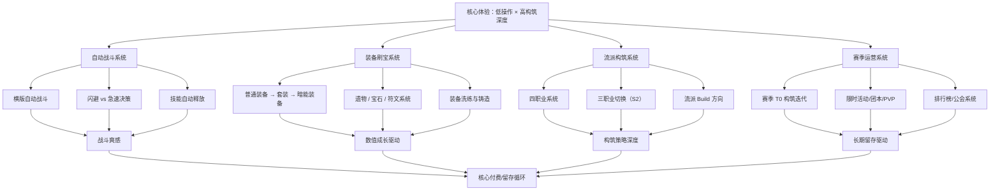

# 《英雄没有闪》游戏分析

## 🎮 基础信息
- **游戏名**: 英雄没有闪
- **开发商**: 未知（独立/小工作室）
- **发行商**: 未知
- **上线时间**: 约 2024 年底（S1），2025 年 6 月 S2 天启赛季
- **平台**: 微信小游戏、Android（九游、B站游戏）
- **类型**: 放置 ARPG / 刷宝 / 流派构筑
- **游玩时长**: 持续运营型，按赛季计
- **游玩状态**: ☐ 游玩中 ☐ 已通关 ☐ 放弃
- **个人评分**: ⭐⭐⭐⭐⭐ (待填写)
- **B站评分**: 5.3 / 10

---

## 🎯 核心体验

### 一句话定位
挂机版暗黑刷宝——在竖屏横版自动战斗中刷装备、构筑流派，以最低操作门槛提供最高流派深度，靠赛季制和 T0 构筑迭代驱动长期留存。

### 核心循环

```
[日常循环]
登录收取离线挂机收益（矿场/商店）
  → 进入副本自动刷图 → 获得装备/材料
  → 装备洗练/铸造优化当前流派
  → 爬塔 / 暗能秘境挑战更高层数（当前最高记录 121 层）
  → 参与赛季活动/公会夺旗赛/团本

[赛季循环]
新赛季开启（S1 → S2 天启 → 蚀梦…）
  → 新装备体系/新职业发布
  → 旧 T0 流派被削弱，新 T0 出现
  → 玩家重新构筑追求强度
  → 氪金/肝度再次激活
```

### 记忆点

1. **"闪"的取舍**: 游戏名直接来自核心决策——闪避有冷却，急速提升攻速，二者取其一是流派方向的第一个分叉
2. **流派成型瞬间**: 当核心装备/遗物/符文齐全，技能连锁打出预期效果的那一刻
3. **暗能秘境爬层**: 越来越高的层数带来的持续成就感积累
4. **三职业切换（S2 新增）**: 战斗中实时切换三个职业的操作/策略深度
5. **被私服薅羊毛的愤怒**: 官方与私服的法律纠纷成为玩家社区的讨论热点

---

## 🧠 系统架构



### 主要系统拆解

#### 自动战斗系统
- **设计目标**: 降低操作门槛至极限，让玩家专注于装备和构筑的思考，而不是手速反应；同时保留足够的爽感让玩家觉得自己的角色"很强"
- **核心机制**: 横版竖屏自动战斗，角色自动攻击和技能释放；玩家唯一的核心决策是**装备构筑**，而非实时操作；"闪"（闪避）本身是可选而非必须的机制
- **深度来源**: 虽然战斗自动，但装备词条、套装效果、遗物组合的协同计算需要大量研究；多维面板差异（站街/竞技/试炼塔各自独立计算）让同一套装备在不同场景需要不同配置
- **设计亮点**: "闪避 vs 急速"是最早给玩家的核心取舍——不是单纯的强弱对比，而是两种不同流派方向的起点，从命名开始就把这个取舍编进了游戏名

#### 装备刷宝系统
- **设计目标**: 提供无穷尽的数值追求目标，通过装备稀缺性和洗练随机性制造持续的"还差一件"体验
- **核心机制**: 普通装备 → 套装 → 暗能装备（S2 新增）的稀有度递进；遗物、宝石、符文作为附加强化层；洗练和铸造提供词条优化空间
- **深度来源**: 暗能装备的特殊词条改变技能行为（而非单纯数值）；多件套装效果的协同触发；词条随机性使"最优解"始终有追求空间
- **设计亮点**: 参考暗黑破坏神的刷宝框架——玩家知道更好的装备存在，知道如何获得，只是概率问题；这种"确定性稀缺"比"不知道能不能有"更驱动重复行为

#### 流派构筑系统
- **设计目标**: 在零操作压力下提供策略深度，让不同玩家因构筑方向不同而形成不同的讨论和攀比文化
- **核心机制**: 四职业（野蛮人/秘法师/暗影游侠/荆棘游侠）各有独立技能树；S2 引入三职业切换扩展协同空间；每个职业内有多个流派方向（如秘法师：冰焰/电矛/火眼）
- **深度来源**: 流派间的克制关系；T0 构筑在不同副本模式下的表现差异；赛季版本更新后的 Meta 研究和迭代
- **设计亮点**: 赛季制驱动的 T0 迭代——新赛季主动打破旧 T0，制造新的"最优解"探索热情；这保证了老玩家的持续投入，代价是引入平衡争议

#### 赛季运营系统
- **设计目标**: 维持长期留存和付费驱动，通过定期内容刷新防止玩家"玩通了就走"
- **核心机制**: 赛季制定期重置/扩展内容（S1 → S2 天启 → 蚀梦）；每赛季引入新职业/装备体系；排行榜、公会活动提供社交竞争层
- **深度来源**: 赛季节点是社区最活跃的时刻——T0 构筑研究、攀比排名、首发玩家优势
- **设计亮点**: 赛季不是"重置"（保留角色进度），而是"扩展"——新内容叠加在旧内容之上，老玩家不失去积累，新玩家有新切入点

---

## 🎨 体验层分析

### 手感与操控
零操作压力是设计核心。玩家的"手感"体验来自观看自己角色流畅击杀的视觉反馈，而非操控的精准感。打击感靠特效表现而非物理反馈。九游平台评价该游戏"放置游戏中打击感强"——这是对同类放置游戏的相对评价，不是对动作游戏的绝对标准。

### 关卡/内容设计
内容结构以深度（爬层）而非宽度（关卡数量）为核心——暗能秘境 121 层是当前记录，意味着内容量足够支撑长期探索。赛季活动提供限时横向内容（团本/夺旗赛）打破单调的垂直爬层节奏。

### 叙事与世界观
叙事极轻，世界观背景为奇幻 ARPG 风格（英雄/骑士/赛季主题如"天启"）。叙事不是留存驱动力，数值成长和社交竞争才是。这是典型的运营型手游叙事策略——不投入大量资源做叙事，只做足够的世界观包装。

### 美术与音乐
竖屏横版像素/半像素风格，适合移动端碎片化游玩场景。视觉重点在技能特效的爽感表现，而非场景精细度。微信小游戏平台限制了包体大小，美术资产量有硬性约束。

---

## ⚖️ 设计取舍分析

| 设计决策 | 得到了什么 | 放弃了什么 |
|---------|-----------|-----------|
| 自动战斗 + 零操作 | 极低上手门槛，碎片化时间友好，放置受众广 | 操作技巧带来的成就感，高强度操作玩家群体 |
| 赛季制 T0 迭代 | 长期留存，定期激活老玩家重新投入 | 单一构筑玩家的满足感；引发"被迫换 build"的不满 |
| 多维面板差异化（站街/竞技/爬塔各不同） | 增加策略层次，不同场景有不同最优解 | 理解成本高，新手难以掌握 |
| 私服泛滥问题 | （非设计选择，是结果）—— 证明游戏有足够市场吸引力 | 大量流失官服付费用户，口碑被私服拖累 |
| 三职业切换（S2 新增） | 显著提升构筑空间和策略深度，给老玩家新鲜感 | 复杂度提升，新手曲线变陡 |
| 微信小游戏平台 | 极低获客成本，依托微信社交传播 | 包体限制、性能限制、支付转化率低于原生 App |

---

## 💡 值得借鉴的设计

1. **"闪 vs 急速"命名即核心取舍**: 把最核心的构筑分叉编进游戏名，让玩家在了解游戏名的瞬间就理解了第一个决策点。这是极低成本的设计表达——名字本身就是设计文档的一部分。在自己的项目中，核心机制的命名应该直接传达取舍，而不是中性的描述性名称。

2. **暗能装备改变技能行为而非单纯加数值**: 高稀有度装备不只是"+X%伤害"，而是改变技能的运作方式（如：普通技能 → 触发额外爆炸 / 变为范围技能）。这让刷宝的终点不是数字更大，而是"解锁了新的玩法"。在 Godot 项目中，顶级装备可以用 `SkillModifier` Resource 改变技能的 hitbox、弹道、触发条件，而不只是修改 damage 数值。

3. **多维面板差异**: 同一角色在不同场景下有不同的面板计算权重，强迫玩家思考"这套 Build 适合什么场合"。这比单一强度排名更有深度，也为不同玩法风格创造了合法性。

4. **赛季扩展而非重置**: 每赛季保留之前的进度积累，只叠加新内容。玩家不会"失去"什么，只会"得到"更多选择。这比完全重置的赛季机制更友好，但需要在数值膨胀上做精细管理。

5. **私服纠纷揭示的设计真相**: 官方对私服提起诉讼，说明私服规模已经严重影响营收。从设计角度看，私服泛滥是"游戏足够好玩、但付费设计太激进"的信号——玩家认可游戏体验，但拒绝付费压力，转向免费私服。这是付费设计和体验设计失衡的典型案例。

---

## ❌ 不足与问题

1. **又肝又氪**: B站评分仅 5.3，核心抱怨是付费压力过大。有玩家氪金达 5-10 万元，说明游戏存在鼓励超额付费的设计。改进方向：限制单账号消费上限或增加更多免费获取高价值内容的路径。

2. **私服问题严重**: 官方已对私服运营者提起诉讼，说明私服规模足以威胁官服生存。私服泛滥是"体验好但付费太贵"的信号，根本解法是调整付费设计而非单纯打压私服。

3. **技术稳定性**: 存在闪退等技术问题，影响游玩体验。对于依赖日活的运营型手游，技术稳定性是最基础的留存要素。

4. **叙事空洞**: 世界观包装薄弱，对叙事型玩家没有吸引力。这是有意的设计取舍（聚焦数值体验），但限制了受众范围扩展。

---

## 🔗 知识关联

### 与已读书籍的关联

- **游戏编程设计模式**: 装备系统的组合模式（Composite Pattern）——遗物/宝石/符文叠加效果；技能系统的装饰器模式（Decorator）——装备词条修改技能行为；赛季内容的策略模式管理不同流派逻辑 | 关联强度: ⭐⭐⭐⭐

- **游戏编程算法与技巧**: 装备词条的随机权重采样；洗练系统的随机池设计；多维面板计算的数值平衡算法；爬塔难度曲线的数值设计 | 关联强度: ⭐⭐⭐⭐⭐

- **思考快与慢**: 赛季制 T0 迭代利用损失厌恶——玩家不是为了"变强"而重新构筑，而是为了"不落后"；刷宝的近失效应（"再刷一次可能出暗能"）是驱动重复行为的核心心理机制 | 关联强度: ⭐⭐⭐⭐⭐

- **架构整洁之道**: 多维面板系统（站街/竞技/爬塔）的依赖倒置——战斗逻辑不直接引用具体场景的面板，而是通过接口注入场景上下文；装备系统与战斗系统解耦便于赛季扩展 | 关联强度: ⭐⭐⭐

- **真本事 从会工作到会赚钱**: 私服泛滥 → 官方诉讼的案例，体现了商业模式设计失误的代价；"体验好但付费太贵"是产品价值与商业设计不匹配的典型案例 | 关联强度: ⭐⭐⭐

### 与其他游戏的关联

- **杀戮尖塔2**: 同类对比——都有流派构筑核心，但 STS2 是单局构筑+认知成长驱动，英雄没有闪是长期数值积累+赛季迭代驱动；STS2 无付费压力，英雄没有闪是付费驱动商业模式 | 类型: 同类对比

- **暗黑破坏神**: 设计传承——刷宝框架和装备稀缺性设计的参考标杆；"确定性稀缺"（知道更好的装备存在，只是概率问题）驱动重复游玩 | 类型: 设计传承

- **Horripilant**: 同类对比——都用放置/自动化机制降低操作门槛，但 Horripilant 用叙事氛围驱动，英雄没有闪用数值成长驱动；两种 Idle 设计哲学的对比 | 类型: 同类对比

### 对自身项目（Godot 游戏开发）的启发

1. **暗能装备改变技能行为的实现**: 在 Godot 中，用 `Array[SkillModifierResource]` 存储装备对技能的修改列表。技能执行前遍历 modifier，每个 modifier 可以修改 hitbox、弹道数量、触发条件等。顶级装备添加新的 modifier 而不是修改基础数值，技能系统核心逻辑不变。

2. **多维面板的场景注入**: 用 `BattleContext` 对象封装当前场景类型（PVE/PVP/Tower），战斗系统从 context 获取面板权重而不是硬编码。切换场景只需替换 context 对象，不修改战斗逻辑。

3. **洗练系统的随机池设计**: 用加权随机池（`WeightedPool<T>`）管理词条出现概率。每个装备部位有独立的词条池，池的权重可以通过数据配置，无需修改代码。Godot 中用 `Dictionary` 存储词条及其权重，`randf()` 实现加权采样。

---

## 📊 总结

### 最大的收获
理解了"赛季制 T0 迭代"作为长期留存机制的运作逻辑——不是单纯的内容更新，而是主动打破现有最优解，让玩家重新进入"探索 → 构筑 → 验证"的循环。代价是引发被迫换 Build 的不满，这是付费驱动型游戏必然面对的设计张力。

### 核心结论

《英雄没有闪》是一款典型的运营型放置 ARPG：**用极低操作门槛守住受众，用流派构筑深度留住核心玩家，用赛季制和付费设计驱动商业变现**。B站 5.3 的评分和私服泛滥揭示了它的根本矛盾——游戏体验被玩家认可（否则不会有私服市场），但付费设计被玩家抗拒（所以玩家逃往私服）。这是国内运营型手游"体验设计 vs 商业设计"失衡的典型案例，对自己做游戏的启示是：**商业化设计的激进程度，不能超过玩家对游戏体验的认可程度**。

---

> 参考来源：B站游戏评分页面、九游平台游戏介绍、微信小游戏平台、玩家社区讨论
> 平台：微信小游戏 / Android，非 Steam 游戏

**分析创建时间**: 2026-06-17
**最后更新**: 2026-06-17
