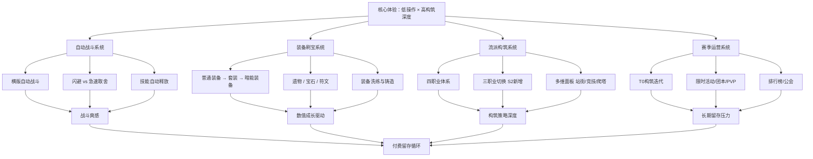

# 《英雄没有闪》游戏分析

## 🎮 基础信息
- **游戏名**: 英雄没有闪
- **开发商**: 未知（独立/小工作室）
- **发行商**: 未知
- **上线时间**: 约 2024 年底（S1），2025 年 6 月 S2 天启赛季
- **平台**: 微信小游戏、Android（九游、B站游戏）
- **类型**: 放置 ARPG / 刷宝 / 流派构筑
- **游玩时长**: 持续运营型，按赛季计
- **游玩状态**: ☐ 游玩中 ☐ 已通关 ☐ 放弃
- **个人评分**: ⭐⭐⭐⭐⭐ (待填写)
- **B站评分**: 5.3 / 10

---

## 🎯 核心体验

### 一句话定位
把游戏名做成核心机制取舍的说明书——"闪（闪避）"还是"不闪（急速）"是流派第一个分叉，同时也是整个游戏的设计哲学：每个选择都意味着放弃某种可能性。

### 核心循环

```
[日常循环]
登录收取离线挂机收益（矿场/商店）
  → 进入副本自动刷图 → 获得装备/材料
  → 装备洗练/铸造优化当前流派
  → 爬塔 / 暗能秘境挑战更高层数（当前最高记录 121 层）
  → 参与赛季活动/公会夺旗赛/团本

[赛季循环]
新赛季开启（S1 → S2 天启 → 蚀梦…）
  → 新装备体系/新职业发布
  → 旧 T0 流派被削弱，新 T0 出现
  → 玩家重新构筑追求强度
  → 付费/肝度再次激活
```

### 记忆点

1. **"闪"的取舍顿悟**: 游戏名直接来自核心决策——你一旦理解了这个取舍，你就理解了整个游戏的设计哲学
2. **流派成型瞬间**: 当核心装备/遗物/符文齐全，技能连锁打出预期效果的那一刻
3. **暗能秘境爬层**: 层数本身就是成就感，越来越高的数字有原始的满足感
4. **三职业切换（S2 新增）**: 战斗中实时切换三个职业，突然增加了一层策略厚度
5. **私服问题的愤怒**: 官方诉讼私服这件事本身，让玩家社区讨论了"为什么会有这么多人选择私服"

---

## 🧠 系统架构



### 主要系统拆解

#### 自动战斗系统
- **设计目标**: 降低操作门槛至零，让玩家的全部认知资源投入到装备构筑决策，而不是手速
- **核心机制**: 横版竖屏自动战斗，完全无需玩家操作；"闪（闪避）"与"急速（攻速）"是构筑方向的起点，而非战斗中的主动操作
- **深度来源**: 战斗是构筑决策的结果展示，而非独立的技能考验；多维面板差异（站街/竞技/爬塔各自独立计算）让同一套装备在不同场景有不同表现
- **关键设计洞察：命名即设计文档**: "英雄没有闪"这个名字把最核心的构筑取舍编进了游戏名。玩家在看到游戏名的瞬间，就已经理解了第一个设计选择面临的问题。这是**极低成本的机制沟通**——不需要新手教程解释这个取舍，游戏名本身就是说明。

#### 装备刷宝系统（核心付费驱动）
- **设计目标**: 制造无穷尽的"还差一件"感，让玩家始终处于追求状态
- **核心机制**: 普通装备 → 套装 → 暗能装备（S2 新增）的稀有度递进；洗练提供词条随机性；暗能装备的特殊词条**改变技能行为而非单纯加数值**
- **深度来源**: "确定性稀缺"——玩家知道更好的装备存在，知道如何获得，只是概率问题；这比"不知道能不能有"更驱动重复行为
- **设计张力——暗能装备是最反常识的正确决策**: 大多数刷宝游戏的终局装备只是数值更高的版本。暗能装备改变技能**行为**，意味着玩家在追求暗能装备时，追求的不只是"更强"，而是"解锁了一种新玩法"。这是把"刷宝终点"从数值天花板延伸为"玩法发现"的设计——**既满足了追求更强的驱动力，又给了玩家一个新的好奇心**。

#### 流派构筑系统
- **设计目标**: 在零操作压力下提供策略深度，让不同玩家形成不同的流派认同和社区讨论文化
- **核心机制**: 四职业（野蛮人/秘法师/暗影游侠/荆棘游侠）各有独立技能树；S2 引入三职业切换；多维面板制造不同场景的最优解差异
- **深度来源**: T0 构筑在不同副本的表现差异；赛季 Meta 迭代带来的持续研究需求；职业 × 装备 × 遗物三维组合
- **赛季 T0 迭代的运作逻辑**: 新赛季主动打破旧 T0，这不是设计失误，而是**蓄意的留存机制**——如果旧 T0 永远有效，核心玩家就没有在赛季初期重新投入的动力。代价是让"有感情的构筑"被否定，引发"被迫换 Build"的不满。

#### 赛季运营系统
- **设计目标**: 维持长期付费驱动，通过定期内容刷新制造"现在不投入就落后"的紧迫感
- **核心机制**: 赛季制扩展（保留历史进度，叠加新内容）；每赛季引入新职业/装备体系；排行榜制造社交竞争层
- **深度来源**: 赛季节点是社区最活跃的时刻，T0 构筑研究成为玩家社区的集体行为
- **扩展而非重置的约束**: 赛季不重置历史进度，是被玩家粘性约束逼出来的——如果重置，已经投入大量时间的玩家会强烈抵制。保留进度意味着数值膨胀需要精细管理，否则新玩家和老玩家差距会越来越大。

---

## 🎨 体验层分析

### 手感与操控
零操作压力。玩家的"手感"来自观看自己强力角色流畅击杀的视觉反馈，以及构筑成型后的"解题感"——"我设计了这套流派，它在按我的预期运转"。这种满足感不来自操控，而来自规划。

### 关卡/内容设计
内容结构以深度（爬层）而非宽度（关卡数量）为核心。暗能秘境 121 层说明内容量足够，但这也意味着玩家的主要体验是"反复做相同类型的事但越来越强"——这对放置受众是正确的，但无法吸引追求新鲜感的玩家。

### 叙事与世界观
叙事极轻，是运营型手游的标准处理——世界观只需要足够支撑美术和命名，不需要深度叙事。这是有意的资源分配，把制作成本放在系统而非故事上。

### 美术与音乐
竖屏横版像素/半像素风格，技能特效是视觉重点。微信小游戏的包体限制（约 100MB）对美术资产有硬约束。视觉服务于"展示流派强度"——当你的构筑成型时，技能特效应该让你感到自己"很强"。

---

## ⚖️ 设计取舍分析

| 设计决策 | 被什么约束逼出来的 | 得到了什么 | 真实代价 |
|---------|-----------------|-----------|---------|
| 自动战斗 + 零操作 | 微信小游戏碎片化场景——玩家可能随时放下手机；操作门槛高会提高流失率 | 极低流失率；放置受众广；玩家专注构筑 | 无法吸引喜欢操作技巧的玩家；战斗爽感上限有限 |
| 赛季制 T0 迭代 | 需要定期制造"现在不投入就落后"的紧迫感来驱动付费 | 赛季初期付费高峰；老玩家持续活跃 | "被迫换 Build"的不满；积累感被每赛季稀释 |
| 暗能装备改变技能行为 | 如果只加数值，刷宝的终点就是数字天花板，缺乏持续追求动力 | 刷宝终点变为"玩法发现"；持续的新奇感 | 设计成本高；平衡性更难控制；新手理解门槛高 |
| 多维面板（站街/竞技/爬塔） | 单一强度排名会让游戏退化为"只有一个最优解"，玩家讨论空间消失 | 不同场景有不同最优解；不同玩家有不同着力点 | 新手理解负担大；玩家可能不理解为什么"越级号"打不过爬塔号 |
| 私服泛滥（非设计选择） | 付费压力太高，部分玩家理性选择免费私服 | （无，这是成本）—— 揭示了付费设计和体验设计失衡 | 营收流失；官服口碑被私服问题拖累 |

---

## 💡 值得借鉴的设计

1. **游戏名即设计文档的命名策略**: "英雄没有闪"直接揭示了核心机制取舍。在 `slayDemo` 中，如果有核心的取舍机制（比如"速度 vs 力量"），考虑在游戏名或核心系统命名上直接体现这个取舍，而不是用中性的描述性名称。**不需要为此改游戏名，但可以用这个逻辑命名核心技能树或职业**。

2. **暗能装备"改变行为而非数值"的实现**: 在 `slayDemo/data/items/` 下，顶级装备的 `.tres` 文件增加 `skill_override: SkillBehaviorResource` 字段——当装备这件道具时，某个技能的 `behavior` 被替换为新资源。新 behavior 可以改变弹道数量、爆炸范围、触发条件等。技能执行代码不变，只替换 behavior 对象，实现"行为改变"而非"数值提升"。

3. **多维面板的 BattleContext 注入模式**: 在 `slayDemo` 的战斗系统中，用 `BattleContext` 枚举区分场景类型（OVERWORLD / PVP / TOWER），战斗伤害计算时从 context 获取当前场景的面板权重系数。这让同一个角色在不同场景有不同的表现侧重，增加策略层次而不需要设计完全不同的系统。

---

## ❌ 不足与问题

1. **付费压力与体验认可度的根本矛盾**: 私服泛滥是最直接的证据——玩家选择私服不是因为游戏不好玩，而是因为付费设计太激进。**这是一个商业模型设计失误，而不是游戏设计失误**。游戏体验本身是被玩家认可的（否则不会有私服需求），但付费设计的激进程度超过了玩家的接受阈值。改进方向：付费上限感知设计——让玩家在大额付费时能清晰感知到等值的回报，而不是感到在填无底洞。

2. **赛季 T0 迭代与玩家积累感的长期张力**: 赛季制打破旧 T0 是短期留存的有效手段，但长期会让玩家感到"我的积累随时可能被否定"。这种不安全感在玩家付出大量时间和金钱后会累积成强烈的不满。改进方向：提供某种形式的"积累延续性保证"——让老 T0 在某个场景仍然有效，而不是完全被淘汰。

3. **B站 5.3 评分揭示的口碑结构问题**: 5.3 的平均分不是"大家觉得一般"，而是"爱的人很爱，恨的人很恨"的双峰分布。这说明游戏在某个玩家群体中有强烈的粉丝，但付费设计驱走了另一个群体。口碑问题不是整体改善游戏体验，而是修复付费体验的感知。

---

## 🔗 知识关联

### 与已读书籍的关联——以及与书里观点的张力

- **思考快与慢**: 赛季制 T0 迭代利用损失厌恶——玩家不是为了"变强"而重新构筑，而是为了"不落后于当前 Meta"。**书里卡尼曼的损失厌恶描述的是绝对损失；这里是相对损失（落后于排行榜）——社交比较放大了损失厌恶效应**。这是书里"社会比较"章节的实际应用，但运营型手游把它用得更极端：不只是"失去已有的"，而是"相对他人变弱了"，这种相对损失在有排行榜的游戏里可以无限续杯 | 关联强度: ⭐⭐⭐⭐⭐

- **游戏编程算法与技巧**: 装备词条的加权随机采样、洗练系统的随机池设计。**但这里有个重要的设计约束书里没有讲**：付费型游戏的随机概率设计需要在"玩家感知公平"和"付费转化"之间平衡——概率太高玩家不需要付费，概率太低玩家感到被坑。这是商业约束塑造了算法设计，而不只是技术问题 | 关联强度: ⭐⭐⭐⭐⭐

- **真本事 从会工作到会赚钱**: 私服泛滥 → 官方诉讼的案例，是"短期利益 vs 长期价值"的典型案例。**书里讲"真本事"是建立在信任和价值上的——而这款游戏的付费设计消耗的恰恰是玩家对游戏的信任**。私服玩家本质上是在说"我认可你的游戏，但不认可你的商业模式"，这是玩家给开发者的最直白的产品反馈 | 关联强度: ⭐⭐⭐⭐

### 与其他游戏的关联

- **灵画师**: 同类横向对比——同为微信小游戏放置 ARPG，同样有付费激进问题，但差异化策略不同：灵画师用美术差异化（水墨国风）获客，英雄没有闪用流派构筑深度留存。两者都证明了：**在微信小游戏放置品类，系统深度不能阻止付费问题破坏口碑**。

- **杀戮尖塔2**: 终极反差对比——同有流派构筑核心，STS2 靠认知成长留存（无付费压力），英雄没有闪靠赛季数值迭代留存（强付费压力）。**这个对比揭示了一个规律：认知成长作为留存机制比数值积累更健康，但要求游戏设计本身足够深——不是所有游戏都能用认知成长替代数值积累**。

### 对自身项目（slayDemo）的具体启发

1. **游戏名/核心系统命名实践**: 在 `slayDemo` 里，如果核心有取舍机制，用命名直接传达这个取舍。不一定是游戏名，可以是职业名（"灵活流" vs "厚重流"），或技能树名称，让玩家在看名字的瞬间就理解了方向的含义。

2. **暗能装备的 SkillBehaviorResource 实现路径**: 已有 `slayDemo` 的道具系统基础。下一步：在 `Item.tres` 增加 `skill_behavior_override: Resource` 字段，`SkillExecutor` 在执行技能前检查是否有 override，有则用 override 的 behavior，否则用默认 behavior。这个改动预计 2-3 小时完成，不需要重构现有系统。

---

## 📊 总结

### 最大的收获
**私服泛滥是最诚实的市场调研结果**——玩家用"逃往私服"而非"放弃游戏"来投票，这说明游戏体验本身足够好，付费设计才是问题所在。这是开发者最难接受但最需要正视的反馈：玩家不是在否定你的游戏，而是在否定你的商业模式。

### 认知转变（第五层洞察）

之前我认为"付费游戏口碑差"主要是因为游戏本身质量不够。

英雄没有闪改变了这个认知：**游戏体验和商业模式是两个可以独立评价的维度，一款游戏可以体验好但商业模式差**，这两者同时成立时，结果就是：有足够多的人认可这个游戏体验（私服市场），但没有足够多的人愿意为官方的商业模式付钱。

这对自己做游戏的启示是：**先把游戏做好，再设计付费——而不是把付费机制织入游戏的核心体验中**。一旦付费机制和游戏体验深度耦合（比如付费直接购买战力），玩家就无法单独评价这两件事，任何一个崩溃都会拉垮另一个。

### 核心结论

《英雄没有闪》是一款设计上有真实亮点（命名即机制、暗能装备改变行为、多维面板）但被商业设计拖累口碑的游戏。B站 5.3 分和私服诉讼是同一个真相的两面：游戏体验够好，但商业设计的激进程度超过了玩家信任的边界。

---

> 参考来源：B站游戏评分、九游平台介绍、玩家社区讨论
> 平台：微信小游戏 / Android

**分析创建时间**: 2026-06-17
**最后更新**: 2026-06-17（依据 rules.md 批判性迭代）
