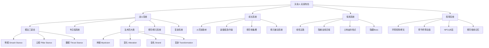

# 《黑神话：悟空》游戏分析

## 🎮 基础信息
- **游戏名**: 黑神话：悟空（Black Myth: Wukong）
- **开发商**: Game Science（游戏科学）
- **发行商**: Game Science（自发行）
- **发行年份**: 2024年8月20日
- **平台**: PC（Steam/Epic）、PS5
- **类型**: 动作RPG / 类魂（SoulsFeel，非SoulsLike）
- **游玩时长**: 主线约20-30小时，全探索50+小时
- **游玩状态**: ☑ 通关
- **个人评分**: ⭐⭐⭐⭐ (4/5星)
- **Metacritic**: PC 81 / PS5 76 | 用户评分 8.2
- **OpenCritic**: 82/100，81%评论家推荐
- **Steam**: 特别好评
- **开发规模**: 140人团队，约7000万美元预算，六年开发
- **销售成绩**: 发售3天1000万份，首月突破2000万套（史上最快销售记录之一）

---

## 🎯 核心体验

### 一句话定位
以《西游记》为骨，以西方动作RPG为肉，用中国神话的视觉震撼制造"我就是孙悟空"的具身代入感——这是一款用文化符号打透全球市场的国产 3A 首作。

### 核心循环

```
【战斗循环】
轻攻击积累专注值 → 专注重击破防/制造窗口
→ 法术/变身释放惊人爆发 → 击败妖怪获得精华/装备
→ 解锁技能/升级装备 → 挑战更强Boss

【探索循环】
线性主路前进 → 发现隐秘岔路 → 探索隐藏Boss/精元宝物
→ 回土地庙存档/打坐（类篝火） → 强化天命人 → 推进章节

【叙事循环】
击败章节Boss → 解锁动画短片 → 揭示西游记隐藏故事面
→ 驱动玩家探索下一个"他是谁"的谜题
```

### 记忆点
1. **首Boss黄风大圣**：开场即高强度Boss战，建立"这不是普通国产游戏"的信任感
2. **变身系统的惊喜时刻**：第一次化身赤髯龙，操控逻辑瞬间切换，既新鲜又流畅
3. **土地庙打坐升级界面**：水墨风UI融入中国传统美学，功能性与美学达到高度统一
4. **章节终章动画MV**：每章结尾的高水准动画收尾，将叙事张力推向高点（技法多样，包括定格动画、写意画风）
5. **大足石刻场景**：3D扫描真实千手观音景区，场景壮观度达到电影级

---

## 🧠 系统架构



### 主要系统拆解

#### 棍法三姿态（Core Identity）
- **设计目标**: 用"单一武器多面化"解决"只有棍"带来的单调感风险；让玩家在有限工具集内发现深度而非依赖武器多样性
- **核心机制**:
  - **劈棍**：高频轻攻击积累专注值最快，四段专注后可发动强力重击；适合近身连打风格
  - **立棍**：将棍插入地面，进入"扎马步"蓄力状态，一次满蓄造成巨大范围伤害；适合对Boss出手谨慎时读帧使用
  - **戳棍**：更快的步法与穿刺系手段，专注值积累方式不同，轻攻击最后一击自带推进效果
- **深度来源**: 三种姿态切换没有冷却，可在动作之间穿插；高手玩家用姿态切换规避接触帧（比纯闪避更主动）；每种姿态的技能树扩展不同，一周目很难完全解锁所有姿态特性，形成流派选择
- **设计亮点**: 将"棍棒"这一单一武器类型的形态可能性充分挖掘，棍可伸缩、可插地、可高速点刺，对应如意金箍棒的神话属性——机制与叙事高度自洽

#### 专注值系统（Poise & Focus Management）
- **设计目标**: 给平A（普通攻击）加上积累意义，制造"打出重击前的期待感"；同时在没有弹反机制的情况下，给玩家一个"进攻奖励"的成就感来源
- **核心机制**:
  - 每段轻攻击完成后积累专注层（最高4层）
  - 精准闪避（完美闪避）也积累专注值
  - 不同姿态的重击效果完全不同（劈棍=AOE爆发，立棍=超高单体，戳棍=快速多段）
- **深度来源**: 对满专注时机的判断——Boss有些阶段会连续打断你的积累，何时蓄、何时放、何时切换姿态补满专注，是中高阶玩家的核心决策层
- **设计亮点**: 将魂系游戏的"姿态破坏"逻辑逆转——不是等对方硬直再打，而是自己积累"进攻动能"

#### 法术四大类（Spell Diversity）
- **设计目标**: 在单一武器框架下提供战术多样性；让玩家在纯动作游戏的快节奏中嵌入一套轻量化的技能规划层
- **核心机制**:
  - **神通**：招式最华丽，伤害高，分别消耗法力和有冷却（如定身术、腾云驾雾）
  - **变化**：改变天命人的临时属性或形态（如化石，吸收一次攻击变成石像）
  - **毫毛**：召唤系，拔一根毫毛变成分身/辅助（如毫毛幻象诱敌）
  - **变身**：最独特——变身为妖怪，使用其独立技能组和独立HP池，直到"神力"耗尽才恢复本体
- **深度来源**: 变身的独立HP池制造了"换人续命"的战术空间；不同变身对不同Boss有制衡窗口；法术组合之间没有显式规划，靠玩家自行发现协同（如先用毫毛分散仇恨，再切变身输出）
- **设计亮点**: 变身系统打破了"我只是用工具的玩家"感，变成了"我就是那只妖怪"的具身体验，与西游记"孙悟空的变化神通"完全契合

#### 精华系统（Spirit System）
- **设计目标**: 将Boss战的胜利延伸为战术资源；让击败精英/Boss的行为产生成长感，而不仅是叙事推进
- **核心机制**:
  - 击败妖怪头领后可"吸收精华"，获得该妖怪的一种独特攻击招式
  - 精华通过积累"气（Qi）"来激活，气通过普攻自然积累
  - 同时只能装备一个精华，形成选择约束
- **深度来源**: 精华的招式类型各异（有近战爆发、有范围控场、有专门破厚甲的），面对不同Boss匹配不同精华是隐藏的策略层；精华招式可以打断Boss的某些硬直前置动作
- **设计亮点**: 把"战胜敌人的体验"物质化为可操作的战术工具——玩家不只是打死了那个Boss，而是"收服"了它的力量，这是西游记收服妖怪叙事的机制映射

#### 成长系统（Skill Tree + Equipment）
- **设计目标**: 在高强度动作核心下提供RPG的数值成长感；同时通过技能树实现流派分化
- **核心机制**:
  - 技能点称为"火花"，分配到武功/法术/变化三棵大树
  - 技能树**随时可免费重置**，降低试错代价
  - 装备系统分武器/头/身/手/腰/脚，每件装备有独立词条效果，可以在炉端用材料升级或锻造新装备
- **深度来源**: 技能树深度不强，但配合装备词条可以形成特定流派（如专注流、变身流、法术流）；Boss掉落特定装备部件，驱动重复挑战
- **设计亮点**: 无惩罚重置是一个大胆决策——它降低了学习成本，让玩家主动尝试新流派而不是锁在第一套不敢换；这与魂系游戏"存档惩罚"的设计哲学完全相反

---

## 🎨 体验层分析

### 手感与操控

黑神话的手感有一个关键特点：**重量感而非精准感**。攻击有明显的后摇和动作惯性，闪避是纯方向翻滚（无无敌时间精准化设计），节奏比传统动作游戏偏慢一拍，更接近力量感而非速度感。

这与魂系的设计思路一致，但有一个根本差异：**黑神话没有弹反系统**。这使得战斗的攻防博弈从"精准读帧→弹反→反击"变成了"读取Boss动作→选择闪避时机→寻找输出窗口"。这降低了操作上限，但也降低了新手的挫败密度。

完美闪避（大部分时间内的闪避）会给出短暂减速特效作为反馈，表明击中了无敌帧，这个视觉/音效反馈非常明确，给玩家清晰的"我做对了"信号。

### 关卡/内容设计

结构是**线性主线 + 局部开放探索区域**的混合形态：

```
章节大门（线性推进）
    ↓
     ├── 主路 A → B → C → 章节Boss
     │
     └── 支路 X → 精英战 → 隐藏Boss → 精元/装备
              └── 隐秘区域 → 文化场景 → 叙事碑文
```

关卡设计的主要问题是**无地图系统**与**大量隐形墙**的并存。前者在开放探索区域制造了迷路感（可以是乐趣，也可以是挫败），后者让探索边界模糊且有时令人沮丧。正面评价是：每章都有独特的视觉主题（第一章昆仑山、第二章黄风岭、第三章盘丝洞等），场景切换带来视觉新鲜感。

Boss设计是最强的环节：游戏有数十场Boss战，几乎每场都有独特的动作组，没有大量复用机制，这在独立/AA游戏中极为罕见，是游戏高预算的最直观体现之一。

### 叙事与世界观

叙事策略是最反常规的设计之一：**你不是孙悟空，你是一个追寻悟空宿命的"天命人"**。叙事是碎片化的，通过以下层次传递：

```
【叙事密度层次】
高密度：章节终章动画MV（主叙事推进）
中密度：NPC对话、土地庙老人叙述
低密度：精华吸收后的妖怪记忆（隐藏故事）
极低密度：场景碑文、环境叙事
```

这种设计的核心选择是：**不解释，让玩家在《西游记》原著的文化背景中自行填补**。熟悉原著的玩家看到每个妖怪都有背后的原著故事，产生"呀，原来是这个角色"的认知共鸣；不熟悉的玩家则只能接收视觉震撼，叙事理解大打折扣——这是文化特定性带来的双刃剑。

### 美术与音乐

美术是游戏最无争议的最高成就：

- **写实场景**：3D光学扫描真实遗址（大足石刻、云冈石窟等），场景精度达到博物馆级
- **动画过场**：六种不同风格（定格动画、日式动画、连环画、写意水墨等），每章一种，视觉多样性惊人
- **UI设计**：土地庙界面的水墨风格，技能图标的古画审美，文字排版的毛笔字感，美学贯穿全程

音乐是此游戏被严重低估的领域：将陕北说书、西北花儿、佛教梵唱与西方交响乐融合。Boss战配乐往往包含该妖怪原型的地域音乐元素（如黄风岭用西域音调），深度钻研的玩家才能察觉到这种叙事层音乐设计。

---

## ⚖️ 设计取舍分析

| 设计决策 | 得到了什么 | 放弃了什么 | 被什么约束逼出来的 |
|---------|-----------|-----------|-----------------|
| **单一武器（棍），多姿态** | 深度操控而无武器收集负担；棍=悟空的文化符号有叙事自洽性 | 装备多样性带来的收集驱动力；不同武器打法差异带来的新鲜感 | 文化符号约束：悟空"只用棍"是原著核心，换武器就破坏身份认同 |
| **无弹反机制** | 新手友好，挫败感降低；战斗节奏更直接不依赖精准操作 | 高手的操作顶点（弹反是魂系的技术至高点）；战斗的"完美击败"成就感减弱 | 目标受众决策：锁定更广泛大众市场，而非硬核魂系受众群 |
| **技能树无惩罚重置** | 玩家主动尝试新流派；降低前期决策焦虑；无"我废了一个Build"的沮丧感 | 构筑方向承诺感；选择的重量感消失（每次重置等于没有代价的后悔药） | 缩短痛苦学习曲线的商业决策：降低上手门槛，扩大潜在买家群体 |
| **线性章节+局部开放** | 叙事节奏可控；场景密度高，每个区域都精心制作；章节终章有力 | 非线性探索的自由感；"我在一个活着的世界里"的沉浸感 | 制作成本约束：完整开放世界的AI密度/任务系统/地点密度需要远超7000万美元的预算 |
| **无地图系统** | 探索感强，未知区域带来紧张感；迷路本身创造发现感 | 迷路时的挫败感；效率玩家（"我只是想推主线"）的体验 | 刻意的美学选择：制作组认为地图会破坏沉浸感（但在无隐形墙的前提下才成立） |
| **文化特定性叙事** | 中国玩家/熟悉西游记的玩家获得极强文化共鸣；差异化的全球市场形象 | 不熟悉原著的玩家叙事理解极其困难；国际扩张的叙事壁垒 | 核心差异化战略：用文化IP制造不可复制的独特性，这是Game Science的核心竞争壁垒 |
| **中高难度但不极端** | 保留挑战感和成就感；过关后有真实的"我赢了"感受 | 魂系受众的极限挑战快感；"我被一个Boss练100遍"的人机羁绊 | 市场定位：中国主流市场大量玩家没有深度魂系经验，极端难度会切断主流销售 |

---

## 💡 值得借鉴的设计

### 1. 变身系统的"独立HP池"设计
**具体设计**：变身为妖怪时，使用该妖怪的独立生命值池，耗尽后自动返回本体（本体HP不受变身期间伤害）。

**值得借鉴的原因**：这让变身不只是"技能释放"，而是**风险分担的战术工具**——残血时变身续命，用妖怪硬抗一段Boss的压力，再以满血本体收割。

**可落地到自己项目**：在设计多形态角色（如拥有多个战斗形态的Boss或玩家角色）时，可以给每个形态独立的HP池而非共享。这制造了"形态切换的战术意义"——不只是"换个技能组"，而是"换一条命"。实现上只需在角色组件中挂载多个Health组件，切换形态时切换Active Health源。

### 2. 专注值积累让"普通攻击有意义"
**具体设计**：每段轻攻击积累专注层，满层后可发动威力大幅提升的重击，等于把"前摇蓄力"分散在日常攻击里。

**值得借鉴的原因**：解决了轻攻击"无聊垫刀"的常见问题——每次普攻都在积累期待感，满层重击是一个小成就时刻。

**可落地到自己项目**：在战斗系统中，为普通攻击添加"积累资源→消费资源"的双层设计。例如动作游戏中，普攻积累势能值，势能满时自动附加在下次攻击上（玩家无需手动触发，降低认知负担）。在 Godot 中可以用一个简单的计数器信号 `focus_changed` 驱动UI和攻击倍率。

### 3. 精华系统——"吸收敌人"的叙事-机制融合
**具体设计**：击败精英怪获得该怪物的一种独特攻击技能（精华），通过普通积累的气来激活。

**值得借鉴的原因**：将"击败敌人"这个一次性事件的价值延伸到整个后续游戏流程；同时让每个精英怪有了"值得记住"的理由——不只是阻路的障碍，而是可以收服的技能来源。

**可落地到自己项目**：在带有精英敌人的动作游戏/RPG里，可以为每类精英设计"可学习技能"。击败后玩家能够解锁使用该敌人的一种技能，形成"打Boss学技能"的成长路径。技术上用数据驱动——每个敌人配置文件包含 `learnable_skill_id` 字段，击败时广播事件给技能系统。

### 4. 章节终章动画MV——叙事里程碑的仪式感设计
**具体设计**：每章结尾有5-10分钟的高水准定制动画（每章风格不同），作为叙事段落的仪式性收尾。

**值得借鉴的原因**：这给玩家"完成一个重要段落"的强烈仪式感，将本来线性的章节结构变成了独立的情感闭环。动画风格每章不同还带来额外的惊喜感。

**可落地到自己项目**：即使无法制作高质量动画，也可以为每个主要阶段的结尾设计"仪式感时刻"——可以是定格的特殊画面、风格化的全屏特效、或者特殊BGM触发。关键是：**玩家需要感受到"一个章节结束了"**，而不是连续不断地推进。

### 5. 无惩罚重置技能——"试错权"的大众友好设计
**具体设计**：火花（技能点）随时可以在土地庙免费完全重置，无金钱/材料代价。

**值得借鉴的原因**：这是一个反直觉但有效的大众化决策。直觉认为"重置有代价=重置决策有重量"，但实际上代价会让新手害怕尝试，只会锁在第一套Build里——反而减少了玩家对系统深度的探索。

**可落地到自己项目**：在带技能树/养成系统的游戏中，可以区分"有限制的局内重置"（免费但每局一次）和"随时重置"（完全自由）。对于大众向游戏，随时免费重置是更好的选择。

---

## ❌ 不足与问题

### 1. 无地图 + 隐形墙 = 探索设计自相矛盾
**问题描述**：游戏鼓励探索（有隐藏Boss、隐秘区域、精元），但没有提供地图工具，同时大量隐形墙切断了"看起来能走"的路径。这两者并存制造了"探索感"和"受限感"的负向叠加——玩家既迷路又频繁撞墙。

**可能的改进方向**：至少在章节结束后解锁该章节地图；或者用环境设计替代隐形墙（让不可通行的区域在视觉上就显得不可进入，而非放置无形障碍）。

### 2. 战斗深度集中在Boss战，杂兵设计薄弱
**问题描述**：普通怪物（杂兵）的动作组和设计深度与Boss相比极度悬殊。杂兵战基本是无脑连砍，缺乏独特招式或博弈，与精心设计的Boss战形成强烈割裂感。

**可能的改进方向**：给精英杂兵增加独特机制（不需要Boss级别，但要有1-2个值得注意的行为模式），让探索路上的战斗不只是数值消耗。

### 3. 姿态系统深度未完全释放
**问题描述**：三种姿态是系统的核心差异，但游戏内对"何时用哪种姿态更有效"的提示和对比几乎没有。大部分玩家只用一种姿态通关，另外两种姿态处于半废状态。系统深度存在，但触达率极低。

**可能的改进方向**：针对不同Boss类型给出隐性姿态提示（如某Boss有长硬直窗口→适合立棍蓄力；某Boss快速连击→适合戳棍快节奏对耗）。可以通过NPC台词或环境提示实现，不破坏沉浸感。

### 4. 剧情对非中文母语玩家近乎不可达
**问题描述**：叙事深度依赖《西游记》原著背景知识。国际评分（PS5 76 vs PC 81）部分来自这个文化门槛——很多国际评测者表示"叙事难以理解"。

**可能的改进方向**：加入可选的"原著注释"层（类似文化注解DLC或内嵌图鉴），让不了解原著的玩家有渠道补充背景知识，而不破坏熟悉者的沉浸体验。

### 5. 章节难度曲线不一致
**问题描述**：Metacritic评测普遍指出章节2-4难度显著低于1和5/6章，整体难度曲线有明显的"中段塌陷"——刚通过艰难开场后，中段太轻松，末段又突然回升。

**可能的改进方向**：中段引入阶段性挑战机制（如每章的"精英挑战区"），或将部分中段隐藏Boss的难度适当上调，保持玩家持续的适度挑战状态。

---

## 🔗 知识关联

### 与已读书籍的关联

| 书籍 | 关联描述 | 挑战/矛盾点 | 关联强度 |
|------|---------|-----------|---------|
| **游戏编程设计模式** | 变身系统是状态模式（State Pattern）的完美范例：每个变身形态是独立状态对象，持有独立HP、技能组和逻辑，主角是持有状态的Context；精华系统的"选择即策略绑定"是策略模式（Strategy Pattern）的游戏设计实现 | **挑战**：书中状态模式强调状态转换要明确，黑神话的变身状态是"时限自动退出"而非显式转换——这说明状态模式在游戏中不必是确定性转换，时间/资源耗尽可以作为状态退出的自然触发器 | ⭐⭐⭐⭐⭐ |
| **游戏编程算法与技巧** | Boss行为机器的血量阶段切换是行为树/状态机的典型应用；专注值积累→重击释放的资源管理是技能/资源系统设计原则的实例 | 无根本矛盾 | ⭐⭐⭐⭐ |
| **游戏引擎架构** | 基于UE5的Lumen全局光照和Nanite虚拟几何体是《游戏引擎架构》渲染管线章节讲述的技术在AAA游戏中的完整落地；光学扫描建模是摄影测量（Photogrammetry）流程的工业化应用 | 无根本矛盾 | ⭐⭐⭐⭐ |
| **思考快与慢** | 无弹反设计显著降低了对玩家"系统2"（慢思考/分析性思维）的依赖——不需要严格读帧，主要靠系统1（直觉/模式匹配）识别攻击窗口 | **挑战**：卡尼曼理论中，系统1倾向于过度自信，但黑神话中Boss血量相变（HP到50%后动作模式完全改变）强制打断了系统1建立的"我知道这个Boss了"的直觉——说明好的Boss设计需要**在系统1建立熟悉感之后主动破坏它**，这是魂系类游戏制造学习螺旋的核心机制 | ⭐⭐⭐⭐ |
| **第一性原理** | 游戏的第一性原理是"玩家要在最强大最帅气的状态下体验孙悟空的故事"；所有机制设计（单武器多样化、变身维持帅气、无弹反降低挫败、精美视觉优先）都从这个核心命题推导 | **挑战**：第一性原理要求彻底还原，但黑神话选择了"改编而非还原"——天命人不是孙悟空，叙事是西游记后传；这说明媒介第一性原理（游戏体验）优先于IP第一性原理（忠实还原），功能比形式更底层 | ⭐⭐⭐⭐ |
| **架构整洁之道** | 变身系统的设计隐含了良好的分层：表现层（动画/模型切换）、逻辑层（HP池/技能组）、数据层（每个变身的配置）是分离的，才能让几十种变身实现可维护 | 无根本矛盾 | ⭐⭐⭐ |

### 与其他游戏的横向对比

| 游戏 | 对比描述 | 关联类型 |
|------|---------|---------|
| **暖雪**（已分析） | 同为国产动作游戏，但设计哲学截然不同：暖雪追求Roguelike随机性和高死亡率的练习曲线，黑神话追求线性叙事体验和适中挑战；暖雪玩家是"Build研究者"，黑神话玩家是"故事体验者" | 同类对比/设计哲学分叉 |
| **Sekiro（只狼：影逝二度）** | 同样单一武器（刀）的动作游戏，但只狼把弹反做成了核心；黑神话刻意去掉弹反，选择了更主动的资源积累战斗而非精准反制战斗；两者代表"单一武器动作游戏"的两种核心博弈方向 | 同类对比/设计选择对立 |
| **God of War（战神）** | 同为单一武器ARPG+强叙事，但战神选择了"父子叙事+北欧神话"，黑神话选择了"中国文化IP+碎片叙事"；两者都证明了"强文化IP+单一武器深度"是ARPG的可行差异化路径 | 设计传承/平行实践 |
| **艾尔登法环** | 同时期发布的开放世界类魂游戏，目标受众有交叉；黑神话主动放弃艾尔登法环的"随机探索震惊"设计，用"线性叙事掌控感"做差异化；说明两种世界设计哲学有各自合法性，并非"开放"必然优于"线性" | 同类对比/设计哲学分叉 |

### 对自身项目的启发

如果在开发一款动作游戏或ARPG，黑神话提供了以下具体启发：

1. **姿态系统实现方案**：用枚举状态机管理战斗姿态，每个姿态实现相同的 `IStance` 接口（含 `LightAttack()`, `HeavyAttack()`, `OnEnter()`, `OnExit()` 方法），主角控制器持有当前姿态引用。切换姿态只是替换接口实现，不改变控制器逻辑。

2. **变身系统的HP池管理**：在 Godot 中可以用多个 `HealthComponent` 节点挂在同一角色上，每个形态绑定一个；切换形态时调用 `set_active_health_component(form_id)`。不活跃形态的HP组件停止接收伤害但保持数值，实现形态间的HP隔离。

3. **精华系统的数据驱动架构**：每个敌人配置（JSON/资源文件）包含 `spirit_skill: SkillResource`，击败时通过事件系统广播 `enemy_defeated(enemy_id)`，玩家角色订阅该事件并将技能加入可用精华列表。新增敌人只需添加配置文件，不需要修改核心代码。

---

## 💡 强制自我审查

### Q1：这款游戏最反直觉的设计决策是什么？
**技能树无惩罚重置**。直觉认为"没有代价=没有重量"，但黑神话选择了大众向目标群体（中国主流游戏市场+首次接触类魂的玩家），对这个群体来说，**代价的存在不会产生决策的重量感，而是会产生害怕尝试的冻结感**。无惩罚重置反而让更多玩家主动探索了系统深度。这违反了"设计约束制造深度"的经典教条——约束只在玩家能够充分理解约束的前提下制造深度，对初入者来说约束只制造焦虑。

### Q2："值得借鉴"的每一条，能对应到自己项目的具体系统/功能吗？
已在每条借鉴点的"可落地到自己项目"段落中，具体到了接口设计（`IStance`）、组件架构（`HealthComponent` 切换）、数据驱动方式（JSON配置 + 事件系统）。

### Q3：设计取舍表格里，每行都有"被什么约束逼出来的"解释吗？
已在取舍表格中添加了第四列"被什么约束逼出来的"，覆盖了文化符号约束、目标受众决策、制作成本约束、商业决策等具体原因。

### Q4：知识关联里，有没有这款游戏的设计挑战或矛盾了书里某个观点？
三处明确标注了"挑战"：
- 挑战了《游戏编程设计模式》中状态模式必须有显式转换的假设
- 挑战了《思考快与慢》中"熟悉环境下系统1可靠"——好的Boss设计要在建立熟悉感后主动破坏它
- 挑战了《第一性原理》中"回归底层原理"——媒介第一性原理（体验）优先于IP第一性原理（忠实还原）

### Q5：整篇笔记读完，有没有至少一个"改变了我对某件事的认知"的洞察？
**Boss设计的"熟悉感破坏原则"**：好的动作游戏Boss需要在两个阶段触发截然不同的行为——不是为了制造困难，而是为了**打断玩家用系统1建立的模式匹配**。黑神话的Boss血量相变（50%阈值改变招式集）本质上是强制让玩家从"我在记忆这个Boss"的惯性状态，切换到"我需要重新学习这个Boss"的主动适应状态。这一设计原则可以泛化到任何系统：任何需要持续注意力投入的游戏机制，都应该在玩家建立"我已经掌握了"的直觉之后主动引入变化，防止系统1接管而系统2退出。

---

## 📊 总结

### 最大的收获
黑神话证明了**文化IP+视觉震撼可以成为独立的市场壁垒**，其2000万销量中相当一部分来自"我要看国产3A是什么水平"的文化好奇驱动，而非纯粹的游戏系统深度吸引力——这对独立开发者的启示是：差异化不必来自机制创新，独特的视觉/文化符号也是差异化的合法来源。

### 核心结论
黑神话是一款在**执行质量（美术/音乐/视觉技术）上达到全球顶尖水准，在系统设计上偏向大众友好**的ARPG。它最重要的历史意义不在于设计创新，而在于证明了一件事：**用文化特定性（中国神话美学）打透全球市场是可行路径**，国产游戏不需要"去本土化"才能获得国际认可，恰恰相反，彻底的本土化才是穿透力的来源。游戏设计上，变身系统的独立HP池设计和Boss阶段相变的"熟悉感破坏"机制是最值得迁移到自己项目的设计洞察。

---

**分析创建时间**: 2026-06-24
**最后更新**: 2026-06-24
