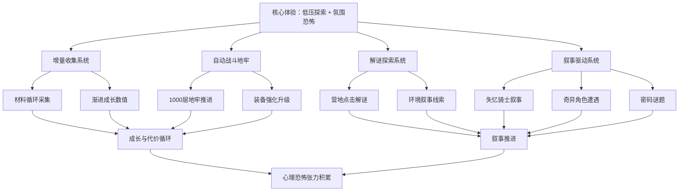

# 《Horripilant》游戏分析

## 🎮 基础信息
- **游戏名**: Horripilant
- **开发商**: Alexandre Declos / Pas Game Studio
- **发行商**: Black Lantern Collective
- **发行年份**: 2026年2月20日
- **平台**: PC（Steam）、Linux / SteamOS
- **类型**: 增量放置 / 地牢爬行 / 解谜 / 心理恐怖
- **游玩时长**: 主线 10-20 小时，100% 约 129 小时
- **游玩状态**: ☐ 游玩中 ☐ 通关 ☐ 白金/全成就 ☐ 放弃
- **个人评分**: ⭐⭐⭐⭐⭐ (1-5星)
- **Steam 评价**: 非常好评（2,366 条，92.7% 好评率）

---

## 🎯 核心体验

### 一句话定位
一款"每个恩赐都有其负担"的增量地牢爬行游戏——用放置挂机的低操作门槛包裹心理恐怖叙事，让玩家在 1000 层地牢里不断重复、适应、生存，同时被阴暗氛围和谜题缓慢吞噬。

### 核心循环

```
[主循环 — 增量成长]
挂机收集材料
  → 自动战斗推进地牢层数
  → 解锁新装备/强化骑士
  → 探索更深层、触发新叙事事件
  → 新的谜题和代价出现
  → 再次挂机循环

[元循环 — 叙事驱动]
失忆骑士在地牢觉醒
  → 遭遇奇异角色，碎片化叙事
  → 解开密码谜题推进故事
  → 直面潜伏的心理恐怖
  → "杀死你的神，变得值得"
```

### 记忆点

1. **惩罚性惊吓机制**：玩家评价"The punish jumpscare is brilliant"——不是单纯吓人，而是和游戏决策绑定
2. **血液与水的混合谜题**：社区热议度最高的解谜节点，逻辑感强但不过度复杂
3. **每个强化都有代价**："every boon has its burden"——强化系统的道德/叙事代价设计
4. **1000 层地牢的数字压迫感**：光是数字本身就制造了叙事张力
5. **氛围与美术的统一性**：手绘像素风与心理恐怖叙事高度匹配，多名玩家专门为原声带发帖

---

## 🧠 系统架构



### 主要系统拆解

#### 增量收集系统
- **设计目标**: 让玩家在无操作压力的状态下保持"在场感"，填补战斗间隙，同时制造持续的数值成长期待
- **核心机制**: 材料自动循环采集，数值渐进解锁新内容；玩家可挂机但会错过叙事触发
- **深度来源**: 资源分配决策——强化哪个方向、接受哪个"有代价的恩赐"；每次强化都是一次叙事选择
- **设计亮点**: 将 Idle 游戏的"被动等待"转化为"叙事酝酿时间"——挂机不是无聊，而是恐怖氛围的培养基

#### 自动战斗地牢系统
- **设计目标**: 提供空间进深感和进度里程碑，让"1000层"变成可感知的叙事距离而非纯数字
- **核心机制**: Auto Battler 模式，战斗自动进行；玩家决策在战斗外（装备选择、强化路线）
- **深度来源**: 装备选择 × 代价机制的组合；不同强化路线影响叙事走向
- **设计亮点**: 用自动战斗解放玩家注意力，让其专注于解谜和叙事，而不是操作执行

#### 解谜探索系统
- **设计目标**: 提供主动参与感，打破纯放置游戏的被动性；用逻辑解谜锚定玩家注意力
- **核心机制**: 营地点击解谜 + 环境叙事线索；谜题与叙事深度绑定（血液与水、Spider Web 等）
- **深度来源**: 谜题答案往往有叙事含义，解开谜题即解开一层叙事真相
- **设计亮点**: 解谜不是游戏中断，而是叙事加速器——每道谜题都是一次"你真的想知道答案吗？"的叩问

#### 心理恐怖叙事系统
- **设计目标**: 用氛围张力代替廉价惊吓，让玩家在"越来越强"的同时感到"越来越不安"
- **核心机制**: 失忆骑士逐渐恢复记忆；遭遇奇异角色触发碎片化叙事；惩罚性惊吓与决策绑定
- **深度来源**: 叙事的不可靠性——玩家不确定骑士的过去是什么，也不确定"变强"是不是好事
- **设计亮点**: 将"KILL YOUR GOD. BECOME WORTHY."作为核心口号，从一开始就埋下叙事悖论

---

## 🎨 体验层分析

### 手感与操控
点击解谜节奏明确，反馈清晰。自动战斗完全解放双手，节奏由玩家对叙事的好奇心驱动而非操作。整体体验偏"被游戏观看"而非"主动游玩"——这是设计意图，不是缺陷。

### 关卡/内容设计
1000 层地牢不是均匀展开的，而是通过叙事事件节点制造层次感。每隔一定层数触发新的角色遭遇或谜题，打破单调的自动战斗节奏。营地解谜区作为独立空间，是玩家主动探索的核心区域。

### 叙事与世界观
环境叙事为主，台词量少但信息密度高。失忆骑士的视角制造自然的信息差——玩家和角色一样不知道发生了什么，共同探索真相。结局指向"你是否值得"的道德拷问，与游戏机制（每个强化都有代价）深度呼应。

### 美术与音乐
手绘像素风在恐怖独立游戏中高度辨识，视觉传达压抑感和年代感。多名玩家主动要求发布原声带，说明音乐是体验的核心支柱之一。低系统需求（400MB）证明风格化选择也是工程上的务实决策。

---

## ⚖️ 设计取舍分析

| 设计决策 | 得到了什么 | 放弃了什么 |
|---------|-----------|-----------|
| 自动战斗 + 放置机制 | 低门槛、宽受众、解放注意力专注叙事 | 战斗技巧感、操作爽感、核心玩法深度 |
| 每个强化都有代价 | 叙事张力、选择重量感、道德模糊性 | 单纯变强的爽快感、无压力的成长体验 |
| 线性流程 | 叙事节奏可控、悬念易维持、体验统一 | 自由探索感、多周目价值、开放世界感 |
| 手绘像素风 | 独特风格辨识度、压低美术成本、强化恐怖氛围 | 视觉震撼感、高还原度的恐怖表现力 |
| 心理恐怖而非Jump Scare | 持续氛围张力、更深层的恐惧体验 | 即时恐吓反应、短期刺激感 |
| 极低系统需求 | 覆盖老设备和 Steam Deck | 视觉特效上限、技术表现力 |
| 主线 10-20 小时 | 节奏紧凑、无注水感 | 超重度闲置玩家的长期留存 |

---

## 💡 值得借鉴的设计

1. **"恩赐即负担"的成长代价机制**: 每次强化/升级都附带叙事或机制代价，让数值成长变成道德选择。在自己的 Roguelike 项目中，可以给每个强化遗物附加一条"代价描述"，让玩家在变强时感到不安而不是单纯爽快。

2. **放置机制作为叙事酝酿空间**: 挂机等待时间不是空洞的，而是叙事氛围的培养基。在游戏中，挂机期间可以触发环境音效变化、UI 细节异常等微妙恐怖信号，让"等待"本身成为体验的一部分。

3. **解谜与叙事深度绑定**: 谜题的答案不只是"通关条件"，而是叙事真相的一部分。在关卡设计中，让解谜的过程等于理解故事的过程——玩家解开谜题时，同时解开一层叙事。

4. **惩罚性惊吓与决策绑定**: 惊吓不是随机触发，而是和玩家的某个选择挂钩——"是你的选择导致了这个后果"。这让惊吓从廉价变为有意义，玩家的恐惧感会更深层。

5. **极低系统需求 + 风格化美术的组合**: 用风格化设计代替技术堆砌，在降低开发成本的同时建立强烈视觉辨识度。对于独立开发者，这是"扬长避短"的最佳实践。

6. **1000 层数字制造叙事压迫感**: 不需要真的做 1000 层不同内容，数字本身就是叙事工具——它传达了"这个地牢的深度远超你的想象"。在自己项目中，用具体的大数字（层数、天数、次数）制造规模感和叙事重量。

---

## ❌ 不足与问题

1. **恐怖感偏弱**: 部分玩家表示"the game isn't scary in the slightest"。心理恐怖的氛围建立很成功，但缺乏真正让玩家感到恐惧的高潮时刻。改进方向：在关键叙事节点设计更强的恐怖事件，而不只是持续的低强度氛围。

2. **控制器冲突问题**: 无法在后台运行的同时使用手柄玩其他游戏，这是技术实现问题。对于放置游戏来说挂机体验很重要，改进方向：修复输入设备独占问题。

3. **超重度闲置玩家留存不足**: 主线 10-20 小时对核心 Idle 玩家来说偏短，他们期待几百小时的内容量。改进方向：增加局外挑战内容或 New Game+ 机制延长寿命。

4. **线性流程限制重复游玩价值**: `Linear` 标签意味着第二周目价值有限，与 Roguelike/Idle 类型玩家的期待有差距。改进方向：增加分支叙事或随机化元素提升复玩性。

---

## 🔗 知识关联

### 与已读书籍的关联

- **游戏编程设计模式**: 自动战斗系统的状态机管理（State Pattern）；增量系统的观察者模式——数值变化自动触发 UI 和叙事事件；解谜系统的命令模式记录玩家操作 | 关联强度: ⭐⭐⭐⭐

- **思考快与慢**: "每个恩赐都有负担"的代价机制利用损失厌恶（Loss Aversion）制造选择张力；心理恐怖的氛围营造本质是持续激活系统1的威胁感知，而不需要真实威胁 | 关联强度: ⭐⭐⭐⭐⭐

- **游戏编程算法与技巧**: 增量系统的数值曲线设计——如何让 1000 层的进度感始终保持适当的成长速度；地牢生成算法与叙事事件的分布设计 | 关联强度: ⭐⭐⭐

- **第一性原理**: 游戏的第一性原理是"让玩家持续感到不安而不失去控制感"——所有设计决策（自动战斗、代价机制、氛围恐怖）都从这个底层原理推导 | 关联强度: ⭐⭐⭐⭐

- **架构整洁之道**: 极低系统需求（400MB）体现了依赖最小化原则——风格化美术不依赖高端硬件，核心体验与技术实现解耦 | 关联强度: ⭐⭐⭐

### 与其他游戏的关联

- **杀戮尖塔2**: 同类对比——都有"每次强化都有代价"的设计哲学，但 STS2 通过牌组污染表达，Horripilant 通过叙事代价表达；STS2 追求认知成长，Horripilant 追求叙事沉浸 | 类型: 设计理念对比

- **Vampire Survivors**: 同类对比——同为放置/自动战斗类型，Vampire Survivors 用视觉爆炸感和数值爽感驱动，Horripilant 用叙事氛围驱动；代表了 Idle 类型的两种极端设计方向 | 类型: 同类对比

- **Darkest Dungeon**: 设计传承——都有"越来越强但越来越不安"的核心体验设计，都用代价机制防止纯粹的数值爆炸；Horripilant 可能受其影响 | 类型: 设计传承

### 对自身项目（Godot 游戏开发）的启发

1. **叙事与机制深度绑定的实现**: 在 Godot 中，每个强化/道具可以挂一个 `NarrativeConsequence` 资源，记录触发条件和叙事文本。强化发生时通过信号广播，叙事系统订阅并在合适时机展示，实现机制与叙事解耦又同步。

2. **放置机制的叙事酝酿**: 用 Godot 的 `Timer` 节点在挂机时段定期触发微妙的环境变化（音效轻微失真、UI 元素细节变化），让"等待"变成恐怖氛围积累，而不是空白时间。

3. **数字即叙事工具**: 在显示进度数字时附加叙事描述（"你已经下降了 847 层……比任何骑士都深"），用文字赋予数字重量感，这在 Godot 的 Label 节点上用简单的字符串拼接就能实现。

---

## 📊 总结

### 最大的收获
理解了"放置/挂机"类型的高阶设计路径：挂机不是懒设计，而是可以成为叙事酝酿空间。当挂机时间被赋予氛围意义时，玩家的"什么都不做"就变成了"在被故事慢慢吞噬"。

### 核心结论

Horripilant 的成功在于找到了 Idle 游戏和叙事恐怖的一个罕见交叉点：**用低操作门槛守住受众，用高叙事密度守住体验深度**。"每个恩赐都有负担"不只是机制设计，而是整款游戏的世界观——它告诉玩家，这里的成长是有代价的，变得更强意味着失去某些东西，而"值得"本身就是一个需要被质疑的概念。

对独立开发者最核心的启示：**类型融合的价值不在于叠加功能，而在于找到两种类型在情感体验上的共鸣点**——Idle 的"被动等待"和心理恐怖的"无处不在的不安"，恰好能相互强化。

---

> 参考来源：Steam 页面、Steam 社区讨论（265 个话题）、玩家评价（2,366 条）
> Steam 链接：https://store.steampowered.com/app/3525970/Horripilant/

**分析创建时间**: 2026-06-17
**最后更新**: 2026-06-17
