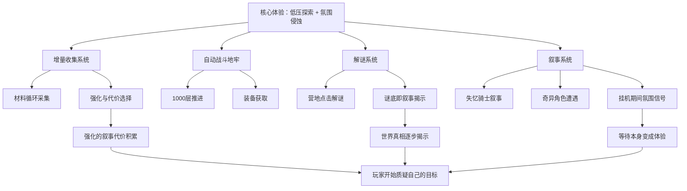

# 《Horripilant》游戏分析

## 🎮 基础信息
- **游戏名**: Horripilant
- **开发商**: Alexandre Declos / Pas Game Studio
- **发行商**: Black Lantern Collective
- **发行年份**: 2026年2月20日
- **平台**: PC（Steam）、Linux / SteamOS
- **类型**: 增量放置 / 地牢爬行 / 解谜 / 心理恐怖
- **游玩时长**: 主线 10-20 小时，100% 约 129 小时
- **游玩状态**: ☐ 游玩中 ☐ 通关 ☐ 白金/全成就 ☐ 放弃
- **个人评分**: ⭐⭐⭐⭐⭐ (1-5星)
- **Steam 评价**: 非常好评（2,366 条，92.7% 好评率）

---

## 🎯 核心体验

### 一句话定位
一款把"挂机等待"变成"被恐怖吞噬"的 Idle 游戏——放置机制不是偷懒的设计，而是蓄意制造的叙事真空，让玩家在无事可做时被氛围慢慢渗透。

### 核心循环

```
[主循环 — 增量成长]
挂机收集材料
  → 自动战斗推进地牢层数
  → 接受强化（承担相应代价）
  → 探索更深层、触发新叙事事件
  → 新的谜题出现，代价升级
  → 再次挂机——但氛围已经不同了

[元循环 — 叙事侵蚀]
玩家以为自己在"成长"
  → 每个强化都带来某种叙事代价
  → 谜题揭示的不是答案，而是更深的问题
  → "KILL YOUR GOD. BECOME WORTHY." 的含义逐渐反转
  → 玩家开始怀疑：变强是不是正确的目标？
```

### 记忆点

1. **第一次接受"有代价的强化"并感到不安** — 不是因为代价很大，而是因为你意识到游戏在认真问"你真的想要吗？"
2. **"The punish jumpscare is brilliant"** — 惊吓和你的某个选择绑定，怪的是你，不是游戏
3. **血液与水的混合谜题** — 谜题本身简单，但解开后的叙事揭示让你后退一步
4. **挂机时突然出现的 UI 异常** — 等待本身变得令人不安
5. **"杀死你的神，变得值得"在通关后的新含义** — 第一次看是口号，通关后看是拷问

---

## 🧠 系统架构



### 主要系统拆解

#### 增量收集与强化代价系统
- **设计目标**: 颠覆 Idle 游戏"强化永远是好事"的默认前提——每次变强都应该让玩家感到轻微不安
- **核心机制**: 材料循环采集支撑成长；但强化不是纯粹的数值提升，而是附带叙事代价或道德模糊性
- **深度来源**: 玩家无法预知代价的边界——这次代价看起来小，下次可能更大；"我还要继续吗？"的问题随着深度增加而变重
- **与 STS2 的关键对比（设计张力）**: STS2 的"代价"（拿牌会污染牌组）是纯机制代价，可以精确计算；Horripilant 的代价是叙事代价，无法量化。前者制造**认知深度**，后者制造**情感不安**。两者都有效，但服务的体验目标完全不同。

#### 解谜系统
- **设计目标**: 提供主动参与感，防止玩家"只是在等数字变大"；同时用解谜的答案作为叙事揭示的媒介
- **核心机制**: 营地点击解谜；谜题逻辑清晰，答案往往有叙事含义而非纯机制意义
- **深度来源**: 谜题不是"通关障碍"而是"叙事加速器"——解题过程等于主动探索世界真相的过程
- **真正的设计洞察**: 解谜游戏通常用谜题制造障碍感，让玩家感到"我需要克服这个才能继续"。Horripilant 反过来——谜题让玩家感到"我主动要求知道答案，而答案让我后悔"。这个设计把通常的被动推进（"游戏逼我看这段剧情"）变成了主动代价（"是我选择解谜的"）。

#### 叙事侵蚀系统（Horripilant 最独特的设计）
- **设计目标**: 让挂机等待时间本身成为恐怖体验的一部分，而不是"游戏空窗期"
- **核心机制**: 挂机期间触发微妙的环境变化（UI 异常、音效失真、数字行为轻微异常）；失忆骑士的记忆碎片在等待中以碎片方式渗入
- **深度来源**: 玩家不确定这些异常是游戏 bug 还是设计意图，这种"不确定性"本身就是恐怖感的来源
- **被忽视的约束**: 这个设计只在"玩家选择挂机而不是主动操作"时生效。如果玩家一直盯着屏幕主动操作，这套叙事侵蚀系统就失效了。这是 Idle 游戏框架和心理恐怖题材的罕见共鸣点——Idle 强迫你不盯着屏幕，恐怖需要你不盯着屏幕。

---

## 🎨 体验层分析

### 手感与操控
零操作压力。玩家的主动行为只有两类：接受/拒绝强化，和主动解谜。这两类行为都带有叙事重量，而不只是机制操作。"被游戏观看"而非"主动游玩"——这是设计意图，也是类型限制。

### 关卡/内容设计
1000 层不是均匀内容，而是叙事节点的分布——每隔一段距离触发新的角色遭遇或谜题，打破挂机节奏。营地是与挂机地牢完全不同节奏的空间，提供了主动探索感，也是叙事揭示的主要场所。

### 叙事与世界观
环境叙事为主，台词量少但信息密度高。失忆骑士的视角制造信息差——玩家和角色共同不知道发生了什么。核心叙事张力："变得值得"究竟是什么意思？值得什么？对谁值得？游戏没有给出直接答案，这种开放性让结局有持续讨论价值。

### 美术与音乐
手绘像素风与心理恐怖叙事高度契合——像素风格本身带有"不完整性"，配合叙事上的信息残缺，形成视觉与叙事的一致性。多名玩家专门发帖请求发布原声带，说明音乐是体验核心支柱，而不只是氛围填充。

---

## ⚖️ 设计取舍分析

| 设计决策 | 被什么约束逼出来的 | 得到了什么 | 真实代价 |
|---------|-----------------|-----------|---------|
| Idle + 心理恐怖的融合 | 两个类型在"不需要操作时"有天然共鸣；小团队无力制作全程高操作的恐怖游戏 | 等待时间变成恐怖体验；独特类型定位 | 核心 Idle 玩家可能期待数值深度；恐怖玩家可能嫌操作太少 |
| 线性流程 | 分支叙事的制作成本远超线性；小团队无力维护多分支状态 | 叙事节奏可控；悬念精确投放 | 重玩价值低；与 Roguelike/Idle 玩家的重玩期待不符 |
| 每个强化都有叙事代价 | 如果强化是纯好事，玩家就不会在接受时犹豫，"代价设计"的情感效果消失 | 强化时刻有道德重量；玩家主动参与叙事 | 叙事代价需要精心设计，随意附加会变成"莫名其妙的惩罚感" |
| 主线 10-20 小时 | 小团队制作上限；叙事型游戏不该注水 | 体验紧凑，没有拖沓感 | 核心 Idle 玩家不满足；100% 成就的 129 小时靠隐藏内容撑，主线太短 |
| 手绘像素风 | 降低美术成本；风格与恐怖题材契合 | 强视觉辨识度；极低系统需求（400MB）扩大受众 | 视觉震撼感上限低；无法通过画面质量吸引某些受众 |

---

## 💡 值得借鉴的设计

1. **让挂机等待本身成为内容的设计思路**: 不要把 Idle 的等待时间当作"玩家不在"处理。在 `slayDemo` 中，当玩家触发"休息"或"等待"状态时，可以让世界继续有轻微的异常事件——NPC 的话语变化、背景音效的轻微偏差，让等待本身携带信息量。**在 Godot 实现**: 用 `IdleStateManager` 在玩家无操作时每隔 N 秒随机触发一个 `AmbientEvent`，这些事件可以是纯叙事的（不影响数值），但让世界感觉活着。

2. **谜题答案 = 叙事代价的设计逻辑**: 解谜不应该只是通关障碍，解谜的答案本身应该"花费"某种叙事资源——也许是揭露让玩家感到不安的真相，也许是消耗某种稀缺信息。在 `slayDemo` 的关卡设计中，解谜可以设计为"主动要求知道某个秘密"，而不只是"找到通过门的方法"。

3. **"被什么约束逼出来的"设计反推思路**: Horripilant 的很多设计（线性、Idle 框架、像素风格）都是被小团队约束逼出来的，但这些约束反而成为了差异化优势。在自己做游戏时，先列出所有约束（时间/预算/人力），再思考哪些约束可以被转化为设计特色，而不是只想着如何绕开约束。

---

## ❌ 不足与问题

1. **叙事代价设计的随意性风险**: "每个强化都有代价"是好原则，但如果代价没有清晰的叙事逻辑，玩家会感到"莫名其妙地被惩罚"而不是"做了有意义的选择"。玩家评价"the game isn't scary in the slightest"可能部分原因在此：如果代价感觉随意，恐惧感就建立不起来。改进方向：每个代价都应该有叙事逻辑——玩家事后能说"我明白为什么这个强化有这个代价"。

2. **Idle 类型玩家和叙事型玩家的交集比预期小**: 主线 10-20 小时对核心 Idle 玩家偏短；叙事碎片化对叙事型玩家体验不连贯。游戏定位在两个类型的交集地带，但两个类型的核心玩家可能都不完全满足。

3. **控制器冲突这种技术问题在放置游戏里格外致命**: Idle 游戏的核心使用场景就是"开着游戏干别的事"，控制器冲突直接破坏了这个使用场景。

---

## 🔗 知识关联

### 与已读书籍的关联——以及与书里观点的张力

- **思考快与慢**: "每个恩赐都有负担"利用损失厌恶制造选择张力——**这里有个有趣的张力**：卡尼曼的损失厌恶描述的是"已经拥有的东西被拿走"的痛苦，但 Horripilant 的代价是"还没发生的未知代价"。玩家的不安来自不确定性，而不是确定的损失。这是书中"模糊损失厌恶"的一个延伸应用——**未知代价比已知代价更能制造焦虑** | 关联强度: ⭐⭐⭐⭐⭐

- **游戏编程设计模式**: 增量系统的观察者模式——数值变化触发叙事事件。**书里的观察者模式关注的是解耦，但 Horripilant 展示了另一个价值：观察者链可以让叙事触发看起来"有机"而非"脚本化"**——玩家到达第 X 层不是因为游戏在等他到那里，而是因为他的行为自然地触发了观察者链。这是观察者模式在叙事设计上的应用，书里没有明确讨论 | 关联强度: ⭐⭐⭐⭐

- **第一性原理**: 游戏的第一性原理是"让玩家持续感到不安而不失去控制感"。**值得批判的是**：这个第一性原理是否真的成立？玩家评价"the game isn't scary"说明部分玩家最终失去了不安感。这可能意味着第一性原理本身正确，但执行没有到达设计要求的强度 | 关联强度: ⭐⭐⭐⭐

### 与其他游戏的关联

- **杀戮尖塔2**: 设计哲学对比——同样有"强化即代价"的概念，但 STS2 的代价是**机制性的、可计算的**（牌组污染、稀缺资源消耗），Horripilant 的代价是**叙事性的、无法量化的**。这揭示了一个设计分叉：机制代价制造认知深度；叙事代价制造情感重量。选哪种取决于你想让玩家思考还是想让玩家感受。

- **Darkest Dungeon**: 设计传承——"越来越强但越来越不安"的核心体验设计。但关键差异：Darkest Dungeon 的不安来自**可见的风险积累**（英雄的压力值、永久死亡）；Horripilant 的不安来自**叙事的不可解释性**。前者让玩家焦虑于已知的将要发生的事，后者让玩家焦虑于不知道发生了什么。

### 对自身项目（slayDemo）的具体启发

1. **IdleStateManager 的实现**: 在 `slayDemo/systems/` 中新建 `IdleStateManager.gd`，检测玩家无操作超过 N 秒后，从 `AmbientEventPool` 随机抽取一个事件执行。事件类型：纯叙事（UI 文字变化）、音效变化、背景细节改变。这不影响游戏数值，只是让世界在玩家不操作时继续"呼吸"。

2. **NarrativeConsequence Resource**: 在 `slayDemo/data/items/` 下，每个道具的 `.tres` 文件中增加 `narrative_consequence: String` 字段——强化发生时展示一行叙事文字。初期可以是简单的文字，不需要完整叙事系统，但建立了"每次强化都有叙事反馈"的基础。

---

## 📊 总结

### 最大的收获
**Idle 游戏的"等待时间"不是空白，而是设计空间。** 大多数 Idle 游戏把等待当作"玩家不在"来处理（数值继续增长，玩家回来收益即可）。Horripilant 把等待当作"玩家的注意力处于松散状态"来利用——这时候才是氛围渗透最有效的时刻。

### 认知转变（第五层洞察）

之前我认为心理恐怖游戏需要全程紧绷的高强度——玩家要一直处于压力状态才能感到恐惧。

Horripilant 改变了这个认知：**最有效的心理恐怖不是持续高压，而是"低压时刻的突然侵入"**。玩家在放松的挂机等待中才最脆弱，这时候一个 UI 异常比正面交战时的任何惊吓都更有穿透力。

这个洞察对 `slayDemo` 的意义是：不需要把游戏设计成全程紧张。可以主动设计"松弛节点"，然后在松弛中植入叙事异常——这比持续的紧张感更有记忆点，也更省设计成本。

### 核心结论

Horripilant 的真正价值是**证明了一个反直觉的设计命题**：心理恐怖 + Idle 放置不是风格上的妥协，而是机制上的共谋。Idle 的低操作压力创造了玩家注意力的松散状态，而松散状态恰好是氛围侵蚀效率最高的时刻。这个设计只在两个类型共存时才成立——任何一方消失，另一方的效果都会打折扣。

---

> 参考来源：Steam 页面、Steam 社区讨论（265 个话题）、玩家评价（2,366 条）

**分析创建时间**: 2026-06-17
**最后更新**: 2026-06-17（依据 rules.md 批判性迭代）
