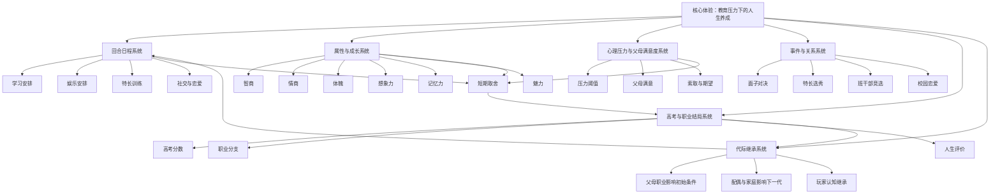

# 《中国式家长》游戏分析

## 🎮 基础信息
- **游戏名**: 中国式家长（Chinese Parents）
- **开发商**: 墨鱼玩游戏 / 墨鱼玩工作室
- **发行商**: 椰岛游戏 / Coconut Island Games；海外移动版信息中可见 Littoral Games 发行记录
- **发行年份**: 2018年9月29日首发 Steam / WeGame；2020年8月20日登陆 Nintendo Switch；2022年有海外 Google Play 移动版记录
- **平台**: PC（Steam、WeGame / WeGameX）、macOS、Nintendo Switch、Android、iOS；九游页面显示安卓/苹果下载入口；TapTap 与豌豆荚搜索页当前未检索到可见条目；微信/抖音小游戏未检索到可靠官方条目
- **类型**: 人生模拟 / 养成 / 独立游戏 / 轻度策略 / 社会讽刺
- **游玩时长**: 单局约 2-4 小时；多周目追求职业、恋爱、特长、女儿线等内容可达 20 小时以上
- **游玩状态**: ☑ 分析研究 ☐ 游玩中 ☐ 通关 ☐ 白金/全成就 ☐ 放弃
- **个人评分**: ⭐⭐⭐⭐（题材洞察与系统表达极强，数值深度和多周目新鲜感存在上限）
- **公开评分 / 评价概况**:
  - Steam：页面显示全语言总评 Very Positive；Steam 购买者评价约 22,996 篇，近期评价约 87% 好评，英文评价约 92% 好评
  - 九游：搜索页可见 8.8 分，类型标为休闲游戏，并显示安卓/苹果下载入口
  - Metacritic：PC 与 Switch 媒体评分因评测数不足显示 tbd；Switch 用户分 8.0 / 10（6 个用户评分）
  - 早期媒体评价：游民星空 6.9，3DMGAME 6.5；评价倾向为题材新鲜、共鸣强，但玩法深度和多周目体验有限

> 信息来源说明：本次检索覆盖 Steam、TapTap、B站、App Store、九游、好游快爆、豌豆荚、Google Play、Nintendo、Metacritic、WeGame、微信/抖音小游戏关键词。Steam、Wikipedia、Nintendo、Metacritic、九游、B站页面可提取有效信息；TapTap 与豌豆荚搜索页未显示匹配条目；App Store 搜索 URL 返回 404；好游快爆返回 403；微信/抖音小游戏未检索到可靠官方页面。

---

## 🎯 核心体验

### 一句话定位
《中国式家长》是一款把“中国孩子从出生到高考”的集体记忆压缩成 48 回合资源管理游戏的现实主义人生模拟：玩家表面上在养成孩子，实际上在体验家庭期待、教育竞争和个人欲望之间无法完全调和的长期拉扯。

### 核心循环

```
[主循环 — 单代成长]
回合开始：年龄增长 / 新阶段解锁
  → 安排学习、娱乐、社交、特长训练
  → 消耗精力 / 压力 / 父母满意度
  → 属性提升或心理状态变化
  → 触发面子对决、选秀、班干部、恋爱等事件
  → 高考 / 职业 / 婚恋结局

[元循环 — 代际继承]
本代结局：职业 + 配偶 + 性格 + 家庭条件
  → 成为下一代父母
  → 下一代获得初始属性、资源、期望差异
  → 玩家用上一代经验优化新一代路径
  → 逐步追求更稀有职业 / 关系 / 成就
```

### 记忆点
1. **第一次发现“娱乐不是浪费，而是压力阀”**：如果只堆学习，孩子会崩；这让“鸡娃最优解”在机制上被直接反驳。
2. **面子对决把家庭攀比做成战斗系统**：最荒诞的是它很像真实社交——父母不是直接比较孩子幸福，而是比较可展示成就。
3. **高考作为单局终局 Boss**：前面所有回合的选择最终汇总成一次标准化评价，既荒诞又准确地模拟了教育系统的压缩逻辑。
4. **通关后孩子变成下一代父母**：玩家以为自己在逃离“中国式家长”，结果下一局自己成了中国式家长。
5. **B站攻略生态集中在清华北大、满分、首富、全职业**：社区自然把人生模拟玩成最优化问题，这恰好强化了游戏想批判的教育功利逻辑。

---

## 🧠 系统架构



### 主要系统拆解

#### 1. 回合日程系统：把人生压缩成可计算的选择
- **设计目标**: 让玩家感受到“时间不可逆”与“什么都想要但精力有限”的成长焦虑。它解决的体验问题不是“如何模拟真实童年”，而是“如何把长期教育压力变成每回合都能感知的决策”。
- **核心机制**: 每个年龄阶段提供有限行动槽，玩家在学习、娱乐、特长、社交等选项中安排计划；不同活动消耗精力、增加属性、改变压力和父母满意度。
- **深度来源**: 单个行动很简单，但行动之间存在长期路径依赖：早期属性偏向会影响后续解锁，压力管理影响持续成长，高考目标反过来决定中前期的资源分配。
- **设计亮点**: 它用“行动槽”而不是开放世界模拟人生，准确抓住了教育题材的第一性原理：孩子的人生首先被时间表支配，而不是被空间探索支配。

#### 2. 属性成长系统：把“全面发展”变成互相竞争的数值池
- **设计目标**: 模拟“家长希望孩子全能，但系统评价会强迫孩子专精”的矛盾。它解决的是玩家对成长方向不清晰的问题：每个属性都在诱惑你，但时间只允许你押注一部分。
- **核心机制**: 智商、情商、体魄、想象力、记忆力、魅力等属性分别支撑学习成绩、职业路线、社交恋爱、特长表现等结果。
- **深度来源**: 不同目标之间并非完全兼容。清华北大路线要求高学业属性，娱乐/恋爱路线需要魅力和情商，特长路线需要特定属性组合。玩家越追求“完美孩子”，越容易被精力和压力系统惩罚。
- **设计亮点**: 属性不是纯战斗数值，而是社会评价维度。它让“人生选择”被转译为 RPG 构筑问题，因此玩家可以复盘、攻略、优化。

#### 3. 压力与父母满意度系统：反直觉的“成长刹车”
- **设计目标**: 反驳“只要多学习就能最优”的直觉，让玩家意识到孩子不是可无限压榨的数值机器。它解决的是养成游戏常见问题：如果成长只看收益，玩家会把所有行动都排成最高收益活动。
- **核心机制**: 学习和高强度活动提升属性但带来压力；娱乐降低压力但牺牲短期成长；父母满意度影响可索取资源、事件态度和叙事反馈。
- **深度来源**: 压力不是简单惩罚，而是一个节奏调节器。玩家必须在“短期冲刺”和“长期可持续”之间找平衡。真正的策略不是永远学习，而是在高收益节点前释放压力。
- **设计亮点**: 最反直觉的决策在这里：**游戏明明批判鸡娃，却仍然允许玩家通过优化鸡娃拿到稀有结局**。这不是逻辑漏洞，而是社会系统的残酷模拟——系统奖励的仍是结果最优者，哪怕过程并不健康。

#### 4. 事件与关系系统：用荒诞小游戏表达社会规训
- **设计目标**: 把抽象的“面子”“攀比”“早恋”“班干部”变成可玩事件，让玩家不只是读到社会压力，而是在规则里被迫参与它。
- **核心机制**:
  - 面子对决：把父母间的孩子比较做成战斗/对抗。
  - 特长选秀：把兴趣培养转译成可展示成就。
  - 班干部竞选：把校园权力和社交能力做成阶段事件。
  - 恋爱线：提供非学业目标，但会与时间和属性培养竞争。
- **深度来源**: 事件系统把数值目标从“高考成绩”扩展到“社会展示价值”。玩家不是只在做学业规划，也在思考哪些成就可以被父母、同学、社会承认。
- **设计亮点**: 面子对决尤其精准：它不是现实主义还原，而是讽刺性抽象。越荒诞，越能暴露规则本质。

#### 5. 高考与职业结局系统：把人生变成一次总验收
- **设计目标**: 给 48 回合选择一个强收束点，让玩家的长期规划获得明确反馈。它解决的是模拟人生类游戏容易松散的问题：没有终局，选择就缺少重量。
- **核心机制**: 高考分数、属性、特长和关系共同导向职业、婚恋和人生评价；存在大量职业结局和稀有路线。
- **深度来源**: 多结局让玩家可以用不同目标重玩，但高考权重又会不断把玩家拉回主流评价体系。
- **设计亮点**: 游戏没有做“完全自由的人生”，而是故意让高考成为压倒性节点。这种限制反而更真实，因为题材要表达的不是“人生有无限可能”，而是“可能性被标准化评价压缩”。

#### 6. 代际继承系统：玩家最终成为自己批判的对象
- **设计目标**: 让“父母—孩子”的关系不只是剧情主题，而成为元循环结构。它解决的是单局结束后的复玩动机问题：下一局不只是重开，而是上一代人生的后果延续。
- **核心机制**: 本代的职业、配偶、家庭状态影响下一代初始条件；玩家积累的攻略知识也成为“认知继承”。
- **深度来源**: 代际继承有两层：系统层的初始属性继承，和玩家层的策略继承。第二层更关键——玩家越懂最优解，越像一个会规划孩子人生的家长。
- **设计亮点**: 这是全游戏最深的主题机制统一：**游戏不是让你旁观中国式家长，而是通过多周目优化把你训练成中国式家长。**

---

## 🎨 体验层分析

### 手感与操控
操控本身轻量，主要是点击、选择、安排计划。它的“手感”不来自即时反馈，而来自规划后的结算反馈：某个属性上涨、压力下降、事件解锁、高考结果变化。对于休闲玩家，这种低操作门槛降低了进入成本；对于硬核策略玩家，深度主要来自数值规划而不是操作技巧。

### 关卡 / 内容设计
游戏没有传统关卡，而是用成长阶段替代关卡。婴幼儿、小学、初中、高中逐步解锁新活动和新压力，形成内容节奏。B站内容生态显示，玩家高频讨论“清华/北大”“750分”“首富”“全职业”“全恋爱剧情”，说明游戏内容的真实消费方式更接近“路线攻略”和“人生构筑”，而不是一次性剧情体验。

### 叙事与世界观
叙事采用现实主义讽刺，而不是宏大剧情。它的厉害之处在于：不需要解释世界观，因为玩家已经生活在这个世界观里。父母期待、补习、攀比、高考、早恋、面子，这些符号本身就是叙事资产。

### 美术与音乐
美术偏轻松、卡通化，降低了现实题材的沉重感。这个取舍很关键：如果画风太写实，游戏会变成压抑的教育批判；卡通风格让玩家可以在笑声中接受讽刺。音乐和音效承担的是“生活喜剧”基调，而不是情绪煽动。

---

## ⚖️ 设计取舍分析

| 设计决策 | 被什么约束逼出来的 | 得到了什么 | 放弃了什么 / 真实代价 |
|---------|-----------------|-----------|----------------------|
| 用 48 回合压缩从出生到高考 | 独立团队内容产能有限；人生模拟如果做开放长线会失控 | 单局节奏清晰；所有选择都有终点；适合多周目复盘 | 人生阶段被高度抽象，很多真实成长细节只能变成事件或数值 |
| 以高考作为最终强验收 | 中国教育题材的文化现实决定高考是最强公共符号 | 玩家立即理解目标重量；主题表达极强；结局反馈集中 | 容易让玩家把游戏玩成应试最优化，削弱“多元人生”的表达 |
| 压力系统限制纯学习堆叠 | 如果没有压力，最优解会退化为全学习；题材也会自我矛盾 | 娱乐、休息、心理状态获得机制意义；鸡娃不再是无脑最优 | 压力一旦数值化，玩家仍会把心理健康优化成工具，而非真正关心孩子 |
| 面子对决等荒诞小游戏 | “面子/攀比”很难用写实系统表达；需要低成本强记忆点 | 抽象社会压力被可视化；传播性强；玩家容易记住 | 讽刺可能被当成纯搞笑，削弱严肃议题；系统深度有限 |
| 多职业结局和多恋爱线 | 多周目需要明确收集目标；社区攻略生态需要可追求对象 | 提供长尾目标；B站攻略/全结局内容有传播基础 | 职业被简化为属性门槛，容易强化“人生=结果标签”的功利视角 |
| 代际继承作为元循环 | 单代人生结束后需要复玩动机；人生题材天然有家庭延续主题 | 主题和机制高度统一；玩家从孩子视角转为家长视角 | 多周目后容易变成刷初始条件和攻略路线，情感冲击递减 |
| 卡通幽默包装沉重议题 | 现实教育压力过重，若写实表达会劝退轻度玩家 | 降低进入门槛；让讽刺更容易传播；适合直播实况 | 可能让真实痛苦被娱乐化，部分玩家会觉得批判不够深入 |
| PC 独立游戏优先，而非一开始做移动端长线运营 | 2018 年独立团队更容易在 Steam / WeGame 验证口碑；买断制更适合讽刺题材 | 保持完整表达，避免被商业化系统稀释；利于口碑传播 | 移动端覆盖与持续运营能力不足，后续平台状态较分散 |

---

## 💡 值得借鉴的设计

1. **把社会议题拆成“可结算资源”**  
   借鉴点不是“做一个教育题材”，而是把抽象社会压力转成可操作变量：压力、父母满意、面子、特长、恋爱好感、高考分数。应用到自己的项目时，可以在 `SocialPressureSystem` 或类似系统中为每个抽象压力建立三件事：来源、可见反馈、结算后果。例如做职场题材时，不要只写“老板压力”，而应拆成 KPI、同事关系、职业声誉、心理负荷四个可结算资源。

2. **让“批判对象”成为玩家优化对象**  
   《中国式家长》最值得学的是它没有只在文本上批判鸡娃，而是让玩家亲手优化鸡娃路线。应用到叙事游戏 / 模拟游戏中，可以设计 `ComplicityLoop`（共谋循环）：玩家为了赢必须使用某种自己道德上未必认同的策略，然后在结算时看到代价。这比 NPC 说教更有力量。

3. **用强公共符号降低理解成本**  
   高考、班干部、早恋、面子都是中国玩家几乎零解释成本的符号。应用到自己项目时，应优先寻找目标用户已经懂的文化对象作为系统名和目标，而不是发明一堆新术语。具体做法：设计前列出“目标玩家 3 秒内能理解的 20 个现实符号”，再从中挑能被系统化的符号。

4. **代际继承不只是数值继承，也可以是视角继承**  
   很多 Roguelite 的元进度只继承数值；《中国式家长》的继承更高级：玩家从孩子变成父母，立场改变。应用到自己的项目中，可以在 `MetaProgressionSystem` 里加入“身份变化”而不仅是“属性加成”。例如一局扮演冒险者，下一局继承为公会管理者，让上一局的角色变成下一局系统的一部分。

5. **事件小游戏服务概念表达，而不是服务玩法炫技**  
   面子对决的系统并不复杂，但概念极强。应用到自己的项目时，小游戏不必追求深度，只要它能把一个抽象关系视觉化、可交互化。例如“舆论压力”可以做成弹幕躲避，“家庭期待”可以做成天平平衡，“债务焦虑”可以做成不断挤压的时间条。

---

## ❌ 不足与问题

1. **游戏批判鸡娃，但最优玩法仍会导向更精细的鸡娃**  
   问题不在于这是否“价值观错误”，而在于它制造了主题张力：玩家明明知道压力系统存在，却仍会为了清华北大路线精确压榨每一回合。改进方向：增加“孩子主观意愿”或“长期人格后果”作为更难被工具化的变量，让非功利选择拥有更不可替代的结局价值。

2. **多周目后新鲜感下降，路线容易攻略化**  
   一旦玩家理解职业属性门槛，游戏从人生模拟转为路线表执行。B站大量“几分钟教你全职业 / 满分 / 首富”视频说明，社区很快把系统拆成最优解。改进方向：增加更强的随机人生事件、不可完全预测的人格倾向，或让某些结局依赖过程中的价值选择而非最终属性。

3. **部分系统讽刺强于玩法深度**  
   面子对决、特长选秀等事件记忆点很强，但长期策略深度有限。改进方向：让这些事件与长期关系网络联动，例如面子对决胜负影响邻里资源、父母期望曲线或孩子自我认同，而不只是单次小游戏。

4. **移动端与多平台信息状态分散**  
   Steam、Switch、九游等能查到有效信息，但 TapTap、豌豆荚搜索页未见条目，App Store 搜索 URL 不稳定，国内 PC 版本曾有下架记录。这种平台状态会影响新玩家获取。改进方向：如果做类似项目，应维护统一官网和平台索引页，避免口碑游戏在多年后出现“找不到正版入口”的问题。

5. **“现实共鸣”对非中国文化玩家的转译成本较高**  
   游戏英文版能获得好评，说明主题有普遍性，但面子、高考、父母期待的细节仍高度本土化。改进方向不是削弱本土性，而是增加注释式叙事和对照事件，让海外玩家理解“为什么这件事重要”。

---

## 🔗 知识关联

### 与已读书籍的关联

- **《思考快与慢》**: 《中国式家长》大量利用系统1的社会直觉：看到“清华北大”“班干部”“面子”时，玩家不需要理性解释就知道它们“重要”。但它也挑战了书中一个常见应用误区：设计不一定要让玩家从系统1进入系统2才算深刻；有时让玩家发现自己正在用系统2优化一个荒诞系统，反而更能产生批判性。玩家攻略满分路线时，其实是在用理性强化社会规训。| 关联强度: ⭐⭐⭐⭐⭐

- **《真需求》**: 游戏抓住的真需求不是“我想体验童年”，而是“我想重新解释自己的成长经历”。它验证了梁宁式“应然 vs 实然”框架：应然上玩家说自己讨厌应试教育，实然上玩家会主动追求高分、名校、首富、全职业。更尖锐的挑战是：真需求不一定是美好的，玩家也可能真实地需要一次“把创伤优化成胜利”的机会。| 关联强度: ⭐⭐⭐⭐⭐

- **《第一性原理》**: 游戏从“中国教育压力的底层结构是什么”出发，推导出时间槽、属性、压力、高考、代际继承，而不是从“模拟人生应该有什么系统”出发。这是第一性原理的正面案例。但它也提醒：如果第一性原理选的是“高考压缩人生”，系统就会自然强化高考中心主义；底层假设决定了游戏价值观的边界。| 关联强度: ⭐⭐⭐⭐

- **《游戏编程设计模式》**: 日程安排可以抽象为 Command 模式（每个行动是可排队、可结算的命令）；事件触发依赖观察者模式（属性变化、年龄阶段、压力阈值触发事件）；职业结局是策略/规则表系统（不同结局实现不同条件判断）。书里强调模式的工程复用，《中国式家长》展示的是：模式也能服务社会模拟，把现实规则拆成可组合的触发器。| 关联强度: ⭐⭐⭐⭐

- **《架构整洁之道》**: 游戏的长期可扩展性依赖“规则层”和“表现层”分离：行动、属性、事件、结局应是数据驱动，UI 只是展示。若新增“女儿版”或新职业，需要通过配置扩展规则，而不是硬改主循环。这验证了整洁架构的开闭原则；但也挑战了“架构越干净越好”的直觉——小团队早期更重要的是快速验证题材共鸣，过度架构化可能拖慢内容迭代。| 关联强度: ⭐⭐⭐

- **《非暴力沟通》**: 游戏中的亲子冲突大多停留在要求、评价和比较，很少进入“感受—需要—请求”的沟通层。它几乎是《非暴力沟通》的反面案例：当家庭语言只剩下成绩、面子和满意度，孩子的内在需要会被系统性遮蔽。这个关联的价值在于指出游戏的缺口：如果续作加入真正的沟通系统，可能从“教育压力模拟”进入“关系修复模拟”。| 关联强度: ⭐⭐⭐⭐

### 与其他游戏的关联

- **《羊了个羊》**: 两者都调用中国玩家的集体情绪锚点。《羊了个羊》调用地域归属和社交攀比，《中国式家长》调用教育经历和家庭压力。前者偏外部传播，后者偏内部共鸣。| 类型: 社会议题机制化对比
- **《小丑牌》**: 两者都会被玩家迅速攻略化。《小丑牌》攻略化后仍有随机乘法组合支撑新鲜感；《中国式家长》攻略化后更容易变成路线表执行。差异说明：构筑游戏若想长期抗攻略，必须让随机性生成“新问题”，而不是只让玩家寻找固定答案。| 类型: 攻略化风险对比
- **《背包乱斗》**: 《背包乱斗》把整理背包这种负担翻转为乐趣；《中国式家长》把安排日程这种压力翻转为玩法。两者都是“负担即乐趣翻转”，但前者是空间负担，后者是社会负担。| 类型: 设计模式同构
- **《模拟人生》**: 《模拟人生》强调开放生活与玩家表达，《中国式家长》强调受约束人生与社会评价。前者是“我想成为谁”，后者是“别人希望我成为谁”。| 类型: 同类反向设计
- **《Papers, Please》**: 都是把制度压力变成重复操作，并让玩家在优化效率时意识到自己正在参与制度。不同的是，《Papers, Please》靠道德困境制造不适，《中国式家长》靠熟悉记忆制造不适。| 类型: 制度共谋设计

### 对自身项目的启发

1. **为项目建立 `SocialPressureSystem`**  
   如果做任何带社会关系的游戏，不要只写剧情台词，而要把社会压力变成资源和阈值：声誉、期待、羞耻、认同、疲劳。每个变量都要有来源、反馈和后果。

2. **在 `MetaProgressionSystem` 中加入身份反转**  
   不要只继承数值。可以让上一局玩家角色在下一局成为导师、父母、敌人、系统规则的一部分。这样元循环不仅是成长，也是立场变化。

3. **设计 `ComplicityLoop` 共谋循环**  
   让玩家为了达成目标，不得不使用某个有问题的系统，然后在结算界面展示代价。例如为了快速成长牺牲 NPC 信任，为了胜利制造社会伤害。这种“我亲手做的”比剧情控诉更有冲击力。

4. **用现实公共符号做低成本入口**  
   先找玩家已经理解的现实符号，再设计系统。比如“绩效考核”“房贷”“相亲”“热搜”“家族群”都可以像“高考/面子”一样成为系统核心。

---

## 📊 总结

### 最大的收获
《中国式家长》最大的价值不是复刻中国童年，而是证明：**现实主义题材最有效的游戏化方式，不是把现实做得更真实，而是把现实中最有压迫感的规则抽象成可操作、可结算、可优化的系统。**

### 核心结论
它的成功来自三个高度统一：题材符号足够公共、系统抽象足够准确、元循环与主题完全同构。高考、面子、压力、代际继承不是贴皮内容，而是互相咬合的规则结构。

### 认知转变（第五层洞察）
我原本以为“批判某种社会系统”的游戏应该避免让玩家在那个系统里获得成就感，否则会削弱批判力度。

《中国式家长》改变了这个认知：**让玩家在被批判的系统里获得成就，反而可能是更强的批判。** 因为当玩家为了清华北大、首富、全职业而精确压榨孩子的时间表时，游戏不需要再说教；玩家已经亲手证明自己理解并接受了那套规则。

这会影响我之后做社会模拟系统的决策：不要急着阻止玩家功利化，应该先允许玩家把系统功利化，再让他看到功利化的代价。真正有力的批判不是“不准你这样玩”，而是“你可以这样玩，而且你会发现自己为什么会这样玩”。

### 强制自我审查记录
1. **最反直觉设计决策**: 游戏批判鸡娃，却允许并奖励玩家优化鸡娃路线；已在压力系统、取舍表和总结中点出。
2. **借鉴点是否落地**: 已对应到 `SocialPressureSystem`、`MetaProgressionSystem`、`ComplicityLoop` 等具体系统。
3. **取舍表是否有约束**: 每行都写明了文化、团队产能、题材、商业化或系统表达约束。
4. **是否挑战书中观点**: 已指出对《思考快与慢》《真需求》《架构整洁之道》的挑战和张力。
5. **是否有认知改变**: 已形成“允许玩家在被批判系统里获得成就，可能强化批判”的第五层洞察。

---

## 参考来源
- Steam 商店页：`https://store.steampowered.com/app/736190/Chinese_Parents/`
- Wikipedia：《中国式家长》词条：`https://zh.wikipedia.org/wiki/中国式家长`
- Nintendo Store：`https://www.nintendo.com/us/store/products/chinese-parents-switch/`
- Metacritic：`https://www.metacritic.com/game/chinese-parents/`
- 九游搜索 / 条目页：`https://www.9game.cn/search/?keyword=中国式家长`
- B站搜索：《中国式家长 评测 / 攻略 / 实况》结果页：`https://search.bilibili.com/all?keyword=中国式家长%20评测`
- TapTap 搜索页：`https://www.taptap.cn/search/中国式家长`（本次未检索到匹配条目）
- 豌豆荚搜索页：`https://www.wandoujia.com/search?key=中国式家长`（本次未检索到匹配应用）

**分析创建时间**: 2026-07-09
**最后更新**: 2026-07-09
