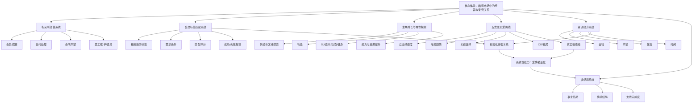

# 《中国式相亲》游戏分析

## 🎮 基础信息
- **游戏名**: 中国式相亲（Matchmaking Inc.）
- **开发商**: Wave Games
- **发行商**: Lightning Games、Wave Games
- **发行年份**: 2025年1月20日
- **平台**: PC（Steam：Windows、macOS、SteamOS + Linux）；九游搜索页显示《中国式相亲》《中国式相亲2》相关休闲游戏条目，但未提供可验证评分；TapTap、豌豆荚未检索到匹配游戏条目；App Store 搜索 URL 返回 404；好游快爆返回 403；微信/抖音小游戏未检索到可靠官方条目
- **类型**: 恋爱模拟 / 模拟经营 / 休闲 / 独立 / RPG / 时间管理 / 卡牌式标签匹配 / 多结局
- **游玩时长**: 主线通关约 8-15 小时；全女主、全 CG、全结局、全支线收集可达 20 小时以上
- **游玩状态**: ☑ 分析研究 ☐ 游玩中 ☐ 通关 ☐ 白金/全成就 ☐ 放弃
- **个人评分**: ⭐⭐⭐⭐（题材入口精准、机制融合有记忆点，但讽刺深度与系统长期深度存在割裂）
- **公开评分 / 评价概况**:
  - Steam：最近评测“特别好评”，130 篇中 94% 好评；全部评测“特别好评”，5,622 篇中 87% 好评；简中评测 5,438 篇中 87% 好评
  - B站：实况与全结局内容热度高，徐大虾咯相关实况播放量达到百万级；评测标题中存在“未必是你的菜”“资本的爱欲殖民”“值不值得入手”等争议性讨论
  - 九游：搜索页可见《中国式相亲2》《中国式相亲》条目，类型均为休闲游戏，但未见可靠评分

> 信息来源说明：本次检索覆盖 Steam、TapTap、B站、App Store、九游、好游快爆、豌豆荚、微信/抖音小游戏、英文名 Matchmaking Inc.。Steam 简体中文商店页、B站搜索页、九游搜索页可提取有效信息；SteamDB 返回 403；TapTap、豌豆荚未检索到匹配条目；App Store 返回 404；好游快爆返回 403。

---

## 🎯 核心体验

### 一句话定位
《中国式相亲》是一款把“婚恋市场”做成“相亲所经营 + 标签匹配 + 多女主恋爱路线”的现实题材模拟游戏：玩家表面上在撮合别人和经营会所，实际上在体验亲密关系如何被标签、资产、时间管理和社会期待重新编码。

### 核心循环

```

[主循环 — 相亲所经营]
招募会员 / 获取委托
  → 阅读成员标签、需求、条件
  → 匹配合适对象 / 使用助手和道具
  → 获得金钱、声望、资源
  → 升级会所、扩展业务、解锁城市区域
  → 处理更复杂的相亲需求

[个人成长循环]
探索鹊桥市 / 休闲活动
  → 钓鱼、打碟、读书、饮酒、健身等提升能力或资源
  → 与五位女主推进关系
  → 选择对话和行动路线
  → 解锁支线、CG、结局

[元目标循环]
经营效率提升
  → 钱与声望增加
  → 可处理更高价值会员
  → 与女主/支线/城市活动互相解锁
  → 追求全女主、全结局、全 CG、全成就
```

### 记忆点
1. **“相亲简历”最多 20 个标签**：亲密关系被压缩成可展示、可筛选、可交易的标签集，荒诞但现实。
2. **玩家既是红娘又是被相亲者**：你一边为他人做匹配，一边把自己放进同一套婚恋评价系统里。
3. **刷钱卡组 / 永动机攻略成为社区热点**：玩家把婚恋经营迅速拆成资源效率问题，反而暴露了游戏系统最真实的一面——亲密关系被经营化后，玩家自然会追求效率最大化。
4. **五位女主路线与相亲所经营并行**：私人情感线和商业撮合线互相嵌套，构成“我在经营爱情，也在被爱情经营”的双重体验。
5. **B站讨论呈现强争议**：有百万级娱乐实况，也有“资本的爱欲殖民”等批判性解读，说明游戏同时触发了轻喜剧消费和现实议题讨论。

---

## 🧠 系统架构



### 主要系统拆解

#### 1. 相亲所经营系统：把“关系撮合”做成业务流水线
- **设计目标**: 让玩家快速理解“相亲不是单纯恋爱，而是一门围绕条件、效率和口碑运转的服务业”。它解决的体验问题是：如果只做恋爱剧情，题材会退化为普通 Galgame；加入相亲所经营后，游戏才拥有“中国式相亲”的社会结构。
- **核心机制**: 玩家接手濒临破产的相亲会所，招募会员、处理委托、匹配对象，通过成功撮合获得金钱、声望和新资源，再用资源解锁更高价值业务。
- **深度来源**: 经营层让玩家不只关心“我喜欢谁”，还要关心“市场需要什么”“会员条件是否匹配”“声望是否足以支撑更高层级业务”。情感被放入服务业框架后，选择自然变成效率问题。
- **设计亮点**: 它把婚恋市场的冷冰冰逻辑交给玩家亲手执行——不是 NPC 说“大家都很现实”，而是玩家自己开始按标签和收益筛选人。

#### 2. 标签匹配系统：把亲密关系压缩成可计算条件
- **设计目标**: 将现实相亲中的“房、车、收入、性格、兴趣、年龄、家庭背景”等条件抽象成可读、可比较、可组合的标签。它解决的是婚恋题材难以机制化的问题：爱情很难计算，但相亲市场本来就在计算。
- **核心机制**: Steam 页面明确提到玩家可定制 “blind date resume”，最多使用 20 个标签描述自己和恋爱诉求；会员匹配则围绕标签、需求与条件展开。
- **深度来源**: 标签数量限制制造表达取舍：你不能把所有优点都写上去，必须选择最能提高匹配效率的身份标签。这个机制把“自我呈现”本身做成策略。
- **设计亮点**: 最反直觉之处在这里：**游戏要批判标签化婚恋，却把标签化做成最核心、最清晰、最好玩的系统。** 这不是失败，而是它最锋利的表达——当标签系统足够好用，玩家才会理解为什么现实中的人也会依赖标签。

#### 3. 主角成长与城市探索系统：给经营系统加入生活感
- **设计目标**: 避免游戏完全变成表格匹配器，让玩家在经营之外获得“生活在鹊桥市”的轻度模拟体验。它解决的是纯经营玩法容易冷冰冰的问题。
- **核心机制**: 城市探索、钓鱼、打碟、读书、喝酒、健身等休闲活动提供能力提升、资源获取或剧情触发。
- **深度来源**: 生活活动把主角从“经营者”拉回“生活者”。玩家不是只在撮合别人，也在经营自己的能力、社交和情感资本。
- **设计亮点**: 休闲活动看似填充内容，实质上承担节奏调节：在高密度匹配和剧情推进之间提供低压缓冲，类似《中国式家长》中娱乐活动作为压力阀。

#### 4. 五女主恋爱路线：私人情感与商业系统的互相污染
- **设计目标**: 给玩家提供情感投射对象，让“相亲所经营”不只是服务他人的业务，也反向照见主角自己的亲密关系选择。
- **核心机制**: 五位女主各自有关系线、对话选择、好感推进、CG 与多结局。玩家在经营相亲机构同时推进个人情感路线。
- **深度来源**: 经营线强调条件匹配，恋爱线强调个体关系。两者并行时会产生张力：当玩家习惯用标签看待会员，是否也会用同样方式看待女主？
- **设计亮点**: 游戏没有完全把恋爱线和经营线隔离，而是让玩家在同一世界中反复切换“市场视角”和“亲密视角”。这个切换本身就是题材价值。

#### 5. 资源经济与刷钱策略：玩家把情感系统攻略化
- **设计目标**: 给经营循环稳定的成长反馈，驱动玩家持续扩展业务和追求全内容。
- **核心机制**: 金钱、声望、属性、助手/道具与时间共同构成资源系统。B站攻略中出现“无限永动机刷钱卡组”“金钱/声望/好感度/属性999”等内容，说明玩家社区已经形成效率化玩法。
- **深度来源**: 当玩家能把经营系统拆成高效循环，游戏从轻度恋爱模拟转向资源优化游戏。高手和新手差距不在剧情理解，而在能否识别收益链条。
- **设计亮点 / 问题**: 刷钱卡组的出现一方面证明系统有可研究空间，另一方面也暴露经济系统可能被少数套路压扁。对这类游戏来说，“可攻略”是传播资产，但“过早被攻略透”会损伤长尾体验。

#### 6. 多结局系统：把恋爱消费转化为收集目标
- **设计目标**: 支撑多周目和视频传播，让玩家有全女主、全 CG、全支线、全结局的明确目标。
- **核心机制**: 不同女主路线、关键选择、支线完成度、经营状态共同导向不同结局。Steam 页面显示有 66 个成就，B站也存在全流程、全女主、全结局攻略。
- **深度来源**: 多结局把“情感选择”转成“内容收集”。这对玩家留存有效，但也会让恋爱体验变得工具化。
- **设计亮点**: 它非常适合视频平台传播：观众可以不亲自玩，也愿意看“强行四人领证会怎样”“全结局收录”这类高概念结果。

---

## 🎨 体验层分析

### 手感与操控
《中国式相亲》的手感主要来自轻量点击、标签阅读、匹配反馈和资源增长，不依赖即时操作。它的“爽点”是低压但高反馈：成功匹配、收入增加、声望提升、女主剧情推进、CG 解锁。对休闲用户友好，但对追求深度经营或复杂策略的玩家，后期可能显得操作和决策粒度偏轻。

### 关卡 / 内容设计
游戏更像“城市区域 + 经营阶段 + 女主路线”的内容结构。B站搜索结果显示，玩家消费重点集中在全女主、全 CG、全结局、刷钱卡组、支线位置、属性好感度等。这说明内容设计的实际落点不是“单线剧情沉浸”，而是“可拆解、可攻略、可做视频标题的路线型内容”。

### 叙事与世界观
鹊桥市、相亲会所、二舅、店员、五位女主构成轻喜剧都市框架。它不是严肃社会纪实，而是用夸张和童话化包装现实婚恋焦虑。B站评测标题“看似讽刺实则童话”很准确：游戏借用了现实议题的壳，但整体体验仍偏向轻松恋爱幻想。

### 美术与音乐
美术风格服务于“都市恋爱轻喜剧”，重点是角色辨识度和场景生活感。它没有走强写实路线，因此降低了相亲题材的尴尬和沉重。音乐与演出主要承担情绪铺垫，而不是系统表达核心。

---

## ⚖️ 设计取舍分析

| 设计决策 | 被什么约束逼出来的 | 得到了什么 | 放弃了什么 / 真实代价 |
|---------|-----------------|-----------|----------------------|
| 用相亲所经营包装恋爱模拟 | 单纯 Galgame 在国产市场差异化不足；“中国式相亲”需要社会结构承载 | 题材辨识度强；经营玩法提供持续反馈；恋爱线与社会议题结合 | 经营和恋爱可能互相稀释，玩家既不满足深经营，也不满足深恋爱 |
| 将婚恋条件做成标签匹配 | 现实相亲本就高度标签化；系统需要可计算对象 | 低学习成本；现实讽刺精准；玩家容易产生“我懂这个规则”的快感 | 亲密关系被简化为标签，可能削弱人物真实复杂性 |
| 最多 20 个标签定制相亲简历 | 如果标签无限，表达没有取舍；如果太少，玩家无法表达自我 | 自我呈现变成策略；每个标签都有机会成本 | 玩家可能只选最高收益标签，最终又回到数值最优解 |
| 五女主路线 + 经营并行 | 需要同时吸引恋爱模拟玩家和经营玩家；视频传播需要角色线 | 提供情感投射和收集动力；适合全结局内容传播 | 女主可能被内容消费化，路线推进服务收集而非关系理解 |
| 轻喜剧/童话化现实议题 | 相亲、婚恋焦虑过于沉重，写实会限制受众 | 降低尴尬和压力；适合直播实况；大众接受度高 | 社会批判力度被稀释，容易被批评“看似讽刺实则童话” |
| 资源经济允许刷钱卡组 | 经营游戏需要可研究空间；玩家需要效率成长路径 | 社区攻略传播强；高手有优化乐趣；短视频标题好做 | 经济系统可能被少数套路击穿，后期内容被效率玩法压扁 |
| PC Steam 买断制优先 | 题材与完整叙事更适合买断；避免移动端数值付费污染恋爱表达 | 保持体验完整性；Steam 简中用户集中，口碑传播强 | 移动端覆盖不足；TapTap/豌豆荚等平台存在不可见或不稳定状态 |
| 以“相亲”而非“自由恋爱”为主题 | 中国玩家对相亲有强公共认知；比泛恋爱更有社会讨论度 | 3 秒理解冲突；天然带家庭、资产、年龄、条件议题 | 题材文化边界强，海外用户需要额外语境；也容易引发现实争议 |

---

## 💡 值得借鉴的设计

1. **把关系系统做成“标签 + 需求 + 匹配反馈”的三段结构**  
   可落地到自己的 `RelationshipMatchingSystem`：每个角色有 `tags`、`needs`、`deal_breakers` 三组数据，匹配时不是简单好感度加减，而是计算“被看见的标签是否满足对方真实需求”。这适用于恋爱、招募、队友羁绊、NPC 社交等系统。

2. **让玩家在“服务别人”和“审视自己”之间切换**  
   《中国式相亲》的高明处在于：玩家先作为红娘评价别人，再作为主角被同一套规则评价。可在项目中设计 `MirrorRoleLoop`：玩家先用某套规则管理 NPC，随后自己进入同一规则，体验规则反噬。例如先审核别人简历，后面自己的简历被系统筛选。

3. **用公共现实符号做系统入口**  
   “相亲简历”“红娘”“会所”“声望”“条件匹配”几乎无需教程。做现实题材时，应先列出目标用户熟悉的制度化对象，再把它系统化。比如职场游戏可以用 OKR、绩效面谈、背调；校园游戏可以用社团招新、评奖评优、家长会。

4. **将收集目标外化为视频友好的问题**  
   B站上“强行与四个人领证会怎么样”“全女主全 CG”“无限永动机刷钱卡组”说明，内容传播点来自清晰可提问的系统边界。可在 `AchievementDesign` 中主动设计“如果玩家违反常识会怎样”的边界结果，让攻略和整活自然产生。

5. **用轻喜剧包装沉重现实，但保留机制上的尖刺**  
   美术和剧情可以轻松，但核心系统必须保留现实问题的锋利面：标签化、资产化、效率化、声望化。可落地为 `SocialFrictionVariables`：即使剧情甜，也让系统持续显示关系被现实变量影响。

---

## ❌ 不足与问题

1. **讽刺表达与童话恋爱之间存在张力**  
   游戏想讨论婚恋市场，但五女主路线和轻喜剧包装会把玩家拉回恋爱幻想。改进方向：让女主路线更直接地回应相亲所经营逻辑，例如某个关键剧情中，女主拒绝被玩家用标签理解，迫使玩家放弃最优匹配思维。

2. **标签系统容易从“批判对象”变成“爽感来源”**  
   当标签匹配足够高效，玩家会享受筛选和优化，而不再反思标签化问题。这与《中国式家长》类似：批判鸡娃，但玩家会优化鸡娃。改进方向：增加标签误判事件，让标签无法完全解释真实需求，使玩家意识到简历不是人本身。

3. **经济系统存在被套路压扁的风险**  
   “无限永动机刷钱卡组”等攻略说明系统存在强效率路径。改进方向：引入动态市场需求、会员偏好变化、声望风险等机制，让同一刷钱套路随阶段失效。

4. **多女主与全结局收集可能弱化情感重量**  
   当玩家追求全 CG、全结局时，女主路线容易变成内容清单。改进方向：对关键路线选择加入不可完全回收的后果，让“全收集”与“认真选择”形成张力。

5. **多平台可见性不稳定**  
   Steam 信息完整，但 TapTap、豌豆荚未显示条目，App Store / 好游快爆抓取失败，九游信息有限。对于国产现实题材游戏，长期入口维护会影响新玩家获取。改进方向：维护统一官网和平台跳转页，避免平台搜索失效导致口碑无法转化。

---

## 🔗 知识关联

### 与已读书籍的关联

- **《思考快与慢》**: 标签匹配系统利用系统1的快速判断：收入、年龄、职业、兴趣、形象标签会立即触发“合适/不合适”的直觉判断；但游戏也挑战了“慢思考能纠偏快思考”的乐观用法——玩家的系统2往往不是用来反思标签化，而是用来更高效地优化标签匹配。| 关联强度: ⭐⭐⭐⭐⭐

- **《真需求》**: 游戏表层需求是“谈恋爱/开相亲所”，真实需求是“在安全的游戏空间里处理婚恋市场焦虑”。它验证了“用户说自己要爱情故事，实际可能需要的是对现实婚恋规则的掌控感”。同时也挑战梁宁框架：真需求不总是被满足后变得更自由，有时会被系统进一步商品化。| 关联强度: ⭐⭐⭐⭐⭐

- **《非暴力沟通》**: 游戏中的相亲简历和标签匹配几乎是非暴力沟通的反面：它先问条件和标签，而不是感受、需要与请求。这个矛盾很有价值——如果一个恋爱游戏只靠标签匹配推进关系，它就展示了亲密关系如何被工具化。续作或同类项目可以加入“需求表达”系统，挑战标签匹配的充分性。| 关联强度: ⭐⭐⭐⭐⭐

- **《爱的博弈》**: 五女主路线和相亲经营都涉及亲密关系中的承诺、信任、误解与修复。不同于书中强调长期关系维护，游戏更强调进入关系前的筛选和选择，这构成张力：现实婚恋的难点不只在“找到匹配对象”，更在“匹配之后如何共同生活”。| 关联强度: ⭐⭐⭐⭐

- **《幸福的婚姻》**: 游戏的相亲系统天然偏重“选择正确对象”，而《幸福的婚姻》更关注“如何经营关系”。这是一组重要反差：游戏把婚恋前置为匹配问题，而婚姻研究往往把幸福看作长期互动质量。该游戏如果要深化，可以从“匹配成功”走向“关系维护”。| 关联强度: ⭐⭐⭐⭐

- **《游戏编程设计模式》**: 标签匹配可实现为策略模式/规则引擎；每次会员资料变化、声望变化、女主好感变化可用观察者模式触发事件；玩家行动是命令模式。这里的重点不是模式本身，而是模式如何把社会条件拆成可组合规则。| 关联强度: ⭐⭐⭐⭐

- **《架构整洁之道》**: 相亲匹配、经济系统、剧情事件应保持依赖倒置：剧情层不应硬编码具体标签算法，而应依赖 `IMatchingRule`、`IRequirement`、`IConsequence` 等接口。否则后续新增女主、会员类型、相亲条件会迅速导致规则代码膨胀。| 关联强度: ⭐⭐⭐

### 与其他游戏的关联

- **《中国式家长》**: 两者都是“中国式现实压力”的系统化表达。家长把教育竞争做成时间表优化；相亲把婚恋市场做成标签匹配和经营优化。共同点是：游戏批判某个社会系统，却又让玩家在系统内追求最优解。| 类型: 设计传承 / 同题材扩展
- **《羊了个羊》**: 羊了个羊把社交攀比外化为地域排行榜，中国式相亲把社交评价内化为相亲标签。前者是集体身份压力，后者是个体市场价值压力。| 类型: 社会压力机制化对比
- **《小丑牌》**: 两者都有“可攻略化”的快感。小丑牌通过随机 Joker 维持长期变化；中国式相亲如果固定收益路径过强，刷钱卡组会压扁经营深度。| 类型: 攻略化风险对比
- **《中国式家长》与《Papers, Please》对照**: Papers, Please 让玩家执行制度审查，中国式相亲让玩家执行婚恋筛选。两者都通过“让玩家成为制度的一部分”产生共谋感，只是前者更冷峻，后者更轻喜剧。| 类型: 制度共谋设计

### 对自身项目的启发

1. **实现 `RelationshipMatchingSystem`**  
   数据结构包含：`ActorProfile.tags`、`ActorNeeds.required_tags`、`ActorNeeds.reject_tags`、`HiddenNeeds`、`MatchingScore`。关键是加入“隐藏需求”，避免标签完全决定关系。

2. **设计 `MirrorRoleLoop`**  
   先让玩家用标签评价 NPC，再让玩家自己的角色被同样标签评价。这个反噬能制造认知冲击，比单纯说教更有效。

3. **设计 `TagMisreadEvent`**  
   当玩家连续依赖标签成功匹配后，触发一次“标签看似匹配但真实需求冲突”的事件，迫使玩家理解标签不是人本身。

4. **为现实题材系统保留“机制尖刺”**  
   即使剧情轻松，也要保留一个让玩家不舒服的规则：声望压力、条件筛选、机会成本、不可逆选择。否则现实题材会退化成普通轻喜剧。

---

## 📊 总结

### 最大的收获
《中国式相亲》证明了：**现实婚恋题材的游戏化关键，不是写更多恋爱剧情，而是把婚恋市场中的“条件筛选、身份展示、资源交换、效率焦虑”转译成系统。** 只有当玩家亲手使用标签匹配别人时，相亲题材才从剧情背景变成机制体验。

### 核心结论
它的核心价值在于把“相亲”从尴尬社交场景改造成可经营、可优化、可传播的游戏循环。成功点是题材入口强、标签匹配直觉清晰、角色路线适合视频传播；问题是轻喜剧包装和恋爱幻想会削弱现实讽刺，经济系统也有被效率套路击穿的风险。

### 认知转变（第五层洞察）
我原本以为，恋爱游戏的核心应该是“让角色更像真实的人”，系统越少、情感越自然越好。

《中国式相亲》改变了这个认知：**在现实婚恋题材中，人物被系统化、标签化、条件化本身就是主题的一部分。** 如果把所有标签和资源压力都拿掉，游戏也许会更浪漫，但反而不再是“中国式相亲”。

这会影响我之后设计关系系统的判断：不是所有关系游戏都应该追求“去数值化”。当题材本身讨论的是制度化关系时，数值、标签和匹配算法不是破坏沉浸的 UI，而是主题表达的核心媒介。关键在于：系统必须在让玩家享受优化之后，再制造一次“优化并不等于理解”的反噬。

### 强制自我审查记录
1. **最反直觉设计决策**: 游戏批判标签化婚恋，却把标签化匹配做成最核心、最好用的系统；已在标签匹配系统、取舍表和总结中点出。
2. **借鉴点是否落地**: 已对应到 `RelationshipMatchingSystem`、`MirrorRoleLoop`、`TagMisreadEvent`、`SocialFrictionVariables` 等具体系统。
3. **取舍表是否有约束**: 每行都写明题材、市场、受众、商业平台或系统表达约束。
4. **是否挑战书中观点**: 已指出对《思考快与慢》《真需求》《非暴力沟通》《幸福的婚姻》的挑战和张力。
5. **是否有认知改变**: 已形成“制度化关系题材中，标签和数值可以是主题媒介而非沉浸破坏者”的第五层洞察。

---

## 参考来源
- Steam 商店页：`https://store.steampowered.com/app/2103130/Matchmaking_Inc/`
- Steam 简体中文商店页：`https://store.steampowered.com/app/2103130/Matchmaking_Inc/?l=schinese`
- B站搜索：《中国式相亲 评测》结果页：`https://search.bilibili.com/all?keyword=中国式相亲%20评测`
- TapTap 搜索页：`https://www.taptap.cn/search/中国式相亲`（本次未检索到匹配条目）
- 九游搜索页：`https://www.9game.cn/search/?keyword=中国式相亲`
- 豌豆荚搜索页：`https://www.wandoujia.com/search?key=中国式相亲`（本次未检索到精确游戏条目）
- Steam 搜索页：中国式相亲 / Chinese Dating / 中国式相亲2 等关键词

**分析创建时间**: 2026-07-09
**最后更新**: 2026-07-09
