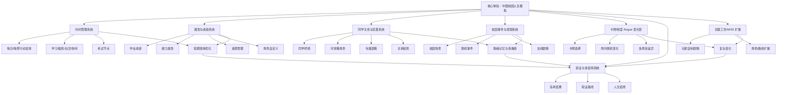

# 《学生时代》游戏分析

## 🎮 基础信息
- **游戏名**: 学生时代（School Days）
- **开发商**: 白雨工作室
- **发行商**: 白雨工作室
- **发行年份**: 2026年1月28日正式发行；2025年1月29日 Steam 抢先体验
- **平台**: PC（Steam，Windows 10+）；九游搜索页显示安卓/苹果下载入口；TapTap、豌豆荚未检索到匹配条目；App Store 搜索 URL 返回 404；好游快爆返回 403；微信/抖音小游戏未检索到可靠官方条目
- **类型**: 校园人生模拟 / 生活模拟 / 恋爱模拟 / 时间管理 / 资源管理 / 视觉小说 / 互动小说 / 轻度 Rogue / 卡牌 / 多结局
- **游玩时长**: 单周目约 8-15 小时；全职业、全结局、全剧情、多周目 DLC / MOD 内容可达 30 小时以上
- **游玩状态**: ☑ 分析研究 ☐ 游玩中 ☐ 通关 ☐ 白金/全成就 ☐ 放弃
- **个人评分**: ⭐⭐⭐⭐（校园人生模拟的系统化表达扎实，职业/恋爱/高考目标清晰，但题材与《中国式家长》高度邻近，差异化压力较大）
- **公开评分 / 评价概况**:
  - Steam：所有语言总评“多半好评 / Mostly Positive”，5,821 篇中 77% 好评；近 30 天“好评如潮 / Overwhelmingly Positive”，131 篇中 96% 好评；简体中文评测 5,602 篇中 76% 好评
  - Steam 原声带 DLC：`学生时代 - 原声带`，App ID 4107630，35 条评测中 97% 好评，收录 25 首 BGM
  - B站：有全职业全结局全剧情流程、正式版评测、全音频鉴赏、MOD / DLC 多周目流程等内容；搜索结果显示社区消费重点集中在高考、职业结局、可攻略角色、多周目、MOD
  - 九游：搜索页可见《学生时代》条目，类型为休闲游戏，显示安卓下载、苹果下载入口，但未显示评分

> 信息来源说明：本次检索覆盖 Steam、TapTap、B站、App Store、九游、好游快爆、豌豆荚、微信/抖音小游戏、英文名 School Days / Student Era 等关键词。Steam 商店页、Steam 简体中文页、Steam 原声带页、B站搜索页、九游搜索页可提取有效信息；SteamDB 返回 403；TapTap 和豌豆荚未检索到匹配条目；App Store 返回 404；好游快爆返回 403。

---

## 🎯 核心体验

### 一句话定位
《学生时代》是一款把“中国校园青春”做成时间管理、关系养成、职业结局和高考压力交织的人生模拟游戏：玩家不是单纯回忆青春，而是在有限学期中反复权衡学习、社交、恋爱、能力成长和未来路线。

### 核心循环

```

[主循环 — 校园日程]
进入新阶段 / 新学期
  → 安排学习、锻炼、社交、探索、休闲活动
  → 消耗时间与资源，提升属性、关系、成绩
  → 触发同学剧情、恋爱事件、随机校园事件
  → 解锁职业路线、结局条件、支线内容
  → 面对考试 / 高考 / 人生分岔

[复玩循环 — 多结局追求]
本周目形成职业 / 关系 / 剧情结局
  → 玩家获得路线经验和机制理解
  → 下一周目尝试更优时间分配、不同攻略对象、不同职业目标
  → 解锁全职业、全结局、全剧情、MOD / DLC 内容
```

### 记忆点
1. **“考清北还是当魔丸？”式目标冲突**：B站评测标题本身就说明游戏的目标不是单一学霸路线，而是把校园人生分裂成多个荒诞但可追求的终点。
2. **全职业 / 全结局 / 全剧情流程成为社区主内容**：玩家消费重点不是单次青春故事，而是把青春拆成可收集、可攻略、可路线优化的人生分支。
3. **角色音频和可攻略角色被单独鉴赏**：说明角色陪伴感是系统之外的重要情绪资产，校园模拟需要“同学真实存在”的氛围。
4. **创意工坊和 MOD 生态**：Steam 页面显示支持创意工坊，B站也有 MOD 实况和多周目 DLC 内容，说明游戏把“青春回忆”开放给玩家再创作。
5. **近期评价显著高于总评**：总评 77% 好评而近期 96% 好评，暗示正式版或后续更新显著改善了早期体验。

---

## 🧠 系统架构



### 主要系统拆解

#### 1. 时间管理系统：把校园生活压缩成行动槽选择
- **设计目标**: 让玩家感受到“学生时代的自由其实很有限”：你以为青春有无限可能，但每天、每周、每学期都被课程、考试、社交和体力占满。它解决的体验问题是：校园题材如果没有时间约束，很容易退化成无压力的恋爱视觉小说。
- **核心机制**: 玩家围绕学习、锻炼、社交、探索、休闲等活动安排时间，不同行动带来成绩、属性、关系或资源变化，并影响后续事件与结局。
- **深度来源**: 每次行动都有机会成本。学习提高考试与职业路线，社交推进角色关系，休闲和探索触发支线，锻炼或能力训练支撑特殊路线。玩家不可能一次周目全拿，只能选择一个“青春版本”。
- **设计亮点**: 最反直觉的设计在这里：**游戏卖的是怀旧和青春自由感，但核心机制却是时间稀缺和选择不可兼得。** 这并不矛盾，因为真正的学生时代记忆，恰恰来自“没来得及做完的事”。

#### 2. 属性与成绩系统：让“未来”提前压迫当下
- **设计目标**: 用可见数值把高考、职业和人生路线提前投射到每个日常选择中。它解决的是校园日常容易松散的问题：如果没有长期目标，玩家只是在看事件；有了成绩与职业路线，日常选择才有重量。
- **核心机制**: 学业成绩、能力属性、资源状态、角色自定义共同影响考试、高考、职业结局与剧情分支。Steam 页面标签中明确包含时间管理、资源管理、角色自定义、多结局。
- **深度来源**: 属性系统把青春变成构筑：玩家不是简单“做自己”，而是在为某个未来版本的自己积累条件。不同职业和结局要求不同属性组合，形成多周目路线规划。
- **设计亮点**: 与《中国式家长》相比，《学生时代》更强调“同学共同成长”和“朋友未来也受选择影响”。这让成长不只是主角单点优化，而是关系网络中的共同变化。

#### 3. 同学关系与恋爱系统：把校园记忆从数值表中拉回人身上
- **设计目标**: 防止游戏完全变成高考/职业效率表，让校园生活有具体的人和情绪锚点。它解决的是人生模拟常见问题：如果只有属性和结局，玩家很难对过程产生情感记忆。
- **核心机制**: 与多名同学共同成长，推进可攻略角色关系，触发专属剧情、音频、CG 或结局。B站有“可攻略角色全音频鉴赏”，说明角色表现和语音资产在玩家记忆中占有重要位置。
- **深度来源**: 关系线与时间管理互相竞争。你把时间给学习，就少了陪伴同学的机会；你追求恋爱路线，就可能牺牲高分或特殊职业路线。这种竞争让关系不只是奖励，而是人生方向选择。
- **设计亮点**: 校园恋爱不只是“攻略对象”，也是对效率化人生的抵抗。玩家为了一个角色放弃最优学习路线时，游戏才真正拥有青春感。

#### 4. 校园事件与探索系统：让学校成为“可记忆空间”
- **设计目标**: 把学校从菜单背景变成可探索场所，让玩家感到自己经历了一个具体校园，而不是只在数值界面安排日程。
- **核心机制**: 场景探索、随机事件、支线剧情、同学互动共同构成校园内容。Steam 标签中包含探索、沉浸式模拟、互动小说、剧情丰富。
- **深度来源**: 探索事件让玩家的路线不完全由计划决定，也由偶遇和随机触发塑造。这样能对抗纯攻略表执行，让每周目产生轻微差异。
- **设计亮点**: 校园题材的空间感非常重要。教室、操场、走廊、社团、放学路这些空间不是装饰，而是青春记忆的容器。

#### 5. 卡牌 / 轻度 Rogue 变化层：给人生模拟加入不确定性
- **设计目标**: 解决人生模拟多周目容易固定最优解的问题。Steam 标签中出现卡牌、轻度 Rogue，说明游戏尝试用局内随机或卡牌选择增加变化。
- **核心机制**: 具体实现需以实际游玩为准，但从标签可推断，游戏至少包含可选择/可组合的卡牌式事件或能力变化，配合轻度 Rogue 增加周目差异。
- **深度来源**: 随机层的价值不是“让人生更随机”，而是让玩家不能完全照抄上一周目的最优路线。好的随机应生成新问题，而不是直接决定输赢。
- **设计亮点 / 风险**: 对校园人生模拟来说，随机事件非常合理，因为学生时代本来就充满偶遇；但如果随机奖励过强，会让人生路线看起来像抽卡，而削弱现实感。

#### 6. 职业与多结局系统：把青春变成可复盘的人生实验
- **设计目标**: 为校园阶段提供明确终点和复玩动力。没有结局系统，校园生活只是过程；有了职业和结局，过程变成“我如何成为某种人”的因果链。
- **核心机制**: 高考、职业、关系、支线完成度、多周目选择共同导向不同结局。B站有“全职业 全结局 全剧情流程”，说明这是玩家消费的核心目标。
- **深度来源**: 多结局促使玩家以不同价值观重玩：高分路线、恋爱路线、特殊职业、整活路线、MOD 路线。每条路线都是对“学生时代可以怎样度过”的一次假设。
- **设计亮点**: 结局系统让怀旧不再只是回忆过去，而是重写过去：玩家不断尝试“如果当年我这样选择，会不会成为另一个人”。

#### 7. 创意工坊与 MOD 扩展：把个人青春交给玩家再创作
- **设计目标**: 延长内容生命周期，并允许玩家把自己的校园想象加入游戏。它解决的是固定剧情内容有限的问题。
- **核心机制**: Steam 页面显示支持创意工坊；B站有 MOD 实况和 DLC 多周目流程内容。
- **深度来源**: 青春题材天然适合 MOD，因为每个玩家都有不同的校园记忆。官方内容提供结构，玩家创作填充个体经验。
- **设计亮点**: 这可能是《学生时代》区别于《中国式家长》的关键：后者更像作者对教育系统的讽刺表达；前者如果充分利用创意工坊，可以变成玩家共同书写校园人生的平台。

---

## 🎨 体验层分析

### 手感与操控
《学生时代》的手感主要来自日程安排、事件触发、属性增长、关系推进和结局反馈。它不是即时操作型游戏，爽感来自“规划—反馈—解锁”的节奏。近期评价好评如潮说明正式版或后续更新后，反馈节奏、内容完整度或系统平衡可能已有明显改善。

### 关卡 / 内容设计
游戏没有传统关卡，而是用学期、考试、剧情节点、关系路线和职业目标组织内容。B站内容显示，玩家实际消费重点是全职业、全结局、全剧情、多周目、角色音频、MOD。这说明游戏的内容结构适合路线化攻略，也适合长流程视频沉淀。

### 叙事与世界观
叙事核心是中国校园生活：入学、高考、同学成长、恋爱、朋友未来。它与《中国式家长》都围绕教育压力，但视角更贴近学生本人和同辈关系，而不是亲子压力。这个视角差异很重要：它让玩家关心的不只是“考得好不好”，还包括“和谁一起长大”。

### 美术与音乐
Steam 原声带 DLC 收录 25 首 BGM，且原声带评价 97% 好评，说明音乐在氛围塑造中较重要。校园题材的音乐通常承担情绪唤醒作用：不是让系统更清晰，而是让玩家相信这些日常值得怀念。

---

## ⚖️ 设计取舍分析

| 设计决策 | 被什么约束逼出来的 | 得到了什么 | 放弃了什么 / 真实代价 |
|---------|-----------------|-----------|----------------------|
| 以中国校园到高考为主轴 | 中国玩家对校园、高考、同学关系有强公共记忆；现实题材需要低解释成本 | 题材入口极低；情绪共鸣强；玩家立即理解目标压力 | 与《中国式家长》题材重叠，差异化必须靠同辈关系、MOD 和校园空间感完成 |
| 用时间管理承载青春体验 | 校园生活本质由课程表和考试周期组织；人生模拟需要可计算结构 | 每个行动有机会成本；学习、社交、恋爱、探索形成真实取舍 | 青春自由感被数值化，玩家可能把怀旧体验玩成效率表 |
| 加入多职业、多结局 | 买断制独立游戏需要长尾复玩；B站攻略生态需要清晰目标 | 全职业/全结局内容适合传播；玩家有多周目动力 | 角色和人生可能被收集清单化，情感重量下降 |
| 支持创意工坊 / MOD | 官方内容产能有限；校园题材个体差异大 | 玩家可扩展剧情与角色；长期内容生命力更强 | 品质不可控；MOD 内容可能稀释官方叙事调性 |
| 加入卡牌 / 轻度 Rogue 标签 | 多周目路线容易被攻略表固定；需要随机变化保持新鲜 | 每周目出现不确定性；防止完全照抄最优路线 | 随机过强会破坏现实人生模拟感，像“抽到好卡才有好人生” |
| 以同学共同成长作为情绪核心 | 单纯高考路线会过于接近《中国式家长》；需要更强青春差异化 | 关系记忆增强；玩家关注朋友未来，而不只是自己分数 | 关系线内容成本高，若角色深度不足会变成攻略对象列表 |
| 正式版时间晚于抢先体验一年 | 系统量大，早期版本需要玩家反馈迭代；独立团队内容产能有限 | 正式版近期口碑显著改善，说明更新有效 | 抢先体验早期评价会拖累总评，造成总评 77% 与近期 96% 的落差 |
| PC Steam 优先，移动端信息分散 | 完整人生模拟和 MOD 更适合 PC；移动端渠道维护成本高 | Steam 用户集中，创意工坊和长流程体验更合适 | TapTap/豌豆荚/App Store 等平台可见性弱，移动玩家获取路径不稳定 |

---

## 💡 值得借鉴的设计

1. **用“未完成感”制造青春感**  
   借鉴点不是简单做校园题材，而是让玩家无法一周目同时完成学习、恋爱、社交、探索和职业目标。可落地为 `LimitedYouthScheduleSystem`：每天只有有限行动点，每条路线都要求牺牲另一条路线。青春感来自“我选择了这个，所以错过了那个”。

2. **关系路线要影响“朋友的未来”，不只影响主角奖励**  
   Steam 简介强调选择会影响自己和朋友未来。可在项目中实现 `CompanionFutureSystem`：NPC 不是主角的好感度容器，而有自己的职业、关系、心理和结局。玩家的陪伴、忽视或共同选择会改变 NPC 的人生轨迹。

3. **用创意工坊承接个体记忆差异**  
   校园回忆高度个人化，官方很难覆盖所有人的学生时代。可落地为 `UserStoryModule`：允许玩家创建班级、同学、支线事件、考试节点、毕业结局。官方提供规则和编辑器，玩家填充记忆。

4. **把考试节点做成阶段性压力峰值**  
   类似《超级幻想王国》的日夜验收，《学生时代》的考试/高考可以作为“积累—验收—反馈”结构。可在 `PhaseCheckSystem` 中设定每 N 天一次考试，用来验证玩家的长期规划，同时在考试后释放新剧情。

5. **让随机事件生成新问题，而不是决定人生输赢**  
   如果使用卡牌/轻度 Rogue，随机层应提供新的情境约束，例如“本周社团活动冲突”“朋友情绪低落”“临时竞赛机会”，而不是直接给 +50 分。可落地为 `CampusEventDeck`，卡牌改变选择环境，不直接替玩家做选择。

---

## ❌ 不足与问题

1. **与《中国式家长》的题材重叠风险高**  
   两者都涉及学习、高考、职业、多结局。如果《学生时代》只是在学生视角重做一遍时间管理，差异化会不足。改进方向：强化同辈关系、校园空间、创意工坊和“朋友未来”系统，让它从“教育压力模拟”转向“共同成长模拟”。

2. **多结局容易把青春变成路线表**  
   B站“全职业 全结局 全剧情流程”证明内容可攻略性强，但也意味着玩家可能跳过情绪体验，直接执行最优路线。改进方向：加入更多过程型评价，例如“和某个朋友一起经历过什么”，而不是只看最终职业和关系状态。

3. **卡牌 / 轻度 Rogue 与现实校园模拟存在风格张力**  
   随机可以提升复玩，但也可能让玩家觉得人生结果被抽卡左右。改进方向：随机只改变情境，不直接给结局优势；让玩家的应对比抽到什么更重要。

4. **早期总评与近期评价落差说明版本体验曾经不稳**  
   总评 77% 与近期 96% 的差距很大，可能说明抢先体验期间存在内容不足、平衡问题或系统打磨不足。改进方向：在正式版后继续维护新手引导和早期体验，避免新玩家被旧评价劝退。

5. **多平台可见性不足**  
   Steam 信息完整，但 TapTap、豌豆荚未检索到，App Store / 好游快爆抓取失败，九游信息有限。若有移动端版本，应维护统一官网和平台链接，否则移动端搜索入口会被学习工具或同名内容淹没。

---

## 🔗 知识关联

### 与已读书籍的关联

- **《思考快与慢》**: 游戏利用系统1的校园记忆锚点：高考、同学、恋爱、职业、毕业，这些词不需要解释就能触发情绪。但它更重要的挑战是：玩家的系统2会把青春优化成路线表，全职业、全结局、1W+ 高分攻略说明“慢思考”不一定让体验更真实，也可能把怀旧变成效率工程。| 关联强度: ⭐⭐⭐⭐⭐

- **《真需求》**: 表层需求是“重回学生时代”，真实需求可能是“重写学生时代”。玩家不是只想回忆过去，而是想在安全的模拟中尝试当年没走过的路：考清北、恋爱、特殊职业、拯救朋友未来。这挑战了“怀旧=复刻过去”的直觉，怀旧也可以是修正过去。| 关联强度: ⭐⭐⭐⭐⭐

- **《中国式家长》相关理论 / 《第一性原理》**: 从第一性原理看，《学生时代》选择的底层问题不是“家长如何塑造孩子”，而是“学生如何在有限时间中塑造自己和同伴未来”。这与《中国式家长》同源但视角不同：前者是外部期待压迫，后者更强调同辈关系与自我路线。| 关联强度: ⭐⭐⭐⭐

- **《游戏编程设计模式》**: 日程行动可实现为 Command 模式；考试、好感、事件触发可用观察者模式；职业结局可用规则表/策略模式；MOD / 创意工坊要求官方系统具备数据驱动能力。这里最关键的是：如果想支持玩家自制校园事件，事件系统必须从一开始就可配置，而不是硬编码剧情。| 关联强度: ⭐⭐⭐⭐⭐

- **《架构整洁之道》**: 创意工坊支持要求核心逻辑与内容数据分离。角色、事件、结局、卡牌、考试条件都应依赖抽象接口，如 `IEventCondition`、`IEventEffect`、`IEndingRule`，否则 MOD 会破坏主程序稳定性。该游戏验证了“内容型模拟游戏的可扩展性首先是架构问题”。| 关联强度: ⭐⭐⭐⭐

- **《非暴力沟通》**: 校园关系线如果只用好感度表示，会遮蔽角色真实感受和需要。更深的关系系统应让玩家理解同学的请求、恐惧、期待，而不是只刷数值。该游戏的同学共同成长方向，正好可以扩展为“理解需要而非刷好感”的系统。| 关联强度: ⭐⭐⭐⭐

### 与其他游戏的关联

- **《中国式家长》**: 同为中国教育/成长模拟，但《中国式家长》核心是亲子压力和代际继承，《学生时代》更强调学生自身、同学关系、校园空间和 MOD 扩展。前者像“家庭教育系统模拟”，后者更像“校园人生路线模拟”。| 类型: 同题材对比
- **《中国式相亲》**: 两者都把人生阶段制度化：《学生时代》制度化校园与高考，《中国式相亲》制度化婚恋与匹配。前者处理“成为谁”，后者处理“和谁在一起”。| 类型: 人生阶段模拟对比
- **《小丑牌》**: 若《学生时代》的卡牌/轻度 Rogue 层足够重要，两者都面临“随机生成新问题还是生成答案”的取舍。小丑牌的随机让局面变化，《学生时代》的随机若过强会削弱现实模拟。| 类型: 随机机制边界对比
- **《超级幻想王国》**: 两者都有阶段性验收结构。超级幻想王国是白天建造、夜晚验收；学生时代是日常积累、考试/高考验收。两者证明“积累—压力峰值—反馈释放”是通用节奏结构。| 类型: 节奏结构对比

### 对自身项目的启发

1. **实现 `LimitedYouthScheduleSystem`**  
   每天/每周固定行动点，学习、社交、探索、休息互相竞争。关键不是让玩家什么都能做，而是让玩家留下遗憾。

2. **实现 `CompanionFutureSystem`**  
   NPC 有自己的未来状态，不只是好感度。玩家行为影响 NPC 的职业、关系、心理、结局。

3. **实现 `CampusEventDeck`**  
   随机事件卡只改变环境约束，不直接决定成败。例如“朋友需要陪伴”和“考试复习冲刺”同时出现，让玩家选择牺牲什么。

4. **实现 `UserStoryModule`**  
   如果项目支持用户生成内容，事件、角色、结局、条件必须数据驱动。提供轻量编辑器比硬写更多官方剧情更适合青春题材。

---

## 📊 总结

### 最大的收获
《学生时代》的核心价值在于：**它把“青春怀旧”从静态回忆变成可规划、可错过、可重写的人生实验。** 玩家想要的不是原样回到过去，而是在一个安全的系统中尝试“如果当年我选择另一条路，会发生什么”。

### 核心结论
它成功的关键不只是校园题材，而是用时间管理、多结局、同学关系和创意工坊把校园生活变成可复盘结构。最大风险是过度路线化后，青春会被玩成效率表；最有潜力的方向则是强化同伴未来和玩家自制记忆，让它从“高考/职业路线模拟”进化为“共同成长模拟”。

### 认知转变（第五层洞察）
我原本以为青春题材游戏的核心是“还原共同记忆”：教室、考试、同桌、放学、初恋，只要还原得足够准确，就能打动玩家。

《学生时代》改变了这个认知：**青春游戏真正打动人的，不是还原过去，而是允许玩家重写过去，同时保留错过的代价。** 如果一周目能拿到所有成绩、所有朋友、所有恋爱、所有职业，那不是青春，而是清单。青春感来自有限时间下的不可兼得。

这会影响我之后设计成长类游戏的判断：不要把“全内容可达成”当成单周目目标。应该设计互斥路线、错过事件和同伴未来差异，让每个玩家拥有一个不完整但属于自己的版本。完整性留给多周目，遗憾留在单周目。

### 强制自我审查记录
1. **最反直觉设计决策**: 游戏卖的是青春自由和怀旧，但核心机制是时间稀缺和不可兼得；已在时间管理系统、取舍表和总结中点出。
2. **借鉴点是否落地**: 已对应到 `LimitedYouthScheduleSystem`、`CompanionFutureSystem`、`CampusEventDeck`、`UserStoryModule` 等具体系统。
3. **取舍表是否有约束**: 每行都写明题材、受众、版本迭代、MOD 架构或平台可见性约束。
4. **是否挑战书中观点**: 已指出对《思考快与慢》《真需求》《非暴力沟通》《架构整洁之道》的挑战和张力。
5. **是否有认知改变**: 已形成“青春游戏不是还原过去，而是允许重写过去并保留错过代价”的第五层洞察。

---

## 参考来源
- Steam 商店页：`https://store.steampowered.com/app/1991040/`
- Steam 简体中文商店页：`https://store.steampowered.com/app/1991040/?l=schinese`
- Steam 原声带页：`https://store.steampowered.com/app/4107630/`
- B站搜索：《学生时代 游戏 评测》结果页：`https://search.bilibili.com/all?keyword=学生时代%20游戏%20评测`
- TapTap 搜索页：`https://www.taptap.cn/search/学生时代`（本次未检索到匹配条目）
- 九游搜索页：`https://www.9game.cn/search/?keyword=学生时代`
- 豌豆荚搜索页：`https://www.wandoujia.com/search?key=学生时代`（本次未检索到精确游戏条目）
- 好游快爆搜索页：`https://www.3839.com/search?keyword=学生时代`（本次返回 403）

**分析创建时间**: 2026-07-09
**最后更新**: 2026-07-09
