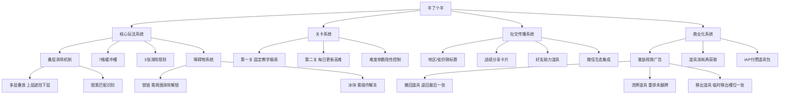

# 《羊了个羊》游戏分析

## 🎮 基础信息
- **游戏名**: 羊了个羊（Sheep a Sheep）
- **开发商**: Simple Happy（北京简单快乐科技有限公司）
- **发行商**: Simple Happy（自发行）
- **上线时间**: 2022年9月13日
- **平台**: 微信小游戏（主）、抖音小游戏、App Store
- **类型**: 休闲益智 / 消除解谜
- **游玩时长**: 单局5-15分钟，但复玩次数极高（"死亡循环"设计）
- **游玩状态**: ☑ 游玩中（通关率极低）
- **个人评分**: ⭐⭐⭐（3/5星，设计精妙但体验恶意）
- **数据表现**: 上线一周日活突破5000万，微信小游戏历史级爆款；通关率官方从未公布，社区估计约0.1%以下

---

## 🎯 核心体验

### 一句话定位
一款**以"故意让你输"为核心设计驱动力**的消除游戏——第一关教你入门，第二关让你无限复活，广告在每次失败和道具获取之间精准收割注意力。

### 核心循环

```
【单局循环】
点击叠层图案牌 → 牌进入7格缓冲槽 → 集齐3张相同自动消除
→ 槽位满/清空所有牌 → 通关(极低概率) 或 失败(绝大多数)
→ 看广告获取道具/继续 → 重新开始

【传播循环（元层面）】
失败 → 分享战绩截图到朋友圈/群聊（"我没通关，你来试试"）
→ 好奇者入场 → 同样失败 → 继续传播
→ 偶有通关者晒图 → 稀缺感强化渴望 → 激励更多人重试

【激励广告循环（商业层面）】
道具耗尽 → 看激励广告（30秒）→ 获得一次道具
→ 使用道具继续 → 再次失败 → 道具耗尽 → 再看广告
```

### 记忆点
1. **第一关秒过**：10秒内轻松通关，建立"这游戏很简单"的错误预期
2. **第二关第一次失败**：槽位猛然被填满，预期落差制造强烈情绪波动
3. **0.1%通关率梗**：全国人民都在挑战同一关、鲜有人通过，形成全民共情的社交话题
4. **省份排行榜**：看到自己所在省份落后时触发的竞争本能，驱动"为省争光"情绪
5. **偶然通关的瞬间**：极低概率事件成真带来的惊喜感，以及随之而来迫不及待分享的冲动

---

## 🧠 系统架构



### 主要系统拆解

#### 叠层消除机制（Core Puzzle Layer）
- **设计目标**: 制造"牌在眼前却无法触碰"的可视但不可及感，通过叠层遮挡产生信息不对称，使消除策略变得复杂而非纯运气
- **核心机制**:
  - 牌面分3-6层叠放，上层压住下层，必须先移除上层才能点击下层
  - 每张牌的叠层关系在初始布局时已定，不随时间改变（静态叠层）
  - 玩家可以看到部分被遮挡牌的图案（透过上层边缘隐约可见），但无法操作
- **深度来源**: 优秀玩家需要规划多步——移除A牌是为了露出B牌，B牌与槽位中的B凑成3张消除，才能继续。线性思维（每步只看当前最优）必然失败，需要2-3步前瞻
- **设计亮点**: 叠层制造了"我能看到答案但够不到"的认知张力，这种可见不可及感比纯随机更令人抓狂，也更令人觉得"再试一次一定行"

#### 7格缓冲槽（Pressure Buffer System）
- **设计目标**: 制造"快要满了"的持续紧张感；槽位作为稀缺资源，将消除游戏的随意点击变成需要成本考量的行动
- **核心机制**:
  - 底部固定7格槽位，按点击顺序从左到右排列
  - 3张相同图案时自动消除并释放3格
  - 槽位填满7格无法消除则立即宣告失败
- **深度来源**: 7这个数字是精心选择的——6格太少（太快失败，挫败感过强），8格太多（压力不足，难度下降）。7格在大多数局中制造5-6格满时的"危险区域"焦虑，提供了恰好够的缓冲让玩家觉得"差一点"
- **设计亮点**: 槽位可视化的"快满"状态是驱动道具消耗的心理触发器——玩家在槽位5-6格满时最容易选择使用道具，因为"好不容易走到这一步不甘心放弃"的沉没成本心理已经激活

#### 关卡难度设计（Two-Level Asymmetry）
- **设计目标**: 用第一关建立"我能玩"的信心和期待，用第二关制造永久性的挑战张力；两关难度的极端不对称是整个病毒式传播的触发点
- **核心机制**:
  - **第一关（教学关）**: 固定布局，牌数极少（约30张），几乎不可能失败，约10-30秒通过
  - **第二关（正式关）**: 每日更新，牌数约150-200张，多层叠放，据估计通关率极低（社区估算0.1%以下）
  - 第二关的难度并非来自"有解但难找"，而是来自**槽位容量与牌面总量的数学关系**——在特定布局下，即使完美操作也可能因某些牌的叠层顺序无法达成3连消除而必败
- **深度来源**: 无——这不是深度谜题设计，而是通过概率控制将通关率限制在目标区间内
- **设计亮点（反直觉）**: 这是本游戏最核心的反直觉设计——**通关率低本身就是产品功能，不是Bug**。极低通关率制造了：①稀缺成就感（通关变得珍贵）②全民挑战同一道题的社区感③"你通了？！"的社交货币价值

#### 社交锦标赛系统（Tribal Competition Layer）
- **设计目标**: 将个人游戏行为转化为群体竞争行为，激活地域/团体归属感，驱动主动自发传播（玩家为了让所在省份/团队排名上升而呼朋唤友）
- **核心机制**:
  - 按省份/城市显示通关人数排行榜，玩家可为所在地区贡献通关数
  - 团队模式：创建或加入团队，团队通关总数排名
  - 微信生态内的好友助力：分享给好友帮自己获得额外道具机会
- **深度来源**: 完全无游戏深度，纯社交驱动
- **设计亮点**: 将个人的"我要赢"转变为集体的"我们要赢"，触发了完全不同等级的情感动员。"广东人要超北京"的地域竞争比"我要通关"的个人目标更有传播势能——因为地域排名是所有人共同可见的，而个人战绩只影响自己

#### 道具与广告融合系统（Monetization Engine）
- **设计目标**: 在不破坏玩家"我还有机会"感受的前提下，最大化每次失败后的广告观看次数
- **核心机制**:
  - 三种道具（撤回/洗牌/移出）每日有限量初始供给
  - 耗尽后通过观看30秒激励视频广告获取额外次数
  - 失败后可看广告继续（无限次，但需每次看广告）
- **深度来源**: 无游戏深度，是变现漏斗
- **设计亮点**: 道具设计是精心的"希望延续器"——撤回提供"我犯了一个错误可以修正"的控制感，洗牌提供"换个布局说不定能行"的重启感，移出提供"临时扩容"的解压感。三种道具分别对应挫败、绝望、焦虑三种负面情绪，精准匹配玩家在即将失败时的心理状态，使玩家在最脆弱的时刻最愿意看广告。

---

## 🎨 体验层分析

### 手感与操控

操控极度简单：点击图案牌，牌飞入槽位，满3张自动消除。没有任何技巧性操作，没有连击、滑动或时机判断。这是刻意的设计——**操控门槛为零**保证了最广泛的受众可达性（老人、小孩、从不玩游戏的人都能上手）。

手感本身没有特别的爽感设计，牌入槽和消除有轻微音效和小动画，达到及格线。游戏的情感高峰不在操控手感上，而在"通关"和"失败"这两个结果节点上。

### 关卡/内容设计

关卡设计的本质不是"给玩家挑战"，而是**概率工程**：

```
【难度调控逻辑】
目标通关率 ≈ 0.1%（社区估算）
→ 调整牌面总数、叠层深度、图案种类分布
→ 使在完全随机操作下通关概率趋近目标值
→ "最优操作"能提升概率，但仍被数学结构限制在极低范围
```

这与传统谜题游戏完全不同——传统谜题是"有解，难找到"；羊了个羊第二关是"有解，但极低概率走到解"。玩家感觉的"我差一点点"可能在概率上根本不成立，只是认知偏差（近失效应）。

### 叙事与世界观

完全没有叙事。"羊"只是视觉主题（图案是各种以羊为形象的卡通图案），没有任何故事背景、角色或世界观建构。

这是刻意的极简主义——**叙事会增加理解成本，减慢病毒式传播速度**。羊了个羊的传播逻辑是"朋友发给我，我5分钟内就能开始玩"，任何叙事前置都会在这个链条中造成摩擦。

### 美术与音乐

美术风格：圆润可爱的卡通羊图案，色彩明亮，适合老少咸宜的受众定位。视觉刺激度低，不会引起视觉疲劳，支持长时间游玩。

音乐：轻快循环背景音乐，加上牌移动/消除的简单音效。整体风格类似糖果传奇（Candy Crush），没有原创性但也不令人反感。

美术和音乐的共同功能：降低玩家的防御性（"这是一个无害的小游戏"），降低不爱玩游戏的人的进入阻力。

---

## ⚖️ 设计取舍分析

| 设计决策 | 得到了什么 | 放弃了什么 | 被什么约束逼出来的 |
|---------|-----------|-----------|-----------------|
| **第一关极易第二关极难** | 极强的预期落差制造情绪冲击；"我刚才那么容易通过，为什么第二关这么难"驱动反复挑战 | 难度曲线的合理递进；玩家对游戏的长期信任（许多玩家意识到"这是故意设计的"后感到被愚弄） | 病毒传播工程决策：如果两关难度均等，第一次失败不会引起足够大的情绪冲击，分享动力弱 |
| **通关率极低（约0.1%）** | 通关成为稀缺社交货币；通关截图价值极高；全民同一挑战的社区感 | 玩家长期留存（大多数玩家在5-10次失败后放弃）；被质疑游戏公平性的公关风险 | 广告变现模式约束：高通关率 → 玩家不需要道具 → 广告观看减少 → 营收下降；通关率和广告收益成反比 |
| **无叙事/极简世界观** | 零理解成本；任何人5秒内明白玩法；最大化传播速度 | 玩家情感连结；留存深度；IP续集可能性 | 小游戏生态约束：微信小游戏用户平均决策时间极短，有任何额外理解负担都会在分享链条上造成摩擦损耗 |
| **省份/地区竞争榜** | 触发地域认同的集体动员；玩家主动呼朋唤友"为省争光"；传播从个人变成群体自发行为 | 单纯游戏乐趣（游戏性不依赖社交功能）；非微信生态用户的可达性 | 微信生态内的产品设计优势：微信天然有LBS（位置）数据和社交关系链，省份竞争是对现有基础设施的低成本利用 |
| **看广告获取道具而非付费** | 极低付费门槛触达全部用户群体；广告变现ROI比IAP更高（数亿DAU × 低频次广告 > 少量付费用户的IAP） | 高ARPU用户的付费深度；游戏长期商业可持续性（广告收益随DAU下降迅速归零） | 用户画像约束：下沉市场/老年用户/轻度用户群体付费意愿极低，IAP模式对核心受众无效 |
| **每日仅有第二关（无关卡扩展）** | 专注于病毒事件的单点引爆；话题高度集中（"第二关"成为全国统一社交话题） | 内容深度；玩家的多样化体验；长期内容更新能力 | 爆款逻辑约束：羊了个羊是内容型爆款，不是产品型游戏；内容扩展会分散社交话题能量，破坏"全国人民挑战同一道关"的社区聚焦效应 |

---

## 💡 值得借鉴的设计

### 1. "教学关"的预期植入功能
**具体设计**：第一关极简，10-30秒通过，让玩家在进入第二关之前建立"我会玩这个游戏"的自我效能感（Self-Efficacy）。

**值得借鉴的原因**：教学关通常用于"让玩家学会机制"，但羊了个羊揭示了另一个功能：**预期管理工具**。刻意压低第一关难度，让玩家对自己的游戏能力建立过高预期，从而使第二关的落差产生更强的情绪反应（愤怒+不服气）。愤怒和不服气比挫败感更驱动复玩。

**可落地到自己项目**：在任何带挑战性内容的游戏中，前置一个"让玩家感觉自己很厉害"的超简单关卡，不仅教机制，更重要的是建立"我能行"的信心，使后续真正的挑战遭遇时情绪落差更大、复玩驱动力更强。在 Godot 中可以把第一关的关卡参数（牌数/道具数）配置为固定最简，而非走随机生成器。

### 2. "近失效应"的结构性制造——7格槽位的满格视觉压迫
**具体设计**：7格槽位配合牌面设计，使大多数局会走到"满5-6格但卡在无法消除"的危险区域，而非快速失败。

**值得借鉴的原因**：认知科学中的"近失效应（Near-Miss Effect）"：感觉"差一点就赢了"比"完全输了"更驱动下一次尝试。羊了个羊通过关卡数学结构**刻意制造**近失状态——玩家在槽位快满时的挣扎感比从一开始就失败更令人沮丧也更令人不甘心。

**可落地到自己项目**：在设计失败状态时，思考"玩家能否感受到自己离成功很近"：在关卡设计中调整难度参数，使失败通常发生在"完成了80-90%进度"而非"开局就崩溃"。这一点在资源管理类游戏（城市建设、塔防）中尤其有效——在几乎所有血量时被击败比在满血时被秒杀更驱动复玩。

### 3. 地域认同作为社交传播触发器
**具体设计**：省份/地区通关率排行榜，将个人成就与集体荣誉绑定。

**值得借鉴的原因**：个人的分享动机（"我通关了，好厉害"）是弱传播驱动力；集体动员（"我们省落后了，快来帮忙"）是强传播驱动力。地域归属感是现实生活中最强的集体认同之一，调用这个锚点可以触发原本不会主动传播游戏的人主动邀请他人。

**可落地到自己项目**：任何有社交层的游戏，都可以考虑加入"群体贡献榜"而非只有"个人排名"——公会/团队的贡献排名、服务器间的竞争、地区/学校/公司的榜单。关键是**让个人行为产生集体可见的结果**，集体结果的可见性是传播的触发器。

### 4. 道具设计为"情绪解药"而非"能力增益"
**具体设计**：三种道具（撤回/洗牌/移出）分别对应三种具体的失败前情绪（犯错/绝望/槽位焦虑），而非泛化的"增强能力"。

**值得借鉴的原因**：大多数游戏的道具设计逻辑是"增加玩家能力"，羊了个羊的道具设计逻辑是"缓解玩家当前的具体痛苦"。这两种逻辑在使用时机上有根本差异——玩家不会在顺利时消耗道具，只会在感受到特定痛苦时消耗。精准匹配痛苦的道具比泛化增益道具的消耗率更高。

**可落地到自己项目**：为游戏中的"高挫败感时刻"设计专属道具/救援机制，而非通用型增益。例如：在玩家连续失败3次后，解锁"失败保护道具"（减少下一局的随机惩罚），而非在整个游戏中通用的攻击+10%道具。精准的情绪靶向比广谱增益更有价值感。

### 5. 单一话题点的社交聚焦效应
**具体设计**：全国所有玩家每天挑战同一个第二关，形成统一的社交话题锚点（"今天第二关你过了吗"）。

**值得借鉴的原因**：如果游戏有100个关卡，玩家各在不同关卡，"你第二关过了吗"这个对话就消失了。单一关卡创造了**全国人民共同话题**，使游戏从个人娱乐变成社会事件。《Wordle》用同样逻辑：每日一道，全球同题，使分享结果成为日常对话的一部分。

**可落地到自己项目**：如果游戏包含社交/传播目标，可以设计"每日挑战"或"本周共同任务"——所有玩家同时面对同一内容，产生共同话题。即使游戏有大量个人化内容，单独的共同话题模块也值得投入，因为它是传播的引擎。

---

## ❌ 不足与问题

### 1. 核心游戏性存疑：是谜题还是彩票？
**问题描述**：真正的谜题游戏应该是"有确定的解，玩家负责找到它"。羊了个羊第二关的设计更接近"概率随机事件"——在特定布局下，即使完美操作也可能因叠层顺序而必败。这使玩家的"我要找到解法"的努力感是虚假的——感觉在用技巧，实则在用运气。

**可能的改进方向**：要么明确承认"这是一个运气游戏"（但会失去"我可以变强"的驱动力），要么在布局设计上保证每局都有可达的解（真正的益智游戏），但这会显著降低商业设计的通关率控制能力，与当前商业模式矛盾。

### 2. 操控设计存在刻意障碍
**问题描述**：游戏UI设计中存在一些被玩家广泛指出的"刻意设计的不便"：如道具按钮在快要失败时更加显眼（颜色加深/轻微振动），这是典型的黑暗模式（Dark Pattern）——在玩家最脆弱的时刻增加道具消耗引导，从而增加广告观看次数。

**可能的改进方向**：如果移除这些暗引导，广告收益会下降，但玩家信任会提升——这是短期收益与长期品牌价值之间的经典取舍，当前的选择倾向于短期收益。

### 3. 留存设计薄弱导致生命周期极短
**问题描述**：游戏缺乏任何长期留存机制（无成就系统、无角色成长、无故事进展、无社交关系积累）。玩家的留存完全依赖社交话题热度——一旦话题热度下降，没有任何内生动力拉住玩家。2022年9月爆火，数周内话题热度迅速衰退，随后进入长尾状态。

**可能的改进方向**：加入轻量级成长系统（即使是纯装饰性的，如解锁新图案主题）或每周/每月的阶段性成就，提供除社交话题之外的回访理由。但这与当前"专注单点爆款引爆"的产品策略存在根本矛盾。

### 4. 公平性争议损伤口碑
**问题描述**：玩家发现道具有限且总会在关键时刻耗尽、有人反映花费大量时间和广告后仍无法通关，开始质疑第二关是否"数学上可解"。官方从未公布通关率数据，加剧了不信任。

**可能的改进方向**：提高信息透明度（公布通关率、确认每日第二关有解），可以在不损失核心机制的前提下建立基本信任。

---

## 🔗 知识关联

### 与已读书籍的关联

| 书籍 | 关联描述 | 挑战/矛盾点 | 关联强度 |
|------|---------|-----------|---------|
| **思考快与慢** | 游戏全程依赖系统1的认知偏差运作：①近失效应（槽位快满=差一点点）让系统1误判失败原因为"操作失误"而非"布局概率"；②损失厌恶（沉没成本——"我已经玩了这么久了"）推动继续看广告；③地域竞争触发系统1的部落归属感而非系统2的理性评估 | **挑战**：卡尼曼认为了解偏差有助于抵御它，但羊了个羊证明**知道近失效应是人工制造的并不能阻止它发挥作用**——大量玩家清楚"这游戏设计上不让你赢"，但仍然反复重试。系统1的驱动力在某些条件下可以绕过系统2的知识判断 | ⭐⭐⭐⭐⭐ |
| **真需求** | 梁宁框架中"应然 vs 实然"：用户应然（表达需求）是"我想要娱乐消遣"，实然是"我需要一个社交话题和群体认同感"。羊了个羊识别了真实需求：用户玩的不是游戏，玩的是"我也参与了这件大家都在谈的事情"的社会存在感 | **挑战**：梁宁的框架是"满足真实需求"，但羊了个羊的"需求"中有相当部分是**通过设计人工制造的焦虑和欲望**（如地域竞争排名），而非挖掘已存在的需求。这说明"真需求"可以是被构建出来的，而不只是被发现的 | ⭐⭐⭐⭐⭐ |
| **游戏编程设计模式** | 难度参数控制是数值配置系统（Data-Driven Design）的应用：牌数、层数、图案种类数量、每种图案的张数都是可调配置参数，调整这些参数直接影响通关概率；道具系统的三种道具是三个独立的策略对象（Strategy Pattern），每种道具的效果逻辑互相独立 | 无根本矛盾 | ⭐⭐⭐ |
| **游戏编程算法与技巧** | 叠层布局生成是约束满足问题（CSP）：需要保证①牌总数平衡（每种图案出现次数是3的倍数）②至少存在一条可行解路径③难度在目标通关率区间内。随机生成器需要配合验证算法确保基本可解性（或刻意设计一定比例不可解的布局） | **挑战**：书中算法设计强调"保证可解性"，但羊了个羊可能刻意设计了一定比例的"数学不可解"布局——这是算法层面的黑暗模式，书中未讨论此类反玩家设计 | ⭐⭐⭐⭐ |
| **第一性原理** | 从第一性原理推导：羊了个羊的底层原理不是"让玩家享受游戏乐趣"，而是"最大化激励广告观看次数"。从这个底层原理推导，所有设计决策（极低通关率、道具消耗机制、近失体验）都是从这个商业目标推导出来的逻辑结果——这是第一性原理反向应用的典型案例：先定商业目标，再逆向设计游戏体验 | **挑战**：第一性原理通常指向"更本质/更好的解决方案"，但羊了个羊证明第一性原理也可以服务于掠夺性商业目标——工具中立，取决于推导的出发点是什么 | ⭐⭐⭐⭐ |
| **黑天鹅** | 羊了个羊的爆火本身是一个黑天鹅事件：事后看起来一切都有道理（社交机制+极低通关率+微信生态），但大量具有相同要素的游戏并没有爆火。这说明病毒式传播存在不可预测的偶然性窗口，不能被完全工程化复制 | **关联**：塔勒布的"叙事谬误"在此尤其适用——游戏公司和媒体事后总结了大量"爆火原因"，但这些原因是对已发生结果的理性化重建，而非真正的因果解释。羊了个羊是否可以刻意复制尚无答案 | ⭐⭐⭐⭐ |
| **后真相** | 游戏利用了当代信息传播中"情绪优先于事实"的逻辑：玩家分享的是情绪截图（"我又没过！！！"），而非游戏分析。情绪化内容在社交平台的传播速度远超理性分析内容，这与《后真相》描述的信息生态高度一致 | 无根本矛盾，相互印证 | ⭐⭐⭐ |

### 与其他游戏的横向对比

| 游戏 | 对比描述 | 关联类型 |
|------|---------|---------|
| **小丑牌**（已分析） | 同样有高难度，但小丑牌的高难度来自"认知复杂度"（理解乘法协同），羊了个羊的高难度来自"概率控制"（数学设计不让你赢）；前者的挑战是技能门槛，后者的挑战是数学门槛——玩家无法通过学习跨越数学门槛，只能通过运气 | 难度来源对比 |
| **Wordle**（未分析） | 同样是"每日一题，全国同题"的社交聚焦设计；Wordle是真正可解的谜题（有唯一解，玩家能找到），羊了个羊是概率游戏；Wordle建立了长期日常习惯，羊了个羊引爆了短期社会事件——社交游戏的两种不同生命周期曲线 | 同类机制对比/设计取向分叉 |
| **暖雪**（已分析） | 同为高难度游戏，但暖雪的高难度是对玩家能力的合理考验（反复练习后会进步），羊了个羊的高难度在概率层面不依赖玩家能力；暖雪留住了硬核玩家，羊了个羊引爆了轻度用户——受众画像与难度机制的对应关系 | 难度设计哲学对比 |

### 对自身项目的启发
若在开发移动端社交游戏或小游戏，羊了个羊提供了明确可操作的启发：

1. **"第一关优于满分"原则**：第一个可交互关卡的设计目标是"建立玩家自我效能感"，不是"教完所有机制"。用 `LevelConfig.is_tutorial = true` 标记，并在该关卡中将所有随机参数设为最利于玩家的固定值。

2. **每日挑战模块**：即使是内容丰富的游戏，也可以单独设计一个"全服共同关卡"（每日刷新，所有玩家面对完全相同的实例），使游戏内容成为日常社交对话的共同话题锚点。

3. **道具的情绪匹配设计**：识别游戏中的"高挫败感时刻"，为每种具体挫败感设计专属解药道具，而非通用增益。在道具UI上，当特定挫败状态（如资源快耗尽、连续失败）被检测到时，对应道具可以有轻微高亮，引导玩家使用（注意：应在用户利益与商业利益之间保持伦理边界）。

---

## 💡 强制自我审查

### Q1：这款游戏最反直觉的设计决策是什么？
**极低通关率是产品功能，不是Bug**。传统游戏设计直觉认为"让玩家赢 = 好体验 = 更多玩家"，但羊了个羊证明了相反的等式：**让玩家不赢 = 更强的重试驱动力 + 更大的通关稀缺感 + 更多广告收益**。这只在特定前提下成立：①变现靠广告而非买断/IAP ②传播靠社交话题而非口碑留存 ③目标是短期引爆而非长期运营。当这三个条件同时成立时，"故意让你输"是最优设计。

### Q2："值得借鉴"的每一条，能对应到自己项目的具体系统/功能吗？
已在每条借鉴点中具体到：Godot关卡参数设置（`is_tutorial = true`固定参数）、每日挑战的服务器架构设计、道具触发条件检测逻辑。

### Q3：设计取舍表格里，每行都有"被什么约束逼出来的"解释吗？
已在取舍表格第四列覆盖：病毒传播工程决策、广告变现模式约束、小游戏生态约束、微信基础设施优势、用户画像约束、爆款逻辑约束。

### Q4：知识关联里，有没有这款游戏的设计挑战或矛盾了书里某个观点？
三处明确标注了"挑战"：
- 挑战了《思考快与慢》"了解偏差可以帮助抵御它"——知道近失效应是设计出来的，仍然无法阻止系统1驱动行为
- 挑战了《真需求》"真需求是被发现的"——羊了个羊的部分"需求"是通过设计人工构建的焦虑和欲望
- 挑战了《第一性原理》的价值中立——第一性原理可以服务于掠夺性商业目标

### Q5：整篇笔记读完，有没有至少一个"改变了我对某件事的认知"的洞察？
**"了解认知偏差不能保护你免受认知偏差的影响"**：认知心理学的传统假设是，系统2（理性分析）能在被激活时覆盖系统1（直觉偏差）。但羊了个羊的玩家数据提供了反例——大量玩家清楚知道"这游戏故意设计得让你通不过"，也知道"自己在被近失效应操纵"，但这一认知并不能减弱他们再次点击"重新开始"的冲动。这说明**元认知（对自己思维的认识）和行为改变（基于元认知的行动调整）之间存在系统性断裂**，单纯的"知道"不足以改变行为。对游戏设计者的启示：不要因为玩家"看穿了"你的机制就认为机制失效——只要机制触发了足够强的系统1反应，系统2的"我知道这是套路"并不必然带来行为改变。

---

## 📊 总结

### 最大的收获
羊了个羊是一个完美的**逆向教材**：它的商业成功来自于对游戏设计伦理的系统性逆用——将每一个"让玩家有好体验"的传统设计原则，替换为"让玩家产生最大广告观看次数的体验"。学习它不是为了复制它，而是为了看清"好游戏体验"和"高广告变现效率"之间的冲突在极端情况下是什么样的。

### 核心结论
羊了个羊不是一款游戏，是一个**社会工程项目**：它的设计目标是引爆一个持续数周的全国性社交话题，游戏机制是实现这个目标的工具，广告变现是这个工具产生的商业副产品。其成功的核心是：**识别了微信生态的地域竞争心理这一具体驱动力，并围绕它设计了一个近失体验无限循环的注意力捕获装置**。对开发者的净值启示：社交传播的最强触发器不是"好玩"，而是"我需要让朋友也参与进来"的集体驱动力。

---

**分析创建时间**: 2026-06-25
**最后更新**: 2026-06-25
