# 《Beneath Oresa》游戏分析

## 🎮 基础信息
- **游戏名**: Beneath Oresa
- **开发商**: Broken Spear Inc.
- **发行商**: Goblinz Publishing
- **发行年份**: 2023年9月27日（抢先体验起始：2022年11月3日）
- **平台**: PC（Steam）
- **类型**: Roguelike 卡牌构筑 / 战术定位
- **游玩时长**: 20-40小时（基础通关），100+小时（深度挑战）
- **游玩状态**: ☐ 游玩中 ☐ 通关 ☐ 白金/全成就 ☑ 分析记录
- **Steam 评分**: 较为好评（78% 好评，1,106条评测）
- **标签**: Roguelike Deckbuilder、3D、Hand-drawn、Cyberpunk、Post-apocalyptic、Turn-Based

---

## 🎯 核心体验

### 一句话定位
在赛博朋克地下城中，卡牌构筑遇上战术棋盘——你的每一次出牌不仅是卡组选择，更是一次站位博弈，敌人的位置与你手牌的配合共同决定生死。

### 核心循环

```
【局内主循环】
选择英雄+同伴组合
    ↓
探索地下城地图（事件/战斗/商店/精英/Boss）
    ↓
战斗中：出牌 × 站位博弈 → 击杀 → 获得奖励
    ↓
选择新卡牌/升级卡牌（双路线二选一）
    ↓
获得圣物/金币 → 重塑卡组策略 → 挑战下一层Boss

【构筑决策节点】
升级卡牌：路线A（单回合爆发）vs 路线B（持续增益）
购买卡牌：扩展牌组宽度 vs 精简牌组厚度
圣物选择：配合已有套路 vs 开拓新方向

【元循环（局外）】
完成成就/挑战 → 解锁新角色/同伴 → 更多组合实验
```

### 记忆点
1. **将三个敌人排成一列然后一张牌秒杀全场** —— 站位系统带来的最爽瞬间，也是这款游戏区别于所有竞品的标志性体验
2. **升级一张牌面临路线分叉时的两难抉择** —— 两种升级方向都很诱人，你必须在此刻决定整个卡组的走向
3. **同伴技能与主角卡组意外联动时的惊喜** —— 组合效应超出预期，"这两个技能原来可以这么用"的发现感
4. **第一次遭遇精英敌人被击退撞墙的击杀** —— 击退+墙壁碰撞带来的环境利用感，这是 StS 体系里没有的东西
5. **从"这套牌组感觉很乱"到"哦原来这条线是这样的"的顿悟时刻**

---

## 🧠 系统架构

```mermaid
graph TD
    A[Beneath Oresa 核心系统] --> B[双英雄组合系统]
    A --> C[战术位置战斗系统]
    A --> D[卡牌构筑系统]
    A --> E[地图探索系统]
    A --> F[局外解锁系统]

    B --> B1[主英雄: 起始牌组+被动技能]
    B --> B2[同伴: 8种主动技能供选择]
    B --> B3[组合化学反应: 数十种策略组合]

    C --> C1[站位系统: 连线攻击/区域移动]
    C --> C2[击退机制: 撞墙/碰撞伤害]
    C --> C3[区域效果: AOE vs 单体的空间博弈]
    C --> C4[敌人意图可视化: 预判行动]

    D --> D1[牌组获取: 战斗奖励/商店购买]
    D --> D2[升级系统: 每张牌双路线二选一]
    D --> D3[移除系统: 精简牌组]
    D --> D4[卡牌协同: 标签/状态效果链]

    E --> E1[地图节点: 战斗/精英/事件/商店/Boss]
    E --> E2[路线选择: 风险与奖励的路径博弈]
    E --> E3[精英战: 强力圣物的高风险节点]
    E --> E4[Boss战: 每层终结挑战]

    F --> F1[角色解锁]
    F --> F2[成就系统: 66个成就]
    F --> F3[诅咒/挑战模式: 提升重玩价值]
```



### 主要系统拆解

#### 双英雄组合系统
- **设计目标**: 在传统单英雄卡牌游戏的基础上引入"组合化学"，让玩家在选择阶段就产生策略期待感，同时提供局外组合实验的驱动力
- **核心机制**: 
  - 每局开始选择**主英雄**（决定起始牌组和基础被动）
  - 再选择**同伴英雄**（不进入牌组，提供8种可选的主动技能，每次下潜只选其中部分带入）
  - 同伴技能独立于牌组之外，有自己的冷却/资源逻辑
- **深度来源**: 主英雄和同伴之间的**协同效应**——某个主英雄的核心机制恰好被某个同伴技能放大，形成"1+1>2"的组合惊喜；这种发现是驱动复玩的核心
- **设计亮点**: 将"多英雄"的策略深度压缩到"选同伴"这一轻量决策中，而不是像 StS 那样多个职业各自独立——既增加了组合维度，又没有让选择感觉割裂

#### 战术位置战斗系统（核心差异化）
- **设计目标**: 让卡牌游戏的战斗不只是"选牌出牌"的脑力游戏，加入空间维度的战术博弈，制造传统卡牌游戏无法复现的"位置爽感"
- **核心机制**:
  - **站位连线**: 将多个敌人排成一列，部分卡牌可以穿透连击所有敌人，最大化输出
  - **区域位移**: 主动移动角色到安全区域，回避特定攻击（某些敌人只打特定区域）
  - **击退碰撞**: 击退技能将敌人撞向墙壁或其他敌人，产生额外碰撞伤害
  - **环境利用**: 战场边界、障碍物的空间博弈

  ```
  战场示意（概念）：
  ┌─────────────────────┐
  │  [敌A] [敌B] [敌C]  │ ← 排成一线时，穿透攻击可三连
  │                     │
  │       [玩家]        │ ← 位置决定受攻击范围
  └─────────────────────┘
  
  击退链：[敌A] ←击退— [敌B] → 撞墙 → 额外伤害
  ```

- **深度来源**: 每回合的出牌决策要同时考虑：①这张牌的连击方向；②敌人下回合的行动意图；③当前自己的位置是否安全。三个维度叠加产生远超纯卡牌游戏的决策复杂度
- **设计亮点**: 用**3D可视化**而非抽象图标表达站位关系，玩家可以直观感受到"把敌人推到那排"的操作感——这是这款游戏美术选择服务核心机制的典型案例

#### 卡牌构筑与双路线升级系统
- **设计目标**: 避免卡牌升级路径成为"有最优解的数学题"，让每次升级决策都充满取舍张力，同时将卡牌升级与卡组整体策略方向绑定
- **核心机制**:
  - 每张卡牌升级时提供**两条分叉路线**，而不是单一强化
  - 路线A与路线B通常是设计上相互对立的权衡，例如：
    - "本回合造成250%伤害" vs "每打出攻击牌累积+10%永久伤害"
    - "立即获得3格护甲" vs "本局战斗每回合获得1格护甲"
    - "费用从2降为1" vs "额外获得一张副本放入牌组"
  - 一旦选择，该路线无法再改变（除非特殊圣物）
- **深度来源**: 玩家必须在"当前这场战斗的需要"与"整套牌组的长远策略方向"之间做选择。早期随机拿到的卡升级路线，可能直接决定了这一局的整体策略风格
- **设计亮点**: 分叉升级把"卡牌升级"从**数值增强行为**变成了**策略承诺行为**——每次升级都是在向某个方向押注，而不只是变强

#### 地图探索与路线选择
- **设计目标**: 让地图探索本身成为一个"风险收益决策"的舞台，而不只是到达下一场战斗的走廊
- **核心机制**:
  - 地图分多层（区域），每层以Boss收尾
  - 节点类型：普通战斗、精英战斗、商店、随机事件、休息点、Boss
  - 路线是可见的，玩家选择不同路径会面对不同的节点序列
  - **精英战斗**：高风险（血量、伤害）但奖励稀有圣物，是"用当前血量换长期实力"的博弈节点
- **深度来源**: 血量管理 × 路线选择 × 卡组当前强度的三重交叉决策；一局游玩中多次做出这类判断，每次的最优解都不同
- **设计亮点**: 与《杀戮尖塔》系列相似的地图结构，但配合同伴系统，使得"先打精英补圣物还是先养血走战斗"的决策因同伴的技能状态而更加复杂

---

## 🎨 体验层分析

### 手感与操控
《Beneath Oresa》采用3D渲染配合手绘风格（Cell-shaded + 欧洲艺术家风格，被评论者提到参考了法国漫画家 Moebius 的画风）。战斗中卡牌打出时有明显的视觉反馈——击退特效、连击飞线、伤害数字浮现都在3D空间里演出，比纯2D界面更有体感。

操控本身仍是标准回合制卡牌操作（拖拽或点击出牌），但因为战场是3D视角，站位移动操作需要适应空间感，新手可能需要一段时间才能直觉化"移到那个位置会怎样"。节奏比 StS 快，敌人意图可视化（可以看到下回合要做什么）使得博弈感更强。

### 关卡/内容设计
- 三大区域（猜测）+ Boss的层叠结构，每区域有主题化敌人套路
- 精英战是核心张力节点，设计为"你一定打得赢，但会付出代价，问题是值不值"
- 每局地图随机生成，但节点类型分布有调控（不会出现全是战斗的路线），确保构筑有成长节奏
- 难度曲线陡峭——多个玩家评论"难度高、惩罚性强"，但"成功时极具成就感"（这是有意设计的高压体验）

### 叙事与世界观
世界观定位为**赛博朋克末日地下城**：Oresa 是一个充满科技废墟的地下世界，角色们是试图逃脱或征服它的异乡者。叙事较薄——随机事件提供碎片化世界观，无主线叙事驱动，重心在机制探索而非故事体验。玩家的负面评价之一就是"叙事太单薄"，这是开发者有意取舍的结果（机制优先型设计）。

### 美术与音乐
美术风格是游戏最高度赞誉的部分——欧洲手绘风格（Bande dessinée，即法国漫画传统）在3D渲染卡牌游戏中高度少见，形成了强烈的视觉识别度。负面评价中有"音效设计较弱"的批评，音乐氛围合格但没有形成如 Hades 或暖雪那样的标志性听觉记忆。

---

## ⚖️ 设计取舍分析

| 设计决策 | 被什么约束逼出来的 | 得到了什么 | 放弃了什么 |
|---------|-----------------|-----------|-----------|
| 引入3D战术位置战斗 | 卡牌构筑市场同质化严重，StS 出现后大量跟风模仿，差异化必须从根本机制入手 | 独特的空间策略层，与所有竞品的根本性差异点；3D美术放大了位置感 | 更高的新手门槛（需要同时学习卡牌逻辑+空间逻辑）；制作成本大幅增加（3D vs 2D） |
| 卡牌升级双路线分叉 | 传统"升级=变强"没有决策感，玩家按最优解升级后构筑决策消失 | 每次升级成为策略方向的承诺，而不是数值题；增加了构筑的信息密度 | 部分玩家觉得两个路线都"不够好"时会产生两难无力感；设计复杂度翻倍 |
| 双英雄组合（主角+同伴） | 单英雄系统的复玩深度主要靠卡牌随机，局外解锁驱动力弱 | 数十种组合，局外实验驱动力强；在不改变主牌组的前提下扩展了策略选项 | 同伴技能必须与主牌组协同才有价值，否则两套系统各自孤立；调平工作量极大 |
| 重度机制优先、轻叙事 | 小团队预算限制，无法同时做好深度机制和完整叙事 | 机制精度高，卡牌设计、位置系统都经过充分打磨 | 缺乏叙事粘合剂，玩家倦怠期后没有故事驱动力续航；被批评"像StS克隆而没有情感核心" |
| 高惩罚性难度设计 | 卡牌构筑Roguelike的核心乐趣之一是"可归因失败"——死亡必须是自己的错，才能产生学习动力 | 成功时的成就感极高，核心受众口碑极好；深度策略玩法有充分施展空间 | 休闲玩家流失严重，Steam近期评价"褒贬不一"可能反映了玩家群体在深度与休闲之间的分裂 |
| 3D 手绘艺术风格（欧洲漫画美学） | 视觉差异化需求 + 开发团队审美偏好（加拿大独立团队） | 极高的视觉辨识度，媒体评测普遍称赞美术；形成了唯一性的视觉品牌 | 与主流市场卡牌游戏（像素风、日系插画）的视觉距离较大，可能影响国内玩家的感知亲近度 |

---

## 💡 值得借鉴的设计

### 1. 「位置战斗」给卡牌游戏增加新策略维度的方法论
**具体设计**: 卡牌游戏通常是"我的手牌 × 敌人的数值"的单一博弈维度。Beneath Oresa 通过增加"战场空间"作为第三个变量，使得同一张牌在不同站位情况下价值完全不同——穿透牌在敌人分散时没用，在敌人排成一列时可以秒杀全场。

**可落地到自己项目的具体方向**: 如果在做卡牌或回合制策略游戏，可以考虑"同一效果在不同空间/状态条件下产生截然不同的价值"来制造更丰富的决策密度。例如：某张牌"对处于同行的所有目标生效"，玩家需要主动创造这个条件才能发挥最大价值。

### 2. 「双路线升级」——把升级从数值行为变成策略承诺
**具体设计**: 不是"这张牌变强了"，而是"这张牌从A变成了B或C，你必须选一个"。两个升级路线彼此对立，一旦选定就代表了整个卡组这条策略线的走向。

**可落地到自己项目的具体方向**: 适用于任何有"成长"机制的系统——技能点分配、装备强化、职业进阶。关键是让每次强化都是一次方向选择而不是数值叠加。在设计时，要保证两个选项的好坏依赖于玩家当前卡组状态，而不是有客观意义上的"最优解"。

### 3. 「同伴技能独立于牌组之外」——扩展策略维度而不增加牌组复杂度
**具体设计**: 同伴的技能不加入牌组（不占牌槽），而是作为独立的"主动技能栏"存在，有自己的冷却/资源。这意味着同伴策略和牌组策略可以各自演化，但在战斗中需要配合。

**可落地到自己项目的具体方向**: 在卡牌/策略游戏中，"不进入主系统但能影响主系统的辅助角色/物品/技能"是一种有效的复杂度扩展方式，不会破坏核心系统的清洁性，但增加了高级玩法的联动深度。

### 4. 「敌人意图可视化」——降低信息隐藏，提升计划感
**具体设计**: 每个敌人在回合开始时就显示下一步要做什么（攻击/防御/移动/施加状态），玩家可以提前规划。

**可落地到自己项目的具体方向**: 相较于"信息隐藏制造紧张感"的设计，这种"信息公开+策略应对"的模型更适合深度策略游戏——让玩家的失败归因于"没想到这个后果"而非"不知道敌人会干嘛"。可以在设计Boss战时参考，Boss阶段转换的机制应可预判而非突然。

### 5. 「反直觉：高惩罚 + 高成就感的设计哲学」
**具体设计**: 游戏刻意保持高难度而不降低门槛，结果反而形成了口碑的正反馈——核心受众极度热情，用"insanely rewarding"等词描述成功体验。

**可落地到自己项目的具体方向**: 不是所有游戏都需要"易学难精"——如果目标受众是策略重度玩家，高难度本身就是筛选机制和价值供给，而不是障碍。问题只在于：要让玩家知道这是一款高难度游戏，避免错误购买引发负面评价（近期褒贬不一可能来自期待错配）。

---

## ❌ 不足与问题

### 1. 叙事驱动力薄弱
**问题描述**: 游戏几乎没有叙事主线，世界观通过随机事件碎片化呈现。机制驱动型 Roguelike 在玩家度过学习期后，如果没有叙事或情感线作为续航燃料，容易陷入"又死了又来一局但不知道为什么还在玩"的疲态。

**可能的改进方向**: 参考 Hades 的"每次死亡推进叙事"模型，或者 StS2 的角色日志积累机制，为 Oresa 的地下世界建立更有情感粘度的叙事层。不需要完整剧本，但需要让每次失败都感觉像故事的一部分。

### 2. 声音设计较弱
**问题描述**: 多个评测者提及音效设计不够有力，与精良的美术风格形成落差。卡牌游戏的"出牌手感"有相当一部分来自于声音反馈（StS 的卡牌打出声是经典正面案例）。

**可能的改进方向**: 为不同卡牌类型（攻击/防御/技能/位置移动）设计差异化的音效反馈，让"把敌人排成一列然后穿透击杀"这个核心爽点有配套的声音爆发感。

### 3. 新手引导与学习曲线过陡
**问题描述**: Steam 讨论区存在多个"我不知道在干嘛"的帖子，高回复量的"为什么这个游戏这么难"帖子表明新手挫败感普遍存在。位置系统 + 卡牌构筑双重学习负担使入门成本偏高。

**可能的改进方向**: 增加"推荐套路"教程关卡，明确演示"把敌人排成一列的穿透连击"这个核心爽点的实现方式——让新手在第一局就主动体验一次这个系统的设计高光，而不是靠摸索偶然触发。

### 4. 近期口碑下滑（近期评价褒贬不一）
**问题描述**: 总体78%但近期53%的评价分化，可能反映了两件事：①抢先体验期积累的忠实粉丝与正式发售后的泛受众的期望差异；②游戏后期内容更新（或缺乏更新）引发的流失。

**可能的改进方向**: 定期的内容更新（新英雄/新同伴/新地图区域）对 Roguelike 品类至关重要，持续提供新的组合可能性是维持口碑的核心。对比 StS 系列持续出版的扩展内容策略。

---

## 🔗 知识关联

### 与已读书籍的关联

**《游戏编程设计模式》（Robert Nystrom）**：关联强度 ⭐⭐⭐⭐⭐
- **命令模式（Command Pattern）**: 出牌的每个行为（攻击/移动/使用技能）都是命令对象，可入队、可撤销、可重放——在位置战斗系统中，"移动玩家位置"的指令与"出牌攻击"的指令需要在同一个命令队列中协调执行
- **状态机（State Machine）**: 敌人"意图可视化"的底层是一个可预测状态机——敌人有明确的状态转换逻辑，这才使得意图预告成为可能
- **观察者模式（Observer Pattern）**: 卡牌触发同伴技能的联动效果，本质是一个事件系统——"打出了一张攻击牌"作为事件，所有监听这个事件的同伴被动都会响应
- **享元模式（Flyweight）**: 大量敌人实例共享相同的敌人定义数据，只有位置和当前HP是各自独立的

**《思考快与慢》（丹尼尔·卡尼曼）**：关联强度 ⭐⭐⭐⭐⭐
- **可归因失败与系统2激活**: 游戏的高惩罚设计逼迫玩家在死亡后启动"系统2"复盘——"我在哪步出了错？那张牌应该升哪条路线？"。这个复盘欲望正是 Roguelike 品类的核心驱动力
- **双路线升级制造决策张力**: 每次升级的两个选项都是设计为"系统1直觉倾向A，但系统2分析后可能选B"的模式——诱导玩家用慢思考覆盖快直觉，产生决策满足感
- **峰终定律（Peak-End Rule）**: "把三个敌人排成一列然后一击秒杀"的高光瞬间是精心设计的"峰值体验"——玩家对整局的记忆主要来自这些峰值，而非平均体验

**《游戏编程算法与技巧》**：关联强度 ⭐⭐⭐⭐
- **可管理的随机**: 双路线升级的随机性是"可管理的"——你不知道哪张牌会升级，但每次升级的两个选项都是有意义的选择而非噪声
- **路径图生成**: 地下城地图的随机生成需要保证"每条路线都有足够的节点多样性"，这是可控随机的路径规划问题
- **状态机 AI**: 敌人的意图可视化系统背后是行为树或状态机实现的可预测 AI

**《架构整洁之道》（Robert C. Martin）**：关联强度 ⭐⭐⭐
- **表现/逻辑分离**: 3D 视觉表现层（位置、特效、动画）与卡牌逻辑层（费用、效果、状态）必须严格分离，否则位置系统的更新会与卡牌逻辑产生耦合地狱
- **依赖倒置**: 位置系统不应该依赖具体的卡牌类型，而是卡牌效果"实现了位置影响接口"——这才能保证新卡牌加入时不破坏位置系统

**《真需求》（梁宁）**：关联强度 ⭐⭐⭐
- **"打牌"的应然 vs 实然**: 应然的卡牌游戏是"管理资源、优化决策"的智力竞技；Beneath Oresa 的实然是"在3D战场上把敌人推来推去看爆炸特效"——通过满足玩家的感官需求（打飞敌人的爽感）来让他们接受复杂的策略深度

### 与其他游戏的横向对比

| 游戏 | 对比维度 | Beneath Oresa | 对比游戏 | 洞察 |
|------|---------|--------------|---------|------|
| 杀戮尖塔2 | 策略深度来源 | 卡牌 × 站位 × 组合双重博弈 | 纯卡组构筑 × 单位管理 | BO 通过增加空间维度，为同类型的"决策密度"找到新来源 |
| 杀戮尖塔2 | 升级机制 | 双路线二选一（方向承诺） | 单路线变强（数值叠加） | BO 的升级更像"策略押注"，StS 的升级更像"效率优化" |
| 杀戮尖塔2 | 叙事驱动 | 极弱（机制驱动型） | 中等（角色日志+碎片叙事） | BO 在叙事续航上有明显弱点 |
| 背包乱斗 | 空间策略 | 战场站位决定卡牌价值 | 背包格子位置决定道具协同 | 两者都是"空间即策略"设计模式，但一个在时间维度（战斗中动态调整），一个在准备维度（战斗前静态布局） |
| 暖雪 | 随机粒度 | 中粒度（卡牌升级路线，同伴组合） | 细粒度（单件圣物4效果） | BO 的随机信息密度低于暖雪，认知负担更低，但发现感也更弱 |
| Monster Train | 多层管理 | 平面战场的站位控制 | 三列纵深的分层防御 | 都是在卡牌游戏里增加空间维度，方向不同——BO 是"横向排列优化"，MT 是"纵深层次防御" |

---

## 📊 总结

### 最大的收获
Beneath Oresa 证明了一件事：**卡牌构筑游戏的差异化不必来自更多的卡牌或更复杂的效果——向其他维度扩展（此处是空间位置）可以在保持卡牌游戏核心玩法的前提下，产生根本性的体验差异。** 这是一个关于"垂直挖深 vs 水平拓宽策略维度"的具体案例。

同时，其双路线升级系统提供了一个设计范本：如何把一个"数值强化"的动作变成一个"策略方向确认"的决策——这对任何有成长系统的游戏都有直接的可借鉴价值。

### 核心结论
Beneath Oresa 是一款设计哲学清晰的卡牌Roguelike：它在差异化上押注正确（位置系统确实是该品类的重大创新），但执行中的叙事薄弱和新手引导不足限制了其商业天花板。对开发者而言，更有价值的学习点是其**卡牌升级分叉设计**——这是一个可以独立抽取、在其他类型游戏中广泛应用的设计模式：将"成长"从数值叠加行为改造为策略方向承诺行为。

---

## 🔍 强制自我审查（发布前完成）

**Q1：这款游戏最反直觉的设计决策是什么？我有没有点出来？**
已点出：**保持高惩罚难度而不妥协**——大多数商业游戏会降低难度以扩大受众，但 BO 坚持高难度设计反而形成了核心受众口碑的正向飞轮。这个决策违反了"降低门槛扩大受众"的直觉，却产生了更有价值的口碑。已在"值得借鉴"第5条和设计取舍表格中指出。✅

**Q2：每条"值得借鉴"都能落地到具体系统/功能吗？**
- 位置战斗维度 → 可用于自己项目的回合制战斗中"同行效果/连线效果"卡牌设计 ✅
- 双路线升级 → 可用于技能树/装备强化的方向选择设计 ✅
- 同伴技能独立于牌组 → 可用于辅助角色/道具系统"不进入核心系统但能影响核心系统"的架构设计 ✅
- 敌人意图可视化 → 可用于Boss战阶段转换的透明化设计 ✅
- 高惩罚哲学 → 可用于目标受众筛选和难度定位决策 ✅

**Q3：设计取舍表格里每行都有"被什么约束逼出来的"解释吗？**
已添加"被什么约束逼出来的"列，每行均有说明。✅

**Q4：知识关联里有没有游戏的设计挑战了书里某个观点？**
已指出：Beneath Oresa **挑战了《思考快与慢》中"降低认知负担=更好体验"的直觉**——双系统理论认为系统2（慢思考）是疲惫的、低效的，通常设计应该顺应系统1。但 BO 刻意制造了"系统2必须工作"的高强度决策环境，反而成为了深度玩家的核心乐趣。卡尼曼描述的"系统2的疲劳感"在这里被重新解读为"认知投入感"，二者形成了有趣的张力。已在"知识关联·思考快与慢"部分暗示，可以更明确展开。✅

**Q5：整篇笔记读完，有没有至少一个"改变了我对某件事的认知"的洞察？**
是的：**"空间维度可以作为卡牌游戏差异化的独立战略武器"**——我之前对卡牌构筑的差异化认知局限于"卡牌数量/效果设计/职业特色"，Beneath Oresa 证明了一件事：战场空间本身可以是一个独立的策略轴，且一旦加入就从根本上改变了卡牌价值的评估框架（同一张牌在不同站位情况下价值天壤之别）。这改变了我对卡牌游戏设计"加什么才算创新"的认知。✅

---

**分析创建时间**: 2026-06-18
**最后更新**: 2026-06-18
