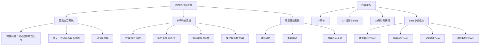

# 《卡片魔王：只剩个头！》游戏分析

## 🎮 基础信息
- **游戏名**: 卡片魔王：只剩个头！（CardVenture: JustAHead!）
- **开发商**: YuWave（开发者：鱼尾，B站账号"鱼尾鱼尾想玩游戏"，一人独立开发）
- **发行商**: YuWave
- **发行年份**: 2025年6月8日（Steam 正式版）；安卓 TapTap 版同步上线
- **平台**: PC（Steam）、Android（TapTap 等）
- **类型**: 动作 Roguelite / 同步回合制 / 卡牌构筑
- **游玩时长**: 约 20-30 小时通关，高重玩价值
- **游玩状态**: ☐ 游玩中 ☐ 通关 ☑ 分析研究 ☐ 放弃
- **个人评分**: ⭐⭐⭐⭐ (创意扎实，执行层面尚需打磨)
- **Steam 评分**: 特别好评（Demo 阶段 99% 好评，109 条评测）
- **第三方评分**: 3DM 8分

---

## 🎯 核心体验

### 一句话定位
手残玩家也能打弹反的动作 Roguelike——用"我动敌才动"的同步回合制骨架，包裹一层双动（闪避/弹反）的即时动作风味，让操作焦虑消失，策略深度留下。

### 核心循环
```
[局内主循环]
移动探索随机迷宫 → 触碰/破坏环境与敌人 → "双动"触发闪避或弹反
→ 战斗胜利获得能力卡 → 围绕武器特色构筑流派 → 挑战关底 Boss 小游戏

[元循环]
通关/失败 → 解锁腐化技能树（15层递进）→ 新流派/武器解锁 → 下一局从新出发
```

### 记忆点
1. **"手快动两下"（双动机制）**：第一次发现不动就不会受伤，然后发现敌人攻击瞬间快速输入两次方向键可以完美弹反——把回合制游戏玩出了格斗游戏的感觉
2. **Boss 即小游戏**：遇到化身俄罗斯方块的 Boss，拿不断下落的方块去砸他；遇到"象棋 Boss"，对方按马走日规则移动，玩家要预测路线——每个 Boss 都重置了战斗规则
3. **卡片世界的破坏感**：地形、宝箱、墙壁、NPC 全是卡片材质，用头颅撞一切——视觉反馈和物理破坏感在卡通风格下反差极强

---

## 🧠 系统架构



### 主要系统拆解

#### 同步回合制 + 双动系统（核心创新）
- **设计目标**: 让不擅长快速操作的玩家也能体验动作游戏中"弹反"这一高峰时刻，同时保留策略思考空间
- **核心机制**:
  - 基础层：玩家不行动，敌人不行动（同步回合制，参考《节奏地牢》但去掉了节拍压力）
  - 创新层：**双动（Double Move）**——当敌人攻击动画触发时，存在一个输入窗口，玩家在此窗口内快速输入两次方向键：
    - 向远离攻击方向双动 → 完美闪避
    - 向迎击攻击方向双动 → 弹反（反伤或反制）
  - 结果：回合制的"暂停思考"特权与即时动作的"反应技巧"在同一系统里共存
- **深度来源**:
  - 新手路径：慢慢思考，逐步移动，用回合制逻辑避开攻击
  - 高手路径：快速双动做弹反，制造流派协同（弹反触发能力卡效果）
  - 高手与新手的差距：同一游戏里操作频率不同，但都能生存——这才是真正无门槛的设计
- **设计亮点**: 双动机制是一个正交性极强的设计——它与回合制框架不冲突，又为动作玩家打开了新的深度维度；这是同步回合制这一品类中真正的差异化创新，而非《杀戮尖塔》式的纯卡牌策略路线

#### 卡牌构筑与流派系统
- **设计目标**: 每局游戏都能形成截然不同的角色定位，高重玩价值
- **核心机制**:
  - 14种基础武器（拳刺/雷刀/大剑/眼球等），各有独立技能逻辑和协同加成方向
  - 200+能力卡片，每局抽取机制随机给牌
  - 10+种流派方向：闪电链流、炸弹流、召唤蝙蝠流、召唤食人花流、手里剑流、无敌流等
  - 腐化技能树：15层解锁，选择影响后续局内进程
- **深度来源**:
  - 武器决定构筑方向（要先有武器才知道应该拿哪些卡）
  - 流派协同需要玩家主动发现卡牌间的联动规则
  - 双动弹反可以和部分流派产生联动（例如弹反触发闪电爆发）
- **设计亮点**: 武器作为构筑"锚点"——不是先有卡再找武器，而是武器定性格，卡牌强化特性，比《杀戮尖塔》的"先选职业"模式多了一层局内的方向发现感

#### Boss 小游戏库
- **设计目标**: 每个 Boss 战成为独立的、一次性的核心体验高峰，避免重复性
- **核心机制**:
  - 每个 Boss 引入全新的规则小游戏（俄罗斯方块、象棋走位、卡牌对决、消除类等）
  - Boss 战期间游戏规则完全切换，玩家需要理解并利用新规则取胜
  - 非纯操作挑战，而是"读懂规则，寻找漏洞"的解谜式思维
- **深度来源**: 每个 Boss 是一次认知重置——玩家不能靠记忆套路，必须在 Boss 战时现场学习
- **设计亮点**: "Boss 即独立小游戏"将 Boss 战从动作游戏的"操作考核"改造为解谜游戏的"规则理解考核"，规避了操作门槛，同时保留了惊喜感和挑战感

#### 环境互动系统
- **设计目标**: 让"地图探索"本身成为一种玩法，而非单纯的通道
- **核心机制**:
  - 场景万物皆卡片材质，几乎所有元素都可以被头颅撞击破坏
  - 地形可以被推动（推箱阻敌、开路）
  - 引导敌人进入特定位置触发环境伤害
  - 隐藏宝箱嵌入可破坏地形内
- **设计亮点**: 环境互动将"移动"这个原本中性的操作变成了策略资源——每次移动都可能是攻击、探索或战术布局

---

## 🎨 体验层分析

### 手感与操控
方向键控制滚动的头颅，操作极简（大部分互动只需方向键），上手门槛接近零。同步回合制去除了时间压力，玩家可以随时停下来思考。当成功触发双动弹反时，反馈极强——这个"发现弹反存在"的时刻是游戏最重要的手感提升节点。整体节奏由玩家自己决定，慢节奏思考和快节奏双动都有充分的空间。

### 关卡/内容设计
7个章节、70+怪物与Boss、18种特殊房间、随机迷宫地图——内容体量对于一人开发来说相当可观。然而关卡内容驳杂是主要问题：推箱子、一笔画、扫雷、押注斗蛐蛐等益智关卡与同步回合制核心玩法不强绑定，打断了肉鸽游戏节奏的连续性。玩法引导分散，关键深度内容（技能融合、卡牌联动）解锁节奏拖沓，被主支线进度锁住，导致前中期体验比实际系统深度浅。

### 叙事与世界观
圣历159年，魔王被斩首后头颅在王座上苏醒，踏上复仇之路——挑战篡位的黑龙女皇，揭开被封印的真相。3个不同结局。叙事风格以黑色幽默和自嘲为主，游戏本身不追求严肃叙事，更多是把世界观当作荒诞背景板来服务轻松氛围。"被砍掉头的魔王"这个设定本身就是一个扁平化手绘美术的最佳注解——荒诞但可爱。

### 美术与音乐
明亮扁平化手绘美术，卡通风格鲜明。所有元素用卡片材质构成的视觉统一感很强，强化了"世界由卡片组成"的世界观主题。黑暗主题（魔王复仇）与明亮美术的反差制造了独特的黑色幽默氛围，与游戏玩法风格（严肃回合制框架+轻松动作风味）完全一致。音乐信息不足，但从视觉风格推断应是轻松冒险风格配乐。

---

## ⚖️ 设计取舍分析

| 设计决策 | 得到了什么 | 放弃了什么 | 被什么约束逼出来的 |
|---------|-----------|-----------|-----------------|
| 同步回合制（而非即时动作） | 极低操作门槛，任何人都能体验弹反；策略思考空间完整保留 | 即时动作带来的肾上腺素感，战斗节奏的流畅连贯性 | 开发者目标是"让手残玩家也能体验动作爽感"——只能降低而非取消操作门槛，同步回合是最简洁的解法 |
| 双动作为弹反触发 | 回合制框架内实现了即时动作的反应风味，产生极强的品类差异化 | 弹反触发的精准度不如即时动作（窗口较宽，非精确timing） | 在同步回合制下模拟即时动作反应的结构性约束——双动是唯一能在回合制框架内有"时机感"的机制 |
| 所有玩法元素"烩一锅" | 内容极度丰富，玩家每次游玩都有意外发现；开发者的所有灵感都能实现 | 核心玩法连续感被打断；推箱子/扫雷与回合制动作割裂，部分玩家体验断层 | 一人开发者的表达欲与整合资源有限的矛盾——无力做精制的体验设计，只能尽量堆内容多样性 |
| 流派强弱差距大（粗糙平衡） | 少数流派的爆发瞬间非常爽快；低强度流派为高手提供了"自我挑战"空间 | 多数玩家会遭遇流派强弱不公平感，某些局因随机给牌只有弱流派而感到挫败 | 一人开发的数值平衡工作量远超设计和开发——平衡性是所有独立游戏中最难做到的部分，往往被牺牲 |
| Boss 引入独立小游戏规则 | 每个 Boss 战是唯一的认知高峰体验，完全规避了"背板记招"问题；非操作挑战覆盖更广玩家 | Boss 战内容与主玩法脱节，高技巧玩家在 Boss 战反而失去了核心技巧用武之地 | 开发者希望 Boss 战有高度创意和惊喜感，而同步回合制框架下的高难 Boss 战难以从操作层面升级——用规则切换代替操作升级 |
| 安卓同步上线 | 覆盖中国玩家最大的游戏市场；TapTap 评分体系带来额外口碑渠道 | 移动端操作适配增加开发成本；PC 与移动端体验体验一致性挑战 | 开发者是国内独立游戏人，国内 PC 市场体量远小于移动端，必须同时覆盖才能最大化触达 |

---

## 💡 值得借鉴的设计

1. **双动作为"操作门槛渐进层"的实现**：在自己的回合制游戏中，如果希望有即时动作风味，可以参考"在敌方行动触发的时间窗口内二次输入 = 触发特殊反馈"的模式。不必要求玩家实时精确timing，只需在回合切换的窗口期检测是否有额外输入，即可实现"有操作技巧的回合制"。具体实现：记录敌人攻击动画开始到结束的帧范围，在此期间监听是否有移动输入 × 2，方向判断闪/反。

2. **Boss 即独立规则小游戏**：Boss 战不必在同一套规则体系下升级难度。可以在 Boss 战阶段引入完全不同的游戏规则（消除、棋类走位、俄罗斯方块等），并利用玩家在主玩法中积累的能力卡来适配新规则。这个设计可以直接应用到自己项目的 Boss 设计中：**每个 Boss 引入一个"规则变体"（Rule Mutation），主角的能力集与新规则的交叉点成为胜利的关键**。代码层面：Boss 战是独立的 GameMode 而非普通关卡，切换 GameMode 时保留玩家状态但替换战斗规则。

3. **"头颅即角色"的移动即攻击设计**：《卡片魔王》用"用头颅撞击一切来触发互动"消除了"移动"和"攻击"的区别——同一个操作（移动方向键）完成了探索、攻击、破坏三件事。这是 Roguelike 中减少操作复杂度的优秀案例。在自己的俯视角游戏设计中，可以考虑：**主要操作动词只有一个（移动），交互结果由目标对象的属性决定**——而非设计独立的攻击/互动按键。

4. **武器作为流派"锚点"而非数值选项**：武器系统的关键不是武器本身的强度，而是武器定义了构筑方向——玩家看到一把武器，就知道应该朝哪个方向取卡。这比《杀戮尖塔》的"先选职业"更动态，因为每局的武器不同。应用点：在自己的构筑类项目中，**给核心装备类道具分配"流派标签"，让它成为玩家本局构筑决策的信号灯**，而非单纯的数值加成。

5. **"从一个 BUG 发现核心机制"的设计考古学**：开发者鱼尾在 B站分享了这款游戏起源于一个 BUG（"因为 BUG，我把回合制走格子做成了动作肉鸽爽游"）。同步回合制 + 双动的核心机制最初是一个意外，开发者识别了这个意外的游戏性价值并把它做成了核心。启发：**在自己的原型阶段，不要只看设计文档描述的行为，要观察"意外出现的行为"并问自己它是否有游戏价值**。

---

## ❌ 不足与问题

1. **流派平衡粗糙，强弱牌差距过大**：部分流派（如闪电链流）极强，部分流派因构筑条件苛刻或机制协同不足导致很弱。随机给牌机制在流派不平衡的情况下，会让玩家感受到"这局是随机决定输赢，而非自己决定"。改进方向：在随机抽牌池中加入流派权重偏向，或在检测玩家武器类型后调整牌池比例，确保每局都有至少一条可行构筑路线。

2. **关卡元素驳杂，核心玩法连续性断裂**：推箱子、扫雷、一笔画、押注斗蛐蛐等益智关卡与同步回合制动作玩法缺乏联动，体验上是硬切换而非自然融合。一人开发者把所有觉得有趣的东西都放进去，但缺乏"体验设计的剪裁意识"。改进方向：将特殊关卡改造为与主玩法有规则交叉的变体（如"推箱子关卡里敌人仍然存在，需要用箱子阻挡攻击"），而非完全切换到独立模式。

3. **关键深度内容解锁节奏太慢**：技能融合、卡牌联动、隐藏关卡的解锁被主线进度锁定，导致前期体验深度比实际系统浅——玩家可能在"感觉看透了游戏"的时候放弃，实际上真正的深度还未解锁。改进方向：将部分高深度内容提前开放（至少让玩家在前两小时内能看到一次技能融合），或在每局开始时给予"本局限定的深度预览"（类似 Hades 的礼物预览机制）。

4. **Boss 小游戏与主角能力的交叉点不够清晰**：Boss 引入独立规则是亮点，但部分玩家反馈"不知道自己的能力卡在 Boss 战里能做什么"——即主玩法系统与 Boss 规则系统的接口不够透明。改进方向：在 Boss 战开始时，用一句简短提示告知玩家"你的 XX 能力在此 Boss 战中会 [具体效果]"，帮助玩家主动策划而非随机尝试。

---

## 🔗 知识关联

### 与已读书籍的关联
- **游戏编程设计模式**：同步回合制的实现是标准的**命令模式（Command Pattern）**——每次移动/攻击被封装成命令对象，敌人订阅玩家命令事件后同步执行；双动机制是**状态模式（State Pattern）**——玩家处于"敌人攻击窗口期"是一个独立状态，此状态下的输入触发不同响应 | 关联强度: ⭐⭐⭐⭐⭐
- **游戏编程算法与技巧**：200+能力卡片的随机抽取是带权重的**加权随机采样**；流派方向检测（当玩家持有某武器时偏向特定牌）是动态权重调整；随机迷宫生成是 BSP（空间二叉分割）或房间种子算法 | 关联强度: ⭐⭐⭐⭐
- **思考快与慢**：双动弹反的发现是一个典型的**系统2认知跃迁时刻**——玩家最初用系统1避开敌人，某次意外触发弹反后，系统2被激活重新理解战斗规则，此后每次战斗都有了新的分析维度；Boss 小游戏规则切换是**"熟悉感主动破坏"**的极端版本——不是在现有框架内破坏规律，而是完全丢弃当前框架；**关键挑战**：游戏用同步回合制消除了系统1的反应焦虑，却同时用双动为系统2提供了可以"主动追求"的技巧层——这挑战了卡尼曼"系统2只在主动邀请时运作"的描述，此处系统2的激活是游戏设计主动提供的发现机会，而非认知失败后的补救 | 关联强度: ⭐⭐⭐⭐⭐
- **架构整洁之道**：Boss 小游戏系统要求 Boss 战逻辑与主玩法逻辑完全分离——**依赖倒置原则**在游戏设计层面的对应：Boss 战（高层模块）不应依赖同步回合制战斗实现（低层模块），而是依赖"接收玩家输入 → 执行规则结算"的抽象接口；每个 Boss 只需实现这个接口，可任意替换底层规则 | 关联强度: ⭐⭐⭐⭐
- **真需求**：游戏满足的"真需求"是"体验动作反应技巧的成就感"而非"打败敌人"——应然是"动作游戏应该要求玩家快速反应"，实然是"玩家真正需要的是'我做了一个正确操作'的确认感"，同步回合制让这种确认感以玩家自己的节奏出现 | 关联强度: ⭐⭐⭐⭐

### 与其他游戏的横向对比
- **节奏地牢（Crypt of the NecroDancer）**：最直接的同步回合制先驱，节奏地牢要求玩家跟随音乐节拍踩点，操作压力反而比传统动作游戏更高；卡片魔王去掉节拍约束，只保留"我动敌才动"的底层逻辑，再叠加双动，做出了节奏地牢没有的"手残友好动作感" | 类型: 设计传承+差异化
- **杀戮尖塔2（Slay the Spire 2）**：同为卡牌构筑 Roguelite，但战斗时序完全不同——StS2 战中密集手牌决策，卡片魔王战斗中以移动和双动为主，卡牌是战前/战后的增益选择；StS2 的深度来自纯卡组协同思考，卡片魔王深度来自"移动策略+双动时机+流派选择"三维交叉 | 类型: 同类对比
- **空洞骑士（Hollow Knight）**：在探索感和手绘美术上有明显参考，开发者也在 Steam 页面提到"有《空洞骑士》的探索感"；但空洞骑士是实时动作+叙事驱动，卡片魔王是同步回合制+流派构筑驱动，探索目的不同（HK探索解锁叙事，卡片魔王探索扩展构筑资源） | 类型: 参考来源
- **以撒的结合（The Binding of Isaac）**：构筑深度参考来源，随机道具组合制造流派涌现的设计逻辑相似；以撒是即时动作，卡片魔王是回合制，但"用随机道具组合涌现出不同流派"的设计哲学相同；两者最大差异：以撒失败归因混乱（操作失误+随机不公），卡片魔王回合制使失败归因更清晰 | 类型: 同类对比
- **小丑牌（Balatro）**：都是"在已知框架上叠加新机制层"（小丑牌=扑克+数值爆炸，卡片魔王=回合制+即时动作风味）；小丑牌的爽感来自数值乘法爆炸发现，卡片魔王的爽感来自弹反时机发现；前者无操作门槛，后者有双动技巧层——但两者都选择了"降低基础门槛+保留深度入口"的设计路线 | 类型: 同类对比

### 对自身项目的启发
如果在做回合制或策略类游戏，可以直接借鉴的机制：

1. **"行动窗口期检测"架构**：在敌方行动动画开始到结束的帧范围内，设置一个 Input Buffer 状态，此状态下的特定输入（如方向键 × 2）触发弹反/闪避反馈。这个架构让回合制游戏在不改变底层规则的情况下获得了"操作有技巧感"的属性。

2. **Boss 战的 GameMode 切换模式**：将每个 Boss 战实现为独立的 GameMode，保留玩家所有已有能力作为"输入参数"，但用不同的"结算规则"处理这些输入。新增 Boss 不需要修改战斗系统，只需实现新的结算规则接口。

---

## 📊 总结

### 最大的收获
**"操作门槛"和"操作深度"可以被解耦**。同步回合制消除了时间压力（降低门槛），双动机制在此基础上开辟了"愿意追求的技巧层"（保留深度）——这两件事不必是权衡关系，可以在同一个系统里同时实现。门槛是"必须达到才能玩"，深度是"愿意追求才能感受到"——设计时应先识别玩家的哪些焦虑是必须消除的，再识别哪些技巧是值得提供入口的。

### 核心结论
《卡片魔王：只剩个头！》的本质是：**一个独立开发者找到了同步回合制这个精准的设计框架，把"手残玩家无法体验动作游戏高峰时刻"这个真实痛点解决得相当优雅**。双动机制是货真价实的品类创新，Boss 小游戏设计体现了极强的创意密度。主要限制来自一人开发的整合能力上限——关卡元素杂而不精，流派平衡粗糙——但底层设计哲学非常清晰，执行瑕疵可以随版本迭代修复。对于独立游戏而言，这已经是一个非常高质量的作品。

**改变了我的一个认知**：我以前认为"降低操作门槛"必然以"牺牲操作技巧"为代价。卡片魔王证明：操作门槛（必须达到）和操作深度（愿意追求）是两个独立设计变量，可以同时优化。同步回合制把前者降到接近零，双动机制把后者提供为可选高峰体验——两个机制服务于完全不同的玩家需求，不需要互相妥协。

---

**分析创建时间**: 2026-07-06
**最后更新**: 2026-07-06
