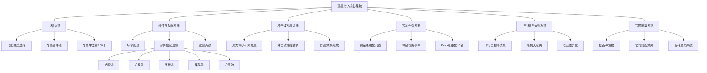

# 《孤星猎人》（Lonestar）游戏分析

## 🎮 基础信息
- **游戏名**: 孤星猎人（Lonestar）
- **开发商**: Math Tide（数字潮汐工作室）
- **发行商**: Thermite Games
- **发行年份**: 抢先体验 2024年1月18日 / 正式版 2025年4月3日
- **平台**: PC（Steam / Epic Games）/ Windows / macOS
- **类型**: 策略 Roguelike、回合制卡牌构筑、飞船对战
- **Steam 评分**: 非常好评（90%，全语言 2144 条）
- **游玩状态**: ☐ 游玩中 ☑ 通关 ☐ 白金/全成就 ☐ 放弃
- **个人评分**: ⭐⭐⭐⭐ (4星)

---

## 🎯 核心体验

### 一句话定位
玩家扮演宇宙赏金猎人，通过收集飞船部件、搭配功率流派，在**冲击波对称战场**上用策略构筑击败通缉犯——这是一款用飞船部件替代卡牌的 Roguelike 构筑游戏，核心满足感来自"我比敌人多算了一步"。

### 核心循环
```
【局内循环】
选择飞船 → 选飞行员（技能/天赋） → 接受赏金任务 → 
积累部件/功率 → 对波冲击战斗 → 获得奖励/宝物 → 升级循环

【战斗循环】
双方积累能量 → 触发冲击波碰撞 → 功率/部件效果结算 →
判断胜负 → 收获奖励 → 进入下一个任务

【元循环】
通关/失败 → 解锁新飞船/飞行员/部件 → 发现新流派可能性 →
挑战更高进阶难度（1-9+）
```

### 记忆点
1. **"功率爆炸"顿悟时刻** — 第一次把飞船功率堆到 48 并启动超频，看到己方冲击波把对手碾压，理解了功率流的真正上限那一刻
2. **反直觉的"对称战场"** — 战斗没有先手攻击、没有奇袭，双方完全同步积累能量，然后公平碰撞。这打破了大部分策略游戏的"先手优势"假设
3. **"带薪假期"随机事件** — 完成赏金任务后进入假期阶段，随机事件提供资源和叙事选择，轻松诙谐的太空赏金猎人故事在这里展开
4. **进阶 8 难度的"读档奇迹"** — 高进阶难度下对手部件强度大幅提升，旧有流派认知被推翻，重新发现连锁流/扩散流的场景

---

## 🧠 系统架构



### 主要系统拆解

#### 冲击波战斗系统（核心差异化系统）
- **设计目标**: 消除传统卡牌/策略游戏中先手优势带来的"谁先动谁占便宜"问题，用**完全对称的双方积累-碰撞结构**，让战斗的决定性因素回归到构筑质量而非行动顺序
- **核心机制**:
  - 双方飞船同步积累功率（Power），互相看不到对方当前积累进度
  - 积累到触发阈值时，发射冲击波（Shockwave）正面碰撞
  - 冲击波强度由飞船部件效果、功率值、天赋加成共同决定
  - 没有"奇袭"机制，官方描述为"without any surprise attacks"——所有加成都是透明可预期的
- **深度来源**: 深度来自于**信息不对称下的预判构筑**——玩家看不到对手本轮实际积累了多少，但可以通过观察对方部件推测其流派，在自身部件选择上提前针对性强化
- **设计亮点**: 对称战斗的哲学意味着每次失败都是纯构筑失误而非先手亏损——失败的可归因性极强，触发"再来一局"冲动

#### 部件与功率系统
- **设计目标**: 用"功率积累"替代传统卡牌游戏的"手牌管理"，降低随机性带来的失控感，让玩家建立对"我的飞船本局能到多强"的清晰预期
- **核心机制**:
  - 每个部件有功率值，飞船总功率 = 所有部件功率之和
  - 超频（Overcharge）是功率突破上限后的爆发状态，提供额外加成
  - 部件存在**协同效果**：光束核心 × 毁灭核心 → 连锁爆发；增殖核心 → 复制其他部件效果
  - 主要流派路线：功率流（堆积总功率）、扩散流（多目标低损耗）、连锁流（核心到核心链式传递）、集群流（数量优势）、护盾流（防御反击）
- **深度来源**: 流派并非"哪个最强"而是"哪个针对当前通缉犯最有效"——选流派是读对手然后决策，不是找最优解然后执行
- **设计亮点**: 功率管理比手牌管理有**更强的连续感**——玩家始终感受到飞船在变强（功率在升），而非抽到糟糕牌型时的无能为力感

#### 飞行员与天赋系统
- **设计目标**: 提供差异化的初始定向，让同一艘飞船在不同飞行员下产生完全不同的流派路径，确保每局开局感都有新鲜感
- **核心机制**:
  - 数十位飞行员，各自携带不同主动技能和被动特性
  - 飞行员有**随机天赋树**，同一飞行员每次游玩解锁不同天赋
  - 特色飞行员如"惯偷沃尔菲"（特化偷取对方部件）、护盾号专用飞行员（防御反击流）
- **深度来源**: 飞行员技能与天赋的具体组合形成"本局专有构筑方向"，这要求玩家在游戏初期就做出方向性判断，而非在局中随机堆砌
- **设计亮点**: 随机天赋树是**细粒度随机**的良好应用——开局基础技能是确定的（可预期），但具体天赋路线是随机的（有新鲜感）；与暖雪的圣物四效果设计同属一类思路

#### 赏金任务与叙事系统
- **设计目标**: 提供区别于纯战斗 Roguelike 的故事感，让每局"解读宇宙中的罪案"而非"重复清关"
- **核心机制**:
  - 近 100 名通缉犯，含 15 名极度危险的 Boss 级重犯
  - 完成赏金后进入**带薪假期**（Vacation）阶段，提供随机叙事事件和资源奖励
  - 假期中遭遇随机事件（如宇宙驿站补给、奇特商人）作为局间节奏缓冲
- **深度来源**: 每个通缉犯携带不同部件偏好和特殊机制，形成自然的"克制关系"——某些流派对特定通缉犯天然克制
- **设计亮点**: 叙事节拍分配合理，"任务→假期→任务"的节奏切换有意避免高强度战斗的疲劳感

---

## 🎨 体验层分析

### 手感与操控
回合制策略游戏，操控本身无"手感"可言，但**等待冲击波碰撞结算的短暂悬停感**设计非常精准——玩家知道自己构筑了什么，但碰撞结算的视觉演出（能量波碰撞的动画）在每次战斗都制造出"期待-验证"的完整情绪弧线。这种视觉反馈是将"数学结算"转化为"身体感知"的核心桥梁。

### 关卡/内容设计
- 早期通缉犯作为新手保护盾，部件需求明显，流派引导清晰
- 进阶难度（1→9+）是通过提升对手部件强度和组合复杂度实现的，不是单纯数值膨胀
- 百科全书系统解决了"有哪些部件""每种核心有哪些协同"的信息查阅需求——优先让玩家理解系统，而非靠记忆积累

### 叙事与世界观
宇宙赏金猎人题材提供了天然的"每局一个任务"叙事框架。每位通缉犯有其背景故事，通缉令格式排版提供了视觉和叙事上的在场感。叙事轻度，不是卖点，但不会成为负担——带薪假期的诙谐事件是叙事中少有的真实幽默点。

### 美术与音乐
像素/矢量混合的科幻风格，颜色对比鲜明，部件图标辨识度高（重要——玩家需要快速识别对手部件）。音乐节奏感强，战斗结算阶段有明显的高潮音效配合冲击波碰撞，强化了等待→碰撞的情绪弧线。

---

## ⚖️ 设计取舍分析

| 设计决策 | 得到了什么 | 放弃了什么 | 被什么约束逼出来的 |
|---------|-----------|-----------|-----------------|
| 冲击波对称战斗（无先手优势） | 失败完全可归因于构筑，大幅提升失败后继续游玩的动力 | 传统先手策略带来的"时机选择"博弈乐趣；战斗缺乏实时决策层 | 开发者希望竞技核心在"构筑优劣"而非"谁先出手"——对称性是设计哲学的前提，不是妥协 |
| 部件代替卡牌 | 功率积累提供清晰成长感，构筑的"飞船实体化"比抽象卡组更有代入感 | 卡牌游戏特有的"手牌管理"策略层；随机抽牌带来的应对多变感 | 目标受众是喜欢确定性强的策略玩家，飞船主题与部件安装的概念模型天然吻合 |
| 随机天赋树（同一飞行员不同天赋） | 每局开局差异大，重复游玩价值高，新鲜感持续时间长 | 天赋随机带来的"本局被迫用次优路线"挫败感；飞行员感知可能不稳定 | 细粒度随机是这类 Roguelike 延长有效游玩时长的主要手段，需要在新鲜感和挫败感之间找平衡点 |
| 无奇袭/隐藏信息战斗 | 门槛低，上手快，失败感清晰，适合 Roguelike 教学过程 | 信息博弈和虚张声势等高级策略层的缺失；PvP 场景下策略深度受限 | 单机 PvE 环境下隐藏信息的成本（玩家需要猜测 AI 意图）高于收益，优先简化战斗认知负担 |
| 带薪假期节奏调节 | 战斗-缓冲-战斗节奏明确，避免策略疲劳；叙事事件提供情感多样性 | 游戏整体节奏偏慢；非战斗阶段资源获取随机性带来的"假期质量"差异 | 高强度策略构筑游戏需要有意识地插入低认知负担阶段，保证体验持续吸引力 |
| 百科全书系统（内置部件查阅手册） | 大幅降低"需要记住所有部件协同"的认知门槛，让新玩家更快进入深层构筑 | 游戏内查阅打断节奏；熟悉玩家感到冗余 | 部件数量庞大（数百种宝物），若无内置参考，新玩家在信息过载下无法有效构筑，造成不合理挫败感 |

---

## 💡 值得借鉴的设计

1. **对称战场消除先手不平等**：在自己项目中，如果战斗核心是"构筑质量"而非"操作时机"，可以考虑消除先手优势——让失败完全可归因于构筑决策，而非"我慢了一秒"。自动战斗类游戏（自走棋、卡牌 Roguelike）特别适合这一原则，对应到自己项目的背包乱斗类战斗系统，可以保证"我是这样搭的所以输了"比"我输在了行动顺序"更频繁出现

2. **功率/能量积累替代手牌抽取的成长可见性**：传统卡牌游戏的抽牌机制容易制造"没抽到好牌"的挫败感，而功率积累模式的优势是**成长曲线完全可见且可掌控**——玩家始终感受到飞船在变强。如果在自己项目中有类似"资源积累→爆发"的系统，让积累过程可视化（进度条/数值显示）是重要设计点

3. **细粒度随机嫁接在固定基础上**：孤星猎人的飞行员基础技能固定，但天赋树随机——这是细粒度随机的理想应用方式。对应到自己项目：如果设计职业/角色系统，可采用"职业基础能力固定（玩家可预期这个职业是干什么的）+ 具体天赋/成长路径随机"的结构，而非"整个职业都随机"或"整个职业都固定"。前者在关卡设计层随机（选到什么关卡），后者在系统内随机（同一关卡不同效果），孤星猎人选的是后者

4. **百科全书/内置参考系统降低信息记忆负担**：当系统复杂度高到玩家无法靠记忆应对时，与其要求玩家"玩多了自然会"，不如直接在 UI 中内置系统化的参考工具。自己项目中若涉及大量物品协同效果（如背包乱斗类），在物品详情 UI 中直接展示"与 X 协同时的效果变化"是减少新手挫败感的必要设计

5. **用带薪假期打节奏**：高强度决策游戏的疲劳问题普遍存在。孤星猎人用"假期随机事件"作为战斗阶段的缓冲器，低认知负担的叙事阶段让玩家有空间享受故事。自己项目中，如果核心是高密度策略，有意识地插入低负担阶段（如探索、收集、对话）是保证长时游玩吸引力的实用手段

---

## ❌ 不足与问题

1. **战斗结算缺乏实时决策层**：冲击波对称战斗的设计哲学虽然清晰，但代价是**战斗过程中几乎没有玩家行为介入空间**——积累开始后玩家能做的就是等待结算。这在构筑成型后会让战斗阶段变得形式化，失去紧张感。改进方向：引入"战斗中途可消耗的单次技能"或"特殊核心的主动触发机制"

2. **高进阶难度对新玩家不友好的陡增曲线**：进阶 1→4 的难度递增相对平滑，但 5→9+ 阶段专门针对特定流派的反制机制会让不了解高进阶敌人配置的玩家产生"突然不知道怎么赢"的认知断层。改进方向：在进阶解锁时给出该阶段常见对手流派的提示，降低"为什么突然变得这么难"的迷茫感

3. **叙事深度有限**：赏金猎人宇宙世界观有较大延展空间，但目前通缉犯的背景故事相对简短，"假期随机事件"的内容库有限，重复度较高。对长期玩家而言，叙事新鲜感衰减较快。改进方向：增加通缉犯专属剧情线（完成特定顺序的赏金后解锁更深故事），将叙事与构筑选择挂钩

4. **流派多样性的实际均衡问题**：尽管官方宣传有功率流、扩散流、连锁流等多个流派，但玩家反馈显示特定难度下功率流数值上限显著高于其他流派，存在"最优流派"收敛问题。这不是罕见问题，但会让"多样性"承诺打折。改进方向：对不同流派的上限天花板做单独压力测试，确保每个流派在高进阶都有"成功路径"

5. **Epic 免费领取带来的预期错位**：游戏曾多次在 Epic 免费领取，吸引了大量不熟悉策略 Roguelike 的玩家，但较高的系统复杂度与他们的预期有落差，导致短期评论中有"太难"和"不知道怎么玩"的声音。这不是设计问题，而是发行策略带来的受众匹配问题

---

## 🔗 知识关联

### 与已读书籍的关联

- **《游戏编程设计模式》**：部件系统的核心——每种"核心"（光束核心/毁灭核心/增殖核心）是**策略模式**的 Roguelike 化版本：每个核心对象携带独立的功率计算和触发逻辑，冲击波结算时统一调用各部件的"apply"接口。增殖核心（复制其他部件效果）是**装饰器模式**的游戏实现——运行时动态叠加效果而不修改原有部件 | 关联强度: ⭐⭐⭐⭐⭐
- **《游戏编程算法与技巧》**：进阶难度的对手部件配置是**权重随机采样**的典型应用——高进阶对手出现特定克制部件的概率更高，而非完全随机；百科全书需要高效的部件索引系统，哈希表查找是显然实现 | 关联强度: ⭐⭐⭐⭐
- **《思考快与慢》**：冲击波对称战斗的可归因失败设计，是**强制激活系统 2** 的刻意设计——失败后玩家无法抱怨"先手亏"或"抽牌运气差"，只能用系统 2 复盘"我的构筑哪里出了问题"。另外，飞行员+天赋的随机组合会制造**可管理的意外感**，系统 1 发现意外组合时自动产生的"哇原来这两个部件这么搭"的惊喜感是复玩的重要驱动力之一 | 关联强度: ⭐⭐⭐⭐⭐
- **《架构整洁之道》**：孤星猎人的系统分层清晰——战斗结算逻辑（功率计算、效果触发）与视觉表现（冲击波动画）严格分离，使得"增加新部件"不会影响战斗结算引擎的稳定性；依赖倒置原则：结算引擎依赖"部件效果接口"而非具体部件类 | 关联强度: ⭐⭐⭐
- **《游戏编程设计模式》（游戏循环与更新）**: 双方同步积累能量的战斗系统暗示了一个**并行状态机**结构——玩家飞船和敌方飞船各自是独立的状态机，同步更新，碰撞检测决定游戏状态切换；每轮积累→碰撞→奖励是一个完整的**游戏状态机**循环 | 关联强度: ⭐⭐⭐⭐

### 与其他游戏的关联

- **杀戮尖塔2**：同为 Roguelike 构筑，但核心资源管理方式截然不同。STS2 的资源是"牌组厚度和卡牌质量"，孤星猎人的资源是"飞船功率总量"；STS2 深度来自卡牌协同的逻辑构建，孤星猎人深度来自流派的方向押注；STS2 战斗有持续的手牌操作决策，孤星猎人战斗决策在构筑期全部完成——这是"战斗中决策密度"的两种极端选择 | 类型: 同类对比
- **小丑牌（Balatro）**：两者同为 Roguelike 构筑，但满足感来源不同。小丑牌的爽感来自"数值乘法爆炸的发现感"，孤星猎人的爽感来自"构筑策略压倒对手的优越感"；小丑牌用扑克规则提供零门槛切入，孤星猎人用"飞船部件"的直觉模型做切入；小丑牌深度隐藏在乘法认知中，孤星猎人深度在于流派选择 | 类型: 同类对比
- **FTL: Faster Than Light**：同为太空题材 Roguelike，但设计哲学相反。FTL 强调**资源管理和危机响应**（实时战斗、船员分配、随机事件的高风险决策），孤星猎人强调**事前构筑和流派优化**（战斗结算纯自动，重心在部件搭配）；FTL 的紧张感来自"当下要怎么做"，孤星猎人的满足感来自"提前想好了" | 类型: 同题材设计哲学对比
- **背包乱斗**：两者都引入了构筑类游戏的"载体实体化"概念（飞船 vs 背包），让抽象的构筑行为有了物理实感。不同在于：背包乱斗的策略维度是"空间布局"，孤星猎人的策略维度是"流派方向押注" | 类型: 构筑实体化模型对比

### 对自身项目的启发
1. **对称结算作为公平性基础**：若开发竞技性或 PvE 策略游戏，从设计层解决"先手优势"问题（而非用数值补偿）可以大幅提升失败后的体验质量
2. **能量积累的可视化**：任何以"积累→爆发"为基础的系统，让积累过程对玩家可见可感知（而非数值突变）是极有价值的体验优化方向
3. **内置参考系统是系统复杂度的必要配套**：系统复杂度一旦超过玩家工作记忆容量，内置百科全书不是可选项而是必选项

---

## 📊 总结

### 最大的收获
孤星猎人最重要的设计洞察是：**对称战斗结构使"失败的可归因性"成为了游戏的核心设计资产**。传统 Roguelike 中玩家失败后可以把责任分给运气（抽牌差）、先手劣势、随机事件；但孤星猎人用对称冲击波战斗切断了所有这些逃避路径——你的构筑就是你的全部，失败了说明构筑有问题。这种强制可归因性听起来残酷，但实际上是驱动玩家系统 2 复盘并最终提升构筑水平的最有力机制，也是游戏 90% 好评率在策略玩家群体中建立的根本原因。

### 核心结论
孤星猎人是一款用"飞船部件"语言重新表达卡牌构筑 Roguelike 的高完成度作品。它的成功来自两个相互强化的设计决策：**对称战斗使失败完全可归因**（推动复盘和进步），以及**功率积累使成长始终可见**（推动继续游玩）。其国产独立工作室背景、CGDC 分享经历和 Epic 免费领取的传播策略，共同构成了一个值得参考的国产独立策略游戏出海路径案例。

---

**分析创建时间**: 2026-06-29
**最后更新**: 2026-06-29

Sources:
- [Lonestar on Steam](https://store.steampowered.com/app/2056210/Lonestar/)
- B站搜索：孤星猎人游戏评测
- PCGamesN & PC Gamer 评测摘录（经 Steam 页面引用）
