# 《小丑牌》（Balatro）游戏分析

## 🎮 基础信息
- **游戏名**: 小丑牌（Balatro）
- **开发商**: LocalThunk（单人独立开发）
- **发行商**: Playstack
- **发行年份**: 2024年2月20日
- **平台**: PC（Steam）、Nintendo Switch、PS4/PS5、Xbox、iOS、Android
- **类型**: Roguelike 卡牌构筑 / 扑克变体
- **游玩时长**: 10-20小时（初通关）；100+小时（深度挑战）
- **游玩状态**: ☐ 游玩中 ☐ 通关 ☐ 白金/全成就 ☑ 分析记录
- **Steam 评分**: 压倒性好评（98% 好评，19万+ 条评测）
- **Metacritic**: 90分
- **成就数**: 31个
- **标签**: Roguelike、卡牌构筑、扑克、数值爆炸、单人

---

## 🎯 核心体验

### 一句话定位
用非法的扑克牌型和疯狂的小丑牌组合，把分数从几百炸到几十亿——Balatro 是一个**以扑克规则为地基、以乘法爆炸为灵魂的数字上瘾机器**。

### 核心循环

```
【局内主循环】
选牌型出手（消耗出牌次数）
    ↓
触发所有 Joker 效果（按顺序结算）
    ↓
Chips × Mult = 本次得分
    ↓
积累到盲注目标分数 → 击败盲注 → 获得金币 + 奖励
    ↓
进入商店：购买新 Joker / 消耗品 / Voucher

【每轮结构】
Small Blind → Big Blind → Boss Blind（每轮三关）
→ 通过后进入下一"回合"（共8回合，难度递增）

【构筑决策节点】
商店购买：Joker槽位只有 5 格 → 每个新 Joker 都是取舍
消耗品使用：塔罗牌（改卡牌属性）/ 行星牌（升级牌型分值）/ 光谱牌（异常增强）
经济管理：持有金币可获利息，何时花何时存是博弈
```

### 记忆点
1. **第一次乘法爆炸**：构建出第一个"Chips×Mult 双线协同"的 Joker 组合，看着分数从几百突破十万的瞬间——那一刻理解了游戏的灵魂
2. **Boss盲注的强制打断**：以为稳操胜券，Boss盲注宣布"出的牌面朝下无法看见花色"，瞬间现有策略全部失效的绝望感
3. **"这两张 Joker 居然可以这样组合"的发现时刻**：Joker A 触发条件恰好是 Joker B 的输出时机，协同效应超出预期
4. **金币利息的节奏感**：积攒到 $25 银行利息上限时，每次商店赚 $5 利息的满足感，以及在"存钱"和"买 Joker"之间的持续张力
5. **用 5 张牌打出 "同花大顺"（Royal Flush）配合完美 Joker 协同时的数值爆炸**

---

## 🧠 系统架构

```mermaid
graph TD
    A[Balatro 核心系统] --> B[分数系统]
    A --> C[Joker系统]
    A --> D[卡牌操作系统]
    A --> E[消耗品系统]
    A --> F[经济系统]
    A --> G[关卡结构]
    A --> H[牌组系统]

    B --> B1[牌型基础 Chips + Mult]
    B --> B2[单牌加成 各花色/点数]
    B --> B3[最终公式 总Chips × 总Mult]
    B --> B4[目标分数随关卡指数递增]

    C --> C1[加法型 增加+Chips或+Mult]
    C --> C2[乘法型 增加×Mult 最强]
    C --> C3[触发型 特定条件激活额外效果]
    C --> C4[转化型 改变出牌规则]
    C --> C5[槽位上限 默认5格]

    D --> D1[手牌管理 每轮抽8张]
    D --> D2[弃牌机制 每轮3次弃牌机会]
    D --> D3[出牌次数 每关4次]
    D --> D4[增强卡牌 玻璃/钢铁/镀金等]

    E --> E1[塔罗牌 改变卡牌属性/点数/花色]
    E --> E2[行星牌 升级特定牌型基础分值]
    E --> E3[光谱牌 稀有异常增强效果]

    F --> F1[金币收入 击败盲注奖励]
    F --> F2[利息机制 每5金币=1利息上限25]
    F --> F3[商店购买 Joker/消耗品/凭证]
    F --> F4[持有成本 某些Joker有租金]

    G --> G1[Small Blind 目标分数×1.0]
    G --> G2[Big Blind 目标分数×1.5]
    G --> G3[Boss Blind 目标分数×2.0 带特殊限制]
    G --> G4[8个回合 分数要求指数增长]

    H --> H1[15种牌组 不同初始条件]
    H --> H2[红色牌组 多一次弃牌]
    H --> H3[蓝色牌组 多一张手牌]
    H --> H4[魔法牌组 初始有消耗品]
```



### 主要系统拆解

#### 分数系统——乘法爆炸引擎

**设计目标**：制造从"数百分"到"数十亿分"的数值跨度感，让玩家在同一框架下体验到截然不同的力量层级，产生成长的满足感和"我变强了"的直觉确认。

**核心机制**：

```
【牌型基础分值（部分）】
高牌（High Card）：5 Chips, +1 Mult
一对（Pair）：10 Chips, +2 Mult
两对（Two Pair）：20 Chips, +2 Mult
三条（Three of a Kind）：30 Chips, +3 Mult
顺子（Straight）：30 Chips, +4 Mult
同花（Flush）：35 Chips, +4 Mult
满堂红（Full House）：40 Chips, +4 Mult
四条（Four of a Kind）：60 Chips, +7 Mult
同花顺（Straight Flush）：100 Chips, +8 Mult
皇家同花顺（Royal Flush）：100 Chips, +8 Mult

【计算公式】
最终得分 = (牌型基础Chips + 所有打出牌的Chips加成) × (牌型基础Mult + 所有Mult加成 + Mult乘数积累)
```

关键设计洞察：乘法（×Mult）型 Joker 远比加法（+Mult）型 Joker 更有价值——这是指数函数 vs 线性函数的数学必然，也是游戏的核心策略深度所在。玩家理解这个差异的那一刻，是理解 Balatro 的关键认知跃迁。

**深度来源**：
- 行星牌可以反复升级牌型，让基础 Chips 从 5 增长到 200+
- 增强卡牌（钢铁牌：×1.5Mult、玻璃牌：×2Mult 但有30%几率碎裂）引入了风险-收益的牌组管理维度
- 不同 Joker 的触发条件（打出同花时/打出含A的牌时/弃牌时等）使得牌组构筑方向多元化

#### Joker 系统——协同设计的核心

**设计目标**：用 150 张各异的 Joker 卡，在 5 个槽位的严格约束内，创造出近乎无限的策略组合可能性。让每一局的 Joker 组合都是独一无二的，使"下一局会遇到什么"成为持续的探索动力。

**Joker 分类框架**：

| 类型 | 效果模式 | 策略价值 | 典型例子 |
|------|---------|---------|---------|
| **加法型（+Chips）** | 增加固定 Chips | 基础增益，价值相对低 | 出牌后+30 Chips |
| **加法型（+Mult）** | 增加固定 Mult | 中等价值 | 出牌后+4 Mult |
| **乘法型（×Mult）** | 乘以 Mult | 最高价值，后期核心 | ×1.5 Mult |
| **条件触发型** | 满足特定条件时激活 | 构筑方向性强 | 打出含♠时+Mult |
| **持有型（Passive）** | 存在于手中即生效 | 稳定但灵活性低 | 每拥有$1额外+Chips |
| **转化型** | 改变游戏基础规则 | 高风险高回报 | 允许连张不限花色 |

**5槽位的稀缺性设计**：槽位数量是 Balatro 最关键的设计约束——5格远不够放置所有理想的 Joker，每次商店都是痛苦的取舍决策。这与《爱的博弈》中的"稀缺制造价值"逻辑完全一致——正是稀缺性使得每个选择都有意义。

#### 经济系统——利息博弈

**设计目标**：让金币管理成为一个独立的策略维度，在"立即购买强化"和"延迟消费积累利息"之间制造持续张力，避免商店变成无脑购物清单。

**利息机制**：每轮结束后商店阶段，持有金币每满 $5 获得 $1 利息，上限 $5（即持有 $25 时获得最大利息）。这个机制产生了一个清晰的博弈：

```
利息博弈示意：
持有 $20 → 每轮 +$4 利息
  vs
花掉 $15 买一张 Joker → 只剩 $5，每轮 +$1 利息，但拥有了立即强化

"时间价值 vs 即时强化"的每轮决策
```

这个机制来自麻将/扑克的"保留实力"直觉，是将现实经济逻辑游戏化的典型案例。

#### Boss 盲注系统——强制打断与适应性测试

**设计目标**：防止玩家找到单一最优解后无脑重复，通过每三关一次的规则突破，强制测试玩家策略的适应性和冗余度。

**典型 Boss 效果**：
- 出的牌全部面朝下（无法看到花色，同花/同花顺策略失效）
- 所有出牌视为不含牌面的手牌（无法计算点数相关牌型）
- 每次出牌后随机改变一张手牌的花色
- 第一张打出的牌被"冻结"（不参与计分）
- 出手后有概率触发"石牌"效果（从牌堆移除该牌，永久损失）

**关键洞察**：Boss 盲注的设计哲学不是"让你输"，而是"让你证明你的构筑有冗余"。一个好的 Joker 组合应该在多种限制条件下都能工作——Boss 盲注是在筛选脆弱的单一策略和健壮的多维策略。

---

## 🎨 体验层分析

### 手感与操控

Balatro 是一款回合制游戏，操作本身极为简洁——点击选牌、点击出牌。但"手感"来自其他维度：

**数字反馈的满足感**：分数结算时的动画序列是精心设计的——Chips 和 Mult 逐个累加，配合轻微音效，让每次结算都有一种"数钱"的满足仪式感。当最终分数超出盲注目标时的爆炸特效，是视听层面对"成功"的直接奖励。

**视觉混沌的可读性**：后期屏幕上同时存在大量 Joker 效果触发，一次出牌可能触发十几个结算步骤。游戏通过顺序高亮和分步动画，让复杂的结算链保持可追踪——这是体验设计的功力。

### 关卡/内容设计

**指数增长的目标分数**：每个回合的分数要求并非线性增长，而是近似指数增长（大约每回合目标×2-3）。这意味着后期必须有乘法爆炸——加法增强无法跟上需求。这是一个隐藏的"毕业考试"机制：它自然筛选出真正理解乘法 Joker 价值的玩家。

**盲注的三段节奏**：Small→Big→Boss 的三段结构，每次通过 Boss 盲注后的"终于过了"释放感，是设计好的情绪节奏。Boss 盲注是每轮的高潮，也是检验构筑的时刻。

**8回合的完整弧线**：一局游戏大约 30-60 分钟，前期建设基础，中期构成战略，后期验证体系。每局都有完整的弧线感。

### 叙事与世界观

Balatro 几乎没有传统意义上的叙事。世界观极简——赌场氛围的黑色背景、霓虹色的卡牌、模糊的"小丑"形象。但游戏通过 Joker 卡的名称和描述文字，构建了一种隐约的黑色幽默氛围：很多 Joker 名称带有赌博文化的戏谑感，暗示着玩家在进行一场"不该存在的牌局"。

**"非法扑克"的叙事框架**：游戏加载界面有"Playing Balatro is illegal in your country"的反讽提示，这种对"非法性"的强调是品牌定位的一部分——玩家知道自己在玩一个打破了扑克规则的变体，这种"规则破坏者"的身份认同是吸引力的一部分。

### 美术与音乐

**美术**：赌场霓虹像素风，每张 Joker 都有独特的小图标。视觉设计遵循"一眼识别"原则——5张 Joker 槽位在屏幕上始终可见，确保玩家随时能感知自己的当前配置。

**音乐**：Lo-fi 电子乐配合赌场氛围，节奏与出牌节奏隐约同步。重要的是，后期数值爆炸时音乐会有微妙的升调处理，用听觉强化"我变强了"的感知。

---

## ⚖️ 设计取舍分析

| 设计决策 | 被什么约束逼出来的 | 得到了什么 | 放弃了什么 |
|---------|-----------------|-----------|-----------|
| **用扑克牌型作为基础框架而非自创牌型** | 单人开发，无法从零建立玩家认知；需要玩家无教程即能理解"顺子比一对强" | 零学习成本——所有玩家已知扑克规则；普世文化符号激活既有认知 | 自创牌型的可能更大设计空间；不熟悉扑克的玩家会有初始门槛 |
| **Joker 槽位上限5格** | 无上限会导致后期复杂度失控；需要在"组合可能性"和"决策清晰度"间平衡 | 每个 Joker 选择都有重量；稀缺性制造价值感；组合可读性保持 | 无法同时展示所有收集到的 Joker；部分强力组合需要6+才能实现 |
| **分数目标指数递增（非线性）** | 线性递增会让加法增强永远有效，乘法失去意义；需要自然"淘汰"错误策略 | 后期必须理解乘法的玩家自然获得成就感；构筑方向有清晰的正确与错误 | 对新手不友好：很多玩家前几局会不明白为什么突然过不了 |
| **Boss Blind 强制规则变更** | 纯数值竞争会被最优解固化；需要机制打断防止"找到答案后游戏结束" | 每局 Boss 阶段都是新挑战；测试构筑的健壮性而非绝对数值 | 某些 Boss 效果对特定构筑几乎是即时死刑（运气成分加大） |
| **Chips × Mult 而非 Chips + Mult** | 纯加法无法制造跨数量级的感受差异；需要让"好构筑"和"普通构筑"有质的区别 | 数值爆炸感极强；构筑差异显著；乘法 Joker 带来的"翻倍时刻"是游戏高潮 | 数值范围极大（几百到几十亿）带来平衡困难；初期玩家可能不理解为何某局分数这么低 |
| **极简叙事（无剧情）** | 单人开发，叙事成本极高；Roguelike 品类玩家对叙事的优先级相对低 | 开发成本控制；玩家注意力完全在构筑和策略上；游戏节奏不被叙事打断 | 缺乏像 Hades 那样的叙事续航力；通关后缺乏情感钩子驱动再玩 |
| **不设存档点（一局必须打完）** | Roguelike 品类惯例；中途存档破坏压力感和时间投入的价值感 | 每局都是完整体验；死亡和失败有真实重量；胜利感更强烈 | 30-60分钟的游玩时长对碎片化用户不友好；移动端体验受影响（导致主动添加了移动端存档功能） |

---

## 💡 值得借鉴的设计

### 1. 已知框架降低认知门槛——扑克规则的移植策略
**具体设计**：Balatro 用所有人都已知的扑克牌型（一对>两对>三条...）作为基础框架，零教程成本地解决了"玩家理解游戏规则"的问题。扑克规则本身就是一套成熟的认知框架，移植它意味着继承了几代人的直觉训练。

**可落地到自己项目**：在设计新游戏机制时，优先寻找玩家已有认知框架的对应物。不必发明新规则，可以"劫持"已有规则并在其上添加变体层。例如：如果做城市建设游戏，可以用现实城市规划的直觉（住宅区/商业区/工业区的分离）作为基础规则，在此之上添加Roguelike层。

### 2. 乘法 vs 加法——数值设计的核心哲学
**具体设计**：Chips × Mult 的公式，使得乘法型增益的价值与当前累积值成正比——当你已经有 20 Mult，再加 +1 Mult 不如 ×1.5 Mult 的效果（前者+1，后者+10）。游戏从不显式教学这个差异，但让玩家通过体验自然发现。

**可落地到自己项目**：数值系统设计中，引入乘法增益机制可以在不增加数值绝对值的情况下，制造感知上的数量级差异。关键是让乘法 vs 加法的选择对玩家可见且可感知——"这两个道具哪个更值"应该有清晰的答案，但答案需要根据当前状态计算。

### 3. 稀缺性作为决策引擎——5槽位设计
**具体设计**：Joker 槽位的 5 格上限不是技术限制，而是设计决策。它确保了每次看到新 Joker 时，玩家必须思考"我要为它放弃哪个"，而不是"我全要"。稀缺性是决策感的来源。

**可落地到自己项目**：任何构建类系统（技能树、装备栏、队伍编成）都需要显式的槽位/资源约束，才能制造真实的取舍感。约束的数量是关键设计变量：太少（3格）让玩家感到窒息，太多（10格）取舍感消失。参考《杀戮尖塔》的牌组上限（厚牌组会稀释好牌抽到概率）和 Balatro 的 5 格 Joker，都是在不同层面上制造稀缺性。

### 4. Boss盲注的"证明你的构筑健壮"测试设计
**具体设计**：Boss Blind 的特殊效果并不是随机的惩罚，而是系统性地测试特定策略依赖——同花策略、点数策略、弃牌策略都有对应的 Boss 效果可以使之失效。这迫使玩家建立冗余：一个好的构筑应该在多种限制下都能运作。

**可落地到自己项目**：在 Roguelike 或策略游戏的关卡设计中，Boss 阶段可以设计为"验收测试"而非纯粹的数值考验。将常见的单一策略依赖作为 Boss 效果的针对目标，让关卡成为策略健壮性的筛选器，而非纯粹的数值门槛。

### 5. 利息经济——时间价值机制
**具体设计**：每持有 $5 获得 $1 利息（上限 $5/轮）的机制，将经济管理从"能买什么就买什么"变成了"何时消费 vs 何时存钱"的时间博弈。这个机制极简但产生了持续的决策张力。

**可落地到自己项目**：在任何有资源经济的游戏系统中，引入"持有奖励"机制可以将资源管理从单纯的消费决策升级为多维度的时间-价值博弈。关键是让"存"和"花"都有真实的价值，而不是让存储变成无意义的拖延。

---

## ❌ 不足与问题

### 1. 后期随机性过大——某些局面无解
**问题**：在高难度（超级stake）下，玩家可能连续多局都遇不到与当前牌组策略配合的 Joker，导致非技术性失败。商店的随机性在高难度下放大了运气因素，使某些局面在策略上已经"无救"但需要玩家继续游玩直到盲注杀死为止。

**可能的改进方向**：引入类似《杀戮尖塔》的"精选池"机制——保证每N场商店至少出现一张乘法Joker；或者允许一局内有一次"刷新免费商店"的机会。

### 2. 新手学习曲线陡峭——乘法理解的壁垒
**问题**：游戏从不明确教学"乘法>加法"的核心理念，导致大量新手在前几局专注于积累加法Joker，到后期盲注分数墙前反复失败却不知道原因。"玩家需要自己发现核心机制"是 Balatro 的设计选择，但对留存率的负面影响是真实存在的（Steam早期负面评价中有相当比例来自"搞不懂为什么分数不够"）。

**可能的改进方向**：在第一局中，设计一个保证出现乘法Joker的场景，让玩家自然地"发现"乘法的威力，而不需要失败多次后在攻略中学习。

### 3. 中后期的"已知最优解"问题
**问题**：尽管有150张Joker，但经验玩家很快会发现哪些Joker组合是最强的（各种×Mult叠加），游戏的策略深度存在上限——对熟悉玩家来说，每局都是"怎么构筑已知的强力组合"，而非"发现新的可能性"。挑战模式试图解决这个问题，但设计上仍是在已知框架内加限制。

**可能的改进方向**：更激进的Joker组合的随机效果设计（类似《暖雪》的四效果随机），或引入更多机制层（环境效果、天气系统等）增加不确定性的维度。

### 4. 叙事粘合剂缺失——通关后复玩动力不足
**问题**：相比 Hades（每局推进叙事）或《杀戮尖塔2》（角色日志积累），Balatro 在通关后的叙事驱动力几乎为零。收集全部Joker卡和完成成就的游戏外驱动力对核心受众有效，但对泛受众的续航有限。

**可能的改进方向**：可以引入一个极简但有情感钩子的叙事层——小丑们的背景故事、赌场的历史碎片、解锁新牌组时的叙事说明等，成本不高但能显著提升长期留存。

---

## 🔗 知识关联

### 与已读书籍的关联

**《游戏编程设计模式》（Robert Nystrom）**：关联强度 ⭐⭐⭐⭐⭐
- **观察者模式（Observer Pattern）**：Joker 系统的核心实现——每次出牌是一个事件，所有监听"出牌"的 Joker 都会自动响应。5张 Joker 同时触发的结算链，正是观察者模式的运行时展示
- **命令模式（Command Pattern）**：每次"打出牌型"是一个命令对象，携带了牌型信息、当前状态和触发条件——允许 Joker 系统统一处理所有出牌事件
- **策略模式（Strategy Pattern）**：150张 Joker 每张都是一个独立的"计分策略"对象，可以在运行时动态组合。5格槽位是策略的容器，出牌时依次调用每个策略的计算逻辑

**《思考快与慢》（卡尼曼）**：关联强度 ⭐⭐⭐⭐⭐
- **系统1的数字感知**：分数从数百到数十亿的视觉爆炸，是在利用系统1对"大数字=成功"的直觉。玩家未必理解数学，但系统1能感知"数字变大了很多倍"
- **近失效应**：Boss 盲注差几百分没过关，比差几千分没过关更让玩家想"再来一局"——近失触发系统1的"再试一次"冲动
- **乘法直觉盲点**：人类对乘法增益的直觉是不准确的（我们倾向于低估指数增长的效果）。Balatro 利用了这个盲点——玩家在发现"×Mult 比 +Mult 强得多"时，经历了一次真实的系统2纠正体验
- **挑战本书观点**：卡尼曼认为系统1的直觉在熟悉环境中是可靠的。但 Balatro 的乘法系统**故意制造了系统1的失误**——直觉告诉玩家"+4 Mult 是好东西"，但系统2计算才能发现"在当前Mult为20时，+4只是+20%，而×1.5是+50%"。游戏的核心乐趣之一正是强制玩家进行这种系统2计算。

**《游戏编程算法与技巧》**：关联强度 ⭐⭐⭐⭐
- **权重随机采样**：商店中出现的 Joker 基于稀有度（普通/稀有/传说）进行权重采样，确保稀有Joker出现的频率合理但不可预测
- **种子局（Seeded Run）**：允许玩家用特定种子重现一局游戏，这是随机算法设计中"确定性随机"的典型应用——同一种子必然产生同一序列

**《架构整洁之道》**：关联强度 ⭐⭐⭐
- Balatro 的 Joker 系统是依赖倒置原则的完美案例：分数计算引擎（高层）不依赖于任何具体的 Joker 实现（低层），而是依赖"Joker接口"——任何新 Joker 只需要实现"我何时触发、我给多少加成"的接口，就能被系统无缝接入

**《真需求》（梁宁）**：关联强度 ⭐⭐⭐⭐
- "扑克规则是应然（大家都知道怎么玩），Balatro 的实然是在扑克框架上的数值爆炸"——这正是梁宁框架中"找到用户已有认知，在其上添加新的情绪价值"的产品设计逻辑

### 与其他游戏的横向对比

| 游戏 | 对比维度 | 小丑牌（Balatro） | 对比游戏 | 洞察 |
|------|---------|----------------|---------|------|
| 杀戮尖塔2 | 随机深度来源 | Joker×牌型的乘法协同爆炸 | 卡组牌型的战术组合 | Balatro 深度来自"数值乘法爆炸的发现"，StS 深度来自"卡牌协同的逻辑构建"——前者的爽感更直接，后者的思考密度更高 |
| 杀戮尖塔2 | 已知框架利用 | 扑克规则（全民认知） | 自创战斗卡牌系统 | Balatro 用了最广泛的已知框架，降低门槛是核心差异化来源之一 |
| 背包乱斗 | 构建约束机制 | 5格 Joker 槽位（数量稀缺） | 背包格子大小（空间稀缺） | 两者都用约束制造决策感，但约束维度不同——数量 vs 空间 |
| Beneath Oresa | 分数驱动 | 纯分数攀升，无战斗叙事 | 位置战术+卡牌双轴 | Balatro 是纯数值游戏，BO 是策略战术游戏，目标玩家的核心满足点不同 |
| 暖雪 | 随机粒度 | 粗粒度（每局商店随机出哪些Joker） | 细粒度（单件圣物随机4种效果） | Balatro 的随机性在选择层，暖雪的随机性在物品层——Balatro 的随机可预期性更高 |

---

## 📊 总结

### 最大的收获

Balatro 提供了一个关于"如何用已知框架降低门槛，同时通过数值设计制造质变感"的完整案例。最重要的设计洞察是：**扑克牌型不是局限，而是杠杆**——它把几亿潜在玩家的认知成本归零，同时提供了一个足够丰富的基础结构来承载复杂的 Joker 协同体系。

其次，**Chips × Mult 的乘法公式是游戏的灵魂，不只是数学公式**。它强制玩家在游戏中体验一次"直觉被纠正"的认知事件——从"堆加法 Mult"到"理解乘法 Mult 的价值"，这个认知跃迁本身就是游戏提供的最核心的学习快感。

### 核心结论

Balatro 是"最小可行框架 + 最大组合爆炸"的设计哲学的极致体现：用所有人都懂的扑克规则（零学习成本），加上 150 张各异的 Joker（近乎无限的组合可能），在 5 格槽位的严格约束下（决策有真实重量），以 Chips × Mult 的乘法公式（发现感 + 数值爆炸感）驱动核心乐趣。单人开发却达到年度游戏级别的成就，证明了**设计哲学清晰比功能堆砌更重要**。

---

## 🔍 强制自我审查

**Q1：最反直觉的设计决策是什么？**
已点出：**用所有人都知道的扑克规则作为游戏基础框架**——反直觉在于，很多游戏设计者认为"创新=发明新规则"，但 Balatro 证明了"创新=在已知规则上增加变体层"可以产生更大影响力。一个人人都懂的框架，比精心设计的新框架拥有更低的入场门槛。已在"值得借鉴第1条"和"设计取舍表格第1行"中明确点出。✅

**Q2：每条借鉴能落地到具体系统/功能吗？**
- 已知框架降低门槛 → 在自己项目选择核心机制时优先寻找已有认知对应物 ✅
- 乘法 vs 加法 → 数值系统设计时引入乘法增益，并让玩家可感知差异 ✅
- 5格槽位稀缺性 → 任何构建系统都需要显式约束制造取舍感，数量是关键变量 ✅
- Boss盲注测试设计 → 关卡设计中用"针对特定策略依赖"代替纯数值门槛 ✅
- 利息经济 → 资源系统中引入"持有奖励"制造时间价值博弈 ✅

**Q3：设计取舍表格每行都有约束解释吗？**
已添加"被什么约束逼出来的"列，每行均有说明（单人开发成本、数值平衡需求、反最优解设计等）。✅

**Q4：有没有挑战书里观点的地方？**
已指出：**Balatro 挑战了《思考快与慢》中"在熟悉环境下，系统1的直觉是可靠的"这一论断**。扑克是玩家熟悉的环境，但 Balatro 故意设计了一个让系统1失误的场景（乘法vs加法的价值直觉）——这是将"让玩家经历系统2纠正系统1"作为核心乐趣来源的反向设计。已在知识关联的思考快与慢部分明确展开。✅

**Q5：有没有"改变认知"的洞察？**
是的：**"用户已有认知框架是比自创框架更有价值的设计资源"**——我之前对"游戏创新"的认知是发明新机制，Balatro 改变了这个认知：最强的创新可能是找到人人都懂的框架，在其上叠加变体层。同理适用于产品设计和软件架构——与其发明新的架构模式，不如找到用户/开发者已有认知中的强框架，在其上做扩展。✅

---

**分析创建时间**: 2026-06-22
**最后更新**: 2026-06-22
