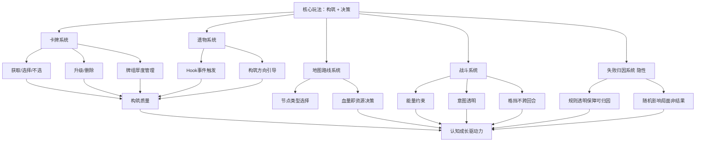

# 《杀戮尖塔 2》游戏分析

## 🎮 基础信息
- **游戏名**: 杀戮尖塔 2（Slay the Spire 2）
- **开发商**: MegaCrit
- **发行商**: MegaCrit
- **发行年份**: 2025（抢先体验，EA）
- **平台**: PC（Steam）
- **类型**: Roguelike / 卡牌构筑
- **游玩时长**: 100h+
- **游玩状态**: ☑ 游玩中
- **个人评分**: ⭐⭐⭐⭐⭐
- **Steam 评价**: 多数好评（71,244 条，好评率 34% — 争议游戏，但平均游玩时长 115 小时）

---

## 🎯 核心体验

### 一句话定位
在随机生成的约束条件下，通过连续决策构建一套能跑起来的卡牌体系——每一局都是一次可验证、可复盘的**认知实验**，驱动玩家的不是奖励欲，而是解题欲。

### 核心循环

```
[主循环 — 单局内]
随机生成局面（牌/遗物/路线/敌人）
  → 玩家提出构筑假设
  → 在能量/血量/金钱稀缺下连续选择
  → 战斗给出反馈（赢了/亏血/超预期）
  → 验证假设成立 or 形成具体归因
  → 带着修正方案继续推进

[元循环 — 跨局]
这局失败，归因："我牌组太厚/防御不够/太贪精英"
  → 下一局带新理解重新实验
  → 玩家判断模型升级
  → 对系统理解更深，开始追更高难度
```

### 记忆点

1. **第一次靠精心构筑碾压 Boss** — 手里所有牌协同转起来的那一刻，理解了"构筑"的含义
2. **被门扉（The Gremlin Nob）的愤怒机制一套带走** — 意识到不同 Boss 要针对性备牌，同时感到愤怒
3. **近失时刻：差一张过牌就赢了** — 下一局动力瞬间充满
4. **删牌让牌组变强** — 反直觉的顿悟：越删越强，这完全违反大多数游戏"收集越多越好"的直觉
5. **第一次意识到"不选牌"是正确选择** — 比删牌更反直觉：放弃奖励比接受奖励更聪明

---

## 🧠 系统架构



### 主要系统拆解

#### 卡牌构筑系统
- **设计目标**: 让每张牌都是一个需要被解答的问题，而不是单纯的"变强"——奖励即决策负担
- **核心机制**: 战斗后从三张随机牌选一张（或不选）；营火升级；商店删牌；牌组厚度直接影响关键牌出现频率
- **深度来源**: 一张"污染牌"的代价不是即时的，而是在十几分钟后的 Boss 战才显现——**小选择的长后果**是核心深度来源；不是牌越多越好，而是牌组越精越好
- **反直觉设计（关键）**: 大多数游戏里，获得奖励总比不获得好。STS2 打破了这个直觉：**不拿牌可以比拿牌更聪明**，删牌可以让牌组更强。这个设计之所以有效，是因为它把"牌组厚度"变成了真实代价——稀释了关键牌的抽到概率，让污染真实可感。

#### 遗物系统
- **设计目标**: 制造每局差异化体验，同时引导构筑方向，让玩家感到"这局是属于这套遗物的"
- **核心机制**: 持续效果或 Hook 时机触发；Boss 遗物往往附带代价（获得强力效果但牌组受到限制）
- **深度来源**: Boss 遗物的"代价设计"是隐藏深度——拿到"哑铃"让升级牌变强，但你需要判断当前构筑升级方向是否值得；遗物与遗物之间的意外协同是高手专属的发现体验
- **被忽视的设计张力**: 遗物的 Hook 机制非常强大，但它带来了一个隐患——遗物越多，游戏状态越难以在脑中建模，玩家越难准确归因失败原因。这是 STS2 至今仍被部分玩家抱怨的根源：**系统透明度和系统复杂度之间存在张力**，遗物多了反而破坏可归因性。

#### 战斗系统
- **设计目标**: 在能量约束下体验构筑的爽感；用信息透明保障失败始终可归因
- **核心机制**: 每回合 3 点能量；敌人意图提前可见；格挡不跨回合
- **深度来源**: 格挡不叠加强迫精确计算；能量永远不够用，每回合必须取舍；意图透明让计划成为可能
- **格挡不跨回合的约束来源**: 这个设计被很多玩家觉得"压力大"，但背后的约束逻辑是：如果格挡可以无限叠加，整个游戏就会退化为"先叠满格挡再慢慢输出"的单一最优解。不跨回合的格挡强迫每回合都要重新做防御决策，是**维持决策多样性的必要代价**。

#### 失败归因系统（隐性设计核心）
- **设计目标**: 让失败成为下一局的启动理由，而不是沮丧后退出游戏的理由
- **核心机制**: 无显式系统——通过规则透明（敌人意图可见）+ 随机只影响局面不决定胜负，让失败原因始终指向玩家的决策而非系统的随机
- **为什么这是最重要的隐性设计**: 可归因失败是整个认知复玩循环的基石。如果失败是"运气太差"，玩家会离开；如果失败是"我牌组太厚"，玩家会再来一局。**这个系统的精妙之处在于它不需要任何显式 UI——只需要在游戏设计层面保证：所有导致失败的关键因素都是玩家之前有机会做不同选择的地方。**

---

## 🎨 体验层分析

### 手感与操控
回合制决策，无实时压力，节奏完全由玩家控制。出牌动画短促不拖沓——这是重要的设计选择，拖沓的动画会打断思考节奏。高手游玩时整个过程像在解题，而不是在"玩游戏"。

### 关卡/内容设计
三幕结构（普通战斗 → 精英 → Boss）是构筑成型的时间轴：第一幕建立方向，第二幕测试强度，Boss 是验收。难度曲线的核心不是数值提升，而是**玩家对自己构筑强度的评估越来越准确**——最终你能做到"看到路线就知道能不能打精英"。

### 叙事与世界观
叙事极简。遗物和事件的文本碎片构建出一个可拼凑的世界感，但叙事完全服从于玩法。这是一个有趣的选择：STS2 用"你对这个世界运行规律越来越理解"代替了"你越来越了解这个世界的故事"——系统理解本身就是叙事替代品。

### 美术与音乐
可读性优先于写实。敌人的外形设计直接传达行为特征（Gremlin 系列视觉上就是攻击性的）。Boss 战音乐提升强度，是让构筑考验时刻更有仪式感的重要设计。

---

## ⚖️ 设计取舍分析

| 设计决策 | 被什么约束逼出来的 | 得到了什么 | 真实代价 |
|---------|-----------------|-----------|---------|
| 格挡不跨回合 | 防止"叠满格挡"的单一最优解垄断玩法 | 每回合防御决策有意义；强迫精确计算 | 部分玩家觉得压力过大；学习曲线变陡 |
| 敌人意图完全透明 | 保障可归因失败——隐藏意图会让失败归因到"运气" | 失败永远指向玩家决策；归因准确 | 失去信息不对称带来的惊吓感；高手感觉缺乏探索刺激 |
| 不选牌是合法选项 | 如果强制拿牌，牌组厚度就不是真实代价 | "少即是多"成为真实策略；污染决策有意义 | 反直觉，新手难以接受；需要学习成本 |
| 无局外成长 | 局外积累会让游戏退化为数值碾压，稀释决策价值 | 每局公平，技术成长感纯粹；无"肝"压力 | 失去长期积累感；部分玩家感到每局都要"从零开始" |
| 随机影响局面而非结果 | 如果随机决定结果，失败归因就会转移到运气 | 失败可归因；随机制造差异而非不公平 | 部分运气成分仍然存在；极端差局让玩家感到被坑 |
| Boss 有针对性克制机制 | 如果无针对性，所有构筑大同小异；缺乏构筑深度压力 | 强迫备牌思考；增加构筑决策维度 | 被克制时感觉是"强制规避"而非策略应对；引发不满 |

---

## 💡 值得借鉴的设计

1. **"不拿奖励比拿奖励更聪明"的设计思路**: 这个设计的核心不是"不拿牌"本身，而是背后的机制——牌组厚度是真实代价。在自己的 Roguelike 项目中，要让每个奖励都有隐性代价（占用背包位/污染池/增加复杂度），而不是纯粹的"好东西"。具体实现：在 `slayDemo` 项目中，道具拾取可以设计"负重系统"，携带道具越多，角色速度/技能冷却受到负面影响，强迫玩家做取舍而非无脑收集。

2. **失败归因的设计前提是规则透明**: 可归因失败不是一个功能，而是一套前提条件——所有可能导致失败的因素都必须在失败前就对玩家可见。在 `slayDemo` 中，敌人的下一步行动、伤害数值、状态效果持续时间都应该是可预先读取的，而不是隐藏到"发生了再说"。这会增加 UI 设计复杂度，但这个投入是可归因失败的基础成本。

3. **资源稀缺性必须是真实的，不能被"堆资源"绕过**: STS2 的能量/血量/删牌机会的稀缺是真实的，无法通过某种方式"全都拿到"。如果设计中存在某种路线可以绕过稀缺（比如某个遗物让删牌免费），整个系统的决策深度就会塌陷。在 `slayDemo` 中，要检查是否有某条成长路线可以让稀缺感消失，及时封堵。

4. **Hook 系统的扩展性价值**: 遗物/能力通过事件回调触发，新增内容只需注册新 Hook，不修改既有逻辑。在 Godot 的 `slayDemo` 中已经可以用 Signal 实现：`GameEvents.emit_signal("on_card_played", card)` — 所有遗物和能力订阅各自关心的事件，互不耦合，新加遗物不改战斗核心逻辑。

---

## ❌ 不足与问题

1. **遗物积累破坏可归因性**: 这是 STS2 最核心但最少被分析的问题。遗物越多，游戏状态越复杂，玩家越难在脑中建模"当前状态是什么"。当失败时，有 20 个遗物同时生效，归因就变得困难——这是系统透明度和系统复杂度之间的内在张力。改进方向：在 UI 层面提供遗物触发日志，让玩家在失败后能回看"哪个遗物在哪个时刻触发了什么"。

2. **部分 Boss 克制是设计缺陷而非设计深度**: 门扉（Gremlin Nob）的愤怒机制让技能流几乎不可用，这是"强制规避"而非"策略应对"。真正有深度的克制应该是"这套构筑面对这个 Boss 需要多打一个方向"，而不是"这套构筑根本无法对抗这个 Boss"。改进方向：为被克制的构筑提供反制手段，哪怕只是让克制效果从"无法打"变为"打起来更难"。

3. **EA 阶段平衡更新缺乏沟通**: 削弱某个流派时没有说明设计意图，玩家感到"努力学习的构筑被否定"。这是产品沟通问题，不完全是设计问题，但对口碑影响很大。

4. **34% 好评率的信号误读**: 34% 好评率不代表游戏差，而代表 EA 阶段平衡争议集中爆发。但这个数字对潜在玩家是强负向信号。MegaCrit 在沟通策略上严重低估了 Steam 评分系统对 EA 游戏的伤害。

---

## 🔗 知识关联

### 与已读书籍的关联——以及与书里观点的张力

- **游戏编程设计模式**: STS2 的 Hook 系统是**观察者模式的工程化延伸**——书里的观察者模式解决的是"A发生时通知B"的解耦问题，STS2 把它扩展为整个效果层的基础设施，所有遗物/能力都成为观察者。书里没有深入讲多级 Hook 触发的顺序管理问题（Hook触发另一个Hook时如何处理），这是 STS2 相比书中理论更复杂的地方 | 关联强度: ⭐⭐⭐⭐⭐

- **思考快与慢**: STS2 的设计**系统性地利用了系统1直觉然后纠正它**。"删牌变强"违反系统1的"更多=更好"直觉；"不拿奖励"违反系统1的"奖励>无奖励"直觉。书中卡尼曼说训练系统2可以纠正系统1偏见，但 STS2 是反过来用的——让玩家通过失败（系统2介入）学会覆盖系统1的错误直觉。这是书里没有明确讨论的"游戏作为认知训练工具"的角度 | 关联强度: ⭐⭐⭐⭐⭐

- **架构整洁之道**: STS2 的三层分离架构（Core/逻辑层不依赖引擎）是依赖倒置原则的实践。但这里有个有趣的**张力**：书里 Uncle Bob 强调依赖倒置是为了让核心逻辑不依赖外部细节；STS2 的 Core 层不依赖 Godot，但它必须依赖 GDScript 的数据类型。这说明"绝对的依赖倒置"在实践中是有边界的——总要在某个层面与平台耦合 | 关联强度: ⭐⭐⭐⭐

- **第一性原理**: STS2 的第一性原理是"满足验证欲"——所有机制都是从这个底层推导的。但**这里有个反驳值得记录**：验证欲是复玩动力，但首局体验靠什么吸引玩家？前 3 局玩家还没有"假设"可以验证，体验完全靠随机爽感。这说明第一性原理"验证欲"准确描述了核心玩家留存的驱动力，但不完整描述了新手转化漏斗的全部机制 | 关联强度: ⭐⭐⭐⭐

### 与其他游戏的关联

- **Hades**: 同类对比——都是 Roguelike，但本质驱动力不同。Hades 用叙事进展（每次死亡推进故事）制造"不得不再来一局"的动力；STS2 用认知成长（每次失败提升理解）制造动力。关键洞察：**Hades 的驱动力是外部给予的（新对话、新关系），STS2 的驱动力是内部生成的（新理解、新假设）**。内部驱动力更持久但更难建立——需要玩家先经历足够多的失败形成自己的理论。

- **Monster Train**: 同类对比——同为卡牌构筑 Roguelike，但设计哲学相反。Monster Train 追求数值爆炸（强力组合可以达到无限伤害），STS2 追求稳定性（防止单一最优解垄断）。两种设计满足不同类型的玩家：追求爆发爽感 vs 追求构筑精确性。

### 对自身项目（slayDemo）的具体启发

1. **立刻可做：给道具添加"负重"代价系统** — 在 `slayDemo` 的 `ItemSystem` 中，每个道具给角色增加 `weight` 值，超过阈值后移速/攻速受惩罚。这让道具从"拿了不亏"变为"需要权衡"，复制 STS2 的"每个奖励都是问题"逻辑。

2. **立刻可做：实现敌人意图 UI** — 在 `EnemyController` 上增加 `next_action: Action` 属性，每回合开始时广播敌人意图，UI 层订阅显示图标。这保证了失败的可归因性基础。

3. **待规划：Hook 系统** — 当前 `slayDemo` 里道具效果是硬编码在 `PlayerController` 里的。需要重构为：所有游戏事件通过 `GameEventBus` 广播，道具/技能作为独立节点订阅事件。这是代码架构改造，需要单独安排时间。

---

## 📊 总结

### 最大的收获
**"可归因失败"不是一个功能，而是一套设计前提的集合。** 要让玩家失败后说"我知道为什么"，需要：规则透明、随机影响局面而非结果、所有关键决策节点都在失败前可见。这些不是 UI 问题，而是游戏系统设计的底层决策。

### 认知转变（第五层洞察）

读这款游戏之前，我认为 Roguelike 设计的核心是"内容量够不够丰富"——遗物够多、卡牌够多、随机组合够多。

读完之后，我的认知变成：**Roguelike 设计的核心是"认知成长的闭环是否成立"**——失败之后玩家是否能形成新的假设，新的假设在下一局是否有机会被验证，验证的结果是否又能生成新的理解。内容量只是保证这个闭环不重复的基础，而不是核心。

这个认知直接影响了我对 `slayDemo` 的设计优先级：我应该优先保证失败可归因（规则透明、意图可见），而不是优先增加内容量。

### 核心结论

《杀戮尖塔 2》最强的地方不是卡牌数量或随机多样性，而是**它让每次失败都变成了"我知道下次应该怎么改"的认知更新**。这个设计的实现依赖一套环环相扣的系统前提：随机只影响局面 → 规则完全透明 → 格挡有代价 → 删牌有价值 → 失败指向决策而非运气。任何一环缺失，整个认知复玩循环就会崩塌。

---

> 参考资料：深度分析原文见 `games/rpg/杀戮尖塔2/杀戮尖塔2-认知复玩循环深度分析.md`
> Steam 评论数据截至 2025 年 5 月（71,244 条，平均游玩时长 115 小时）

**分析创建时间**: 2026-06-17
**最后更新**: 2026-06-17（依据 rules.md 批判性迭代）
