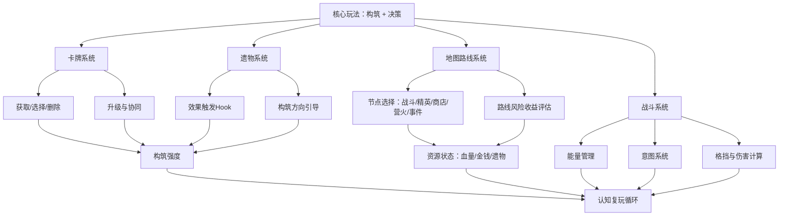

# 《杀戮尖塔 2》游戏分析

## 🎮 基础信息
- **游戏名**: 杀戮尖塔 2（Slay the Spire 2）
- **开发商**: MegaCrit
- **发行商**: MegaCrit
- **发行年份**: 2025（抢先体验，EA）
- **平台**: PC（Steam）
- **类型**: Roguelike / 卡牌构筑
- **游玩时长**: 100h+
- **游玩状态**: ☑ 游玩中
- **个人评分**: ⭐⭐⭐⭐⭐
- **Steam 评价**: 多数好评（71,244 条，好评率 34% — 争议游戏，但平均游玩时长 115 小时）

---

## 🎯 核心体验

### 一句话定位
在随机生成的约束条件下，通过连续决策构建一套能跑起来的卡牌体系，每一局都是一次可验证、可复盘的理解实验。

### 核心循环

```
[主循环 — 单局内]
随机生成局面（牌/遗物/路线/敌人）
  → 玩家提出构筑假设
  → 在能量/血量/金钱稀缺下连续选择
  → 战斗给出反馈（赢了/亏血/超预期）
  → 验证假设成立 or 形成具体归因
  → 带着修正方案继续推进

[元循环 — 跨局]
这局失败，归因："我牌组太厚/防御不够/太贪精英"
  → 下一局带新理解重新实验
  → 玩家判断模型升级
  → 对系统理解更深，开始追更高难度
```

### 记忆点

1. **第一次靠精心构筑碾压 Boss** — 手里所有牌协同转起来的那一刻，理解了"构筑"的含义
2. **被门扉（The Gremlin Nob）的愤怒机制一套带走** — 意识到不同 Boss 要针对性备牌
3. **近失时刻：差一张过牌就赢了** — 下一局动力瞬间充满
4. **删牌让牌组变强** — 反直觉的顿悟：少拿牌、删废牌才是正确思路
5. **多人模式里和朋友讨论构筑** — 社交层让游戏体验溢出了游戏本身

---

## 🧠 系统架构



### 主要系统拆解

#### 卡牌构筑系统
- **设计目标**: 让玩家在"想要什么"和"现在需要什么"之间持续做有代价的选择，每张牌都是新的问题而非单纯奖励
- **核心机制**: 每场战斗后从三张随机牌里选一张（或不选）；营火可升级牌；商店可删牌；每张牌有费用、效果、关键字
- **深度来源**: 牌组厚度直接影响关键牌的抽到概率；一张"污染牌"的长期代价会在十几分钟后才显现；协同效应需要跨多张牌和遗物同时成立
- **设计亮点**: 奖励即问题——拿到一张牌不是"变强了"，而是触发一连串判断：它适合当前构筑吗？会污染牌组吗？和已有遗物有协同吗？

#### 遗物系统
- **设计目标**: 为构筑提供方向引导和差异化体验，让每局感觉独特
- **核心机制**: 遗物持续生效或在特定 Hook 时机触发；开局遗物、精英奖励遗物、Boss 遗物各有不同稀有度和强度
- **深度来源**: 部分遗物改变基础规则（如"每回合开始额外获得1能量"），会彻底改变构筑方向；遗物之间、遗物与卡牌之间的协同是高手和新手最大的认知差距
- **设计亮点**: Hook 机制设计——遗物效果通过事件回调触发，与卡牌、能力解耦，支持几乎无限的组合扩展

#### 地图路线系统
- **设计目标**: 让每一步移动都是有代价的资源管理决策，而非单纯的空间导航
- **核心机制**: 每层地图分叉，节点类型固定（战斗/精英/商店/营火/事件/宝箱），玩家只能选路不能回头
- **深度来源**: 走精英获得遗物但消耗血量；营火回血还是升级的选择取决于构筑强度；血量就是资源，不是生命条
- **设计亮点**: 路线决策和构筑强度互为前提——"我有没有资格打精英"这个问题让地图导航变成了对自身实力的持续评估

#### 战斗系统
- **设计目标**: 在每回合的能量约束下，让玩家体验构筑成型后的爽感，同时保持信息透明度
- **核心机制**: 每回合固定能量（通常3点）；敌人提前展示意图；出牌消耗能量；格挡不跨回合
- **深度来源**: 能量永远不够用，每回合必须取舍；格挡不叠加强迫玩家精确计算；敌人意图透明让"我能防住吗"成为每回合的核心判断
- **设计亮点**: 意图透明化——敌人下回合要做什么是可见的，这让失败永远可归因："我知道它要打30，我就是没防住"

#### 失败归因系统（隐性）
- **设计目标**: 让失败成为下一局的启动理由，而不是退出游戏的理由
- **核心机制**: 无显式系统，通过卡牌/遗物/路线选择的完整记录，让玩家可以回溯每一个决策节点
- **深度来源**: 失败原因往往指向可调整的决策（"我牌组太厚"/"我没为这个 Boss 备牌"），而不是不可控的随机
- **设计亮点**: 可归因失败是复玩驱动力的核心——失败后不是"游戏坑我"，而是"我知道哪里可以改"

---

## 🎨 体验层分析

### 手感与操控
卡牌点击拖拽反馈清晰，出牌动画短促有力不拖沓。战斗节奏偏慢热但高潮明确——构筑成型后打出连锁的瞬间是核心爽点。没有实时操作压力，所有决策都是回合制思考，节奏完全由玩家控制。

### 关卡/内容设计

三幕结构（普通战斗 → 精英 → Boss）形成清晰的强度曲线，每幕结束的 Boss 是"当前构筑是否成型"的验收节点。难度曲线的核心不是数值提升，而是玩家对自己构筑强度的评估越来越准确。

内容密度高但不冗余：地图节点类型有限，但每个节点的决策深度足够。惊喜节点来自事件的随机文本和遗物组合的意外协同。

### 叙事与世界观
叙事极简，通过环境描述、事件文本、遗物背景文字构建世界观碎片。没有主线剧情，但每个遗物和敌人都有简短的背景描述，形成可拼凑的世界感。叙事完全服从于玩法，不抢节奏。

### 美术与音乐
美术风格偏暗黑奇幻，线条感强，可读性优先于写实。敌人设计清晰传达威胁感和行为特征（如 Gremlin 系列的攻击性外形）。

音乐根据战斗阶段动态变化，Boss 战音乐强度明显提升，强化紧张感。音效对出牌命中有直接反馈，是手感的重要组成部分。

---

## ⚖️ 设计取舍分析

| 设计决策 | 得到了什么 | 放弃了什么 |
|---------|-----------|-----------|
| 格挡不跨回合 | 每回合必须精确规划防御，决策有真实代价 | 叠格挡的安全感，部分玩家觉得压力过大 |
| 敌人意图完全透明 | 失败永远可归因，减少"被坑"的挫败感 | 信息不对称带来的惊吓感和探索刺激 |
| 不选牌是合法选项 | 牌组精简有意义，"少即是多"成为真实策略 | 每次战斗必有奖励的爽快感 |
| 随机生成局面而非固定关卡 | 每局唯一，复玩价值极高 | 精心设计的叙事体验，无法讲述完整故事 |
| 删牌需要花钱/消耗营火机会 | 删牌决策有代价，稀缺感真实 | 自由整理牌组的掌控感 |
| Boss 有针对性机制（如门扉的愤怒） | 强迫玩家针对性备牌，提升构筑深度 | 通用构筑可以过关的公平感，部分玩家觉得是强制克制 |
| 无局外成长/数值积累 | 每局公平，技术成长感强，没有"肝"压力 | 局外成长带来的长期目标感和积累爽感 |

---

## 💡 值得借鉴的设计

1. **可归因失败设计**: 失败后玩家要能快速识别"是哪个决策导致了这个结果"。实现方式：保持规则透明（敌人意图可见、伤害计算无隐藏）+ 减少纯运气失败（随机影响局面而非直接决定输赢）。在自己的项目中，每次玩家失败都应该让他能说出"我知道为什么"。

2. **奖励即问题而非终点**: 不要让奖励成为纯粹的"变强"，而是让它触发新的决策链。拿到一张牌时玩家应该思考"它如何融入我的体系"，而不只是"数值+1"。在 Roguelike 设计中，每个奖励项都应该有潜在的代价（污染、改变方向、挤占资源）。

3. **三层反馈叠加**: 回合级短反馈（这波打出去了吗）+ 节点级中反馈（这场战斗后选什么）+ 全局长验证（这套构筑能不能成），三层同时拉住玩家注意力。单层反馈的游戏容易让玩家感到单调或迷失。

4. **资源稀缺制造选择深度**: 决策的深度不来自"选项多"，而来自"资源永远不够"。能量、血量、删牌机会、营火次数都是稀缺的——稀缺让每个选择有代价，有代价才有意义。在自己的设计中，不要让玩家"全都拿到"，要让他们"永远在取舍"。

5. **Hook 事件系统解耦效果**: 遗物/能力通过事件回调触发，与具体的卡牌逻辑解耦。这种设计让新增内容只需注册新 Hook，不需要修改既有逻辑，扩展性极强。对于需要大量"被动效果"的卡牌/RPG 类游戏，Hook 系统是最佳实践。

6. **近失效应的主动设计**: "差一张过牌就赢了"的感觉不是偶然的，而是系统有意将玩家长期维持在"快成型、还差一步"的状态。可以通过控制资源稀缺程度和正反馈节奏，主动制造这种近失体验。

---

## ❌ 不足与问题

1. **部分 Boss 机制感觉是强制克制而非策略应对**: 门扉（Gremlin Nob）的愤怒机制让技能牌几乎不可用，玩家感觉不是"我准备好了对抗它"而是"我被迫绕过它"。改进方向：为被克制的构筑方向提供反制手段，让应对成为策略选择而非强制规避。

2. **敌人成长速度与玩家构筑节奏的矛盾**: EA 阶段平衡性问题，敌人强度提升曲线有时快于玩家构筑成型速度，导致中期压力过大、早期决策容错率过低。玩家反馈"计算半天打法，敌人成长比我快得多"。改进方向：提供更多早期预警信息，或提高低强度构筑的下限。

3. **平衡更新沟通不足**: 每次版本更新削弱某些流派时，玩家感到"努力学习的构筑被开发商否定"。改进方向：在更新日志中明确说明设计意图，同时削弱提供替代方案，不要只砍数值不给出路。

4. **好评率虚低问题**: 34% 好评率严重低估了游戏质量，根本原因是 EA 阶段平衡性问题被大量差评，而实际体验（115 小时平均时长）远好于评分显示。这对 EA 游戏来说是一个运营策略问题，而不完全是设计问题。

---

## 🔗 知识关联

### 与已读书籍的关联

- **游戏编程设计模式**: Command 模式用于出牌命令队列，所有操作封装为 Command 对象，可追溯、可回放、支持多人同步；Hook 系统是观察者模式的工程化落地，遗物/能力通过事件回调触发，与核心逻辑解耦 | 关联强度: ⭐⭐⭐⭐⭐

- **思考快与慢**: "可归因失败"设计对应强制激活系统2复盘；"近失效应"（Near-Miss Effect）利用系统1直觉制造再来一局的冲动；"未完成任务效应"（蔡格尼克效应）让正在成型的构筑占据玩家注意力 | 关联强度: ⭐⭐⭐⭐⭐

- **架构整洁之道**: 游戏采用三层分离架构（表现层 Nodes / 逻辑层 Core / 数据层 Entities），Core 层纯 C# 不依赖 Godot 节点，是依赖倒置原则的完整实践；逻辑层可独立测试，支持多人同步时的一致性校验 | 关联强度: ⭐⭐⭐⭐

- **游戏编程算法与技巧**: "可管理的随机"是随机算法设计的核心原则——随机不决定胜负，只生成不同问题供玩家解决；地图生成算法保证路线选择有意义（每种节点类型的分布密度有设计意图） | 关联强度: ⭐⭐⭐⭐

- **设计模式（GoF）**: 战斗状态机管理回合流程（State Pattern）；遗物/能力的 Hook 注册是典型的观察者模式；卡牌效果计算链是责任链模式（Chain of Responsibility） | 关联强度: ⭐⭐⭐⭐

- **第一性原理**: 游戏驱动力的第一性原理不是"给奖励"，而是"满足验证欲和解题欲"；一旦找到这个底层原理，所有复玩机制设计都可以从它推导出来 | 关联强度: ⭐⭐⭐

### 与其他游戏的关联

- **杀戮尖塔 1（STS1）**: 设计传承——核心机制完全继承，STS2 在职业特色、多人模式、视觉表现上全面升级，但认知复玩循环的核心设计不变 | 类型: 设计传承

- **Hades（哈迪斯）**: 同类对比——同为 Roguelike 但驱动力不同：Hades 以叙事（每次死亡推进故事）驱动复玩，STS 以认知成长（每次失败提升理解）驱动复玩；两种模型各有适用场景 | 类型: 同类对比

- **Monster Train**: 同类对比——同为卡牌构筑 Roguelike，Monster Train 更强调多路线并行的数值爆发感，STS 更强调构筑稳定性和决策精度；Monster Train 上限爆炸但下限更低 | 类型: 同类对比

### 对自身项目（Godot 游戏开发）的启发

正在用 Godot 开发类 Roguelike 项目，具体可借鉴：

1. **Hook 系统架构**: 参考 STS2 的效果触发中心，在 Godot 中用信号系统实现类似的 Hook 机制——所有游戏事件（攻击、受伤、回合开始）都通过信号广播，各效果模块按需订阅，避免硬编码耦合。

2. **Command 模式出牌队列**: 将所有玩家操作封装为 Command 对象入队执行，便于后续实现回放、存档、多人同步。Godot 中可用 RefCounted 实现轻量 Command 对象。

3. **失败归因设计**: 在关卡/战斗结束界面展示关键决策节点的回顾（"第3回合选择了X牌"），帮助玩家形成具体归因，而不是只显示最终结果。

4. **三层反馈节奏**: 在关卡设计中主动规划短/中/长三层反馈节点，不要让玩家长时间处于"只有长期目标、没有短期反馈"的状态。

---

## 📊 总结

### 最大的收获
理解了 Roguelike 复玩驱动力的本质不是"内容量"和"奖励密度"，而是"每次失败都能形成具体的可改进归因"。这个认知彻底改变了我看 Roguelike 设计的框架。

### 核心结论

《杀戮尖塔 2》的复玩魅力来自一个精心设计的认知闭环：**随机生成问题 → 玩家建立假设 → 资源稀缺下连续决策 → 系统给出清晰反馈 → 失败可归因 → 形成修正方案 → 下一局验证**。它制造的不是数值上瘾，而是认知上瘾——玩家在追的不是"下一局能得到什么奖励"，而是"下一局能不能用新的理解打出更好的结果"。

对游戏设计最核心的启示：**好的失败不是让玩家少受挫，而是让玩家知道为什么受挫，并相信下一次可以做得更好。**

---

> 参考资料：
> - 深度分析原文：`games/rpg/杀戮尖塔2/杀戮尖塔2-认知复玩循环深度分析.md`
> - 核心观点摘要：`games/rpg/杀戮尖塔2/杀戮尖塔2-核心观点摘要.md`
> - Steam 评论数据截至 2025 年 5 月（71,244 条，平均游玩时长 115 小时）

**分析创建时间**: 2026-06-17
**最后更新**: 2026-06-17
