# 《灵画师》游戏分析

## 🎮 基础信息
- **游戏名**: 灵画师
- **开发商**: 广州光游的工作室
- **发行商**: 波克城市（波克科技集团有限公司）
- **上线时间**: 2024 年 8 月底
- **平台**: 微信小游戏、抖音小游戏、Android APP
- **类型**: 国风修仙放置挂机 / 养成 RPG
- **游玩时长**: 持续运营型，按日常/赛季计
- **游玩状态**: ☐ 游玩中 ☐ 通关 ☐ 放弃
- **个人评分**: ⭐⭐⭐⭐⭐ (待填写)
- **市场表现**: 微信小游戏畅销榜 TOP10，放置榜最高第 3；B站批评性测评播放量 107 万

---

## 🎯 核心体验

### 一句话定位
修仙砍妖版的《寻道大千》——但兽魂双维设计是真正的创新：同一只灵兽既是你的战斗流派方向，又是你的经营功能入口，一个资源单元驱动两套系统，让放置游戏的碎片化体验产生了罕见的联动感。

### 核心循环

```
[日常循环]
战斗挂机（御兽/割草自动战斗）
  → 积累资源（元宝/彩墨/灵兽蛋）
  → 抽卡强化（妖灵/灵兽/武魂/神兵）
  → 优化流派搭配（职业 × 兽魂 × 妖灵组合）
  → 解锁新区域/挑战高阶副本（远古剑冢/轮回秘境）
  → 继续挂机积累

[后勤循环（与战斗并行）]
派遣灵兽到对应功能板块
  兔子→太古神庭 / 蛤蟆→灵田 / 乌龟→钓鱼 / 龙→炼丹 / 瑞狐→画中阁
  → 产出对应资源
  → 反哺战斗强化
  
[核心取舍]
同一只灵兽：带去战斗 or 派遣经营
  → 这个取舍是两个循环的联结点，也是游戏深度的来源
```

### 记忆点

1. **兽魂双维的"啊哈"时刻**: 发现龙既是暴击流的核心，又是炼丹板块的专属灵兽——两套决策竟然是同一个资源，这个设计让人感到"被设计说服了"
2. **第一次抽出传说妖灵**: 抽卡机制的高潮节点，视觉和音效应该是这时候最华丽的
3. **水墨国风美术的第一眼**: 在同质化严重的小游戏市场，这个视觉差异化有真实的冲击力
4. **钓鱼/种田的节奏切换**: 这些轻松的经营玩法在刷图疲劳时提供了真实的情绪出口
5. **看到 B站 107 万播放的批评视频**: 让你开始审视"我享受的这个游戏，是不是在某个层面被设计得对我不利"

---

## 🧠 系统架构

```mermaid
graph TD
    A[核心创新：兽魂双维] --> B[战斗系统]
    A --> E[经营系统]

    B --> B1[挂机自动战斗]
    B --> B2[职业技能体系]
    B --> B3[高阶副本挑战]

    E --> E1[灵田种植]
    E --> E2[炼丹系统]
    E --> E3[钓鱼玩法]
    E --> E4[画中阁建设]

    C[养成系统] --> C1[妖灵 抽卡核心]
    C --> C2[灵兽 合成升品]
    C --> C3[武魂/神兵/血脉/坐骑]
    C --> C4[职业 四大职业]

    D[兽魂系统] --> D1[五大兽魂 五行属性]
    D1 --> D2[战斗属性 暴击/连击/反击/晕眩/吸血]
    D1 --> D3[派遣功能 炼丹/钓鱼/灵田/画中阁/神庭]
    D2 --> B
    D3 --> E

    C1 & C2 & C3 & C4 --> G[流派构筑强度]
    G --> B
    E --> H[资源产出]
    H --> C

    F[社交系统] --> F1[仙盟]
    F --> F2[排行竞争]
    F --> I[社交留存压力]
```



### 主要系统拆解

#### 兽魂双维系统（最值得深析的设计）
- **设计目标**: 解决放置游戏"战斗"和"经营"两套内容各自独立、体验割裂的问题——通常这两个系统有各自的资源，玩家在两套内容间切换时没有取舍感
- **核心机制**: 五大兽魂（兔/蛤蟆/乌龟/龙/瑞狐）对应五行属性；每种兽魂在战斗中提供特定属性（暴击/连击/吸血/反击/晕眩），同时只能派遣到对应的功能板块；**同一只灵兽在同一时间只能做一件事**
- **深度来源**: 每次培养哪种灵兽，既决定战斗流派方向，也决定哪个经营板块更高效；**稀缺感不需要额外设计，双用途本身就创造了稀缺**
- **设计的真正价值**: 不只是"系统联动感"，而是**把两个通常割裂的玩法融合成一个决策**。传统放置游戏里，培养战斗单位和经营资源是两件事，各有各的最优解。兽魂双维让两件事变成一件事，玩家在一个决策里同时影响两个维度，决策密度更高但界面复杂度没有翻倍。

#### 妖灵系统（付费核心）
- **设计目标**: 提供核心战力成长驱动力和付费入口，用品质稀缺性制造长期追求目标
- **核心机制**: 主要战力来源，通过抽卡获得；保底机制控制最差情况
- **付费转化逻辑**: 妖灵是战力天花板，抽卡是获取途径，保底是最低体验保障——这三者共同构成了一个"公平但需要付费才能快速到达"的系统
- **与兽魂系统的关系（被忽视的交叉点）**: 妖灵的技能效果与职业/兽魂搭配有协同，最优组合不是单纯比品质。这意味着付费（获取更好妖灵）和免费研究（找到协同搭配）可以在不同维度上都提供满足感——**高付费玩家用钱买强度，低付费玩家用研究找协同**，两种路径都有价值。

#### 经营系统（节奏调节层）
- **设计目标**: 在高强度刷图之间提供慢节奏的情绪调节节点；同时通过兽魂绑定与战斗系统产生真实关联
- **核心机制**: 各板块需要对应兽魂的灵兽派遣才能激活；产出特定资源反哺战力
- **节奏调节的机制原理**: 钓鱼、炼丹、种田是主动但低压力的操作，和自动刷图的被动等待形成节奏对比。**玩家可以在两种模式之间切换，始终有"当下该做什么"的答案**，避免了纯 Idle 游戏的"登录 → 收益 → 关闭"的空洞感。

---

## 🎨 体验层分析

### 手感与操控
放置挂机核心，主动行为集中在养成决策和派遣管理。钓鱼/炼丹提供轻度主动操作节点，调节节奏。整体是典型的"低操作高决策"移动端设计。

### 关卡/内容设计
多副本并行（主线/远古剑冢/轮回秘境/御剑飞行）提供不同挑战和奖励路径。赛季制保证内容持续更新。微信小游戏形态支持碎片化游玩——每次打开 5 分钟就有事可做是这类游戏的核心体验要求。

### 叙事与世界观
山海经异兽题材是**文化 IP 的务实选择**：饕餮/九尾狐/龙有天然的公众认知，玩家不需要游戏解释它们是什么，美术设计可以省去大量说明成本。修仙成道的主题在中国玩家中有广泛的情感认同，是放置游戏世界观包装的"最低风险选择"。

### 美术与音乐
水墨国风手绘是这款游戏最强的差异化资产，也是目前被市场验证有效的少数几种能让放置游戏脱颖而出的视觉策略之一。美术质量被正面评价，是 107 万播放批评视频里几乎唯一没有被攻击的方面——说明美术投入是有效的。

---

## ⚖️ 设计取舍分析

| 设计决策 | 被什么约束逼出来的 | 得到了什么 | 真实代价 |
|---------|-----------------|-----------|---------|
| 兽魂双维（一个资源驱动两个系统） | 需要让经营玩法和战斗玩法产生真实联系，而不只是"两个独立小游戏拼在一起" | 系统联动感强；稀缺感自然产生；决策密度高 | 新手理解成本高；初期灵兽不足时经营板块体验受限（"我想炼丹但还没有龙"） |
| 水墨国风+山海经题材 | 市场差异化需求：同类放置游戏美术同质化严重，需要一个低解释成本的视觉差异化 | 强获客能力；文化认同基础广；美术可以持续输出新内容 | 美术制作成本高；国际化受限（海外玩家对山海经认知度低）；被批评"换皮"时美术优势被稀释 |
| 寻道大千Like框架 | 借势已被验证的品类，减少用户教育成本，降低获客摩擦 | 用户转化成本低；品类用户有现成的行为习惯 | "换皮"标签固化了口碑天花板；创新点（兽魂双维）被框架相似性掩盖 |
| 激进付费设计 | 发行商（波克城市）的短期 ROI 目标；小游戏平台的付费转化率本就低，需要高客单价弥补 | 上线即畅销榜 TOP10；发行商当季排名第二 | 107 万播放的批评；长期口碑损伤；玩家信任消耗 |
| 8+ 功能模块并联 | 需要足够的内容量来支撑日活留存；单一系统的放置游戏会被快速"玩完" | 不同玩家有不同着力点；每次打开都有事可做 | 新手引导难度大；轻度玩家被复杂度劝退 |

---

## 💡 值得借鉴的设计

1. **兽魂双维的 Godot 实现（最高优先级）**: 在 `slayDemo` 的 `CompanionSystem` 中，`CompanionResource` 包含：`combat_bonus`（战斗加成 Resource）和 `assignable_station: StationType`（enum，可派遣的基地岗位类型）。伙伴状态只有两种互斥状态：`IN_FORMATION`（参与战斗）和 `ASSIGNED_TO_STATION`（派遣到基地岗位）。`FormationManager` 和 `StationManager` 各自监听伙伴状态变化，互相不直接通信。这个设计预计需要 4-6 小时实现，包括数据层和 UI。

2. **五行/元素作为统一分类 enum**: 在 `slayDemo/core/` 下定义 `ElementType` enum，战斗克制关系、经营板块绑定、技能属性都引用同一个 enum。具体：`enum ElementType { FIRE, WATER, EARTH, METAL, WOOD }`，战斗系统里 fire 克制 metal，经营系统里 fire 类伙伴只能派到"炉灶"类岗位。统一的分类系统让玩家的记忆负担减半。

3. **"低付费研究协同 vs 高付费买强度"的双路径设计**: 在 `slayDemo` 中，如果有付费元素，让低付费玩家通过研究协同搭配达到相近效果，而不是让付费玩家通过数值碾压所有策略。这保护了低付费玩家的体验，也让高付费玩家感到他们买的是"跳过研究时间"而不是"不可跨越的优势"。

---

## ❌ 不足与问题

1. **"换皮"标签掩盖了真实创新**: 兽魂双维是有价值的系统创新，但被"寻道大千Like"的整体框架标签覆盖了。玩家在玩之前就预设了"这是换皮"，真正的创新点被先入为主的判断过滤掉。**这不只是设计问题，也是传播问题**——在营销层面没有主动建立"兽魂双维是什么"的认知，让玩家通过游玩发现，而不是通过介绍知道。改进方向：用一个专门的游戏内教程或推广视频，把兽魂双维的取舍设计展示给玩家。

2. **付费设计侵蚀了体验设计的信任**: B站 107 万播放的批评是典型的"体验好但付费贵"的反馈。问题不是游戏体验不好，而是玩家在体验游戏的同时不断感到"这个系统是设计来让我掏钱的"，这种感知破坏了游戏带来的沉浸感。真正的问题：**当付费设计太显性时，玩家就无法完全沉浸在游戏体验里**。

3. **新手引导与 8+ 系统的矛盾**: 放置游戏的留存高峰在前 3 天。8+ 功能模块如果在前 3 天同时涌现，轻度玩家会被复杂度劝退。改进方向：用主线关卡驱动的渐进式解锁——先确保玩家理解兽魂双维这一个核心系统，再逐步解锁其他功能。

---

## 🔗 知识关联

### 与已读书籍的关联——以及与书里观点的张力

- **游戏编程设计模式**: 兽魂双维系统的核心是"同一资源被两个系统观察和使用"——这是**观察者模式的变体，但有个关键差异**：书里的观察者模式是"A事件通知B做反应"，这里是"C资源的状态被B和E同时关注，且C资源在同一时间只能服务其中一个"。这是**互斥资源的状态管理问题**，而不只是观察通知。书里没有明确讨论这种互斥资源分配模式，但它是兽魂双维设计的技术核心 | 关联强度: ⭐⭐⭐⭐

- **思考快与慢**: 抽卡保底机制是**精心设计的损失厌恶 + 近失效应的组合**。保底机制（再差 X 次就出高稀有）制造了一个"即将到来的收益"感知，但这个"即将"是可以用钱加速的——**这把损失厌恶变成了付费触发器**，而不是玩家保护机制。书里卡尼曼没有讨论"保底机制作为付费设计工具"，但这是前景理论在商业游戏中的实际应用 | 关联强度: ⭐⭐⭐⭐⭐

- **架构整洁之道**: 兽魂系统是战斗和经营两个子系统的"桥接层"，两者不直接耦合。这是依赖倒置原则的实践——**但这里有个架构上的隐患值得标注**：如果兽魂系统本身的设计发生变化（比如增加第六种兽魂），战斗系统和经营系统都需要响应这个变化。这说明兽魂系统是一个**共享依赖**，而不是纯粹的解耦。真正的整洁架构应该让战斗和经营通过接口依赖兽魂抽象，而不是直接依赖具体的兽魂类型 | 关联强度: ⭐⭐⭐⭐

### 与其他游戏的关联

- **英雄没有闪**: 同类对比，揭示了一个规律——**两款游戏都证明了微信小游戏放置品类能做出有真实深度的系统（兽魂双维、暗能装备）；两款游戏也都证明了深度系统无法阻止激进付费设计破坏口碑**。深度和商业模式是可以独立评价的维度，但它们共享同一个玩家的信任账户。

- **杀戮尖塔2**: 反差对比，揭示了一个更深的问题——**为什么有些游戏可以没有付费压力？** STS2 没有付费压力，是因为它的商业模式是"买断制"，一次付费买断整个体验。而运营型手游需要持续的收入来支撑运营成本，不得不设计持续的付费点。这不是道德问题，而是商业模型决定了设计约束。**批评运营型手游"付费设计激进"需要先承认：没有持续付费，运营型手游就无法持续存在**。

### 对自身项目的具体启发

1. **兽魂双维实现路径（4-6小时任务）**: 已有伙伴系统框架。具体步骤：① 在 `Companion.gd` 增加 `element: ElementType` 属性 ② 增加 `state: CompanionState` enum（IDLE / IN_FORMATION / ON_STATION）③ `FormationManager` 和 `StationManager` 分别管理两个池，互斥通过状态机保证 ④ UI 层根据 state 显示不同状态图标。这是一个独立模块，不影响现有战斗系统。

2. **节奏调节关卡的设计框架**: 在 `slayDemo` 的关卡序列中，主动设计"低强度节点"——可以是简单的采集、轻量解谜、或纯探索。这些节点不需要战斗，让玩家在连续战斗后有喘息空间。**关键**：低强度节点要有叙事意义（推进故事、揭露场景信息），不能只是"时间填充"，否则玩家会觉得无聊而不是放松。

---

## 📊 总结

### 最大的收获
**兽魂双维是"一个决策解决两个问题"的设计范本**——在系统设计时，应该主动寻找"某个资源单元可以同时服务两套系统"的可能性，这不只减少了系统割裂感，还天然产生了稀缺性和跨系统的取舍深度。

### 认知转变（第五层洞察）

之前我认为游戏设计和商业模式是完全分开的两件事，可以"先设计好游戏，再想怎么赚钱"。

灵画师改变了这个认知：**商业模式会从根本上塑造游戏设计的可能性空间**。运营型手游因为需要持续付费收入，不得不设计让玩家"始终处于追求状态"的系统（赛季迭代、数值通胀、稀缺物品），而这些系统设计决策反过来又限制了体验设计的选择。

这个认知对自己做游戏的直接影响：**在游戏还在设计阶段时，就要确定商业模式，因为商业模式会决定哪些体验设计是可行的，哪些是不可行的**。把商业模式留到最后再想，往往意味着要对已有设计做破坏性改造。

### 核心结论

《灵画师》的案例揭示了一个微信小游戏品类的普遍规律：**水墨国风美术 + 山海经题材是有效的差异化获客策略；兽魂双维是有效的系统创新；但激进的付费设计会消耗前两者建立的玩家信任，使差异化优势难以转化为长期口碑**。美术获客，系统留存，付费变现——三者本可以同时做好，但激进的付费设计会反噬前两者的投入。

---

> 参考来源：B站游戏评测（107万播放）、九游平台介绍、微信小游戏畅销榜数据

**分析创建时间**: 2026-06-17
**最后更新**: 2026-06-17（依据 rules.md 批判性迭代）
