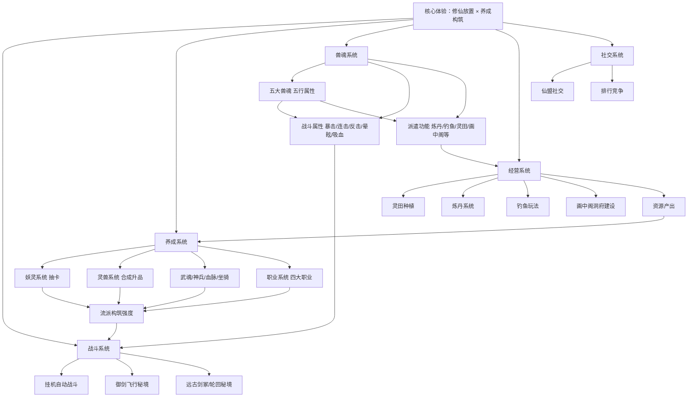

# 《灵画师》游戏分析

## 🎮 基础信息
- **游戏名**: 灵画师
- **开发商**: 广州光游的工作室
- **发行商**: 波克城市（波克科技集团有限公司）
- **上线时间**: 2024 年 8 月底
- **平台**: 微信小游戏、抖音小游戏、Android APP
- **类型**: 国风修仙放置挂机 / 养成 RPG
- **游玩时长**: 持续运营型，按日常/赛季计
- **游玩状态**: ☐ 游玩中 ☐ 通关 ☐ 放弃
- **个人评分**: ⭐⭐⭐⭐⭐ (待填写)
- **市场表现**: 微信小游戏畅销榜 TOP10，放置榜最高第 3；B站批评性测评播放量 107 万

---

## 🎯 核心体验

### 一句话定位
修仙砍妖版的《寻道大千》——水墨国风 + 山海经异兽 + 放置挂机框架，用兽魂双维设计（战斗属性 × 后勤功能）把战斗养成和经营玩法绑定在同一套资源体系里。

### 核心循环

```
[日常循环]
战斗挂机（御兽/割草自动战斗）
  → 积累资源（元宝/彩墨/灵兽蛋）
  → 抽卡强化（妖灵/灵兽/武魂/神兵）
  → 优化流派搭配（职业 × 兽魂 × 妖灵组合）
  → 解锁新区域/挑战高阶副本（远古剑冢/轮回秘境）
  → 继续挂机积累

[后勤循环（与战斗并行）]
派遣灵兽到对应功能板块
  兔子→太古神庭 / 蛤蟆→灵田 / 乌龟→钓鱼 / 龙→炼丹 / 瑞狐→画中阁
  → 产出对应资源
  → 反哺战斗强化
```

### 记忆点

1. **兽魂双维的"啊哈"时刻**: 发现同一只灵兽既决定战斗流派方向（暴击/连击/反击），又决定你能派遣到哪个经营板块——两套决策竟然是同一个资源
2. **第一次抽出传说妖灵**: 抽卡系统的高潮节点
3. **水墨国风美术的视觉冲击**: 山海经异兽的手绘画风，与同类游戏明显差异化
4. **灵田/炼丹/钓鱼的经营节奏**: 战斗之外的"田园修仙"氛围
5. **氪金压力的第一次感受**: B站107万播放的批评视频揭示的付费设计节点

---

## 🧠 系统架构



### 主要系统拆解

#### 兽魂双维系统（核心创新点）
- **设计目标**: 解决放置游戏"战斗养成"和"经营玩法"两套内容割裂的问题——通常这两个系统完全独立，玩家体验碎片化；双维设计让同一个决策同时影响两个维度
- **核心机制**: 五大兽魂（兔/蛤蟆/乌龟/龙/瑞狐）各对应五行属性；每种兽魂在战斗中提供特定属性（暴击/连击/吸血/反击/晕眩），同时只能派遣到对应的功能板块（炼丹/钓鱼/灵田/画中阁/太古神庭）
- **深度来源**: 玩家不能同时把一只灵兽用于战斗和派遣——选择派遣意味着战斗少一个兽魂槽位；培养哪种灵兽既影响战斗流派，也影响哪个经营板块更高效
- **设计亮点**: 用一套资源（灵兽）驱动两套系统（战斗 + 经营），减少了系统割裂感，也增加了资源稀缺性——同一只灵兽有两个使用场景，稀缺感是免费创造的

#### 妖灵系统（战力核心）
- **设计目标**: 提供核心战力成长驱动力和抽卡付费入口，通过品质稀缺性制造长期追求目标
- **核心机制**: 主要战力来源，通过抽卡获得；传说/史诗等品质区分；有保底机制控制最差情况体验
- **深度来源**: 不同妖灵的技能效果与职业/兽魂有协同关系，最优组合需要大量研究
- **设计亮点**: 妖灵是付费核心，但通过免费资源也可以慢速获取，维持"0氪可玩"的基础体验

#### 职业系统
- **设计目标**: 提供差异化的游玩风格，让不同玩家有不同的身份认同和讨论社区
- **核心机制**: 四大职业（体修/道修/妖修/邪修），各有独立的技能体系和适合的妖灵/兽魂搭配
- **深度来源**: 职业 × 妖灵 × 兽魂的三维组合空间；不同副本模式对职业有不同适应性
- **设计亮点**: 修仙题材的职业命名（体修/道修/妖修/邪修）与世界观深度整合，比通用的战士/法师命名更有叙事感

#### 经营系统（灵田/炼丹/钓鱼/画中阁）
- **设计目标**: 提供战斗之外的"田园修仙"氛围节拍，降低高强度玩家的注意力疲劳；同时为轻度玩家提供有价值的游戏行为
- **核心机制**: 各功能板块需要对应兽魂的灵兽派遣才能激活；产出特定资源反哺养成；部分玩法（钓鱼/炼丹）有轻度主动操作
- **深度来源**: 经营效率依赖灵兽的品质和数量，与战斗养成共享资源压力
- **设计亮点**: 钓鱼、炼丹、种田这些"慢节奏"玩法在快节奏刷图之外提供了情绪调节节点，是国风题材特有的氛围加分项

---

## 🎨 体验层分析

### 手感与操控
放置挂机框架决定核心体验是"观看"而非"操作"。玩家的主动行为集中在养成决策（选妖灵/配流派）和资源分配（派哪只灵兽去哪个功能板块）。打击感靠技能特效的视觉表现输出，是面向移动端碎片化游玩场景的合理设计。

### 关卡/内容设计
多副本并行结构（主线/远古剑冢/轮回秘境/御剑飞行）提供不同的挑战维度和奖励路径。内容量以运营更新维持，赛季制注入新内容防止玩家流失。微信/抖音小游戏形态天然支持碎片化的短时进入——每次打开不需要长时间投入。

### 叙事与世界观
山海经异兽题材提供了天然的美术素材库和叙事背景，修仙成道的主题有广泛的中国玩家文化认同基础。叙事密度低，世界观作为美术和命名的包装层而存在，不是留存驱动力。

### 美术与音乐
水墨国风手绘风格是最强的差异化资产——在同质化严重的放置手游市场中，视觉风格的辨识度直接影响获客转化。山海经异兽题材提供了丰富的创作空间（奇特外形/神秘感/文化IP认知度）。美术质量被玩家和评测者认可，是游戏口碑中难得的正面共识。

---

## ⚖️ 设计取舍分析

| 设计决策 | 得到了什么 | 放弃了什么 |
|---------|-----------|-----------|
| 兽魂双维（战斗×经营绑定同一资源） | 系统联动感强，稀缺感自然产生，减少内容割裂 | 新手理解成本高；经营板块激活依赖灵兽数量，早期体验受限 |
| 微信+抖音双小游戏平台 | 极低获客摩擦，依托社交/内容平台流量 | 包体和性能限制；用户付费深度低于原生App |
| 水墨国风+山海经题材 | 强视觉差异化，文化认同基础广，美术IP价值 | 美术制作成本高；国际化受限（题材海外认知度低） |
| 寻道大千Like定位 | 借势已被验证的品类，降低用户教育成本 | 被定性为"换皮"，口碑天花板受限；吃相难看的标签难以摘除 |
| 激进付费设计 | 短期营收高，上线即进畅销榜TOP10 | B站107万播放的批评视频；口碑两极分化；长期用户忠诚度受损 |
| 多系统并联（8+功能模块） | 内容量充足，不同玩家有不同着力点 | 新手引导难度大；系统学习成本高；轻度玩家可能因复杂度流失 |

---

## 💡 值得借鉴的设计

1. **兽魂双维设计是最值得学习的架构思路**: 用同一个资源单元（灵兽）同时服务两个系统（战斗 + 经营），强迫玩家做跨系统的取舍决策。在自己的 Godot 项目中，可以设计"伙伴"同时有战斗技能和基地功能——带出去打怪意味着基地少一个生产单位，这个取舍本身就是游戏深度。

2. **功能板块与战斗属性的五行对应**: 用一套统一的分类系统（五行）整合战斗属性和经营功能，减少玩家的记忆负担——"我知道龙是火属性，对应炼丹，战斗加暴击"，三个信息共享同一个记忆锚点。在自己的项目中，用统一的元素/属性系统串联多个子系统，比每个系统有独立分类更易记。

3. **山海经作为美术素材库**: 中国神话题材提供了极丰富的、有文化认知基础的怪物/场景设计资源。对独立开发者来说，从有IP基础的题材出发，比完全原创世界观有更低的"解释成本"——玩家看到饕餮就知道它凶猛，不需要游戏解释。

4. **钓鱼/炼丹/种田的节奏调节价值**: 在高强度刷图之间插入慢节奏的经营玩法，提供情绪调节节点。玩家不会一直处于高强度状态，轻松的功能玩法降低疲劳感。在设计时有意规划"高强度-低强度"的节奏交替，比全程高强度或全程放置更耐玩。

5. **小游戏平台的获客策略**: 微信+抖音双平台覆盖社交分享和内容推荐两种获客路径。对于小团队独立游戏，小游戏平台的零安装摩擦可以显著提升试玩转化率，尤其适合玩法简单、视觉吸引力强的游戏。

---

## ❌ 不足与问题

1. **"吃相难看"的付费设计**: B站 107 万播放的批评视频直接用"一天能氪 100 万"为标题，说明付费上限极高且缺乏合理约束。这是运营数据优先于玩家体验的典型结果。改进方向：设置付费软上限或"回报感知"设计，让大额付费有对等的成就感，而不是纯数值堆砌。

2. **换皮印象难以摆脱**: 被定性为"寻道大千Like"，市场认知固化为换皮产品。即使有兽魂双维等创新点，整体框架的相似性掩盖了局部创新。改进方向：在营销层面主动突出差异化设计点，而非靠玩家自己发现。

3. **新手引导压力**: 8+ 功能模块同时存在，早期解锁节奏直接决定玩家是否流失。系统过多且联动关系复杂，轻度玩家容易因不知道"现在该做什么"而放弃。改进方向：主线驱动的渐进式功能解锁，确保玩家始终有清晰的下一步目标。

4. **微信小游戏平台的性能天花板**: 小游戏包体限制（271.5MB）和运行环境约束制约了游戏内容量和视觉表现上限，长期内容扩展空间受限。

---

## 🔗 知识关联

### 与已读书籍的关联

- **游戏编程设计模式**: 兽魂双维系统的观察者模式——灵兽状态（战斗中/派遣中）变化时自动通知战斗系统和经营系统；养成系统的组合模式（妖灵+武魂+血脉+坐骑叠加效果）；经营系统的命令模式记录派遣操作 | 关联强度: ⭐⭐⭐⭐

- **游戏编程算法与技巧**: 抽卡系统的保底机制算法（概率提升曲线设计）；放置游戏的离线收益计算（时间×速率×上限）；多副本难度曲线的数值平衡设计 | 关联强度: ⭐⭐⭐⭐⭐

- **思考快与慢**: 抽卡利用近失效应和损失厌恶——保底机制既是玩家保护也是付费触发器（"再差 X 次就保底了"）；兽魂资源的稀缺性设计利用禀赋效应（拥有的灵兽更舍不得派遣出去消耗） | 关联强度: ⭐⭐⭐⭐⭐

- **架构整洁之道**: 兽魂系统作为战斗和经营的"桥接层"——两个子系统不直接耦合，通过兽魂资源间接关联，符合依赖倒置原则；多平台（微信/抖音/Android）发布的接口抽象 | 关联强度: ⭐⭐⭐

- **真本事 从会工作到会赚钱**: 波克城市凭借该游戏跻身发行商排名第二——商业成功和口碑失败并存，体现了短期营收导向和长期口碑积累的张力；"吃相难看"的商业评价对品牌长期价值的损害 | 关联强度: ⭐⭐⭐

### 与其他游戏的关联

- **英雄没有闪**: 同类对比——同为微信小游戏放置ARPG，同样有"又肝又氪"口碑问题；灵画师有更强的美术差异化（水墨国风），英雄没有闪有更深的流派构筑系统；两者都是付费设计过激的案例 | 类型: 同类对比

- **杀戮尖塔2**: 反差对比——同样有流派构筑，STS2 零付费压力靠认知成长留存，灵画师高付费压力靠数值积累留存；代表了构筑类游戏商业化的两种极端路径 | 类型: 反差对比

- **寻道大千**: 设计传承——灵画师的直接参考标杆，"寻道大千Like"定位；核心放置 + 修仙框架继承，差异化在美术风格和兽魂双维机制 | 类型: 设计传承

### 对自身项目（Godot 游戏开发）的启发

1. **兽魂双维的 Godot 实现**: 每个伙伴 `CompanionResource` 包含两组属性：`combat_bonus`（战斗加成）和 `station_type`（可派遣的基地岗位类型）。伙伴被派遣时从 `CombatFormation` 移出加入 `BaseStation`，两个系统通过信号同步状态，互相不直接引用。

2. **抽卡保底机制的实现**: 用 `GachaPool` 类维护 `pull_count` 计数器，每次抽取后递增；当 `pull_count >= pity_threshold` 时强制出高稀有度，然后重置计数器。保底阈值和概率曲线存在 JSON 配置中，游戏逻辑不硬编码数值。

3. **五行属性的统一分类系统**: 用 `enum Element { METAL, WOOD, WATER, FIRE, EARTH }` 作为全局分类标准，所有涉及属性的系统（战斗克制、功能板块绑定、视觉色彩主题）都引用同一个 enum，确保命名一致性和扩展统一。

---

## 📊 总结

### 最大的收获
兽魂双维设计是这款游戏最值得沉淀的架构思路——用同一个资源单元同时驱动战斗和经营两套系统，不只减少割裂感，还天然创造了跨系统的取舍深度。这是"一个设计决策解决两个问题"的典型案例。

### 核心结论

《灵画师》的成功来自两个正确判断：**选对了差异化维度（水墨国风美术）** 和 **设计了真正有创新的系统（兽魂双维）**。它的失败来自一个错误判断：**高估了短期付费激进程度对长期口碑的可承受上限**。B站 107 万播放的批评视频和商业榜单 TOP10 同时存在，是这个判断失误的最直接证明——游戏够好，但付费设计消耗了玩家的信任。

对自己做游戏最核心的启示：**美术差异化是获客的，系统创新是留存的，付费设计是变现的——三者可以同时做好，但激进的付费设计会反噬前两者建立的价值**。

---

> 参考来源：B站游戏评测（播放量107万）、九游平台介绍、好游快爆数据、微信小游戏畅销榜数据
> 平台：微信小游戏 / 抖音小游戏 / Android

**分析创建时间**: 2026-06-17
**最后更新**: 2026-06-17
