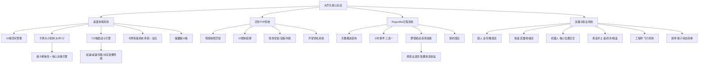

# 《大巴扎》（The Bazaar）游戏分析

## 🎮 基础信息
- **游戏名**: 大巴扎（The Bazaar）
- **开发商**: Tempo Storm（后更名为 Tempo）
- **创意总监**: Andrey "Reynad" Yanyuk（前炉石传说职业选手）
- **发行商**: Tempo
- **发行历史**: 2024年10月封闭测试 → 2025年3月公测 → 2025年8月13日正式登陆 Steam
- **平台**: PC（Steam / 官方客户端），移动端暂无
- **类型**: 异步策略构筑 / 自走棋 / Roguelike / 卡牌构筑
- **Steam 评分**: 多半好评（79% 好评，约5,746条全部评测；近30天47%混合）
- **TapTap 评分**: 9.2 分
- **Metacritic 用户评分**: 5.5 / 10（52%正面，40%负面）
- **游玩状态**: ☐ 游玩中 ☐ 通关 ☑ 分析研究
- **个人评分**: ⭐⭐⭐⭐ (玩法设计4星，综合体验3.5星)

---

## 🎯 核心体验

### 一句话定位
在限制10格的桌面上拼装卡牌阵容，每天打几场异步PVP，不用等对手在线——"单机Roguelike探索 × 多人博弈张力"的混合感受，却没有任何实时操作。

### 核心循环

```
【单日小循环】
事件三选一（商店/随机奖励/探索）
→ 打野怪（获取独特技能/道具）
→ 构筑桌面阵容（10格空间博弈）
→ 日末异步PVP对战（残影对战）
→ 赢/输影响生命值与胜利计数
→ 触发下一天循环

【全局大循环】
开局选英雄 → 3阶段构筑演进（起步/过渡/终局）
→ 攒够10胜/血量耗尽 → 结算奖励
→ 元知识积累（理解新构筑组合）
→ 带更深认知开启新局
```

### 记忆点
1. **无限循环触发时刻**：后期1-2秒内启动完成，全屏特效+叮叮当当刷新音效——你亲手搭建的机器开始永动。
2. **跨职业"神仙搭配"的涌现**：发现低概率跨职业道具组合，产生1+1>>2的爆炸构筑，每一次都是真实的发现感。
3. **10胜制的最后一胜**：相比扣血制自走棋，第10胜时的仪式感完全不同——你打通的不是HP条，是一个10步的旅程。
4. **打野怪三选一的赌博感**：随机给出3个野怪可选，强度差异巨大，正确选择可以跨阶段提升构筑——是游戏最Rogue的时刻。
5. **异步对战结算回放**：不用等对手，局末看回放时才知道自己的阵容在现实对手面前有多强（或多脆弱）。

---

## 🧠 系统架构



### 主要系统拆解

#### 桌面构筑系统（核心创新所在）
- **设计目标**: 让"我拥有什么卡牌"不是唯一的构筑维度，引入"卡牌放哪里有多少格"的空间稀缺性，使同一张牌在不同桌面布局下产生完全不同的战略价值。
- **核心机制**: 
  - 桌面10格 + 储藏箱10格，卡牌分小型（1格）/ 中型（2格）/ 大型（3格）
  - 大型卡牌效果更强但占格多，玩家无法全选大牌——格子本身是稀缺资源
  - 战斗全程自动，卡牌按CD依次触发，扫描线从上至下激活
  - 青铜 / 白银 / 黄金 / 钻石四级等级，所有卡可升至钻石，但升级路径需要持续投入
- **深度来源**: 格子分配是线性约束优化问题：高强度大牌 vs 小牌快速触发CD；运转端（加速/充能）vs 输出端（伤害/毒/暴击）；优化的上限极高，新手和高手在同一道具下可以拼出完全不同的强度。
- **设计亮点**: "格子大小即策略轴"——这是对《背包乱斗》空间策略的一次再抽象，背包乱斗的深度来自"摆哪里"，大巴扎的深度来自"放几格/放多少格"。

#### 异步PVP系统（最反直觉的设计决策）
- **设计目标**: 保留PVP的博弈张力（人打人永远比人打怪有变化），同时消除传统自走棋最大痛点——等待对手在线、匹配耗时、被迫同步游玩。
- **核心机制**: 
  - 每天最后1小时，系统截取同段位真实玩家**当天相同天数**的阵容快照（残影）
  - 玩家与残影对战，胜负影响胜利计数和声望，但没有实时排队
  - 对战后提供完整回放（但无法加速或中断——这是主要批评点）
  - 10胜结算：达到4/7/10胜分别获得奖励，以胜场而非扣血决定结局
- **深度来源**: 异步匹配使得PVP的博弈不是针对**某个具体对手**，而是针对**当前段位的平均构筑形态**，迫使玩家思考"元游戏（meta）"——什么样的构筑能克制大多数当前流行打法。
- **设计亮点**: 异步PVP这个决策是整个游戏最核心也最反直觉的设计——它让Roguelike单机探索和多人博弈在不牺牲任何一方的情况下共存。代价是失去了实时博弈的紧张感，但换来了更完整的Rogue体验节奏。

#### Roguelike 日程系统（Rogue骨架）
- **设计目标**: 把"每天逛商店刷卡牌"的自走棋流程，升级为类《杀戮尖塔》的完整Roguelike探索——每个小时是一个决策节点，不只是逛商店。
- **核心机制**: 
  - 每天分为多个小时，每小时三选一事件（商店/寻宝/野怪/随机事件）
  - 野怪挑战特别重要：战胜后三选一获得野怪技能或道具，强度往往超过商店
  - 事件序列带来的节奏感和意外发现，是游戏"上头"感的主要来源
  - 经济管理：商店花费、白嫖奖励、为后续预留经济的三方权衡
- **深度来源**: 打野路线规划（选哪个野怪）、事件时序（先商店还是先打野）、经济预期（现在买还是等下一天）形成了每一天内的微型策略决策树。
- **设计亮点**: 异步PVP的存在使得Roguelike骨架可以完整保留——如果是实时PVP，等待对手会打断日程探索的节奏；异步化解了这个矛盾，让Rogue感和PVP感可以无缝拼接。

#### 英雄与职业系统（构筑多样性来源）
- **设计目标**: 通过6个完全差异化的英雄，防止全局趋向单一"最优解"，保证每个英雄有独特的构筑语言。
- **核心机制**: 
  - 每个英雄有100+张专属卡牌，同时有通用中立卡牌可跨职业获取
  - 各英雄核心机制完全不同：商人靠牌面金额值/海盗靠武器联动/机器人靠位置交互/炼金靠毒叠加/工程师靠飞行状态减伤/厨师靠格子状态（加热/寒霜）转换
  - **跨职业道具的稀有奖励**：设计师刻意把某机制最强牌给到该机制最弱的英雄，低概率出现跨职业联动时强度爆炸
- **深度来源**: 跨职业道具的发现和利用是最高层次的构筑技巧，需要理解两个职业的底层机制才能看到协同价值。
- **设计亮点**: "把最强的牌给最弱的职业"这个设计决策极其反常规——通常设计师会把强牌放在擅长该机制的英雄手中。这个逆直觉设计创造了小概率高收益的惊喜时刻，是游戏涌现性的核心设计工具。

#### 卡牌等级与附魔系统（纵向成长轴）
- **设计目标**: 让每一张卡牌不是静态的选项，而是一条可以投入资源持续成长的路径，制造"这张牌升到钻石后到底有多强"的期待感。
- **核心机制**: 青铜→白银→黄金→钻石四级，每级效果提升，升级需要消耗特定道具/金币；附魔系统进一步修改卡牌属性，有时能催生奇迹构筑。
- **深度来源**: 升级资源的分配（把资源集中给核心牌还是分散提升所有牌的下限）是中期最重要的策略决策。
- **设计亮点**: 青铜级小卡也能成长为钻石级，意味着前期拿到的"劣势"选择不会成为永久包袱——这是对"强制失败感"的刻意规避，保持玩家的持续投入。

---

## 🎨 体验层分析

### 手感与操控
《大巴扎》几乎没有传统意义上的"手感"——战斗全程自动，玩家在战斗阶段的输入为零。体验感官来源完全转移到**构筑期的拼图满足感**和**战斗结果回放时的预期验证感**。

"手感"的替代品是**构筑界面的交互流畅度**：卡牌拖放到桌面格子、调整排列顺序、查看CD数值后预测出手顺序——这是前置的拟手感操作，情绪投入在构筑期完成，战斗只是验证。

### 关卡/内容设计
日程结构（天→小时→事件）形成了清晰的节奏分层：
- **分钟级**：单次事件决策（三选一），快速、明确、即时反馈
- **小时级**：日内路线规划（商店/野怪/事件优先级）
- **天级**：构筑演进阶段判断（现在处于起步/过渡/终局哪个阶段）
- **全局级**：10胜进度和生命值的双轨压力

难度曲线主要通过匹配的对手残影强度来体现，但被批评为"前期强行连败"——系统可能在前期就匹配到过于成熟的终局构筑，让新手无法建立正常的学习曲线。

### 叙事与世界观
几乎没有传统意义的叙事。世界观为一个以"集市"为背景的虚构奇幻世界，英雄各有简短背景，但主要以美术和道具名称承载世界感。叙事不是这款游戏的重心——它的复玩驱动完全来自系统发现，而非故事牵引。

### 美术与音乐
视觉风格为奇幻卡通风，色彩饱满、卡牌辨识度高。战斗时大量特效动画（卡牌激活连锁特效）是后期"数值爆炸"时刻的感官呈现，强化了"我的机器在运转"的成就感。

主要音效设计的核心是**激活音效的叠加感**：多张卡牌连续触发时的叮叮声，随着构筑强度增加而密度升高，声音本身成了构筑强度的实时反馈——这是很少见的用音效反映数值密度的设计。

---

## ⚖️ 设计取舍分析

| 设计决策 | 得到了什么 | 放弃了什么 | 被什么约束逼出来的 |
|---------|-----------|-----------|-----------------|
| 异步PVP（残影对战） | Rogue探索节奏完整保留；零等待时间；随时暂停；吸引了只玩单机的玩家 | 实时博弈紧张感；无法针对特定对手动态调整；匹配质量依赖当段位玩家数量 | Roguelike体验节奏和实时PVP天然冲突：实时匹配打断探索流程，异步是唯一可行解 |
| 10胜制而非扣血淘汰 | 前期胜利和后期同等重要；前期投入度大幅提升；血量容错让玩家可以挺到终局 | 传统自走棋"最后存活"的悬念感；容错高也意味着滚雪球强度差异扩大 | 设计师想要"每场战斗都重要"——扣血制导致后期决定一切，前期可以不在乎 |
| 格子大小机制（大/中/小） | 空间维度成为独立策略轴；无法无脑全选大牌；前期小牌也有长期价值 | 直觉判断难度提升（格子计算不如"拥有最强牌"直觉）；新手认知负担加重 | 差异化竞争：《背包乱斗》已经做了空间定位，大巴扎需要不同维度的空间博弈 |
| 6英雄差异化职业池 | 每个英雄构筑语言完全不同；跨职业联动创造惊喜；元游戏多样性 | 设计和维护成本极高；平衡性持续挑战；新玩家选择成本高 | 对标炉石传说的创始目标：防止"最优解收敛"是炉石最大的失败原因之一 |
| 把最强机制牌给最弱的职业 | 小概率跨职业高收益；涌现性最强的构筑来自意外联动 | 强度方差极大；依赖特定跨职业道具的构筑极度运气敏感 | 主动制造稀有的"奇迹时刻"——预期内的组合不会产生发现感，只有意料之外的才会 |
| 拒绝Steam→迫于压力上Steam | 最终获得了更大用户基础；国区定价 | 错失公测期的Steam流量红利；付费模式被迫多次调整损害口碑 | 创始人Reynad的反平台立场（不想给Steam分成）撞上游戏运营现实（独立平台用户获取成本太高） |
| F2P→付费买游戏+DLC英雄 | 降低了"多款英雄不付费不能用"的P2W质疑 | 付费转变让早期玩家感到被背刺；DLC英雄付费模式仍有P2W争议 | 开发商资金压力：独立客户端无分成 + F2P广告收入不足以支撑运营 |
| 战斗无加速/无法跳过动画 | 每次战斗视觉呈现完整，特效动画是付费内容的展示窗口 | 单局时间过长；重复看动画劝退玩家；异步游戏节奏本应更快 | 疑似优先级问题（功能工程资源不足）或刻意让皮肤/特效有曝光时间 |

---

## 💡 值得借鉴的设计

1. **异步PVP作为Roguelike和多人博弈的桥梁**：如果要开发一款构筑类Roguelike而又想引入PVP张力，异步残影匹配是值得认真考量的架构方案。在我的项目中，如果战斗是自动结算的（如卡牌/自走棋），可以实现：玩家提交构筑快照 → 系统在合适时间与同段位快照对战 → 战斗结果返回，完全不需要玩家同时在线。技术上需要构筑快照存储+战斗引擎离线结算两个模块。

2. **10胜制结算而非血量淘汰制**：在构建任何对抗性游戏时，"以胜场计数"而非"以血量计算"会显著改变玩家对前期游戏的投入度。核心原理：每一次对战都有等价的重要性，不会出现"我前期摆烂后期翻盘"的垃圾时间。适用于：任何有"前中后期演进"的策略游戏，当你希望每个阶段都对玩家有意义时，考虑改用胜场制替代扣血制。

3. **格子大小作为独立稀缺轴**：背包类游戏不应只有"拥有什么道具"这一维度。大巴扎的大/中/小格子机制告诉我们：格子的"大小成本"可以成为独立的策略权衡轴，使大型强力道具和小型快速道具之间存在真实的取舍张力，而非单纯的强弱比较。在任何有背包/装备槽系统的游戏中，给道具加上"占格数"属性并设置总格数上限，可以低成本引入这个策略维度。

4. **反直觉的道具分配：把最强机制牌给最弱的职业**：为了制造涌现性，设计师可以刻意制造"错位搭配"——把某机制最强的道具分配给该机制最弱的职业，使跨职业联动成为低概率高收益的奖励机制。在卡牌/构筑游戏设计中：给每个职业/角色分配1-2个来自"不相关"职业的强力道具，并确保这些道具在该职业的正常游玩路径下可以偶然出现。

5. **音效密度反映战斗强度**：大巴扎后期卡牌连续激活时，音效叠加密度是构筑强度的实时声音反馈。在自动战斗类游戏中，可以将"每秒触发次数"映射到音效密度/节奏，让玩家在听觉上就感受到自己的阵容有多强——无需看数字。

6. **CD时间轴战斗引擎而非回合制**：大巴扎的战斗不是"我出一张你出一张"，而是所有卡牌都有各自的CD时间轴，谁先冷却完谁先触发。这产生了"快速触发是独立的策略维度"——加速/充能/减少CD成为独特的构筑方向，而不只是"数值变大"。在设计自动战斗系统时，用实时CD替代同步回合制，可以增加一个"时序"策略维度。

---

## ❌ 不足与问题

1. **商业模式反复摇摆，严重损害信任**：游戏经历了F2P→付费买游戏→DLC英雄付费→通行证新卡P2W的多次商业模式转变，每次转变都损害了既有玩家的信任。改进方向：商业模式应该在早期就明确锁定，宁可晚上线也要想清楚变现路径，后期调整的代价是口碑和用户流失。这是大巴扎最深刻的失败——它在玩法设计上证明自己是正确的，却在商业层面反复试错，给了口碑修复极大难度。

2. **无加速战斗、无法跳过动画**：异步游戏的核心优势是节奏自由，但大巴扎的战斗动画无法加速或跳过，削弱了异步优势的体验。国内玩家差评中这是高频反馈。改进方向：加速/2x/跳过按钮是异步战斗游戏的基础功能，应与核心玩法同期实装。

3. **新手引导薄弱，学习曲线陡峭**：没有图鉴（物品/英雄/野怪），新手必须依赖外部Wiki。匹配早期又可能碰到对手的成熟终局构筑，导致"进游戏先强行连败"的劝退体验。改进方向：内置物品百科+初始引导地图（分离新手和老手的早期匹配池）。

4. **技术稳定性问题**：崩溃、卡顿、网络延迟高、重进丢失进度，是Steam负评的主要内容之一。对于7年开发的游戏，这一水平的稳定性明显低于玩家预期。改进方向：正式上线Steam之前需要更完善的服务器压力测试和崩溃上报机制。

5. **缺少历史对局记录**：异步对战完成后无法回溯查看过去的战斗记录，玩家无法系统性地复盘失败的构筑。这对一个强调"认知成长"的游戏来说是重大缺失——复盘工具和成长轨迹可视化应该是Roguelike游戏的标准配置。

6. **后期无限循环破坏平衡感**：高端局经常在1-2秒内完成战斗触发无限循环，等效于"一方立即输掉"，对无限循环的上游路径设计需要更严格的约束，否则构筑优化收敛到少数"无限触发流"，丧失多样性。

---

## 🔗 知识关联

### 与已读书籍的关联

- **《游戏编程设计模式》**: CD触发战斗引擎是**观察者模式**的时序版本——每张卡牌订阅"冷却完成"事件，触发时广播效果给其他卡牌；跨职业道具联动本质是**策略模式**（每张道具实现独立的"触发效果接口"）；桌面格子的布局脏标记（Dirty Flag）优化：每次格子变动后重算协同关系，而非每帧轮询。| 关联强度: ⭐⭐⭐⭐⭐

- **《思考快与慢》**: 异步匹配制造的**元游戏决策**（预测当前段位流行构筑）是纯粹的系统2思考；事件三选一中的稀有道具选择激活系统2；后期无限循环触发时的**数量级满足感**利用系统1的"大数字=成功"直觉；**核心挑战：大巴扎挑战了"PVP博弈感需要实时互动"的系统1直觉**——异步对战在认知上也能产生与实时PVP等价的博弈感，证明博弈感来自"结果不确定性"而非"实时互动"本身。| 关联强度: ⭐⭐⭐⭐⭐

- **《游戏编程算法与技巧》**: 三选一事件的权重随机采样（不同品质道具的出现概率设计）；野怪掉落道具的分级概率控制；卡牌等级系统的数值平衡（青铜→钻石的倍率设计）；异步PVP的匹配算法（按段位、天数双维度匹配残影快照）。| 关联强度: ⭐⭐⭐⭐

- **《架构整洁之道》**: 战斗引擎（高层）与卡牌效果实现（低层）的依赖倒置——战斗引擎不依赖具体卡牌，只依赖"ICard.onTrigger()"接口，新加卡牌不修改引擎；英雄职业系统的开闭原则：新增英雄不修改现有职业逻辑，只添加新的卡牌池实现。| 关联强度: ⭐⭐⭐⭐

- **《真需求》（梁宁）**: 大巴扎挑战了"自走棋玩家需要实时博弈感"的应然假设——实然是玩家真正需要的是"不确定的对手压力"，异步残影同样提供了这种不确定性；商业模式的反复摇摆是一个"找错真需求"的反面案例：开发商一直在探索"玩家愿意为什么付费"，但频繁改变策略表明对玩家付费真需求的理解始终未到位。| 关联强度: ⭐⭐⭐⭐

### 与其他游戏的关联

| 游戏 | 关联类型 | 关联描述 |
|------|---------|---------|
| 背包乱斗 | 同类对比 | 同为背包空间管理+自动战斗；背包乱斗的空间深度来自"摆哪里"（相邻协同），大巴扎来自"占几格"（格子稀缺）——同一设计模式的两个不同抽象层级。背包乱斗更直觉（视觉上能看到相邻关系），大巴扎更抽象（需要计算CD和格子效率）|
| 杀戮尖塔2 | 设计传承 | 大巴扎被Reynad明确描述为"多人版《杀戮尖塔》"。两者同为构筑Roguelike：StS2深度来自"用什么卡在战斗中出什么牌"（战中决策为主），大巴扎深度来自"如何安排10格桌面"（战前决策为主）——战斗决策时序谱系的两极 |
| 小丑牌 | 同类对比 | 同为构筑Roguelike；小丑牌有"Chips × Mult乘法爆炸"，大巴扎有"卡牌无限循环触发"——两种不同形态的"数值爆炸终局感"；小丑牌有实时出牌操作，大巴扎战斗完全自动；小丑牌单人游戏，大巴扎异步多人 |
| 炉石传说 酒馆战棋 | 同类对比 | 传统自走棋（实时匹配+轮次等待）vs 异步自走棋——大巴扎通过异步化彻底解决了"等待痛苦"；酒馆战棋无英雄职业分层，大巴扎强职业差异化防止最优解收敛 |
| 孤星猎人 | 战斗决策时序对比 | 两者战斗结算都全自动；孤星猎人的策略在构筑期的飞船布局，大巴扎在10格桌面布局——同为"战前决策决定战斗"的游戏，但孤星猎人的对称冲击波战斗将失败完全归因给玩家构筑，大巴扎的异步对战引入了"对手构筑演进"的不确定变量 |

### 对自身项目的启发
- **异步PVP架构**：在任何构筑类游戏中，如果战斗是确定性自动结算的（给定双方构筑就能计算结果），都可以实现异步匹配——玩家提交构筑快照，离线结算战斗，返回结果。技术需求：①构筑序列化存储；②战斗引擎无状态可离线运行；③对战历史记录查询。这个模式消除了"玩家必须同时在线"的核心约束，大幅扩展用户群。
- **10格+大中小格子的稀缺约束**：如果在自己的游戏中有"背包"或"装备槽"系统，给道具加上"占格数"属性并设置总上限，可以低成本引入格子稀缺策略轴，不需要大幅改造现有系统架构。

---

## 📊 总结

### 最大的收获
异步PVP是一个可以从概念层直接借鉴的架构范式——它证明了"多人博弈感"的本质是"结果不确定性"而非"实时互动"。这个洞察挑战了我关于"多人游戏必须实时"的直觉假设，并给出了一个可工程化的替代方案。

### 核心结论
大巴扎在游戏设计层面做出了三个真正具有行业意义的贡献：①用异步PVP证明Roguelike和多人博弈可以无缝共存；②用10胜制重新分配了自走棋前中后期的重要性权重；③用格子大小机制在背包管理游戏中引入了新的稀缺维度。这三点任何一个单独存在都值得作为设计案例研究。然而，游戏的商业层面是一个反面教材——玩法设计出色不足以拯救一个反复摇摆的变现策略，口碑损失一旦形成难以修复。这款游戏是"设计正确但运营失败"的典型标本。

**改变认知的洞察**：异步PVP这个决策揭示了一件我此前没有清晰意识到的事——玩家感受到的"博弈感"来自**结果的不确定性**，而非来自**实时的对抗互动**。这意味着任何可以生成"对手是真实玩家行为结果"的数据的游戏，都可以模拟出多人博弈感，即使双方从未在同一时间在线。

---

**分析创建时间**: 2026-07-06
**最后更新**: 2026-07-06

---

**数据来源**：
- [TapTap 大巴扎页面](https://www.taptap.cn/app/816773)（TapTap 评分 9.2）
- [知乎：如何评价自走棋游戏《The Bazaar》](https://www.zhihu.com/question/1898513145691113394)
- [知乎：3600字详解大巴扎为何如此上头](https://zhuanlan.zhihu.com/p/1992245959376249400)
- [机核 GCORES：从大巴扎学习构筑设计范式](https://www.gcores.com/articles/210269)
- [游研社：让我痛并快乐的3A自走棋](https://www.yystv.cn/p/12684)
- [Steam 商店页面](https://store.steampowered.com/app/1617400/The_Bazaar/)
- [Mobalytics：The Bazaar 介绍](https://mobalytics.gg/the-bazaar/guides/what-is-the-bazaar)
- [ResetEra：The Bazaar 登陆 Steam 讨论](https://www.resetera.com/threads/the-bazaar-is-coming-to-steam-will-be-a-premium-title-instead-of-f2p-up-20-for-the-first-3-days.1266369/)
