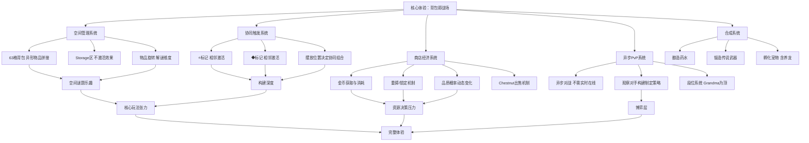

# 《背包乱斗》游戏分析

## 🎮 基础信息
- **游戏名**: 背包乱斗（Backpack Battles）
- **开发商**: PlayWithFurcifer（小型独立工作室）
- **发行商**: IndieArk（中文市场）/ Shochiku（日本）/ PlayWithFurcifer（其他）
- **发行年份**: 抢先体验 2024年3月；正式发售 2025年6月
- **平台**: PC（Steam）；暂无手游版本
- **类型**: 背包管理 / 自动战斗（Auto Battler）/ 异步PvP / 策略
- **游玩时长**: 单局 20-40 分钟，高重玩性
- **游玩状态**: ☐ 游玩中 ☐ 通关 ☐ 白金/全成就 ☐ 放弃
- **个人评分**: ⭐⭐⭐⭐⭐ (待填写)
- **Steam 评价**: 特别好评（简中 7,229 条；英文 5,441 条，92% 好评）

---

## 🎯 核心体验

### 一句话定位
把 RPG 里最让人头疼的"背包整理"变成了整个游戏的核心乐趣——空间布局决定战力，物品相邻触发协同，俄罗斯方块式的谜题感和自走棋的构建深度融合在一个背包里。

### 核心循环

```
[单轮循环]
获得金币
  → 商店浏览5件物品（购买/重掷/锁定）
  → 在背包格子中摆放物品
    ├── 空间规划：L形/T形/异形物品的拼接
    └── 协同激活：⭐/◆相邻标记触发效果
  → 自动战斗（无需操作，观察结果）
  → 胜→维持生命；败→扣血
  → 进入下一轮，金币增加

[全局构建弧线]
早期: 资源稀缺，凑合能用的东西活下去
中期: 核心思路成型，开始围绕协同链取舍
后期: 构建趋于完整，面对高手对的是整个体系
```

### 记忆点

1. **第一次发现"放错位置=差10倍战力"** — 意识到⭐/◆协同系统，同样的物品不同摆法战力天差地别
2. **背包排满那一刻** — 异形物品像俄罗斯方块一样刚好填满，有种极致整齐的满足感
3. **松鼠流** — 发现某个看起来奇葩的流派居然可行，社区集体共鸣
4. **第一次打到"Grandma"段位** — 最高段位叫"奶奶"，命名本身就是记忆点
5. **Chestnut（栗子箱）把物品吃掉** — 一个有角色感的卖物品机制，把菜单操作变成了有趣的互动

---

## 🧠 系统架构



### 主要系统拆解

#### 空间管理系统（最反直觉的核心）
- **设计目标**: 将"背包整理"这个传统 RPG 中的负担转化为核心乐趣，让空间布局本身成为策略决策的载体
- **核心机制**: 63个可用格子；物品有 L形/T形/1x2/异形等多种形状；可旋转放置；Storage 区的物品效果不激活
- **深度来源**: 空间限制创造了真实的取舍——这件新物品适合放在哪？它会和哪些物品相邻？会挤掉哪件现有物品？每次购买都是一次空间谜题
- **反直觉之处（关键洞察）**: RPG 玩家的条件反射是"背包管理是烦人的整理工作"。Backpack Battles 把这个直觉完全翻转——**背包整理就是游戏本身**，而且是最令人上瘾的部分。这个翻转的成立依赖于：空间布局直接影响战力（不是纯审美），让每次整理都有实质意义。

#### 协同触发系统（深度的真正来源）
- **设计目标**: 让物品的摆放位置（而非仅仅是拥有什么）成为核心策略变量，使每次背包调整都有新的可能性
- **核心机制**: 每件物品上有⭐和/或◆标记；相邻物品满足条件时触发协同效果；同一物品只能为另一件物品提供一个⭐和一个◆
- **深度来源**: 相同的物品组合，A在B左边和A在B右边可能触发不同的协同；同时满足多组协同需要精确规划相邻关系；后期构建的挑战是在有限空间里最大化协同链
- **与同类游戏的根本差异**: 自走棋类游戏（Hearthstone Battlegrounds、TFT）的深度来自"拥有什么"；Backpack Battles 的深度来自"怎么放"——**空间位置即策略**，这是独有的设计维度。

#### 异步 PvP 系统
- **设计目标**: 提供竞技深度和反制博弈，但消除实时对抗的时间压力和等待焦虑
- **核心机制**: 对战对方预先配置好的构建，不需要对手实时在线；玩家可以仔细观察对手的背包布局，针对性调整
- **深度来源**: 异步创造了"侦察+反制"的博弈层——对手的构建是可见的，你可以针对性地调整；但对手也可能预料到你的反制
- **设计取舍的约束**: 实时 PvP 需要服务器基础设施和大量同时在线玩家，这对小型独立工作室是巨大成本。异步模式让极小团队可以支撑竞技体验，**这是规模约束逼出来的务实选择**，但同时也创造了独特的"思考型竞技"体验

#### 商店经济系统
- **设计目标**: 用稀缺性和随机性制造持续的资源决策压力，同时保持玩家对构建方向的控制感
- **核心机制**: 每轮5件物品；重掷机制（前4次1金，之后2金）；品质概率随轮次动态提升；锁定机制
- **深度来源**: 重掷有成本，迫使判断"这轮给的东西值不值得继续找"；锁定机制让中意的物品可以安全保留；Unique 物品的低概率带来惊喜时刻
- **Chestnut 的设计价值**: 将"出售物品"做成有角色感的互动——不是点菜单，而是让一个有趣的 NPC "吃掉"你的物品。这是极低成本（只是一个 NPC 交互）带来的极高叙事感提升。

---

## 🎨 体验层分析

### 手感与操控
无实时操作压力，节奏完全由玩家控制。背包拼接的操作本身有俄罗斯方块般的空间操作感——物品旋转、试放、调整的过程有清晰的即时反馈。自动战斗时的观战体验需要足够的视觉信息让玩家理解"为什么赢/输"，这直接决定了可归因失败的设计质量。

### 关卡/内容设计
无传统意义的关卡，以"轮次递进"替代。每轮对手强度递增，构建必须不断适应；品质概率的动态变化制造了中后期的期待感（"好东西快出来了"）。500+ 物品保证了高重玩性，但也带来学习曲线陡峭的问题。

### 叙事与世界观
叙事极轻，以幽默的命名和 NPC 设计为主要叙事媒介。"Grandma"段位命名、"Chestnut 吃物品"等设计营造出轻松幽默的氛围，与游戏的卡通可爱美术统一。叙事服务于"降低进入门槛"而非提供深度故事。

### 美术与音乐
可爱卡通风格，高辨识度。物品的视觉设计优先传达功能信息——形状直觉上传达出效果类型（武器/药水/宠物）。Steam 标签中"Cute"是玩家高频标注，说明美术风格本身是获客要素之一。

---

## ⚖️ 设计取舍分析

| 设计决策 | 被什么约束逼出来的 | 得到了什么 | 真实代价 |
|---------|-----------------|-----------|---------|
| 异步 PvP 而非实时对战 | 小团队无力维护实时服务器基础设施；也无法保证大量玩家同时在线 | 无等待焦虑；"思考型竞技"体验；玩家可仔细分析对手构建 | 缺乏实时对抗的肾上腺素刺激；部分玩家感到"竞技感不够" |
| 空间布局决定协同激活 | 纯粹"拥有什么"的构建类游戏太多，需要差异化维度 | 独一无二的"摆放位置即策略"体验；背包整理有实质意义 | 新手学习曲线陡峭；协同系统理解成本高；初期容易放错位置损失战力 |
| 所有职业初始属性相同 | 数值差异的职业会让玩家感到起点不公平；开发者想让策略差异化来自选择而非先天 | 起点公平感强；职业差异化来自物品池，有更高可设计性 | 职业的独特感弱化；初期选职业时缺乏直觉的"我要玩这个角色"的代入感 |
| 500+ 物品 + 物品合成系统 | 保证高重玩性；满足"还有什么没见过"的探索欲 | 极高的重玩价值；每局都有新发现的可能 | 学习成本极高；新手面对物品数量可能感到压倒性；平衡性维护困难 |
| Storage 区物品不激活效果 | 需要让背包空间稀缺成为真实代价，否则"全部塞进去"就成最优解 | 背包空间是真实稀缺资源；摆放决策有实质意义 | 新手踩坑率极高（误把物品放在 Storage）；上手体验差 |
| 独立发行 + IndieArk 中文区代理 | 小工作室无力独立覆盖所有市场营销；中文市场需要本地化资源 | 中文玩家量庞大（7,229 条评价超过英文 5,441 条）；运营支持 | 两层发行商可能导致决策链复杂；本地化质量依赖第三方 |

---

## 💡 值得借鉴的设计

1. **"负担即乐趣"的设计翻转**: 找到玩家在其他游戏中觉得是"负担"的操作，问"如果把这个负担变成核心玩法，会怎样？"背包整理是最成功的案例之一。在 `slayDemo` 中，可以思考哪些通常被玩家视为"麻烦事"的操作可以被翻转成乐趣——比如"武器耐久度管理"通常是烦人的，但如果武器状态直接影响技能效果，修复武器就变成了策略决策。

2. **空间位置即策略的实现路径**: 在 `slayDemo` 中，如果有装备/道具系统，考虑让"物品放在哪个插槽"影响其行为——比如武器在主手和副手的效果不同，技能在技能条的位置影响连锁触发顺序。**在 Godot 实现**: `EquipmentSlot` 节点暴露 `slot_type: SlotType` 和 `position_index: int` 属性，物品的效果计算时从 slot context 中读取位置信息，决定触发哪些协同。

3. **⭐/◆相邻协同系统的架构**: 物品的协同效果不是硬编码"A+B=C效果"，而是基于通用的"标记相邻"规则动态计算。在 `slayDemo` 中，可以给道具定义 `trigger_tags: Array[String]`（触发条件标签）和 `required_adjacent_tags: Array[String]`（需要相邻满足的标签），协同系统统一检查相邻关系，不需要为每对物品单独编写协同逻辑。这是高扩展性的协同系统设计。

4. **Chestnut"NPC 吃物品"的叙事化操作**: 把任何菜单操作（出售/拆解/升级）包装成有角色感的 NPC 交互，成本极低但叙事感大幅提升。在 `slayDemo` 的关卡中，可以把"丢弃道具"设计成"扔给某个 NPC"，把"升级装备"设计成"委托某个铁匠"——操作结果相同，但交互体验完全不同。

5. **"可归因自动战斗"的设计要求**: 自动战斗的核心挑战是让玩家理解"为什么赢/输"。Backpack Battles 通过直观的物品触发动画、伤害数字、状态图标让每次战斗过程清晰可读。在 `slayDemo` 的自动/半自动战斗设计中，战斗日志或战斗回放是让失败可归因的必要投入，而不是可选的锦上添花。

6. **段位命名的幽默感策略**: "Grandma（奶奶）"作为最高段位，制造了社区话题性和记忆点，成本为零（只是改了个名字）。在 `slayDemo` 中，成就/段位/称号的命名可以刻意避开"传说/神话"等常规命名，用具体的、有点荒诞的名字——这不只是幽默，而是建立社区共同语言的低成本策略。

---

## ❌ 不足与问题

1. **新手曲线陡峭**：Storage 区踩坑、协同系统不直观、500+ 物品的认知压力，三重叠加让第一局体验可能很差。"第一局就理解为什么自己输了"这个关键设计要求没有完全达到。改进方向：主动的第一局引导，高亮展示当前最重要的协同触发，让新手在第一局就体验到一次"啊原来是这样"的顿悟。

2. **异步 PvP 缺乏实时刺激感**：约 8-12% 的差评部分来自"缺乏实时竞技感"。这是设计取舍的代价，但随着玩家群体扩大，提供可选的实时模式可能会扩展受众。

3. **平衡性维护的长期挑战**：500+ 物品 × 35 种职业子方向的组合空间极大，任何一次平衡调整都可能产生连锁影响。正式版发售后的平衡争议已经出现（近期评价从92%略降至88%）。

4. **视觉信息密度过高的阅读负担**：背包中充满各种形状、图标、标记的物品，在后期构建完整时视觉噪音很大。改进方向：提供"hover显示协同关系"的视觉辅助，让玩家可以快速检查当前协同激活情况。

---

## 🔗 知识关联

### 与已读书籍的关联——以及与书里观点的张力

- **游戏编程设计模式**: ⭐/◆协同系统是**观察者模式的空间化版本**——不是"A事件通知B"，而是"A和B相邻时激活协同效果"。书里的观察者模式用于时序解耦；这里扩展到了空间解耦。**书里没有讨论的问题**：当观察者是基于空间关系而非事件触发时，系统需要在每次背包布局改变时重新计算所有相邻关系——这是一个性能权衡问题，需要用脏标记（Dirty Flag，书里另一个模式）来优化 | 关联强度: ⭐⭐⭐⭐⭐

- **游戏编程算法与技巧**: 物品的空间摆放和协同计算涉及**2D 空间划分算法**——如何高效判断哪些物品相邻？如何处理 L 形/T 形物品的多格占用？这是一个网格空间查询问题，书中的"空间分区"章节有直接关联。但书中主要讨论的是 3D 场景的空间分区，2D 格子的相邻判断更简单但有其自己的边界情况（对角线算不算相邻？） | 关联强度: ⭐⭐⭐⭐

- **真需求（梁宁）**: Backpack Battles 是"应然 vs 实然"的完美案例——**应然**是"背包整理是负担，玩家不想做这件事"；**实然**是"给了正确的反馈机制后，背包整理变成玩家最上瘾的操作"。这说明梁宁所说的"真需求"有时需要先创造条件才能被发现，而不是从已有行为直接读取 | 关联强度: ⭐⭐⭐⭐⭐

- **思考快与慢**: 游戏利用系统1的**视觉整齐感**制造满足感——背包排满的那一刻有整齐强迫症被满足的感觉，这是系统1的直觉反应，不是理性计算。同时，协同系统的优化需要系统2的仔细规划（哪些物品放哪里）。**这款游戏在系统1（满足感、视觉整齐）和系统2（协同规划、资源决策）之间找到了独特的平衡点**——两个系统都被调动，互不干扰 | 关联强度: ⭐⭐⭐⭐

- **架构整洁之道**: 所有职业初始属性相同，差异化来自物品池——这是依赖倒置原则的游戏设计版本：**高层（职业）不依赖低层（具体数值）**，两者都依赖抽象（"物品效果接口"）。结果是职业本身极度轻量，扩展新职业的成本很低。**但这里有个张力**：纯抽象化的职业设计在技术架构上是干净的，但在玩家情感层面可能让职业缺乏代入感——玩家往往希望职业有一个"感觉上的数值强项" | 关联强度: ⭐⭐⭐

### 与其他游戏的关联

- **杀戮尖塔2**: 同类对比——都是构建类+策略深度，但核心维度不同。STS2 的构建深度来自"拥有什么牌"；Backpack Battles 的构建深度来自"怎么摆放"。**洞察**：两款游戏共同证明了"构建类游戏的深度不一定来自数值，而可以来自组合规则的复杂性"——STS2 用牌组厚度制造稀缺，BB 用空间格子制造稀缺，机制不同但稀缺感同样真实。

- **Hearthstone Battlegrounds / TFT（自走棋）**: 同类对比——都是自动战斗 + 构建，但 BB 增加了空间维度。传统自走棋的深度来自"羁绊（2+2+4的数量搭配）"；BB 的深度来自"位置（相邻关系）"。**反直觉的发现**：增加空间维度让一个已经成熟的类型产生了新的学习价值，不是做得更大，而是加了一个新的轴。

- **俄罗斯方块**: 设计基因传承——BB 的物品形状和背包拼接直接借鉴了俄罗斯方块的空间语言。但俄罗斯方块是纯空间谜题（无策略深度），BB 在空间谜题的基础上叠加了策略选择和协同系统，是一次成功的基因嫁接。

### 对自身项目（slayDemo）的具体启发

1. **空间化协同系统的 Godot 实现方案**：在 `slayDemo/systems/` 创建 `SynergySystem.gd`，维护一个 `adjacency_map: Dictionary` 记录每个格子的占用物品。物品放置/移除时更新 adjacency_map，并重新计算所有相邻对的协同效果。触发的协同以信号广播给物品本体，物品订阅 `on_synergy_activated(synergy_type: String)` 信号并应用效果。

2. **"操作即叙事"的设计实践**：在 `slayDemo` 的下一个版本，给任何"功能性操作"（升级/修理/出售）找一个 NPC 角色来承载——即使只是一行对话文字，也能让操作有温度。优先级：出售道具给"某个废品收购者"，修理装备找"某个流浪铁匠"。

3. **脏标记（Dirty Flag）优化协同计算**：协同效果只在背包布局改变时重算，而非每帧都算。在 `SynergySystem` 中维护 `is_dirty: bool`，任何物品位置变化时设为 true，战斗开始前检查并重算。这是书中脏标记模式的直接应用。

---

## 📊 总结

### 最大的收获
**"找到目标用户的'行为式恐惧'，然后把它变成乐趣"是一条被严重低估的创新路径。** 背包整理是 RPG 玩家的集体行为式恐惧——"我还有背包要整理"带来的负担感几乎是普世的。Backpack Battles 没有"消除"这个恐惧，而是精确问了一个问题：**背包整理的负担感来自什么？来自"没有意义感"——整理完了游戏好像也没变好。** 解法是让整理直接影响战力，让每次整理都有即时的意义反馈。

### 认知转变（第五层洞察）

读这款游戏之前，我认为游戏创新的主要路径是"加新东西"——新机制、新系统、新内容。

Backpack Battles 改变了这个认知：**游戏创新最有力的路径之一是"把现有事物重新定义它的位置"**。背包整理这件事本身没有变，变化的是它在游戏里扮演的角色——从"进入真正游戏之前必须完成的准备工作"变成"游戏本身就是这件事"。

这个认知转变对 `slayDemo` 的影响是：我应该问"当前 slayDemo 里，哪些操作是玩家在做真正游戏之前必须完成的准备工作？"——那些地方可能就是把负担变成乐趣的机会。

### 核心结论

《背包乱斗》的核心成就是找到了两个成熟类型（自走棋的自动战斗博弈 + 俄罗斯方块的空间谜题）的一个共同缺失维度，然后把这两个类型嫁接到一起，同时翻转了 RPG 背包管理的情感极性。结果是一款拥有独特身份认同的游戏，而不是"又一款自走棋"或"又一款益智游戏"。

对独立开发者最重要的启示：**类型嫁接 + 情感翻转是小团队实现差异化的可行路径**——不需要从零发明新机制，只需要找到两个现有类型之间未被探索的交叉点，然后问"把哪个已知的负担变成乐趣可以完成这个融合？"

---

> 参考来源：Steam 商店页面、Backpack Battles 官方 Wiki（backpackbattles.wiki.gg）、Steam 社区标签数据
> Steam 链接：https://store.steampowered.com/app/2427700/Backpack_Battles/

**分析创建时间**: 2026-06-17
**最后更新**: 2026-06-17（已通过 rules.md 自我审查）
