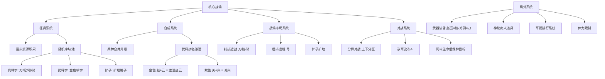

# 《赵云与阿斗》游戏分析

## 🎮 基础信息
- **游戏名**: 赵云与阿斗
- **开发商**: 北京蜜獾工坊科技有限公司（约20人团队，核心项目仅3-5人）
- **发行商**: 蜜獾工坊（自发行）
- **发行年份**: 2026年6月
- **平台**: 微信小游戏、抖音小游戏、Android（Google Play）、腾讯应用宝
- **类型**: 文字合成 × 塔防策略 × Roguelike 元素 × 轻竞技对战
- **游玩时长**: 单局 3-5 分钟；无限复玩
- **游玩状态**: ☑ 游玩中
- **个人评分**: ⭐⭐⭐⭐ (4星)

---

## 🎯 核心体验

### 一句话定位
用汉字偏旁部首拼出三国将领，在竖屏上下分屏战场中与真人（或AI）对抗——看谁先保住阿斗。

### 核心循环
```
[主循环 · 局内]
消耗馒头征兵 → 随机获得字块（刀/枪/弓/骑/武将单字）
→ 放置字块到战场格子 → 同类同级字块合并升级
→ 拼凑武将全名激活 → 兵/将攻击波次敌人获得馒头
→ 扩地/合成/调整布局 → 先于对手让阿斗到达终点

[元循环 · 局外]
局内收集武器装备 → 分配给武将提升下局强度
遭遇神秘商人 → 随机选取增益道具
积累军衔星级 → 解锁排行榜竞技

[爆款传播循环]
游戏截图/短视频传播 → 话题裂变（抖音播放6.8亿）
→ 社交压力驱动安装 → 轻松上手后分享给下一圈朋友
```

### 记忆点
1. **"赵""云"两个金色字终于凑齐那一刻** —— 合成武将全名激活的爽感是最强的情绪高峰
2. **弓字拉弓射箭的文字动效** —— 汉字结构被具象化成攻击动作，第一次看到会愣一下
3. **对手阿斗只剩一滴血但己方防线也快崩了** —— 双方同屏竞争制造的临界紧张感
4. **"马超可以，马云为什么不上"** —— 玩家自发梗图传播，验证了IP与汉字文化的共鸣爆点

---

## 🧠 系统架构



### 主要系统拆解

#### 文字合成系统（核心创新点）
- **设计目标**: 让非游戏用户也能产生"哇原来这样"的认知爽感，同时给熟悉汉字的玩家额外的文化共鸣层
- **核心机制**: 所有兵种和武将都以汉字形态呈现，字块按规则拼合后激活战斗力——"弓"拉弦射箭、"枪"的木字旁变成标枪、"赵云"的"乂"化作刺击长枪。同等级同类字块两两合并，升为下一级同类字块
- **深度来源**: 武将名拼合的随机性制造策略张力——你有"赵"但没"云"，格子有限，"赵"字只是废棋还是等待机会？玩家需要在"等武将凑齐"和"用小兵顶住当下"之间动态权衡
- **设计亮点**: 用公有域文化符号（汉字+三国人名）作为视觉语言，零IP授权成本实现了差异化美术，且天然契合三国历史知识带来的"认知确认感"

#### 资源-格子约束系统
- **设计目标**: 制造稀缺感，让"扩地"成为核心战略决策而非可选附加
- **核心机制**: 战场格子有限（初始约12格），消耗馒头的铲子可以挖开地面扩展可用格数。"背包like"的扩地机制使格子本身成为战略资源，而非只是放置容器
- **深度来源**: 合成需要格子，武将凑字需要格子，防守需要格子——三个需求同时竞争同一稀缺资源，迫使玩家做优先级排序决策
- **设计亮点**: 铲子引入了"即时vs长远"的经典策略张力——现在用馒头征兵还是用馒头买铲子扩地？这一选择在每局中反复出现，是决策密度的核心来源

#### 双人分屏对战系统
- **设计目标**: 借鉴《Random Dice》的对称竞技框架，让输赢有清晰的对手参照，强化"要赢"的动机
- **核心机制**: 竖屏上下各半，双方同步进行相同的塔防对抗，但防守的是AI生成的敌人波次（非直接攻击对方），先让阿斗到达终点的一方获胜
- **深度来源**: 实时看到对方操作节奏产生压力感（对方合成速度快时会焦虑），但并不需要理解对方具体策略——压力感存在但认知负担可控
- **设计亮点**: 分屏可视化对手进度是极强的短视频传播素材，玩家录屏就能展示"赛跑感"，天然适配抖音内容消费习惯

#### 随机征兵池系统
- **设计目标**: 引入Roguelike不确定性，让每局感受不同，防止"最优解记忆化"导致无聊
- **核心机制**: 每次消耗馒头征兵，从字块池中随机抽取，出现概率：普通兵种字 > 铲子 > 紫色武将字 > 金色武将字
- **深度来源**: 武将字的低出现率制造强烈的期待感（"这次能不能出赵云的第二个字"），但也产生了"非洲玩家凑不齐"的负面体验
- **设计亮点**: 武将名拼合对字的顺序无要求（放置时按正确顺序即可），降低了随机暴力性，玩家不用担心字出的顺序不对

#### 武将技能与局外成长系统
- **设计目标**: 提供超越单局的成长感，让玩家感到"下一局会更强"
- **核心机制**: 武器系统（赵云=枪、关羽=刀、黄忠=弓）绑定武将，局间持久；神秘商人提供随机道具（被动：陨石/淤泥；主动：其他道具）
- **深度来源**: 武将与武器的固定绑定关系实际上是对"随机构筑"的一种锚定——你的长期战略会倾向于养哪位武将，知道他的武器是什么
- **设计亮点**: 武器与武将固定绑定看似是设计约束，实则是让玩家"押注特定武将"的身份认同工具——玩赵云的和玩关羽的是两种不同的"人设"

---

## 🎨 体验层分析

### 手感与操控
拖拽字块到格子，操作极其简单；合并时字块有轻微的弹动反馈；武将激活时有水墨泼溅的大招动效。手感层面完全是移动端轻游戏标准，没有精雕细琢，但激活武将那一刻的视觉反馈给足了情绪满足点。

### 关卡/内容设计
无关卡设计——每局是无限波次防守直到一方阿斗失败。难度曲线来自敌军波次的强度递增（第6波有Boss，带范围迷惑技能）。游戏通过限制体力（需要等待或看广告恢复）而非强制结束来控制游玩节奏，降低了"被迫下线"的负体验。

### 叙事与世界观
叙事极简：赵云单骑救主的历史典故作为背景锚定——玩家不需要读说明书，"赵云救阿斗"的文化记忆直接变成游戏目标的情感载体。武将名字（赵云、关羽、张飞）本身就是叙事层，不需要额外建构。这是**利用公有域文化记忆代替叙事成本**的典型策略。

### 美术与音乐
全程水墨极简风，汉字即美术元素；字块攻击动效靠汉字偏旁部首的具象化实现差异化（不需要任何骨骼动画），渲染成本极低。这是主动选择约束条件来创造视觉特色的案例——"没有建模"不是限制，而是设计选择。音乐信息不详，但从玩家反馈看不构成体验障碍。

---

## ⚖️ 设计取舍分析

| 设计决策 | 得到了什么 | 放弃了什么 | 被什么约束逼出来的 |
|---------|-----------|-----------|-----------------|
| 全汉字水墨极简美术 | 零IP授权费、高辨识度、天然短视频素材、低渲染成本 | 精美画面吸引力、国际化可读性 | 3-5人小团队资源约束 + 本土小游戏市场的文化偏好 |
| 武将名拼合激活机制 | 策略张力（凑字博弈）+文化共鸣+爽感高峰 | 必然有"废字"占格、依赖随机运气 | 用已知IP（三国人名）作为机制锚点，避免设计新规则学习成本 |
| IAA纯广告变现（无内购） | 极低付费门槛、广泛传播（"无氪金"话题）、好评率95.6% | 极限付费天花板、商业化深度有限 | 小游戏市场的拉新优先策略 + 蜜獾工坊"体量小但广传播"的爆款方法论 |
| 单局3-5分钟极短对局 | 完美适配碎片时间+短视频节目效果+低流失率 | 无法构建深度叙事、长线留存难 | 抖音/微信小游戏平台的用户注意力窗口约束 |
| 竖屏分屏对战（非直接PVP） | 对手可见制造紧张感、但规则简单易懂 | 无直接交互策略深度（无干扰对方机制） | 降低复杂度以支撑极短上手时间目标 |
| 随机征兵池（Roguelike元素） | 每局不同、防止记忆化最优解 | 运气依赖性强、"非洲玩家"体验差 | 塔防+合成游戏需要足够的局间变化维持复玩 |
| 武将与武器固定绑定 | 玩家有"主武将"身份认同、降低新手决策负担 | 减少装备配置的策略自由度 | 小游戏受众群体（非硬核玩家）对复杂配置的抗拒 |

---

## 💡 值得借鉴的设计

1. **公有域文化符号作为核心美术语言**：不自建IP、不授权商用IP，选择文化公地（汉字+三国典故）作为美术素材和叙事背景，实现了零授权成本+高文化共鸣的双重效益。这对独立游戏/小团队项目是直接可用的策略：找到目标玩家群体的文化记忆锚点（武侠、四大名著、成语……），用公有域素材完成差异化视觉建立，而非追求独创。若在自己项目中使用，可考虑将某种汉字结构/成语机制作为核心互动层。

2. **文字结构的视觉语言化（汉字字形即动效）**：将汉字偏旁部首具象化成攻击动作（弓字拉弓、枪字突刺），无需骨骼动画系统即实现了高辨识度的兵种视觉差异。在 Godot 引擎项目中，这等同于用Sprite2D+Tween动画替代骨骼动画，大幅降低美术工作量，却通过巧妙的文字设计做到了视觉差异化。具体可实现为：用TextureRect + 自定义Shader模拟水墨笔触，字体路径做为攻击轨迹。

3. **"拼名即激活"的信息隐藏机制**：武将被拆解为单字分批出现，玩家持续有"等待凑齐"的延迟满足感。这个机制可抽象为"**分段信息披露驱动持续游玩**"——在构筑类游戏中，把一个强力道具拆成2-3个需要单独收集的组件，每获得一个组件都是一次小奖励，同时制造"再来一局凑齐"的动力。适用于Roguelike类项目的稀有道具设计。

4. **短视频传播素材内化于游戏设计**：竖屏分屏布局使"对手操作可见"，任何录屏都天然包含"赛跑紧张感"的画面，不需要玩家额外剪辑。在为移动端/小程序游戏设计时，应该提前考虑"哪些画面会被玩家截图/录屏分享"，并将这些画面设计成游戏的高频出现状态（不只是结局画面）。竖屏+分屏+进度条可视化是这一设计的具体实现形态。

5. **极约束团队的爆款方法论**：3-5人、极简美术、无IP授权费、IAA变现——蜜獾工坊的方法论是：**找一个已经被验证的玩法框架（Random Dice的对称竞技塔防），用本土文化符号做深度本土化改造，砍掉所有高成本要素（3D/骨骼动画/IP授权/内购体系）**。这对独立开发者是极具参考价值的范式：先确认"这个玩法核心是否成立"（借鉴已有成功案例），再用资源约束倒逼出差异化（约束是创意来源，不是阻碍）。

---

## ❌ 不足与问题

1. **运气主导性过强**：武将名拼合依赖随机征兵池，非洲玩家可能整局凑不到两个武将，而小兵种后期扛不住，导致"赢全靠脸，输全怪命"的体验。改进方向：引入保底机制（如连续10次未出武将字则必出一次）或允许玩家指定"等待一个武将字"的专属征兵，降低随机暴力性。

2. **格子废棋问题**：无法激活的单字武将占用格子，在凑字阶段形成"温柔的煎熬"。当字凑不齐时，废棋格子会大量累积导致局面崩溃。这是随机机制设计的典型副作用——改进方向是允许武将单字具备一定的基础战斗力（低攻击），变废棋为次优棋。

3. **长线留存机制薄弱**：军衔系统和武器装备系统提供了局外成长感，但深度有限。目前IAA变现模式对重度玩家吸引力不足。若要提升日活留存，可考虑引入每日/每周挑战赛或专属武将皮肤的轻度付费（保持零氪金核心玩法不变，皮肤不影响强度）。

4. **非直接PVP的竞技感损失**：双方操作不互相影响，"对战"实质上是各自做塔防。没有像《皇室战争》那样的"发牌干扰对方"机制，减弱了真正的竞技深度。对于追求更强对抗感的玩家，这是一个明显的缺口。

5. **分屏信息密度压力**：竖屏分屏使每个半区都很小，字块小、武将名字小，对特定视力或屏幕尺寸的玩家不友好。无障碍设计缺失，但鉴于小游戏平台性质，短期内非核心问题。

---

## 🔗 知识关联

### 与已读书籍的关联

- **《思考快与慢》**（卡尼曼）：**"已知框架降低系统1阻力"**——三国人名是所有中国玩家的系统1记忆，游戏将这一存量认知直接转化为学习成本为零的目标（凑武将名）；武将激活的爽感是系统1对"大招出现"的直接情绪响应。同时，随机征兵的近失效应（"赵云差一个字就凑齐了"）是驱动"再征一次"的核心心理机制——与《羊了个羊》的近失设计机制相同，但多了文化共鸣层加强记忆绑定。关联强度: ⭐⭐⭐⭐⭐

- **《真需求》**（梁宁）：游戏满足了两层需求：**表层需求**（合成策略游戏的决策乐趣）和**深层需求**（三国文化认同感——用赵云救阿斗的形式让玩家体验"成为三国英雄"的代入感）。更关键的是，游戏制造了一个"人工需求"：抖音上看到别人玩，产生"我也要玩"的社会压力——梁宁框架中"需求可以被构建"的案例。关联强度: ⭐⭐⭐⭐

- **《游戏编程设计模式》**（Nystrom）：武将字块合成激活是**观察者模式**的游戏化应用——战场状态变化（"赵云"两字同时出现在正确格子）触发武将激活事件；不同武将的技能（张飞当阳爆喝/黄忠全屏射击）是**策略模式**的直接实现（同一"武将接口"，不同技能实现）；字块合并动作链是**命令模式**（每次拖拽是可记录的命令对象）。关联强度: ⭐⭐⭐⭐

- **《游戏编程算法与技巧》**：随机征兵池的字块概率分布（金色武将字极低概率）是**加权随机采样**的直接应用；敌军波次强度递增是**游戏难度曲线算法**的基础实现；武将武器的固定绑定是用**静态映射（哈希表）**替代动态配置的典型工程选择。关联强度: ⭐⭐⭐⭐

- **《黑天鹅》**（塔勒布）：蜜獾工坊3-5人团队用一款小游戏登顶抖音双榜，是典型的**黑天鹅结构**——事后复盘"为什么爆了"显得合理（汉字创新+三国IP+短视频传播素材），但同等要素的无数游戏并未爆火。**重要教训**：爆款传播存在不可工程化的偶然性窗口，蜜獾工坊的成功更可复制的是其**方法论**（找验证过的框架+本土化改造+砍高成本要素），而非具体的美术风格或题材选择。关联强度: ⭐⭐⭐⭐

### 与其他游戏的关联

| 游戏 | 关联描述 | 类型 |
|------|---------|------|
| 羊了个羊 | 同为抖音/微信小游戏爆款，同样利用近失效应驱动重玩；区别在于羊了个羊的难度是数学设计不让你赢，赵云与阿斗的难度是随机约束但技巧可以弥补——前者是"数学门槛"，后者是"技能门槛+运气门槛"的混合 | 同类爆款对比 |
| 背包乱斗 | 同为"格子即策略"模式：背包乱斗的格子决定协同激活，赵云与阿斗的格子决定兵力布局和合成空间；背包乱斗的格子价值来自相邻关系，赵云与阿斗的格子价值来自前后排位置 | 同类设计对比 |
| 灵画师 | 同为微信/抖音小游戏，同有IAA变现；灵画师有更深的付费系统和养成深度，赵云与阿斗靠单局完整性和文化共鸣取胜；灵画师留存靠资源积累，赵云与阿斗留存靠社交传播 | 小游戏商业模式对比 |
| 小丑牌（Balatro） | 同为"用已知框架作为设计杠杆"——小丑牌用扑克，赵云与阿斗用三国人名+汉字偏旁；两者都让玩家在"已知结构"上发现"新规则"，学习成本极低 | 设计哲学对比 |

### 对自身项目的启发
若开发移动端/小程序轻策略游戏：
- 从**已被玩家接受的文化符号**中选择美术语言，而非自建世界观——降低玩家的认知初始摩擦
- 单局时长控制在5分钟内，使游戏自然嵌入碎片时间；录屏状态即为传播素材
- "格子稀缺+随机供给"是制造决策感的低成本结构，适合小团队快速验证玩法核心

---

## 📊 总结

### 最大的收获
**约束是设计工具，不是设计障碍。** 蜜獾工坊3-5人团队，选择了零授权费的汉字美术、无骨骼动画的字块动效、纯IAA无内购的变现模式——每一个"限制"都倒逼出了差异化：水墨风视觉特色来自无美术预算，汉字即角色来自无建模能力，IAA亲民口碑来自无付费运营经验。这与《架构整洁之道》中"约束是架构"的思路一脉相通：好的约束减少选项，让每个决策更清晰。

### 核心结论
《赵云与阿斗》的本质是**本土文化符号的重新游戏化**：它不是在发明新玩法（合并塔防韩国已有先例），而是用中国玩家最熟悉的汉字结构和三国记忆，把一个已验证的玩法框架包裹进了新的文化容器。爆款的核心壁垒不在玩法创新，而在**文化符号选择的精准性**——三国、单骑救主、赵云、汉字，每一个符号都在中国玩家的系统1里有成熟的情绪锚点。

**反直觉的洞察**：这款游戏最反直觉的设计决策是"不追求玩法原创"——它明确参考了《Random Dice》的对称竞技框架，但靠文化容器的本土化实现了爆款。这挑战了游戏设计的"原创性崇拜"：**在小游戏/轻游戏赛道，文化共鸣的传播力>玩法原创性的吸引力**。蜜獾工坊证明了，找到"文化容器"比找到"玩法突破"更有商业效率——尤其在短视频驱动的流量环境中。

---

**分析创建时间**: 2026-07-01
**最后更新**: 2026-07-01
