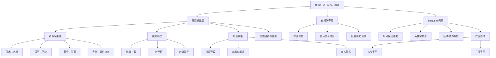

# 《超级幻想王国》游戏分析

## 🎮 基础信息
- **游戏名**: 超级幻想王国（Super Fantasy Kingdom）
- **开发商**: Super Fantasy Games（Feryaz Beer，独立单人开发）
- **发行商**: Hooded Horse
- **发行年份**: 2025年10月24日（Steam 抢先体验）
- **平台**: PC（Steam）
- **类型**: Roguelite 城市建造 / 策略防守
- **Steam 评分**: 整体非常好评（88%，近3000条评测）
- **TapTap**: 有收录，765人心愿单（国内曝光度有限）
- **游玩状态**: ☐ 游玩中 ☑ 分析研究
- **个人评分**: ⭐⭐⭐⭐ (4星)

---

## 🎯 核心体验

### 一句话定位
白天当城主打地基，夜晚让英雄扛大旗——在死亡循环中积累认知，用"知道怎么玩"而非"角色有多强"来推进游戏。

### 核心循环

```
[日间循环 — 建造层]
分配工人 → 采集资源（木材/石料/黄金）→ 建造/升级建筑 → 解锁新功能 → 扩张地图

[夜间循环 — 防守层]
调整阵型 → 自动战斗结算 → 英雄失去获得的经验（阵亡惩罚）→ 全灭触发重置

[元循环 — Roguelite层]
单局积累 → 解锁新英雄/区域/能力 → 下一局带入新知识 → 推进更远
```

### 记忆点
1. **"全灭才算输"的容错设计**：单位阵亡次日复活（但失去经验），玩家从紧张的"我快输了"变成"我还能撑"，切断了沮丧感
2. **捕兽师机制**：可以把打过来的怪物招募进自己的战队，这一条彻底颠覆"怪物=敌人"的二元对立
3. **开发者把狗 Mio 放进游戏**：单人开发者用最个人化的方式留下创作印记，这种"作者性"在策略游戏里极为罕见

---

## 🧠 系统架构



### 主要系统拆解

#### 资源链管理系统
- **设计目标**: 制造持续的资源取舍压力，让每个决定都"有代价"——如果每样东西都够用，决策就没有重量
- **核心机制**: 原材料需要加工才能转化为可用资源（木材→木板→投石机弹药），中间有时间成本和工人成本；三角资源（木材/石料/黄金）争夺同一套工人时间
- **深度来源**: "我该扩张领地还是加固防线"——扩张快了崩，保守了被淹没；这个张力从来不消失
- **设计亮点**: 加工链的存在把"我有多少资源"变成了"我的资源在哪个节点堵住了"，问题诊断本身就是游戏乐趣

#### 日夜交替防守系统
- **设计目标**: 制造天然的节奏感和紧张感，同时给玩家明确的"安全期"让他们思考下一步
- **核心机制**: 白天是策略层（可以慢慢想），夜晚是验证层（自动结算，不需要操作）；"全灭才触发重置"而非单个英雄死亡
- **深度来源**: 阵型调整（前排/后排/治愈者位置）在有限的单位组合里创造出非常不同的战斗结果
- **设计亮点**: 自动战斗彻底消除了"手速不够"的挫败感，把策略难度保留，把操作难度抹掉——这让建造类玩家无障碍进入战斗

#### 英雄选择与饮食恢复系统
- **设计目标**: 用"照顾英雄"建立玩家情感连接，同时让食物资源产生战略意义
- **核心机制**: 英雄战后需要进食才能升级属性；食物是消耗品，需要农业建筑产出；11位英雄每局开始时选1位，阵营决定可用英雄池
- **深度来源**: 英雄之间的技能协同（冰法师冻结敌人配合近战骑士）+ 饮食优先级（资源紧张时谁先吃）
- **设计亮点**: "吃饭才能升级"把食物从"次要资源"变成了核心资源，同时用生活化的动作（吃饭）给策略行为加上了情感层

#### Roguelite元进度系统
- **设计目标**: 让失败有意义，让每次重开都更有趣而不是更痛苦
- **核心机制**: 单局保留部分解锁（英雄、地区、能力），但不是直接保留强度——保留的是"可能性"而不是"数值"
- **深度来源**: 同一地图每次跑法不同（随机修饰符、随机事件）；两个阵营（人类/亡灵）提供差异化资源逻辑
- **设计亮点**: 亡灵王国骷髅单位大量但弱小，还面临"复活骷髅当劳动力 vs 留着一次性掠夺"的取舍——同样的元框架，完全不同的策略思维

#### 捕兽师与单位招募系统
- **设计目标**: 让玩家觉得怪物不只是威胁，也是资源——扩大策略空间
- **核心机制**: 捕兽师单位可以在战斗中收服野怪，将其纳入己方战队；超过70种可招募单位，包括原本攻击你的怪物
- **深度来源**: 什么时候冒险留一个捕兽师在阵中（减少防守力）来换取收服机会
- **设计亮点**: 这个机制逻辑上挑战了"怪物=敌人"的游戏常识，把资源竞争扩展到了战场上——敌方高价值单位变成了"应该抓还是应该杀"的动态决策点

---

## 🎨 体验层分析

### 手感与操控
游戏没有实时操作手感可言——这是设计选择而非缺陷。白天建造是纯策略点击，夜晚战斗自动结算。节奏感来自于"日/夜切换"这个心理节拍：白天是思考的压力（时间有限），夜晚是等待的紧张（结果即将揭晓）。这种"策略→验证→反思"的三段式让玩家注意力始终集中而不疲劳。

### 关卡/内容设计
地图随机生成，但不是完全随机——每个区域有固定的"兴趣点"布局逻辑，通过道路解锁。难度曲线陡峭：早期跑出去很快，因为防线太弱；后期掌握策略后能撑很久。这个"通过失败学习"的曲线是Roguelite的标准设计，但Super Fantasy Kingdom特别强调"知识进步"而非"数值进步"——每一局失败后你明确知道错在哪里，不会感觉无力。

### 叙事与世界观
叙事极简：你的王国被毁，你在死亡循环中试图解开谜团。但环境叙事做得扎实：开发者把自己的狗 Mio 放进游戏，自我引用的幽默感（狗作为"联合开发者"）给游戏加上了个人温度。亡灵王国的骷髅劳工叙事（骷髅们要不要复活？要不要给骷髅工人发工资？）有一种荒诞喜剧感，与人类王国的正统策略气质形成对比。

### 美术与音乐
16位像素风格，致敬经典城建游戏（《定居者》系列的精神继承）。特别值得注意的是"白天/夜晚"视觉切换——光照变化带来的氛围转换不只是美观，直接强化了玩法节奏的感知。建筑有细微动画（旗帜飘动、工人走动），单人像素游戏能达到这个细节密度已属优秀。音乐配合白天/夜晚切换：日间轻松节奏，夜间节奏加快，用音乐预告紧张感即将到来。

---

## ⚖️ 设计取舍分析

| 设计决策 | 得到了什么 | 放弃了什么 | 约束来源 |
|---------|-----------|-----------|---------|
| 夜间战斗自动结算 | 消除操作门槛，建造玩家无障碍进入；战略深度集中在阵型和资源决策 | 实时操作的爽感；手动操控的临场感 | 单人开发者难以平衡RTS实时操作；目标用户是策略/城建玩家而非动作玩家 |
| "全灭才算输"容错机制 | 大幅降低挫败感；保留了紧张感而不造成沮丧；鼓励冒险决策 | 传统Roguelite的极度惩罚带来的成就感峰值 | 吸引主流城建玩家需要容错；纯Roguelite惩罚会流失目标用户 |
| Roguelite保留"可能性"而非"数值" | 重开体验接近新鲜感；避免数值膨胀让后期变成无难度碾压 | 数值积累带来的"付出有回报"满足感；某些玩家会觉得进度感不足 | 开发者明确表示"如果所有问题都能用同一个工具解决，其他工具就没意义了" |
| 两阵营（人类/亡灵）差异化经济 | 倍增重玩价值；同一个游戏框架提供截然不同的策略思维 | 平衡工作量翻倍；亡灵阵营学习曲线更高 | 单人开发，必须靠现有框架的"变体"来扩展内容而非全新系统 |
| 捕兽师收服野怪机制 | 扩大策略空间；颠覆"怪物=敌人"常识；玩家会主动研究敌方单位 | 战场信息复杂度增加；新手可能被单位种类淹没 | 城建游戏的资源化思维——怪物是可开采的战场资源 |
| 极简叙事 + 个人化彩蛋 | 开发者作者性突出；降低内容生产成本 | 情感驱动的叙事深度；难以做系列续作 | 单人开发最大挑战是内容量；叙事最小化是现实约束 |

---

## 💡 值得借鉴的设计

1. **"知识进步"而非"数值进步"作为Roguelite核心驱动**：SFK的元进度核心是"玩家明白了什么"，不是"角色变强了多少"。在自己的Roguelite项目中，设计死亡后的复盘信息（你哪轮死的、为什么死、差哪一个决策）比直接发奖励更能留住有深度思考欲望的玩家。具体实现：每次失败弹出"关键决策回顾"，而不只是普通的结算界面。

2. **日夜节奏作为天然的"思考窗口"设计**：白天建造是玩家的"安全区"，可以慢慢规划；夜晚是验证期。这对任何有"策略制定→结果验证"两阶段设计的游戏都适用。可以移植到塔防游戏（准备阶段和防守阶段分离）或城建游戏（平时期和事件期）。关键是让两个阶段有不同的BGM/视觉提示，强化认知上的阶段切换感。

3. **"全灭才算输"容错机制的低成本实现**：在防守/生存类游戏里，把"失败条件"从"任意单位死亡"改为"核心单位全灭"，代码量几乎不变，但玩家体验从"沮丧→放弃"变成"紧张→期待→学习"。在自己项目的原型测试阶段，这个改动值得优先测试。

4. **敌方单位可捕获/招募，打破"敌我"二元**：在自己的策略游戏或Roguelike中，可以设计"高风险/高回报的战场资源化"机制：某些敌方单位被特定技能击中后进入"可招募"状态，玩家需要决定是否冒险留下一个弱战斗力单位来收服它。这一机制极大增加了战场信息密度，且开发成本低（复用现有单位资产）。

5. **资源加工链作为瓶颈设计工具**：原材料→加工品→成品的三段链，是制造持续资源压力的高效工具，不需要设计非常多种资源，只需要让中间加工环节成为瓶颈即可。在城建/经营模拟游戏中，工人时间是最好的"统一稀缺资源"——所有加工环节共用工人，就自然产生了全局优先级决策。

---

## ❌ 不足与问题

1. **Early Access内容深度尚浅**：目前两个阵营、约70+单位，但解锁路径的多样性还不足以支撑长期重玩。高玩快速达到策略上限后，变化感下降。改进方向：增加"运行修饰符"（随机加强某个系统的弯路事件），让每局的侧重点不同。

2. **新手引导缺乏**：游戏开门见山让玩家面对复杂的资源链和建造选项，早期跑出去太快死亡可能造成"我不知道自己做错了什么"的困惑。改进方向：引入可选的"引导沙盒局"，前几轮允许暂停并解释为什么这个单位死了（具体到伤害来源和阵型问题）。

3. **阵型调整粒度有限**：战斗自动结算，但玩家只能在战前做大方向调整，无法在战中干预。当战局明显不利时，玩家只能"看着"——这种无力感和"全灭才算输"的容错设计形成了一个奇怪的张力：你知道要输了但无法做任何事。改进方向：提供1-2个战中"王者技"（消耗稀缺资源），作为紧急介入手段，既保持自动战斗的低操作门槛，又给玩家一点点"最后挣扎"的空间。

4. **两阵营差异化不够彻底**：亡灵王国骷髅机制有趣，但整体经济框架与人类王国相差不大。改进方向：给亡灵王国一个人类王国完全没有的核心资源类型（比如"腐化度"）作为核心约束，而不只是把人类资源换了个皮肤。

5. **叙事动力不足**：极简叙事在早期制造了神秘感，但随着跑数增加，"解开循环之谜"的叙事驱动力逐渐消退，后期主要靠系统乐趣撑着。改进方向：每隔一定进度解锁一小段"谜题碎片"，让叙事进度和系统进度并行推进。

---

## 🔗 知识关联

### 与已读书籍的关联

- **《游戏编程设计模式》**（books/game-dev/游戏编程设计模式）：SFK的整体架构是一个典型的"游戏循环"（Game Loop）模式实践——日/夜交替是状态机（State Machine）的游戏化表达，白天建造和夜晚防守是两个不同状态的更新逻辑分离。开发者Feryaz Beer独自实现如此复杂的系统，说明他对这种"把游戏逻辑按状态分层"的思维有深刻掌握。关联强度：⭐⭐⭐⭐⭐

- **《游戏编程算法与技巧》**（books/game-dev/游戏编程算法与技巧）：SFK的单位AI是自动战斗引擎，背后是行为树（Behavior Tree）或简化优先级决策树。70+单位的行为多样性需要一套低成本但多样化的AI决策框架，该书第12章的AI状态机思路在这里有直接对应。关联强度：⭐⭐⭐⭐

- **《设计模式》**（books/software-engineering/设计模式）：SFK的两阵营系统（人类/亡灵）是"策略模式（Strategy Pattern）"的典型游戏应用——同一个游戏框架，通过替换"阵营策略类"产生完全不同的行为和资源逻辑。扩展新阵营时不需要修改核心框架，只需实现新的阵营策略。关联强度：⭐⭐⭐

- **《思考快与慢》**（books/thinking/思考快与慢）：SFK的"日夜节奏"在心理学层面对应卡尼曼的系统1（快速直觉）和系统2（慢速分析）切换——夜晚战斗的自动结算激发系统1的即时紧张反应，白天建造的慢节奏给系统2进行资源规划。游戏设计者有意识地在两种认知模式间切换，是"情绪节奏设计"的一个精确案例。**重要：** 书里说系统2介入有认知成本，而SFK的白天"安全期"设计本质是给玩家充分的系统2激活时间——这挑战了大多数策略游戏"实时压力下高速决策"的传统设计。关联强度：⭐⭐⭐⭐

- **《第一性原理》**（books/thinking/第一性原理）：开发者Beer的设计方法论——"以'它让你感受到什么'为核心问题"——是第一性原理思维的实践。他从"玩家的情感需求"出发，而非从"流行游戏类型"出发，将Factorio/Pokemon/城建游戏的核心拆解后重新组合。这与书中强调的"回归本质问题再重新推导"高度一致。关联强度：⭐⭐⭐

### 与其他游戏的横向对比

| 游戏 | 共同点 | 关键差异 |
|------|--------|---------|
| **《风暴降临》（Against the Storm）** | Roguelite城建；失败保留进度；Hooded Horse发行 | 风暴降临强调"效率节奏"（有时间压力的建造），SFK强调"防线突破"（夜晚波次）；风暴降临聚焦"何时撤退"，SFK聚焦"如何守住" |
| **《环城》（Thronefall）** | 极简城建+波次防守；日夜节奏 | 环城把城建极度简化（几个按钮），SFK有更深的资源链；环城侧重"即时战斗操控"，SFK侧重"阵前部署策略" |
| **《小小王国》（Kingdom Series）** | 极简城建+防守，横版视角像素风 | 小小王国把城建简化到"只有金币一种资源"，机制更纯粹；SFK资源链复杂度高很多，目标受众不同 |
| **《吸血鬼幸存者》** | 自动战斗，波次怪物 | 吸血鬼幸存者是纯战斗，城建极简；SFK的战斗是"建造结果的验证"，而不是游戏本身的目的 |

**关键洞察**：SFK的差异化在于它的"双主体设计"——建造和防守都是真实且有深度的系统，而非一个主系统加一个辅助系统。大多数同类游戏都是"建造是手段，战斗是目的"（环城、吸血鬼幸存者）或"战斗是障碍，建造是目的"（传统城建），SFK试图让两者平等——这是最大的野心，也是最大的平衡挑战。

### 对自身项目的启发
如果在做一款策略/经营类游戏：
- **阶段节奏设计**：参考SFK的白天/夜晚分离，在自己的游戏里设计"决策期"和"验证期"——两个阶段的BGM、视觉效果、UI状态都要有明确切换，让玩家感知到自己在哪个阶段
- **容错机制测试**：先做"全灭才算输"版本，测试玩家情绪曲线，再决定是否收紧失败条件
- **资源瓶颈设计**：用"加工链"而非"纯数量"制造资源压力，工人时间作为统一的稀缺资源

---

## 📊 总结

### 最大的收获
SFK证明了"单人开发者用强烈的设计哲学凝聚多种机制"这条路是可行的。Feryaz Beer没有发明任何新机制，但他从"玩家情感需求"出发，精准选择了几种相互强化的系统组合在一起。这告诉我们：游戏设计的核心工作不是创造机制，而是**选择**哪些机制组合在一起会产生化学反应。

### 核心结论
《超级幻想王国》的本质是一款"教育型Roguelite"——它把失败设计成课程，把重开设计成复习，让玩家用认知积累而非数值积累来推进游戏。它在城建玩家（习惯慢节奏规划）和策略玩家（习惯防守决策）之间找到了一个共同的情绪峰值：**"我终于明白该怎么玩了"这一刻的豁然感**。这种设计取向在数值驱动的手游时代是一种值得关注的反向选择。

**最反直觉的发现**：游戏的核心竞争力不是"有很多单位/英雄/建筑"，而是"每次死亡后玩家能准确诊断出自己的错误"——这才是它"再来一局"动力的来源。换句话说：**清晰的失败归因 > 丰富的内容量**，这对独立游戏开发者来说是极其重要的设计优先级结论。

---

**分析创建时间**: 2026-07-06
**最后更新**: 2026-07-06

---

### 参考资料
- [Steam页面 — Super Fantasy Kingdom](https://store.steampowered.com/app/2289750/Super_Fantasy_Kingdom/)
- [Rogueliker评测 — 肉鸽城建与自动战斗融合分析](https://rogueliker.com/super-fantasy-kingdom-early-access/)
- [PreMortem Games开发者访谈 — Feryaz Beer](https://premortem.games/2023/09/08/solo-dev-feryaz-beers-debut-super-fantasy-kingdom-a-weird-mashup-of-genres/)
- [Spielecheck设计深度分析](https://spielecheck.gg/en-us/super-fantasy-kingdom-strategy-build-roguelite/)
- [TapTap页面](https://www.taptap.cn/app/753035)
