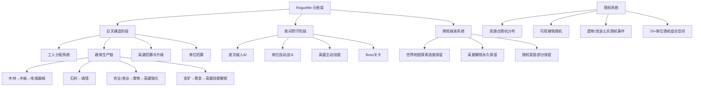

# 《超级幻想王国》游戏分析

## 🎮 基础信息
- **游戏名**: 超级幻想王国（Super Fantasy Kingdom）
- **开发商**: Super Fantasy Games
- **发行商**: Hooded Horse
- **发行年份**: 2025年10月24日（Steam 抢先体验）
- **平台**: PC（Steam）
- **类型**: Roguelite / 城市建造 / 策略 / 自动战斗
- **游玩时长**: 单局约 30-60 分钟，元循环内容极长（有玩家完成 84 次周目仍有内容）
- **游玩状态**: ☑ 分析研究 ☐ 游玩中 ☐ 通关 ☐ 放弃
- **个人评分**: ⭐⭐⭐⭐ (概念扎实，执行存在细节瑕疵)
- **Steam 评分**: 特别好评（全语言 5,452 条，整体 ~86% 好评）；英语区 88% 好评（2,994 条）；简中区仅 58% 好评（322 条）——两个市场评价存在显著落差

---

## 🎯 核心体验

### 一句话定位
白天建城、夜晚守城的 Roguelite——用城市建造的资源管理感，承载肉鸽的随机构筑乐趣，再用夜间波次防守制造每轮的戏剧高峰。

### 核心循环
```
[局内日夜循环]
白天：分配工人 → 采集资源 → 建造/升级建筑 → 招募单位/英雄技能
                                         ↓
夜晚：怪物浪潮冲击城门 → 单位自动战斗 → 英雄主动技能干预 → 存活/失守

[元循环]
城门被破 → 携带：已探索地图 + 已解锁英雄 + 部分奖励 → 新周目更强出发
```

### 记忆点
1. **"再坚持一晚"的循环焦虑**：资源永远不够，每个白天都是一场取舍赌注，"要再建一个伐木场还是直接招募单位？" 的决策压力贯穿始终
2. **英雄能力引发的蝴蝶效应**：冰女祭司冻结一排怪物导致整条防线压力骤减——同一英雄在不同随机地图和单位组合下价值天壤之别
3. **跨周目的"渐强感"**：第一局只有 2 个英雄可选、地图大半未探索；第 10 局拥有 8 个英雄、完整地图——进度可见性极强，每次失败都不是白费

---

## 🧠 系统架构



### 主要系统拆解

#### 白天建造系统（核心压力源）
- **设计目标**: 让"时间"本身成为稀缺资源，迫使玩家在"发展"与"防御"之间做明确取舍，每个白天都是一次不可逆的资源分配决策
- **核心机制**:
  - 工人数量有限，需要点击建筑分配工人到对应任务
  - 建筑位置有限（地图格数固定），资源节点随机分布，建筑紧挨资源才能提升效率
  - 三条主要资源链并行：木材链（伐木→锯木→防御器械）、石料链（采石→城墙强化）、食物/金矿链（农牧渔→英雄强化/招募）
  - 建筑升级消耗资源，需要在"多建基础建筑"和"升级核心建筑"之间取舍
- **深度来源**: 三条资源链之间有隐性优先级竞争——同样的工人，放在木材链上能更快出防御单位，放在食物链上能养活更强的英雄；最优解随当前英雄组合和随机地图布局而变，没有固定答案
- **设计亮点**: 资源分布随机 + 建筑位置有限 = 每局的地图布局都逼迫玩家用不同策略应对，自然规避了"最优建造顺序记忆化"的问题

#### 英雄系统（流派核心）
- **设计目标**: 让 11 位英雄成为每局构筑的"方向信号"，玩家看到初始英雄就知道本局应该朝哪个战术方向构建资源链
- **核心机制**:
  - 每局可选 11 位守护者中的若干位，各具独特被动和主动技能（冰女祭司→冻结/群体减速；骑士→冲锋强化近战单位；亡灵法师→死亡单位复活为不死兵等）
  - 英雄技能树在局内通过黄金升级，部分技能永久解锁（跨轮继承）
  - 英雄 + 特定单位种类产生协同增益（如冰系英雄强化冰系单位的伤害/技能触发率）
- **深度来源**: 英雄不只是数值提升器，而是改变"哪条资源链值得投入"的全局指向——有冰系英雄就大量招冰单位，就需要更多黄金（因为冰单位贵），就需要更多金矿建筑，导致整个建造规划从源头改变
- **设计亮点**: 英雄作为构筑"锚点"而非单纯数值加成——与《卡片魔王》的武器锚点设计异曲同工，都是"先给方向、再给资源"的构筑引导逻辑

#### 夜间防守系统（压力测试）
- **设计目标**: 将白天的建造决策结果变成可直接感知的战场输出，让玩家看到"自己的选择对不对"
- **核心机制**:
  - 怪物波次从城门方向进攻，单位自动战斗（近战在前、远程在后）
  - 英雄主动技能需玩家手动释放（冰冻、冲锋、召唤等），是影响战局的主要操作窗口
  - 波次强度递增，Boss 关卡测试防线上限
  - 城门血量耗尽 = 本局失败，进入跨轮继承流程
- **深度来源**: 玩家的操作空间集中在英雄技能释放时机——何时冻结、何时冲锋是有意义的实时决策
- **设计亮点/问题**: 战斗本身偏向"观看+英雄技能干预"的轻度自动战斗——这降低了操作门槛，但也导致部分玩家反馈"交互感不足"，英雄技能无法循环切换是主要槽点

#### Roguelite 元循环系统
- **设计目标**: 让每次失败都有进度意义，同时让新周目始终有新随机内容，避免重复感
- **核心机制**:
  - **永久解锁**：英雄解锁（新周目可选英雄更多）、世界地图探索（新周目地图更透明）
  - **局内随机**：资源点随机分布、可建建筑随机、随机遭遇事件（流浪士兵、神秘商人、遗物）
  - **诅咒系统**：随着周目推进，敌人获得额外能力（强化波次），形成难度曲线
  - **种族系统**：人类/亡灵两条路线，各有独特建筑树和单位池，不同路线的跨轮继承相互独立
- **深度来源**: 两条种族路线各自的解锁进度意味着玩家有双倍的"待探索内容"
- **设计亮点**: 永久进度保留 vs 局内随机的比例很精准——永久部分保留"投入感"，局内随机保留"新鲜感"，两者边界清晰，不互相稀释

---

## 🎨 体验层分析

### 手感与操控
白天以点击分配工人为主，操作节奏偏慢、偏思考型。夜间战斗以观战为主 + 英雄技能点击，整体手感轻度。主要槽点是缺乏"资源总览面板"——玩家需要逐一点击建筑才能查看当前存量，信息密度不够友好。Steam Deck 适配良好，单局节奏适合轻度游戏场景。

### 关卡/内容设计
随机地图生成保证了每局布局不同，但"随机"的粒度主要体现在资源节点位置和可用建筑种类，地形本身较为规则。70+ 单位种类和 11 位英雄构成大量组合可能性，但 80+ 周目后玩家会找到若干最优组合反复使用，内容长尾不足。

### 叙事与世界观
叙事背景轻量：玩家从狩猎归来发现家园被毁，需重建王国。叙事不是核心体验，更像是"建造动机"的合理化解释。世界观轻松奇幻（人类/亡灵/怪物三方），风格定位休闲而非严肃。

### 美术与音乐
像素/卡通混合风格，颜色明快。城市建设的视觉反馈良好——看着建筑逐渐建起、单位在城墙上排列，有典型的"建造成就感"视觉满足。夜间战斗有一定视觉冲击，但自动战斗导致演出克制。

---

## ⚖️ 设计取舍分析

| 设计决策 | 得到了什么 | 放弃了什么 | 被什么约束逼出来的 |
|---------|-----------|-----------|-----------------|
| 夜间战斗以自动战斗为主 | 极低操作门槛，玩家注意力集中在战略层；手机/Deck 友好 | 即时战斗爽感，高技巧玩家缺乏操作深度出口 | 城市建造玩家天然排斥高强度即时操作；加入复杂战斗操作会稀释建造阶段专注度 |
| 白天建造阶段无时间压力 | 充分的决策思考空间，不会因操作失误出错；降低压力扩大受众 | 建造阶段缺乏紧迫感；部分玩家反映"白天太慢" | 目标玩家画像是偏策略/思考型，不是 RTS 玩家；强加实时压力会伤害目标受众 |
| Roguelite 框架（可失败重来） | 单局时长可控（30-60 分钟）；失败无永久损失；随机性保证重玩价值 | 传统城建的"长期积累纵深感"；单局建造规模天花板低 | 独立游戏资源有限，无法支撑复杂的长期城建内容量；Roguelite 是小团队实现高重玩价值的最有效路径 |
| 11 位英雄 + 70+ 单位（宽而不深）| 极高的名义组合数量，宣传卖点强；短期有大量新鲜内容 | 平衡难度极大，强弱差距明显；深度不如精品化的少量单位设计 | EA 阶段快速堆量、正式版再精修是业界常规路径；Roguelite 品类竞争激烈需内容量支撑宣传 |
| 简中评价仅 58%（vs 全球 86%）| （非主动选择，是执行落差）| 中文市场口碑受损，影响中文玩家推荐率和自来水传播 | 翻译质量不稳定、UI 文字截断、部分机制文本说明不清晰；EA 阶段本地化优先级被研发优先级压低 |

---

## 💡 值得借鉴的设计

1. **英雄作为构筑"方向锚点"而非数值增益**：英雄不只是"+X%伤害"，而是改变整个资源链优先级的信号灯。选择冰系英雄 → 大量招募冰单位 → 需要更多金矿建筑 → 整个建造规划从源头改变。应用到自己项目：**给核心成长选择（职业/英雄/天赋）赋予"链式影响力"而非孤立数值**——一个选择应该影响后续 3-5 个相关决策，产生蝴蝶效应感。代码层面：英雄携带"偏好资源类型"标签，所有相关 UI 和建议系统读取此标签动态调整显示权重。

2. **"日夜节奏"作为通用压力-释放循环结构**：白天建造=积累+决策（低压力）→ 夜晚防守=验收+爽感（高压力）→ 清晨存活=满足感（释放）→ 新白天开始（期待）。本质是"投入-结算-反馈"三段式循环的具象化。应用点：**在自己的游戏中设计明确的"压力积累期"和"压力释放期"交替**，即使不是日夜机制，也可以是"探索阶段→Boss阶段→奖励阶段"的节奏单元。

3. **元进度在失败结算界面的即时可见性**：《超级幻想王国》的元进度非常直观——失败后立刻看到"下一局我将拥有更多英雄/更多地图"。应用点：**元循环进度应该在失败结算界面就直接展示**，不要等到下一局才让玩家发现，要在最沮丧的时刻（失败瞬间）就给出"这次失败的价值"的可见反馈，是留存率的重要设计细节。

4. **双种族路线的"内容倍增"策略**：人类/亡灵两条路线各自有独立的建筑树、单位池和解锁进度。单线内容量只需全量的一半，但玩家感知到的总内容量是两倍。应用点：**在有限开发资源下，设计 2-3 条规则不同但内容量相当的平行路线**，比做一条更深的路线更有效扩大受众和提高留存。

---

## ❌ 不足与问题

1. **缺乏资源总览面板**：玩家需要逐一点击建筑才能查看当前存量，管理四条资源链时造成频繁的注意力跳转。改进方向：在屏幕顶部常驻资源状态栏（仿 Anno / Frostpunk 的资源面板），显示各资源当前量/上限/变化速率。

2. **夜间战斗交互感不足**：战斗偏向观看，英雄技能无法循环切换，高技巧玩家没有足够操作空间。改进方向：增加英雄技能循环触发机制，或增加战场实时指挥系统（集火指令、阵型调整），在不破坏自动战斗设计意图的情况下，给高技巧玩家更多干预空间。

3. **中文本地化与体验落差**：简中评价（58%）与全球均值（86%）差距巨大。EA 阶段的本地化质量问题如果不及时修复，会在中文玩家社区形成"该游戏不适合中国玩家"的口碑定式，正式版后很难翻转。

4. **内容长尾不足（80+ 局后重复感上升）**：诅咒系统是主要挑战延续机制，但玩家总会找到若干最优组合反复使用。改进方向：引入"规则变体"关卡（特殊地图、限制性挑战模式）或高端局 Meta 层。

---

## 🔗 知识关联

### 与已读书籍的关联
- **游戏编程设计模式**：工人分配是**观察者模式**的典型应用（工人订阅建筑工作队列，建筑完成时通知工人释放）；资源链的级联生产是**命令模式**的队列实现；英雄技能触发单位联动是**策略模式**（不同英雄持有不同的战斗干预策略对象） | 关联强度: ⭐⭐⭐⭐⭐
- **游戏编程算法与技巧**：随机资源节点分布是带权重的随机采样；70+ 单位的随机刷新是分池加权采样；诅咒系统的难度曲线是指数增长强度设计 | 关联强度: ⭐⭐⭐⭐
- **思考快与慢**：日夜节奏利用**峰终定律（Peak-End Rule）**——每局情感记忆主要由"最后一波 Boss 被挡住（正峰值）或城门被破（负峰值）"决定；资源不足时的紧迫感激活系统2做艰难取舍，清晨存活的满足感靠系统1的直觉满足（看着王国建起来的视觉成就感）；**关键挑战**：游戏利用了峰终定律，但"差一点守住"的失败体验（负峰值但接近正）反而比"轻松通过"更驱动复玩——这挑战了"避免负峰值"的直觉设计思路 | 关联强度: ⭐⭐⭐⭐⭐
- **架构整洁之道**：资源链系统要求建造逻辑层与表现层严格分离；英雄技能接口应依赖倒置——战斗引擎依赖 ITriggerableSkill 接口，新增英雄不修改战斗系统；生产链系统的可扩展性依赖数据驱动，新资源链只需添加配置文件 | 关联强度: ⭐⭐⭐⭐
- **真需求**：游戏满足的"真需求"是"以有限资源构建秩序的控制感"；应然是"城建游戏需要长期积累"，实然是"玩家需要的是30分钟内从无到有建起能运转系统的即时满足感"；Roguelite 框架将这个满足感压缩到单局可完成的时间窗口内，是满足真需求的精准解法 | 关联强度: ⭐⭐⭐⭐

### 与其他游戏的横向对比
- **背包乱斗**：同为策略 Roguelite，核心策略维度不同——背包乱斗策略在于"物品如何摆放"（空间相邻协同），超级幻想王国策略在于"资源链如何规划"（生产优先级取舍）；两者都用 Roguelite 框架让传统重型策略游戏轻量可重玩 | 类型: 同类对比
- **大巴扎**：同为"构筑在战前、战斗全自动"路线——超级幻想王国的"白天建造+夜晚自动"与大巴扎的"桌面布局+异步PVP"结构同源；核心差异：超级幻想王国是单人 PvE 波次，大巴扎是异步 PvP 残影；日夜节奏感 vs 博弈感 | 类型: 同类对比
- **杀戮尖塔2**：同为 Roguelite 构筑，但构筑验收时序不同——StS2 战斗中即时验收，超级幻想王国是周期性验收（每夜一次）；StS2 验收频率高但单次压力短，超级幻想王国单次验收压力大但频率低——是构筑验收节奏的两种极端 | 类型: 同类对比

### 对自身项目的启发
在任何包含资源管理的游戏中，可直接移植"英雄/核心装备作为资源链方向锚点"的设计：玩家的核心选择携带"资源偏好权重"，影响后续的资源池随机分布和 UI 提示，让每个选择产生可见的链式后果，而不只是数值加成。

---

## 📊 总结

### 最大的收获
**"日夜节奏"是一种通用的游戏设计压力结构，可以超越"城建游戏"本身被复用**。白天=低压积累、夜晚=高压验收的节奏单元，本质上是"投入-结算-反馈"三段式循环的具象化实现。任何有资源积累和阶段性压力测试需求的游戏，都可以借用这个节奏框架。

### 核心结论
《超级幻想王国》的本质是：**把城市建造游戏的核心乐趣（从零建立运转系统的成就感）压缩进了 Roguelite 框架的单局时间窗口内**。这是概念层面非常精准的品类融合，执行层面的主要问题——缺资源面板、战斗交互单薄、中文本地化落差——都是可在 EA 阶段迭代修复的工程问题，不是设计原理上的根本缺陷。

**改变了我的一个认知**：以前认为"Roguelite"和"城市建造"天然冲突（城建需要长期积累，Roguelite 是短期循环重置）。《超级幻想王国》证明这个矛盾可以用"单局完整的微型城建循环"来解除：不追求"城市成长的纵深感"，而是追求"在一局内建起能运转的系统的即时满足感"。这是两种不同的城建乐趣，后者完全可以压缩到 30-60 分钟内完成——Roguelite 是城建游戏品类扩展受众的有效框架，而非对立选项。

---

**分析创建时间**: 2026-07-06
**最后更新**: 2026-07-06
