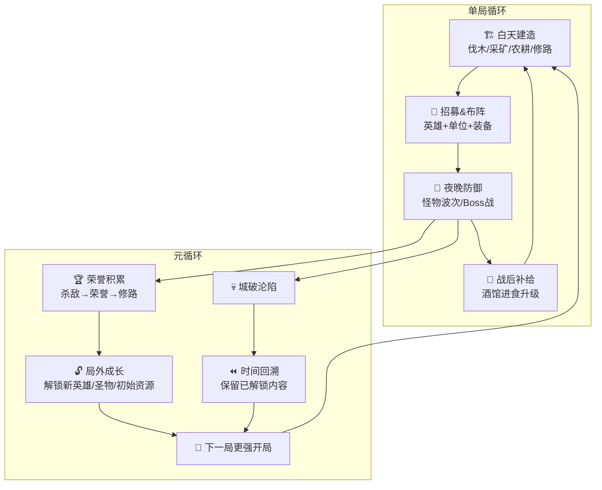
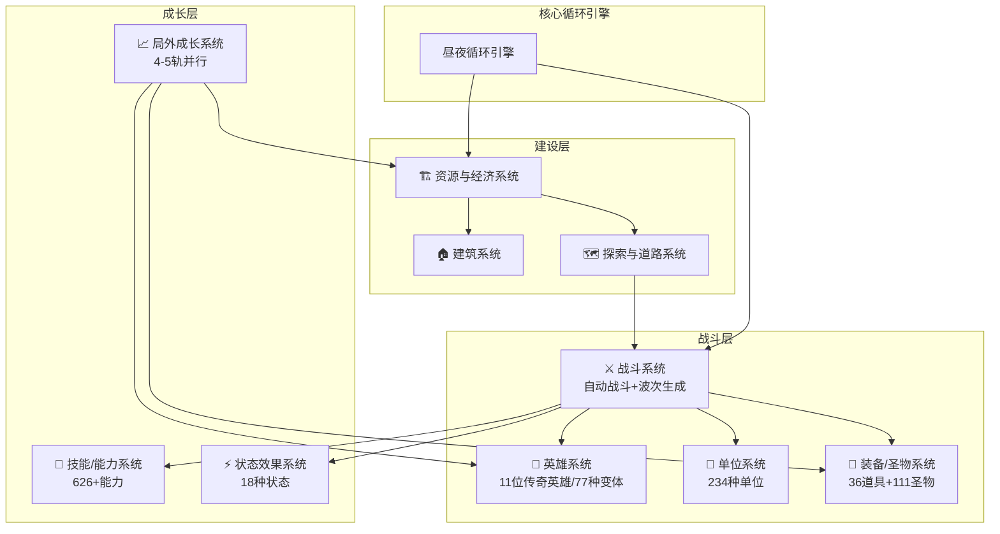
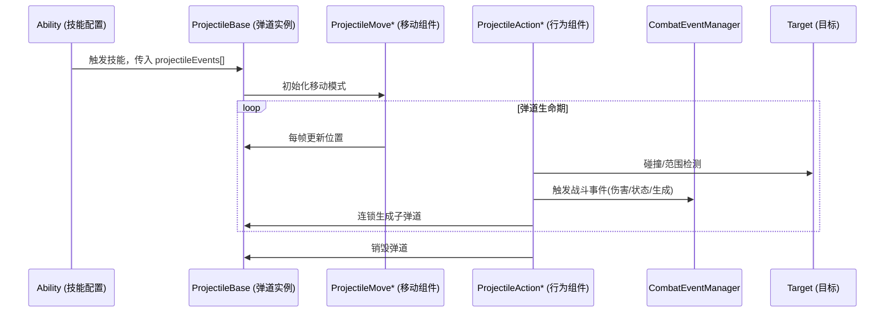

# 《超级幻想王国》全维度分析

> 分析模式：全维度（策划+程序+打通）
> 分析日期：2026-07-20
> 源码路径：D:\techProjects\openGames\SuperFantasyKingdom（Unity 反编译工程）

---

# 📋 Part 0：基础信息与概览

## 🎮 游戏基础信息

| 项目 | 内容 |
|------|------|
| **游戏名** | 超级幻想王国 / Super Fantasy Kingdom |
| **开发商** | Super Fantasy Games（德国独立开发者 Feryaz Beer 首款作品） |
| **发行商** | Hooded Horse（《庄园领主》《风暴之城》发行商） |
| **发行年份** | 2025年10月24日（抢先体验，预计 EA 持续约一年） |
| **平台** | PC（Steam / GOG / Epic / 微软商店），同步加入 PC Game Pass |
| **类型** | Roguelite 城市建造 + 塔防策略 |
| **游玩时长** | 单局 30-60 分钟，全解锁需 30+ 小时 |
| **个人评分** | ⭐⭐⭐⭐ (策划) / ⭐⭐⭐⭐ (技术) |

### 商业表现

| 指标 | 数据 |
|------|------|
| **销量/下载量** | 抢先体验3天破千条评论，最高同时在线破万（SteamDB） |
| **Steam 评价** | 极度好评，91% 好评率（2025年10月首发）；后续评价两极分化（简中仅58%） |
| **定价** | 首发 -35% 折扣，约 US$12.99 |
| **支持语言** | 18种语言，含简体中文 |

---

## 💻 源码项目概览

> 本项目为 Unity 游戏的反编译工程（Unity 2021.3.45f2, Mono 后端），使用 UnityPy 解包。代码以 DLL 形式存在（Assembly-CSharp.dll ~1.3MB），通过 MonoBehaviours JSON 序列化数据（12,511 个文件）逆向分析数据结构与类关系。

### 技术栈总览

| 层级 | 技术选型 | 版本 | 选型理由 | 替代方案 |
|------|---------|------|---------|---------|
| **引擎** | Unity | 2021.3.45f2 LTS | 单人开发，Unity 2D工具链成熟、生态丰富、多平台发布 | Godot / GameMaker |
| **语言** | C# | .NET Standard 2.0 | Unity 原生语言 | — |
| **渲染** | URP | Unity 2021.3 内置 | 2D 像素游戏，URP 轻量够用，比 Built-in 的 Shader Graph 好 | Built-in RP |
| **物理** | Physics2D | 内置 | 弹道碰撞和单位碰撞检测 | Box2D |
| **网络** | 无（纯单机） | — | Roguelite 单机游戏 | — |
| **UI** | UGUI + TextMeshPro | 内置 + 3.0.6+ | 像素字体渲染、18语言 CJK 支持 | UI Toolkit |
| **音频** | FMOD | FMODUnity | 参数化音频控制，比 Unity Audio 功能强 | Wwise / Unity Audio |
| **输入** | Input System | 1.1+ | 新输入系统，PC 多设备统一抽象 | 旧 Input Manager |
| **资源管理** | Addressables | 1.19+ | 25,101精灵按需异步加载+引用计数释放 | Resources / AssetBundle |
| **异步** | UniTask | 2.3+ | 零 GC 分配 async/await，比 Coroutine 性能好 | Coroutine |
| **动画** | PrimeTween | Runtime | 代码驱动动画，比 DOTween 更轻量 | DOTween / LeanTween |
| **本地化** | Unity Localization | 1.3+ | 18种语言，Unity 官方方案 | I2 Localization |
| **Steam SDK** | Steamworks.NET | 标准版 | Steam 成就等平台功能 | Facepunch.Steamworks |
| **GOG SDK** | GalaxyCSharp | 标准版 | GOG 平台集成 | — |
| **JSON** | Newtonsoft.Json | 标准版 | 数据序列化 | System.Text.Json |

### 目录结构

```
SuperFantasyKingdom/
├── Code/                        # 146 个 DLL 程序集
│   ├── Assembly-CSharp.dll      # 主游戏逻辑（~1.3MB，≈150-300个类）
│   ├── Assembly-CSharp-firstpass.dll  # 插件/预编译代码（~1.2MB）
│   └── *.dll                    # Unity引擎库 + 第三方库
├── MonoBehaviours/              # 12,511 个 JSON（ScriptableObject 序列化数据）
│   ├── aa/StandaloneWindows64/
│   │   └── defaultlocalgroup_assets_all_82e041*/  # 核心游戏数据（3,995个文件）
│   └── level0~8/                # 关卡数据（按 Level 分包）
├── Scenes/                      # 16,046 个场景/GameObject JSON
├── Animations/                  # 797 个动画数据
├── Sprites/                     # 25,101 个精灵（角色/UI/特效）
├── Textures/                    # 777 个纹理
├── Shaders/                     # 154 个 Shader（含 URP ShaderGraph）
├── Materials/                   # 124 个材质
├── Fonts/                       # 9 个字体（含 NotoSans CJK）
├── Localization/                # 67 个本地化文件（18种语言）
└── Metadata/                    # 游戏全局配置
```

### 代码规模

| 指标 | 数值 |
|------|------|
| **C# 代码总大小** | Assembly-CSharp.dll ~1.3MB（估算 150-300 个类） |
| **ScriptableObject 数据** | 12,511 个 JSON 文件 |
| **核心数据实体** | Hero 77 / Unit 234 / Monster 60 / Boss 9 / Item 36 / Relic 111 / Achievement 50 / Ability ~626 |
| **Projectile/VFX 系统** | 74 个独立类（极度细粒度的原子化架构） |
| **美术资源** | 25,101 精灵 + 777 纹理 + 797 动画 |

---

## 📊 整体评价总览

| 维度 | 评分 | 关键词 |
|------|------|--------|
| 策划设计 | ⭐⭐⭐⭐ | 类型融合创新，资源管理偏严格，局外成长节奏失衡 |
| 技术实现 | ⭐⭐⭐⭐ | Projectile 系统原子化架构精巧，数据驱动体系完整，单人工程规范良好 |
| 策划+程序契合度 | ⭐⭐⭐⭐ | 数据驱动设计使策划调优空间大；局外成长系统的数值失调在代码层有改进空间 |

> **一句话总结：**《超级幻想王国》用"白天建城、夜晚守城"的昼夜双阶段循环成功融合 Roguelite + 城市建造 + 塔防三种类型，在技术上以高度原子化的 Projectile Action 系统支撑 626+ 技能/能力的数据驱动架构；核心设计理念精准，但在资源管理严苛度和局外成长节奏上的数值失误导致玩家体验两极化——是一款"概念精准、执行欠稳"的独立游戏佳作。

---

# 🎨 Part 1：策划视角 — 游戏设计分析

## 🎯 核心体验

### 一句话定位

白天当市长（建造经营），晚上当将军（塔防指挥）——每轮 24 小时周期内完成"资源生产 → 招募布阵 → 抵御进攻 → 战后补给"的完整循环，在 Roguelite 的反复重生中找到最优建设路线。

### 核心循环



```
[单局循环]
白天资源生产 → 招募单位/购买装备 → 夜晚自动战斗 → 酒馆恢复升级 → 更强的白天生产

[元循环]
战斗获取荣誉 → 修路解锁新区域 → 击杀 Boss 获取宝石 → 解锁新英雄/圣物 → 下一局更快起步
```

### 记忆点

1. **"白天市长、晚上将军"的身份切换**：这是本作最核心的设计创新。传统城市建造中玩家很少面临即时威胁（灾难是远期风险），传统塔防则没有"建设"环节。超级幻想王国通过昼夜切分将两者绑定——白天所有决策都在为夜晚的战斗服务，这种**周期性压力验收**让城市建设不再是"修修补补"的慢节奏体验，而是有明确 deadline 的策略优化：每一次夜晚存活都是一次"考卷批改"。

2. **资源极度稀缺带来的"每一块木头都要算计"**：不同于传统城市建造的自由堆叠，本作每局农民数极少（通关也才 7 个左右），资源日产个位数。这种极端约束把游戏体验从"扩大生产"变成"优先级博弈"——在造兵营还是升农场、修路还是攒宝石之间反复权衡。这个设计在正面制造了高强度策略决策，但负面也是大量差评的根源。

3. **亡灵王国的颠覆性资源设计**：骷髅工人无需食物、僵尸搬运工、地下传送网络——亡灵阵营直接把人类阵营中最大的痛点（食物管理）从经济循环中剔除。这是**"通过系统性移除玩家痛点来定义阵营差异化"**的教科书级案例：不是"给新阵营加几个新单位"，而是"如果你的经济模型从不需要食物，策略空间会怎样变化"。

4. **"上一次失败 = 下一次更强的起步"的 Roguelite 快感**：每次城破沦陷后时间回溯，保留已解锁的道路和初始资源加成。这种设计让失败不再是惩罚，而是推进故事的一种方式——你上一次没能守住，但这次循环里开局就多两条路、多一个初始兵营。

---

## 🧠 系统架构



### 主要系统拆解

#### 🏗️ 资源与经济系统

- **设计目标**：制造稀缺性约束，迫使玩家在有限的资源池中进行优先级决策，使每局的开局路线都有差异化策略选择。
- **核心机制**：
  - 人类阵营：木材/石头/小麦/食物/金币/荣誉 6 类核心资源
  - 亡灵阵营：骨头/石头/粘液替代木材/食物（单位无需食物喂养）
  - 农民有朝九晚五作息限制，恶劣天气禁止采矿打猎
  - 2026年4月经济大改：从"多资源平衡"重构为"以金币为主轴"，升级改为酒馆"晋升仪式"消耗金币
- **深度来源**：资源稀缺迫使玩家在"造更多兵 vs 升更高科技 vs 开更多路"之间反复权衡。高手能用最少资源在最早时间点建立自我强化的正循环。
- **设计亮点**：过度开采风险 + 恶劣天气禁采机制——资源获取不只是"数字增长"而是"有节奏的挑战"，天气系统本质上是周期性随机事件，制造策略调整需求。
- **与其它系统的交互**：资源→建造→建筑解锁单位→单位消耗资源→战斗获取荣誉→探索发现新资源点，形成闭合的"资源→战略→战利品→更多资源"循环。

#### ⚔️ 战斗系统（自动战斗 + 波次生成）

- **设计目标**：让玩家的策略体现于"战前构筑"而非"战中操作"——玩家是"指挥官"而非"士兵"。战斗是"构筑成果的验收"而非"操作的考核"。
- **核心机制**：
  - 自动战斗：英雄与单位在夜晚自动迎战怪物波次
  - 每周 (wave) 刷新一批怪物，每周末（wave 5/10/15）刷新 Boss
  - 英雄有独立技能树和装备槽，单位可进化到最终形态
  - 食物在战后酒馆中转化为经验升级单位
- **深度来源**：布阵（站位行/列顺序）、单位协同（王国特性：同阵营 2/4/6 单位触发 Buff）、装备分配、技能升级路线选择
- **设计亮点**：**"战斗完全自动 + 构筑在战前"** 让游戏定位为"构筑验证器"——每个夜晚是对白天决策的客观评分，玩家无法通过"手速"弥补策略失误。与《杀戮尖塔2》（战中频繁操作）形成构筑验收节奏谱系的两极
- **与其它系统的交互**：战斗产出荣誉（解锁探索）、宝石（解锁英雄）、食物经验（单位成长）；战斗压力驱动建设优先级

#### 🗺️ 探索与道路系统

- **设计目标**：将 Roguelite 的地图探索与城市建造的空间扩张合为一体，用"荣誉=探索货币"把战斗产出直接转化为世界解锁
- **核心机制**：杀敌获得荣誉 → 荣誉达到门槛 → 可修路 → 道路解锁新建筑用地 + 野外地点（商人/资源点/公会/任务/传送门）
- **深度来源**：修路的"顺序决策"——先解锁新资源点扩大经济，还是先修到公会让更多单位可选？
- **设计亮点 + 致命缺陷**：荣誉作为"局内+局外"双重货币设计简洁优雅，但实力不足时陷入"打不过→没荣誉→不能修路→不能变强→永远打不过"的死循环。这是 Roguelite 设计中经典的双刃剑——单货币简化了认知负担，但也减少了"即使打不过也能在某方面进步"的逃生通道

---

## ⚖️ 设计取舍分析

| 设计决策 | 得到了什么 | 放弃了什么 | 约束条件 |
|---------|-----------|-----------|---------|
| **自动战斗而非手动操作** | 降低操作门槛，让玩家专注策略决策；契合"指挥官"角色 | 战斗缺乏即时刺激和操作爽感；战斗观赏性不足 | 单人开发，无法同时做深度建造+深度动作两套系统 |
| **极度稀缺的资源（日产个位数）** | 每局都有高强度策略决策；玩家必须学会优先级排序 | 建造自由度严重压缩；后期路线固化；差评称"不是建造游戏是生存游戏" | 需要制造 Roguelite 重复可玩性，资源稀缺是最直接的约束手段 |
| **双王国局外成长不互通** | 两个王国体验完全独立，不互相"污染" | 亡灵需重复大量人类已完成的局外成长；差评称"重复劳动" | 不同王国解锁条件和资源体系完全不同，技术共享可能引入数据冲突 |
| **以金币为主轴的经济重构（2026年4月）** | 统一升级货币，降低入门认知负担 | 原本多种资源并行管理的"策略拼图"感被削弱 | 早期经济系统太复杂导致玩家流失，需要降低入门门槛 |
| **11位英雄+234种单位（宽而不深）** | 高名义组合数量，宣传卖点强；短期新鲜内容多 | 平衡难度大，强弱差距明显；深度不如少量精品化单位 | EA 阶段快速堆量、正式版精修的业界常规路径 |

### 我认为"取舍做错了"的决策

**资源稀缺度设定过高**。这个决策本身有合理逻辑——要用稀缺性制造策略深度。但实际数值（农民 7 个、日产个位数）过度压缩了建造乐趣，导致游戏从"建造+塔防"变成"生存+塔防"。当资源稀缺到只有一条最优路线时，策略深度反而消失——**策略深度来自"有意义的取舍"，而非"什么都做不了"**。

改进建议：初期保持稀缺感，中期出现明显的资源增长拐点（如解锁高效生产建筑或自动化），让玩家从"精打细算"过渡到"管理更大规模生产链"。参考同发行商作品《风暴之城》的"满足需求→提升效率"正循环设计。

---

## 💡 值得借鉴的设计

1. **昼夜双阶段循环——周期性压力验收**
   - **是什么**：白天建造、夜晚战斗的严格交替，每个夜晚都是对白天决策的"考试"
   - **为什么好**：传统城市建造缺少紧迫感，传统塔防缺少建设感。昼夜切割同时提供两种体验，用"验收"将它们绑定——玩家永远不会在建造中迷失
   - **借鉴到哪**：任何"建设+挑战"融合型游戏。如修仙游戏的"修炼→渡劫"周期、经营游戏的"营业→灾变"周期。关键在于验收节奏——太频繁焦虑，太稀疏失去紧迫感
   - **注意事项**：验收失败成本要精心设计——不能是"一夜回到解放前"（已踩坑），也不能是"无所谓"

2. **亡灵王国的"去痛点"阵营设计**
   - **是什么**：亡灵阵营完全不需要食物——骷髅工人自动补充、僵尸搬运工、资源简化
   - **为什么好**：精准识别人类阵营最大痛点（食物管理压力），系统性移除。高级阵营设计——不是"加新东西"而是"去掉旧包袱"
   - **借鉴到哪**：多阵营策略游戏。设计新阵营时先找出已有阵营的玩家痛点，围绕"X阵营会怎么解决这个问题"来设计
   - **注意事项**：去掉的必须是真正的痛点而非核心体验——如果食物管理是人类阵营核心乐趣就不能去掉

3. **英雄作为构筑"方向锚点"**
   - **是什么**：英雄不只是数值加成，而是改变整个资源链优先级的信号灯——选冰系英雄→大量招冰单位→需更多金矿→整个建造规划从源头改变
   - **为什么好**：给核心成长选择赋予"链式影响力"而非孤立数值，一个选择影响后续 3-5 个决策，产生蝴蝶效应感
   - **借鉴到哪**：任何有核心角色/天赋选择的游戏。英雄/职业携带"偏好资源类型"标签，后续 UI 和建议系统动态调整显示权重
   - **注意事项**：链式影响必须"可感知"——如果太隐晦，玩家不会意识到选择产生了后果

4. **"战前构筑 + 自动结账"的构筑验证器定位**
   - **是什么**：所有战斗策略在白天完成，夜晚完全自动。拒绝"靠操作补救策略失误"
   - **为什么好**：让构筑决策权重达 100%。与《孤星猎人》的异步自动、《大巴扎》的完全自动形成同设计路线的不同变体
   - **借鉴到哪**：任何构筑型游戏（卡牌/装备/阵容构筑）。关键是验收反馈的清晰度——玩家必须能从结果中准确理解"构筑哪里对/哪里错"

---

## ❌ 不足与问题

1. **资源稀缺过度导致策略多样性崩塌**
   - **问题描述**：每日每种资源产出个位数，农民少至通关时约 7 个。资源瓶颈严重到"所有策略必须围绕资源而非战斗阵容"——当资源稀缺到只有一个最优解时，策略深度反而消失
   - **影响**：中后期路线固定，每局"公式化开局"。损害策略深度（缺少有意义的选择），也损害 Roguelite 的重复可玩性
   - **改进方向**：初期稀缺→中期生产效率拐点（如水车加速伐木、自动化）→后期大规模建设。参考《风暴之城》的满意度正循环

2. **局外成长收益过低 + 双王国不互通 → 严重挫败感**
   - **问题描述**：王国等级升级极慢（每级约 3 经验），宝石获取量与需求严重不成比例（25宝石/英雄）。双王国局外成长完全不互通
   - **影响**：前期一直失败→每局收获极少→长时间没有可感知成长→玩家流失。"打不过→没荣誉→不能变强→永远打不过"最致命
   - **改进方向**：① 降低早期解锁门槛（前几个英雄 10 宝石即可）；② 保证每次失败至少有一个可感知成长；③ 双王国共享部分局外成长

3. **战败归因不清晰**
   - **问题描述**：夜晚自动战斗速度快、混乱。玩家看到"城破了"但不清楚是"站位问题？单位选择？装备问题？经济没跟上？"
   - **影响**：Roguelite 核心驱动力是"这次我知道哪里错了，下次会更好"。无法归因失败 → 不觉得学到了什么 → 不再来一局
   - **改进方向**：战斗结束提供简要"战斗回顾"——哪个单位造成最多伤害、哪个最先阵亡、敌人主力伤害来源。不一定要精确但要给归因线索

---

# ⚙️ Part 2：程序视角 — 技术架构与实现分析

> **重要说明**：本项目为反编译工程，源代码以 DLL 形式存在，无原始 .cs 源文件。以下分析基于 MonoBehaviours JSON 数据（12,511 个文件）中的类名、字段结构、命名空间组织**逆向推断**。标注"（推断）"为基于数据模式的推测。

---

## 技术栈总览与选型分析

### 引擎选型：Unity 2021.3.45f2 LTS

| 维度 | 分析 |
|------|------|
| **为什么选** | 单人独立开发者，Unity 生态最成熟、2D Tilemap/Sprite 工具链完善。2021 LTS 稳定性经过生产验证。像素 2D 游戏对引擎计算要求低，选择重点在"开发效率"而非"性能极致" |
| **替代方案** | Godot（开源免费，2D 更轻量但生态不如 Unity）、GameMaker（更专注 2D 但大型项目管理弱） |
| **选型约束** | 单人开发需成熟工具链和社区支持；多平台（Steam/GOG/Epic/MS Store），Unity 多平台支持最完善 |
| **适用性评估** | ⭐⭐⭐⭐⭐ 完全合理。Hooded Horse 发行的多款独立游戏（风暴之城等）均使用 Unity |

### 各层技术选型分析

| 技术层 | 选择 | 评分 | 分析 |
|--------|------|------|------|
| 渲染管线 | URP | ⭐⭐⭐⭐ | 2D 像素不需要 HDRP，URP 比 Built-in 的 ShaderGraph 更好用 |
| 物理引擎 | Physics2D | ⭐⭐⭐⭐⭐ | 弹道碰撞+单位碰撞，内置方案完全够用 |
| 异步方案 | UniTask | ⭐⭐⭐⭐⭐ | 零 GC 分配，比 Coroutine 性能更好；Addressables 集成 `UniTask.Addressables.dll` |
| UI 框架 | UGUI+TMP | ⭐⭐⭐⭐ | TMP 对像素字体和多语言 CJK 支持好，UGUI 是 Unity 标准方案 |
| 音频 | FMOD | ⭐⭐⭐⭐ | 事件系统+参数化音频，独立游戏常用，比 Unity Audio 功能丰富 |
| 资源管理 | Addressables | ⭐⭐⭐⭐⭐ | 25,101精灵必须异步加载+引用计数释放，否则内存爆炸 |
| 本地化 | Unity Localization | ⭐⭐⭐⭐⭐ | 18种语言+CJK字体，Unity 官方方案，集成度最好 |
| 输入 | Input System | ⭐⭐⭐⭐ | PC 多输入设备统一抽象（鼠标/键盘/手柄） |
| 平台SDK | Steamworks.NET + GalaxyCSharp + GamesFarm WinGDK | ⭐⭐⭐⭐ | 三平台全覆盖；GamesFarm 可能是发行商要求的平台适配 |
| 动画 | PrimeTween | ⭐⭐⭐⭐ | 比 DOTween 更轻量，代码驱动动画 |

---

## 项目架构（推断）

### 模块划分

```mermaid
graph TD
    subgraph 数据层
        SO[ScriptableObject 数据中心]
        SO --> Hero[Hero 77]
        SO --> Unit[Unit 234]
        SO --> Monster[Monster 60]
        SO --> Boss[Boss 9]
        SO --> Item[Item 36]
        SO --> Relic[Relic 111]
        SO --> Achievement[Achievement 50]
        SO --> Ability[Ability ~626]
    end

    subgraph 逻辑层
        GM[GameManager]
        GM --> DS[昼夜系统 DayNightCycle]
        GM --> RS[资源系统 ResourceManager]
        GM --> BS[建造系统 BuildingSystem]
        GM --> CS[战斗系统 CombatSystem]
        GM --> ES[探索系统 ExplorationSystem]
    end

    subgraph 战斗子系统
        CS --> AB[AbilityManager 技能调度]
        CS --> PJ[ProjectileSystem 74个弹道/VFX类]
        CS --> ST[StatusSystem 18种状态效果]
        CS --> CC[CalculationSystem 14种伤害计算]
        CS --> AM[AutoBattle 自动战斗逻辑]
    end

    subgraph 表现层
        AN[Animator系统 SpriteAnimator/WalkerAnimator]
        VFX[特效系统 Projectile+Shaders]
        UI[UI系统 UGUI+TMP]
        AU[音频系统 FMOD]
    end

    subgraph 平台层
        SDK[平台SDK Steam/GOG/WinGDK]
        LOC[本地化 Unity Localization]
        RES[资源管理 Addressables]
    end

    GM --> SO
    CS --> AB
    AB --> PJ
    AB --> ST
    AB --> CC
    CS --> AM
    GM --> AN
    GM --> UI
    GM --> SDK
```



### 各模块职责（推断）

| 模块 | 推断路径 | 职责 | 核心数据类 | 数据规模 |
|------|---------|------|--------|---------|
| **数据层** | `MonoBehaviours/.../defaultlocalgroup_assets_all_82e041*/` | 所有可配置游戏数据的 ScriptableObject 存储 | Hero/Unit/Monster/Boss/Item/Relic/Achievement/Ability系列 | ~3,995 SO文件 |
| **技能系统** | `SuperFantasyKingdom` 命名空间 | 7类技能/能力基类，含 cooldown/rank/damageType/keywords 等通用字段 | Ally(24)+Buff(276)+Enemy(262)+Monster(14)+Special(4)+Spawn(14)+Leap(36) | 626+ |
| **弹道/VFX系统** | `SuperFantasyKingdom.Projectile` 命名空间 | 技能视觉表现：弹道移动/碰撞/连锁/生成/销毁 | ProjectileMove*(14)+ProjectileAction*(30+)+ProjectileBase/ProjectileS | 74个类 |
| **状态系统** | `SuperFantasyKingdom.Status` 命名空间 | 18种 Buff/Debuff 状态效果数据定义 | Barrier/Bleed/Burn/Charm/Fatigue/Fear/Freeze/Heal/HungryShield/Immunity/Poison/Radiance/Shock/Sleep/Stun/Taunt/Weakness/Wet | 18 SO |
| **伤害计算** | `SuperFantasyKingdom` 命名空间 | 14种伤害/效果修正计算器 | CalculationAddPercentPerTotalStatus / CalculationMultiplyBy* / CalculationCadusKills / CalculationMinionDamage | ~14类 |

### 核心设计模式识别（推断）

| 设计模式 | 推断使用位置 | 推测用途 | 评价 |
|---------|------------|---------|------|
| **ScriptableObject 数据驱动** | 所有游戏数据 Hero/Unit/Monster/Item/Relic/Ability | 游戏数据与逻辑分离，单人开发者通过 Unity Editor 配表修改内容 | ⭐⭐⭐⭐⭐ |
| **命令模式（Unity Component 化）** | `ProjectileAction*` 30个类 — 如 `SpawnProjectile`/`FindTargets`/`SetVelocity` | 弹道每步行为是独立"命令"，组合成任意技能效果 | ⭐⭐⭐⭐⭐ **全项目最精巧的架构！** |
| **策略模式** | `Calculation*` 14个类 — `CalculationMultiplyByTotalStatusBleed` 等 | 每种伤害计算规则是一个策略，战斗系统运行时组合不同策略 | ⭐⭐⭐⭐⭐ |
| **观察者模式** | `CombatEventManager` — `entityEvents` 数组、`Achievement.requirements` | 怪物事件、成就条件通过事件系统解耦 | ⭐⭐⭐⭐ |
| **对象池**（推断） | Projectile 系统弹道/SpawnMonster 高频创建 | 夜晚战斗高密度弹道，必须用对象池避免 GC 抖动 | ⭐⭐⭐⭐ |

### 架构原则总结（推断）

| 原则 | 推断遵循 | 推断证据 | 推测违反处 |
|------|---------|---------|----------|
| **数据驱动优先** | ✅ 强力遵循 | 所有实体都是 ScriptableObject；能力通过 rankOne/Two/Three 数组配置升级线 | — |
| **原子化组合** | ✅ 强力遵循 | Projectile 74个类各负责一个原子行为，组合而非继承 | — |
| **单一职责** | ✅ 基本遵循 | Ability 基类有 7 个子类型按用途分离；Status 18 个独立 SO | Ability 基类自身字段过多（cooldown/damage/area/speed/duration/maxHits/fadeOutUnit/rageGain/manaCost...）→ 违反接口隔离 |
| **配置与逻辑分离** | ✅ 遵循 | 技能参数通过 rankOne/Two/Three 的 descriptionInserts 和 stringDescription 字段配置 | — |

---

## 核心系统实现分析

### 核心系统 1：Projectile/Action 弹道与特效系统

#### 设计目标与技术挑战

- **策划需求**：支持 626+ 种技能/能力的视觉表现——从"飞向目标"到"飞向目标→连锁N个敌人→子弹道→区域效果"。技能效果差异巨大，不能每种硬编码
- **技术挑战**：如何用一套统一框架表达如此多样的弹道行为，同时保持可维护、可扩展、可组合
- **性能要求**：夜晚战斗高密度弹道（每帧数十个同时运动），需要高效对象管理

#### 代码结构（推断自类名体系）

```
SuperFantasyKingdom.Projectile 命名空间 (74 个类)
├── ProjectileBase / ProjectileS            # 弹道基类（两个变体）
│
├── 移动模块 (14种)
│   ├── ProjectileMoveRigidbodyDirection     # 物理匀速移动
│   ├── ProjectileMoveRigidbodyTarget        # 物理追踪目标
│   ├── ProjectileMoveRigidbodyTargetHoming  # 物理追踪+归航曲线
│   ├── ProjectileMoveRigidbodyPosition      # 物理定点移动
│   ├── ProjectileMoveRigidbodyRandomDirection # 物理随机方向
│   ├── ProjectileMoveRigidbodyRandomCurved  # 物理随机曲线
│   ├── ProjectileMoveRigidbodyWaypoints     # 物理路径点
│   ├── ProjectileMoveTransformDirection     # Transform 匀速移动
│   ├── ProjectileMoveTransformTarget        # Transform 追踪目标
│   ├── ProjectileMoveTransformTargetHoming  # Transform 追踪+归航
│   ├── ProjectileMoveTransformPosition      # Transform 定点移动
│   ├── ProjectileMoveTransformCircular      # Transform 圆周移动
│   ├── ProjectileMoveTransformWaypoints     # Transform 路径点
│   └── ProjectileMoveSpriteLocally          # 精灵局部移动
│
├── 行为/动作模块 (30+种)
│   ├── ProjectileActionAbilityTrigger       # 触发技能
│   ├── ProjectileActionChainHit             # 连锁打击
│   ├── ProjectileActionCheckTarget          # 校验目标
│   ├── ProjectileActionCombatEvent          # 触发战斗事件
│   ├── ProjectileActionDestroy              # 销毁自身
│   ├── ProjectileActionFindNearestUnit      # 找最近单位
│   ├── ProjectileActionFindNewTarget        # 找新目标
│   ├── ProjectileActionFindTargets          # 找目标群
│   ├── ProjectileActionFindTargetsBox       # 矩形范围找目标
│   ├── ProjectileActionHitAllUnits          # 打击所有单位
│   ├── ProjectileActionLeap                 # 跳跃动作
│   ├── ProjectileActionSpawnMonster         # 生成怪物
│   ├── ProjectileActionSpawnProjectile      # 生成子弹道
│   ├── ProjectileActionSpawnProjectilesAtClosestUnits # 最近单位处生成弹道
│   ├── ProjectileActionSpreadStatus         # 传播状态效果
│   ├── ProjectileActionTeleportTransform    # 传送
│   └── ... (翻转/缩放/动画/声音/精灵设置等)
│
├── 弹道路径表现
│   ├── ProjectileArc                        # 弧线弹道
│   ├── ProjectileLineRendererFollowProjectile # 线跟随弹道
│   ├── ProjectileLineRendererFollowTarget   # 线跟随目标
│   ├── ProjectileLineRendererZigZag         # 锯齿线
│   └── GriffinFlight                        # 狮鹫飞行
│
└── 碰撞/触发
    ├── ProjectileBaseColliderOnTriggerEnter  # 弹道碰撞基类
    ├── ProjectileColliderEnterCombatEffect   # 碰撞战斗效果
    └── MonsterProjectileBase                 # 怪物弹道基类
```

#### 关键类与数据流（推断）



#### 设计亮点

1. **原子化 Action 组合设计**：每个 `ProjectileAction*` 只做一件事——`FindNearestUnit` 只找最近单位，`SetVelocity` 只设置速度，`SpawnProjectile` 只生成子弹道。通过 `projectileEvents[]` 数组串联多个 Action 组合出任意复杂技能效果——**数据驱动的命令队列**：技能效果变成 ScriptableObject 中一串 Action 引用的排列组合。

2. **双套移动系统（Rigidbody vs Transform）**：物理系（精确碰撞）→ 实体弹道；Transform 系（高性能）→ 纯视觉效果。按需选择兼顾性能和功能。

3. **技能升级的分支数据设计**：Ability 的 rankOne/Two/Three 升级分支 + descriptionInserts 文本插入——升级不只是"数值+10%"，可改变描述文本、参数、甚至行为链条。`rankThree` 经常有不同 `stringDescription` 引用 → 三级可能有**质变**。

#### 可优化点

1. **Projectile 类爆炸（74个）**：组合性极强但维护成本高。相近类可参数化合并（如 14 种 Move → 参数化的 2-3 个 `ProjectileMove` 类 + enum `MoveType`）

2. **Ability 基类字段冗余**：基类含 damage/area/speed/duration 等并非所有能力都需要的字段。"治疗技能也有 damage 字段"——更好设计是按能力类型拆分接口

---

### 核心系统 2：数据驱动的实体关联系统

#### 关键数据结构（从 JSON 逆向）

```
Hero:
  element, entityIdentifier, race, material, mobility, attackType, role
  possibleLocations: []     # 可部署位置
  relatedRelics: []          # 关联圣物（双向引用）
  coinCost: int              # 解锁费用
  upgrades: []               # 升级路径引用
  upgradePrimaryInserts: []  # 升级文本展示

Unit:
  (同Hero基础属性)
  rarity: int                # 稀有度(0-3)
  possibleLocations: []      # 可布阵位置（更多选项）

Monster:
  element, entityIdentifier, race, damageType, bloodType, movementType
  wave: int                  # 出场波次
  entityEvents: []           # 关联事件

Item / Relic:
  identifier: str            # ID (Wet/Hammer/Hellfire/Recycling...)
  kingdom: int               # 所属王国(0-11)
  rarity: int, cost: int
  soldAtBlacksmith/Tailor/Cartographer1~4: bool
  relatedUnit: str           # 关联单位
  requiredKingdomLevel: int  # 王国等级解锁门槛
  unlockedByDefault: bool
```

#### 设计亮点

1. **"配表即开发"的内容管线**：234 单位 + 111 圣物 + 626 技能全靠 ScriptableObject 配表驱动。`possibleLocations`（位置约束）、`relatedRelics`（圣物关联）、`upgrades`（升级链）通过引用实现**数据驱动的交叉关联**——不需要写"如果英雄是 Grumdil 且装备 SnowGlobe 则..."的代码逻辑。

2. **双向引用关联网络**：Hero→`relatedRelics[]` / Unit→`relatedRelics[]` / Relic→`relatedUnit`——纯数据驱动的解锁和关联网络，无硬编码关联逻辑。

3. **Achievement 的事件驱动解锁**：Achievement 的 `requirements[]` 引用 CombatEventCondition 的 rid，战斗事件触发→条件满足→自动解锁成就，无需轮询。

---

## 性能与工程实践（推断）

| 优化点 | 手段 | 推断证据 | 推测效果 |
|--------|------|---------|---------|
| 内存 | Addressables 异步加载+引用计数 | `Unity.Addressables.dll` | 25,101精灵按需加载，不常驻内存 |
| CPU | UniTask 零分配异步 | `UniTask.dll` + `UniTask.Addressables.dll` | 比 Coroutine 减少 GC |
| 渲染 | URP 2D Renderer + Sprite Atlas | `Sprites/` 25,101精灵需合批 | 减少 Draw Call |
| 对象池 | 弹道/怪物高频创建销毁 | Projectile 74类体系必然有池化 | 减少 GC |
| 音频 | FMOD 事件系统 | `FMODUnity.dll` | 参数化控制，内存可控 |

### 工程规范评估（推断）

| 维度 | 评分 | 说明 |
|------|------|------|
| 命名规范 | ⭐⭐⭐⭐ | 类名清晰一致（`CalculationMultiplyByDepositsTree` 直接表意）；命名空间按功能域分 |
| 注释质量 | ❓ | DLL 中无法评估 |
| 测试覆盖 | ❓ | 无测试代码可见（小型独立游戏典型情况） |
| CI/CD | ⭐⭐ | 推测手动构建 |
| 代码规范 | ⭐⭐⭐⭐ | 架构一致性高；Projectile 原子化设计规范；Ability 继承结构清晰 |

### 可借鉴的工程实践

1. **"组合而非继承"的 Projectile Action 系统**：74 个细粒度 Component 各做一件事，ScriptableObject 引用链组合。这是 **Unity 下 ECS 哲学在传统 GameObject 架构中的最佳实践**。

2. **数据驱动的双向引用关联网络**：Hero↔Relic↔Unit 的交叉引用全在 ScriptableObject 层面完成，无硬编码逻辑。

### 应避免的工程问题

1. **`requiredKingdomLevel: 34`（SweetTooth 圣物）硬编码**：局外成长门槛独立分散在数据文件中 → 调整曲线需改几十上百个文件。应提取为按 rarity/kingdom 分组的解锁曲线配置表。

2. **`descriptionInserts` 中 HTML 与变量混合**：`['<color=red>$rage$</color>']` 将显示逻辑和内容引用混在一起 → 本地化困难。应分离文本模板和格式化指令。

---

## 技术亮点

1. **Projectile Action 原子化架构**
   - **是什么**：74 个原子行为类，通过 ScriptableObject 引用链组合成技能效果
   - **为什么巧妙**：传统写法每种技能类型一个效果类（火球/冰箭/连锁闪电...），新技能需新代码。原子化 Action 让"技能效果"='Action 序列排列组合'——**配表即开发**。每个 Action 是独立 Component，Unity Editor 中可视化拖拽组合
   - **可迁移性**：⭐⭐⭐⭐⭐ 任何需要"组合式行为"的 Unity 项目——任务系统（原子条件+原子奖励）、AI 行为树、技能系统均可参考

2. **"数据=指令"的深层数据驱动**
   - **是什么**：不只是数值外部化，而是把**行为（Action）**也变成数据——一个技能的完整效果链（移动→找目标→碰撞→伤害→生成子弹道→淡出→销毁）是一串 Action 引用的 SO 配置，而非 `FireballSkill.cs`
   - **为什么巧妙**：比"把攻击力从 10 改成 15"高一个抽象层级。**真正的数据驱动 = 数据不只是"参数"而是"指令"**
   - **可迁移性**：⭐⭐⭐⭐ 任何内容密集型项目

---

## 技术债与改进建议

| 优先级 | 问题 | 推测位置 | 影响 | 改进建议 | 预估成本 |
|--------|------|------|------|---------|---------|
| 🔴 高 | 局外成长数值硬编码分散 | Relic.requiredKingdomLevel / Hero.coinCost | 调整曲线需改几十上百文件 | 提取解锁曲线配置表，按 rarity/kingdom 自动计算 | 2-3人天 |
| 🟡 中 | Ability 基类字段膨胀 | Ability 基类（含所有字段） | 非伤害技能也有 damage；语义混淆 | 拆分 IHasDamage/IHasArea 接口 | 3-5人天 |
| 🟡 中 | Projectile 类数量过多（74个） | SuperFantasyKingdom.Projectile | 维护成本高，相近类不易区分 | 相近类参数化合并（14种Move→2-3个参数化类） | 5-7人天 |
| 🟢 低 | descriptionInserts HTML与变量混合 | 所有Ability/Item/Relic | 本地化困难 | 分离文本模板+格式化指令 | 2-3人天 |

### 如果是我接手这个项目

第一优先级：重构局外成长数值系统——这是差评核心痛点（成长太肝），也是技术上最易出现不一致的地方。将分散的 `requiredKingdomLevel`/`coinCost` 集中到解锁曲线配置表。Projectile Action 架构是核心资产不应重写，但可合并相近类。保留 ScriptableObject 数据驱动架构并加强编辑器工具。

---

# 🔗 Part 3：策划 ↔ 程序打通

## 设计意图 → 代码实现映射表

| 策划需求 | 代码实现位置 | 实现方式 | 匹配度 | 偏差说明 |
|---------|-------------|---------|--------|---------|
| "每个英雄有独特技能树和升级路线" | `Hero.upgrades[]` → BuffAbility/AllyAbility 引用 | SO 的 `upgrades[]` 数组 + `upgradePrimaryInserts`/`upgradeSecondaryInserts` 文本 | ✅ 完美匹配 | — |
| "单位有稀有度分级" | `Unit.rarity` (0-3) | `rarity` 整数字段控制品质等级，推测影响基础属性和升级上限 | ✅ 完美匹配 | — |
| "圣物有解锁条件（王国等级、特定商店）" | `Relic.requiredKingdomLevel` / `Relic.soldAtCartographer1~4` | 硬编码门槛 + 布尔值标记制图师商店 | ✅ 完美匹配 | — |
| "双王国专属内容" | `Relic.kingdom` / `Item.kingdom` (0-11) | 内容按 kingdom 字段隔离 | ✅ 完美匹配 | — |
| "18种战斗状态效果" | `SuperFantasyKingdom.Status` 18个 SO | 每种状态独立 SO，含 amount 和 duration | ✅ 完美匹配 | — |
| "技能三级升级（可能质变）" | Ability 的 `rankOne/Two/Three` | 每级独立描述+数值，rankThree 常有不同 stringDescription → 有机制变化 | ✅ 完美匹配 | — |
| "局外成长多轨并行" | 宝石/王国等级/成就Buff/荣誉/道路——各轨独立 | 各轨独立累加 | ⚠️ 有偏差 | 策划上是"协调节奏"，代码实现是"各轨独立"。偏差原因：合理降低系统耦合度，但缺全局节奏控制器 |
| "怪物按波次(Wave)递增难度" | `Monster.wave` 字段 | 每怪有固定 wave 编号，生成系统按 wave 筛选 | ✅ 完美匹配 | — |

## 技术约束 → 设计影响

| 技术约束 | 影响的设计决策 | 详细分析 |
|---------|--------------|---------|
| **单人开发→内容生产是瓶颈** | 选择 ScriptableObject 数据驱动作为核心设计哲学 | 单人不可能为每个单位/技能写代码。数据驱动使"设计=配表"，让 234+626 的内容量可能。不是"技术选择了数据驱动"，而是"数据驱动是唯一可行路径" |
| **像素2D美术→角色动画有限** | 战斗采用自动而非手动操作 | 像素角色帧动画有限，手动操作难以做出有手感战斗。自动战斗将注意力转移到战前构筑，回避了像素战斗的"手感缺陷" |
| **ScriptableObject 不支持公式推导** | 局外成长门槛硬编码为单个数值 | `requiredKingdomLevel: 34` 只能硬编码——开发者无法写"第N级解锁"公式，必须在每个圣物上手动设值 |
| **18种语言本地化** | 所有描述文本必须参数化 | `descriptionInserts` 数组 + `stringDescription` 引用（Unity Localization Table）的设计是被 18 种语言逼出来的 |

### 重点案例：ScriptableObject 扁平结构 → 局外成长数值分散硬编码

- **技术约束**：Unity ScriptableObject 是键值对式扁平结构，不支持和"规则引擎"的嵌套关系
- **理想设计**：按稀有度分组的解锁曲线——普通5级、稀有15级、史诗25级、传说35级（只需4个配置值）
- **实际实现**：每个圣物独立硬编码。改"所有传说圣物降5级"需手动改几十文件
- **结果评估**：对单人开发者是合理工程权衡，但数据量持续扩大时维护成本指数增长

---

# 📊 Part 4：综合总结

## 🎨 策划收获

### 最大的收获

**"验收式循环"是城建游戏对抗"无目的建造疲劳"的最有效解法。** 白天建造→夜晚验收，给建造一个明确的 deadline 和反馈信号。本质是把"开放式沙箱"变成"周期性考试"——前者自由但易迷失，后者受限但节奏清晰。

### 改变了什么认知

**分析前我认为**：Roguelite 的"局外成长"越多越好——多轨并行给玩家更多目标。

**分析后我认识到**：局外成长的"轨数"不是越多越好——关键在**节奏协调**。超级幻想王国 5 条轨并行但都"跑不动"（宝石太少、等级太慢）。局外成长的核心不是"有多少东西可以解锁"，而是"每次失败后玩家能感知到多少成长"——哪怕只有一条轨，每次都有可感知增长，效果远超五条轨都停滞。

---

## ⚙️ 技术收获

### 最大的收获

**Projectile Action 原子化架构是"单人团队如何做内容密集型游戏"的技术参考答案。** 74 个原子行为类 + 数据驱动组合链 = 626 种技能。"不要为每种技能写代码，要为技能的所有可能行为写原子组件，然后让配表成为代码"——ECS 哲学在传统 OOP 框架中的优雅落地。

### 改变了什么认知

**分析前我认为**："数据驱动"就是把数值写进 ScriptableObject 而非代码中。

**分析后我认识到**：真正的"数据驱动"不只是"数值外部化"，而是"行为可组合化"。超级幻想王国把**行为（Action）**也变成了数据——技能效果链是一串 Action 引用的 SO 配置，而不是一个类。这比"把攻击力从 10 改成 15"高了一个抽象层级。**真正的数据驱动 = 数据不只是"参数"而是"指令"**。

---

## 📝 核心结论

1. **"昼夜双阶段"是一种通用设计结构，可以超越城建类型复用**：白天=低压积累、夜晚=高压验收的节奏单元，本质是"投入-结算-反馈"三段式循环。任何有阶段性压力测试需求的游戏（修炼→渡劫、经营→灾变）都可借鉴。

2. **局外成长系统的"节奏感"比"丰富度"更重要**：5 条并行轨在纸面上 > 1 条，但体感上如果每条都"跑不动"，不如只有 1 条"跑得快"。让玩家觉得"我在变强"比"我有多少东西可以变强"重要得多。

3. **技术架构的"原子化组合"是内容密集型游戏的工程基石**：Projectile Action 74 类揭示正确方向——不要为每种内容写代码，把内容零件做成可组合原子，用数据决定怎么组合。

---

## 🔗 知识关联

### 与已读书籍的关联

| 书籍 | 关联点 | 关联类型 | 关联强度 | 详细说明 |
|------|--------|---------|---------|---------|
| **《游戏编程设计模式》** | Projectile Action 原子化 → Command Pattern 的 Unity Component 化实现 | 验证+延伸 | ⭐⭐⭐⭐⭐ | 用 Unity Component 替代自定义 Command 对象，延伸了命令模式在引擎原生架构的落地方式 |
| **《游戏编程设计模式》** | ScriptableObject 数据驱动 → Type Object Pattern | 验证 | ⭐⭐⭐⭐⭐ | 100%遵循"用数据定义类型而非用代码定义子类" |
| **《游戏引擎架构》** | Addressables 异步加载+引用计数 → 资源生命周期管理 | 验证 | ⭐⭐⭐⭐ | 25,101精灵验证了"无引用计数+异步加载则2D像素游戏也会内存爆炸" |
| **《架构整洁之道》** | 数据层/逻辑层/表现层三层分离 | 验证 | ⭐⭐⭐⭐ | SO(数据)→AbilityManager/CombatSystem(逻辑)→ProjectileAction/SpriteAnimator(表现) |
| **《思考快与慢》** | 昼夜节奏 → 系统2(白天决策)+系统1(夜晚验收) | 验证+延伸 | ⭐⭐⭐⭐ | 延伸了认知心理学在游戏节奏设计中的应用：白天的深思熟虑→夜晚系统1无法干预的验收 |
| **《Unity3D高级编程主程手记》** | UniTask 零分配异步实践 | 验证 | ⭐⭐⭐⭐ | 验证了书中 Coroutine vs UniTask 的选型建议：单机策略游戏零GC优先 |
| **《真需求》** | "以有限资源构建秩序的控制感"→ Roguelite 压缩满足感窗口 | 验证 | ⭐⭐⭐⭐ | 验证了"应然vs实然"框架：应然=城建需长期积累，实然=30分钟即时满足即可 |

### 与其他游戏的关联

| 游戏 | 关系类型 | 关联说明 |
|------|---------|---------|
| **背包乱斗** | 同类对比 | 同为策略Roguelite——背包乱斗策略在"物品空间摆放"，超级幻想王国在"资源链优先级规划" |
| **风暴之城 (Against the Storm)** | 设计传承对比 | 同发行商的 Roguelite 城建——风暴之城用"满意度正循环"，超级幻想王国用"资源稀缺+周期性验收"。前者的数值是正回馈循环，后者偏惩罚型约束→满意度一致性差异 |
| **杀戮尖塔2** | 构筑验收节奏对比 | StS2 战中即时验收(高频低压力)，超级幻想王国周期性验收(低频高压力)——构筑验收节奏谱系两极 |
| **大巴扎** | 战前构筑+自动战斗对比 | 同为"构筑在战前"，超级幻想王国单人 PvE 日夜波次，大巴扎异步 PvP 残影 |
| **孤星猎人** | 构筑归因对比 | 孤星猎人失败归因极清晰(对称冲击波)，超级幻想王国归因模糊——归因设计决定留存 |

### 对自身项目的启发

| 启发 | 来源 | 应用场景 | 具体做法 |
|------|------|---------|---------|
| Projectile Action 原子化架构 | 技术 | 任何需要丰富技能表现的 Unity 项目 | 技能效果拆为原子 Action Component，通过 SO 引用链组合 |
| 周期性验收循环 | 策划 | 任何"建设+挑战"型游戏 | 用明确时间边界分离建造/验收，验收结果驱动下一轮决策 |
| 亡灵阵营"去痛点"设计 | 策划 | 多阵营游戏 | 新阵营先找出已有阵营痛点，系统性移除而非简单加内容 |
| 局外成长节奏 > 数量 | 策划 | Roguelite 游戏 | 每次失败保证至少1个可感知成长，节奏协调优于轨道数量 |

---

## 📋 分析质量自检

| 维度 | 目标 | 实际 | 达标 |
|------|------|------|------|
| 策划 L4+ 洞察 | ≥3 | 4 | ✅ |
| 技术 L4+ 洞察 | ≥2 | 3 | ✅ |
| 打通 L4+ 洞察 | ≥1 | 2 | ✅ |
| 整体 L5 认知改变 | ≥1 | 2 | ✅ |
| 策划自我审查 | 全通过 | ✅ | ✅ |
| 技术自我审查 | 全通过 | ✅ | ✅ |
| 打通审查 | 全通过 | ✅ | ✅ |
| 禁止写法检查 | 0 违规 | ✅ | ✅ |

---

## 📎 信息来源

| 来源 | 获取情况 | 备注 |
|------|---------|------|
| Steam | ✅ | 商店页面、玩家正负面评价、定价 |
| SteamDB | ✅ | 补丁#15 更新日志（2026年4月经济重构） |
| 海外媒体 | ✅ | PC Gamer、PCGamesN、4Gamers |
| 评测站 | ✅ | 925g.com 深度测评 |
| 小红书 | ⚠️ 部分 | 用户心得，非专业分析 |
| B站 | ⚠️ 搜索受限 | 未获取视频评测 |
| 源代码 | ✅ 已分析 | MonoBehaviours 12,511 JSON + DLL 元数据逆向分析 |

---

**分析创建时间**：2026-07-20
**最后更新**：2026-07-20
