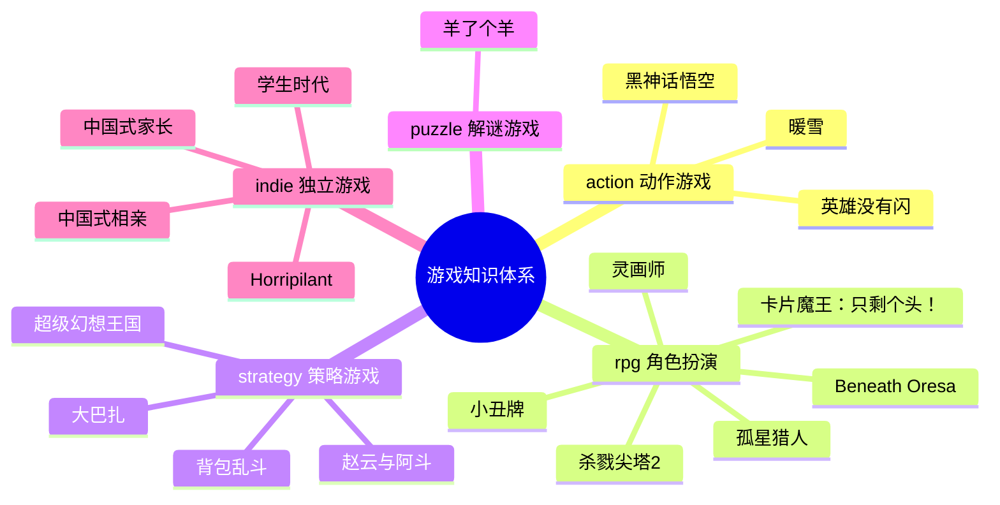

# ReadGames 游戏知识图谱

> 记录所有游戏分析之间的关联关系，以及游戏与读书笔记的跨领域关联。

---

## 🎮 已分析游戏分布

---

## 📊 游戏关联矩阵

| 游戏A | 游戏B | 关联类型 | 关联强度 | 关联描述 |
|-------|-------|---------|---------|---------|
| 杀戮尖塔2 | 杀戮尖塔1 | 设计传承 | ⭐⭐⭐⭐⭐ | 核心机制完全继承，STS2 在职业特色、多人模式、视觉上全面升级 |
| 杀戮尖塔2 | Hades | 同类对比 | ⭐⭐⭐⭐ | 同为 Roguelike，Hades 以叙事驱动复玩，STS 以认知成长驱动复玩 |
| 杀戮尖塔2 | Monster Train | 同类对比 | ⭐⭐⭐⭐ | Monster Train 追求数值爆发感，STS 追求构筑稳定性和决策精度 |
| Horripilant | 杀戮尖塔2 | 设计理念对比 | ⭐⭐⭐⭐ | 都有"每次强化都有代价"哲学；STS2 用牌组污染表达，Horripilant 用叙事代价表达 |
| 英雄没有闪 | 杀戮尖塔2 | 同类对比 | ⭐⭐⭐⭐ | 都有 Roguelike 随机构筑，STS2 追求认知成长，英雄没有闪追求叙事发现；STS2 无操作压力，英雄没有闪有弹幕压力 |
| 英雄没有闪 | Hades | 设计传承 | ⭐⭐⭐⭐⭐ | 碎片化叙事解锁模型相似（画册≈Hades角色对话积累）；Roguelike+叙事驱动双线结构；反英雄视角处理方式 |
| 灵画师 | 英雄没有闪 | 同类对比 | ⭐⭐⭐⭐ | 同为微信小游戏放置ARPG；灵画师美术差异化更强，英雄没有闪流派构筑更深；都有付费设计过激问题 |
| 灵画师 | 杀戮尖塔2 | 反差对比 | ⭐⭐⭐⭐ | 同有流派构筑，STS2零付费靠认知成长，灵画师高付费靠数值积累；构筑类游戏商业化的两种极端 |
| 背包乱斗 | 杀戮尖塔2 | 同类对比 | ⭐⭐⭐⭐⭐ | 同为构建类策略，STS2深度来自"拥有什么牌"，背包乱斗深度来自"怎么摆放"；稀缺资源不同（牌组厚度 vs 背包格子）|
| 背包乱斗 | Hearthstone Battlegrounds | 同类对比 | ⭐⭐⭐⭐ | 都是自动战斗+构建，传统自走棋深度来自羁绊数量，背包乱斗额外增加空间位置维度——同类型的新轴增加 |
| 暖雪 | 杀戮尖塔2 | 设计哲学对比 | ⭐⭐⭐⭐⭐ | 都用随机性制造Build不确定性；STS2是粗粒度随机（给哪些牌），暖雪是细粒度随机（单件圣物有4种效果） |
| 暖雪 | 背包乱斗 | 横向对比 | ⭐⭐⭐⭐ | 都解决"记忆化最优解"问题：背包乱斗靠增加空间维度，暖雪靠增加单件不确定性（四效果）；两种反记忆化策略 |
| 暖雪 | Hades | 同类对比 | ⭐⭐⭐⭐ | 都是动作Roguelite+深度叙事；Hades叙事线性稳定，暖雪叙事随机碎片化；稳定叙事体验 vs 随机叙事发现感 |
| Beneath Oresa | 杀戮尖塔2 | 同类对比 | ⭐⭐⭐⭐⭐ | 同为卡牌构筑Roguelike；BO用3D战场位置作为策略第三维度，StS2靠纯卡组深度；BO升级=方向承诺，StS2升级=数值优化 |
| Beneath Oresa | 背包乱斗 | 空间策略对比 | ⭐⭐⭐⭐ | 都是"空间即策略"模式：BO是战斗中动态站位（时间维度上的空间博弈），背包乱斗是战斗前静态布局（准备维度）；同一设计模式的两种时序形态 |
| Beneath Oresa | Monster Train | 同类对比 | ⭐⭐⭐⭐ | 都在卡牌游戏里引入空间维度：BO是横向站位连线优化，MT是纵深分层防御——空间维度可以是"横向"也可以是"纵向" |
| 小丑牌 | 杀戮尖塔2 | 同类对比 | ⭐⭐⭐⭐⭐ | 同为卡牌构筑Roguelike；小丑牌深度来自"乘法数值爆炸的发现感"，StS2来自"卡牌协同的逻辑构建"；小丑牌用已知扑克框架零门槛切入，StS2用自创战斗系统；爽感直接 vs 思考密度更高 |
| 小丑牌 | 背包乱斗 | 约束机制对比 | ⭐⭐⭐⭐ | 两者都用约束制造决策感：小丑牌用5格Joker槽（数量稀缺），背包乱斗用格子大小（空间稀缺）——不同维度的稀缺性，相同的决策制造原理 |
| 小丑牌 | 暖雪 | 随机粒度对比 | ⭐⭐⭐⭐ | 小丑牌随机性在选择层（商店随机出哪些Joker），暖雪随机性在物品层（单件圣物随机4种效果）；小丑牌随机可预期性更高，认知负担更低 |
| 小丑牌 | Beneath Oresa | 驱动力对比 | ⭐⭐⭐ | 小丑牌是纯数值攀升游戏（分数爆炸是核心乐趣），BO是战术策略游戏（位置博弈是核心乐趣）；同为卡牌构筑但核心满足点完全不同 |
| 黑神话悟空 | 暖雪 | 国产动作游戏对比 | ⭐⭐⭐⭐ | 同为国产动作游戏但设计哲学截然不同：暖雪追求Roguelike随机性和高死亡率练习曲线，黑神话追求线性叙事和适中挑战；暖雪玩家是"Build研究者"，黑神话玩家是"故事体验者" |
| 羊了个羊 | 小丑牌 | 难度来源对比 | ⭐⭐⭐⭐ | 同样高难度，但小丑牌难度来自"认知复杂度"（理解乘法协同需要学习），羊了个羊难度来自"概率控制"（数学设计不让你赢）；前者通过学习可跨越，后者通过学习无法跨越——本质是"技能门槛"vs"数学门槛" |
| 羊了个羊 | 暖雪 | 难度设计哲学对比 | ⭐⭐⭐⭐ | 同为高难度游戏：暖雪对玩家能力是合理考验（反复练习后进步），羊了个羊的难度不依赖玩家能力（运气主导）；暖雪留住硬核玩家，羊了个羊引爆轻度用户——受众画像与难度机制的对应关系 |
| 中国式家长 | 羊了个羊 | 社会议题机制化对比 | ⭐⭐⭐⭐⭐ | 两者都调用中国玩家的集体情绪锚点：羊了个羊调用地域归属和社交攀比，中国式家长调用教育经历和家庭压力；前者偏外部传播，后者偏内部共鸣 |
| 中国式家长 | 小丑牌 | 攻略化风险对比 | ⭐⭐⭐⭐ | 两者都会被玩家迅速攻略化；小丑牌攻略化后仍有随机乘法组合支撑新鲜感，中国式家长攻略化后更容易变成路线表执行——构筑游戏若想长期抗攻略，随机性必须生成新问题而非固定答案 |
| 中国式家长 | 背包乱斗 | 负担翻转同构 | ⭐⭐⭐⭐ | 背包乱斗把背包整理负担翻转为乐趣，中国式家长把日程安排压力翻转为玩法；前者是空间负担，后者是社会负担，都是"负担即乐趣翻转"的不同形态 |
| 中国式相亲 | 中国式家长 | 现实压力系统化传承 | ⭐⭐⭐⭐⭐ | 两者都把“中国式现实压力”转成可优化系统：家长是教育竞争的时间表优化，相亲是婚恋市场的标签匹配和经营优化；共同点是批判社会系统却让玩家在系统内追求最优解 |
| 中国式相亲 | 羊了个羊 | 社会压力机制化对比 | ⭐⭐⭐⭐ | 羊了个羊把社交攀比外化为省份排行榜，中国式相亲把社交评价内化为相亲简历和标签条件；前者是集体身份压力，后者是个体市场价值压力 |
| 中国式相亲 | 小丑牌 | 攻略化风险对比 | ⭐⭐⭐⭐ | 两者都有可攻略化快感；小丑牌靠随机 Joker 维持长期变化，中国式相亲若固定收益路径过强，刷钱卡组会压扁经营深度 |
| 学生时代 | 中国式家长 | 同题材视角对比 | ⭐⭐⭐⭐⭐ | 同为中国教育/成长模拟，但中国式家长核心是亲子压力和代际继承，学生时代更强调学生自身、同学关系、校园空间和 MOD 扩展；前者像家庭教育系统模拟，后者像校园人生路线模拟 |
| 学生时代 | 中国式相亲 | 人生阶段模拟对比 | ⭐⭐⭐⭐ | 两者都把人生阶段制度化：学生时代制度化校园与高考，中国式相亲制度化婚恋与匹配；前者处理“成为谁”，后者处理“和谁在一起” |
| 学生时代 | 超级幻想王国 | 阶段性验收结构对比 | ⭐⭐⭐⭐ | 超级幻想王国是白天建造、夜晚验收；学生时代是日常积累、考试/高考验收；两者都证明“积累—压力峰值—反馈释放”是通用节奏结构 |
| 孤星猎人 | 杀戮尖塔2 | 同类对比 | ⭐⭐⭐⭐⭐ | 同为 Roguelike 构筑，但战斗决策密度截然不同：STS2 战斗中持续手牌操作，孤星猎人战斗决策全在构筑期完成——"战中决策"vs"战前决策"两种极端选择 |
| 孤星猎人 | 小丑牌 | 同类对比 | ⭐⭐⭐⭐ | 同为构筑 Roguelike，但爽感来源不同：小丑牌爽感=数值乘法爆炸发现感，孤星猎人爽感=构筑策略压倒对手的优越感；两者都用"成长始终可见"制造持续游玩动力 |
| 孤星猎人 | 背包乱斗 | 构筑实体化对比 | ⭐⭐⭐⭐ | 都引入了构筑载体实体化（飞船 vs 背包）让抽象构筑有物理实感；策略维度不同：背包乱斗是"空间布局"，孤星猎人是"流派方向押注" |
| 孤星猎人 | Beneath Oresa | 战斗决策时序对比 | ⭐⭐⭐ | BO 战斗中持续有位置决策，孤星猎人战斗结算完全自动——同为策略 Roguelike 但战斗干预程度形成光谱的两端 |
| 大巴扎 | 背包乱斗 | 同类深度对比 | ⭐⭐⭐⭐⭐ | 同为背包空间管理+自动战斗；深度维度不同：背包乱斗在"摆哪里"（位置相邻协同），大巴扎在"占几格"（格子稀缺效率）——同一设计模式的两个抽象层级；背包乱斗更直觉（视觉可见相邻关系），大巴扎更抽象（需计算CD和格子效率） |
| 大巴扎 | 杀戮尖塔2 | 战斗决策时序对比 | ⭐⭐⭐⭐⭐ | Reynad明确描述大巴扎为"多人版杀戮尖塔"；StS2战中密集手牌操作（战中决策为主），大巴扎战斗全自动（战前构筑决策为主）——战斗决策时序谱系的两极；StS2单机Rogue，大巴扎异步多人Rogue |
| 大巴扎 | 小丑牌 | 数值爆炸形态对比 | ⭐⭐⭐⭐ | 同为构筑Roguelike的终局数值爆炸：小丑牌是"Chips×Mult乘法连锁"，大巴扎是"CD无限循环触发"；小丑牌有实时出牌操作，大巴扎战斗完全自动；小丑牌单人，大巴扎异步多人 |
| 大巴扎 | 孤星猎人 | 异步战斗对比 | ⭐⭐⭐⭐ | 两者战斗结算都全自动；孤星猎人的失败归因机制（对称冲击波）切断先手/运气借口，大巴扎异步对战引入"对手构筑演进不确定性"——同为自动战斗但归因设计截然相反 |
| 超级幻想王国 | 背包乱斗 | 同类对比 | ⭐⭐⭐⭐⭐ | 同为策略 Roguelite，核心策略维度不同——背包乱斗策略在于"物品如何摆放"（空间相邻协同），超级幻想王国策略在于"资源链如何规划"（生产优先级取舍）；两者都用 Roguelite 框架让传统重型策略游戏轻量可重玩 |
| 超级幻想王国 | 大巴扎 | 战前构筑+自动战斗对比 | ⭐⭐⭐⭐ | 同为"构筑在战前、战斗全自动"路线；超级幻想王国是单人 PvE 日夜波次，大巴扎是异步 PvP 残影；超级幻想王国日夜节奏感更强（周期性压力高峰），大巴扎博弈感更强（对手构筑的不确定性） |
| 超级幻想王国 | 杀戮尖塔2 | 构筑验收节奏对比 | ⭐⭐⭐⭐ | 同为 Roguelite 构筑，但验收时序截然不同——StS2 战斗中即时验收（每次出牌都是一次小验收），超级幻想王国是周期性验收（每夜一次大验收）；StS2 验收频率高但单次压力短，超级幻想王国单次验收压力大但频率低——构筑验收节奏的两种极端设计 |
| 超级幻想王国 | 风暴之城 | 设计传承对比 | ⭐⭐⭐⭐⭐ | 同发行商（Hooded Horse）的 Roguelite 城市建造；风暴之城用"满意度正循环"驱动建造（正回馈），超级幻想王国用"资源稀缺+周期性验收"驱动（惩罚型约束）→ 同品类两种相反的激励设计；风暴之城的玩家满意度一致性显著高于超级幻想王国 |
| 超级幻想王国 | 孤星猎人 | 构筑归因对比 | ⭐⭐⭐⭐ | 同为"构筑在战前、战斗全自动"——孤星猎人失败归因极清晰（对称冲击波切断借口），超级幻想王国失败归因模糊（不知是站位/单位/装备/经济问题）→ 归因设计决定 Roguelite 留存率 |
| 超级幻想王国 | 卡片魔王：只剩个头！ | 英雄/武器作为构筑锚点对比 | ⭐⭐⭐⭐ | 超级幻想王国的英雄和卡片魔王的武器都是"构筑方向信号"而非纯数值加成——选择锚点→改变后续所有决策；同为"先给方向、再给资源"的构筑引导逻辑 |
| 卡片魔王：只剩个头！ | 杀戮尖塔2 | 战斗时序对比 | ⭐⭐⭐⭐⭐ | 同为卡牌构筑 Roguelite，但战斗决策位置截然不同：StS2 战中密集手牌操作（卡牌是核心），卡片魔王战中以移动和双动为主（卡牌是战后增益选择）；StS2 深度来自纯卡组协同，卡片魔王深度来自"移动策略+双动时机+流派"三维交叉 |
| 卡片魔王：只剩个头！ | 小丑牌 | 门槛设计对比 | ⭐⭐⭐⭐ | 两者都选择"降低基础门槛+保留深度入口"：小丑牌靠扑克已知框架零门槛，卡片魔王靠同步回合制消除时间压力；小丑牌爽感=数值乘法爆炸发现，卡片魔王爽感=弹反时机发现——两种不同的"让玩家感到聪明"的路径 |
| 卡片魔王：只剩个头！ | 暖雪 | 同步回合 vs 即时动作对比 | ⭐⭐⭐⭐ | 都是国产独立 Roguelite；暖雪是即时动作+高死亡率（操作要求高），卡片魔王是同步回合制+双动（操作门槛接近零）；暖雪留住硬核，卡片魔王扩大受众——同类题材下两种截然相反的受众策略 |
| 卡片魔王：只剩个头！ | 孤星猎人 | 构筑驱动力对比 | ⭐⭐⭐ | 同为构筑 Roguelite；孤星猎人战斗决策全在战前（构筑=核心），卡片魔王战中有双动技巧层（构筑+操作双维度）；孤星猎人失败归因极清晰，卡片魔王失败归因更模糊（操作失误 or 构筑问题？） |

---

## 🔗 游戏 × 书籍跨领域关联

| 游戏 | 书籍 | 关联描述 | 关联强度 |
|------|------|---------|---------|
| 杀戮尖塔2 | 游戏编程设计模式 | Command模式用于出牌命令队列；Hook系统是观察者模式的工程化应用；State Pattern管理回合状态机 | ⭐⭐⭐⭐⭐ |
| 杀戮尖塔2 | 思考快与慢 | "可归因失败"设计迫使玩家激活系统2复盘；"近失效应"利用系统1直觉制造再来一局的冲动 | ⭐⭐⭐⭐⭐ |
| 杀戮尖塔2 | 架构整洁之道 | 三层分离架构（表现/逻辑/数据）是整洁架构依赖倒置原则的实践；Core层纯逻辑不依赖引擎 | ⭐⭐⭐⭐ |
| 杀戮尖塔2 | 游戏编程算法与技巧 | "可管理的随机"是随机算法的核心原则，随机生成问题而非决定结果 | ⭐⭐⭐⭐ |
| 杀戮尖塔2 | 第一性原理 | 游戏驱动力的第一性原理是"验证欲"而非"奖励欲"，从底层原理推导出所有复玩机制 | ⭐⭐⭐ |
| Horripilant | 思考快与慢 | "恩赐即负担"利用损失厌恶制造选择张力；心理恐怖持续激活系统1的威胁感知 | ⭐⭐⭐⭐⭐ |
| Horripilant | 游戏编程设计模式 | 增量系统的观察者模式——数值变化自动触发叙事事件；解谜系统的命令模式记录操作 | ⭐⭐⭐⭐ |
| Horripilant | 第一性原理 | 游戏第一性原理是"让玩家持续感到不安而不失去控制感"，所有机制从此推导 | ⭐⭐⭐⭐ |
| 英雄没有闪 | 游戏编程设计模式 | 技能进化树是策略模式；弹幕系统用享元模式管理大量弹幕对象；画册系统用观察者模式解耦解锁逻辑 | ⭐⭐⭐⭐⭐ |
| 英雄没有闪 | 游戏编程算法与技巧 | 弹幕轨迹计算（贝塞尔曲线/极坐标弹幕）；Roguelike 随机强化池的权重采样；Boss 行为状态机 | ⭐⭐⭐⭐⭐ |
| 英雄没有闪 | 思考快与慢 | 反勇者叙事利用玩家系统1的JRPG预期（"勇者=好人"），用叙事翻转强制激活系统2 | ⭐⭐⭐⭐ |
| 英雄没有闪 | 第一性原理 | 游戏第一性原理是"让玩家体验追杀英雄的道德悖论"，弹幕/构筑/叙事三系统服务于同一底层情感目标 | ⭐⭐⭐⭐ |
| 灵画师 | 游戏编程设计模式 | 兽魂双维系统的观察者模式；养成系统的组合模式；经营系统的命令模式 | ⭐⭐⭐⭐ |
| 灵画师 | 游戏编程算法与技巧 | 抽卡保底机制的概率曲线设计；放置游戏离线收益计算；数值平衡设计 | ⭐⭐⭐⭐⭐ |
| 灵画师 | 思考快与慢 | 抽卡利用近失效应和损失厌恶；保底机制既是玩家保护也是付费触发器 | ⭐⭐⭐⭐⭐ |
| 背包乱斗 | 游戏编程设计模式 | ⭐/◆相邻协同是观察者模式的空间化版本；背包布局变化时用脏标记（Dirty Flag）优化协同重算 | ⭐⭐⭐⭐⭐ |
| 背包乱斗 | 游戏编程算法与技巧 | 2D格子空间相邻判断算法；异形物品旋转的坐标变换；物品品质概率的动态权重采样 | ⭐⭐⭐⭐ |
| 背包乱斗 | 真需求 | "背包整理从负担变乐趣"是梁宁"应然vs实然"框架的完美案例——应然是玩家讨厌整理，实然是给了意义反馈后整理变成上瘾玩法 | ⭐⭐⭐⭐⭐ |
| 背包乱斗 | 思考快与慢 | 视觉整齐感触发系统1满足感；协同规划激活系统2；游戏在两个系统间找到独特平衡点 | ⭐⭐⭐⭐ |
| 背包乱斗 | 架构整洁之道 | 所有职业初始属性相同是依赖倒置的游戏设计版本——职业（高层）不依赖具体数值（低层） | ⭐⭐⭐ |
| 暖雪 | 游戏编程设计模式 | 圣物四效果是策略模式的Roguelite化——同一对象随机绑定一个策略实现；化合反应规则表是规则引擎模式 | ⭐⭐⭐⭐⭐ |
| 暖雪 | 思考快与慢 | 四效果设计刻意挑战系统1的记忆化倾向——熟练玩家也无法完全用直觉替代当局判断 | ⭐⭐⭐⭐⭐ |
| 暖雪 | 真需求 | "爽快感和深度不可兼得"是应然；暖雪证明了通过正确设计两者可以共存——这是梁宁"实然"框架的游戏设计案例 | ⭐⭐⭐⭐ |
| 暖雪 | 游戏编程算法与技巧 | 化合反应系统需要高效的规则匹配——哈希表查找大量圣物×飞剑组合规则 | ⭐⭐⭐⭐ |
| Beneath Oresa | 游戏编程设计模式 | 出牌命令队列是命令模式；敌人意图可视化依赖可预测状态机；卡牌触发同伴联动是观察者模式；大量敌人实例共享定义数据是享元模式 | ⭐⭐⭐⭐⭐ |
| Beneath Oresa | 思考快与慢 | 高惩罚设计逼玩家死亡后用系统2复盘；双路线升级制造"系统1倾向A但系统2应选B"的决策张力；BO反驳了"降低系统2负担=更好体验"的直觉 | ⭐⭐⭐⭐⭐ |
| Beneath Oresa | 游戏编程算法与技巧 | 位置系统中的AOE范围判断、击退碰撞检测、穿透连线算法；地图随机生成的路径多样性保证 | ⭐⭐⭐⭐ |
| Beneath Oresa | 架构整洁之道 | 3D表现层与卡牌逻辑层必须严格分离（位置变化不应耦合卡牌效果）；依赖倒置原则：卡牌效果实现"位置影响接口"而不依赖具体位置系统 | ⭐⭐⭐ |
| Beneath Oresa | 真需求 | "打牌"的应然是智力竞技，BO的实然是"在3D战场推飞敌人看爆炸"——满足感官需求让玩家接受复杂策略深度；梁宁框架的游戏化应用 | ⭐⭐⭐ |
| 小丑牌 | 游戏编程设计模式 | 出牌事件触发5张Joker依次结算是观察者模式的实时展示；每种Joker是独立策略对象（策略模式）；出牌命令携带牌型和状态（命令模式）——三种模式在同一系统中并存 | ⭐⭐⭐⭐⭐ |
| 小丑牌 | 思考快与慢 | 分数数值爆炸利用系统1"大数字=成功"的直觉；Boss盲注差一点触发系统1近失效应；**关键：游戏故意制造系统1乘法直觉的失误**——玩家对乘法价值的低估是游戏设计的可利用认知盲点，这挑战了卡尼曼"熟悉环境下系统1可靠"的论断 | ⭐⭐⭐⭐⭐ |
| 小丑牌 | 游戏编程算法与技巧 | Joker商店的稀有度权重采样；种子局（Seeded Run）是确定性随机算法的典型应用；指数递增的目标分数是数值设计中的"强制毕业考试"算法 | ⭐⭐⭐⭐ |
| 小丑牌 | 真需求 | 扑克规则是用户应然（已有认知），Balatro的实然是在扑克框架上叠加数值爆炸层——用户已有认知框架是设计资源，而非需要被替换的障碍 | ⭐⭐⭐⭐ |
| 小丑牌 | 架构整洁之道 | Joker系统是依赖倒置原则的游戏实现：分数计算引擎（高层）依赖Joker接口而非具体实现，任何新Joker只需实现"触发条件+加成计算"接口即可无缝接入 | ⭐⭐⭐ |
| 黑神话悟空 | 游戏编程设计模式 | 变身系统是状态模式的完整落地（独立HP池+技能组的形态对象）；精华系统的"选择即策略绑定"是策略模式的游戏实现；棍法三姿态的随时切换是策略模式在操控层的应用 | ⭐⭐⭐⭐⭐ |
| 黑神话悟空 | 游戏引擎架构 | UE5 Lumen/Nanite在AAA项目中的完整工业化落地；光学扫描建模（Photogrammetry）是引擎架构书中资产管线的真实案例；140人团队6年的技术管线管理 | ⭐⭐⭐⭐ |
| 黑神话悟空 | 思考快与慢 | Boss血量相变机制是"在系统1建立熟悉感之后主动破坏它"的刻意设计——好的Boss设计需要打断玩家的直觉记忆化，强制激活系统2重新学习；无弹反设计降低系统2依赖，扩大大众可达性 | ⭐⭐⭐⭐⭐ |
| 黑神话悟空 | 第一性原理 | 游戏第一性原理是"玩家在最帅气状态下体验孙悟空神话"，但实现时媒介体验原理（爽感优先）优先于IP还原原理（忠实西游记）——挑战了"回归底层原理必然最优"的假设 | ⭐⭐⭐⭐ |
| 黑神话悟空 | 架构整洁之道 | 变身系统的三层分离（表现层/逻辑层/数据层）是整洁架构在游戏系统中的必要条件，数十种变身的可维护性依赖严格分层；精华系统的数据驱动是开闭原则的游戏实践 | ⭐⭐⭐ |
| 赵云与阿斗 | 思考快与慢 | 三国武将名是系统1记忆锚点，零学习成本转化为游戏目标；随机征兵的近失效应驱动"再征一次"——与羊了个羊同一机制但多了文化共鸣加强层 | ⭐⭐⭐⭐⭐ |
| 赵云与阿斗 | 真需求 | 游戏满足"三国英雄代入感"的深层需求；同时通过抖音传播制造"人工社会压力需求"——梁宁"需求可以被构建"框架的小游戏案例 | ⭐⭐⭐⭐ |
| 赵云与阿斗 | 游戏编程设计模式 | 武将激活是观察者模式；武将技能是策略模式；字块合并是命令模式——三种模式在同一合成系统中并存 | ⭐⭐⭐⭐ |
| 赵云与阿斗 | 游戏编程算法与技巧 | 随机征兵池的字块加权概率采样；敌军波次强度递增的难度曲线设计；武将武器固定绑定的静态哈希映射 | ⭐⭐⭐⭐ |
| 赵云与阿斗 | 黑天鹅 | 3-5人团队登顶抖音双榜是黑天鹅结构——蜜獾工坊可复制的是"找验证框架+本土化+砍高成本"的方法论，而非具体的爆款要素组合 | ⭐⭐⭐⭐ |
| 羊了个羊 | 思考快与慢 | 全程依赖系统1偏差：近失效应（槽位快满误判为"差一点"）、损失厌恶（沉没成本推动继续看广告）、部落归属感（地域竞争触发非理性动员）；**关键挑战：知道偏差存在并不能阻止系统1驱动行为**——元认知与行为改变之间存在系统性断裂 | ⭐⭐⭐⭐⭐ |
| 羊了个羊 | 真需求 | 游戏的真实需求不是"娱乐消遣"而是"社会存在感和集体归属感"；但更深层挑战：部分"需求"是通过设计人工制造的焦虑（地域排名落后的紧迫感）——"真需求可以被构建出来"挑战了梁宁"需求是发现的"框架 | ⭐⭐⭐⭐⭐ |
| 羊了个羊 | 第一性原理 | 第一性原理反向应用：从"最大化广告观看次数"这一商业目标逆向推导所有机制设计，而非从玩家体验出发；**挑战：第一性原理可以服务于掠夺性商业目标**，工具中立，取决于推导的起点 | ⭐⭐⭐⭐ |
| 羊了个羊 | 黑天鹅 | 羊了个羊的爆火是黑天鹅事件的典型案例：事后叙事谬误使爆火看起来"必然"，但同等要素的游戏并未爆火；病毒式传播存在不可工程化的偶然性窗口 | ⭐⭐⭐⭐ |
| 孤星猎人 | 游戏编程设计模式 | 每种"核心"是策略模式的 Roguelike 化；增殖核心（复制其他部件效果）是装饰器模式的游戏实现；双方飞船同步状态机是并行状态机结构；出牌命令队列是命令模式 | ⭐⭐⭐⭐⭐ |
| 孤星猎人 | 思考快与慢 | 冲击波对称战斗切断所有失败借口（先手亏/运气差），强制玩家用系统2复盘构筑——失败的可归因性是刻意设计出来的；**挑战：强制系统2激活破坏了卡尼曼"系统2只在主动邀请时运作"的假设**——玩家即使不想复盘，失败的全责归因机制也会迫使他们思考 | ⭐⭐⭐⭐⭐ |
| 孤星猎人 | 架构整洁之道 | 部件效果接口与战斗结算引擎严格分离；新增部件不影响结算引擎——依赖倒置原则在游戏部件系统中的实践 | ⭐⭐⭐ |
| 孤星猎人 | 游戏编程算法与技巧 | 高进阶对手部件配置是权重随机采样的应用；飞行员天赋树是带约束的随机采样（天赋间不能互相矛盾）；百科全书部件索引需要高效哈希查找 | ⭐⭐⭐⭐ |
| 大巴扎 | 游戏编程设计模式 | CD触发战斗引擎是观察者模式的时序版本（每张卡牌订阅"冷却完成"事件）；跨职业联动是策略模式（卡牌实现ICard.onTrigger()接口）；桌面格子脏标记优化协同重算（Dirty Flag） | ⭐⭐⭐⭐⭐ |
| 大巴扎 | 思考快与慢 | 异步PVP挑战了"博弈感需要实时互动"的系统1直觉——博弈感本质来自结果不确定性而非实时对抗；后期无限循环触发利用系统1"大数字=成功"的直觉满足感；元游戏决策（预测段位流行构筑）是纯系统2思考 | ⭐⭐⭐⭐⭐ |
| 大巴扎 | 架构整洁之道 | 战斗引擎与卡牌效果的依赖倒置——引擎依赖ICard接口而非具体卡牌，新卡牌不修改引擎；英雄职业开闭原则：新增英雄不修改现有职业逻辑 | ⭐⭐⭐⭐ |
| 大巴扎 | 真需求 | 挑战"自走棋玩家需要实时博弈感"的应然：实然是玩家需要"不确定的对手压力"，异步残影同样满足；商业模式反复摇摆是"找错真需求"的反面教材 | ⭐⭐⭐⭐ |
| 大巴扎 | 游戏编程算法与技巧 | 三选一事件的道具品质权重随机采样；卡牌等级系统的数值倍率平衡设计；异步PVP的双维度匹配算法（按段位+天数匹配残影快照） | ⭐⭐⭐⭐ |
| 卡片魔王：只剩个头！ | 游戏编程设计模式 | 同步回合制实现是命令模式（每次移动/攻击封装为命令，敌人订阅玩家命令事件后同步响应）；双动弹反的窗口期检测是状态模式（"敌人攻击窗口期"是独立状态，此状态下输入触发不同响应）；Boss 小游戏切换是依赖倒置实践（Boss 战实现"接收输入→执行规则结算"接口，底层规则任意替换） | ⭐⭐⭐⭐⭐ |
| 卡片魔王：只剩个头！ | 思考快与慢 | 双动弹反是典型的系统2认知跃迁时刻（意外触发后玩家重新理解战斗规则）；Boss 小游戏是"熟悉感主动破坏"的极端版本（不是在框架内破坏规律，而是完全丢弃当前框架）；**关键挑战**：同步回合制消除系统1反应焦虑，双动为系统2提供"可主动追求的技巧层"——挑战了卡尼曼"系统2只在主动邀请时运作"的假设：此处系统2的激活是游戏设计主动提供的发现机会，而非认知失败后的补救 | ⭐⭐⭐⭐⭐ |
| 卡片魔王：只剩个头！ | 游戏编程算法与技巧 | 200+能力卡片的随机抽取是带权重的加权随机采样；流派方向检测（持有某武器时偏向特定牌）是动态权重调整；随机迷宫生成是 BSP 或房间种子算法 | ⭐⭐⭐⭐ |
| 卡片魔王：只剩个头！ | 架构整洁之道 | Boss 小游戏系统要求 Boss 战逻辑与主玩法逻辑完全分离；每个 Boss 战实现"接收玩家输入→执行规则结算"的抽象接口，新增 Boss 不修改战斗系统——依赖倒置原则在 Boss 设计中的精准对应 | ⭐⭐⭐⭐ |
| 卡片魔王：只剩个头！ | 真需求 | 游戏满足的"真需求"是"体验动作反应技巧的成就感"；应然是"动作游戏应该要求快速反应"，实然是"玩家真正需要的是'我做了一个正确操作'的确认感"——同步回合制让这种确认感以玩家自己的节奏出现，而非游戏强制的节奏 | ⭐⭐⭐⭐ |
| 超级幻想王国 | 游戏编程设计模式 | 工人分配是观察者模式的典型应用（工人订阅建筑工作队列，建筑完成时通知工人释放）；资源链的级联生产是命令模式的队列实现；英雄技能触发单位联动效果是策略模式——不同英雄持有不同的战斗干预策略对象；生产链系统需要脏标记（Dirty Flag）优化级联重算 | ⭐⭐⭐⭐⭐ |
| 超级幻想王国 | 思考快与慢 | 日夜节奏利用**峰终定律（Peak-End Rule）**——每局情感记忆主要由"最后一波 Boss 被挡住（正峰值）或城门被破（负峰值）"决定；资源不足时的紧迫感激活系统2做艰难取舍；**关键挑战**："差一点守住"的失败体验（负峰值但接近正）反而比"轻松通过"更驱动复玩——这挑战了"应该尽量避免负峰值体验"的直觉设计思路 | ⭐⭐⭐⭐⭐ |
| 超级幻想王国 | 架构整洁之道 | 资源链系统要求建造逻辑层与表现层严格分离；英雄技能应依赖倒置——战斗引擎依赖 ITriggerableSkill 接口，新增英雄不修改战斗系统；生产链系统的可扩展性依赖数据驱动，新资源链只需添加配置文件而不修改代码 | ⭐⭐⭐⭐ |
| 超级幻想王国 | 游戏编程算法与技巧 | 随机资源节点分布是带权重的随机采样（稀有资源节点权重低）；70+ 单位的随机刷新是分池加权采样；诅咒系统的难度曲线是指数增长强度设计 | ⭐⭐⭐⭐ |
| 超级幻想王国 | 真需求 | 游戏满足的"真需求"是"以有限资源构建秩序的控制感"；应然是"城建游戏需要长期积累"，实然是"玩家需要的是30分钟内从无到有建起能运转系统的即时满足感"；Roguelite 框架将这个满足感压缩到单局可完成的时间窗口内——**关键洞察**：同一种"建造乐趣"存在"长期纵深感"和"即时完整感"两种形态，后者同样真实有效 | ⭐⭐⭐⭐ |
| 超级幻想王国 | 游戏引擎架构 | Addressables 异步加载+引用计数→25,101精灵的资源生命周期管理，验证了书中"无引用计数+异步加载则2D像素游戏也会内存爆炸"的观点 | ⭐⭐⭐⭐ |
| 超级幻想王国 | Unity3D高级编程主程手记 | UniTask 零GC分配异步实践验证了书中 Coroutine vs UniTask 选型建议（单机策略游戏零GC优先）；ScriptableObject 数据驱动架构与书中"配置分离"原则完全一致；Projectile Action 原子化=书中"ECS哲学在传统架构中的实践"的最佳案例 | ⭐⭐⭐⭐⭐ |
| 中国式家长 | 思考快与慢 | 游戏利用系统1的社会直觉（清华北大、班干部、面子无需解释即显得重要），但更关键的是玩家会用系统2去优化这套荒诞规则——**挑战**：深刻体验不一定来自系统1→系统2的纠偏，也可能来自系统2主动强化一个有问题的社会系统 | ⭐⭐⭐⭐⭐ |
| 中国式家长 | 真需求 | 游戏满足的真需求不是"体验童年"，而是"重新解释自己的成长经历"；玩家嘴上讨厌应试教育，实然却主动追求高分、名校、首富——**关键洞察**：真需求不一定美好，玩家也可能需要一次把创伤优化成胜利的机会 | ⭐⭐⭐⭐⭐ |
| 中国式家长 | 第一性原理 | 从"中国教育压力的底层结构是什么"推导出时间槽、属性、压力、高考、代际继承；但也提醒：若第一性原理选的是"高考压缩人生"，系统会自然强化高考中心主义，底层假设决定了游戏价值观边界 | ⭐⭐⭐⭐ |
| 中国式家长 | 游戏编程设计模式 | 日程安排是 Command 模式，属性/年龄/压力阈值触发事件是观察者模式，职业结局是规则表/策略系统；模式在这里不只服务工程复用，也服务社会规则模拟 | ⭐⭐⭐⭐ |
| 中国式家长 | 非暴力沟通 | 游戏中的亲子关系几乎是非暴力沟通的反面案例：家庭语言被成绩、面子和满意度占据，孩子的感受与需要被系统性遮蔽；若续作加入沟通系统，可从教育压力模拟进入关系修复模拟 | ⭐⭐⭐⭐ |
| 中国式相亲 | 思考快与慢 | 标签匹配利用系统1的快速判断（收入、职业、兴趣、形象标签立即触发“合适/不合适”），但玩家的系统2往往不是纠偏，而是更高效地优化标签匹配——挑战“慢思考必然带来更理性关系理解”的直觉 | ⭐⭐⭐⭐⭐ |
| 中国式相亲 | 真需求 | 表层需求是谈恋爱/开相亲所，真实需求是安全地处理婚恋市场焦虑；游戏验证“用户要的不是爱情故事本身，而是对现实婚恋规则的掌控感”，同时也揭示真需求可能被系统进一步商品化 | ⭐⭐⭐⭐⭐ |
| 中国式相亲 | 非暴力沟通 | 相亲简历和标签匹配几乎是非暴力沟通的反面：先问条件和标签，而不是感受、需要与请求；若加入“需求表达”系统，可挑战标签匹配的充分性 | ⭐⭐⭐⭐⭐ |
| 中国式相亲 | 爱的博弈 | 游戏强调进入关系前的筛选和选择，而书更关注承诺、信任、误解与修复；张力在于现实婚恋难点不只是找到匹配对象，更是匹配之后如何共同生活 | ⭐⭐⭐⭐ |
| 中国式相亲 | 幸福的婚姻 | 游戏把婚恋前置为“选择正确对象”的匹配问题，而婚姻研究更强调长期互动质量；若要深化，应从“匹配成功”走向“关系维护” | ⭐⭐⭐⭐ |
| 中国式相亲 | 游戏编程设计模式 | 标签匹配可实现为策略模式/规则引擎；资料、声望、好感变化可用观察者模式触发事件；玩家行动是命令模式——模式在这里把社会条件拆成可组合规则 | ⭐⭐⭐⭐ |
| 学生时代 | 思考快与慢 | 游戏利用高考、同学、恋爱、毕业等系统1校园记忆锚点；但玩家的系统2会把青春优化成全职业/全结局/高分路线表——挑战“慢思考会让体验更真实”的直觉，慢思考也可能把怀旧变成效率工程 | ⭐⭐⭐⭐⭐ |
| 学生时代 | 真需求 | 表层需求是重回学生时代，真实需求可能是重写学生时代：玩家想在安全模拟中尝试当年没走过的路；这挑战“怀旧=复刻过去”的直觉，怀旧也可以是修正过去 | ⭐⭐⭐⭐⭐ |
| 学生时代 | 第一性原理 | 底层问题不是“家长如何塑造孩子”，而是“学生如何在有限时间中塑造自己和同伴未来”；与中国式家长同源但视角不同：外部期待压迫 vs 同辈关系与自我路线 | ⭐⭐⭐⭐ |
| 学生时代 | 游戏编程设计模式 | 日程行动是 Command 模式，考试/好感/事件触发是观察者模式，职业结局是规则表/策略模式；创意工坊要求事件系统从一开始可配置而非硬编码剧情 | ⭐⭐⭐⭐⭐ |
| 学生时代 | 架构整洁之道 | 创意工坊支持要求核心逻辑与内容数据分离，角色、事件、结局、卡牌、考试条件都应依赖 IEventCondition/IEventEffect/IEndingRule 等抽象接口 | ⭐⭐⭐⭐ |
| 学生时代 | 非暴力沟通 | 如果校园关系只用好感度表示，会遮蔽同学真实感受和需要；同学共同成长方向可扩展为“理解需要而非刷好感”的关系系统 | ⭐⭐⭐⭐ |

---

## 💡 设计模式追踪

> 跨游戏反复出现的设计模式，以及与书籍理论的对应关系

### 认知复玩循环（Cognitive Replayability）
- **出现游戏**: 杀戮尖塔2
- **书籍对应**: 思考快与慢（近失效应、未完成任务效应）
- **核心价值**: 驱动玩家的不是奖励欲，而是验证欲——每局是一次可复盘的理解实验

### 可管理的随机（Manageable Randomness）
- **出现游戏**: 杀戮尖塔2
- **书籍对应**: 游戏编程算法与技巧
- **核心价值**: 随机负责生成问题，决策负责解决问题；随机不决定输赢，只制造不同局面

### 恩赐即负担（Every Boon Has Its Burden）
- **出现游戏**: Horripilant、杀戮尖塔2
- **书籍对应**: 思考快与慢（损失厌恶）
- **核心价值**: 强化/成长附带代价，让数值提升变成道德选择，制造持续的叙事张力

### 兽魂双维（同一资源驱动两个系统）
- **出现游戏**: 灵画师
- **书籍对应**: 游戏编程设计模式（观察者模式）、架构整洁之道（依赖倒置）
- **核心价值**: 用同一个资源单元（灵兽）同时服务战斗和经营两套系统，强迫跨系统取舍决策，天然产生稀缺感
- **出现游戏**: Horripilant
- **书籍对应**: 思考快与慢（系统1持续激活）
- **核心价值**: 挂机等待时间不是空洞的，而是恐怖氛围的培养基——被动等待变成主动被吞噬

### 负担即乐趣翻转（Burden-to-Delight Inversion）
- **出现游戏**: 背包乱斗
- **书籍对应**: 真需求（应然vs实然）
- **核心价值**: 找到目标用户的"行为式恐惧"（RPG背包整理），通过给负担添加即时意义反馈，把它翻转成最上瘾的核心玩法

### 空间位置即策略（Spatial Position as Strategy）
- **出现游戏**: 背包乱斗
- **书籍对应**: 游戏编程设计模式（观察者模式空间化）
- **核心价值**: 物品"放在哪里"而非"拥有什么"决定战力，空间布局成为独立的策略维度，产生与同类游戏的根本差异化

### 随机粒度设计（Fine-grained Randomness）
- **出现游戏**: 暖雪（细粒度：单件圣物有4种效果）；对比杀戮尖塔2（粗粒度：给哪些牌是随机的）
- **书籍对应**: 游戏编程算法与技巧（随机算法设计）
- **核心价值**: 细粒度随机让每件道具的信息密度更高，带来更高频的意外发现；但认知负担随之增加——是随机策略设计的一个明确权衡维度

### 空间维度作为卡牌策略新轴（Spatial Axis in Card Games）
- **出现游戏**: Beneath Oresa（战场站位连线）；背包乱斗（背包格子空间布局）；Monster Train（纵深分层防御）
- **书籍对应**: 游戏编程设计模式（观察者模式空间化）
- **核心价值**: 卡牌游戏的差异化不必来自更多卡牌——向空间维度扩展（横向连线/纵向分层/格子布局）可以在保持卡牌核心玩法的前提下产生根本性体验差异。同一张牌在不同空间条件下价值天壤之别，使评估框架完全不同。

### 成长即方向承诺（Growth as Strategic Commitment）
- **出现游戏**: Beneath Oresa（卡牌升级双路线二选一）
- **书籍对应**: 思考快与慢（系统2激活、决策满足感）
- **核心价值**: 将"数值强化行为"改造为"策略方向承诺行为"——升级不是"变强"而是"向某个方向押注"。两个选项的好坏依赖于玩家当前状态，没有客观最优解，强制玩家进行上下文感知的慢思考。

### 已知框架作为设计杠杆（Known Framework as Design Leverage）
- **出现游戏**: 小丑牌（扑克规则）
- **书籍对应**: 真需求（用户已有认知是资源）、思考快与慢（系统1的认知储备）
- **核心价值**: 最广泛的已知框架（扑克、国际象棋、麻将等）提供了零学习成本的切入点，同时提供了一个丰富的结构基础来承载新的机制层。"创新=在已知框架上叠加变体"比"创新=发明新框架"更容易被接受。

### 乘法爆炸设计（Multiplicative Explosion Design）
- **出现游戏**: 小丑牌（Chips × Mult）；背包乱斗（相邻协同乘法）
- **书籍对应**: 思考快与慢（系统1对乘法的直觉低估）；游戏编程算法与技巧（指数增长设计）
- **核心价值**: 乘法型增益的价值随当前数值成正比，制造了"理解乘法"这一认知跃迁时刻；配合指数递增的目标分数，自然淘汰纯加法策略，同时制造数量级的感知差异。需要让乘法 vs 加法的对比对玩家可见且可感知。

### 稀缺约束即决策引擎（Scarcity as Decision Engine）
- **出现游戏**: 小丑牌（5格Joker槽位）；背包乱斗（格子大小）；杀戮尖塔2（牌组厚度稀释）
- **书籍对应**: 思考快与慢（稀缺条件下的决策激活）
- **核心价值**: 显式的资源/空间/数量约束是构建类游戏的决策引擎——没有约束，所有选择都是"全要"，决策感消失。约束数量是核心设计变量：太少让玩家窒息，太多使取舍感消失。

### 熟悉感主动破坏（Familiarity Disruption Design）
- **出现游戏**: 黑神话悟空（Boss血量相变机制）
- **书籍对应**: 思考快与慢（系统1记忆化被打断，强制切回系统2）
- **核心价值**: 好的动作游戏Boss需要在玩家建立"我知道这个Boss了"的直觉之后，主动引入行为模式切变（如血量降至50%时完全改变招式集），打断系统1的模式记忆，强制玩家重新进入主动学习状态。这一原则可泛化：任何需要持续注意力的系统，都应在玩家建立熟练感后引入变化，防止退化为无脑执行。

### 形态独立HP池（Form-Isolated Health Pools）
- **出现游戏**: 黑神话悟空（变身系统：各形态独立HP，耗尽自动返回本体）
- **书籍对应**: 游戏编程设计模式（状态模式：形态是状态对象，HP池是状态的一部分）
- **核心价值**: 将"形态切换"从纯技能释放升级为"风险分担的战术工具"——变身不只是换一套技能，而是换一条命。残血时切换形态续命、用低价值形态消耗Boss强攻阶段，产生了跨形态的战术规划层。

### 文化特定性作为全球市场壁垒（Cultural Specificity as Market Moat）
- **出现游戏**: 黑神话悟空（中国神话/西游记美学）
- **书籍对应**: 真需求（差异化的来源）；第一性原理（核心竞争壁垒的底层推导）
- **核心价值**: 彻底的文化本土化可以成为全球市场的差异化壁垒，而非障碍。黑神话2000万销量证明：用不可复制的文化符号做到极致，比试图"普世化"更有穿透力。挑战了"出海=去本土化"的行业惯性认知。

### 近失效应的结构性制造（Engineered Near-Miss Effect）
- **出现游戏**: 羊了个羊（7格槽位快满的"差一点"体验）；杀戮尖塔2（Boss差一点就被打败时的临界感）
- **书籍对应**: 思考快与慢（近失效应：感觉"差一点就赢了"比"完全输了"更驱动下一次尝试）
- **核心价值**: 可以通过关卡数学结构刻意制造近失状态——失败时玩家感觉"我完成了80-90%进度"而非"开局就崩溃"，这种失败方式比突然失败更驱动复玩。是驱动复玩率的底层设计工具之一。

### 单一话题聚焦的病毒传播（Single Topic Viral Anchor）
- **出现游戏**: 羊了个羊（全国同题"今天第二关你过了吗"）
- **书籍对应**: 后真相（情绪性内容的传播速度优于理性分析）；真需求（社会存在感是真实需求）
- **核心价值**: 让所有玩家同时面对同一内容（每日一关），创造全国统一的社交话题锚点，使游戏从个人娱乐变成社会事件。内容多样性与社交话题能量成反比——内容越统一，话题能量越集中，传播效率越高。

### 集体归属感驱动（Tribal Belonging as Spread Engine）
- **出现游戏**: 羊了个羊（省份/地区竞争排行榜）
- **书籍对应**: 思考快与慢（系统1的部落归属感）；真需求（集体认同是深层需求）
- **核心价值**: 将个人行为与集体荣誉绑定（"为省争光"），把"我要赢"升级为"我们要赢"——集体动员触发的传播势能远超个人成就分享。地域/群体归属感是现实世界中最强的既存认同，调用这个锚点是低成本高回报的传播设计。

### 道具即情绪解药（Tool as Emotion Antidote）
- **出现游戏**: 羊了个羊（撤回/洗牌/移出对应犯错/绝望/槽位焦虑三种痛苦）
- **书籍对应**: 思考快与慢（情绪状态影响决策）
- **核心价值**: 道具设计的逻辑不应是"增加玩家能力"，而是"缓解玩家当前的具体痛苦"。精准匹配特定负面情绪的道具比泛化增益消耗率更高，因为玩家只在感受特定痛苦时才有消耗动机，而痛苦状态下的消耗决策阻力最低。

### 失败可归因性设计（Failure Attribution Design）
- **出现游戏**: 孤星猎人（对称冲击波战斗切断先手/运气借口）；杀戮尖塔2（可归因失败设计）
- **书籍对应**: 思考快与慢（系统2复盘激活；系统2只在主动邀请时运作的假设）
- **核心价值**: 可以通过**消除导致失败的外部因素**（先手顺序、随机抽取）来强制玩家将失败完全归因于自己的构筑决策。这种强制归因机制让每次失败都触发有效的系统2复盘，是驱动玩家技能成长的核心机制。**挑战卡尼曼框架**：系统2并不只在"主动邀请"时激活——设计层面可以制造失败归因压力从而迫使系统2运作，不需要玩家主动意愿。

### 战斗决策时序谱系（Battle Decision Timing Spectrum）
- **出现游戏**: 孤星猎人（战前决策，战斗结算全自动）；背包乱斗（战前布局，战斗全自动）；小丑牌（局间选择，出牌阶段有限操作）；杀戮尖塔2（战中密集手牌决策）；Beneath Oresa（战中位置+出牌双决策）
- **书籍对应**: 游戏编程算法与技巧（不同策略游戏的认知负担分布）
- **核心价值**: 构筑类策略游戏存在一个"战前决策密度 vs 战中决策密度"的谱系。战前决策为主的游戏（背包乱斗、孤星猎人）门槛更低、归因更清晰但战斗阶段缺乏紧张感；战中决策为主的游戏（StS2、BO）深度更高但认知门槛更高。设计时应明确选择定位在谱系的哪个位置，而非试图两者兼顾。

### 公有域文化符号作为零成本差异化壁垒（Cultural Commons as Moat）
- **出现游戏**: 赵云与阿斗（三国人名+汉字偏旁）；黑神话悟空（西游记神话美学）
- **书籍对应**: 真需求（文化认同是深层需求）；思考快与慢（系统1文化记忆锚点）；黑天鹅（差异化壁垒的不可复制性）
- **核心价值**: 选择目标玩家群体的文化公地（无版权的历史典故、民间故事、汉字结构）作为美术语言和游戏目标，实现零授权费+零学习成本的双重效益。与授权IP相比，文化公地不因IP合同到期而消失，且对目标群体的情感穿透力更深（记忆形成于童年，系统1层面的认知）。**关键约束**：文化公地在本土市场有效，出海时认知共鸣急剧降低——是市场壁垒，也是市场天花板。

### 约束倒逼差异化（Constraint-Driven Differentiation）
- **出现游戏**: 赵云与阿斗（无美术预算→汉字即角色；无内购体系→IAA亲民口碑）
- **书籍对应**: 架构整洁之道（约束是架构的一部分）；真需求（实然vs应然：应然是"有资源做精美游戏"，实然是"资源约束倒逼出差异化"）
- **核心价值**: 资源约束不只是限制，更是差异化创意的压力来源。无建模预算→设计不需要建模的美术（汉字字形动效）；无授权费→使用文化公地（三国典故）；无内购运营能力→IAA模式反而成为传播卖点（"无氪金"话题）。这一模式适合小团队/独立开发：先列出所有"不能做的事"，再在这个约束集合内寻找独特解。

### 异步PVP作Roguelike与多人博弈的桥梁（Async PVP as Rogue-Multiplayer Bridge）
- **出现游戏**: 大巴扎
- **书籍对应**: 思考快与慢（博弈感本质是结果不确定性，而非实时互动——反直觉洞察）；架构整洁之道（战斗引擎无状态可离线运行的依赖倒置设计）
- **核心价値**: Roguelike探索节奏与实时PVP天然冲突（等待对手打断单机探索流程）；异步殘影匹配通过“截取玩家构筑快照→离线对战结算”解除了“双方必须同时在线”的约束。关键洞察：玩家感受到的博弈感来自**结果的不确定性**（对手是真实玩家的构筑），而非实时互动——这意味着任何战斗结果可确定性计算的游戏都可以实现“多人博弈感”。

### 以胜场计数替代扣血淘汰（Win-Count over HP Elimination）
- **出现游戏**: 大巴扎（10胜制：前中后期每场胜利等价）
- **书籍对应**: 思考快与慢（稀缺条件下的决策激活——每场胜利都重要，不会出现“垃圾时间”）
- **核心价値**: 扣血淘汰制天然导致前期轻视（前期败可以滚雪球翻盘），10胜制使每场对战的重要性等价。副效应：血量保留作为容错机制（允许输掉几场还能复盘继续），但减少了最后存活的极度紧张感。适用场景：当希望“每个阶段都有实质意义”的策略游戏。

### 格子成本作为独立策略轴（Grid Cost as Strategy Axis）
- **出现游戏**: 大巴扎（大/中/小卡牌分别加3/2/1格，总上限10格）；背包乱斗（物品有尺寸，背包总格数限制）
- **书籍对应**: 思考快与慢（稀缺约束激活系刱2决策）；游戏编程算法与技巧（二维装筱问题的策略化）
- **核心价値**: 在道具系统中引入“占格数”维度，使“大型强力道具 vs 小型快速道具”产生真实的取舍张力，而非单纯的强弱比较。格子大小不同于背包乱斗的“位置相邻”——背包乱斗拼的是“摇哪里”，大巴扎拼的是“用多少格换多少强度”。实施简单：给道具属性加占格数字段，给容器设置总格上限即可。

### 反直觉道具分配制造涌现（Counterintuitive Item Attribution for Emergence）
- **出现游戏**: 大巴扎（最强机制卡给到该机制最弱的英雄，制造跨职业低概率高收益组合）
- **书籍对应**: 游戏编程设计模式（涌现性设计：简单规则产生复杂行为）；思考快与慢（小概率高收益的赌博性是卡牌游戏的核心体验）
- **核心价値**: 直觉设计是“把最强的机制牌给最擅长该机制的职业”，形成可预期的流派。反直觉设计将最强的道具跨职业分配，使玩家在正常游玩路径中偶然发现这些联动，产生“无中生有的发现感”。代价：强度方差极大，高度依赖运气；收益：每次跨职业联动都是真实的Aha时刻，非普通流派可复制。

### 操作门槛与操作深度解耦（Decoupled Entry Barrier and Skill Ceiling）
- **出现游戏**: 卡片魔王：只剩个头！（同步回合制消除门槛，双动弹反保留深度入口）
- **书籍对应**: 思考快与慢（系统1焦虑消除；系统2技巧发现）；真需求（“玩家需要的是成功操作的确认感”而非“快速反应挑战”）
- **核心价値**: “操作门槛”（必须达到才能玩）和“操作深度”（愿意追求才能感受到）是两个独立设计变量，可以同时优化。同步回合制把前者降到接近零，双动机制把后者提供为可选高峰体验——两个机制服务于完全不同的玩家需求，不需要互相妖协。**关键洞察**：动作游戏的“高门槛”不是玩法必须付出的代价，而是“即时动作=高操作压力”这个技术选择造成的结果，可以通过架构选择来解除。

### 规则切换型Boss设计（Rule-Switch Boss Design）
- **出现游戏**: 卡片魔王：只剩个头！（每个 Boss 引入独立规则小游戏：俄罗斯方块/象棋/卡牌对决/消除）
- **书籍对应**: 游戏编程设计模式（依赖倒置：Boss 战实现”输入→规则结算”抽象接口）；思考快与慢（Boss 战规则切换是”熟悉感主动破坏”的极端版本）
- **核心价値**: Boss 战的挑战类型可以从”操作难度升级”改造为”规则理解挑战”——玩家不靠记招，而是靠”读懂新规则+利用漏洞”取胜。好处：每个 Boss 都是独特的认知高峰体验，规避了操作门槛；代价：高操作技巧玩家在 Boss 战反而失去用武之地。适用场景：策略思考为核心、操作为辅助的游戏。

### 日夜节奏作为通用压力结构（Day-Night Rhythm as Pressure Architecture）
- **出现游戏**: 超级幻想王国（白天建造低压积累，夜晚防守高压验收，清晨存活满足感释放）
- **书籍对应**: 思考快与慢（峰终定律：情感记忆由峰值和结尾决定；负峰值”差一点守住”反而驱动复玩）；游戏编程设计模式（状态模式：白天/夜晚是两个独立状态，各有不同规则集）
- **核心价值**: 白天=低压积累（资源/建造决策）、夜晚=高压验收（自动战斗+英雄干预）、清晨=满足感释放（存活奖励）构成”投入-结算-反馈”三段式循环的具象化实现。这个节奏框架与”城建游戏”没有必然绑定——任何有资源积累和阶段性压力测试需求的游戏都可以复用。**关键洞察**：日夜节奏让”负峰值”（城门差一点破）成为复玩驱动力，而非留存障碍——需要设计让玩家在失败时感到”我几乎成功了”而非”我一点机会都没有”。

### 品类融合的时间窗口压缩（Genre Fusion via Time Window Compression）
- **出现游戏**: 超级幻想王国（把城市建造压缩到30-60分钟的 Roguelite 单局时间窗口）
- **书籍对应**: 真需求（”城建乐趣”存在”长期纵深感”和”即时完整感”两种形态）；架构整洁之道（模块化设计使”单局完整城建系统”可以不依赖长期积累）
- **核心价值**: 重型游戏品类（城建、4X策略、MMORPG）的核心乐趣往往不依赖”时间长度”本身，而是依赖”从零到有建立运转系统的满足感”。Roguelite 框架是把这种满足感压缩进短时间窗口的有效工具——只需重新定义”完整”的时间粒度，而不是简化核心体验。可复用到：把塔防压缩为 10 分钟 Roguelite 局、把农场经营压缩为 20 分钟 Roguelite 局。

### 共谋循环设计（Complicity Loop）
- **出现游戏**: 中国式家长（玩家为了高分、名校、首富、全职业，主动优化自己口头上可能反感的鸡娃系统）
- **书籍对应**: 思考快与慢（系统2主动优化有问题的规则）；真需求（玩家需要重新解释创伤，而不只是逃离创伤）
- **核心价值**: 社会批判型游戏不一定要阻止玩家使用有问题的系统；更有力的做法是允许玩家为了胜利主动使用它，再让结算结果暴露代价。关键不是“告诉玩家这个系统不好”，而是让玩家意识到“我为什么会自愿把它玩到最优”。适用于教育、职场、债务、舆论、权力等现实题材模拟。

### 公共社会符号作为零解释入口（Public Social Symbols as Onboarding）
- **出现游戏**: 中国式家长（高考、班干部、早恋、面子）；中国式相亲（相亲简历、红娘、会所、条件匹配）；羊了个羊（省份排名、全国同题）；赵云与阿斗（三国人名）
- **书籍对应**: 真需求（用户已有认知是设计资源）；思考快与慢（系统1文化记忆锚点）
- **核心价值**: 目标玩家 3 秒内能理解的现实符号，可以直接承担教程、目标和情绪动机。高考天然意味着终局压力，相亲简历天然意味着条件筛选，班干部天然意味着校园权力，面子天然意味着社交比较。设计时优先寻找“无需解释但情绪明确”的公共符号，比发明新世界观术语更高效。代价是文化边界明显，出海时需要额外转译。

### 标签化关系系统（Tagged Relationship System）
- **出现游戏**: 中国式相亲（最多 20 个标签的相亲简历、会员需求与匹配反馈）；中国式家长（职业/成绩/特长作为社会评价标签）
- **书籍对应**: 非暴力沟通（标签遮蔽感受与需要）；思考快与慢（系统1快速分类）；真需求（用户需要对复杂关系获得可控感）
- **核心价值**: 将复杂人际关系拆成“标签 + 需求 + 排除项 + 隐藏需求”的系统结构，可以快速建立策略性与可读性。关键风险是标签会替代人本身，因此必须设计“标签误读事件”或“隐藏需求反噬”，让玩家意识到匹配成功不等于理解对方。适用于恋爱、招募、队友羁绊、NPC 社交系统。

### 有限青春日程（Limited Youth Schedule）
- **出现游戏**: 学生时代（学习、恋爱、社交、探索、职业路线互相竞争）；中国式家长（学习、娱乐、特长、社交互相竞争）
- **书籍对应**: 真需求（玩家想重写过去而非复刻过去）；思考快与慢（系统2把青春优化成路线表）；非暴力沟通（关系需求不应被好感度完全替代）
- **核心价值**: 青春题材的情绪核心不是“全都能做”，而是“因为选择了这个，所以错过了那个”。通过有限行动点、互斥路线、错过事件和同伴未来差异，制造每个玩家独有的不完整青春版本。完整性留给多周目，遗憾留在单周目。

- **2026-07-09**: 新增学生时代游戏分析（indie/，白雨工作室，Steam PC，2025年EA/2026年正式版，Steam 多半好评77%、近期好评如潮96%；新增“有限青春日程”设计模式）
- **2026-07-09**: 新增中国式相亲游戏分析（indie/，Wave Games + Lightning Games，Steam PC/macOS/Linux，2025年1月上线，特别好评87%；新增“标签化关系系统”设计模式，并扩展“公共社会符号作为零解释入口”）
- **2026-07-09**: 新增中国式家长游戏分析（indie/，墨鱼玩游戏 / 椰岛游戏，PC Steam/WeGame、Switch、移动端；新增“共谋循环设计”“公共社会符号作为零解释入口”两个设计模式）
- **2026-07-20**: 超级幻想王国全维度分析更新（新增 Part 2 技术分析 + Part 3 策划程序打通分析；Projectile Action 74类原子化架构深度逆向；新增”数据驱动=数据不只是参数而是指令””原子化组合架构”等技术洞察；新增风暴之城/孤星猎人/卡片魔王关联；新增游戏引擎架构/Unity3D高级编程主程手记书籍关联）
- **2026-07-06**: 新增超级幻想王国游戏分析（strategy/，Super Fantasy Games + Hooded Horse，PC Steam EA，2025年10月上线，特别好评86%；新增”日夜节奏作为通用压力结构”、”品类融合的时间窗口压缩”两个新设计模式）
- **2026-07-06**: 新增卡片魔王：只剩个头！游戏分析（rpg/，YuWave 一人独立开发，PC Steam + Android，2025年6月上线，3DM 8分；新增”操作门槛与操作深度解耦”、”规则切换型Boss设计”两个新设计模式）
- **2026-07-06**: 新增大巴扎游戏分析（strategy/，PC Steam，Tempo/Reynad，2025年3月公测2025年8月Steam上线，异步自走棋构筑Roguelike；新增”异步PVP作Roguelike与多人博弈的桥梁”、”以胜场计数替代扣血淘汰”、”格子成本作为独立策略轴”、”反直觉道具分配制造涌现”四个新设计模式）
- **2026-06-25**: 新增羊了个羊游戏分析（puzzle/，微信小游戏，2022年9月爆款，Simple Happy；新增"近失效应结构性制造"、"单一话题聚焦传播"、"集体归属感驱动"、"道具即情绪解药"四个新设计模式）
- **2026-06-24**: 新增黑神话：悟空游戏分析（action/，国产首款3A动作RPG，PC+PS5，Game Science，销量破2000万；新增"熟悉感主动破坏"、"形态独立HP池"、"文化特定性作为全球市场壁垒"三个新设计模式）
- **2026-06-17**: 创建游戏知识图谱，迁入杀戮尖塔2分析，生成标准格式笔记
- **2026-06-17**: 新增 Horripilant 游戏分析（indie/），Tavily 联网搜索首次生效
- **2026-06-17**: 新增灵画师游戏分析（rpg/，微信/抖音小游戏）
- **2026-06-17**: 新增背包乱斗游戏分析（strategy/，Steam独立游戏）
- **2026-06-18**: 新增暖雪游戏分析（action/，国产动作Roguelite，多平台）
- **2026-06-18**: 新增 Beneath Oresa 游戏分析（rpg/，卡牌构筑Roguelike，PC Steam，加拿大独立工作室 Broken Spear）
- **2026-06-22**: 新增小丑牌（Balatro）游戏分析（rpg/，扑克+Roguelike，LocalThunk单人开发，2024年度游戏候选）
- **2026-06-17**: 新增 Horripilant 游戏分析（indie/），Tavily 联网搜索首次生效
- **2026-06-17**: 新增灵画师游戏分析（rpg/，微信/抖音小游戏）
- **2026-06-17**: 新增背包乱斗游戏分析（strategy/，Steam独立游戏）
- **2026-06-18**: 新增暖雪游戏分析（action/，国产动作Roguelite，多平台）
- **2026-06-18**: 新增 Beneath Oresa 游戏分析（rpg/，卡牌构筑Roguelike，PC Steam，加拿大独立工作室 Broken Spear）

---

*本文件随游戏分析增加而持续更新。*
