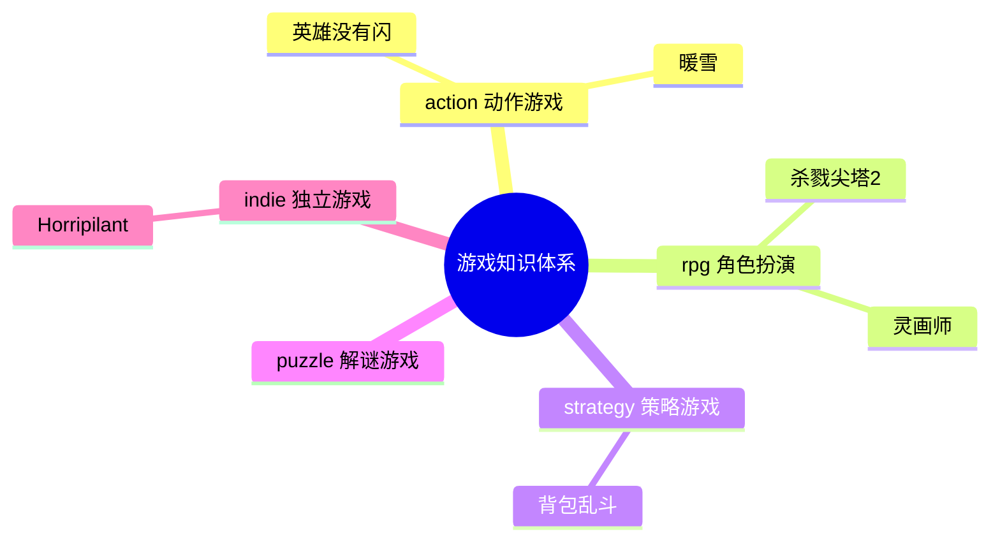

# ReadGames 游戏知识图谱

> 记录所有游戏分析之间的关联关系，以及游戏与读书笔记的跨领域关联。

---

## 🎮 已分析游戏分布

---

## 📊 游戏关联矩阵

| 游戏A | 游戏B | 关联类型 | 关联强度 | 关联描述 |
|-------|-------|---------|---------|---------|
| 杀戮尖塔2 | 杀戮尖塔1 | 设计传承 | ⭐⭐⭐⭐⭐ | 核心机制完全继承，STS2 在职业特色、多人模式、视觉上全面升级 |
| 杀戮尖塔2 | Hades | 同类对比 | ⭐⭐⭐⭐ | 同为 Roguelike，Hades 以叙事驱动复玩，STS 以认知成长驱动复玩 |
| 杀戮尖塔2 | Monster Train | 同类对比 | ⭐⭐⭐⭐ | Monster Train 追求数值爆发感，STS 追求构筑稳定性和决策精度 |
| Horripilant | 杀戮尖塔2 | 设计理念对比 | ⭐⭐⭐⭐ | 都有"每次强化都有代价"哲学；STS2 用牌组污染表达，Horripilant 用叙事代价表达 |
| 英雄没有闪 | 杀戮尖塔2 | 同类对比 | ⭐⭐⭐⭐ | 都有 Roguelike 随机构筑，STS2 追求认知成长，英雄没有闪追求叙事发现；STS2 无操作压力，英雄没有闪有弹幕压力 |
| 英雄没有闪 | Hades | 设计传承 | ⭐⭐⭐⭐⭐ | 碎片化叙事解锁模型相似（画册≈Hades角色对话积累）；Roguelike+叙事驱动双线结构；反英雄视角处理方式 |
| 灵画师 | 英雄没有闪 | 同类对比 | ⭐⭐⭐⭐ | 同为微信小游戏放置ARPG；灵画师美术差异化更强，英雄没有闪流派构筑更深；都有付费设计过激问题 |
| 灵画师 | 杀戮尖塔2 | 反差对比 | ⭐⭐⭐⭐ | 同有流派构筑，STS2零付费靠认知成长，灵画师高付费靠数值积累；构筑类游戏商业化的两种极端 |
| 背包乱斗 | 杀戮尖塔2 | 同类对比 | ⭐⭐⭐⭐⭐ | 同为构建类策略，STS2深度来自"拥有什么牌"，背包乱斗深度来自"怎么摆放"；稀缺资源不同（牌组厚度 vs 背包格子）|
| 背包乱斗 | Hearthstone Battlegrounds | 同类对比 | ⭐⭐⭐⭐ | 都是自动战斗+构建，传统自走棋深度来自羁绊数量，背包乱斗额外增加空间位置维度——同类型的新轴增加 |
| 暖雪 | 杀戮尖塔2 | 设计哲学对比 | ⭐⭐⭐⭐⭐ | 都用随机性制造Build不确定性；STS2是粗粒度随机（给哪些牌），暖雪是细粒度随机（单件圣物有4种效果） |
| 暖雪 | 背包乱斗 | 横向对比 | ⭐⭐⭐⭐ | 都解决"记忆化最优解"问题：背包乱斗靠增加空间维度，暖雪靠增加单件不确定性（四效果）；两种反记忆化策略 |
| 暖雪 | Hades | 同类对比 | ⭐⭐⭐⭐ | 都是动作Roguelite+深度叙事；Hades叙事线性稳定，暖雪叙事随机碎片化；稳定叙事体验 vs 随机叙事发现感 |

---

## 🔗 游戏 × 书籍跨领域关联

| 游戏 | 书籍 | 关联描述 | 关联强度 |
|------|------|---------|---------|
| 杀戮尖塔2 | 游戏编程设计模式 | Command模式用于出牌命令队列；Hook系统是观察者模式的工程化应用；State Pattern管理回合状态机 | ⭐⭐⭐⭐⭐ |
| 杀戮尖塔2 | 思考快与慢 | "可归因失败"设计迫使玩家激活系统2复盘；"近失效应"利用系统1直觉制造再来一局的冲动 | ⭐⭐⭐⭐⭐ |
| 杀戮尖塔2 | 架构整洁之道 | 三层分离架构（表现/逻辑/数据）是整洁架构依赖倒置原则的实践；Core层纯逻辑不依赖引擎 | ⭐⭐⭐⭐ |
| 杀戮尖塔2 | 游戏编程算法与技巧 | "可管理的随机"是随机算法的核心原则，随机生成问题而非决定结果 | ⭐⭐⭐⭐ |
| 杀戮尖塔2 | 第一性原理 | 游戏驱动力的第一性原理是"验证欲"而非"奖励欲"，从底层原理推导出所有复玩机制 | ⭐⭐⭐ |
| Horripilant | 思考快与慢 | "恩赐即负担"利用损失厌恶制造选择张力；心理恐怖持续激活系统1的威胁感知 | ⭐⭐⭐⭐⭐ |
| Horripilant | 游戏编程设计模式 | 增量系统的观察者模式——数值变化自动触发叙事事件；解谜系统的命令模式记录操作 | ⭐⭐⭐⭐ |
| Horripilant | 第一性原理 | 游戏第一性原理是"让玩家持续感到不安而不失去控制感"，所有机制从此推导 | ⭐⭐⭐⭐ |
| 英雄没有闪 | 游戏编程设计模式 | 技能进化树是策略模式；弹幕系统用享元模式管理大量弹幕对象；画册系统用观察者模式解耦解锁逻辑 | ⭐⭐⭐⭐⭐ |
| 英雄没有闪 | 游戏编程算法与技巧 | 弹幕轨迹计算（贝塞尔曲线/极坐标弹幕）；Roguelike 随机强化池的权重采样；Boss 行为状态机 | ⭐⭐⭐⭐⭐ |
| 英雄没有闪 | 思考快与慢 | 反勇者叙事利用玩家系统1的JRPG预期（"勇者=好人"），用叙事翻转强制激活系统2 | ⭐⭐⭐⭐ |
| 英雄没有闪 | 第一性原理 | 游戏第一性原理是"让玩家体验追杀英雄的道德悖论"，弹幕/构筑/叙事三系统服务于同一底层情感目标 | ⭐⭐⭐⭐ |
| 灵画师 | 游戏编程设计模式 | 兽魂双维系统的观察者模式；养成系统的组合模式；经营系统的命令模式 | ⭐⭐⭐⭐ |
| 灵画师 | 游戏编程算法与技巧 | 抽卡保底机制的概率曲线设计；放置游戏离线收益计算；数值平衡设计 | ⭐⭐⭐⭐⭐ |
| 灵画师 | 思考快与慢 | 抽卡利用近失效应和损失厌恶；保底机制既是玩家保护也是付费触发器 | ⭐⭐⭐⭐⭐ |
| 背包乱斗 | 游戏编程设计模式 | ⭐/◆相邻协同是观察者模式的空间化版本；背包布局变化时用脏标记（Dirty Flag）优化协同重算 | ⭐⭐⭐⭐⭐ |
| 背包乱斗 | 游戏编程算法与技巧 | 2D格子空间相邻判断算法；异形物品旋转的坐标变换；物品品质概率的动态权重采样 | ⭐⭐⭐⭐ |
| 背包乱斗 | 真需求 | "背包整理从负担变乐趣"是梁宁"应然vs实然"框架的完美案例——应然是玩家讨厌整理，实然是给了意义反馈后整理变成上瘾玩法 | ⭐⭐⭐⭐⭐ |
| 背包乱斗 | 思考快与慢 | 视觉整齐感触发系统1满足感；协同规划激活系统2；游戏在两个系统间找到独特平衡点 | ⭐⭐⭐⭐ |
| 背包乱斗 | 架构整洁之道 | 所有职业初始属性相同是依赖倒置的游戏设计版本——职业（高层）不依赖具体数值（低层） | ⭐⭐⭐ |
| 暖雪 | 游戏编程设计模式 | 圣物四效果是策略模式的Roguelite化——同一对象随机绑定一个策略实现；化合反应规则表是规则引擎模式 | ⭐⭐⭐⭐⭐ |
| 暖雪 | 思考快与慢 | 四效果设计刻意挑战系统1的记忆化倾向——熟练玩家也无法完全用直觉替代当局判断 | ⭐⭐⭐⭐⭐ |
| 暖雪 | 真需求 | "爽快感和深度不可兼得"是应然；暖雪证明了通过正确设计两者可以共存——这是梁宁"实然"框架的游戏设计案例 | ⭐⭐⭐⭐ |
| 暖雪 | 游戏编程算法与技巧 | 化合反应系统需要高效的规则匹配——哈希表查找大量圣物×飞剑组合规则 | ⭐⭐⭐⭐ |

---

## 💡 设计模式追踪

> 跨游戏反复出现的设计模式，以及与书籍理论的对应关系

### 认知复玩循环（Cognitive Replayability）
- **出现游戏**: 杀戮尖塔2
- **书籍对应**: 思考快与慢（近失效应、未完成任务效应）
- **核心价值**: 驱动玩家的不是奖励欲，而是验证欲——每局是一次可复盘的理解实验

### 可管理的随机（Manageable Randomness）
- **出现游戏**: 杀戮尖塔2
- **书籍对应**: 游戏编程算法与技巧
- **核心价值**: 随机负责生成问题，决策负责解决问题；随机不决定输赢，只制造不同局面

### 恩赐即负担（Every Boon Has Its Burden）
- **出现游戏**: Horripilant、杀戮尖塔2
- **书籍对应**: 思考快与慢（损失厌恶）
- **核心价值**: 强化/成长附带代价，让数值提升变成道德选择，制造持续的叙事张力

### 兽魂双维（同一资源驱动两个系统）
- **出现游戏**: 灵画师
- **书籍对应**: 游戏编程设计模式（观察者模式）、架构整洁之道（依赖倒置）
- **核心价值**: 用同一个资源单元（灵兽）同时服务战斗和经营两套系统，强迫跨系统取舍决策，天然产生稀缺感
- **出现游戏**: Horripilant
- **书籍对应**: 思考快与慢（系统1持续激活）
- **核心价值**: 挂机等待时间不是空洞的，而是恐怖氛围的培养基——被动等待变成主动被吞噬

### 负担即乐趣翻转（Burden-to-Delight Inversion）
- **出现游戏**: 背包乱斗
- **书籍对应**: 真需求（应然vs实然）
- **核心价值**: 找到目标用户的"行为式恐惧"（RPG背包整理），通过给负担添加即时意义反馈，把它翻转成最上瘾的核心玩法

### 空间位置即策略（Spatial Position as Strategy）
- **出现游戏**: 背包乱斗
- **书籍对应**: 游戏编程设计模式（观察者模式空间化）
- **核心价值**: 物品"放在哪里"而非"拥有什么"决定战力，空间布局成为独立的策略维度，产生与同类游戏的根本差异化

### 随机粒度设计（Fine-grained Randomness）
- **出现游戏**: 暖雪（细粒度：单件圣物有4种效果）；对比杀戮尖塔2（粗粒度：给哪些牌是随机的）
- **书籍对应**: 游戏编程算法与技巧（随机算法设计）
- **核心价值**: 细粒度随机让每件道具的信息密度更高，带来更高频的意外发现；但认知负担随之增加——是随机策略设计的一个明确权衡维度

- **2026-06-17**: 创建游戏知识图谱，迁入杀戮尖塔2分析，生成标准格式笔记
- **2026-06-17**: 新增 Horripilant 游戏分析（indie/），Tavily 联网搜索首次生效
- **2026-06-17**: 新增灵画师游戏分析（rpg/，微信/抖音小游戏）
- **2026-06-17**: 新增背包乱斗游戏分析（strategy/，Steam独立游戏）
- **2026-06-18**: 新增暖雪游戏分析（action/，国产动作Roguelite，多平台）

---

*本文件随游戏分析增加而持续更新。*
