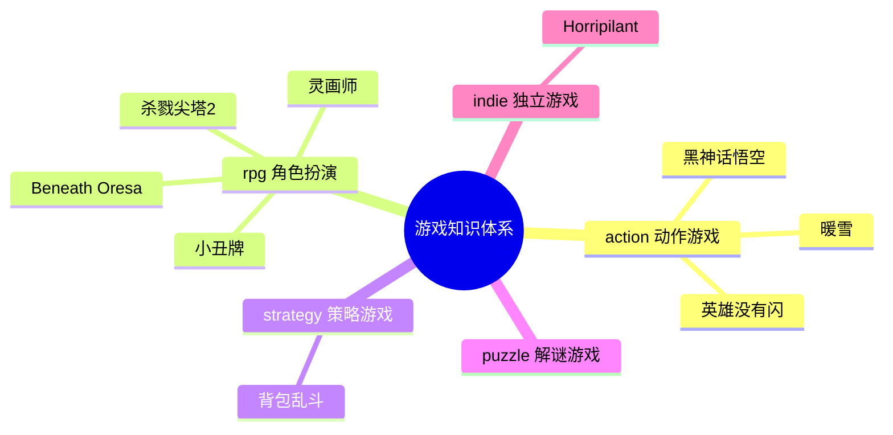

# ReadGames 游戏知识图谱

> 记录所有游戏分析之间的关联关系，以及游戏与读书笔记的跨领域关联。

---

## 🎮 已分析游戏分布

---

## 📊 游戏关联矩阵

| 游戏A | 游戏B | 关联类型 | 关联强度 | 关联描述 |
|-------|-------|---------|---------|---------|
| 杀戮尖塔2 | 杀戮尖塔1 | 设计传承 | ⭐⭐⭐⭐⭐ | 核心机制完全继承，STS2 在职业特色、多人模式、视觉上全面升级 |
| 杀戮尖塔2 | Hades | 同类对比 | ⭐⭐⭐⭐ | 同为 Roguelike，Hades 以叙事驱动复玩，STS 以认知成长驱动复玩 |
| 杀戮尖塔2 | Monster Train | 同类对比 | ⭐⭐⭐⭐ | Monster Train 追求数值爆发感，STS 追求构筑稳定性和决策精度 |
| Horripilant | 杀戮尖塔2 | 设计理念对比 | ⭐⭐⭐⭐ | 都有"每次强化都有代价"哲学；STS2 用牌组污染表达，Horripilant 用叙事代价表达 |
| 英雄没有闪 | 杀戮尖塔2 | 同类对比 | ⭐⭐⭐⭐ | 都有 Roguelike 随机构筑，STS2 追求认知成长，英雄没有闪追求叙事发现；STS2 无操作压力，英雄没有闪有弹幕压力 |
| 英雄没有闪 | Hades | 设计传承 | ⭐⭐⭐⭐⭐ | 碎片化叙事解锁模型相似（画册≈Hades角色对话积累）；Roguelike+叙事驱动双线结构；反英雄视角处理方式 |
| 灵画师 | 英雄没有闪 | 同类对比 | ⭐⭐⭐⭐ | 同为微信小游戏放置ARPG；灵画师美术差异化更强，英雄没有闪流派构筑更深；都有付费设计过激问题 |
| 灵画师 | 杀戮尖塔2 | 反差对比 | ⭐⭐⭐⭐ | 同有流派构筑，STS2零付费靠认知成长，灵画师高付费靠数值积累；构筑类游戏商业化的两种极端 |
| 背包乱斗 | 杀戮尖塔2 | 同类对比 | ⭐⭐⭐⭐⭐ | 同为构建类策略，STS2深度来自"拥有什么牌"，背包乱斗深度来自"怎么摆放"；稀缺资源不同（牌组厚度 vs 背包格子）|
| 背包乱斗 | Hearthstone Battlegrounds | 同类对比 | ⭐⭐⭐⭐ | 都是自动战斗+构建，传统自走棋深度来自羁绊数量，背包乱斗额外增加空间位置维度——同类型的新轴增加 |
| 暖雪 | 杀戮尖塔2 | 设计哲学对比 | ⭐⭐⭐⭐⭐ | 都用随机性制造Build不确定性；STS2是粗粒度随机（给哪些牌），暖雪是细粒度随机（单件圣物有4种效果） |
| 暖雪 | 背包乱斗 | 横向对比 | ⭐⭐⭐⭐ | 都解决"记忆化最优解"问题：背包乱斗靠增加空间维度，暖雪靠增加单件不确定性（四效果）；两种反记忆化策略 |
| 暖雪 | Hades | 同类对比 | ⭐⭐⭐⭐ | 都是动作Roguelite+深度叙事；Hades叙事线性稳定，暖雪叙事随机碎片化；稳定叙事体验 vs 随机叙事发现感 |
| Beneath Oresa | 杀戮尖塔2 | 同类对比 | ⭐⭐⭐⭐⭐ | 同为卡牌构筑Roguelike；BO用3D战场位置作为策略第三维度，StS2靠纯卡组深度；BO升级=方向承诺，StS2升级=数值优化 |
| Beneath Oresa | 背包乱斗 | 空间策略对比 | ⭐⭐⭐⭐ | 都是"空间即策略"模式：BO是战斗中动态站位（时间维度上的空间博弈），背包乱斗是战斗前静态布局（准备维度）；同一设计模式的两种时序形态 |
| Beneath Oresa | Monster Train | 同类对比 | ⭐⭐⭐⭐ | 都在卡牌游戏里引入空间维度：BO是横向站位连线优化，MT是纵深分层防御——空间维度可以是"横向"也可以是"纵向" |
| 小丑牌 | 杀戮尖塔2 | 同类对比 | ⭐⭐⭐⭐⭐ | 同为卡牌构筑Roguelike；小丑牌深度来自"乘法数值爆炸的发现感"，StS2来自"卡牌协同的逻辑构建"；小丑牌用已知扑克框架零门槛切入，StS2用自创战斗系统；爽感直接 vs 思考密度更高 |
| 小丑牌 | 背包乱斗 | 约束机制对比 | ⭐⭐⭐⭐ | 两者都用约束制造决策感：小丑牌用5格Joker槽（数量稀缺），背包乱斗用格子大小（空间稀缺）——不同维度的稀缺性，相同的决策制造原理 |
| 小丑牌 | 暖雪 | 随机粒度对比 | ⭐⭐⭐⭐ | 小丑牌随机性在选择层（商店随机出哪些Joker），暖雪随机性在物品层（单件圣物随机4种效果）；小丑牌随机可预期性更高，认知负担更低 |
| 小丑牌 | Beneath Oresa | 驱动力对比 | ⭐⭐⭐ | 小丑牌是纯数值攀升游戏（分数爆炸是核心乐趣），BO是战术策略游戏（位置博弈是核心乐趣）；同为卡牌构筑但核心满足点完全不同 |
| 黑神话悟空 | 暖雪 | 国产动作游戏对比 | ⭐⭐⭐⭐ | 同为国产动作游戏但设计哲学截然不同：暖雪追求Roguelike随机性和高死亡率练习曲线，黑神话追求线性叙事和适中挑战；暖雪玩家是"Build研究者"，黑神话玩家是"故事体验者" |

---

## 🔗 游戏 × 书籍跨领域关联

| 游戏 | 书籍 | 关联描述 | 关联强度 |
|------|------|---------|---------|
| 杀戮尖塔2 | 游戏编程设计模式 | Command模式用于出牌命令队列；Hook系统是观察者模式的工程化应用；State Pattern管理回合状态机 | ⭐⭐⭐⭐⭐ |
| 杀戮尖塔2 | 思考快与慢 | "可归因失败"设计迫使玩家激活系统2复盘；"近失效应"利用系统1直觉制造再来一局的冲动 | ⭐⭐⭐⭐⭐ |
| 杀戮尖塔2 | 架构整洁之道 | 三层分离架构（表现/逻辑/数据）是整洁架构依赖倒置原则的实践；Core层纯逻辑不依赖引擎 | ⭐⭐⭐⭐ |
| 杀戮尖塔2 | 游戏编程算法与技巧 | "可管理的随机"是随机算法的核心原则，随机生成问题而非决定结果 | ⭐⭐⭐⭐ |
| 杀戮尖塔2 | 第一性原理 | 游戏驱动力的第一性原理是"验证欲"而非"奖励欲"，从底层原理推导出所有复玩机制 | ⭐⭐⭐ |
| Horripilant | 思考快与慢 | "恩赐即负担"利用损失厌恶制造选择张力；心理恐怖持续激活系统1的威胁感知 | ⭐⭐⭐⭐⭐ |
| Horripilant | 游戏编程设计模式 | 增量系统的观察者模式——数值变化自动触发叙事事件；解谜系统的命令模式记录操作 | ⭐⭐⭐⭐ |
| Horripilant | 第一性原理 | 游戏第一性原理是"让玩家持续感到不安而不失去控制感"，所有机制从此推导 | ⭐⭐⭐⭐ |
| 英雄没有闪 | 游戏编程设计模式 | 技能进化树是策略模式；弹幕系统用享元模式管理大量弹幕对象；画册系统用观察者模式解耦解锁逻辑 | ⭐⭐⭐⭐⭐ |
| 英雄没有闪 | 游戏编程算法与技巧 | 弹幕轨迹计算（贝塞尔曲线/极坐标弹幕）；Roguelike 随机强化池的权重采样；Boss 行为状态机 | ⭐⭐⭐⭐⭐ |
| 英雄没有闪 | 思考快与慢 | 反勇者叙事利用玩家系统1的JRPG预期（"勇者=好人"），用叙事翻转强制激活系统2 | ⭐⭐⭐⭐ |
| 英雄没有闪 | 第一性原理 | 游戏第一性原理是"让玩家体验追杀英雄的道德悖论"，弹幕/构筑/叙事三系统服务于同一底层情感目标 | ⭐⭐⭐⭐ |
| 灵画师 | 游戏编程设计模式 | 兽魂双维系统的观察者模式；养成系统的组合模式；经营系统的命令模式 | ⭐⭐⭐⭐ |
| 灵画师 | 游戏编程算法与技巧 | 抽卡保底机制的概率曲线设计；放置游戏离线收益计算；数值平衡设计 | ⭐⭐⭐⭐⭐ |
| 灵画师 | 思考快与慢 | 抽卡利用近失效应和损失厌恶；保底机制既是玩家保护也是付费触发器 | ⭐⭐⭐⭐⭐ |
| 背包乱斗 | 游戏编程设计模式 | ⭐/◆相邻协同是观察者模式的空间化版本；背包布局变化时用脏标记（Dirty Flag）优化协同重算 | ⭐⭐⭐⭐⭐ |
| 背包乱斗 | 游戏编程算法与技巧 | 2D格子空间相邻判断算法；异形物品旋转的坐标变换；物品品质概率的动态权重采样 | ⭐⭐⭐⭐ |
| 背包乱斗 | 真需求 | "背包整理从负担变乐趣"是梁宁"应然vs实然"框架的完美案例——应然是玩家讨厌整理，实然是给了意义反馈后整理变成上瘾玩法 | ⭐⭐⭐⭐⭐ |
| 背包乱斗 | 思考快与慢 | 视觉整齐感触发系统1满足感；协同规划激活系统2；游戏在两个系统间找到独特平衡点 | ⭐⭐⭐⭐ |
| 背包乱斗 | 架构整洁之道 | 所有职业初始属性相同是依赖倒置的游戏设计版本——职业（高层）不依赖具体数值（低层） | ⭐⭐⭐ |
| 暖雪 | 游戏编程设计模式 | 圣物四效果是策略模式的Roguelite化——同一对象随机绑定一个策略实现；化合反应规则表是规则引擎模式 | ⭐⭐⭐⭐⭐ |
| 暖雪 | 思考快与慢 | 四效果设计刻意挑战系统1的记忆化倾向——熟练玩家也无法完全用直觉替代当局判断 | ⭐⭐⭐⭐⭐ |
| 暖雪 | 真需求 | "爽快感和深度不可兼得"是应然；暖雪证明了通过正确设计两者可以共存——这是梁宁"实然"框架的游戏设计案例 | ⭐⭐⭐⭐ |
| 暖雪 | 游戏编程算法与技巧 | 化合反应系统需要高效的规则匹配——哈希表查找大量圣物×飞剑组合规则 | ⭐⭐⭐⭐ |
| Beneath Oresa | 游戏编程设计模式 | 出牌命令队列是命令模式；敌人意图可视化依赖可预测状态机；卡牌触发同伴联动是观察者模式；大量敌人实例共享定义数据是享元模式 | ⭐⭐⭐⭐⭐ |
| Beneath Oresa | 思考快与慢 | 高惩罚设计逼玩家死亡后用系统2复盘；双路线升级制造"系统1倾向A但系统2应选B"的决策张力；BO反驳了"降低系统2负担=更好体验"的直觉 | ⭐⭐⭐⭐⭐ |
| Beneath Oresa | 游戏编程算法与技巧 | 位置系统中的AOE范围判断、击退碰撞检测、穿透连线算法；地图随机生成的路径多样性保证 | ⭐⭐⭐⭐ |
| Beneath Oresa | 架构整洁之道 | 3D表现层与卡牌逻辑层必须严格分离（位置变化不应耦合卡牌效果）；依赖倒置原则：卡牌效果实现"位置影响接口"而不依赖具体位置系统 | ⭐⭐⭐ |
| Beneath Oresa | 真需求 | "打牌"的应然是智力竞技，BO的实然是"在3D战场推飞敌人看爆炸"——满足感官需求让玩家接受复杂策略深度；梁宁框架的游戏化应用 | ⭐⭐⭐ |
| 小丑牌 | 游戏编程设计模式 | 出牌事件触发5张Joker依次结算是观察者模式的实时展示；每种Joker是独立策略对象（策略模式）；出牌命令携带牌型和状态（命令模式）——三种模式在同一系统中并存 | ⭐⭐⭐⭐⭐ |
| 小丑牌 | 思考快与慢 | 分数数值爆炸利用系统1"大数字=成功"的直觉；Boss盲注差一点触发系统1近失效应；**关键：游戏故意制造系统1乘法直觉的失误**——玩家对乘法价值的低估是游戏设计的可利用认知盲点，这挑战了卡尼曼"熟悉环境下系统1可靠"的论断 | ⭐⭐⭐⭐⭐ |
| 小丑牌 | 游戏编程算法与技巧 | Joker商店的稀有度权重采样；种子局（Seeded Run）是确定性随机算法的典型应用；指数递增的目标分数是数值设计中的"强制毕业考试"算法 | ⭐⭐⭐⭐ |
| 小丑牌 | 真需求 | 扑克规则是用户应然（已有认知），Balatro的实然是在扑克框架上叠加数值爆炸层——用户已有认知框架是设计资源，而非需要被替换的障碍 | ⭐⭐⭐⭐ |
| 小丑牌 | 架构整洁之道 | Joker系统是依赖倒置原则的游戏实现：分数计算引擎（高层）依赖Joker接口而非具体实现，任何新Joker只需实现"触发条件+加成计算"接口即可无缝接入 | ⭐⭐⭐ |
| 黑神话悟空 | 游戏编程设计模式 | 变身系统是状态模式的完整落地（独立HP池+技能组的形态对象）；精华系统的"选择即策略绑定"是策略模式的游戏实现；棍法三姿态的随时切换是策略模式在操控层的应用 | ⭐⭐⭐⭐⭐ |
| 黑神话悟空 | 游戏引擎架构 | UE5 Lumen/Nanite在AAA项目中的完整工业化落地；光学扫描建模（Photogrammetry）是引擎架构书中资产管线的真实案例；140人团队6年的技术管线管理 | ⭐⭐⭐⭐ |
| 黑神话悟空 | 思考快与慢 | Boss血量相变机制是"在系统1建立熟悉感之后主动破坏它"的刻意设计——好的Boss设计需要打断玩家的直觉记忆化，强制激活系统2重新学习；无弹反设计降低系统2依赖，扩大大众可达性 | ⭐⭐⭐⭐⭐ |
| 黑神话悟空 | 第一性原理 | 游戏第一性原理是"玩家在最帅气状态下体验孙悟空神话"，但实现时媒介体验原理（爽感优先）优先于IP还原原理（忠实西游记）——挑战了"回归底层原理必然最优"的假设 | ⭐⭐⭐⭐ |
| 黑神话悟空 | 架构整洁之道 | 变身系统的三层分离（表现层/逻辑层/数据层）是整洁架构在游戏系统中的必要条件，数十种变身的可维护性依赖严格分层；精华系统的数据驱动是开闭原则的游戏实践 | ⭐⭐⭐ |

---

## 💡 设计模式追踪

> 跨游戏反复出现的设计模式，以及与书籍理论的对应关系

### 认知复玩循环（Cognitive Replayability）
- **出现游戏**: 杀戮尖塔2
- **书籍对应**: 思考快与慢（近失效应、未完成任务效应）
- **核心价值**: 驱动玩家的不是奖励欲，而是验证欲——每局是一次可复盘的理解实验

### 可管理的随机（Manageable Randomness）
- **出现游戏**: 杀戮尖塔2
- **书籍对应**: 游戏编程算法与技巧
- **核心价值**: 随机负责生成问题，决策负责解决问题；随机不决定输赢，只制造不同局面

### 恩赐即负担（Every Boon Has Its Burden）
- **出现游戏**: Horripilant、杀戮尖塔2
- **书籍对应**: 思考快与慢（损失厌恶）
- **核心价值**: 强化/成长附带代价，让数值提升变成道德选择，制造持续的叙事张力

### 兽魂双维（同一资源驱动两个系统）
- **出现游戏**: 灵画师
- **书籍对应**: 游戏编程设计模式（观察者模式）、架构整洁之道（依赖倒置）
- **核心价值**: 用同一个资源单元（灵兽）同时服务战斗和经营两套系统，强迫跨系统取舍决策，天然产生稀缺感
- **出现游戏**: Horripilant
- **书籍对应**: 思考快与慢（系统1持续激活）
- **核心价值**: 挂机等待时间不是空洞的，而是恐怖氛围的培养基——被动等待变成主动被吞噬

### 负担即乐趣翻转（Burden-to-Delight Inversion）
- **出现游戏**: 背包乱斗
- **书籍对应**: 真需求（应然vs实然）
- **核心价值**: 找到目标用户的"行为式恐惧"（RPG背包整理），通过给负担添加即时意义反馈，把它翻转成最上瘾的核心玩法

### 空间位置即策略（Spatial Position as Strategy）
- **出现游戏**: 背包乱斗
- **书籍对应**: 游戏编程设计模式（观察者模式空间化）
- **核心价值**: 物品"放在哪里"而非"拥有什么"决定战力，空间布局成为独立的策略维度，产生与同类游戏的根本差异化

### 随机粒度设计（Fine-grained Randomness）
- **出现游戏**: 暖雪（细粒度：单件圣物有4种效果）；对比杀戮尖塔2（粗粒度：给哪些牌是随机的）
- **书籍对应**: 游戏编程算法与技巧（随机算法设计）
- **核心价值**: 细粒度随机让每件道具的信息密度更高，带来更高频的意外发现；但认知负担随之增加——是随机策略设计的一个明确权衡维度

### 空间维度作为卡牌策略新轴（Spatial Axis in Card Games）
- **出现游戏**: Beneath Oresa（战场站位连线）；背包乱斗（背包格子空间布局）；Monster Train（纵深分层防御）
- **书籍对应**: 游戏编程设计模式（观察者模式空间化）
- **核心价值**: 卡牌游戏的差异化不必来自更多卡牌——向空间维度扩展（横向连线/纵向分层/格子布局）可以在保持卡牌核心玩法的前提下产生根本性体验差异。同一张牌在不同空间条件下价值天壤之别，使评估框架完全不同。

### 成长即方向承诺（Growth as Strategic Commitment）
- **出现游戏**: Beneath Oresa（卡牌升级双路线二选一）
- **书籍对应**: 思考快与慢（系统2激活、决策满足感）
- **核心价值**: 将"数值强化行为"改造为"策略方向承诺行为"——升级不是"变强"而是"向某个方向押注"。两个选项的好坏依赖于玩家当前状态，没有客观最优解，强制玩家进行上下文感知的慢思考。

### 已知框架作为设计杠杆（Known Framework as Design Leverage）
- **出现游戏**: 小丑牌（扑克规则）
- **书籍对应**: 真需求（用户已有认知是资源）、思考快与慢（系统1的认知储备）
- **核心价值**: 最广泛的已知框架（扑克、国际象棋、麻将等）提供了零学习成本的切入点，同时提供了一个丰富的结构基础来承载新的机制层。"创新=在已知框架上叠加变体"比"创新=发明新框架"更容易被接受。

### 乘法爆炸设计（Multiplicative Explosion Design）
- **出现游戏**: 小丑牌（Chips × Mult）；背包乱斗（相邻协同乘法）
- **书籍对应**: 思考快与慢（系统1对乘法的直觉低估）；游戏编程算法与技巧（指数增长设计）
- **核心价值**: 乘法型增益的价值随当前数值成正比，制造了"理解乘法"这一认知跃迁时刻；配合指数递增的目标分数，自然淘汰纯加法策略，同时制造数量级的感知差异。需要让乘法 vs 加法的对比对玩家可见且可感知。

### 稀缺约束即决策引擎（Scarcity as Decision Engine）
- **出现游戏**: 小丑牌（5格Joker槽位）；背包乱斗（格子大小）；杀戮尖塔2（牌组厚度稀释）
- **书籍对应**: 思考快与慢（稀缺条件下的决策激活）
- **核心价值**: 显式的资源/空间/数量约束是构建类游戏的决策引擎——没有约束，所有选择都是"全要"，决策感消失。约束数量是核心设计变量：太少让玩家窒息，太多使取舍感消失。

### 熟悉感主动破坏（Familiarity Disruption Design）
- **出现游戏**: 黑神话悟空（Boss血量相变机制）
- **书籍对应**: 思考快与慢（系统1记忆化被打断，强制切回系统2）
- **核心价值**: 好的动作游戏Boss需要在玩家建立"我知道这个Boss了"的直觉之后，主动引入行为模式切变（如血量降至50%时完全改变招式集），打断系统1的模式记忆，强制玩家重新进入主动学习状态。这一原则可泛化：任何需要持续注意力的系统，都应在玩家建立熟练感后引入变化，防止退化为无脑执行。

### 形态独立HP池（Form-Isolated Health Pools）
- **出现游戏**: 黑神话悟空（变身系统：各形态独立HP，耗尽自动返回本体）
- **书籍对应**: 游戏编程设计模式（状态模式：形态是状态对象，HP池是状态的一部分）
- **核心价值**: 将"形态切换"从纯技能释放升级为"风险分担的战术工具"——变身不只是换一套技能，而是换一条命。残血时切换形态续命、用低价值形态消耗Boss强攻阶段，产生了跨形态的战术规划层。

### 文化特定性作为全球市场壁垒（Cultural Specificity as Market Moat）
- **出现游戏**: 黑神话悟空（中国神话/西游记美学）
- **书籍对应**: 真需求（差异化的来源）；第一性原理（核心竞争壁垒的底层推导）
- **核心价值**: 彻底的文化本土化可以成为全球市场的差异化壁垒，而非障碍。黑神话2000万销量证明：用不可复制的文化符号做到极致，比试图"普世化"更有穿透力。挑战了"出海=去本土化"的行业惯性认知。

- **2026-06-24**: 新增黑神话：悟空游戏分析（action/，国产首款3A动作RPG，PC+PS5，Game Science，销量破2000万；新增"熟悉感主动破坏"、"形态独立HP池"、"文化特定性作为全球市场壁垒"三个新设计模式）
- **2026-06-17**: 创建游戏知识图谱，迁入杀戮尖塔2分析，生成标准格式笔记
- **2026-06-17**: 新增 Horripilant 游戏分析（indie/），Tavily 联网搜索首次生效
- **2026-06-17**: 新增灵画师游戏分析（rpg/，微信/抖音小游戏）
- **2026-06-17**: 新增背包乱斗游戏分析（strategy/，Steam独立游戏）
- **2026-06-18**: 新增暖雪游戏分析（action/，国产动作Roguelite，多平台）
- **2026-06-18**: 新增 Beneath Oresa 游戏分析（rpg/，卡牌构筑Roguelike，PC Steam，加拿大独立工作室 Broken Spear）
- **2026-06-22**: 新增小丑牌（Balatro）游戏分析（rpg/，扑克+Roguelike，LocalThunk单人开发，2024年度游戏候选）
- **2026-06-17**: 新增 Horripilant 游戏分析（indie/），Tavily 联网搜索首次生效
- **2026-06-17**: 新增灵画师游戏分析（rpg/，微信/抖音小游戏）
- **2026-06-17**: 新增背包乱斗游戏分析（strategy/，Steam独立游戏）
- **2026-06-18**: 新增暖雪游戏分析（action/，国产动作Roguelite，多平台）
- **2026-06-18**: 新增 Beneath Oresa 游戏分析（rpg/，卡牌构筑Roguelike，PC Steam，加拿大独立工作室 Broken Spear）

---

*本文件随游戏分析增加而持续更新。*
