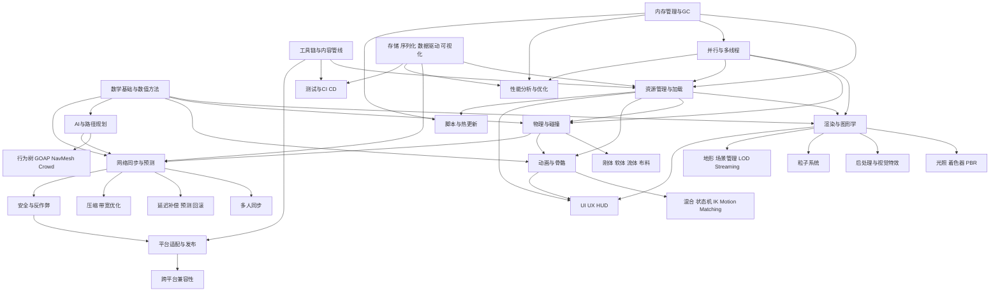

# 游戏开发技术原理全景报告

## 执行摘要

本报告把“游戏开发”拆解为三条主线：其一是**实时表现与世界建模**，包括图形学、光照与材质、后处理、粒子、地形、场景管理与流式加载；其二是**仿真与交互**，包括物理、碰撞、动画、音频、输入、UI 以及支撑这些系统的数学与数值方法；其三是**联网与工程化运行时**，包括多人同步、延迟补偿、带宽优化、资源与内存管理、脚本与热更新、并行任务系统、测试、CI/CD、安全、跨平台兼容与发布。现代游戏并不是这些模块的简单堆叠，而是一个围绕“固定时序、数据布局、异步资源、平台约束、可测量性能”组织起来的综合系统。citeturn18search0turn5search1turn1search0turn2search1turn8search0turn11search0

从理论上看，游戏技术的共同底层是三组方法：**离散化**（把连续世界变成采样与状态更新）、**近似**（用 BVH、LOD、插值、压缩、预测、采样等方法在有限算力内求“足够好”的结果）、**反馈控制**（通过 profiler、telemetry、自动化测试和发布管线把复杂系统维持在稳定预算内）。实时渲染依赖光传输近似与空间数据结构，物理与动画依赖约束求解与数值积分，网络依赖一致性模型与时序修正，工程系统则依赖数据驱动、任务调度、内存局部性和跨平台抽象。citeturn18search1turn18search2turn17search0turn17search12turn19search0turn9search8turn13search1

工程上最容易被低估的并不是某个“单点算法”，而是**系统边界**：渲染并不只关心 shader，也强依赖资源格式、压缩、Streaming 与 GPU/CPU 并行；网络并不只关心 Socket，也强依赖状态结构、可回放 determinism、带宽预算和反作弊；动画并不只关心骨骼，也强依赖状态机、混合、IK、碰撞反馈和网络复制。因而，理解游戏开发技术原理的最好方式，不是按“工具名称”学习，而是按“状态如何表示、如何更新、如何同步、如何呈现、如何测量”学习。citeturn3search0turn3search1turn19search0turn2search3turn7search14turn7search9turn9search3turn11search18

## 目录

- 总体技术体系
- 核心技术矩阵
- 常见实现方案对比
- 横向工程方法
- 进一步学习路径
- 结论

## 总体技术体系

下面这张关系图把各技术域之间最关键的依赖关系串起来。它刻意把“引擎”放在中间淡化，因为用户关心的重点不是某个引擎本体，而是**构成游戏开发的技术原理**：状态、数据、调度、同步与呈现如何互相耦合。图中的依赖关系，和 Khronos 的 glTF/KTX 运行时资产链路、 DirectStorage 异步 I/O、PBR/BSDF 渲染链、PBD/XPBD 物理约束求解、Recast/Detour 导航、Valve/ GGPO 的网络时序模型以及现代 profiling/CI 工具链的工作方式一致。citeturn3search0turn3search1turn18search0turn17search12turn2search0turn2search3turn9search3turn11search0

## 核心技术矩阵

下表按“领域—原理—算法—实现—替代—瓶颈—资源”的格式，把题目要求的各技术域系统化。为了控制篇幅，每个格子都只保留**最影响设计决策**的内容；如果你把它当成学习地图，列与列之间其实就是“理论—算法—工程—对比—测量—资料”的完整闭环。表内复杂度以常见近似记法表述，实际常数项高度依赖数据布局、SIMD、缓存与平台 API。citeturn18search1turn17search0turn9search8turn13search7

| 领域 | 核心原理与理论基础 | 常用算法与数据结构 | 典型实现要点与工程实践 | 常见替代方案与优劣 | 关键瓶颈与测量方法 | 推荐资源与权威参考 |
|---|---|---|---|---|---|---|
| 渲染与图形学 | 本质是把几何、材质、光源与相机离散化为可采样的像素估计；实时图形多依赖光栅化，离线/混合方案更多依赖路径追踪与蒙特卡洛积分。citeturn18search0turn18search2 | 视锥裁剪 O(n) 或层次结构 O(log n + k)；BVH 遍历平均近似 O(log n)；纹理过滤依赖 mipmap/各向异性采样。citeturn18search1turn18search3 | 关键步骤：`Cull -> Build visible list -> Draw/Dispatch -> Postprocess`；工程上要分清 CPU 生成命令、GPU 执行、资源状态转换与帧间同步。citeturn9search2turn11search18 | 光栅化延迟低、三角形吞吐高；路径追踪统一阴影/反射/全局光照，但噪声与采样成本高；混合光追常用于反射/阴影的局部增强。citeturn18search0turn5search3 | 主要瓶颈是 overdraw、带宽、draw call、shader divergence、状态切换；用 RenderDoc/PIX/GPU captures/AGI 做帧级分析。citeturn11search18turn9search3turn20search3 | PBRT 4e；RenderDoc；PIX。citeturn18search0turn11search18turn9search21 |
| 光照与着色器原理 | 实时光照通常以 BRDF/BSDF 近似材质散射；PBR 强调能量守恒、Fresnel、法线分布与几何遮蔽项。citeturn5search2turn18search0 | Disney BRDF；Cook-Torrance 类微表面模型；IBL 预积分查表；阴影映射典型为 O(lights × visible casters)。citeturn5search2turn18search3 | 关键步骤：`GBuffer/Material params -> Evaluate BRDF -> Accumulate direct + indirect`；shader 中常把法线、粗糙度、金属度压缩存储。citeturn5search2turn3search14 | Blinn-Phong 成本低但物理一致性差；PBR 统一资产表达但更依赖贴图与 precompute；混合光追提高真实感但引入噪声管理。citeturn5search2turn18search0 | 瓶颈多在光源数量、阴影贴图更新、BRDF texture fetch；应测 GPU 时间、L2 缓存命中、寄存器压力。citeturn9search3turn20search2 | Disney PBR 课程；PBRT。中文入门可配合 GAMES101。citeturn5search2turn18search0turn15search4 |
| 渲染外的视觉特效 | 后处理把屏幕空间结果再加工为 bloom、DOF、TAA、SSR、色调映射、景深、运动模糊等效果，本质是屏幕域滤波与重建。citeturn5search19turn18search3 | 双边滤波、历史重投影、mipmap 金字塔、屏幕空间射线步进；复杂度通常与像素数成正比 O(pixels)。citeturn18search3turn5search19 | 关键步骤：`Render HDR -> Build pyramids/history -> Post passes -> Tone map/UI composite`。citeturn5search19turn9search3 | 屏幕空间效果便宜但视野外信息缺失；几何/光追解法更稳健但成本高。citeturn5search19turn18search0 | 瓶颈是全屏 pass 链长度、history 带宽与 cache；用 PIX/RenderDoc 看 pass 时间、带宽与 UAV 依赖。citeturn9search3turn11search18 | GPU Gems；PIX；RenderDoc。citeturn5search19turn9search21turn11search18 |
| 粒子系统 | 粒子是大量简化对象的并行仿真与绘制系统，常用来近似烟雾、火花、魔法、天气。citeturn5search3turn17search23 | SoA 粒子池；spawn/update/kill；排序 O(n log n)；GPU 粒子常用 append/consume buffer。citeturn5search3turn9search2 | 伪代码：`emit(); integrate(dt); collide(optional); sort_if_needed(); render_billboards_or_meshes();`。citeturn5search3turn17search23 | CPU 粒子调试友好；GPU 粒子规模大但读回昂贵； flipbook/sprite 成本低，mesh 粒子表现更强。citeturn5search3turn9search2 | 瓶颈在排序、透明混合、带宽；测 GPU particle pass、过绘率、活跃粒子数。citeturn9search3turn20search3 | GPU Gems 流体/粒子章节；Müller 的粒子流体论文。citeturn5search3turn17search23 |
| 地形与场景管理 | 要解决“大世界几何太大、可见性随视点变化”的问题，核心是分块、裁剪与层次表示。citeturn6search3turn14search16 | Quad/Octree、BVH、Portal、Occlusion Map、Geometry Clipmaps；查询复杂度取决于层次深度与可见集规模。citeturn6search3turn14search16turn14search3 | 关键步骤：`camera -> frustum cull -> occlusion/portal cull -> terrain patch selection -> submit visible nodes`。citeturn14search13turn6search7 | Portal/BSP 适合静态室内；BVH/Octree 通用；Clipmap 尤其适合大地形高度图。citeturn14search13turn6search3 | 瓶颈是可见性错误导致的过度提交、遮挡查询延迟、Streaming 抖动；测可见对象数、draw 数、裁剪命中率。citeturn14search16turn9search3 | Geometry Clipmaps；Hierarchical Occlusion Maps；GPU Gems 2。citeturn6search3turn14search16turn6search7 |
| LOD 与流式加载 | 用多分辨表达在不同距离/重要度下近似几何与纹理，并按需把数据流入内存/GPU。citeturn6search5turn3search1 | Progressive Mesh；HLOD；clipmap；mipmap；异步 I/O 队列；优先级堆 O(log n)。citeturn6search5turn6search3turn3search1 | 关键步骤：`estimate screen size -> choose LOD -> request missing chunks -> decompress/upload async`。citeturn3search1turn6search5 | 几何 LOD 减三角形；着色 LOD 减材质成本；流式加载降低峰值内存但增加时序复杂度。citeturn6search5turn3search15 | 瓶颈在 I/O、解压、GPU upload 和“边走边卡”；要测页面失效率、chunk miss、I/O 等待、上传带宽。citeturn3search1turn20search1 | Progressive Meshes；Geometry Clipmaps；DirectStorage。citeturn6search5turn6search3turn3search1 |
| 物理与碰撞 | 刚体物理由牛顿运动、接触约束和数值积分组成；碰撞检测分 broad phase 与 narrow phase。citeturn1search0turn1search12turn1search5 | Broad phase：SAP、网格、空间哈希、BVH；Narrow phase：SAT、GJK、EPA；求解器常见 sequential impulse。citeturn0search10turn1search0turn1search4 | 伪代码：`integrate forces -> broadphase -> narrowphase -> build contacts -> solve impulses/constraints -> integrate pose`。citeturn1search0turn1search4 | 精确凸体检测鲁棒但贵；代理碰撞体快；CCD 能防穿透但更耗时。citeturn1search12turn0search10 | 瓶颈在接触点数、岛划分、CCD、cache miss；应测 contact 数、solver iteration、physics thread time。citeturn1search12turn9search3 | GJK 原始论文；Box2D 文档；PhysX 文档。citeturn0search10turn1search0turn1search5 |
| 物理模拟高级主题 | 布料、软体、流体通常比刚体更依赖近似与稳定性而非物理精确性。citeturn17search10turn17search23turn8search2 | Mass-spring；SPH/PBF；Stable Fluids；PBD/XPBD；隐式积分适合刚性/高刚度问题。citeturn17search10turn17search3turn8search2turn17search12 | 实现要点：布料多用约束迭代防拉伸；流体多先求密度/不可压缩条件再修正位置/速度。citeturn17search3turn17search10 | PBD/XPBD 稳定、易控，适合游戏；基于 PDE 的高精度法真实但重。citeturn17search0turn17search12turn8search2 | 瓶颈在邻域搜索、迭代次数与自碰撞；要测子步数、每步约束迭代、粒子邻居数。citeturn17search3turn17search17 | Stable Fluids；Position Based Dynamics；XPBD；Position Based Fluids。citeturn8search2turn17search0turn17search12turn17search3 |
| 动画与骨骼 | 骨骼动画把局部关节变换沿层级传播，再用 skinning 把骨骼姿态映射到网格。citeturn7search15turn1search7 | LBS、DQS；层级矩阵传播 O(joints)；顶点 skinning O(vertices × influences)。citeturn1search7turn1search3 | 伪代码：`sample clips -> local pose -> hierarchical solve -> skin mesh`；GPU skinning 常把骨矩阵/双四元数放常量缓冲。citeturn1search7turn7search15 | LBS 快但有 candy-wrapper 伪影；DQS 更自然但会有鼓包，常混合使用。citeturn1search7turn1search11 | 瓶颈在动画评估、蒙皮带宽、cache locality；测动画线程时间、骨骼数、顶点影响数。citeturn7search15turn9search3 | Kavan 双四元数论文；实时骨骼动画 thesis。citeturn1search7turn7search15 |
| 动画混合与 IK | 游戏角色动画要在离散状态与连续控制间平滑过渡，IK 用于把脚、手、视线约束到目标。citeturn7search14turn7search9 | Blend Tree O(clips)；状态机；FABRIK、CCD、Jacobian IK；Motion Matching 依赖高维特征检索。citeturn7search14turn7search9turn7search21 | 关键步骤：`select state -> blend weights -> solve IK -> foot lock/warp -> output final pose`。citeturn7search14turn7search9 | Blend Tree 易控、可调；Motion Matching 动作质量高但数据/内存大；FABRIK 简洁收敛快。citeturn7search14turn7search9turn7search7 | 瓶颈在数据库检索、IK 迭代、root motion 修正；测 pose eval、IK iterations、cache hit。citeturn7search21turn9search3 | FABRIK；Unity Blend Tree；Motion Matching 资料。citeturn7search9turn7search14turn7search7 |
| AI 与行为树/路径规划 | 游戏 AI 常把“高层决策”和“低层导航/避障”分离：行为树解决反应式控制，图搜索与导航网格解决空间移动。citeturn0search3turn0search1turn2search0 | FSM、BT、GOAP；A* 平均依赖启发式质量，最坏可近 O(E)；NavMesh 查询；RVO/ORCA 做局部避障。citeturn0search1turn0search3turn14search12 | 伪代码：`BT.tick(); if needMove: path=A*(navmesh); velocity=ORCA(path, neighbors)`。citeturn0search3turn2search0turn14search1 | FSM 简单但扩展性差；BT 模块化、可复用；GOAP 更灵活但规划成本更高。citeturn0search3turn14search14 | 瓶颈在大量 agent 的路径重规划、邻域查询、群体避障；测 AI tick、path query 次数与 crowd 邻居数。citeturn14search12turn2search13 | A* 原始论文；Behavior Trees 书；Recast/Detour；ORCA/RVO。citeturn0search1turn0search3turn2search0turn14search1 |
| 网络与多人同步 | 核心问题是“多端状态是否一致、何时一致、由谁说了算”；不同品类在一致性、延迟、带宽之间的权衡完全不同。citeturn19search0turn2search1turn2search3 | Lockstep、State Sync、Snapshot Interpolation、Server Authoritative、Rollback；interest management 常用空间分区/BVH。citeturn19search0turn2search2turn2search3 | 实现步骤：`collect input -> sequence/ack -> simulate authoritative -> replicate delta -> client interpolate/reconcile`。citeturn2search1turn2search2 | RTS 常用 lockstep；FPS 常用 server authoritative + client prediction；格斗常用 rollback。citeturn19search0turn2search1turn2search3 | 瓶颈在带宽、丢包、抖动、重模拟 CPU 成本；用 Wireshark 与游戏内网络图同时定位。citeturn20search12turn2search2 | AoE “1500 Archers”；Valve Source Networking；GGPO。citeturn19search0turn2search2turn2search3 |
| 网络延迟补偿与预测 | 目标不是消除延迟，而是**掩蔽感知延迟**：本地先预测，服务端回滚或校正，射击类还会做历史命中判定。citeturn2search1turn2search2turn2search3 | 输入序号、历史状态环形缓冲、重演 O(frames × affected objects)；视图插值通常 O(entities)。citeturn2search1turn2search2 | 伪代码：`applyInputLocal(); send(seq); if correction: restore(ackState); replay(unackedInputs);`。citeturn2search1turn2search3 | 客户端预测响应快但会抖；纯服务端插值稳定但手感迟；rollback 最适合输入少、状态可重演的游戏。citeturn2search1turn2search3 | 瓶颈是校正频率、回滚成本、射击判定公平性；测 RTT、抖动、校正次数、回滚帧数。citeturn2search1turn20search12 | Bernier 文章；Source Multiplayer Networking；GGPO。citeturn2search1turn2search2turn2search3 |
| 压缩与带宽优化 | 网络与资源压缩本质是“减少熵、减少重复、减少精度”；常配合 delta、quantization、字典压缩。citeturn3search3turn12search0turn12search1 | Bit-packing；delta encoding；Protobuf varint；LZ4、Zstd、字典压缩；网格压缩用 Draco。citeturn3search3turn12search0turn12search1turn12search3 | 关键步骤：`quantize -> delta vs baseline -> entropy/general compression -> packet/frame budget check`。citeturn3search3turn12search1 | LZ4 解压极快；Zstd 压缩率高且可做字典；Draco 适合几何传输但有 CPU decode 成本。citeturn12search4turn12search1turn12search3 | 瓶颈在小包头部开销、压缩 CPU、预测误差导致 delta 失效；测 bytes/s、压缩比、解压时间。citeturn12search1turn12search4 | Protobuf Encoding；LZ4；Zstd；Draco。citeturn3search3turn12search4turn12search1turn12search3 |
| 音频处理 | 实时音频是对事件、混音总线、DSP 图和空间传播的实时计算；设计重点是低延迟与稳定 buffer。citeturn4search17turn4search13turn4search12 | DSP graph；FFT/IIR/FIR；voice virtualization；混音 O(active voices)；空间音频依赖 HRTF/房间-门洞传播模型。citeturn4search17turn4search0turn4search12 | 实现流程：`events -> voices -> DSP chain -> buses -> spatialization -> output`；常把设计数据与运行时 API 分层。citeturn4search13turn4search21 | 原生 API 最轻；中间件如 Wwise/FMOMD 工具完善、Profiler 强；代价是接入与授权成本。citeturn4search13turn4search0turn4search1 | 瓶颈在 voice 数、卷积/空间化、缓冲 underrun；用 FMOD Profiler/Wwise Profiler 看 DSP graph、CPU、内存。citeturn4search21turn4search12 | FMOD Studio/Core API；Wwise Spatial Audio。citeturn4search13turn4search17turn4search12 |
| 输入与控制 | 输入系统的重点是统一抽象、低延迟采样、设备差异屏蔽与动作映射。citeturn4search2turn4search6 | 事件队列、轮询、动作映射表、死区过滤、去抖、采样时间戳；复杂度通常 O(devices + events)。citeturn4search2turn4search18 | 关键步骤：`poll/raw events -> normalize -> map to actions -> enqueue for fixed tick`。citeturn4search2turn4search6 | XInput 简洁但能力窄；GameInput 统一设备、性能更优；DirectInput 覆盖旧设备但模型老。citeturn4search2turn4search14turn4search18 | 瓶颈主要不是 CPU，而是采样时序、输入抖动和不同平台映射不一致；要测输入到动作生效的 end-to-end latency。citeturn4search2turn20search1 | Microsoft GameInput/XInput 官方文档。citeturn4search2turn4search6 |
| UI/UX 与 HUD | 游戏 UI 既是渲染问题，也是信息设计问题；技术上要兼顾布局、输入焦点、分辨率适配和可访问性。citeturn4search7turn4search23 | Retained/Immediate UI；约束布局；九宫格；事件冒泡；复杂度与节点树规模相关。citeturn4search7 | 实现建议：世界空间 UI 与屏幕 UI 分离，HUD 高频元素单独预算；无障碍按“可感知、可操作、可理解、健壮”检查。citeturn4search3turn4search7 | Immediate 模式调试快；Retained 模式更适合复杂层级与动画。citeturn4search7 | 瓶颈在过度布局重算、字体/图集切换、动画与脚本频繁分配；测 UI draw call、布局时间、输入路径。citeturn9search3turn13search0 | WCAG 2.2/2.1；平台 HIG 与商店审核设计条目。citeturn4search7turn10search2 |
| 资源管理与加载 | 把磁盘/网络资产转为运行时 handle、引用、GPU 资源与生命周期管理，目标是高吞吐、低峰值、不中断主线程。citeturn3search0turn3search1 | Handle 表、引用计数、LRU 缓存、依赖图、异步队列；优先级队列 O(log n)。citeturn3search1turn13search7 | 伪代码：`request(asset)->resolve deps->async read->decompress->create GPU resource->publish handle`。citeturn3search1turn3search15 | 直接同步加载简单但卡帧；异步流式复杂但可控；引用计数即时释放，mark-sweep 更适合托管对象。citeturn3search1turn13search1 | 瓶颈是 I/O、解压、GPU upload、生命周期抖动；测 asset miss、stall、upload 带宽。citeturn3search1turn20search1 | glTF/KTX；DirectStorage。citeturn3search0turn3search8turn3search1 |
| 脚本与热更新 | 目标是把高频变化逻辑从本地代码中抽离，并尽量缩短编译—验证闭环。citeturn16search0turn16search1turn16search8 | 嵌入式 VM、字节码、反射绑定、沙箱；热替换常依赖函数/对象重实例化。citeturn16search0turn16search1turn16search8 | 关键步骤：`bind native API -> load script/module -> state handoff -> patch symbols/instances safely`；热更要特别处理析构、对象引用与 ABI。citeturn16search1turn16search8 | Lua 轻量、嵌入简单； Wasm 适合沙箱与跨平台；原生 Live Coding 快，但对象生命周期风险大。citeturn16search0turn16search2turn16search8 | 瓶颈在绑定层开销、GC/脚本分配、热更状态迁移；测 VM 时间、alloc、patch 成功率。citeturn16search0turn13search0 | Lua 5.4 Manual；Programming in Lua；WebAssembly；Live Coding 文档。citeturn16search0turn16search1turn16search2turn16search8 |
| 工具链与内容管线 | 内容管线是 DCC 资产到运行时包体的转换链，决定了团队吞吐与迭代速度。citeturn3search14turn3search0 | Import graph、增量构建、hash、artifact cache、schema 校验。citeturn11search0turn11search24 | 关键步骤：`artist source -> import -> validate -> convert/compress -> package -> test publish`。citeturn3search0turn11search0 | 即时导入灵活但不稳定；离线烘焙成本高但可重复；统一开放格式便于协作。citeturn3search14turn3search0 | 瓶颈是导入器稳定性、包构建时长、素材不一致；测增量构建命中率、失败率、平均构建时间。citeturn11search0turn11search1 | glTF 2.0；KTX 2.0；GitHub Actions / CTest。citeturn3search14turn3search8turn11search0turn11search1 |
| 性能分析与优化 | 原则不是“先优化”，而是**先测量，再定位，再验证回归**。CPU/GPU/内存/I/O/网络要分别建预算。citeturn9search3turn11search18turn20search1 | Sampling、Instrumentation、trace、heap profiling、frame capture。citeturn11search3turn20search5turn9search3 | 实践上应建立 `frame time = CPU main + render thread + GPU + stalls` 的统一看板。citeturn9search3turn20search2 | 采样 profiler 开销低；插桩 profiler 精细；trace 能跨线程跨进程看因果。citeturn11search3turn20search1 | 关键是避免凭直觉优化；用 PIX、RenderDoc、Tracy、Perfetto、GPUView、AGI 按问题类型分工。citeturn9search3turn11search18turn11search3turn20search1turn20search2turn20search3 | PIX；RenderDoc；Tracy；Perfetto；GPUView；AGI。citeturn9search21turn11search18turn11search3turn20search5turn20search2turn20search3 |
| 并行与多线程 | 游戏并行的重点是**任务分解、依赖管理与内存可见性**，而不是简单“多开几个线程”。citeturn9search0turn9search8turn9search1 | Job System、Work Stealing、Lock-free Queue、双缓冲、原子与 memory order；复杂度取决于任务粒度与争用。citeturn9search8turn9search1 | 建议模式：主线程只做 orchestration，工作线程做可分块任务；渲染命令可多线程录制但需分配独立 command pool。citeturn9search2turn9search14 | 粗线程模型易写但扩展差；job system 可伸缩但调试难；锁多则稳定但争用大。citeturn9search8turn9search4 | 瓶颈是锁竞争、假共享、任务过细、NUMA/cache miss；测 context switch、lock wait、worker idle。citeturn11search3turn20search1 | oneTBB 调度器文档；Vulkan 多线程录制示例；原子内存序参考。citeturn9search8turn9search2turn9search1 |
| 存储与序列化 | 目标是以稳定 schema 表达存档、配置、网络包和工具数据；关键权衡是可读性、向后兼容、访问成本。citeturn3search3turn3search2turn12search2 | JSON、Protobuf、FlatBuffers、Cap’n Proto；编码复杂度多为线性 O(n)。citeturn3search13turn3search2turn12search18 | 工程建议：人写配置用文本，频繁传输与运行时大对象用二进制；版本字段与 migration 逻辑要前置设计。citeturn3search7turn3search3 | JSON 易调试但大且慢； Protobuf 成熟； FlatBuffers/Cap’n Proto 读侧更快、拷贝少，但 schema 约束更强。citeturn3search13turn3search2turn12search2 | 瓶颈在解析、内存分配和版本兼容；测 encode/decode 时间、包体、cache miss。citeturn3search3turn13search7 | Protobuf；FlatBuffers；Cap’n Proto。citeturn3search13turn3search2turn12search2 |
| 安全与反作弊 | 核心原则是把“可获利的真相”尽量放在服务端，并通过完整性、行为检测和隔离策略提高作弊成本。citeturn10search9turn10search4turn10search1 | Server authoritative、签名/校验、内存完整性检测、行为判别、secure server 标志。citeturn10search1turn10search4 | 实践要点：客户端尽量只提交输入；命中、经济、掉落、匹配结果等由服务端裁定；反作弊独立 telemetry 管线。citeturn10search1turn10search9 | 内核级方案检测强但隐私/兼容压力大；纯服务端更稳妥但对 wallhack 等客户端信息泄漏防御不足。citeturn10search0turn10search4 | 瓶颈是误报、性能开销与兼容性；要测封禁准确率、误伤率、secure/insecure 流量分布。citeturn10search1turn10search0 | Steam VAC/EOS Anti-Cheat/EAC 官方文档。citeturn10search1turn10search4turn10search0 |
| 平台适配与发布 | 发布不是最后一步，而是平台能力、功耗模式、商店规则、包体限制与审核要求的持续适配。citeturn10search2turn10search14turn10search3 | Feature query、capability matrix、打包配置、商店元数据校验。citeturn10search2turn10search7 | 建议把平台代码层分为 `platform abstraction / platform feature / platform services` 三层。citeturn10search3turn10search14 | 一套代码多平台收益高但要接受能力下限；深度平台优化收益大但维护成本高。citeturn10search3turn10search2 | 瓶颈在审核返工、性能模式不稳、打包配置碎片化；测 crash-free、功耗模式、审核驳回原因。citeturn10search2turn10search7 | Apple App Review；Android Game Mode。citeturn10search2turn10search7 |
| 测试与 CI/CD | 游戏测试要覆盖逻辑、渲染、网络回放、资源完整性、性能回归与多平台构建。citeturn11search0turn11search1 | 单测、集成测、回放测试、截图比对、性能基准；CI 采用 DAG 工作流。citeturn11search24turn11search1 | 实践：每次提交跑 `build + unit + asset validation + smoke + perf sanity`；夜构再跑长时 soak 与多机网络用例。citeturn11search0turn11search1 | 只做人工测试短期快但不可扩展；自动化前期成本高，长期收益极大。citeturn11search0turn11search29 | 瓶颈在环境不稳定、测试过慢、假阳性；测 pipeline 时长、flake rate、回归漏检率。citeturn11search0turn11search1 | GitHub Actions；CTest/CDash。citeturn11search0turn11search1turn11search29 |
| 数据驱动与可视化 | 数据驱动意味着“内容和规则尽量放在可配置数据里”，可视化则把运行时指标反馈回设计与程序。citeturn8search0turn11search3turn20search5 | 表驱动、反射、JSON/Proto schema、遥测事件、trace SQL。citeturn3search13turn20search13 | 实践：配置表与代码解耦；关键系统可回放、可记录、可查询。citeturn20search5turn11search3 | 纯代码规则效率高但迭代慢；数据驱动灵活但需 schema 与校验体系。citeturn8search0turn11search0 | 瓶颈在 schema 漂移和数据质量；测事件丢失率、配置校验失败率、trace 查询延迟。citeturn20search13turn11search1 | Data-Oriented Design；Perfetto；Protobuf。citeturn8search0turn20search5turn3search13 |
| 数学基础与数值方法 | 线代、概率、插值、优化与数值稳定性是几乎所有游戏技术的共同语言。citeturn18search2turn17search0turn0search1 | 向量/矩阵/四元数；线性插值/样条；显式/半隐式/隐式积分；牛顿迭代；约束 Gauss-Seidel。citeturn17search0turn17search12turn1search7 | 工程重点：统一坐标系、单位、时间步；固定步长仿真，渲染插值展示。citeturn1search12turn19search0 | 高精度双精度更稳但吞吐低；大多数实时系统依然以单精度 + 坐标重定基为主。citeturn13search7turn9search3 | 瓶颈常表现为 NaN、抖动、能量爆炸；测 assert、数值范围、误差累积。citeturn17search12turn13search16 | PBRT；GAMES101；A*；PBD/XPBD。citeturn18search0turn15search4turn0search1turn17search12 |
| 内存管理 | 重点不只是“省内存”，更是**控制分配时机、碎片、局部性与生命周期**。citeturn13search7turn13search10 | Arena/Bump、Pool、Slab、RefCount、自由链表；通用分配器如 mimalloc/jemalloc。citeturn13search10turn13search7 | 实践：短命对象走 arena，固定大小对象走 pool，大块资源独立 page/heap；记录 callsite。citeturn13search6turn13search3 | 通用分配器接入快；专用 allocator 可控性更强；代价是维护复杂度。citeturn13search10turn13search7 | 瓶颈在碎片、锁竞争、跨线程释放；测 peak/committed、fragmentation、alloc hotspot。citeturn13search6turn13search3 | mimalloc；jemalloc。citeturn13search10turn13search7 |
| 垃圾回收影响 | 托管运行时能提升开发效率，但 GC 会把 allocation pattern 直接暴露成帧时间尖峰。citeturn13search0turn13search19turn13search1 | 分代 GC、根扫描、压缩/非压缩堆；复杂度取决于 live set 而不是只看新分配速率。citeturn13search1turn13search16 | 实践：避免每帧临时分配、装箱、闭包、字符串拼接；高频路径对象池化。citeturn13search0turn13search19 | 自动 GC 开发快；手动内存可控但出错风险高；很多游戏采用混合方式。citeturn13search0turn13search1 | 瓶颈体现在 stop-the-world、heap 扩容和缓存污染；用 GC timeline + allocation profiler 做定位。citeturn13search16turn13search0 | Unity GC best practices；.NET GC fundamentals/performance。citeturn13search0turn13search1turn13search16 |
| 跨平台兼容性 | 真正困难的不是“能编过”，而是图形 API、线程模型、文件系统、输入、音频、功耗和审核规则同时兼容。citeturn10search2turn10search3turn16search2 | Capability bitmap、适配层、feature fallback、shader permutation 管理。citeturn10search3turn9search2 | 实践：平台无关层只暴露最小公共接口；平台差异功能走扩展能力查询与 graceful degradation。citeturn10search3turn16search2 | 强抽象可维护；过度抽象会丢平台特性；经验上应“公共层薄、特性层厚”。citeturn10search3turn4search2 | 瓶颈在 shader 兼容、字节序/路径差异、设备碎片；测平台覆盖率、feature fallback 命中、崩溃分布。citeturn20search3turn10search7 | Android Game Mode/AGI；Apple 审核与平台文档；WebAssembly。citeturn10search7turn20search3turn10search2turn16search2 |

## 常见实现方案对比

下面几张对比表把业界最常见、最容易被混淆的实现路线横向摆在一起。它们不是“谁绝对最好”，而是“在什么约束下谁更合适”。实际项目通常会采用混合结构，例如“延迟主渲染 + 前向透明 + 局部光追反射”，或“服务端权威 + 客户端预测 + 快照插值 + 局部回滚”。citeturn5search1turn2search1turn2search3

| 方案类别 | 典型方案 | 优点 | 缺点 | 适用游戏 |
|---|---|---|---|---|
| 渲染管线 | 前向渲染 | MSAA 友好、透明物体简单、带宽压力较低 | 多光源成本高，光照与材质重复计算 | 手游、VR、风格化项目 |
| 渲染管线 | 延迟渲染 | 多光源高效，材质与光照分离 | G-Buffer 占带宽与内存，透明困难 | 中大型 3D 场景、夜景、多动态灯 |
| 渲染管线 | Tiled/Forward+ | 在前向基础上减轻多光源成本 | 分块光列表构建复杂，平台差异大 | 透明较多、光源密集 |
| 渲染管线 | Clustered Shading | 对深度分布更稳，最坏情况优于纯 tiled | 构建 cluster 成本更高 | 大场景、多高低差空间 |
| 渲染管线 | 混合光追 | 阴影/反射/GI 质量高，扩展性强 | 噪声、去噪、BVH 构建/更新昂贵 | 高端 PC/主机 3A | 
| 依据 |  |  |  | citeturn5search1turn5search19turn18search1turn18search0 |

| 方案类别 | 典型方案 | 优点 | 缺点 | 适用游戏 |
|---|---|---|---|---|
| 网络同步 | Deterministic Lockstep | 带宽最低、回放天然、状态一致性强 | 极怕 desync、晚加入麻烦、输入延迟明显 | RTS、棋牌、策略 |
| 网络同步 | Server Authoritative State Sync | 安全性好、状态真相清晰 | 带宽高、响应慢，需预测掩蔽延迟 | MMO、沙盒、动作生存 |
| 网络同步 | Snapshot + Interpolation | 视觉平滑、实现直观 | 需要历史缓冲，命中/碰撞公平性复杂 | FPS/TPS 观测端表现 |
| 网络同步 | Client Prediction + Reconciliation | 手感好、延迟低 | 校正抖动与重演成本 | 射击、车辆、动作 |
| 网络同步 | Rollback | 输入响应最佳、格斗体验优 | 可回滚状态设计门槛高、CPU 重模拟成本高 | 格斗、平台动作、低实体数对战 |
| 依据 |  |  |  | citeturn19search0turn2search1turn2search2turn2search3 |

| 方案类别 | 典型方案 | 优点 | 缺点 | 适用游戏 |
|---|---|---|---|---|
| 物理求解 | Sequential Impulse | 接近工业标准，刚体接触实用 | 高刚度/复杂约束下迭代开销大 | 大多数实时刚体 |
| 物理求解 | PBD | 稳定、易控、适合实时编辑和玩法驱动 | 物理量解释性弱，参数不直接物理 | 角色、布料、解谜 |
| 物理求解 | XPBD | 保留 PBD 稳定性并改善刚度/顺应度表达 | 实现复杂度略高 | 布料、软体、刚体统一框架 |
| 物理求解 | Mass-Spring | 直观、开发快 | 需要小步长或隐式法保稳定 | 布料、绳索、教学原型 |
| 物理求解 | SPH/PBF/Stable Fluids | 适合液体/烟雾视觉效果 | 调参多，边界与性能复杂 | 特效流体、交互液体 |
| 依据 |  |  |  | citeturn1search4turn17search0turn17search12turn17search10turn17search23turn8search2 |

| 方案类别 | 典型方案 | 优点 | 缺点 | 适用游戏 |
|---|---|---|---|---|
| 存储/传输 | JSON | 易读易改、生态成熟 | 大、慢、分配多 | 配置、关卡脚本 |
| 存储/传输 | Protobuf | schema 稳定、体积小、跨语言强 | 需反序列化/拷贝 | 网络协议、存档 |
| 存储/传输 | FlatBuffers | 零拷贝读取快 | schema 和使用习惯更硬 | 高频只读数据 |
| 存储/传输 | Cap’n Proto | 读快、代码小 | 生态不如 Protobuf 普及 | 高频 RPC、高性能工具 |
| 存储/传输 | Draco/KTX/Basis | 针对 3D 几何/纹理传输效果好 | 需要专门 decode 流程 | 资产分发、Web/移动端 |
| 依据 |  |  |  | citeturn3search13turn3search2turn12search2turn12search3turn3search8 |

| 方案类别 | 典型方案 | 优点 | 缺点 | 适用游戏 |
|---|---|---|---|---|
| 内存策略 | 通用 malloc/new | 接入简单 | 碎片/争用不可控 | 原型、小型工具 |
| 内存策略 | Pool allocator | 固定对象高效，回收快 | 适用面有限 | 子弹、粒子、组件 |
| 内存策略 | Arena/Bump allocator | 极快，批量释放 | 生命周期需成组 | 一帧临时数据、关卡加载 |
| 内存策略 | mimalloc/jemalloc | 并发伸缩性与碎片控制较好 | 仍是通用策略，业务语义弱 | 大型 C/C++ 运行时 |
| 内存策略 | 托管堆 + GC | 开发效率高 | GC 峰值风险明显 | 工具、游戏逻辑层 |
| 依据 |  |  |  | citeturn13search10turn13search7turn13search0turn13search1 |

## 横向工程方法

如果只记住一条工程原则，我建议记住这一条：**任何技术系统都应当以“预算—测量—回归”来组织，而不是以“功能做完了”来组织。** 具体到游戏开发，可以把预算拆成五个看板：帧时间预算、内存预算、I/O 预算、网络预算、内容生产预算。现代 profiling 工具已经足够成熟：RenderDoc/PIX 负责帧与 GPU；Tracy/Perfetto/GPUView 负责跨线程、跨进程与系统级时间线；Wireshark 负责包级网络；FMOD/Wwise profiler 负责 DSP 和 voice；AGI 负责 Android GPU 路径。citeturn11search18turn9search3turn11search3turn20search5turn20search2turn20search12turn4search21turn20search3

从架构角度，最有效的高阶模式通常有四个。第一，**固定时步仿真 + 渲染插值**：把物理、网络与动画评估放在稳定 tick 上，把视觉输出做插值，减少帧率抖动对规则层的污染。第二，**数据导向布局**：减少指针追逐和虚调用，把热点数据按访问模式排布，以换取 cache 与 SIMD 友好。第三，**异步资源与任务系统**：把 I/O、解压、导入和部分渲染准备移出主线程，用 work stealing 或 job graph 维持吞吐。第四，**可回放与可追踪性**：任何多人、AI 或物理系统，只要能做输入回放、trace 与状态快照，其调试成本都会显著下降。citeturn19search0turn8search0turn9search8turn3search1turn20search1

在内存和 GC 方面，一个非常实用的经验是：**先管理生命周期，再管理 allocator**。如果对象的生命周期本身混乱，再好的分配器也只能救火。反过来，如果对象生命周期清晰，Arena、Pool、引用计数或分代 GC 都能被安排到合适的位置。对托管语言项目，最重要的不是“禁用 GC”，而是控制临时分配、对象池化、字符串和闭包模式，降低 live set 与收集频率。citeturn13search6turn13search7turn13search0turn13search16

对跨平台和发布而言，建议尽早建立**能力矩阵**而不是“平台 if-else 丛林”。图形层记录 API 能力与特性降级路径，输入/音频/存储层记录平台服务适配，发布层记录商店与审核要求。Android 的 Game Mode/AGI、Apple 的审核指南，都说明“平台行为”已经成为技术架构的一部分，而不是打包阶段的附属工作。citeturn10search7turn20search3turn10search2turn10search14

## 进一步学习路径

如果你的目标是**系统化掌握而不是零散补洞**，最稳妥的学习顺序通常是：先学数学与图形学基础，再学仿真/动画/网络，再学运行时和工程化。原因很简单：渲染、动画、物理和网络虽然看上去分属不同子领域，但都共享坐标变换、插值、优化、离散时间与误差传播这些底层方法；而运行时、内存、并行和工具链则是在你已经知道“系统为什么需要这样工作”之后，才更容易真正理解。这个顺序也是 GAMES101 强调“现代图形学全局把握”、GAMES104 强调“系统架构与核心系统原理”、以及 PBRT/Behavior Trees/A* / PBD 等原始资料之间天然的前置依赖关系。citeturn15search4turn15search14turn18search0turn0search3turn0search1turn17search0

我建议把学习拆成三个阶段。第一阶段，建立共同底层：线性代数、四元数、插值、数值积分、图搜索、采样与概率；配套学习 GAMES101、PBRT 的入门章节和 A* 原始论文。第二阶段，分专题突破：做一个小型渲染器、一个简单刚体/角色控制器、一个具备行为树与导航的 AI demo、一个能重放输入的局域网原型。第三阶段，工程化收束：加入异步资源、压缩、CI、自动化测试、性能采样、回放系统和跨平台抽象，再用 profiler 驱动重构。citeturn15search4turn18search0turn0search1turn2search0turn19search0turn11search0turn11search1

就资料选择而言，优先级可以这样排。**中文系统课**：GAMES101 适合图形学与数学建立全局视角，GAMES104 适合理解现代运行时架构；华中科技大学的图形学 MOOC 适合补 OpenGL/GLSL 与可编程渲染流程。**原始论文/官方文档**：PBRT、Disney PBR、GJK、PBD/XPBD、Stable Fluids、Recast/Detour、Valve/ GGPO、glTF/KTX、DirectStorage、Protobuf/FlatBuffers、oneTBB、PIX/RenderDoc/Tracy/Perfetto。对于游戏开发者，原始论文不是为了“记住公式”，而是为了学会每个系统到底在近似什么、舍弃什么、为什么这样取舍。citeturn15search4turn15search14turn15search1turn5search2turn0search10turn17search12turn8search2turn2search0turn2search1turn3search0turn3search1turn3search13turn9search8turn9search21turn11search18turn11search3turn20search5

## 结论

从技术原理上说，游戏开发并不是“很多系统并排放着”，而是一个围绕**状态表示、时间推进、空间组织、资源生命周期、网络一致性和性能预算**统一起来的实时计算系统。渲染在回答“世界如何被看见”，物理与动画在回答“世界如何变化”，AI 与网络在回答“世界如何决策与共享”，工具链、内存、并行、测试与发布则在回答“这一切如何稳定地长期运行”。citeturn18search0turn17search0turn0search3turn2search1turn11search0turn13search7

因此，真正“系统梳理游戏开发中所有技术原理”的关键，并不是把每个名词都背下来，而是抓住三个总问题：**数据如何表示，系统如何在固定预算内更新，结果如何被测量与验证。** 一旦这三条主线清楚，渲染管线、物理求解器、动画图、导航网格、回滚网络、资产流式加载、GC 控制、反作弊与跨平台适配，就不再是彼此割裂的知识点，而会收敛成一套可迁移、可扩展、可工程化的共同方法论。citeturn8search0turn9search3turn20search1turn19search0turn13search0turn10search9