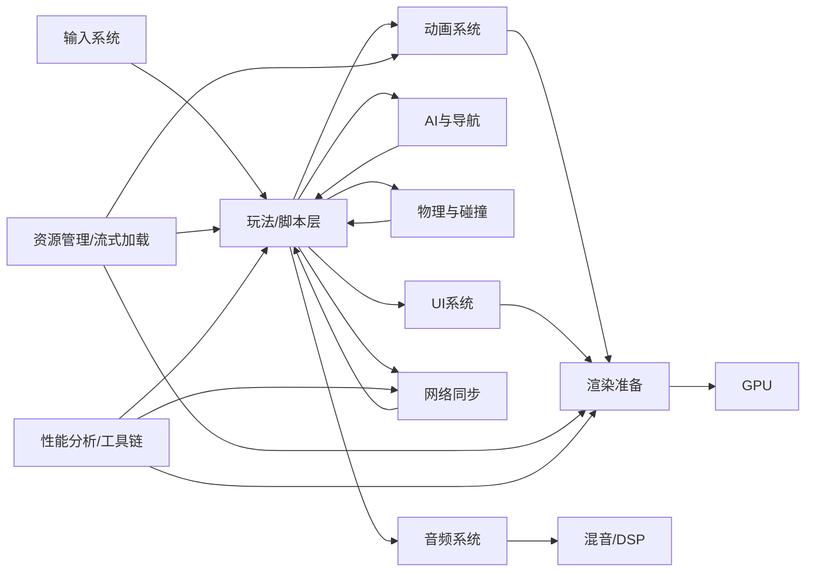
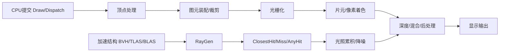
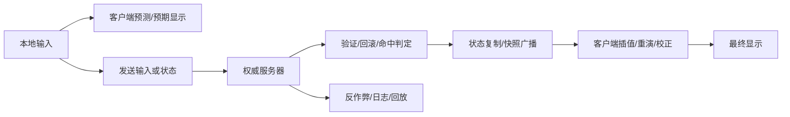

# 游戏开发技术原理全景报告

## 执行摘要

游戏开发不是单一技术，而是一个由**引擎架构、图形渲染、物理仿真、动画系统、人工智能、音频、网络同步、输入交互、资源管理、脚本系统、工程化工具链、性能剖析、平台适配、安全反作弊、数据序列化、UI、存档回放、测试自动化**共同组成的复杂系统工程。主流引擎在抽象方式上各有侧重：Unity长期以 **GameObject/Component** 为主，并向 **ECS/DOTS** 延伸；Unreal 以 **UObject/Actor + Gameplay Framework + 反射系统** 组织运行时；Godot 以 **SceneTree/Node/Resource** 组织场景与数据。三者的差异，本质上是对“对象组织、编辑器工作流、性能可扩展性、跨平台抽象”这四个目标做不同权衡。citeturn24search1turn24search3turn22search1turn24search2turn24search0turn24search4

从学习路径看，可以把游戏技术分成三层。底层是**计算机图形学、数值仿真、并发与缓存友好数据布局、网络协议与序列化**；中层是**引擎子系统**，例如渲染管线、物理、动画、资源加载、音频、UI、网络复制；上层是**工程化与产品化能力**，例如构建发布、CI/CD、性能剖析、自动化测试、安全、跨平台兼容。真正决定项目成败的，往往不是单点算法是否“先进”，而是各子系统之间是否在**数据流、时序、工具链、调试能力**上形成闭环。citeturn21search1turn21search0turn23search0turn22search3turn12search4

从实现策略看，现代项目很少“所有系统都追求最强理论最优”。例如渲染上通常在**光栅化、屏幕空间技术、离线/预计算、实时光追**之间混合；网络上通常在**权威服务器、客户端预测、插值/外推、回滚**之间按游戏类型取舍；数据层会在**编辑器友好的资源格式、运行时高效二进制格式、热更新补丁格式**之间并存；测试层也会把**编辑器单测、功能测试、性能回归、多人场景自动化**同时纳入流水线。换言之，游戏技术的核心不是“背算法清单”，而是理解每一种算法和架构的**约束边界、复杂度来源、调试抓手、工程代价**。citeturn0search8turn20search0turn20search5turn20search9turn23search3turn18search1turn18search4

本报告的主结论是：如果读者已经具备计算机科学基础，最有效的学习方式不是先“造完整引擎”，而是按**引擎基础 → 图形与表现 → 仿真与AI → 联机与平台 → 工程化与质量保障**逐步推进，并配合小型但完整的实践项目反复闭环。中文学习资源中，**GAMES101** 适合作为图形学与渲染数学基础，**GAMES104** 适合作为现代游戏引擎全景导引；随后再进入 Unity、Unreal、Godot 的官方文档与原始论文。citeturn21search0turn21search1turn21search2turn21search13turn21search4

## 技术总览与引擎基础

现代游戏运行时通常围绕一条稳定的主循环展开：**输入采样 → 脚本/玩法更新 → 动画更新 → 物理步进 → AI/导航 → 音频与网络提交 → 渲染准备 → GPU 执行 → 资源回收与统计**。Unity 在传统模式下以组件生命周期和渲染管线回调组织这条时序，并提供 DOTS/Entities 作为数据导向路径；Unreal 借助 Gameplay Framework、反射与模块体系组织玩法、网络和资源；Godot 则以 SceneTree、Node、Resource 把逻辑树、资源树和编辑器工作流统一起来。citeturn0search16turn24search3turn24search2turn24search7turn24search0turn24search10

**引擎架构**

**定义与目标。** 引擎架构的任务，是把渲染、物理、音频、输入、资源、脚本、网络、编辑器工具等子系统组织成可维护、可调试、可扩展、可跨平台的运行时。Unity 的传统抽象是 GameObject/Component，强调组合而非深继承；Unity 同时提供 Entities/ECS，强调数据导向、批处理和缓存友好；Unreal 则以 UObject/Actor、Gameplay Framework 和反射系统组织对象生命周期、序列化、复制与编辑器集成；Godot 以 Node/Scene/Resource 把“场景树”和“可序列化数据”统一起来。citeturn24search1turn24search3turn22search1turn24search2turn24search0turn24search4

**核心原理与关键算法。** 架构层没有单一“万能算法”，但有几条通用原则：其一是**主循环与固定步长/可变步长拆分**，把渲染帧率与物理步率解耦；其二是**对象图与数据流解耦**，避免玩法对象直接跨系统强耦合；其三是**系统调度与依赖管理**，由模块边界和更新顺序保证可预期性；其四是**数据导向设计**，通过线性内存、结构体数组、批处理调度降低 cache miss。Unity 明确把 ECS/Entities 定义为数据导向框架，强调控制性与可扩展性能；Unreal 的反射系统则把序列化、GC、网络复制、Blueprint 与编辑器连成一个统一元数据层。citeturn24search3turn24search8turn22search1turn22search6

**常见实现、性能与复杂度。** 传统 OOP/组件模式通常在“易编辑、易理解”上占优，但在大规模实体场景下更容易遭遇虚调用、碎片化内存、对象遍历分散等问题；ECS/DoD 则通过把同类组件按列存储，把系统更新近似变成“线性扫描 + 批处理”，因此更适合高实体数与并行化场景。可把二者粗略理解为：**传统模式的复杂度瓶颈常在对象图与引用关系；数据导向模式的复杂度瓶颈常在数据搬运、同步点与作者工具成本。** 对大多数中小型项目，混合架构往往最现实：编辑器与高层玩法用节点/对象，热点系统用 ECS/Job/Burst 或原生批处理。citeturn24search3turn24search8turn24search1turn24search2

**常见问题与调试/优化。** 典型问题包括初始化顺序混乱、资源生命周期不清晰、跨系统双向依赖、编辑器对象与运行时对象语义不一致、热重载后状态失真。调试时应优先建立三类可观测性：模块边界日志、帧内时序追踪、资源/对象生命周期可视化。架构优化通常不是“再抽象一层”，而是明确**所有权**、**依赖方向**和**数据更新频率**。citeturn22search3turn12search21turn12search2

| 常见架构风格 | 优势 | 代价 | 典型实现 |
|---|---|---|---|
| GameObject/Component | 直观、编辑器友好、组合灵活 | 热点遍历分散、引用关系复杂 | Unity 传统对象模型 citeturn24search1 |
| Actor/UObject + 反射 | 序列化、复制、编辑器、Blueprint 一体化 | 元数据和对象体系复杂，学习曲线高 | Unreal Gameplay Framework / Reflection citeturn24search2turn22search1 |
| SceneTree/Node/Resource | 场景层次和资源组织统一，轻量直观 | 大型项目需额外约束节点依赖与分层 | Godot SceneTree/Resource citeturn24search0turn24search4 |
| ECS/DoD | 缓存友好、易批处理、适合海量实体 | 编辑器工作流更难、同步点更复杂 | Unity Entities/ECS citeturn24search3turn0search12 |

**推荐资源与权威参考。** 中文全景入门建议优先看 **GAMES104**；具体引擎架构再读 Unity ECS、Unreal Gameplay Framework/Reflection、Godot SceneTree/Resource 官方文档。citeturn21search1turn24search3turn24search2turn24search0turn24search4

**场景管理与资源加载**

**定义与目标。** 该领域解决“什么时候把什么东西装进内存、何时激活、如何卸载、如何保证依赖一致和切场平滑”的问题。Unity 常用 SceneManager + Addressables；Unreal 常用 Level Streaming、World Partition、Async Asset Loading；Godot 以 PackedScene、ResourceLoader、后台线程加载为核心。citeturn9search0turn9search4turn9search6turn9search17turn9search2turn9search7

**核心原理与关键算法。** 现代资源加载本质上是**依赖图解析 + 异步 I/O + 反序列化 + 激活阶段切换**。Unity Addressables 以地址和 catalog 管理资源及其依赖，并在场景加载时内部调用 SceneManager.LoadSceneAsync；Unreal 通过软引用和异步加载在开发与 cooked 数据上保持一致流程；Godot 则直接暴露 `load_threaded_request / get_status / load_threaded_get` 这类 threaded loading API。citeturn9search0turn9search6turn9search2turn9search17

**常见实现、性能与复杂度。** 资源加载的主要成本通常不是“查表”，而是 **IO 吞吐、压缩解包、CPU 反序列化、GPU 上传、场景激活尖峰**。从算法结构上看，其总体耗时近似随**资源字节量 + 依赖节点数 + GPU 上传量**线性增长；真正让帧卡顿的往往是激活期脚本初始化、材质/着色器预热和大批对象实例化，而不是磁盘读本身。大世界项目会进一步引入空间分块、层级流式加载和可见性驱动卸载。citeturn9search4turn9search6turn9search2turn9search18

**常见问题与调试/优化。** 高频问题有：重复依赖导致内存峰值过高、对象激活瞬间产生掉帧、包体粒度过细导致 I/O 放大、资源句柄泄漏、跨场景对象归属错误。优化策略通常包括：按**访问局部性**重构包粒度、把激活拆分成多帧、把大贴图和音频改成流式、使用软引用和显式生命周期管理、预热关键 shader/PSO。citeturn9search6turn23search3turn9search2turn9search4

| 常见方案 | 适用场景 | 主要优点 | 典型实现 |
|---|---|---|---|
| 同步整包加载 | 小型关卡、原型验证 | 简单、行为可预期 | Godot 直接 `load()` / Unity 基础场景加载 citeturn9search17turn9search3 |
| 异步场景加载 | 中大型关卡切换 | 降低主线程阻塞 | Unity Addressables / SceneManager Async citeturn9search0turn9search3 |
| 关卡流式加载 | 大世界、开放场景 | 内存占用可控、切换更平滑 | Unreal Level Streaming citeturn9search4turn9search14 |
| 线程化资源加载 | 资源密集型项目 | 可显著减少等待感 | Godot ResourceLoader threaded loading citeturn9search2 |

**推荐资源与权威参考。** Unity Addressables、Unreal Async Loading / Level Streaming、Godot Background Loading 官方文档是这一领域最值得反复通读的材料。citeturn9search0turn9search6turn9search4turn9search2

**数据驱动设计与序列化**

**定义与目标。** 数据驱动设计的目标，是把“规则、数值、配置、内容模板”尽可能从硬编码逻辑中抽离出来，让设计、调参、热更新、版本演进和工具导入更可控。序列化则负责把对象状态或内容数据变成可存储、可传输、可重建的表示。Unity 有自己的序列化规则和 JsonUtility；Unreal 依赖反射/UPROPERTY 和 SaveGame；Godot 使用 Resource、Variant 二进制序列化以及文本/二进制资源格式。citeturn22search0turn15search5turn22search6turn15search16turn15search2turn15search7

**核心原理与关键算法。** 这类系统的关键不是“选 JSON 还是二进制”，而是四个设计点：**模式约束、版本兼容、引用语义、运行时访问成本**。JSON 可读但冗长；Protocol Buffers 依赖 schema，但更利于演化与网络消息；FlatBuffers 强调零拷贝读取与内存效率，最初就面向游戏等性能敏感场景。Godot 的 Resource 体系天然适合把游戏内容实体化为可编辑资源；Unreal 的反射体系让被 UPROPERTY 标记的数据天然接入序列化、复制与编辑器。citeturn15search3turn15search4turn15search9turn15search2turn22search6turn22search1

**常见实现、性能与复杂度。** 一般可把序列化成本近似看成**与已写入字段数和总字节量线性相关**；真正的风险在于引用图遍历、字符串键、动态类型判断和版本升级补丁。内容配置更看重**可读性与编辑器友好**，运行时消息或大规模资源索引更看重**二进制紧凑性与反序列化成本**。因此成熟项目常见模式是：**编辑器内用资源/文本，人机接口用 JSON，网络与存档热点路径用 Protobuf / FlatBuffers / 自定义二进制**。citeturn22search0turn15search5turn15search3turn15search9turn15search7

**常见问题与调试/优化。** 最常见的坑是 schema 演化不当、资源路径重命名导致旧存档或旧补丁失效、循环引用难以恢复、ScriptableObject/资源对象与运行时状态混淆。调试上应尽早建立**版本号、迁移脚本、默认值策略、引用稳定 ID**。任何需要跨版本长期维护的存档或网络协议，都不应只依赖“对象路径 + 反射默认行为”。citeturn15search16turn22search6turn15search3turn15search9

| 格式/机制 | 优势 | 代价 | 常见使用位置 |
|---|---|---|---|
| JSON | 可读、调试方便、生态成熟 | 体积大、解析慢、类型约束弱 | 配置、工具导入、轻量存档 citeturn15search5 |
| Protobuf | schema 明确、适合演化、网络常用 | 依赖 `.proto`，需额外生成代码 | 网络消息、中后台服务接口 citeturn15search3 |
| FlatBuffers | 零拷贝访问、内存效率高 | 编写和维护成本更高 | 高频运行时数据、资源索引 citeturn15search4turn15search9 |
| 引擎原生资源 | 编辑器工作流顺滑、与引擎生态一致 | 跨引擎/跨平台通用性较弱 | Unity/Unreal/Godot 内容资产 citeturn22search0turn22search6turn15search2 |

**推荐资源与权威参考。** 优先阅读 Unity Serialization Rules、Unreal Object Handling / SaveGame、Godot Resources / Binary Serialization API；协议层优先看 Protobuf 与 FlatBuffers 官方文档。citeturn22search0turn22search6turn15search16turn15search2turn15search7turn15search3turn15search4

**脚本与热更新**

**定义与目标。** 该领域关注两件事：一是如何让玩法逻辑拥有足够高的迭代速度，二是在不全部重发包的情况下如何修复或更新逻辑。Unity 主路径是 C#，编辑期可以通过关闭 Domain Reload 缩短进入 Play Mode 的时间；Unreal 的组合是 C++ + Blueprint，并提供 Live Coding；Godot 主要使用 GDScript 和 C#。在商业项目中，Unity 还经常引入 HybridCLR、xLua 等第三方热更新方案。citeturn10search1turn10search0turn10search12turn10search8turn10search14

**核心原理与关键算法。** 所谓“热更新”并不等于“热重载”。编辑器内的 Live Coding、脚本重编译、关闭 Domain Reload，本质上是**加快迭代反馈回路**；而线上热更新通常要求**代码装载、状态延续、版本兼容、资源与脚本协同升级**。Unity 官方文档明确说明关闭 Domain Reload 只是在进入 Play Mode 时不重置脚本域状态；Unreal 的 Live Coding 是在运行时编译并重新注入代码，但并不意味着可以随意变更所有类型结构。由此可见，线上热更必须额外处理 ABI、序列化版本、资源引用稳定性等问题。citeturn10search1turn10search0

**常见实现、性能与复杂度。** 原生 C++/C# 逻辑通常具有更强的运行时性能和工具集成，但热更门槛高；Lua 等脚本语言在“迭代速度、补丁体积、规则系统可塑性”上更有优势，但跨语言桥接会带来调用开销和调试复杂度；HybridCLR 之类方案试图在 IL2CPP/AOT 环境下补齐 C# 热更新能力。可把这类系统的成本理解为：**运行时调用性能、热更灵活性、构建复杂度、线上稳定性**四者不可兼得。citeturn10search8turn10search14turn10search0turn10search1

**常见问题与调试/优化。** 常见问题包括脚本状态残留、热更代码与资源版本错配、反射层调用过多、Lua/C# 桥接频繁导致 GC 压力、Live Coding 后对象状态异常。实践上应把**核心状态机、网络协议、存档 schema、资源键**视为稳定接口，而把热更新主要用于玩法规则、活动配置、UI 流程和可隔离的业务逻辑。citeturn10search1turn10search8turn10search14

| 路线 | 优势 | 局限 | 典型实现 |
|---|---|---|---|
| 原生脚本迭代 | 工具链最稳、调试最好 | 线上热更能力弱 | Unity C# / Godot GDScript / Unreal C++ citeturn10search12turn10search0 |
| 可视化脚本 | 非程序参与度高、调试图形化 | 大型逻辑图易膨胀 | Unreal Blueprint citeturn24search2 |
| 编辑器内热编译 | 缩短反馈回路 | 不是完整线上热更 | Unreal Live Coding / Unity 禁用 Domain Reload citeturn10search0turn10search1 |
| 第三方线上热更 | 发行后修逻辑更灵活 | 构建、兼容、测试成本高 | HybridCLR / xLua citeturn10search8turn10search14 |

**推荐资源与权威参考。** 官方优先读 Unreal Live Coding、Unity Domain Reload、Godot 脚本文档；若项目需要线上 C# 或 Lua 热更，再读 HybridCLR、xLua 的官方仓库文档。citeturn10search0turn10search1turn10search12turn10search8turn10search14

## 图形与内容表现

图形与内容表现层是玩家最直观感知到的“品质面”。但从工程角度看，它并不是单独的“美术问题”，而是**几何数据、材质系统、动画、UI、音频、资源流送与 GPU/CPU 协同**共同作用的结果。Unity 以 Built-in/URP/HDRP 区分渲染路线；Unreal 以高保真渲染生态著称，并在 UE5 中突出 Lumen、TSR 等能力；Godot 则强调开源可控与简洁的 2D/3D 管线。citeturn0search8turn21search8turn3search1

**渲染**

**定义与目标。** 渲染系统的目标，是把场景中的几何、材质、光照和相机变成可显示图像。现代实时渲染以**光栅化**为主，辅以**屏幕空间技术、预计算、体积/后处理、实时光线追踪**。D3D12、Vulkan、OpenGL 都把图形流水线描述为一系列固定功能与可编程着色阶段；DXR 和 Vulkan Ray Tracing 则把 BVH 加速结构、RayGen/Hit/Miss 着色器引入实时图形 API。citeturn0search7turn1search5turn1search1turn0search3turn1search0

**核心原理与关键算法。** 光栅化的核心是**顶点变换、裁剪、三角形栅格化、深度测试与片元着色**；光线追踪的核心是**射线生成、BVH 遍历、光线-三角形求交**，其中 Möller–Trumbore 仍是经典三角形求交方法。材质上，现代游戏已几乎全面转向 PBR，Cook-Torrance 微表面模型与 Disney 的 Principled Shading 在工业界影响极大。citeturn0search7turn1search5turn19search1turn19search0turn19search18

**常见实现、性能与复杂度。** 从算法结构上可把光栅化成本近似看成**提交的几何量 + 可见片元数 + overdraw + shader 开销**；光追成本近似取决于**射线数 × 反弹数 × BVH 遍历/求交成本 + 降噪**。平均情况下，BVH 能把求交从“接近全场景遍历”降为“层次遍历 + 少量叶节点测试”，但材质分支、阴影/反射射线数、透明与体积效果仍会迅速拉高成本。实践中，真正高效的方案通常是**混合渲染**，而不是纯粹押注单一路线。citeturn1search5turn0search3turn19search1turn19search2

**常见问题与调试/优化。** 常见问题包括 overdraw 过高、状态切换频繁、draw call 过多、shader permutation 爆炸、法线/切线空间错误、z-fighting、后处理链过长、光追着色器分支发散。调试工具上，RenderDoc、PIX、Nsight Graphics 分别覆盖图形帧捕获、CPU/GPU 时间线、着色器与资源调试。优化上要坚持“先测后改”，尤其要判定瓶颈在 CPU、GPU、带宽、VRAM 还是同步点。citeturn12search13turn12search4turn1search2turn12search5turn22search3

| 路线/技术 | 优势 | 代价 | 常见实现 |
|---|---|---|---|
| 前向渲染 | 透明友好、实现直观 | 多光源成本高 | Unity URP、移动项目常见 citeturn0search8 |
| 延迟渲染 | 多光源效率高 | G-Buffer 内存与带宽压力大，不利于透明 | Unity/Unreal 桌面项目常见 citeturn0search8turn21search13 |
| 实时光追 | 反射/阴影/GI 更统一 | 射线数、降噪、BVH 维护成本高 | DXR / Vulkan RT / UE5 路线 citeturn0search3turn1search0turn1search15 |
| PBR 着色 | 材质跨光照环境更稳定 | 需要正确贴图规范与能量守恒建模 | Cook-Torrance / Disney BRDF citeturn19search0turn19search18 |

**推荐资源与权威参考。** 中文渲染学习优先 **GAMES101**；工业实现优先读 D3D12/Vulkan 管线文档、DXR 文档、Unity Render Pipeline、Unreal 渲染文档，以及 Cook-Torrance、Disney BRDF 原始材料。citeturn21search0turn0search7turn1search5turn0search3turn0search8turn19search0turn19search18

**动画与骨骼**

**定义与目标。** 动画系统负责把离散关键帧、骨骼姿态、混合规则、根运动、IK/约束、布料/物理动画整合为满足玩法输入的连续运动。Unity 的 Mecanim 提供 Humanoid Avatar 与重定向；Unreal 具有 Animation Blueprint、Motion Matching、物理动画；Godot 提供 AnimationPlayer + AnimationTree。citeturn5search18turn5search0turn5search1turn5search9turn5search6

**核心原理与关键算法。** 角色动画的基础是**骨骼层级变换 + skinning**。工业界默认方法仍是 LBS（Linear Blend Skinning），因为它简单、GPU 友好；双四元数蒙皮可以缓解 LBS 的“糖纸效应”。高层控制上，则常见**状态机、Blend Tree、分层混合、IK、姿态缓存、Motion Matching**。Motion Matching 本质上是从动画数据库中根据当前运动上下文检索最合适的下一姿态，强调自然性和上下文匹配。citeturn5search7turn5search1turn5search9

**常见实现、性能与复杂度。** 动画系统开销可粗略看作三部分：**姿态评估成本 ~ 骨骼数 × 混合层数**，**蒙皮成本 ~ 顶点数 × 每顶点骨骼影响数**，**高级查询成本 ~ 动画数据库规模和特征维度**。因此，动画优化的关键不只是减少 clip 数，更是减少无效评估、裁剪远处角色、降低每顶点权重数、压缩关键帧和骨骼数据。ACL 之类动画压缩库之所以重要，就是因为动画不仅占内存，还会直接影响采样速度。citeturn5search4turn5search8turn5search1

**常见问题与调试/优化。** 常见问题包括足滑、转向迟钝、重定向比例失真、根运动与导航冲突、动画层切换抖动、蒙皮伪影。优化手段包括：开启骨骼 LOD、只对近景角色做完整 IK/约束、姿态缓存与推迟评估、使用压缩库降低内存足迹，并借助 Motion Matching/调试可视化权重来解释“为什么选中这一帧”。citeturn5search1turn5search9turn5search4

| 技术 | 优势 | 代价 | 典型实现 |
|---|---|---|---|
| LBS 线性混合蒙皮 | 实现简单、GPU 友好 | 容易出现体积塌陷 | 几乎所有引擎默认方案 citeturn5search7 |
| DQS 双四元数蒙皮 | 体积保持更好 | 生产流程和调试更复杂 | 高质量角色管线可选 citeturn5search7turn5search11 |
| 状态机/Blend Tree | 逻辑可控、易编辑 | 状态数膨胀后维护成本高 | Unity Mecanim / Godot AnimationTree citeturn5search18turn5search20 |
| Motion Matching | 运动真实、过渡自然 | 数据准备和调参成本高 | Unreal Motion Matching citeturn5search1turn5search9 |

**推荐资源与权威参考。** 建议优先读 Unity Animation Overview、Unreal Motion Matching、Godot AnimationTree，以及 Kavan 的双四元数蒙皮论文。citeturn5search18turn5search1turn5search6turn5search7

**音频系统**

**定义与目标。** 音频系统不仅负责播放声音，还要处理**混音、总线、DSP 效果、空间化、流式播放、音乐同步、运行时参数驱动**。Unreal 的 Audio Mixer 是跨平台音频渲染模块；Godot 以 Audio Buses 组织混音和效果链；中大型项目常用 FMOD 或 Wwise 让音频设计师直接控制自适应音频。citeturn7search0turn7search1turn7search2turn2search14turn2search9

**核心原理与关键算法。** 典型音频管线是 **事件触发 → 声源管理 → 优先级/虚拟化 → 3D 衰减/空间化 → DSP 效果链 → Bus/Submix → 输出设备**。现代游戏音频一个重要方向是**参数驱动与自适应音乐**：把游戏状态映射为 RTPC/参数，再影响混音、层混、快照、滤波与节拍同步。Unreal 的 Audio Mixer 和 Wwise/FM0D 的 profiling 能力之所以重要，是因为音频问题常常不是“听感不好”，而是**线程实时性、流式 I/O 或总线效果链超预算**。citeturn7search0turn7search3turn7search6turn7search10

**常见实现、性能与复杂度。** 音频成本通常近似随**活跃发声数 × 每个发声的 DSP 链长度**增长；流式音乐/语音还会叠加 I/O 与解码成本。优化上，最有效的方法通常不是“删效果”，而是建立**优先级、虚拟化、总线分层、语音上限、压缩与流式策略**。对移动与掌机平台，缓冲区大小和设备延迟也会直接影响交互手感。citeturn7search0turn7search1turn7search3

**常见问题与调试/优化。** 典型问题包括爆音、削波、音乐切段不齐、过多同时发声、音效被 UI/语音淹没、空间化定位错误、运行时参数无法解释。实践中必须养成“听感 + profiler 双确认”的习惯：FMOD、Wwise、Unreal 都提供运行时 profiling 或混音剖析工具。citeturn7search3turn7search6turn7search0

| 方案 | 优势 | 局限 | 典型实现 |
|---|---|---|---|
| 引擎内建混音 | 集成简单、成本低 | 高级音频工作流较弱 | Unreal Audio Mixer / Godot Audio Buses citeturn7search0turn7search1 |
| FMOD | 自适应音频和运行时调音成熟 | 需额外集成与版本管理 | FMOD Studio / Unreal 插件 citeturn2search4turn7search3 |
| Wwise | 工业界采用广、总线与分析能力强 | 学习和工程集成成本较高 | Wwise SDK / Unreal Integration citeturn7search2turn3search2turn7search6 |
| 轻量自定义 DSP 图 | 可强定制 | 维护成本高 | Unity DSPGraph 仍为 experimental 路线 citeturn7search21turn7search17 |

**推荐资源与权威参考。** 优先读 Unreal Audio Mixer、Godot Audio Buses、FMOD Profiling、Wwise Profiling 文档。citeturn7search0turn7search1turn7search3turn7search6

**UI 系统**

**定义与目标。** UI 系统负责 HUD、菜单、设置页、商店、背包、聊天、战斗反馈等交互界面，并且往往是最容易跨玩法、平台和分辨率放大的系统之一。Unity 提供 uGUI 和 UI Toolkit；Unreal 提供 UMG 与 Slate；Godot 以 Control 节点体系构建 UI；自研引擎和工具界面常用 Dear ImGui。citeturn16search5turn16search0turn16search1turn16search2turn16search17

**核心原理与关键算法。** UI 的关键区别在于**retained-mode** 与 **immediate-mode**。uGUI、UI Toolkit、UMG、Godot Control、Slate 基本都属于 retained-mode：界面树长期存在，布局和样式由系统维护；Dear ImGui 属于 immediate-mode：每帧由代码描述当前 UI。前者适合复杂产品化界面，后者适合开发工具、调试面板和快速原型。另一个关键点是**布局系统与批处理**：布局计算、文本排版、图集与材质合批，往往决定 UI 真正的性能。citeturn16search0turn16search1turn16search2turn16search17

**常见实现、性能与复杂度。** UI 成本可近似看成**布局树大小 + 文本排版数 + 材质/纹理切换 + 动画更新量**。对 retained-mode UI，问题常出在“大量节点重建/重排”；对 immediate-mode UI，问题常在可维护性与外观定制。世界空间 UI 还会叠加相机、透明、后处理和输入拾取复杂度。citeturn16search0turn16search1turn16search16

**常见问题与调试/优化。** 高频问题包括动态列表卡顿、锚点/安全区适配错误、字体与本地化造成重排、过多嵌套容器、频繁改变可见性导致重建。优化应优先做**虚拟列表、图集/字体管理、局部刷新、预计算布局、UI 与世界渲染层分离**。citeturn16search1turn16search0turn16search12

| UI 路线 | 优势 | 局限 | 典型实现 |
|---|---|---|---|
| retained-mode 游戏 UI | 可视化编辑强、利于产品化界面 | 大量重排/重建时成本高 | uGUI / UI Toolkit / UMG / Godot Control citeturn16search5turn16search0turn16search1turn16search2 |
| immediate-mode | 非常适合工具和调试 | 外观与复杂交互扩展成本高 | Dear ImGui citeturn16search17turn16search13 |
| HTML/网页式 UI 中间件 | 前端生态强、设计协作方便 | 集成和性能剖析复杂 | Coherent Gameface citeturn16search4turn16search9 |

**推荐资源与权威参考。** Unity UI Toolkit / uGUI、Unreal UMG & Slate、Godot Control 节点文档应作为主线材料；工具 UI 可补 Dear ImGui Wiki。citeturn16search0turn16search5turn16search1turn16search2turn16search3

## 仿真、智能与交互

这一组系统直接决定“玩起来像不像真的”、以及“角色是否看起来在理解世界”。物理系统解决受力、碰撞与约束；AI 解决寻路与决策；输入系统把人类动作抽象成设备无关的 Action；三者共同影响手感、反馈和可解释性。Godot 明确把物理与渲染步率区分开来；Unity、Unreal 也都提供独立的输入抽象与 AI/导航栈。citeturn0search14turn8search5turn4search2

**物理与碰撞**

**定义与目标。** 物理与碰撞系统的目标，是在可接受的预算内近似模拟刚体、角色控制、关节、布料、破坏、射线检测与触发事件。Unreal 采用 Chaos Physics；Box2D 是 2D 经典；PhysX 和 Bullet 长期是工业界重要基础库；Godot 的物理系统使用固定速率更新。citeturn0search13turn6search0turn6search6turn6search2turn0search14

**核心原理与关键算法。** 典型物理流程是：**Broad Phase → Narrow Phase → Contact Generation → Constraint Solver → Integration → CCD/事件回调**。Broad Phase 的目标是把原本接近 O(n²) 的所有体素对检测，缩减成少量候选对；Bullet 的 `btDbvtBroadphase` 明确采用动态 AABB 树；Box2D 文档则直接区分形状、碰撞系统和连续碰撞。Narrow Phase 中，GJK 是凸体距离/碰撞的经典算法；求解器层面，游戏物理常采用 Erin Catto 推广的 sequential impulses。citeturn6search12turn6search0turn6search10turn6search13turn6search4

**常见实现、性能与复杂度。** 可把物理成本粗略分为：**Broad Phase ~ 接近 O(n log n) 或 O(n + k) 的候选对维护**，**Narrow Phase ~ 与凸集特征数和候选对数相关**，**Solver ~ 约束数 × 迭代次数**。真正影响帧时间的往往不是一两个刚体，而是“高接触密度 + 复杂关节 + CCD + 大量休眠唤醒”。因此，项目里更重要的是**碰撞层过滤、睡眠管理、固定步长、角色控制器与真实刚体的边界划分**。citeturn6search12turn6search4turn6search10turn6search6

**常见问题与调试/优化。** 高频症状包括穿模、堆叠抖动、接触爆炸、角色台阶抖动、帧率越低越不稳定。常见策略是开启 CCD 处理高速体、减少无意义碰撞层、降低 Solver 迭代对远处对象的预算、把复杂网格换成凸包/代理体，并尽量把“手感型角色移动”与“完全物理受力”分层。citeturn6search10turn6search6turn0search13

| 技术/库 | 优势 | 代价 | 典型使用 |
|---|---|---|---|
| Box2D | 2D 成熟、文档好、顺序冲量经典 | 主要面向 2D | 横版/俯视 2D 游戏 citeturn6search0turn6search10 |
| Chaos Physics | 与 Unreal 深度集成，支持破坏与网络物理 | 引擎生态复杂 | Unreal 项目 citeturn0search13 |
| PhysX | 工业成熟、刚体/CCD/关节齐全 | 与引擎绑定方式因版本而异 | 商用 3D 项目/O3DE 等 citeturn6search1turn6search6 |
| Bullet | 开源、可定制、实时多物理能力强 | 调参与接口学习成本较高 | 自研/研究/VR/机器人 citeturn6search2turn6search12 |

**推荐资源与权威参考。** Box2D 文档、PhysX Rigid Body Collision、Chaos Physics 文档，以及 GJK、Sequential Impulses 原始材料最值得系统阅读。citeturn6search0turn6search6turn0search13turn6search4turn6search13

**人工智能**

**定义与目标。** 游戏 AI 的核心不是“让 NPC 会学习”这么简单，而是让角色在有限预算内完成**寻路、规避、决策、战术、感知、群体行为**，同时保持可解释、可调参与可复现。Unreal 提供 Navigation、Behavior Tree、Blackboard、EQS；Unity 提供 NavMesh 和 ML-Agents；Godot 提供 NavigationServer/NavigationAgent。citeturn4search2turn4search1turn3search4turn4search0turn3search0turn4search3

**核心原理与关键算法。** 路径规划层，A* 仍是最重要的基础算法；导航表示上，现代 3D 游戏常用 NavMesh。局部避障上，Unreal 文档明确提到 RVO 和 Detour Crowd；RVO/ORCA 的关键思想是让多智能体在速度空间中协商避让。决策层，行为树解决了 FSM 在规模增长后难维护的问题；Blackboard 把共享上下文抽离出来；EQS 则把“找掩体、找血包、找合适站位”形式化为环境查询。学习型算法方面，Unity ML-Agents 把强化学习、模仿学习等训练流程接入 Unity 环境。citeturn2search0turn4search2turn2search2turn2search6turn4search1turn3search4turn3search0

**常见实现、性能与复杂度。** A* 的实际成本取决于启发函数质量与展开节点数；在堆实现中，open set 的维护通常伴随 O(log V) 级操作，但真实项目瓶颈往往是“要算多少次路径”和“何时重算局部路径”，而不是单次堆操作本身。行为树的成本主要随**每帧 tick 的节点数**上升；RVO/群体避障随着邻域体数量上升而变重；学习型 AI 的推理成本取决于模型规模和推理频率。最实用的原则是：**全局规划低频、局部规避高频、决策只在需要时 tick、感知与查询分层缓存**。citeturn2search0turn2search2turn4search2turn3search4turn3search0

**常见问题与调试/优化。** 常见问题包括频繁重寻路、BT tick 风暴、查询黑板状态不可见、多个 NPC 同时抢点、学习型 AI 缺乏可解释性。解决这类问题，必须建立导航调试可视化、行为树可视化、环境查询可视化和决策日志。对于大量 NPC，通常应采用“**远处粗模拟，近处精决策**”的层级 AI。citeturn4search1turn3search4turn4search3

| 路线/算法 | 优势 | 代价 | 典型实现 |
|---|---|---|---|
| A* + NavMesh | 可解释、工程成熟 | 动态环境频繁重算代价高 | Unity NavMesh / Unreal Navigation / Godot NavigationServer citeturn4search0turn4search2turn4search3 |
| RVO/Detour Crowd | 群体规避自然 | 邻域密度高时开销上升 | Unreal RVO / Crowd Manager citeturn4search2turn2search2 |
| 行为树 + Blackboard | 模块化、可视化强 | 大树易 tick 过重 | Unreal Behavior Tree citeturn4search1turn2search6 |
| 学习型 AI | 可处理复杂策略 | 训练、验证、解释成本高 | Unity ML-Agents citeturn3search0turn3search5 |

**推荐资源与权威参考。** 先读 A* 原始论文、RVO 论文，再读 Unreal Navigation / Behavior Tree / EQS、Unity NavMesh / ML-Agents、Godot Navigation 文档。citeturn2search0turn2search2turn4search2turn4search1turn3search4turn4search0turn3search0turn4search3

**输入与交互**

**定义与目标。** 输入系统负责把键鼠、手柄、触摸、陀螺仪、震动反馈等设备事件抽象成**可重绑定、上下文感知、跨平台一致**的动作语义。Unity Input System、Unreal Enhanced Input、Godot InputMap 都明确走向“Action/Mappings”的抽象；Windows 手柄层则常见 XInput，跨平台底层常见 SDL Gamepad API。citeturn8search5turn8search1turn8search2turn8search4turn8search7

**核心原理与关键算法。** 最重要的原则有三条：**动作抽象**、**上下文映射**、**事件与轮询并存**。Unreal Enhanced Input 支持运行时添加/移除 Mapping Context；Unity Input System 也以设备无关抽象作为核心设计。对动作游戏，还会额外实现**输入缓冲、取消窗口、连击识别、摇杆 dead zone、触摸手势识别**。这些不一定复杂，但直接决定手感。citeturn8search1turn8search5

**常见实现、性能与复杂度。** 输入本身几乎很少是 CPU 热点，复杂度通常很低；真正的难点在于**状态机正确性**和**平台兼容矩阵**。例如聊天框、UI 焦点、手柄热插拔、平台系统键、震动反馈和本地多人设备归属，都会把“简单按键”变成复杂系统。一般来说，越早建立统一 Action 层，后续跨平台和重绑定成本越低。citeturn8search1turn8search2turn8search8turn8search7

**常见问题与调试/优化。** 高频问题包括上下文冲突、死区没调好导致漂移、UI 和游戏输入抢焦点、平台差异造成按键不一致。调试上应记录**原始设备事件、Action 解析结果、上下文切换历史、重绑定结果**，并在工具里可视化。citeturn8search1turn8search5turn8search2

| 方案 | 优势 | 局限 | 典型实现 |
|---|---|---|---|
| Action Mapping 抽象 | 跨设备、可重绑定、利于教学 | 需要前期抽象设计 | Unity Input System / Unreal Enhanced Input / Godot InputMap citeturn8search5turn8search1turn8search2 |
| XInput | Windows 手柄支持直接 | 仅覆盖部分手柄生态 | Windows/Xbox 手柄输入 citeturn8search4turn8search8 |
| SDL Gamepad | 跨平台设备兼容好 | 更接近底层，需要自建上层动作系统 | 自研/跨平台引擎 citeturn8search7 |

**推荐资源与权威参考。** 建议按“引擎 Action 层 → 平台手柄层 → 手感层规则系统”的顺序学习，资料优先官方文档。citeturn8search5turn8search1turn8search2turn8search8turn8search7

## 联机、平台与安全

联机、平台与安全是很多团队在后期才意识到难度的领域。原因在于这几块都强依赖**真实设备、真实网络、真实发行环境**，并且错误通常只有在多人、高延迟、低端机、审核环境或外挂环境里才会暴露。现代引擎都已把其中一部分内置化：Unreal 有复制、Iris 和 Replay；Unity 有 NGO；Godot 支持导航、资源与保存，但多人和安全更多依赖团队策略与第三方。citeturn20search3turn20search2turn17search0turn17search1

**网络与多人同步**

**定义与目标。** 多人同步的核心任务，是在延迟、抖动、丢包和作弊风险下，尽量让所有玩家看到**足够一致、足够及时、足够公平**的世界。常见方向包括**权威服务器、状态同步、快照插值、客户端预测、服务器延迟补偿、回滚**。Unity NGO 是高层网络库，但官方明确写出其并不支持完整的 client-side prediction 与 reconciliation，而是提供更简化的 client anticipation；Unreal 则长期以复制系统为核心，并提供 Iris 扩展更大世界与更高并发场景。citeturn20search2turn4search4turn20search3turn20search8

**核心原理与关键算法。** Valve 的延迟补偿材料和 Bernier 经典文章系统化地解释了**客户端预测、服务器回溯命中判定、网络延迟掩蔽**。Gaffer 系列则把**快照插值**和**状态同步**的工程权衡讲得非常清楚：前者强调平滑显示，后者强调快速集成但允许近似与误差。GGPO 则把**回滚**做成了完整 SDK，要求底层模拟具有很强确定性。不同同步模式适配不同游戏：MOBA/FPS 倾向权威服务器 + 预测 + 插值 + lag compensation；格斗游戏更偏回滚；RTS 更常谈 lockstep 和确定性。citeturn2search8turn20search1turn20search5turn20search0turn20search9turn17search10

**常见实现、性能与复杂度。** 带宽成本可近似理解为 **更新频率 × 单次包体大小 × 订阅客户端数**；回滚成本则近似与 **重模拟帧数 × 单帧模拟成本** 成正比。状态同步方案的优势是接入快，但随着世界状态复杂度和玩家数上升，常会被带宽与误差修正折磨；回滚对带宽友好，但把压力转移给确定性与重演成本。因此，多人同步的核心优化从来不只是“压数据”，还要做**兴趣管理、优先级复制、量化压缩、事件与状态分离、客户端显示层与权威状态层分离**。citeturn20search0turn20search5turn20search3turn3search3

**常见问题与调试/优化。** 高频问题包括 rubber banding、命中判定争议、状态回弹、物理不同步、场景切换时客户端卡死、多人对象所有权混乱。调试必须具备**网络抓包、延迟/抖动注入、预测/回滚可视化、时钟对齐、状态 hash 校验**。没有这些手段，多人问题几乎不可定位。citeturn20search1turn20search6turn17search6

| 同步模式 | 优势 | 代价 | 典型适用 |
|---|---|---|---|
| 快照插值 | 视觉平滑、对确定性要求低 | 带宽较高、延迟感更明显 | 动作/竞速/沙盒显示层 citeturn20search5 |
| 状态同步 | 接入快、易与现有引擎整合 | 近似误差多，调试成本高 | 中大型物理世界的折中方案 citeturn20search0 |
| 客户端预测 + 服务器权威 | 手感更好，FPS 常用 | 需要回放/校正，易出现回弹 | FPS/MOBA/动作对战 citeturn20search1turn20search6 |
| 回滚 | 响应快，格斗游戏效果好 | 需要高确定性和快速重演 | 格斗/小规模对战 citeturn20search9turn17search10 |

**推荐资源与权威参考。** 优先读 Bernier 延迟补偿、Valve 官方词条、Gaffer 的 Snapshot Interpolation / State Synchronization、GGPO 文档，以及 Unity NGO / Unreal Iris 官方资料。citeturn20search1turn20search6turn20search5turn20search0turn20search9turn4search4turn20search3

**平台移植与兼容性**

**定义与目标。** 平台移植不是简单“点一下导出”，而是面向不同 CPU 架构、GPU API、输入系统、文件系统、商店/主机规范、内存预算、纹理压缩格式、分辨率与安全策略做系统适配。Unity 明确支持从移动、PC 到主机和 XR 的广泛平台；Unreal 的 Packaging 文档列出了桌面、移动、主机和 XR；Godot 也以跨平台导出为主要卖点。citeturn13search0turn13search1turn13search2

**核心原理与关键算法。** 关键原则包括：**平台无关抽象层、渲染后端适配、输入层适配、资源压缩按平台出包、构建配置分离**。渲染层的一个典型兼容方案是 MoltenVK：它把 Vulkan 映射到 Apple 的 Metal，因此能让一部分 Vulkan 路线落到 macOS/iOS/tvOS/visionOS。另一类关键点是纹理压缩和包体布局，例如 Godot 文档就强调 Web/平台导出时 VRAM compression 设置会影响兼容性和体积。citeturn13search3turn13search8turn22search2turn22search7

**常见实现、性能与复杂度。** 移植真正消耗时间的，不是编译通过，而是**性能与行为一致性**。同一渲染效果在 DirectX、Vulkan、Metal 上可能表现不同；输入在触摸、手柄、键鼠上也需要不同交互模型；移动端与掌机的热量和电量预算会改变 shader、帧率和特效策略。可把平台化复杂度理解为**平台数 × 质量档位 × 渲染后端 × 输入模型 × 合规要求**的组合爆炸。citeturn13search1turn22search4turn13search3turn13search4

**常见问题与调试/优化。** 高频问题包括纹理格式错误、着色器交叉编译失败、分辨率/安全区问题、低端机内存峰值崩溃、手柄映射不一致、Web/移动文件系统差异。实践上，应尽量把平台差异收敛到**资源设置、输入适配层、渲染后端适配层、平台服务层**，而不是散落在玩法代码中。citeturn13search5turn13search1turn22search2

| 兼容方向 | 核心问题 | 典型方案 | 代表实现 |
|---|---|---|---|
| 渲染 API | DirectX / Vulkan / Metal 差异 | 抽象 RHI、着色器交叉编译 | Unreal/Unity 内建后端，MoltenVK 兼容层 citeturn13search3turn13search1 |
| 纹理与资源 | 压缩格式、内存峰值 | 按平台导出配置与 Build Profile | Unity Build Profiles / Godot Export Presets citeturn22search4turn22search2 |
| 输入 | 键鼠、手柄、触摸、XR 差异 | Action 层抽象 | Unity / Unreal / SDL / XInput citeturn8search5turn8search1turn8search7turn8search8 |
| 包装与分发 | 平台打包、签名、商店规范 | Packaging/Export 自动化 | Unreal Packaging / Godot Export / Unity Build Automation citeturn13search1turn23search14turn11search0 |

**推荐资源与权威参考。** 建议以 Unity Build Profiles、Unreal Packaging、Godot Export 文档为主线，再补 Khronos/MoltenVK 的兼容层材料。citeturn22search4turn13search1turn23search14turn13search3

**安全与反作弊**

**定义与目标。** 游戏安全的目标，不是“绝对无法作弊”，而是**提高攻击成本、降低破坏收益、保留证据链，并把高价值规则放在可信边界内**。Steamworks 明确提醒开发者要保护资产和内部状态；其 VAC 集成和反作弊最佳实践更强调服务端验证与封禁流程；Epic Online Services 提供 Easy Anti-Cheat；BattlEye 则走更强的内核级路线。citeturn14search1turn14search11turn14search5turn14search0turn14search9

**核心原理与关键算法。** 游戏安全的第一原则始终是**权威服务器**：生命值、位移、命中、随机性、经济与奖励结算，只要会影响公平性，就不应完全信任客户端。客户端反作弊工具只能作为补充：它们能做内存与进程扫描、篡改检测、完整性校验和设备/账号关联，但无法替代服务端规则验证。回放与审计日志则常常是反作弊闭环的核心，因为它们能让人工复核与算法风控拥有证据。citeturn14search1turn14search5turn17search0

**常见实现、性能与复杂度。** 安全开销主要不体现在“大 O”，而体现在**系统复杂度、误报成本、用户体验与合规压力**。例如更强的客户端扫描可能提高检测率，但也增加兼容性风险；过度依赖客户端保护会形成“安全错觉”。因此工程上更应优先投资于**服务端校验、协议防重放、关键路径限速、行为建模、回放审计**。citeturn14search11turn14search5turn14search2

**常见问题与调试/优化。** 常见问题包括客户端速度/坐标篡改、内存改值、脚本宏、机器人、DDoS、资源替换与本地存档篡改。对单机存档，Godot 社区讨论也直白指出：本地文件很难被真正保护；如果不是在线公平对抗，过度对抗玩家修改本地存档往往并不划算。citeturn14search3turn14search2

| 方案 | 优势 | 代价 | 典型场景 |
|---|---|---|---|
| 权威服务器校验 | 最根本、可解释性强 | 服务器成本与实现复杂度更高 | 竞技多人游戏基础设施 citeturn14search1turn14search5 |
| 平台反作弊服务 | 接入快、检测能力成熟 | 透明性与兼容性受限 | EOS EAC / Steam VAC / BattlEye citeturn14search0turn14search1turn14search9 |
| 客户端数据保护 | 可抬高门槛 | 不能防强对手，易有误报 | ACTk 等中间件路线 citeturn14search2 |
| 回放与日志审计 | 证据链完整，利于风控闭环 | 需要存储和回放基础设施 | 竞技、举报、申诉场景 citeturn17search0turn17search7 |

**推荐资源与权威参考。** Steamworks 反作弊文档、EOS Easy Anti-Cheat 接口、BattlEye 文档应优先阅读；架构层始终以服务端权威与回放审计为核心。citeturn14search11turn14search1turn14search5turn14search4

**存档与回放**

**定义与目标。** 存档解决“跨会话保留状态”，回放解决“时间上的可重建”。两者虽然都涉及序列化，但目标不同：存档偏长期持久化与版本兼容，回放偏事件重建、数据压缩、观战与审计。Unreal 的 Replay System 直接复用了复制数据流和 DemoNetDriver；Unity 常见做法是自建 JsonUtility 或二进制存档；Godot 官方文档提供系统化的 saving games 路线。citeturn17search0turn17search8turn17search1

**核心原理与关键算法。** 常见存档方案有三类：**对象快照**、**差量快照**、**命令/输入日志**。对象快照最直观，但体积大，版本迁移更麻烦；输入日志最省空间，但要求高度确定性；网络回放常常位于二者之间，记录复制流与事件流，由回放器重建场景。Unreal 的 Replay System 文档明确指出，`DemoNetDriver` 会把复制数据交给 Replay Streamer 记录，回放时再重建现场。citeturn17search0turn17search7turn17search10

**常见实现、性能与复杂度。** 存档成本通常与**已序列化状态总量**线性相关；回放成本则与**快照频率、日志密度、重演跨度**相关。若使用回滚或确定性模拟，回放系统还能和网络、反作弊、观战共享一套基础设施；但一旦项目充满浮点非确定性、第三方中间件副作用和异步资源流程，输入级回放就会非常脆弱。citeturn17search10turn17search6turn17search0

**常见问题与调试/优化。** 典型问题包括存档跨版本损坏、对象引用恢复失败、回放时资源版本不匹配、浮点误差导致逐帧偏移。解决策略包括：稳定 ID、版本迁移器、只存必要状态、把回放层与资源版本绑定、关键帧+事件日志混合存储。citeturn15search16turn17search0turn17search1

| 方案 | 优势 | 局限 | 典型实现 |
|---|---|---|---|
| 快照存档 | 实现直观 | 文件较大、迁移成本高 | Unity JsonUtility / Godot Save Games / Unreal SaveGame citeturn17search8turn17search1turn15search16 |
| 复制流回放 | 适合多人和观战 | 与网络系统耦合高 | Unreal DemoNetDriver/Replays citeturn17search0turn17search7 |
| 输入日志/确定性回放 | 体积小、可与回滚共用 | 对确定性要求极高 | GGPO 思路、部分格斗/RTS 项目 citeturn17search10turn17search6 |

**推荐资源与权威参考。** 优先读 Unreal Replay System、Godot Saving Games、Unity JsonUtility / 序列化规则文档，并把它们与前述网络同步方案一起理解。citeturn17search0turn17search1turn17search8turn22search0

## 工程化、质量与学习路线

工程化决定“这套技术能否稳定交付”。很多团队在前期只关注功能实现，后期才发现真正耗时的是**构建、打包、资源导入、自动测试、性能回归、问题复现与版本回滚**。Unity Build Automation、Unreal BuildGraph/UAT/Gauntlet、Godot 命令行导出，都表明现代游戏开发已经和标准软件工程深度融合。citeturn11search0turn23search0turn23search16turn11search2

**工具链与管线**

**定义与目标。** 工具链与管线覆盖从 DCC 资源导入，到构建、Cook、打包、签名、上传、补丁发布的全流程。Unity Build Automation 是云端 CI 方案；Unreal 的 BuildGraph 和 UAT 负责可脚本化构建；Godot 支持命令行与 `--headless` 导出，适合 CI 环境。citeturn11search0turn23search0turn23search16turn11search2

**核心原理与关键算法。** 这一层的原则是：**确定性构建、缓存复用、环境声明式配置、按平台拆分构建配置**。Unity 的 Build Profiles 就是把不同平台、开发/发布档位的构建参数显式化；Addressables 还提供内容更新工作流，用于远端内容补丁；Unreal 的 BuildGraph 则把构建流程脚本化成图结构。citeturn22search4turn23search3turn23search0turn23search5

**常见实现、性能与复杂度。** 管线开销很大程度取决于**缓存命中率、shader 编译量、资源变更粒度、平台矩阵大小**。复杂度在工程上近似是**平台数 × 构建类型 × 资源变体数 × 自动化步骤数**。因此，最重要的优化通常不是更快的 CPU，而是更高的缓存命中、更少的无关重构建、更明确的构建图和可复用工件。citeturn11search0turn23search0turn11search23

**常见问题与调试/优化。** 常见问题有环境不一致、证书/签名失败、地址化内容更新流程错误、Cook/Shader 编译时间过长、CI 机器无 GPU 导致导出失败。成熟管线通常会把“本地构建、CI 构建、发布构建”差异压缩到最小。citeturn23search3turn11search2turn23search17

| 工具/路线 | 优势 | 局限 | 典型用途 |
|---|---|---|---|
| Unity Build Automation | 云端多平台构建方便 | 云资源与流程定制受平台限制 | 多平台自动打包 citeturn11search0turn11search19 |
| Unreal BuildGraph + UAT | 可脚本化、适合大型项目 | 学习曲线较高 | Build/Cook/Package/Test 自动化 citeturn23search0turn23search16 |
| Godot CLI Export | 简洁、适合小中型 CI | 大型发行生态需自补周边 | 命令行导出与服务器构建 citeturn11search2turn23search14 |
| Jenkins / GitHub Actions | 通用 DevOps 能力强 | 需要自己拼装游戏管线 | CI/CD 编排与缓存 citeturn11search3turn11search23 |

**推荐资源与权威参考。** 优先阅读 Unity Build Automation、Unreal BuildGraph/UAT、Godot Command Line Export 文档，再根据团队情况选择 Jenkins、GitHub Actions 等编排层。citeturn11search0turn23search0turn23search16turn11search2turn11search3turn11search23

**性能分析与剖析**

**定义与目标。** 性能剖析的目标，不是“把所有地方都优化”，而是识别真实瓶颈并验证改动有效。Unity 提供 CPU/GPU/Memory Profiler；Unreal 提供 Stat Commands、Unreal Insights；Godot 提供 Profiler 和自定义性能监视器；图形层常配合 RenderDoc、PIX、Nsight。citeturn12search5turn12search0turn22search3turn12search21turn12search1turn12search2turn12search17turn12search13turn12search4

**核心原理与关键算法。** 常见剖析模式分为**采样、事件追踪、帧捕获、内存快照**。Unreal Insights 明确定位为高数据率遥测采集与分析套件；PIX 的 Timing Capture 则强调 CPU/GPU 工作时间线与低开销采集。正确的方法论应是：先判定瓶颈在 CPU 还是 GPU，再定位到线程、任务、Pass、draw call、内存或 I/O。citeturn22search3turn12search24turn12search4

**常见实现、性能与复杂度。** 追踪的成本并非零，因此采样精度、追踪粒度和运行时开销之间必须权衡。项目里更重要的是把**代表性场景、固定基准机型、固定测试路线、回归报表**固化下来。没有可重复基线，所有“性能优化”都可能只是错觉。citeturn22search3turn12search24turn12search25

**常见问题与调试/优化。** 常见误区包括在编辑器里优化而不是在目标机优化、只看平均帧不看百分位/尖峰、只看 CPU 不看 GPU、把 allocation 高频抖动当成“偶发”。最好的优化策略永远是：**构建真实性能场景 → 捕获 → 假设 → 局部修改 → 复测**。citeturn12search5turn12search0turn12search21turn12search2

| 工具 | 擅长问题 | 适用层级 | 典型用途 |
|---|---|---|---|
| Unity Profiler / Memory Profiler | CPU、GPU、GC、内存 | 引擎内整体剖析 | 运行时热点定位 citeturn12search5turn12search0 |
| Unreal Insights / Stat Commands | 线程、任务、时序、统计 | 大型 UE 项目 | 系统级追踪与回归分析 citeturn22search3turn12search1 |
| Godot Profiler | 脚本与帧结构 | Godot 项目 | 流程热点与自定义指标 citeturn12search2turn12search17 |
| RenderDoc / PIX / Nsight | 图形帧、GPU 事件、资源 | 图形深度调试 | Pass、draw、shader、显存问题 citeturn12search13turn12search4turn1search2 |

**推荐资源与权威参考。** 优先把 Unity Profiler、Unreal Insights、Godot Profiler、PIX Timing Captures 的官方文档走通一遍。citeturn12search5turn22search3turn12search2turn12search24

**测试与自动化**

**定义与目标。** 测试与自动化的目标，是把“偶现 bug、平台回归、多人问题、性能衰退、资源破坏”尽可能转化为可重复、可自动执行的验证。Unity Test Framework 支持 Edit Mode / Play Mode / 目标平台测试；Unreal Automation Test Framework、Functional Testing、Gauntlet 覆盖单元、功能与多进程会话；Godot 常用 GUT；项目外工具链也常借助 pytest。citeturn18search0turn18search15turn18search1turn18search6turn18search4turn18search2turn18search7turn18search3

**核心原理与关键算法。** 游戏测试和常规应用测试的差异在于：它不仅要测代码，还要测**内容与运行时时序**。因此成熟项目的测试体系通常是四层：**纯逻辑单测、玩法集成测试、场景/关卡功能测试、性能/多人/平台回归测试**。Unreal 的 Functional Testing 与 Gauntlet 特别适合把“一个服务器 + 多个客户端 + 指定地图 + 自动断言”纳入流水线。citeturn18search1turn18search6turn18search4

**常见实现、性能与复杂度。** 自动化成本很快会被**平台数 × 配置数 × 地图数 × 网络拓扑数**放大，因此要优先自动化“最贵、最常坏、最容易回归”的路径。实践中，应把**存档加载、场景切换、多人联机、商城/任务流、性能预算**作为首批自动化目标，而不是试图覆盖一切。citeturn18search0turn18search4turn11search1

**常见问题与调试/优化。** 常见问题包括 flaky test、等待时间过长、测试依赖真实资源状态、地图内容变更导致基线失效。解决思路是：稳定测试数据、注入假设备/假网络、把耗时测试分层拆分，并把失败结果与日志、截图、trace 自动关联。citeturn18search3turn18search4turn18search1

| 测试路线 | 优势 | 局限 | 典型实现 |
|---|---|---|---|
| 编辑器/逻辑单测 | 快、适合回归 | 覆盖不到真实运行时全貌 | Unity Test Framework / Unreal Automation / GUT citeturn18search0turn18search1turn18search2 |
| 功能测试 | 更接近真实玩法 | 准备场景成本高 | Unreal Functional Testing citeturn18search6 |
| 多进程/多机自动化 | 能验证联机与平台流程 | 维护最复杂 | Unreal Gauntlet / CI 场景编排 citeturn18search4turn11search1 |
| 工具与服务测试 | 适合后端与构建工具 | 与引擎生态分离 | pytest 等通用测试框架 citeturn18search3 |

**推荐资源与权威参考。** 优先读 Unity Test Framework、Unreal Automation/Functional/Gauntlet 和 GUT 文档；随后把测试接到 CI 中形成真正闭环。citeturn18search0turn18search1turn18search6turn18search4turn18search7

**关键参考文献与优先阅读顺序。** 如果只能先读一小部分资料，建议按这个顺序：先读中文课程 **GAMES104** 与 **GAMES101** 建立全局地图；再读 Unity、Unreal、Godot 的官方文档总览；随后读渲染原始材料 **Cook-Torrance**、**Disney BRDF**，AI 原始材料 **A\***、**RVO**，网络材料 **Bernier 延迟补偿**、**Gaffer 的 Snapshot/State Sync**、**GGPO**，最后把 Box2D Sequential Impulses、Unreal Insights、BuildGraph、Gauntlet、Replay 等工程材料串起来。citeturn21search1turn21search0turn21search2turn21search13turn21search4turn19search0turn19search18turn2search0turn2search2turn20search1turn20search5turn20search0turn20search9turn6search4turn22search3turn23search0turn18search4turn17search0

**分阶段学习路线与实践项目建议。**  
初级阶段，建议以一个**单机 3D 小关卡项目**为主线，完成输入、相机、角色移动、基础动画状态机、简单 UI、音频、存档、场景切换与性能剖析；目标是把“一个完整帧”跑通，而不是追求复杂玩法。材料优先 GAMES104、GAMES101 前半、Unity/Godot 官方入门文档。citeturn21search1turn21search0turn21search7turn21search4

中级阶段，建议做一个**小型联网对战或合作原型**，引入权威服务器、快照插值、客户端预测、基础反作弊、回放、自动化测试和 CI。这个阶段最重要的不是“做大地图”，而是学会处理延迟补偿、状态复制、场景加载与调试工具链。材料优先 Bernier、Valve、Gaffer、Unity NGO / Unreal Iris、Gauntlet、Replay System。citeturn20search1turn20search6turn20search5turn20search0turn4search4turn20search3turn18search4turn17search0

高级阶段，建议做一个**含大世界分块、资源热更新、复杂动画、工具链自动化、跨平台适配**的完整演示项目：例如“开放场景动作样片”或“多人生存建造竖切片”。这个阶段要重点攻克资源加载粒度、BuildGraph/Build Automation、性能基线、材质与后处理预算、平台兼容与线上补丁策略。也只有到这个阶段，才真正能把“技术原理”落实成“可持续交付能力”。citeturn9search4turn23search3turn11search0turn23search0turn22search3turn13search1