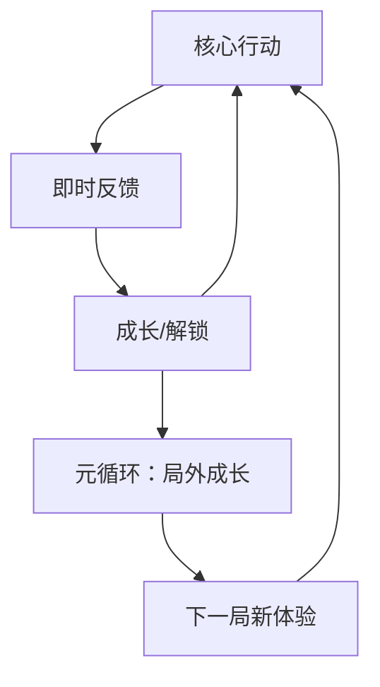
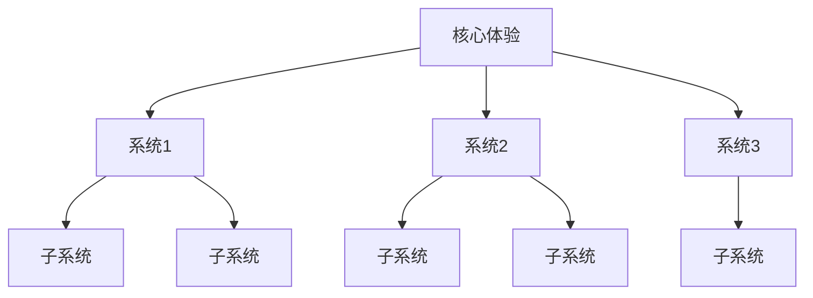
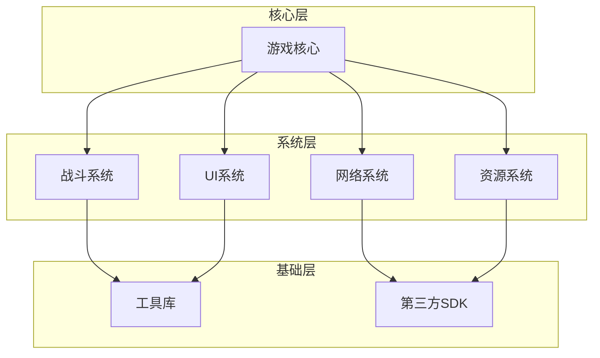
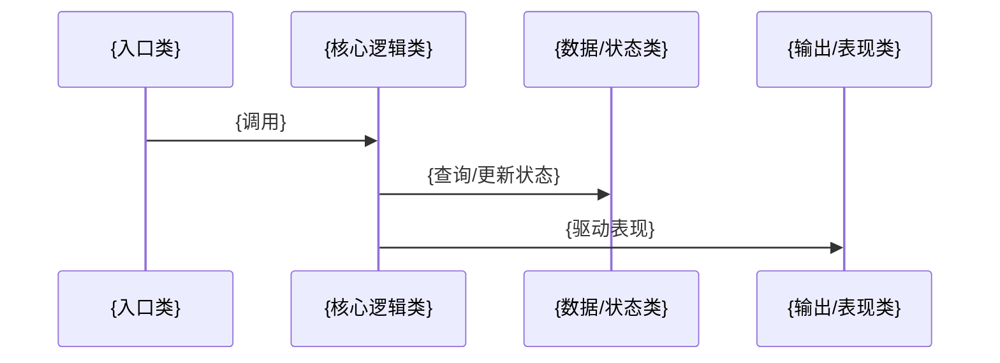

# 《{游戏名}》全维度分析

> 分析模式：{全维度（策划+程序+打通）/ 策划深度分析（无源码）}
> 分析日期：{日期}
> 源码路径：{有/无}

---

# 📋 Part 0：基础信息与概览

## 🎮 游戏基础信息

| 项目 | 内容 |
|------|------|
| **游戏名** | {游戏名} / {英文名} |
| **开发商** | {开发商} |
| **发行商** | {发行商} |
| **发行年份** | {年份} |
| **平台** | {PC / PS5 / Switch / iOS / Android / ...} |
| **类型** | {类型标签} |
| **游玩时长** | {单局时长 / 通关时长} |
| **游玩状态** | ☐ 游玩中 ☐ 通关 ☐ 全成就 ☐ 放弃 |
| **个人评分** | ⭐⭐⭐⭐⭐ (策划) / ⭐⭐⭐⭐⭐ (技术) |

### 商业表现
| 指标 | 数据 |
|------|------|
| **销量/下载量** | {数据，标注来源} |
| **Steam 评价** | {好评率，标注时间} |
| **TapTap 评分** | {评分，标注时间} |
| **收入估算** | {如有} |

---

## 💻 源码项目概览

> {有 sourcePath：输出以下内容；无 sourcePath：写"未提供源代码，以下分析基于网络信息和游玩体验。"}

### 技术栈总览

| 层级 | 技术选型 | 版本 | 选型理由 | 替代方案 |
|------|---------|------|---------|---------|
| **引擎** | {Unity/Unreal/Godot/Cocos/自研} | {版本} | {为什么选} | {还可以选什么} |
| **语言** | {C#/C++/GDScript/TS/...} | {版本} | | |
| **渲染** | {URP/HDRP/Built-in/自定义} | | | |
| **物理** | {PhysX/Box2D/自定义} | | | |
| **网络** | {Photon/Mirror/NetCode/自研} | | | |
| **UI** | {UGUI/UI Toolkit/FairyGUI/自研} | | | |
| **音频** | {内置/FMOD/Wwise} | | | |
| **构建/CI** | {Jenkins/GitHub Actions/手动} | | | |

### 目录结构

```
{源码根目录}/
├── {目录A}/              # {一句话职责说明}
│   ├── {子目录A1}/       # {职责}
│   └── {子目录A2}/       # {职责}
├── {目录B}/              # {一句话职责说明}
├── {目录C}/              # {一句话职责说明}
└── {配置文件}            # {用途}
```

### 代码规模

| 指标 | 数值 |
|------|------|
| **总文件数** | {估算值} |
| **总代码行数（估）** | {估算值} |
| **核心模块占比** | {战斗占X%、UI占Y%、网络占Z%...} |
| **第三方库数量** | {估算} |

---

## 📊 整体评价总览

| 维度 | 评分 | 关键词 |
|------|------|--------|
| 策划设计 | ⭐⭐⭐⭐⭐ | {核心评价} |
| 技术实现 | ⭐⭐⭐⭐⭐ | {核心评价} |
| 策划+程序契合度 | ⭐⭐⭐⭐⭐ | {核心评价} |

> **一句话总结：**{用一句话概括这款游戏从策划和技术两方面的整体印象}

---

# 🎨 Part 1：策划视角 — 游戏设计分析

## 🎯 核心体验

### 一句话定位
{用一句话描述这款游戏的核心体验——玩家在做什么、感受是什么}

### 核心循环



```
[单局循环]
{行动A} → {反馈B} → {成长C} → {更强的行动A}

[元循环]
{局内积累} → {局外解锁/成长} → {下一局新体验}
```

### 记忆点
{列出最让人印象深刻的 3-5 个瞬间或设计}
1. **{记忆点名称}**：{为什么印象深刻，作为设计师看出了什么门道}
2. 
3. 

---

## 🧠 系统架构



### 主要系统拆解

#### {系统名 1}（如：战斗系统）
- **设计目标**：{这个系统想让玩家感受到什么、解决什么体验问题}
- **核心机制**：{具体机制描述}
- **深度来源**：{高手和新手的差距在哪，策略空间在哪}
- **设计亮点**：{值得学习或借鉴的地方}
- **与其它系统的交互**：{这个系统怎么和别的系统协作}

#### {系统名 2}（如：经济/成长系统）
- **设计目标**：
- **核心机制**：
- **深度来源**：
- **设计亮点**：
- **与其它系统的交互**：

#### {系统名 3}（如：关卡/地图设计）
- **设计目标**：
- **核心机制**：
- **深度来源**：
- **设计亮点**：
- **与其它系统的交互**：

#### {系统名 4}（如：社交/排行系统）
- **设计目标**：
- **核心机制**：
- **设计亮点**：

---

## 🎨 体验层分析

### 手感与操控
{操控反馈、手感、节奏感——这是让玩家"爽"的最底层因素。如果适用，包括：输入延迟/响应曲线/打击感/镜头运用/震动反馈}

### 关卡/内容设计
{如何引导玩家、难度曲线、内容密度、惊喜节点、重复可玩性来源}

### 叙事与世界观
{故事讲述方式（线性/非线性/环境叙事）、世界观构建、角色塑造、IP 化潜力}

### 美术与音乐
{视觉风格、音乐如何强化体验、技术与美术的配合（如风格化渲染的优势和代价）}

---

## ⚖️ 设计取舍分析

| 设计决策 | 得到了什么 | 放弃了什么 | 约束条件 |
|---------|-----------|-----------|---------|
| {决策 1} | {优点} | {代价} | {预算/受众/技术/时间} |
| {决策 2} | {优点} | {代价} | |
| {决策 3} | {优点} | {代价} | |
| {决策 4} | {优点} | {代价} | |
| {决策 5} | {优点} | {代价} | |

### 我认为"取舍做错了"的决策
{如果有，直言不讳；如果没有，说明为什么每个取舍在当前约束下都是最优的}

---

## 💡 值得借鉴的设计

1. **{设计点名称}**
   - **是什么**：{描述这个设计}
   - **为什么好**：{好在哪，解决了什么问题}
   - **借鉴到哪**：{具体项目/系统/功能，写清楚怎么落地}
   - **注意事项**：{借鉴时需要注意什么}

2. **{设计点名称}**
   - **是什么**：
   - **为什么好**：
   - **借鉴到哪**：
   - **注意事项**：

3. **{设计点名称}**
   - **是什么**：
   - **为什么好**：
   - **借鉴到哪**：
   - **注意事项**：

---

## ❌ 不足与问题

1. **{问题点}**
   - **问题描述**：{具体是什么问题}
   - **影响**：{对玩家体验的实际影响}
   - **改进方向**：{如果是你的项目，你会怎么改进}

2. **{问题点}**
   - **问题描述**：
   - **影响**：
   - **改进方向**：

3. **{问题点}**
   - **问题描述**：
   - **影响**：
   - **改进方向**：

---

# ⚙️ Part 2：程序视角 — 技术架构与实现分析

> 无源码时跳过本章。

## 技术栈总览与选型分析

### 引擎选型

**选型**：{引擎名 + 版本}

| 维度 | 分析 |
|------|------|
| **为什么选** | {具体原因：团队经验？生态？性能？平台支持？} |
| **替代方案** | {还可以选什么？为什么没选？} |
| **选型约束** | {什么条件限制了这个选择？} |
| **适用性评估** | {这个选择对这款游戏来说合理吗？有更好的吗？} |

### 各层技术选型分析

| 技术层 | 选择 | 评分 | 分析 |
|--------|------|------|------|
| 渲染管线 | | ⭐⭐⭐⭐⭐ | |
| 物理引擎 | | ⭐⭐⭐⭐⭐ | |
| 网络方案 | | ⭐⭐⭐⭐⭐ | |
| UI 框架 | | ⭐⭐⭐⭐⭐ | |
| 资源管理 | | ⭐⭐⭐⭐⭐ | |
| 音频 | | ⭐⭐⭐⭐⭐ | |
| 热更新 | | ⭐⭐⭐⭐⭐ | |

---

## 项目架构

### 模块划分



### 各模块职责

| 模块 | 路径 | 职责 | 核心类 | 依赖 |
|------|------|------|--------|------|
| {模块名} | `{路径}` | {一句话职责} | `{ClassName}` | {依赖哪些模块} |
| {模块名} | `{路径}` | {一句话职责} | `{ClassName}` | |

### 核心设计模式识别

| 设计模式 | 使用位置 | 用途 | 评价 |
|---------|---------|------|------|
| {如：观察者} | `{文件路径}` | {解决什么问题} | {用得恰当吗} |
| {如：对象池} | `{文件路径}` | | |
| {如：状态机} | `{文件路径}` | | |
| {如：命令模式} | `{文件路径}` | | |

### 架构原则总结

| 原则 | 是否遵循 | 证据 | 违反处（如有） |
|------|---------|------|--------------|
| 单一职责 | ✅/❌/⚠️ | `{文件}` — {说明} | |
| 开闭原则 | ✅/❌/⚠️ | | |
| 依赖倒置 | ✅/❌/⚠️ | | |
| 接口隔离 | ✅/❌/⚠️ | | |
| {项目特有的架构原则} | | | |

---

## 核心系统实现分析

> 选择 2-3 个最核心、最有分析价值的系统深入源码级别。

### {核心系统 1}（如：战斗系统）

#### 设计目标与技术挑战
- **策划需求**：{从设计角度，这个系统要实现什么}
- **技术挑战**：{实现上最大的难点是什么}
- **性能要求**：{帧率/延迟/并发等性能指标}

#### 代码结构

```
{系统相关目录/}
├── {文件A}              # {职责}
├── {文件B}              # {职责}
└── {文件C}              # {职责}
```

#### 关键类与数据流



| 类/结构 | 职责 | 关键字段/方法 | 评价 |
|---------|------|-------------|------|
| `{ClassName}` | {职责} | `{方法名}()` — {作用} | {设计好坏} |
| `{ClassName}` | {职责} | | |

#### 状态管理
{这个系统怎么管理状态？一个状态机？状态散落在各处？数据驱动？}
{状态有哪些？状态转移条件是什么？}

#### 设计亮点
1. **{亮点}**：{代码中具体怎么实现的，为什么好}
2. **{亮点}**：

#### 可优化点
1. **{问题}**：{代码位置 + 问题描述 + 改进建议}
2. **{问题}**：

---

### {核心系统 2}（如：UI 系统）

{同上结构}

---

### {核心系统 3}（如：网络同步）

{同上结构}

---

## 性能与工程实践

### 性能优化手段

| 优化点 | 手段 | 代码证据 | 推测效果 |
|--------|------|---------|---------|
| 渲染 | {合批/LOD/剔除/...} | `{文件}` | |
| 内存 | {对象池/资源释放/...} | `{文件}` | |
| CPU | {多线程/算法优化/...} | `{文件}` | |
| 网络 | {协议压缩/增量同步/...} | `{文件}` | |
| 加载 | {异步加载/预加载/...} | `{文件}` | |

### 工程规范评估

| 维度 | 评分 | 说明 |
|------|------|------|
| 命名规范 | ⭐⭐⭐⭐⭐ | {一致吗？风格是什么？} |
| 注释质量 | ⭐⭐⭐⭐⭐ | {有注释吗？有用还是废话？} |
| 测试覆盖 | ⭐⭐⭐⭐⭐ | {有测试吗？覆盖了核心逻辑吗？} |
| CI/CD | ⭐⭐⭐⭐⭐ | {有自动化构建/测试/部署吗？} |
| 文档 | ⭐⭐⭐⭐⭐ | {有 README/架构文档/API 文档吗？} |
| 代码规范 | ⭐⭐⭐⭐⭐ | {有 .editorconfig/lint 规则吗？} |

### 可借鉴的工程实践

1. **{实践}**：{描述 + 代码位置 + 为什么值得借鉴}
2. **{实践}**：

### 应避免的工程问题

1. **{问题}**：{描述 + 代码位置 + 为什么是问题 + 应该怎么做}
2. **{问题}**：

---

## 技术亮点

{独特的、巧妙的技术实现，值得同行学习的}

1. **{亮点名称}**
   - **是什么**：{描述这个技术实现}
   - **代码位置**：`{文件路径}`
   - **为什么巧妙**：{好在哪，解决了什么难点}
   - **可迁移性**：{这个技术能用到其他项目吗？}

2. **{亮点名称}**
   - **是什么**：
   - **代码位置**：
   - **为什么巧妙**：
   - **可迁移性**：

---

## 技术债与改进建议

| 优先级 | 问题 | 位置 | 影响 | 改进建议 | 预估成本 |
|--------|------|------|------|---------|---------|
| 🔴 高 | {问题} | `{路径}` | {影响} | {建议} | {人天} |
| 🟡 中 | {问题} | `{路径}` | {影响} | {建议} | |
| 🟢 低 | {问题} | `{路径}` | {影响} | {建议} | |

### 如果是我接手这个项目
{用一段话说明：第一优先级做什么、代码重写的边界在哪、哪些可以保留}

---

# 🔗 Part 3：策划 ↔ 程序打通

> 无源码时跳过本章。

## 设计意图 → 代码实现映射表

| 策划需求 | 代码实现位置 | 实现方式 | 匹配度 | 偏差说明 |
|---------|-------------|---------|--------|---------|
| {需求 1} | `{文件}` — `{类/方法}` | {怎么实现的} | ✅ 完美匹配 | — |
| {需求 2} | `{文件}` — `{类/方法}` | {怎么实现的} | ⚠️ 有偏差 | {为什么有偏差} |
| {需求 3} | `{文件}` — `{类/方法}` | {怎么实现的} | ❌ 完全不同 | {原因分析} |

## 技术约束 → 设计影响

| 技术约束 | 影响的设计决策 | 详细分析 |
|---------|--------------|---------|
| {如：移动端内存限制} | {导致某个设计简化} | {具体怎么影响的} |
| {如：帧同步确定性要求} | {限制了某些设计} | |

### 重点案例分析

{选 1-2 个"技术约束反向塑造设计"的典型案例展开分析}

**案例：{标题}**
- **技术约束**：{什么约束}
- **原来的设计设想**：{如果没有这个约束，设计会是什么样}
- **实际设计**：{被约束塑造成了什么样}
- **结果评估**：{这个妥协是损失还是反而产生了更好的设计？}

## 设计文档 vs 代码现实

{如果有公开的设计文档/GDD/开发者博客，对比实际代码实现的差异}

| 设计承诺 | 代码现实 | 差异分析 |
|---------|---------|---------|
| {设计文档中的描述} | {代码中的实际实现} | {为什么不同？是优化还是妥协？} |

---

# 📊 Part 4：综合总结

## 🎨 策划收获

### 最大的收获
{作为游戏设计师，玩/分析完这款游戏最大的收获是什么}

### 改变了什么认知
{分析前后，对游戏设计的哪个方面的认知发生了变化}

**分析前我认为**：{旧认知}
**分析后我认识到**：{新认知}
**关键转折点**：{什么让我改变了看法}

---

## ⚙️ 技术收获

> 无源码时，此节改为"技术观察（基于网络信息推测，未验证）"

### 最大的收获
{作为工程师，分析完源码最大的收获是什么}

### 改变了什么认知
{分析前后，对技术实现的哪个方面的认知发生了变化}

**分析前我认为**：{旧认知}
**分析后我认识到**：{新认知}
**关键转折点**：{什么让我改变了看法}

---

## 📝 核心结论

{用 2-3 句话总结这款游戏的本质：它为什么成功（或失败），策划和技术的核心价值在哪里，对开发者最大的启示是什么}

1. 
2. 
3. 

---

## 🔗 知识关联

### 与已读书籍的关联

| 书籍 | 关联点 | 关联类型 | 关联强度 | 详细说明 |
|------|--------|---------|---------|---------|
| **{书名}** | {具体的关联点} | 验证/挑战/延伸 | ⭐⭐⭐⭐⭐ | {这款游戏怎么验证/挑战/延伸了书里的观点} |
| **{书名}** | {具体的关联点} | | ⭐⭐⭐⭐ | |

### 与其他游戏的关联

| 游戏 | 关系类型 | 关联说明 |
|------|---------|---------|
| **{游戏名}** | 同类对比 / 设计传承 / 技术传承 / 反例 | {具体对比或关联描述} |
| **{游戏名}** | | |

### 对自身项目的启发

| 启发 | 来源（策划/技术） | 应用项目 | 应用系统/文件 | 具体做法 |
|------|-----------------|---------|-------------|---------|
| {启发点} | {策划/技术} | {项目名} | {具体位置} | {怎么做} |
| {启发点} | {策划/技术} | {项目名} | {具体位置} | {怎么做} |

---

## 📋 分析质量自检

| 维度 | 目标 | 实际 | 达标 |
|------|------|------|------|
| 策划 L4+ 洞察 | ≥3 | {实际数量} | ✅/❌ |
| 技术 L4+ 洞察 | ≥2 | {实际数量} | ✅/❌ |
| 打通 L4+ 洞察 | ≥1 | {实际数量} | ✅/❌ |
| 整体 L5 认知改变 | ≥1 | {实际数量} | ✅/❌ |
| 策划自我审查 7 项 | 全部通过 | | ✅/❌ |
| 技术自我审查 6 项 | 全部通过 | | ✅/❌ |
| 打通审查 3 项 | 全部通过 | | ✅/❌ |
| 禁止写法检查 | 0 违规 | | ✅/❌ |

---

## 📎 信息来源

| 来源 | 获取情况 | 备注 |
|------|---------|------|
| Steam | {✅ 已获取 / ❌ 无结果 / ⚠️ 受限} | |
| TapTap | | |
| B站 | | |
| 其他平台 | | |
| 源代码 | {✅ 已分析 / ❌ 未提供} | |

---

**分析创建时间**：{日期}
**最后更新**：{日期}
