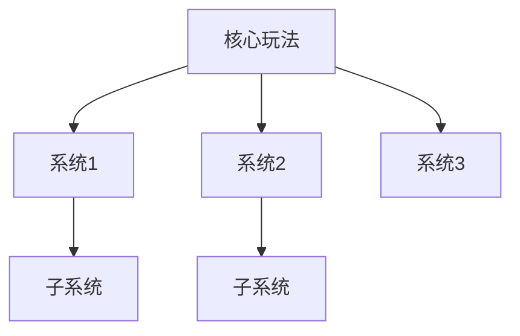

# 《{游戏名}》游戏分析

## 🎮 基础信息
- **游戏名**: {游戏名}
- **开发商**: {开发商}
- **发行商**: {发行商}
- **发行年份**: {年份}
- **平台**: {PC / PS5 / Switch / ...}
- **类型**: {类型标签}
- **游玩时长**: {小时}
- **游玩状态**: ☐ 游玩中 ☐ 通关 ☐ 白金/全成就 ☐ 放弃
- **个人评分**: ⭐⭐⭐⭐⭐ (1-5星)

---

## 🎯 核心体验

### 一句话定位
{用一句话描述这款游戏的核心体验是什么，玩家在做什么、感受是什么}

### 核心循环
```
[主循环]
{行动A} → {反馈B} → {成长C} → {更强的行动A}

[元循环]
{局内积累} → {局外解锁/成长} → {下一局新体验}
```

### 记忆点
{列出最让人印象深刻的 3-5 个瞬间或设计，可以是某个关卡、某次战斗、某个剧情节点}
1. 
2. 
3. 

---

## 🧠 系统架构



### 主要系统拆解

#### {系统名1}（如：战斗系统）
- **设计目标**: {这个系统想让玩家感受到什么}
- **核心机制**: {具体机制描述}
- **深度来源**: {是什么让这个系统有深度，高手和新手的差距在哪}
- **设计亮点**: {值得学习或借鉴的地方}

#### {系统名2}（如：关卡/地图设计）
- **设计目标**: 
- **核心机制**: 
- **深度来源**: 
- **设计亮点**: 

#### {系统名3}（如：成长/养成系统）
- **设计目标**: 
- **核心机制**: 
- **深度来源**: 
- **设计亮点**: 

---

## 🎨 体验层分析

### 手感与操控
{描述操控反馈、手感、节奏感——这是让玩家"爽"的最底层因素}

### 关卡/内容设计
{如何引导玩家、难度曲线、内容密度、惊喜节点}

### 叙事与世界观
{故事讲述方式（线性/非线性/环境叙事）、世界观构建、角色塑造}

### 美术与音乐
{视觉风格、音乐如何强化体验、二者与核心玩法的配合}

---

## ⚖️ 设计取舍分析

| 设计决策 | 得到了什么 | 放弃了什么 |
|---------|-----------|-----------|
| {决策1} | {优点} | {代价} |
| {决策2} | {优点} | {代价} |
| {决策3} | {优点} | {代价} |

---

## 💡 值得借鉴的设计

1. **{设计点}**: {描述这个设计，以及为什么值得借鉴}
2. **{设计点}**: 
3. **{设计点}**: 

---

## ❌ 不足与问题

1. **{问题点}**: {描述问题，以及可能的改进方向}
2. **{问题点}**: 
3. **{问题点}**: 

---

## 🔗 知识关联

### 与已读书籍的关联
- **{书名}**: {关联点} | 关联强度: ⭐⭐⭐⭐
- **{书名}**: {关联点} | 关联强度: ⭐⭐⭐

### 与其他游戏的关联
- **{游戏名}**: {对比或关联描述} | 类型: 同类对比 / 设计传承 / 反例

### 对自身项目的启发
{如果你在做游戏开发，这款游戏给了你什么具体的启发或可以直接借鉴的东西}

---

## 📊 总结

### 最大的收获
{玩完这款游戏，作为开发者最大的收获是什么}

### 核心结论
{用 2-3 句话总结这款游戏的本质：它为什么成功（或失败），核心价值在哪里}

---

**分析创建时间**: {日期}
**最后更新**: {日期}
